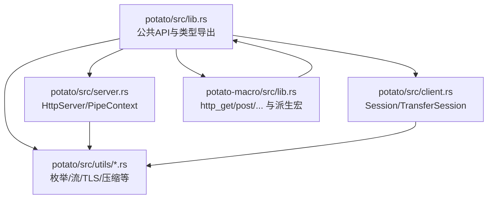
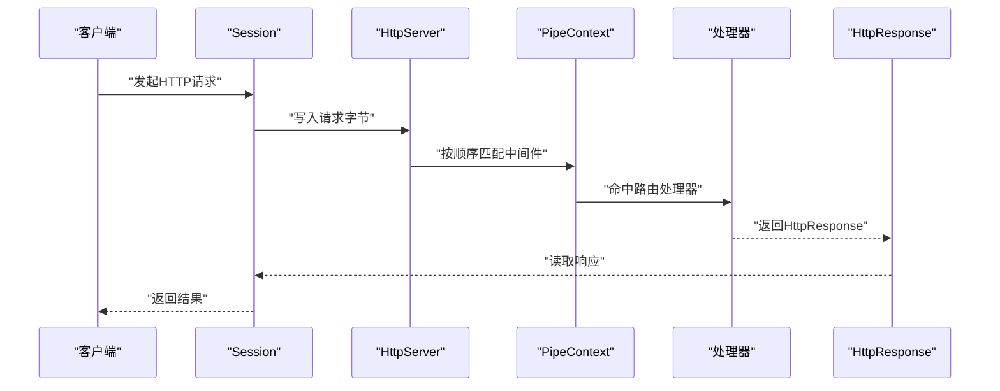
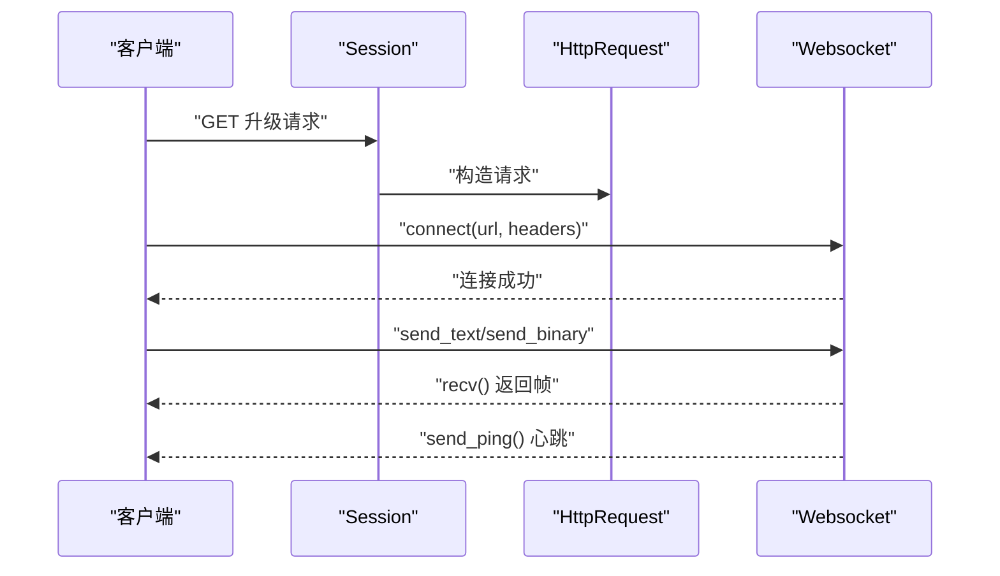
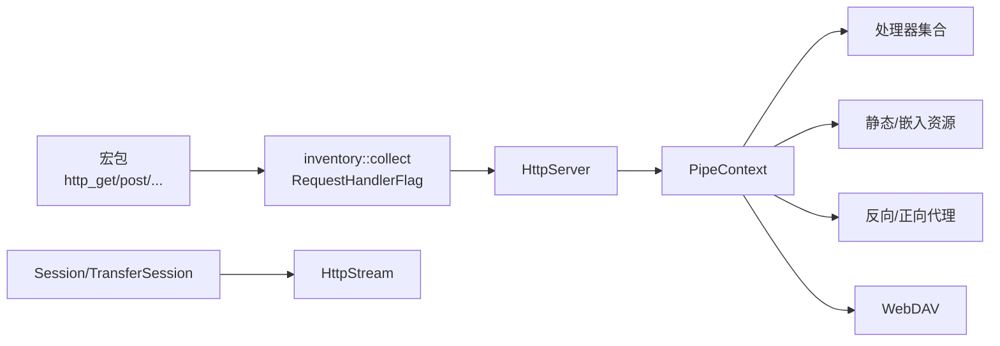

# API参考

<cite>
**本文引用的文件**
- [Cargo.toml](file://potato/Cargo.toml)
- [lib.rs](file://potato/src/lib.rs)
- [client.rs](file://potato/src/client.rs)
- [server.rs](file://potato/src/server.rs)
- [global_config.rs](file://potato/src/global_config.rs)
- [lib.rs（宏）](file://potato-macro/src/lib.rs)
- [utils/enums.rs](file://potato/src/utils/enums.rs)
- [utils/tcp_stream.rs](file://potato/src/utils/tcp_stream.rs)
- [utils/number.rs](file://potato/src/utils/number.rs)
- [00_http_server.rs](file://examples/server/00_http_server.rs)
- [08_websocket_server.rs](file://examples/server/08_websocket_server.rs)
- [00_client.rs](file://examples/client/00_client.rs)
</cite>

## 目录
1. [简介](#简介)
2. [项目结构](#项目结构)
3. [核心组件](#核心组件)
4. [架构总览](#架构总览)
5. [详细组件分析](#详细组件分析)
6. [依赖关系分析](#依赖关系分析)
7. [性能考量](#性能考量)
8. [故障排查指南](#故障排查指南)
9. [结论](#结论)
10. [附录](#附录)

## 简介
本文件为 Potato 框架的完整 API 参考，覆盖以下方面：
- HTTP 客户端与服务器 API 的方法、参数与返回值
- 路由注册、中间件管线与事件处理
- 宏系统（HTTP 方法注解、嵌入资源、标准头派生）
- WebSocket API（连接、帧收发、心跳与错误）
- 数据结构定义（字段说明、典型用法）
- 错误类型与异常处理策略

## 项目结构
- 库入口导出：在库根模块中统一 re-export 客户端、服务器、宏、工具等模块，并暴露常用类型别名与工具。
- 宏包：提供过程宏，用于声明 HTTP 处理器、生成标准头枚举与派生、嵌入静态资源等。
- 工具模块：包含枚举、TCP 流适配、字节压缩扩展、数字与字符串工具等。

图表来源
- [lib.rs](file://potato/src/lib.rs#L1-L16)
- [server.rs](file://potato/src/server.rs#L1-L50)
- [client.rs](file://potato/src/client.rs#L1-L30)
- [lib.rs（宏）](file://potato-macro/src/lib.rs#L1-L30)

章节来源
- [lib.rs](file://potato/src/lib.rs#L1-L16)
- [Cargo.toml](file://potato/Cargo.toml#L16-L76)

## 核心组件
- 请求/响应模型
  - HttpRequest：封装方法、路径、查询、头部、主体、解析后的键值对与文件域等。
  - HttpResponse：封装版本、状态码、头部、正文。
- 服务器管线
  - PipeContext：可组合的中间件管线，支持处理器、静态文件、嵌入资源、反向代理、WebDAV、Jemalloc 等。
  - HttpServer：监听地址、配置管线、优雅关闭信号。
- 客户端
  - Session：会话级 TCP/TLS 连接复用，支持多方法请求与 JSON/二进制体。
  - TransferSession：正向/反向代理、WebSocket 转发、SSH 跳板（可选）。
- 宏系统
  - http_get/post/put/delete/options/head/patch/trace：自动注册路由与参数解析。
  - StandardHeader：派生标准头枚举与应用方法。
  - embed_dir：将目录嵌入为内存资源。
- WebSocket
  - Websocket：基于底层 HttpStream 的 WebSocket 客户端/服务端升级与帧收发。
- 全局配置与鉴权
  - ServerConfig：JWT 密钥、WS 心跳周期设置。
  - ServerAuth：签发与校验 JWT。

章节来源
- [lib.rs](file://potato/src/lib.rs#L385-L599)
- [lib.rs](file://potato/src/lib.rs#L880-L951)
- [server.rs](file://potato/src/server.rs#L28-L767)
- [client.rs](file://potato/src/client.rs#L101-L157)
- [lib.rs（宏）](file://potato-macro/src/lib.rs#L26-L299)
- [global_config.rs](file://potato/src/global_config.rs#L18-L63)

## 架构总览
下图展示从客户端到服务器再到资源/代理的典型调用链路与组件交互。

图表来源
- [client.rs](file://potato/src/client.rs#L131-L140)
- [server.rs](file://potato/src/server.rs#L362-L377)
- [lib.rs](file://potato/src/lib.rs#L124-L175)

## 详细组件分析

### HTTP 客户端 API
- Session
  - new_request(method, url) -> HttpRequest
    - 功能：从 URL 解析主机、是否 HTTPS、端口；构造基础请求并注入 User-Agent。
    - 参数：方法、URL 字符串
    - 返回：HttpRequest
  - do_request(req) -> HttpResponse
    - 功能：写入请求到已建立的会话流，读取响应。
    - 参数：HttpRequest
    - 返回：HttpResponse
  - get/post/put/delete/head/options/connect/patch/trace
    - 功能：快捷方法，支持二进制体、JSON 对象或 JSON 字符串体。
    - 参数：URL、可选请求体、请求头列表
    - 返回：HttpResponse
  - TLS 支持：当启用 feature=tls 时，自动建立 TLS 连接。
- TransferSession
  - from_reverse_proxy(prefix, dest_url) -> Self
  - from_forward_proxy() -> Self
  - with_ssh_jumpbox(info) -> Result
  - transfer(req, modify_content) -> HttpResponse
    - 功能：反向/正向代理转发；支持 gzip 内容替换与 Content-Length 更新；WebSocket 转发。
  - transfer_websocket(req) -> HttpResponse
    - 功能：将客户端 WS 升级与目标 WS 进行双向转发。

章节来源
- [client.rs](file://potato/src/client.rs#L110-L157)
- [client.rs](file://potato/src/client.rs#L224-L592)

### HTTP 服务器 API
- HttpServer
  - new(addr) -> Self
  - configure(callback) -> ()
    - 功能：通过回调构建 PipeContext，串联中间件。
  - shutdown_signal() -> Sender
    - 功能：注册优雅关闭信号。
  - serve_http() -> Result
    - 功能：启动监听，处理请求。
- PipeContext
  - new()/empty() -> Self
  - use_handlers(allow_cors: bool)
  - use_location_route(url_path, loc_path)
  - use_embedded_route(url_path, assets)
  - use_custom(callback)
  - use_reverse_proxy(url_path, proxy_url, modify_content)
  - use_openapi(url_path)
  - use_webdav_localfs(url_path, local_path)
  - use_webdav_memfs(url_path)
  - use_jemalloc(url_path)
  - handle_request(req, skip) -> HttpResponse
- OpenAPI 文档
  - 自动扫描处理器，生成 index.json 与静态资源。
- 静态文件与条件预检
  - 基于 ETag 与 If-* 条件头返回 304/412 或直接返回文件内容。

章节来源
- [server.rs](file://potato/src/server.rs#L769-L800)
- [server.rs](file://potato/src/server.rs#L54-L131)
- [server.rs](file://potato/src/server.rs#L28-L767)
- [server.rs](file://potato/src/server.rs#L133-L331)

### 宏系统 API
- http_get/post/put/delete/options/head/patch/trace
  - 属性：
    - path: 路由路径（必须以 / 开头）
    - auth_arg: 标记鉴权参数名（仅支持 String 类型），自动从 Authorization: Bearer 中提取并校验 JWT
  - 参数解析规则：
    - PostFile：从 multipart 表单文件域解析
    - 基础标量：优先从 body pairs（JSON/表单）解析，再回退到 URL 查询参数；失败则返回错误响应
  - 返回值包装：
    - () -> HttpResponse::text("ok")
    - Result<(), E> -> 成功返回 ok，失败返回错误响应
    - Result<HttpResponse, E> -> 直接返回
    - HttpResponse -> 直接返回
- StandardHeader
  - 派生后生成枚举项与转换函数，并在 HttpRequest 上提供 apply_header 方法
- embed_dir
  - 将目录嵌入为内存资源，供 use_embedded_route 使用

章节来源
- [lib.rs（宏）](file://potato-macro/src/lib.rs#L26-L299)
- [lib.rs（宏）](file://potato-macro/src/lib.rs#L345-L399)
- [lib.rs（宏）](file://potato-macro/src/lib.rs#L332-L343)

### WebSocket API
- 服务端升级
  - HttpRequest::is_websocket() -> bool
  - HttpRequest::upgrade_websocket() -> Websocket
- 客户端连接
  - Websocket::connect(url, headers) -> Websocket
- 帧收发
  - recv() -> WsFrame（Text/Binary）
  - send_text()/send_binary()/send()
  - send_ping()
- 心跳与超时
  - 通过 ServerConfig::set_ws_ping_duration 设置心跳周期
  - recv() 内部在超时前自动发送 Ping 并等待 Pong

图表来源
- [lib.rs](file://potato/src/lib.rs#L560-L579)
- [lib.rs](file://potato/src/lib.rs#L207-L359)
- [client.rs](file://potato/src/client.rs#L475-L592)

章节来源
- [lib.rs](file://potato/src/lib.rs#L203-L359)
- [global_config.rs](file://potato/src/global_config.rs#L28-L34)

### 数据结构定义与使用示例

- HttpRequest
  - 字段：method、url_path、url_query、version、headers、body、body_pairs、body_files、exts
  - 关键方法：from_url、set_header/get_header、get_uri、from_headers_part、from_stream、check_precondition_headers、is_websocket、upgrade_websocket
  - 使用示例：见“WebSocket 服务端升级”流程
- HttpResponse
  - 字段：version、http_code、headers、body
  - 快捷构造：html/css/csv/js/text/json/xml/png、new/add_header、error/not_found/empty/from_file/from_mem_file
  - 使用示例：见“HTTP 服务器 API”中的处理器返回
- Websocket
  - 字段：stream（Arc<Mutex<HttpStream>>）
  - 方法：connect、recv、send、send_text、send_binary、send_ping
- PipeContextItem
  - Handlers、LocationRoute、EmbeddedRoute、FinalRoute、Custom、ReverseProxy、Webdav、Jemalloc
- ServerConfig/ServerAuth
  - ServerConfig：set_jwt_secret/get_jwt_secret、set_ws_ping_duration/get_ws_ping_duration
  - ServerAuth：jwt_issue/jwt_check

章节来源
- [lib.rs](file://potato/src/lib.rs#L385-L599)
- [lib.rs](file://potato/src/lib.rs#L880-L951)
- [lib.rs](file://potato/src/lib.rs#L203-L359)
- [server.rs](file://potato/src/server.rs#L40-L52)
- [global_config.rs](file://potato/src/global_config.rs#L18-L63)

### 错误类型与异常处理
- 错误来源
  - 网络与 I/O：连接失败、读写失败、连接关闭
  - 解析：HTTP 头部/URI/日期解析失败
  - 鉴权：Authorization 缺失或 JWT 校验失败
  - 参数：缺少必需参数、类型不匹配
- 处理策略
  - 客户端：Session/TransferSession 在错误时返回错误响应或抛出错误
  - 服务器：处理器返回 HttpResponse 或 Result<HttpResponse>；未匹配路由返回 404；条件预检返回 304/412
  - WebSocket：收到 close 帧或超时错误时终止循环

章节来源
- [client.rs](file://potato/src/client.rs#L131-L140)
- [server.rs](file://potato/src/server.rs#L403-L407)
- [lib.rs](file://potato/src/lib.rs#L761-L857)

## 依赖关系分析
- 组件耦合
  - HttpServer 依赖 PipeContext 与 RequestHandlerFlag 注册表
  - Session/TransferSession 依赖 HttpStream（TCP/TLS/Duplex）
  - 宏系统生成 inventory::collect(RequestHandlerFlag)，驱动服务器路由分发
- 外部依赖
  - Tokio 异步运行时、httparse 解析、http 库、jsonwebtoken、rustls/webpki（可选）、russh（SSH 跳板，可选）、dav-server（WebDAV，可选）

图表来源
- [lib.rs（宏）](file://potato-macro/src/lib.rs#L290-L296)
- [lib.rs](file://potato/src/lib.rs#L175-L175)
- [server.rs](file://potato/src/server.rs#L28-L38)
- [client.rs](file://potato/src/client.rs#L62-L99)
- [utils/tcp_stream.rs](file://potato/src/utils/tcp_stream.rs#L11-L18)

章节来源
- [Cargo.toml](file://potato/Cargo.toml#L16-L76)

## 性能考量
- 连接复用：Session 会根据主机/协议/端口缓存会话，减少握手开销
- 内容压缩：客户端/代理支持 gzip 解压与重写，降低带宽
- ETag 条件请求：服务器对静态文件与嵌入资源生成 ETag，命中 304 减少传输
- TLS 可选：非 TLS 构建下禁用 TLS，避免无用依赖
- WebSocket 心跳：通过配置周期性 Ping/Pong，维持长连健康

## 故障排查指南
- 404 未找到
  - 检查路由是否正确注册（宏属性 path 是否以 / 开头）
  - 检查 PipeContext 是否包含 use_handlers/use_location_route/use_embedded_route/use_reverse_proxy
- 412/304 条件失败/未修改
  - 检查 If-Match/If-None-Match/If-Modified-Since 等条件头
  - 确认 ETag 生成逻辑与资源实际变更
- WebSocket 握手失败
  - 确认请求头包含 Connection: Upgrade、Upgrade: websocket、Sec-WebSocket-Version: 13、Sec-WebSocket-Key 非空
  - 服务端 upgrade_websocket 前需确保 is_websocket 返回真
- TLS 相关错误
  - 非 feature=tls 构建下访问 HTTPS 会报错
  - 证书校验失败请检查根证书与 DNS 名称
- 代理转发异常
  - 检查目标 URL 与路径前缀替换逻辑
  - gzip 内容替换与 Content-Length 更新是否生效

章节来源
- [server.rs](file://potato/src/server.rs#L403-L407)
- [lib.rs](file://potato/src/lib.rs#L532-L558)
- [client.rs](file://potato/src/client.rs#L275-L473)

## 结论
Potato 提供了简洁高效的 HTTP 客户端与服务器能力，配合宏系统实现零样板路由与参数解析；通过可插拔的中间件管线支持静态资源、OpenAPI、WebDAV、反向代理与 Jemalloc 等特性；WebSocket 支持完善，具备条件预检与心跳机制。建议在生产环境合理配置 TLS、鉴权与日志，并利用 ETag 与压缩提升性能。

## 附录

### 示例入口
- 服务器示例
  - 最小 HTTP 服务器：见 [00_http_server.rs](file://examples/server/00_http_server.rs#L1-L12)
  - WebSocket 服务器：见 [08_websocket_server.rs](file://examples/server/08_websocket_server.rs#L1-L43)
- 客户端示例
  - GET 请求示例：见 [00_client.rs](file://examples/client/00_client.rs#L1-L7)