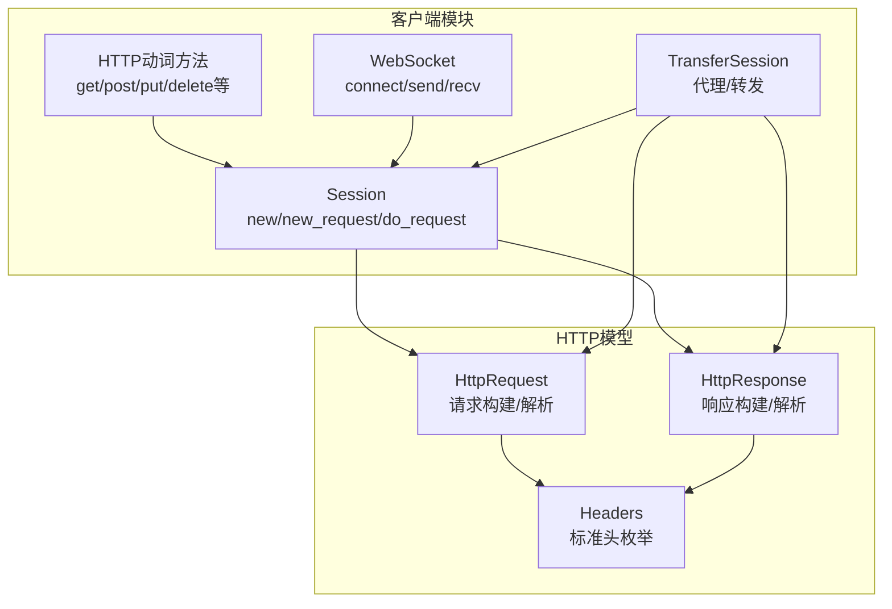
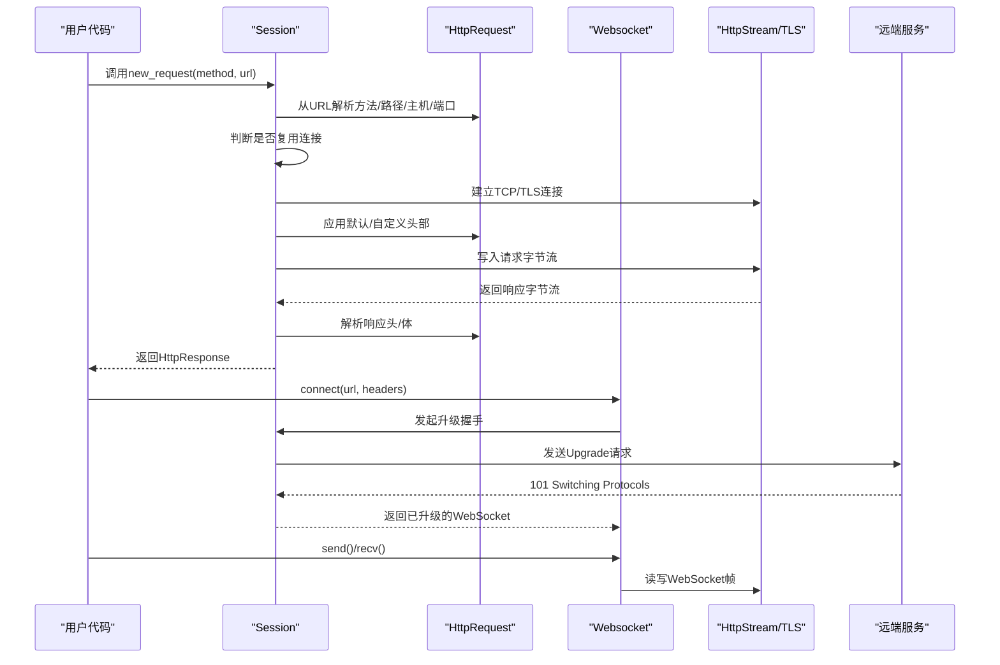
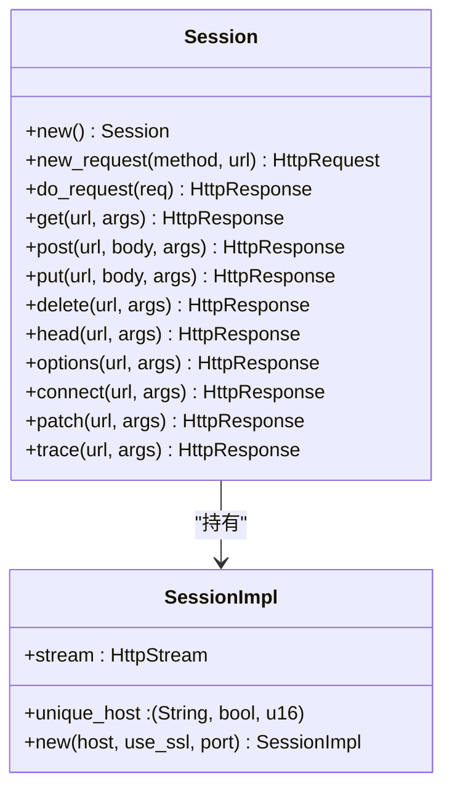
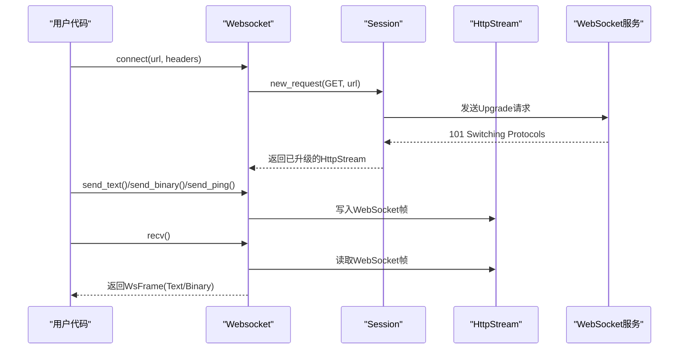
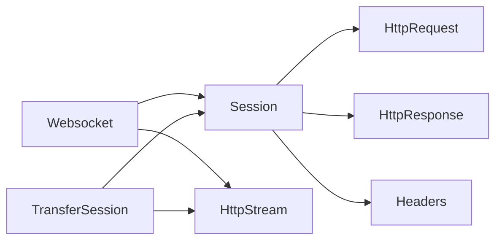

# HTTP客户端API

<cite>
**本文引用的文件列表**
- [client.rs](file://potato/src/client.rs)
- [lib.rs](file://potato/src/lib.rs)
- [refstr.rs](file://potato/src/utils/refstr.rs)
- [00_client.rs](file://examples/client/00_client.rs)
- [01_client_with_arg.rs](file://examples/client/01_client_with_arg.rs)
- [02_client_session.rs](file://examples/client/02_client_session.rs)
- [03_websocket_client.rs](file://examples/client/03_websocket_client.rs)
- [06_client.md](file://docs/guide/06_client.md)
</cite>

## 目录
1. [简介](#简介)
2. [项目结构](#项目结构)
3. [核心组件](#核心组件)
4. [架构总览](#架构总览)
5. [详细组件分析](#详细组件分析)
6. [依赖关系分析](#依赖关系分析)
7. [性能考量](#性能考量)
8. [故障排查指南](#故障排查指南)
9. [结论](#结论)
10. [附录：API参考与示例](#附录api参考与示例)

## 简介
本文件系统化梳理Potato框架中的HTTP客户端API，覆盖以下主题：
- Session结构体及其公共方法：new()、new_request()、do_request()以及基于宏生成的HTTP动词方法（如get、post、put、delete等）
- 请求构建：请求头设置、查询参数添加、请求体构造（含JSON、表单、二进制）
- WebSocket客户端：connect()、send()、recv()等完整API规范
- 错误处理与异常类型说明
- 实际使用示例与最佳实践

## 项目结构
与HTTP客户端API直接相关的模块与文件：
- 客户端实现：potato/src/client.rs
- HTTP模型与WebSocket定义：potato/src/lib.rs
- 请求头枚举与标准头常量：potato/src/utils/refstr.rs
- 示例与文档：examples/client/* 与 docs/guide/06_client.md

图表来源
- [client.rs](file://potato/src/client.rs#L101-L157)
- [lib.rs](file://potato/src/lib.rs#L203-L375)
- [lib.rs](file://potato/src/lib.rs#L384-L580)
- [lib.rs](file://potato/src/lib.rs#L880-L1202)
- [refstr.rs](file://potato/src/utils/refstr.rs#L32-L131)

章节来源
- [client.rs](file://potato/src/client.rs#L101-L157)
- [lib.rs](file://potato/src/lib.rs#L203-L375)
- [lib.rs](file://potato/src/lib.rs#L384-L580)
- [lib.rs](file://potato/src/lib.rs#L880-L1202)
- [refstr.rs](file://potato/src/utils/refstr.rs#L32-L131)

## 核心组件
- Session：客户端会话，负责建立连接、复用连接、发送请求、接收响应
- HttpRequest/HttpResponse：HTTP请求/响应的数据结构与序列化/反序列化逻辑
- Headers：标准HTTP头枚举，统一请求头键名与值的表达
- Websocket：WebSocket客户端，支持文本/二进制帧收发与心跳保活
- TransferSession：代理/转发会话，支持HTTP与WebSocket的转发与内容替换

章节来源
- [client.rs](file://potato/src/client.rs#L101-L157)
- [lib.rs](file://potato/src/lib.rs#L203-L375)
- [lib.rs](file://potato/src/lib.rs#L384-L580)
- [lib.rs](file://potato/src/lib.rs#L880-L1202)
- [refstr.rs](file://potato/src/utils/refstr.rs#L32-L131)

## 架构总览
HTTP客户端的整体调用链路如下：

图表来源
- [client.rs](file://potato/src/client.rs#L110-L140)
- [lib.rs](file://potato/src/lib.rs#L203-L375)
- [lib.rs](file://potato/src/lib.rs#L880-L1202)

## 详细组件分析

### Session结构体与核心方法
- new()：创建空会话，内部无连接状态
- new_request(method, url)：从URL解析出方法、路径、主机、端口；若与当前会话不同主机/协议/端口则建立新连接；应用默认User-Agent
- do_request(req)：写入请求字节流至连接，从流中读取响应，返回HttpResponse
- 动词方法：通过宏生成的get/post/put/delete/head/options/connect/patch/trace等，均以Session实例方法提供；部分方法还提供JSON便捷重载（如post_json、put_json）

图表来源
- [client.rs](file://potato/src/client.rs#L101-L157)
- [client.rs](file://potato/src/client.rs#L62-L99)

章节来源
- [client.rs](file://potato/src/client.rs#L101-L157)

### HTTP方法与参数说明
- get(url, args)：args为Headers数组，用于设置请求头
- post(url, body, args)：body为字节数组，args为Headers数组
- post_json(url, json_value, args)：自动设置Content-Type为application/json
- post_json_str(url, json_str, args)：同上，但传入字符串
- put/delete/head/options/connect/patch/trace：与post类似，分别对应相应HTTP方法
- 参数与返回值
  - 参数：url为字符串，args为Vec<Headers>；部分方法额外接受body（Vec<u8>/String/serde_json::Value）
  - 返回值：anyhow::Result<HttpResponse>，成功时返回HttpResponse对象，失败时返回错误

章节来源
- [client.rs](file://potato/src/client.rs#L148-L156)
- [client.rs](file://potato/src/client.rs#L191-L199)

### 请求头设置与查询参数
- 请求头设置：通过Headers枚举或Headers::Custom设置；Headers由StandardHeader宏生成，覆盖常见标准头
- 查询参数：HttpRequest::from_url解析URL中的查询串，形成url_query映射；HttpRequest::query_string可生成查询字符串
- 内容类型与请求体：HttpRequest支持ApplicationJson、ApplicationXWwwFormUrlencoded、MultipartFormData三种常见类型，自动解析为body_pairs或body_files

章节来源
- [refstr.rs](file://potato/src/utils/refstr.rs#L32-L131)
- [lib.rs](file://potato/src/lib.rs#L415-L425)
- [lib.rs](file://potato/src/lib.rs#L465-L477)
- [lib.rs](file://potato/src/lib.rs#L622-L697)

### WebSocket客户端API
- connect(url, headers)：发起WebSocket握手，校验101状态码，返回已升级的Websocket实例
- send()/send_text()/send_binary()/send_ping()：发送不同类型的帧
- recv()：接收帧，支持分片拼接、Ping/Pong自动应答、超时心跳保活

图表来源
- [lib.rs](file://potato/src/lib.rs#L203-L375)

章节来源
- [lib.rs](file://potato/src/lib.rs#L203-L375)

### 错误处理与异常类型
- 返回类型：所有HTTP与WebSocket方法均返回anyhow::Result<T>，便于链式错误传播
- 常见错误场景
  - 连接失败：new()与SessionImpl::new()在建立TCP/TLS连接时可能失败
  - 握手失败：WebSocket connect()若非101状态码会报错
  - 流读写错误：do_request/recv/send过程中可能因连接中断或格式错误抛错
  - 非法参数：如不支持的TLS构建、不识别的HTTP方法等
- 建议处理策略：在调用方捕获anyhow::Result，结合上下文信息进行日志记录与重试

章节来源
- [client.rs](file://potato/src/client.rs#L68-L98)
- [client.rs](file://potato/src/client.rs#L131-L140)
- [lib.rs](file://potato/src/lib.rs#L208-L232)
- [lib.rs](file://potato/src/lib.rs#L285-L308)

## 依赖关系分析
- Session依赖HttpRequest/HttpResponse进行请求/响应的构建与解析
- Headers通过HeaderItem统一标准头名称，减少字符串拼写错误
- WebSocket依赖Session完成握手与升级，随后直接操作底层HttpStream
- TransferSession在代理/转发场景下，复用连接池并支持内容替换

图表来源
- [client.rs](file://potato/src/client.rs#L101-L157)
- [lib.rs](file://potato/src/lib.rs#L203-L375)
- [lib.rs](file://potato/src/lib.rs#L384-L580)
- [lib.rs](file://potato/src/lib.rs#L880-L1202)
- [refstr.rs](file://potato/src/utils/refstr.rs#L32-L131)

章节来源
- [client.rs](file://potato/src/client.rs#L101-L157)
- [lib.rs](file://potato/src/lib.rs#L203-L375)
- [lib.rs](file://potato/src/lib.rs#L384-L580)
- [lib.rs](file://potato/src/lib.rs#L880-L1202)
- [refstr.rs](file://potato/src/utils/refstr.rs#L32-L131)

## 性能考量
- 连接复用：Session在new_request中检测主机/协议/端口一致性，避免重复握手
- 流式解析：HttpRequest/HttpResponse采用分块读取与按需解析，降低内存占用
- 压缩：HttpResponse支持gzip压缩，自动设置Content-Encoding并在合适场景启用
- 并发：WebSocket recv()内置超时与心跳保活，避免阻塞等待

[本节为通用性能建议，不直接分析具体文件]

## 故障排查指南
- 无法建立连接
  - 检查URL是否正确、端口是否开放
  - 若启用TLS，确认编译特性与证书根配置
- 握手失败（WebSocket）
  - 确认服务端支持Upgrade/WebSocket
  - 检查Sec-WebSocket-*相关头部是否齐全
- 响应解析异常
  - 关注Content-Length/Transfer-Encoding组合
  - 检查gzip解压与字符集编码
- 会话复用问题
  - 确认请求的主机/协议/端口一致
  - 如需跨域，请使用独立Session或TransferSession

章节来源
- [client.rs](file://potato/src/client.rs#L118-L126)
- [lib.rs](file://potato/src/lib.rs#L1110-L1171)
- [lib.rs](file://potato/src/lib.rs#L1068-L1108)

## 结论
Potato的HTTP客户端API以Session为核心，提供简洁而强大的请求构建与发送能力；配合Headers与HttpRequest/HttpResponse模型，能够高效处理多种内容类型与头部场景；WebSocket客户端支持完整的帧级交互与保活机制。通过示例与文档，开发者可快速上手并安全地集成到生产环境。

[本节为总结性内容，不直接分析具体文件]

## 附录：API参考与示例

### Session公共方法
- new()：创建空会话
- new_request(method, url)：解析URL并准备请求
- do_request(req)：发送请求并返回响应
- 动词方法：get/post/put/delete/head/options/connect/patch/trace
  - JSON便捷方法：post_json/post_json_str、put_json/put_json_str

章节来源
- [client.rs](file://potato/src/client.rs#L101-L157)
- [client.rs](file://potato/src/client.rs#L148-L156)
- [client.rs](file://potato/src/client.rs#L191-L199)

### 请求头与查询参数
- 设置请求头：Headers枚举或Headers::Custom
- 查询参数：HttpRequest::from_url解析URL查询串；HttpRequest::query_string生成查询串
- 内容类型：自动解析JSON/表单/多部分表单

章节来源
- [refstr.rs](file://potato/src/utils/refstr.rs#L32-L131)
- [lib.rs](file://potato/src/lib.rs#L415-L425)
- [lib.rs](file://potato/src/lib.rs#L465-L477)
- [lib.rs](file://potato/src/lib.rs#L622-L697)

### WebSocket客户端
- connect(url, headers)：发起握手并返回Websocket实例
- send()/send_text()/send_binary()/send_ping()：发送帧
- recv()：接收帧，自动处理Ping/Pong与分片

章节来源
- [lib.rs](file://potato/src/lib.rs#L203-L375)

### 错误处理与异常类型
- 返回类型：anyhow::Result<T>
- 常见错误：连接失败、握手失败、流读写错误、非法参数

章节来源
- [client.rs](file://potato/src/client.rs#L68-L98)
- [client.rs](file://potato/src/client.rs#L131-L140)
- [lib.rs](file://potato/src/lib.rs#L208-L232)
- [lib.rs](file://potato/src/lib.rs#L285-L308)

### 实际使用示例
- 简单GET请求
  - 示例路径：examples/client/00_client.rs
- 设置请求头（如User-Agent）
  - 示例路径：examples/client/01_client_with_arg.rs
- 会话复用多个请求
  - 示例路径：examples/client/02_client_session.rs
- WebSocket连接与消息收发
  - 示例路径：examples/client/03_websocket_client.rs
- 文档中的使用说明
  - 文档路径：docs/guide/06_client.md

章节来源
- [00_client.rs](file://examples/client/00_client.rs#L1-L7)
- [01_client_with_arg.rs](file://examples/client/01_client_with_arg.rs#L1-L7)
- [02_client_session.rs](file://examples/client/02_client_session.rs#L1-L10)
- [03_websocket_client.rs](file://examples/client/03_websocket_client.rs#L1-L11)
- [06_client.md](file://docs/guide/06_client.md#L1-L72)