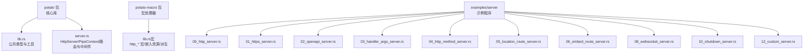
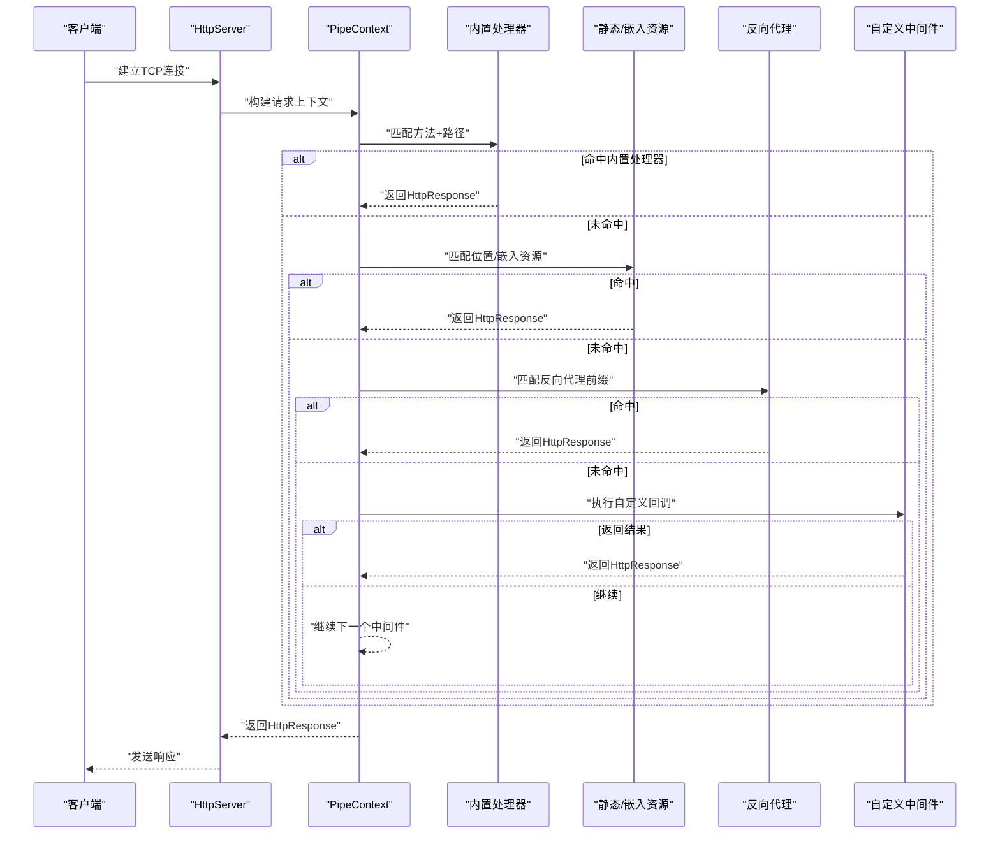
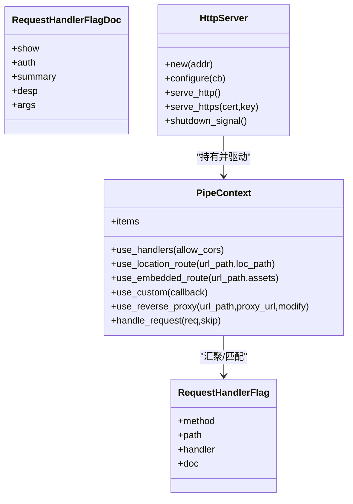
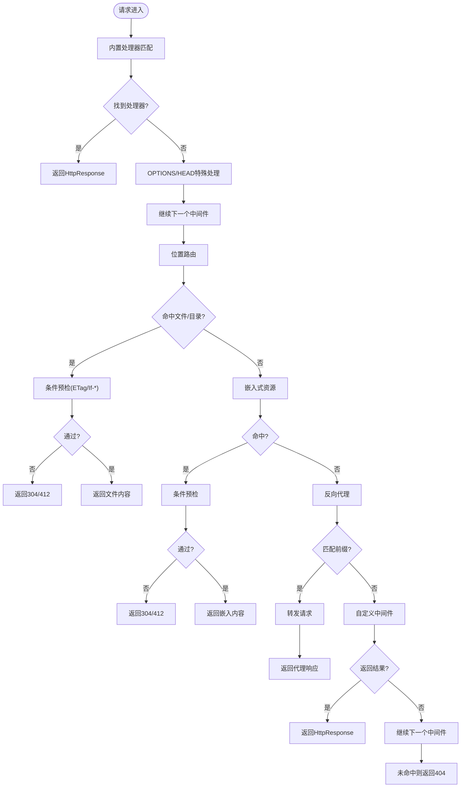
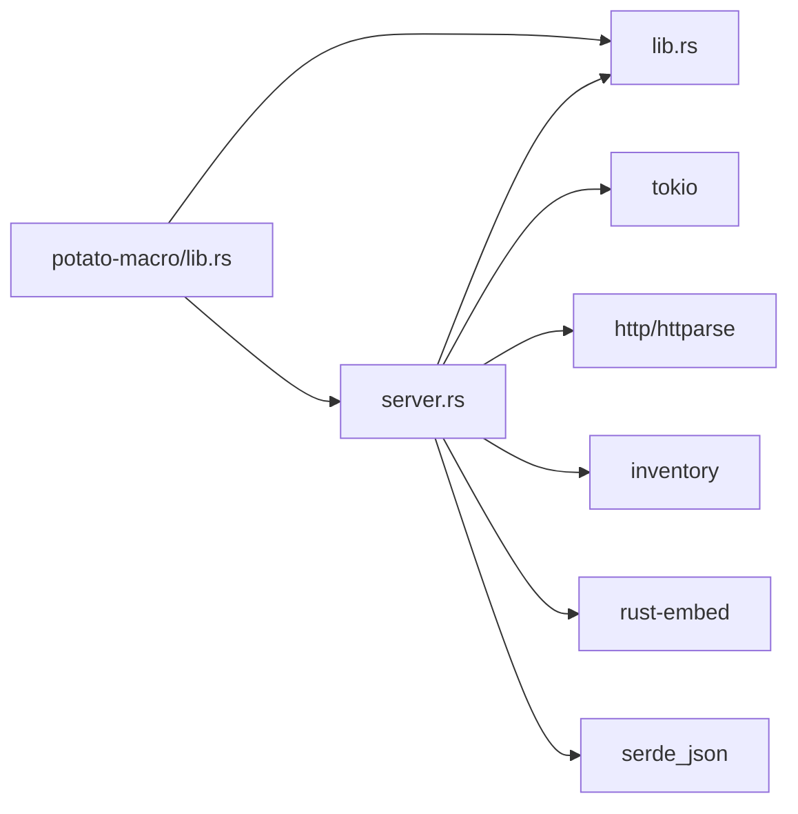

# HTTP服务器API

<cite>
**本文引用的文件**
- [lib.rs](file://potato/src/lib.rs)
- [server.rs](file://potato/src/server.rs)
- [Cargo.toml](file://potato/Cargo.toml)
- [lib.rs（宏）](file://potato-macro/src/lib.rs)
- [00_http_server.rs](file://examples/server/00_http_server.rs)
- [01_https_server.rs](file://examples/server/01_https_server.rs)
- [02_openapi_server.rs](file://examples/server/02_openapi_server.rs)
- [03_handler_args_server.rs](file://examples/server/03_handler_args_server.rs)
- [04_http_method_server.rs](file://examples/server/04_http_method_server.rs)
- [05_location_route_server.rs](file://examples/server/05_location_route_server.rs)
- [06_embed_route_server.rs](file://examples/server/06_embed_route_server.rs)
- [08_websocket_server.rs](file://examples/server/08_websocket_server.rs)
- [10_shutdown_server.rs](file://examples/server/10_shutdown_server.rs)
- [12_custom_server.rs](file://examples/server/12_custom_server.rs)
</cite>

## 目录
1. [简介](#简介)
2. [项目结构](#项目结构)
3. [核心组件](#核心组件)
4. [架构总览](#架构总览)
5. [详细组件分析](#详细组件分析)
6. [依赖关系分析](#依赖关系分析)
7. [性能考虑](#性能考虑)
8. [故障排查指南](#故障排查指南)
9. [结论](#结论)
10. [附录：完整示例与用法](#附录完整示例与用法)

## 简介
本文件系统性梳理 Potato HTTP 服务器的 API 设计与使用方式，覆盖以下主题：
- HttpServer 结构体的创建与配置：new()、configure()、serve_http()/serve_https()、shutdown_signal() 等
- 路由注册机制：基于宏处理器的自动注册与手动注册
- 中间件系统：管道中间件的添加与自定义中间件开发
- 高级功能：静态文件服务、OpenAPI 文档生成、WebSocket 支持、反向代理、可选特性（TLS、jemalloc、WebDAV）
- 服务器配置选项、性能调优参数与安全设置
- 完整示例：从最简 HTTP 服务到复杂场景的多种配置

## 项目结构
仓库采用多包结构，核心在 potato 包中，宏处理器在 potato-macro 包中，示例位于 examples/server。

图表来源
- [lib.rs](file://potato/src/lib.rs#L1-L120)
- [server.rs](file://potato/src/server.rs#L769-L800)
- [lib.rs（宏）](file://potato-macro/src/lib.rs#L1-L60)

章节来源
- [Cargo.toml](file://potato/Cargo.toml#L1-L76)

## 核心组件
- HttpServer：服务器主体，负责监听、接收连接、分发请求到管道上下文
- PipeContext：请求处理管道，按顺序执行多个中间件项（内置处理器、位置路由、嵌入式资源、自定义回调、反向代理、可选特性）
- RequestHandlerFlag/FlagDoc：通过宏收集的路由注册信息，包含方法、路径、处理器与文档元数据
- WebSocket：基于升级后的长连接帧收发
- HttpRequest/HttpResponse：请求/响应模型，含头部、查询参数、表单/JSON/文件上传解析、条件预检等

章节来源
- [lib.rs](file://potato/src/lib.rs#L124-L175)
- [server.rs](file://potato/src/server.rs#L28-L767)

## 架构总览
下图展示了请求从进入服务器到返回响应的典型流程，以及中间件管道的执行顺序。

图表来源
- [server.rs](file://potato/src/server.rs#L362-L767)

## 详细组件分析

### HttpServer：创建与配置
- 创建
  - new(addr): 初始化服务器地址与空管道上下文
- 配置
  - configure(callback): 使用 PipeContext 的 DSL 配置中间件链
  - shutdown_signal(): 获取一次性关闭信号发送器，用于优雅停机
- 启动
  - serve_http(): 启动 HTTP 服务
  - serve_https(cert,key): 在启用 TLS 特性时启动 HTTPS 服务（需开启 tls 特性）

章节来源
- [server.rs](file://potato/src/server.rs#L769-L797)
- [Cargo.toml](file://potato/Cargo.toml#L65-L72)

### 路由注册机制
- 自动注册（推荐）
  - 使用 http_get/http_post/http_put/http_delete/http_options/http_head 等宏为函数标注路由
  - 宏会生成包装函数并将 RequestHandlerFlag 提交到全局 inventory，运行时由 PipeContext 汇聚
  - 支持文档元数据：show、auth、summary、desp、args（由宏解析函数签名与注释生成）
- 手动注册
  - 在 configure 回调中显式调用 ctx.use_handlers(allow_cors) 或 ctx.use_location_route()/use_embedded_route()/use_custom()/use_reverse_proxy()

图表来源
- [lib.rs](file://potato/src/lib.rs#L126-L175)
- [server.rs](file://potato/src/server.rs#L28-L131)

章节来源
- [lib.rs（宏）](file://potato-macro/src/lib.rs#L26-L300)
- [lib.rs](file://potato/src/lib.rs#L175-L176)
- [server.rs](file://potato/src/server.rs#L28-L75)

### 中间件系统：管道与扩展
- 内置处理器：根据 URL_PATH + METHOD 查找已注册处理器，直接返回响应或回退到 OPTIONS/HEAD 处理
- 位置路由：将 URL 前缀映射到本地文件系统路径，支持目录索引与条件预检（ETag/If-None-Match/If-Modified-Since 等）
- 嵌入式路由：将编译期嵌入的资源映射为 URL，支持条件预检
- 反向代理：将匹配前缀的请求转发到目标地址，可选择是否改写内容
- 自定义中间件：允许在请求到达内置处理器之前进行拦截处理，返回 Some(...) 表示“已处理”，返回 None 继续后续中间件
- 可选特性中间件：OpenAPI 文档、jemalloc 性能分析导出、WebDAV（需相应特性）

图表来源
- [server.rs](file://potato/src/server.rs#L362-L767)

章节来源
- [server.rs](file://potato/src/server.rs#L40-L131)
- [server.rs](file://potato/src/server.rs#L362-L767)

### 静态文件服务
- 位置路由：将 URL 前缀映射到本地文件系统，自动处理目录索引（index.html/index.htm），并进行条件预检
- 嵌入式路由：将编译期打包的资源映射为 URL，同样支持条件预检

章节来源
- [server.rs](file://potato/src/server.rs#L408-L567)
- [server.rs](file://potato/src/server.rs#L569-L608)

### OpenAPI 文档生成
- 在 configure 中调用 use_openapi(url_path) 即可生成并托管 OpenAPI JSON 与 Swagger UI
- 文档内容由宏收集的路由信息动态生成，支持标签、参数、请求体、安全方案等

章节来源
- [server.rs](file://potato/src/server.rs#L133-L331)
- [lib.rs（宏）](file://potato-macro/src/lib.rs#L67-L102)

### WebSocket 支持
- 请求升级：通过 HttpRequest.is_websocket() 判断并调用 upgrade_websocket() 完成协议升级
- 帧收发：Websocket 提供 send()/send_text()/send_binary()/recv() 等方法；内部维护 ping/pong 心跳与掩码处理
- 示例：在路由中使用 req.upgrade_websocket() 并循环处理消息

章节来源
- [lib.rs](file://potato/src/lib.rs#L532-L579)
- [lib.rs](file://potato/src/lib.rs#L203-L359)
- [08_websocket_server.rs](file://examples/server/08_websocket_server.rs#L25-L35)

### 反向代理与自定义中间件
- 反向代理：use_reverse_proxy(url_path, proxy_url, modify_content) 将匹配前缀的请求转发至目标地址
- 自定义中间件：use_custom(callback) 注册异步回调，可在请求到达内置处理器前进行拦截处理

章节来源
- [server.rs](file://potato/src/server.rs#L115-L126)
- [server.rs](file://potato/src/server.rs#L615-L627)
- [server.rs](file://potato/src/server.rs#L102-L113)
- [12_custom_server.rs](file://examples/server/12_custom_server.rs#L10-L13)

### 可选特性与高级功能
- TLS：serve_https(cert,key) 需启用 tls 特性
- jemalloc：use_jemalloc(url_path) 导出内存分析报告（需启用 jemalloc 特性）
- WebDAV：use_webdav_localfs/use_webdav_memfs 提供 WebDAV 服务（需启用 webdav 特性）
- SSH：示例中包含 SSH 相关依赖（需启用 ssh 特性）

章节来源
- [Cargo.toml](file://potato/Cargo.toml#L65-L72)
- [server.rs](file://potato/src/server.rs#L128-L131)
- [server.rs](file://potato/src/server.rs#L333-L360)

## 依赖关系分析
- 运行时依赖：tokio（异步）、http/httparse（HTTP解析）、inventory（路由注册聚合）、serde_json（OpenAPI生成）、rust-embed（嵌入资源）
- 可选特性：tls、jemalloc、webdav、ssh
- 宏依赖：syn/quote/proc-macro2（宏展开与代码生成）

图表来源
- [Cargo.toml](file://potato/Cargo.toml#L16-L63)
- [server.rs](file://potato/src/server.rs#L1-L20)
- [lib.rs（宏）](file://potato-macro/src/lib.rs#L1-L10)

章节来源
- [Cargo.toml](file://potato/Cargo.toml#L16-L76)

## 性能考虑
- 连接与I/O
  - 基于 tokio 的异步非阻塞 I/O，建议在高并发场景下合理设置系统文件描述符限制与内核参数
- 压缩与传输
  - 支持 gzip 压缩模式（依据 Accept-Encoding），可减少带宽占用
- 缓冲与解析
  - 使用 httparse 解析请求头，避免额外分配；请求体解析按 Content-Type 分支处理，注意大文件上传的内存占用
- 静态资源
  - 条件预检（ETag/If-*）可显著降低重复传输开销
- 可选特性
  - jemalloc 特性可用于性能分析与内存优化（生产环境谨慎开启）

## 故障排查指南
- 404 未命中
  - 检查路由是否正确注册（宏 path 是否以 / 开头）、URL 前缀是否匹配、是否被后续中间件覆盖
- 401/403 认证失败
  - OpenAPI 文档生成时若标记为需要认证，需在请求头携带 Bearer Token
- 412/304 条件预检
  - 若浏览器或客户端缓存命中，可能返回 304；服务端也会根据 If-Match/If-None-Match/If-Modified-Since 等返回 412
- WebSocket 升级失败
  - 确认请求方法为 GET、Connection/Upgrade 头正确、Sec-WebSocket-Version 为 13、Sec-WebSocket-Key 存在且非空
- TLS 启动失败
  - 确保启用 tls 特性并提供有效的证书与私钥路径

章节来源
- [lib.rs](file://potato/src/lib.rs#L777-L800)
- [lib.rs](file://potato/src/lib.rs#L532-L579)
- [server.rs](file://potato/src/server.rs#L378-L406)

## 结论
Potato 提供了简洁而强大的 HTTP 服务器能力：以宏驱动的路由注册、灵活的中间件管道、完善的静态资源与 OpenAPI 支持，以及可选的 TLS、jemalloc、WebDAV、SSH 等高级特性。通过合理的配置与中间件组合，可以在保证性能的同时快速构建多样化的 Web 应用。

## 附录：完整示例与用法
以下示例均来自仓库 examples/server，展示不同场景下的配置与使用方式：

- 最简 HTTP 服务
  - 使用 http_get 宏注册路由，new() 创建服务器，serve_http() 启动
  - 参考：[00_http_server.rs](file://examples/server/00_http_server.rs#L1-L12)

- HTTPS 服务
  - 启用 tls 特性后，使用 serve_https(cert,key) 启动 HTTPS
  - 参考：[01_https_server.rs](file://examples/server/01_https_server.rs#L1-L12)

- OpenAPI 文档
  - 在 configure 中调用 use_openapi(url_path)，自动生成并托管 Swagger UI
  - 参考：[02_openapi_server.rs](file://examples/server/02_openapi_server.rs#L1-L16)

- 处理请求参数与文件上传
  - 函数参数支持 String/基本类型/PostFile，自动解析查询参数、表单与 multipart
  - 参考：[03_handler_args_server.rs](file://examples/server/03_handler_args_server.rs#L1-L32)

- 多种 HTTP 方法
  - 使用 http_get/http_post/http_put/http_delete/http_options/http_head 宏
  - 参考：[04_http_method_server.rs](file://examples/server/04_http_method_server.rs#L1-L42)

- 位置路由（静态文件）
  - 将 URL 前缀映射到本地目录，支持目录索引与条件预检
  - 参考：[05_location_route_server.rs](file://examples/server/05_location_route_server.rs#L1-L11)

- 嵌入式静态资源
  - 使用 embed_dir! 宏将目录嵌入二进制，再通过 use_embedded_route 暴露
  - 参考：[06_embed_route_server.rs](file://examples/server/06_embed_route_server.rs#L1-L11)

- WebSocket 服务
  - 在路由中调用 req.upgrade_websocket() 并循环处理消息
  - 参考：[08_websocket_server.rs](file://examples/server/08_websocket_server.rs#L1-L43)

- 优雅停机
  - 通过 shutdown_signal() 获取关闭信号，在特定路由触发后停止服务
  - 参考：[10_shutdown_server.rs](file://examples/server/10_shutdown_server.rs#L1-L22)

- 自定义中间件
  - 使用 use_custom(callback) 在内置处理器前拦截请求
  - 参考：[12_custom_server.rs](file://examples/server/12_custom_server.rs#L1-L17)