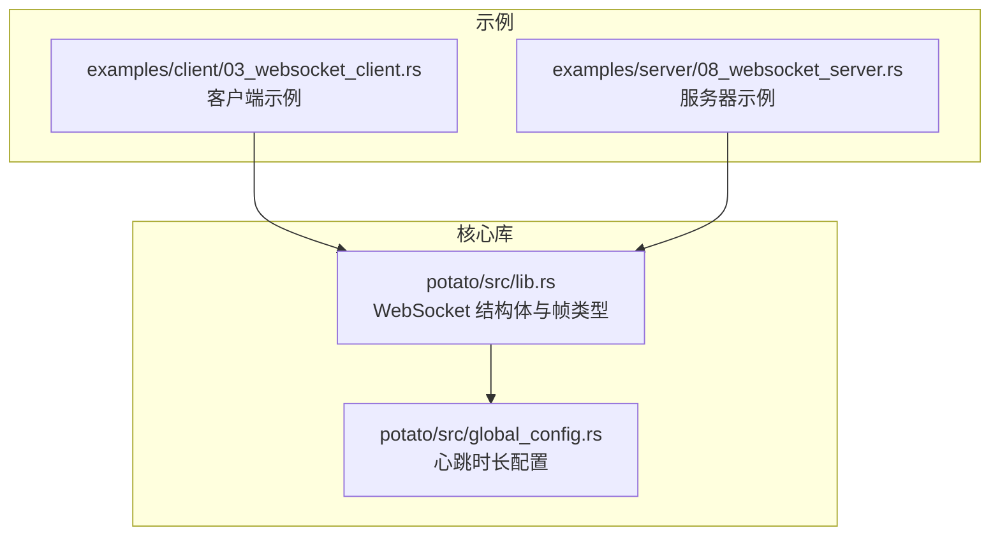
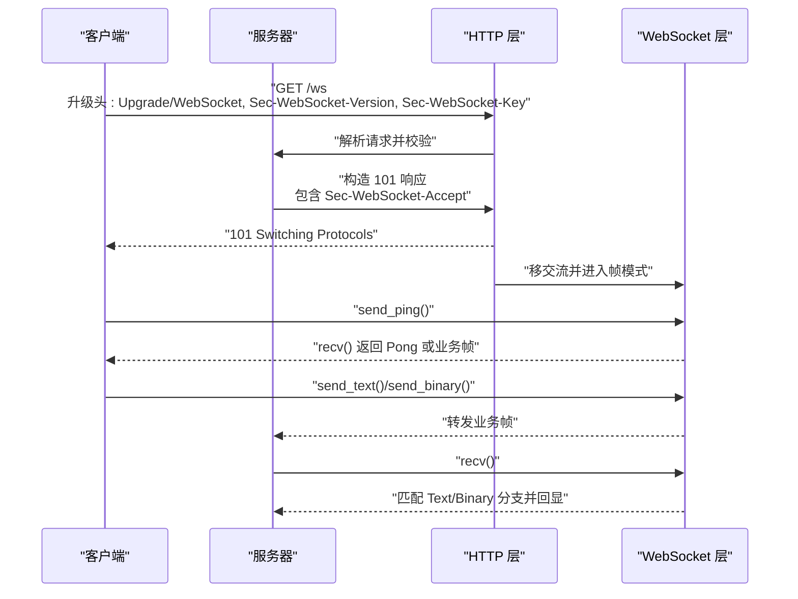
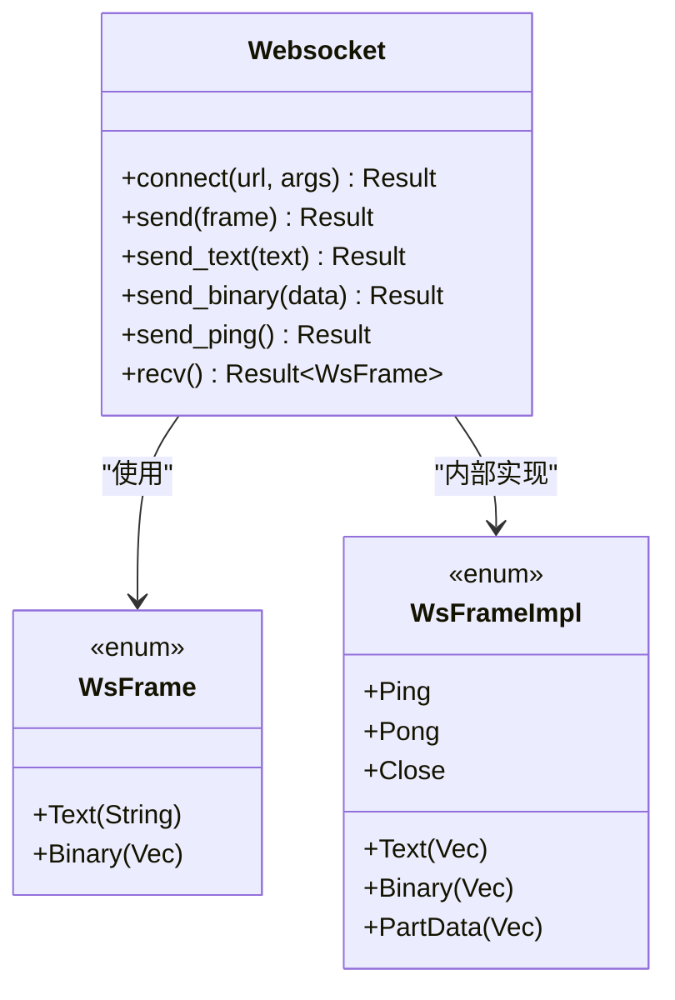
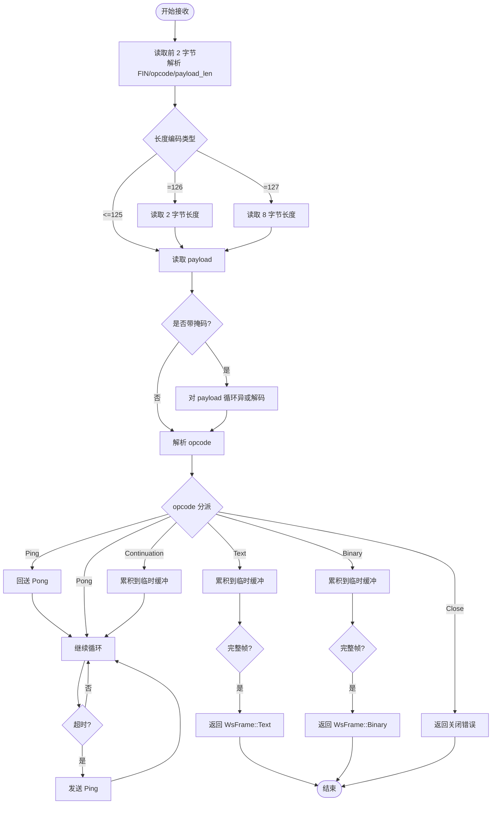
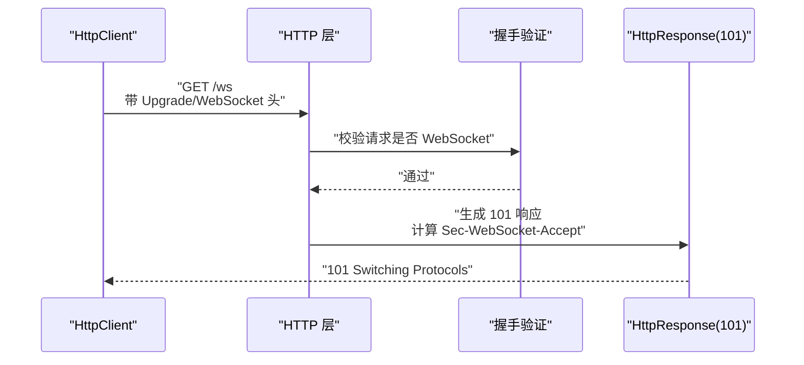
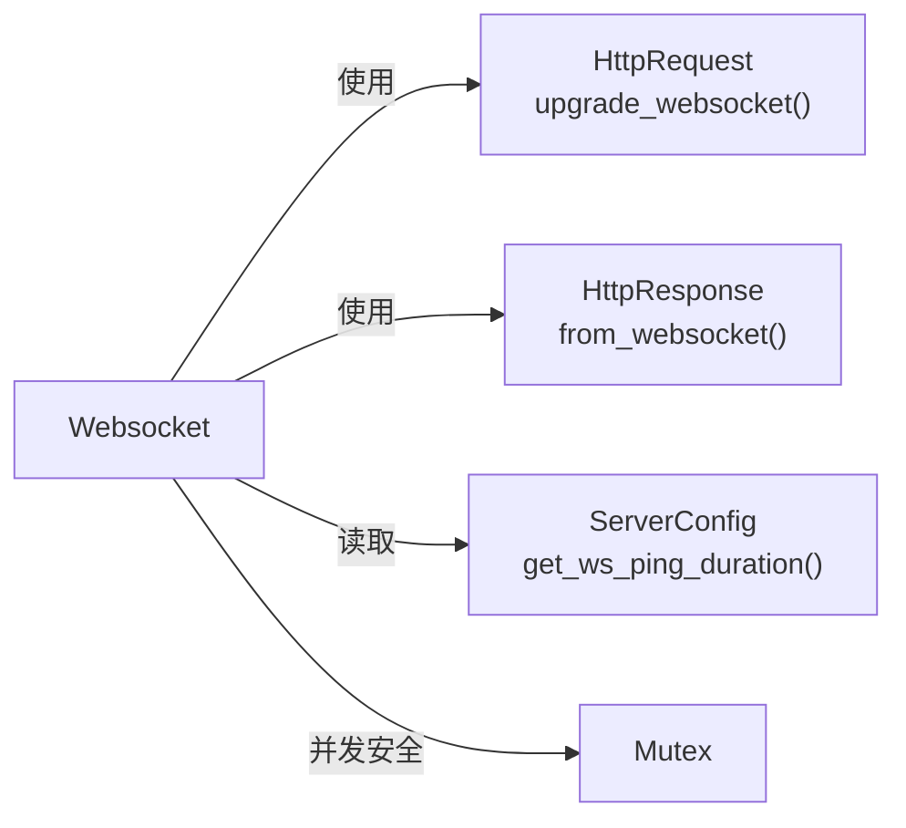

# WebSocket API

<cite>
**本文引用的文件**
- [lib.rs](file://potato/src/lib.rs)
- [global_config.rs](file://potato/src/global_config.rs)
- [03_websocket_client.rs](file://examples/client/03_websocket_client.rs)
- [08_websocket_server.rs](file://examples/server/08_websocket_server.rs)
</cite>

## 目录
1. [简介](#简介)
2. [项目结构](#项目结构)
3. [核心组件](#核心组件)
4. [架构总览](#架构总览)
5. [详细组件分析](#详细组件分析)
6. [依赖关系分析](#依赖关系分析)
7. [性能考虑](#性能考虑)
8. [故障排查指南](#故障排查指南)
9. [结论](#结论)
10. [附录](#附录)

## 简介
本文件系统性地记录了 Potato 框架中的 WebSocket API，涵盖以下方面：
- WebSocket 结构体的全部公共方法：connect()、send()、recv()、send_text()、send_binary()、send_ping()
- 帧类型定义：WsFrame 与 WsFrameImpl 的语义与用途
- 握手流程与协议实现细节（101 升级、Sec-WebSocket-* 头部）
- 心跳机制、连接管理与错误处理策略
- 客户端与服务器端的实现指南
- 实际聊天应用示例与最佳实践

## 项目结构
WebSocket 能力由核心库模块提供，示例分别展示了客户端与服务器端的用法。

**图表来源**
- [lib.rs](file://potato/src/lib.rs#L200-L400)
- [global_config.rs](file://potato/src/global_config.rs#L1-L63)
- [03_websocket_client.rs](file://examples/client/03_websocket_client.rs#L1-L11)
- [08_websocket_server.rs](file://examples/server/08_websocket_server.rs#L1-L43)

**章节来源**
- [lib.rs](file://potato/src/lib.rs#L200-L400)
- [global_config.rs](file://potato/src/global_config.rs#L1-L63)
- [03_websocket_client.rs](file://examples/client/03_websocket_client.rs#L1-L11)
- [08_websocket_server.rs](file://examples/server/08_websocket_server.rs#L1-L43)

## 核心组件
- Websocket 结构体：封装底层 TCP 流，提供 WebSocket 读写与控制帧发送能力
- WsFrame：对外可见的帧类型，区分文本与二进制
- WsFrameImpl：内部帧类型，包含 Close/Ping/Pong/Text/Binary/PartData
- 握手与升级：HttpRequest 提供 upgrade_websocket() 将 HTTP 连接升级为 WebSocket
- 配置：ServerConfig 提供心跳间隔配置

**章节来源**
- [lib.rs](file://potato/src/lib.rs#L200-L400)
- [lib.rs](file://potato/src/lib.rs#L360-L375)
- [lib.rs](file://potato/src/lib.rs#L560-L579)
- [global_config.rs](file://potato/src/global_config.rs#L18-L35)

## 架构总览
WebSocket 在 Potato 中采用“HTTP 请求 + 协议升级”的模式。客户端通过 GET 请求携带特定头部发起升级；服务器端在满足条件后返回 101 并切换到帧读写模式。心跳通过定时超时触发 Ping/Pong 控制帧维持连接活性。

**图表来源**
- [lib.rs](file://potato/src/lib.rs#L208-L232)
- [lib.rs](file://potato/src/lib.rs#L560-L579)
- [lib.rs](file://potato/src/lib.rs#L1042-L1066)
- [lib.rs](file://potato/src/lib.rs#L285-L308)

## 详细组件分析

### Websocket 结构体与公共方法
- connect(url, args)
  - 发起 GET 请求，附加 Upgrade/WebSocket 相关头部
  - 校验响应码为 101，否则报错
  - 成功后持有底层 HttpStream 的互斥访问权
- send(frame)
  - 接受 WsFrame::Text/WsFrame::Binary，内部转换为对应帧并写出
- send_text(text)
  - 快速发送文本帧
- send_binary(data)
  - 快速发送二进制帧
- send_ping()
  - 发送 Ping 控制帧
- recv()
  - 循环读取帧，聚合分片，支持超时自动 Ping
  - 遇到 Close 帧返回错误
  - 遇到 Ping 自动回送 Pong

**图表来源**
- [lib.rs](file://potato/src/lib.rs#L200-L400)
- [lib.rs](file://potato/src/lib.rs#L360-L375)

**章节来源**
- [lib.rs](file://potato/src/lib.rs#L208-L232)
- [lib.rs](file://potato/src/lib.rs#L341-L358)
- [lib.rs](file://potato/src/lib.rs#L337-L339)
- [lib.rs](file://potato/src/lib.rs#L285-L308)

### 帧类型与协议细节
- WsFrame 对外暴露 Text/String 与 Binary/Vec<u8>
- WsFrameImpl 内部包含 Close/Ping/Pong/Text/Binary/PartData
- 协议字段解析
  - 基础头部长度固定 2 字节，包含 FIN 与 opcode
  - payload_len 支持 126/127 扩展长度编码
  - mask_key 存在时对 payload 做循环异或解码
  - opcode 映射到 WsFrameImpl
- 文本帧在聚合完成后尝试 UTF-8 解码为字符串

**图表来源**
- [lib.rs](file://potato/src/lib.rs#L234-L283)
- [lib.rs](file://potato/src/lib.rs#L285-L308)

**章节来源**
- [lib.rs](file://potato/src/lib.rs#L234-L283)
- [lib.rs](file://potato/src/lib.rs#L285-L308)

### 握手与协议实现
- 客户端握手
  - 请求头必须包含 Upgrade: websocket、Connection: Upgrade、Sec-WebSocket-Version: 13、Sec-WebSocket-Key
  - 服务器返回 101 且包含 Sec-WebSocket-Accept
- 服务器端升级
  - HttpRequest::is_websocket() 校验请求是否符合 WebSocket 条件
  - HttpRequest::upgrade_websocket() 从请求中提取流并写入 101 响应
  - 返回 Websocket 实例以进行后续帧读写

**图表来源**
- [lib.rs](file://potato/src/lib.rs#L532-L559)
- [lib.rs](file://potato/src/lib.rs#L560-L579)
- [lib.rs](file://potato/src/lib.rs#L1042-L1066)

**章节来源**
- [lib.rs](file://potato/src/lib.rs#L532-L559)
- [lib.rs](file://potato/src/lib.rs#L560-L579)
- [lib.rs](file://potato/src/lib.rs#L1042-L1066)

### 心跳机制与连接管理
- 心跳周期来自 ServerConfig::get_ws_ping_duration()
- recv() 使用 tokio::time::timeout 包裹单次帧读取
- 超时则自动发送 Ping；收到 Ping 则回送 Pong
- 收到 Close 帧直接返回错误，终止会话

**章节来源**
- [lib.rs](file://potato/src/lib.rs#L285-L308)
- [global_config.rs](file://potato/src/global_config.rs#L28-L35)

### 错误处理
- 握手失败：非 101 响应或缺少必要头部
- 协议异常：不支持的 opcode、长度编码错误、掩码解码失败
- 连接中断：底层流读写错误、连接关闭
- 业务错误：Close 帧触发的终止

**章节来源**
- [lib.rs](file://potato/src/lib.rs#L208-L232)
- [lib.rs](file://potato/src/lib.rs#L274-L283)
- [lib.rs](file://potato/src/lib.rs#L291-L292)

### 客户端与服务器实现指南

#### 客户端
- 使用 Websocket::connect() 建立连接
- 可选先发送 Ping 以测试连通性
- 使用 send_text()/send_binary() 发送消息
- 使用 recv() 接收消息，注意可能的超时自动 Ping

参考示例路径：
- [03_websocket_client.rs](file://examples/client/03_websocket_client.rs#L1-L11)

**章节来源**
- [03_websocket_client.rs](file://examples/client/03_websocket_client.rs#L1-L11)
- [lib.rs](file://potato/src/lib.rs#L208-L232)
- [lib.rs](file://potato/src/lib.rs#L337-L358)
- [lib.rs](file://potato/src/lib.rs#L285-L308)

#### 服务器
- 提供一个路由用于 HTML 页面，前端通过原生 WebSocket 连接 /ws
- 在 /ws 路由中调用 req.upgrade_websocket() 完成升级
- 升级成功后循环 recv()，根据帧类型回显 send_text()/send_binary()

参考示例路径：
- [08_websocket_server.rs](file://examples/server/08_websocket_server.rs#L1-L43)

**章节来源**
- [08_websocket_server.rs](file://examples/server/08_websocket_server.rs#L1-L43)
- [lib.rs](file://potato/src/lib.rs#L560-L579)
- [lib.rs](file://potato/src/lib.rs#L285-L308)

### 消息收发示例（文本与二进制）

#### 客户端示例
- 建立连接
- 发送 Ping
- 发送文本消息
- 接收并打印帧

参考路径：
- [03_websocket_client.rs](file://examples/client/03_websocket_client.rs#L1-L11)

**章节来源**
- [03_websocket_client.rs](file://examples/client/03_websocket_client.rs#L1-L11)

#### 服务器示例
- 前端页面连接 /ws
- 服务端升级后发送 Ping
- 循环接收，根据帧类型回显

参考路径：
- [08_websocket_server.rs](file://examples/server/08_websocket_server.rs#L1-L43)

**章节来源**
- [08_websocket_server.rs](file://examples/server/08_websocket_server.rs#L1-L43)

### 实际聊天应用示例（思路与步骤）
- 前端：HTML 页面内嵌 JavaScript，建立 WebSocket 连接到 /ws
- 后端：/ws 路由中完成升级，维护连接集合
- 交互：客户端发送文本消息，服务端广播或定向转发
- 心跳：服务端在空闲时发送 Ping，客户端自动回送 Pong
- 关闭：任一方发送 Close 帧，另一方检测到后清理资源

该示例基于现有 API 组合实现，无需额外扩展。

## 依赖关系分析
- Websocket 依赖 HttpRequest 的升级能力与 HttpResponse 的 101 响应生成
- 心跳周期通过 ServerConfig 注入到 recv() 的超时逻辑
- 底层流通过 Mutex 包装，确保并发安全

**图表来源**
- [lib.rs](file://potato/src/lib.rs#L560-L579)
- [lib.rs](file://potato/src/lib.rs#L1042-L1066)
- [lib.rs](file://potato/src/lib.rs#L285-L308)
- [global_config.rs](file://potato/src/global_config.rs#L28-L35)

**章节来源**
- [lib.rs](file://potato/src/lib.rs#L560-L579)
- [lib.rs](file://potato/src/lib.rs#L1042-L1066)
- [lib.rs](file://potato/src/lib.rs#L285-L308)
- [global_config.rs](file://potato/src/global_config.rs#L28-L35)

## 性能考虑
- 帧聚合：recv() 会累积分片直到完整帧，减少上层拼接开销
- 超时驱动：心跳超时自动 Ping，避免阻塞等待
- 编码选择：文本帧按 UTF-8 解码，二进制帧直接透传
- 并发模型：底层流加锁，建议在上层按连接维度串行化写操作，避免竞争

## 故障排查指南
- 握手失败
  - 检查请求头是否包含 Upgrade/WebSocket、Version、Key
  - 确认服务器返回 101 且包含 Accept
- 连接中断
  - 观察是否频繁触发超时自动 Ping
  - 检查网络链路与防火墙策略
- 协议异常
  - 不支持的 opcode 或长度编码错误
  - 掩码解码失败导致数据损坏
- 业务错误
  - 收到 Close 帧即表示对端主动关闭

**章节来源**
- [lib.rs](file://potato/src/lib.rs#L208-L232)
- [lib.rs](file://potato/src/lib.rs#L274-L283)
- [lib.rs](file://potato/src/lib.rs#L291-L292)

## 结论
Potato 的 WebSocket API 提供了简洁而完整的帧读写能力，配合握手与心跳机制，能够快速构建可靠的实时通信应用。通过示例可直接复用到聊天、推送等场景，并可根据需要扩展认证与广播逻辑。

## 附录

### API 一览（方法与用途）
- connect(url, args)
  - 建立 WebSocket 连接
- send(frame)
  - 发送文本或二进制帧
- send_text(text)
  - 发送文本帧
- send_binary(data)
  - 发送二进制帧
- send_ping()
  - 发送 Ping 控制帧
- recv()
  - 接收帧，自动处理 Ping/Pong 与 Close

**章节来源**
- [lib.rs](file://potato/src/lib.rs#L208-L232)
- [lib.rs](file://potato/src/lib.rs#L341-L358)
- [lib.rs](file://potato/src/lib.rs#L337-L339)
- [lib.rs](file://potato/src/lib.rs#L285-L308)