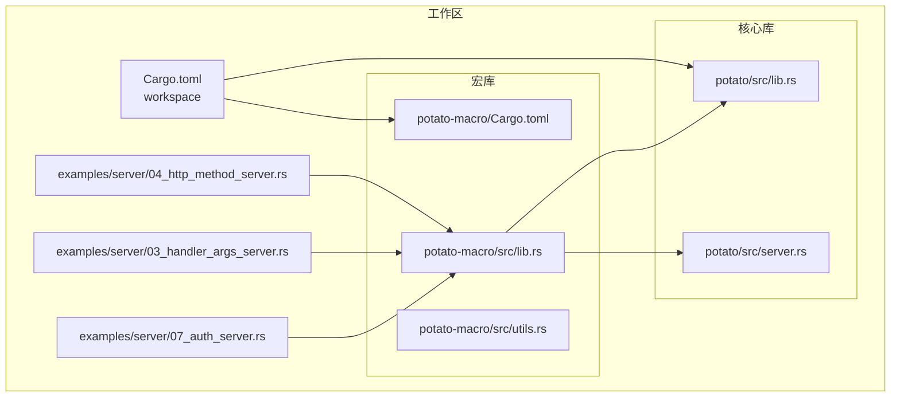
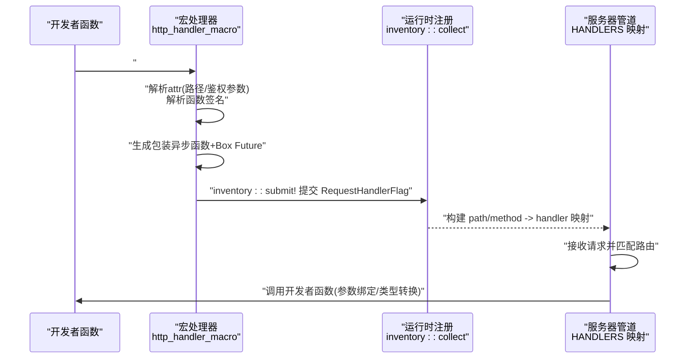
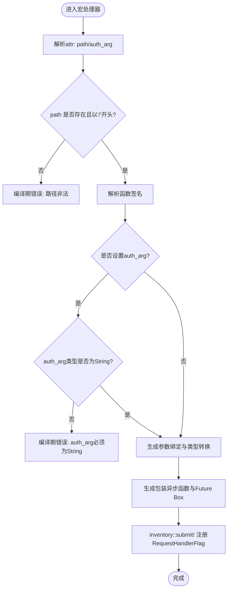
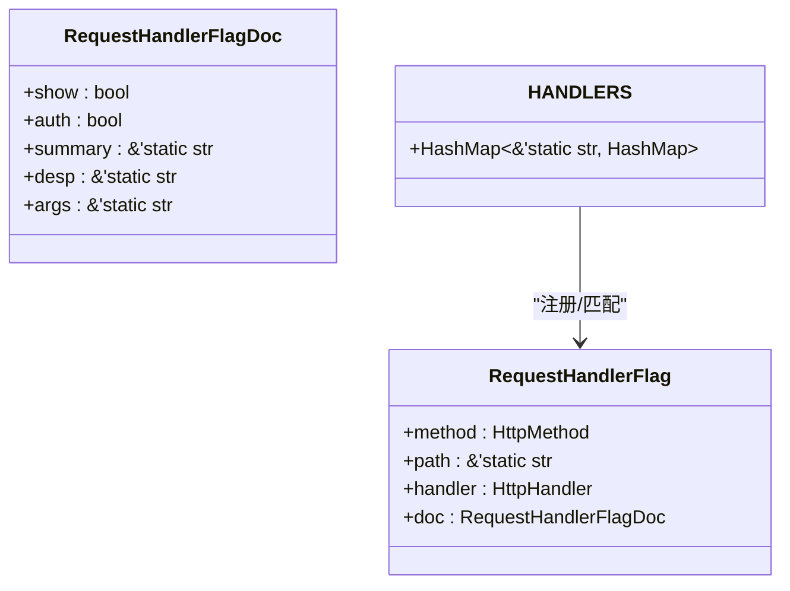
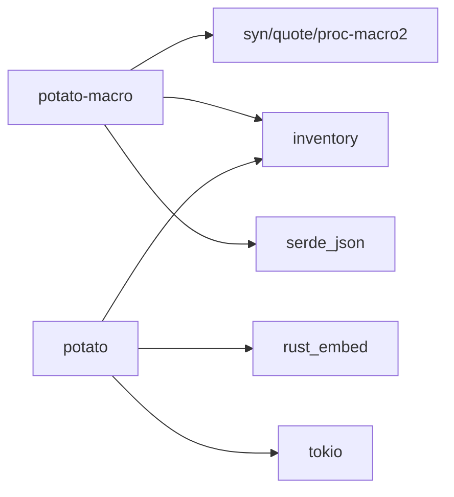

# 宏系统API

<cite>
**本文引用的文件**
- [Cargo.toml](file://Cargo.toml)
- [potato-macro/Cargo.toml](file://potato-macro/Cargo.toml)
- [potato-macro/src/lib.rs](file://potato-macro/src/lib.rs)
- [potato-macro/src/utils.rs](file://potato-macro/src/utils.rs)
- [potato/src/lib.rs](file://potato/src/lib.rs)
- [potato/src/server.rs](file://potato/src/server.rs)
- [examples/server/04_http_method_server.rs](file://examples/server/04_http_method_server.rs)
- [examples/server/03_handler_args_server.rs](file://examples/server/03_handler_args_server.rs)
- [examples/server/07_auth_server.rs](file://examples/server/07_auth_server.rs)
- [docs/guide/02_method_annotation.md](file://docs/guide/02_method_annotation.md)
- [README.md](file://README.md)
</cite>

## 目录
1. [简介](#简介)
2. [项目结构](#项目结构)
3. [核心组件](#核心组件)
4. [架构总览](#架构总览)
5. [详细组件分析](#详细组件分析)
6. [依赖关系分析](#依赖关系分析)
7. [性能考量](#性能考量)
8. [故障排查指南](#故障排查指南)
9. [结论](#结论)
10. [附录](#附录)

## 简介
本文件为 Potato 宏系统的完整 API 参考文档，聚焦于 HTTP 方法宏（如 http_get、http_post、http_put、http_delete、http_options、http_head）的使用与行为，解释其编译时代码生成过程、参数绑定与类型转换/验证机制，并提供自定义宏开发指南与常见问题解决方案。同时对比宏与传统函数的差异与优势，帮助读者高效构建高性能 HTTP 服务。

## 项目结构
- 工作区由两个成员包组成：核心库 potato 与宏库 potato-macro。
- 宏库提供基于属性宏的 HTTP 路由声明能力；核心库提供运行时的请求解析、路由注册、OpenAPI 文档生成与服务器管道处理。

图表来源
- [Cargo.toml](file://Cargo.toml#L1-L4)
- [potato-macro/Cargo.toml](file://potato-macro/Cargo.toml#L1-L24)
- [potato-macro/src/lib.rs](file://potato-macro/src/lib.rs#L1-L399)
- [potato/src/lib.rs](file://potato/src/lib.rs#L1-L1220)
- [potato/src/server.rs](file://potato/src/server.rs#L1-L200)
- [examples/server/04_http_method_server.rs](file://examples/server/04_http_method_server.rs#L1-L42)
- [examples/server/03_handler_args_server.rs](file://examples/server/03_handler_args_server.rs#L1-L32)
- [examples/server/07_auth_server.rs](file://examples/server/07_auth_server.rs#L1-L24)

章节来源
- [Cargo.toml](file://Cargo.toml#L1-L4)
- [potato-macro/Cargo.toml](file://potato-macro/Cargo.toml#L1-L24)

## 核心组件
- HTTP 方法宏族：http_get、http_post、http_put、http_delete、http_options、http_head。它们均通过属性宏实现，统一委托给内部通用宏处理器进行编译期解析与代码生成。
- 宏处理器：负责解析宏参数（路径与可选鉴权参数）、提取函数签名信息、生成包装异步函数、注册到运行时路由表，并收集文档元数据（是否展示、是否鉴权、摘要、描述、参数列表）。
- 运行时注册：通过 inventory 收集 RequestHandlerFlag，按路径与方法建立映射，供服务器管道匹配与调用。
- OpenAPI 文档：遍历已注册的 RequestHandlerFlag，生成 OpenAPI JSON（含标签、路径、参数、响应码等）。

章节来源
- [potato-macro/src/lib.rs](file://potato-macro/src/lib.rs#L26-L300)
- [potato/src/lib.rs](file://potato/src/lib.rs#L126-L175)
- [potato/src/server.rs](file://potato/src/server.rs#L28-L38)

## 架构总览
下图展示了从“宏声明”到“运行时路由处理”的全链路：

图表来源
- [potato-macro/src/lib.rs](file://potato-macro/src/lib.rs#L26-L300)
- [potato/src/lib.rs](file://potato/src/lib.rs#L126-L175)
- [potato/src/server.rs](file://potato/src/server.rs#L28-L38)

## 详细组件分析

### HTTP 方法宏 API 参考
- 宏名称
  - http_get、http_post、http_put、http_delete、http_options、http_head
- 作用域
  - 属性宏（#[...]），仅能用于异步函数（async fn）
- 参数选项
  - 方式一：直接传入路径字符串（如 #[http_get("/path")]）
  - 方式二：命名参数
    - path：必需，字符串，必须以 “/” 开头
    - auth_arg：可选，字符串标识符，指向一个 String 类型的参数，作为 JWT 载荷提取点
- 返回值约定
  - 支持以下返回类型（宏会根据返回类型生成相应封装逻辑）：
    - Result<(), E> 或 Result<HttpResponse, E>
    - () 或 HttpResponse
  - 若返回类型不在上述集合，将触发编译错误
- 示例位置
  - 基础方法宏示例：[examples/server/04_http_method_server.rs](file://examples/server/04_http_method_server.rs#L2-L30)
  - 鉴权参数示例：[examples/server/07_auth_server.rs](file://examples/server/07_auth_server.rs#L8-L11)
  - 文档指南：[docs/guide/02_method_annotation.md](file://docs/guide/02_method_annotation.md#L1-L39)

章节来源
- [examples/server/04_http_method_server.rs](file://examples/server/04_http_method_server.rs#L2-L30)
- [examples/server/07_auth_server.rs](file://examples/server/07_auth_server.rs#L8-L11)
- [docs/guide/02_method_annotation.md](file://docs/guide/02_method_annotation.md#L1-L39)

### 编译时代码生成流程
- 输入
  - 宏属性 attr：路径或命名参数（path、auth_arg）
  - 函数输入 input：目标异步函数的签名与主体
- 主要步骤
  1) 解析路径与鉴权参数
     - 必须提供 path，且以 “/” 开头
     - auth_arg 指向的参数必须为 String 类型
  2) 解析函数签名
     - 支持的参数类型：String、bool、u8/u16/u32/u64/usize、i8/i16/i32/i64/isize、f32/f64
     - 特殊参数：&mut HttpRequest（可选）
     - 文件上传参数：PostFile
  3) 生成包装函数
     - 将请求体/查询参数解析为函数参数
     - 对非 String 类型执行 parse() 类型转换，失败则返回错误响应
     - 对 auth_arg 参数从 Authorization 头中提取 Bearer token 并校验
  4) 注册路由
     - 生成异步包装器与 Future Box 化函数
     - 使用 inventory::submit! 提交 RequestHandlerFlag（包含方法、路径、处理器、文档元数据）
- 输出
  - 在编译期注入注册代码，运行时通过 inventory 自动收集

图表来源
- [potato-macro/src/lib.rs](file://potato-macro/src/lib.rs#L26-L300)

章节来源
- [potato-macro/src/lib.rs](file://potato-macro/src/lib.rs#L26-L300)

### 参数绑定、类型转换与验证机制
- 绑定来源
  - 查询参数：优先从 URL 查询串读取
  - 表单参数：若未找到查询参数，则尝试从请求体键值对读取
  - 文件参数：PostFile 从 multipart/form-data 的文件字段读取
  - 请求对象：&mut HttpRequest 可直接访问原始请求
- 类型转换
  - 非 String 类型参数将尝试 parse()，失败则返回错误响应
- 鉴权参数
  - 从 Authorization 头中提取 Bearer token，调用 ServerAuth::jwt_check 校验
  - 若缺失头或校验失败，直接返回错误响应，不进入业务函数
- 文档元数据
  - 支持 doc 注释，宏会收集摘要与参数列表（JSON 字符串），用于 OpenAPI 文档生成

章节来源
- [potato-macro/src/lib.rs](file://potato-macro/src/lib.rs#L106-L191)
- [potato/src/lib.rs](file://potato/src/lib.rs#L126-L150)
- [potato/src/server.rs](file://potato/src/server.rs#L133-L205)

### 运行时路由注册与匹配
- 注册
  - 宏提交 RequestHandlerFlag，inventory::collect! 在运行时收集
  - 构建 HashMap<&'static str, HashMap<HttpMethod, &'static RequestHandlerFlag>>
- 匹配
  - 服务器根据请求方法与路径查找对应处理器
  - 执行包装函数，最终调用开发者函数
- OpenAPI
  - 遍历已注册处理器，生成 OpenAPI JSON（含 tags、paths、parameters、response codes）

图表来源
- [potato/src/lib.rs](file://potato/src/lib.rs#L126-L175)
- [potato/src/server.rs](file://potato/src/server.rs#L28-L38)

章节来源
- [potato/src/lib.rs](file://potato/src/lib.rs#L126-L175)
- [potato/src/server.rs](file://potato/src/server.rs#L28-L38)

### 自定义宏开发指南
- 宏类型
  - 属性宏：用于函数级标注（如 http_get/post/put/delete/options/head）
  - 过程宏：用于表达式级生成（如 embed_dir）
  - 派生宏：用于派生实现（如 StandardHeader）
- 展开规则建议
  - 解析宏参数：优先支持命名参数（path、auth_arg 等），兼容直接字符串路径
  - 类型检查：严格限定参数类型集合，必要时在宏内 panic 提示
  - 生成代码：保持最小侵入，仅注入必要的注册与包装代码
  - 文档元数据：收集函数注释与参数信息，便于 OpenAPI 输出
- 最佳实践
  - 将复杂逻辑下沉至工具模块（如类型简化、字符串处理）
  - 使用 inventory 自动注册，避免手动维护路由表
  - 对鉴权参数进行严格的类型与存在性校验
  - 为每个宏提供清晰的错误提示与示例

章节来源
- [potato-macro/src/lib.rs](file://potato-macro/src/lib.rs#L1-L399)
- [potato-macro/src/utils.rs](file://potato-macro/src/utils.rs#L1-L19)

### 常见用法示例
- 基础 HTTP 方法宏
  - 参考：[examples/server/04_http_method_server.rs](file://examples/server/04_http_method_server.rs#L2-L30)
- 参数绑定与文件上传
  - 参考：[examples/server/03_handler_args_server.rs](file://examples/server/03_handler_args_server.rs#L2-L20)
- 鉴权参数与 JWT 校验
  - 参考：[examples/server/07_auth_server.rs](file://examples/server/07_auth_server.rs#L8-L11)
- 官方文档与入门
  - 参考：[README.md](file://README.md#L21-L35), [docs/guide/02_method_annotation.md](file://docs/guide/02_method_annotation.md#L1-L39)

章节来源
- [examples/server/04_http_method_server.rs](file://examples/server/04_http_method_server.rs#L2-L30)
- [examples/server/03_handler_args_server.rs](file://examples/server/03_handler_args_server.rs#L2-L20)
- [examples/server/07_auth_server.rs](file://examples/server/07_auth_server.rs#L8-L11)
- [README.md](file://README.md#L21-L35)
- [docs/guide/02_method_annotation.md](file://docs/guide/02_method_annotation.md#L1-L39)

## 依赖关系分析
- 宏库依赖
  - syn/quote/proc-macro2：语法树解析与代码生成
  - serde_json：文档参数序列化
  - inventory：运行时收集
- 核心库依赖
  - inventory：收集 RequestHandlerFlag
  - rust_embed：静态资源嵌入（与宏相关）
  - tokio/async 等：异步运行时与网络栈

图表来源
- [potato-macro/Cargo.toml](file://potato-macro/Cargo.toml#L14-L21)
- [Cargo.toml](file://Cargo.toml#L1-L4)

章节来源
- [potato-macro/Cargo.toml](file://potato-macro/Cargo.toml#L14-L21)
- [Cargo.toml](file://Cargo.toml#L1-L4)

## 性能考量
- 宏阶段生成：将路由注册与包装逻辑在编译期完成，运行时仅做映射查找与少量参数解析，降低运行时开销。
- 类型转换：非 String 参数的 parse() 操作为 O(1) 字符串解析，成本极低。
- 鉴权：仅在设置了 auth_arg 时才进行 JWT 校验，避免不必要的开销。
- OpenAPI：仅在启用相关功能时遍历注册项生成文档，不影响常规请求处理。

## 故障排查指南
- 路由路径错误
  - 现象：编译期 panic，提示路径必须以 “/” 开头
  - 排查：确认宏参数 path 以 “/” 开头
  - 参考：[potato-macro/src/lib.rs](file://potato-macro/src/lib.rs#L57-L64)
- 缺少 path 参数
  - 现象：编译期 panic，提示需要 path
  - 排查：为宏提供 path 或使用命名参数
  - 参考：[potato-macro/src/lib.rs](file://potato-macro/src/lib.rs#L57-L64)
- auth_arg 类型不符
  - 现象：编译期 panic，提示 auth_arg 必须为 String
  - 排查：确保 auth_arg 指向的参数类型为 String
  - 参考：[potato-macro/src/lib.rs](file://potato-macro/src/lib.rs#L136-L138)
- auth_arg 未指向任何参数
  - 现象：编译期 panic，提示 auth_arg 必须指向现有参数
  - 排查：确认 auth_arg 指向的参数名存在且可见
  - 参考：[potato-macro/src/lib.rs](file://potato-macro/src/lib.rs#L189-L191)
- 参数类型不受支持
  - 现象：编译期 panic，提示不支持的参数类型
  - 排查：仅使用 String、标量数值类型、PostFile、&mut HttpRequest
  - 参考：[potato-macro/src/lib.rs](file://potato-macro/src/lib.rs#L182)
- 参数缺失
  - 现象：运行时返回错误响应，提示缺少参数
  - 排查：确认客户端发送了查询参数或表单参数
  - 参考：[potato-macro/src/lib.rs](file://potato-macro/src/lib.rs#L167)
- 类型转换失败
  - 现象：运行时返回错误响应，提示参数类型不匹配
  - 排查：确认客户端发送的字符串可被目标类型 parse()
  - 参考：[potato-macro/src/lib.rs](file://potato-macro/src/lib.rs#L172-L178)
- 鉴权失败
  - 现象：运行时返回 401，不进入业务函数
  - 排查：确认 Authorization 头格式为 Bearer token，且 jwt_secret 已正确配置
  - 参考：[examples/server/07_auth_server.rs](file://examples/server/07_auth_server.rs#L15-L16), [potato-macro/src/lib.rs](file://potato-macro/src/lib.rs#L148-L154)

章节来源
- [potato-macro/src/lib.rs](file://potato-macro/src/lib.rs#L57-L64)
- [potato-macro/src/lib.rs](file://potato-macro/src/lib.rs#L136-L191)
- [potato-macro/src/lib.rs](file://potato-macro/src/lib.rs#L167)
- [potato-macro/src/lib.rs](file://potato-macro/src/lib.rs#L172-L178)
- [examples/server/07_auth_server.rs](file://examples/server/07_auth_server.rs#L15-L16)

## 结论
- 宏系统通过编译期代码生成，将 HTTP 方法声明与路由注册自动化，显著提升开发效率与可维护性。
- 参数绑定、类型转换与鉴权机制完善，既保证易用性也兼顾安全性与健壮性。
- 运行时仅做轻量映射与包装，具备良好的性能表现。
- OpenAPI 文档自动生成，便于接口治理与联调。

## 附录
- 快速上手
  - 添加依赖与基本示例：[README.md](file://README.md#L14-L35)
  - 方法注解指南：[docs/guide/02_method_annotation.md](file://docs/guide/02_method_annotation.md#L1-L39)
- 示例对照
  - HTTP 方法宏示例：[examples/server/04_http_method_server.rs](file://examples/server/04_http_method_server.rs#L2-L30)
  - 参数绑定与文件上传：[examples/server/03_handler_args_server.rs](file://examples/server/03_handler_args_server.rs#L2-L20)
  - 鉴权参数与 JWT：[examples/server/07_auth_server.rs](file://examples/server/07_auth_server.rs#L8-L11)