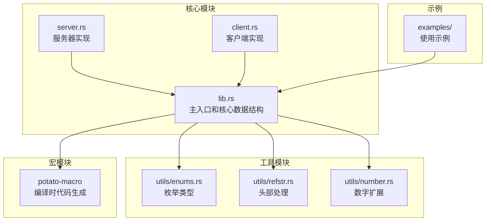
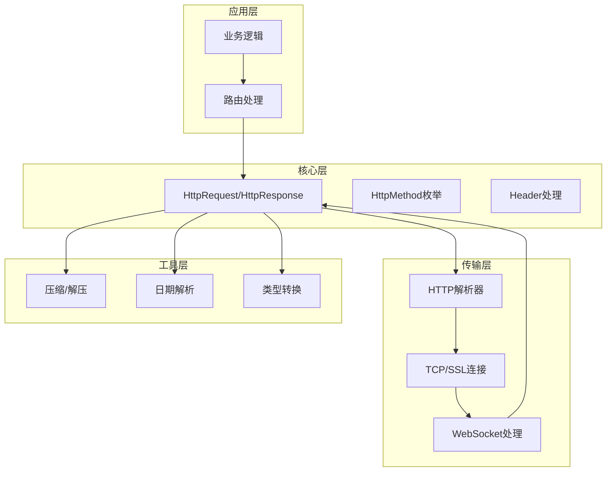
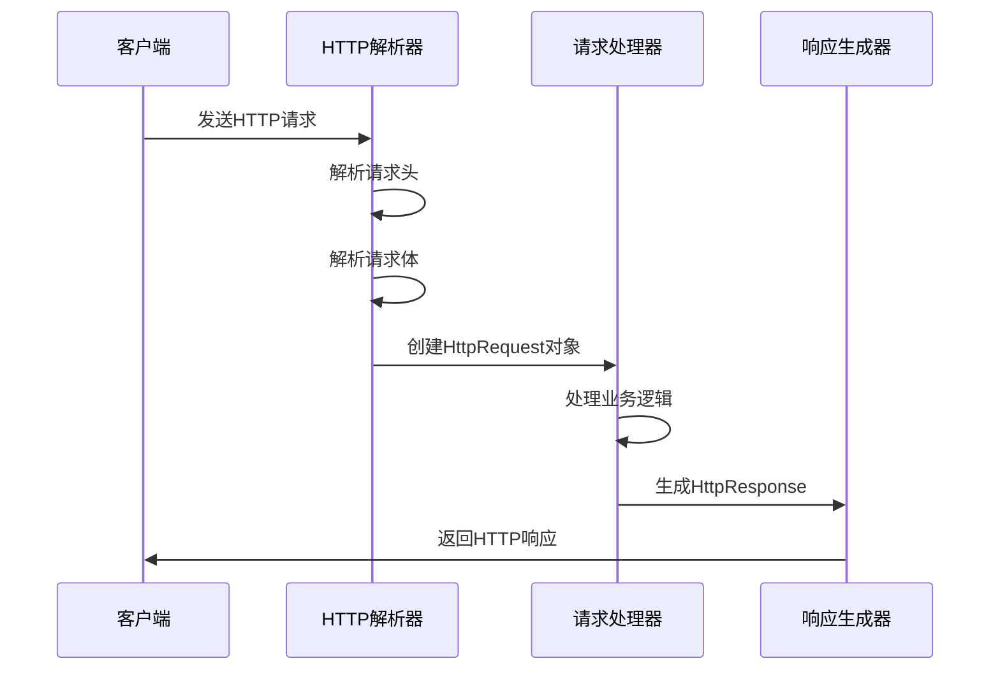
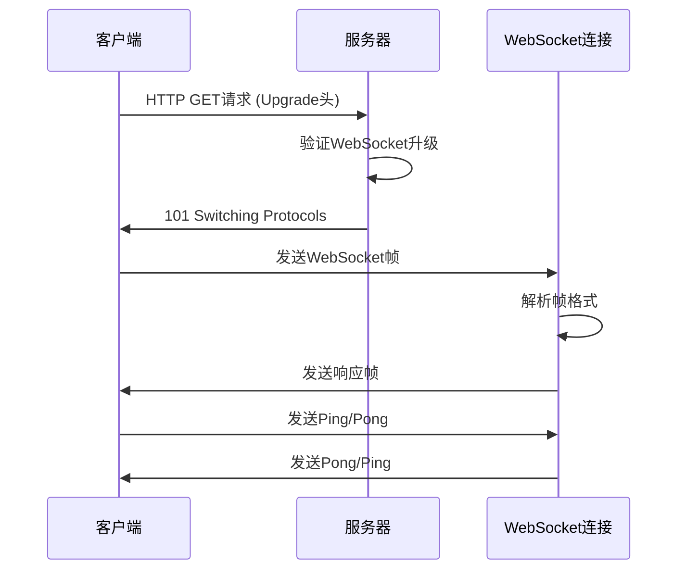
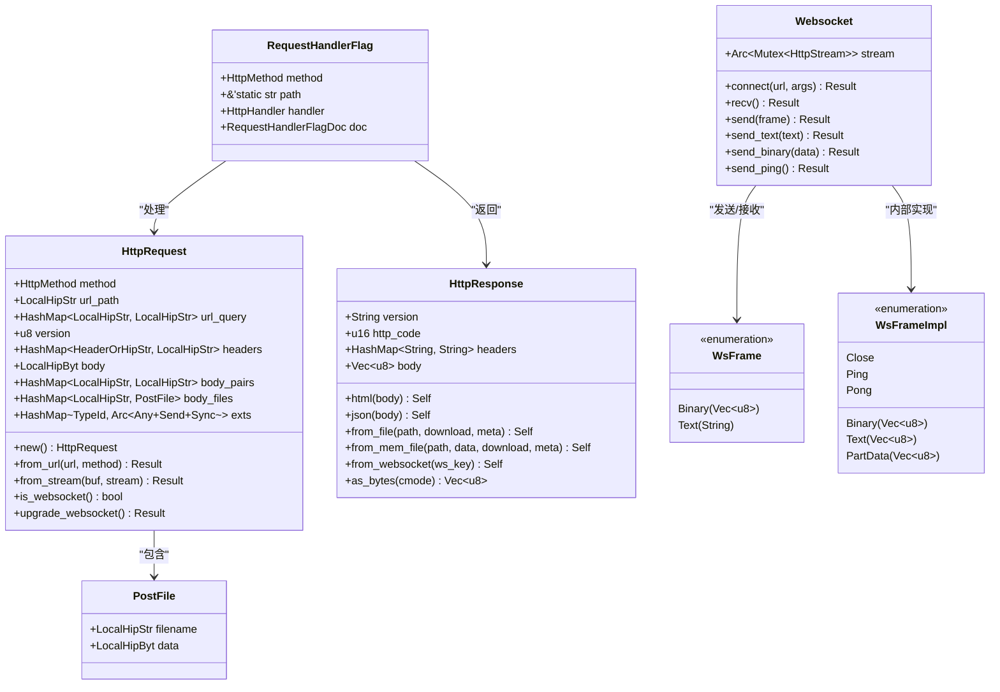
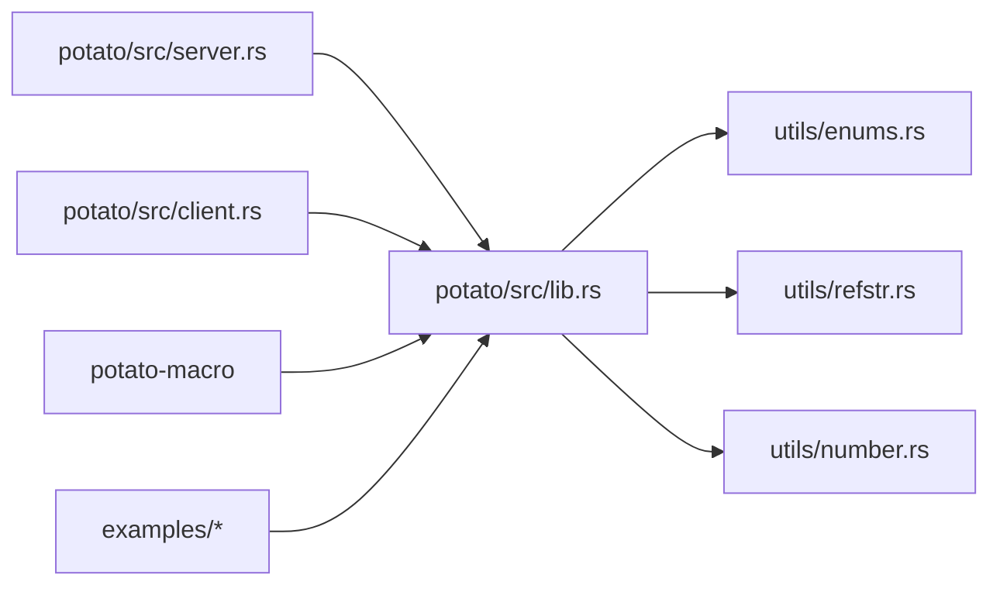

# 数据结构定义

<cite>
**本文档引用的文件**
- [lib.rs](file://potato/src/lib.rs)
- [server.rs](file://potato/src/server.rs)
- [client.rs](file://potato/src/client.rs)
- [enums.rs](file://potato/src/utils/enums.rs)
- [refstr.rs](file://potato/src/utils/refstr.rs)
- [number.rs](file://potato/src/utils/number.rs)
- [00_http_server.rs](file://examples/server/00_http_server.rs)
- [08_websocket_server.rs](file://examples/server/08_websocket_server.rs)
- [00_client.rs](file://examples/client/00_client.rs)
</cite>

## 目录
1. [简介](#简介)
2. [项目结构](#项目结构)
3. [核心组件](#核心组件)
4. [架构概览](#架构概览)
5. [详细组件分析](#详细组件分析)
6. [依赖关系分析](#依赖关系分析)
7. [性能考虑](#性能考虑)
8. [故障排除指南](#故障排除指南)
9. [结论](#结论)

## 简介

本文档详细记录了Potato框架中的所有公共数据结构，包括HTTP请求和响应、WebSocket通信以及相关的重要结构体。Potato是一个高性能的HTTP库，提供了简洁而强大的API来构建HTTP客户端和服务器应用。

## 项目结构

Potato框架采用模块化设计，主要包含以下核心模块：

**图表来源**
- [lib.rs](file://potato/src/lib.rs#L1-L50)
- [server.rs](file://potato/src/server.rs#L1-L30)
- [client.rs](file://potato/src/client.rs#L1-L30)

## 核心组件

### HTTP方法枚举 (HttpMethod)

HttpMethod枚举定义了所有支持的HTTP方法：

| 方法名 | 描述 | 使用场景 |
|--------|------|----------|
| GET | 获取资源 | 查询数据、获取静态文件 |
| POST | 创建资源 | 提交表单数据、上传文件 |
| PUT | 更新资源 | 完整更新资源 |
| DELETE | 删除资源 | 删除指定资源 |
| PATCH | 部分更新 | 部分修改资源 |
| HEAD | 获取头部 | 只获取响应头信息 |
| OPTIONS | 获取选项 | 查询服务器支持的方法 |
| CONNECT | 建立隧道 | HTTP隧道连接 |
| TRACE | 回显请求 | 调试和测试 |
| COPY | 复制资源 | WebDAV操作 |
| LOCK | 锁定资源 | WebDAV锁定机制 |
| MOVE | 移动资源 | WebDAV资源移动 |
| MKCOL | 创建集合 | WebDAV创建目录 |
| PROPFIND | 查找属性 | WebDAV属性查询 |
| PROPPATCH | 修改属性 | WebDAV属性更新 |
| UNLOCK | 解锁资源 | WebDAV解锁 |

**章节来源**
- [lib.rs](file://potato/src/lib.rs#L177-L195)

### HTTP请求结构体 (HttpRequest)

HttpRequest是Potato框架的核心请求数据结构，包含完整的HTTP请求信息：

#### 字段定义

| 字段名 | 类型 | 描述 | 默认值 |
|--------|------|------|--------|
| method | HttpMethod | HTTP请求方法 | HttpMethod::GET |
| url_path | LocalHipStr<'static> | 请求路径 | "/" |
| url_query | HashMap<LocalHipStr, LocalHipStr> | URL查询参数 | 空HashMap |
| version | u8 | HTTP版本 (10=HTTP/1.0, 11=HTTP/1.1) | 11 |
| headers | HashMap<HeaderOrHipStr, LocalHipStr> | 请求头映射 | 空HashMap |
| body | LocalHipByt<'static> | 请求体字节数组 | 空字节串 |
| body_pairs | HashMap<LocalHipStr, LocalHipStr> | 解析后的表单键值对 | 空HashMap |
| body_files | HashMap<LocalHipStr, PostFile> | 解析后的文件数据 | 空HashMap |
| exts | HashMap<TypeId, Arc<dyn Any + Send + Sync>> | 扩展数据存储 | 空HashMap |

#### 关键方法

- `new()` - 创建新的HttpRequest实例
- `query_string()` - 生成URL查询字符串
- `set_header()` / `get_header()` - 设置和获取请求头
- `from_url()` - 从URL创建请求
- `from_stream()` - 从网络流解析请求
- `is_websocket()` - 检查是否为WebSocket升级请求
- `upgrade_websocket()` - 升级为WebSocket连接

**章节来源**
- [lib.rs](file://potato/src/lib.rs#L384-L599)

### HTTP响应结构体 (HttpResponse)

HttpResponse表示HTTP响应数据结构：

#### 字段定义

| 字段名 | 类型 | 描述 | 默认值 |
|--------|------|------|--------|
| version | String | HTTP版本 | "" |
| http_code | u16 | HTTP状态码 | 0 |
| headers | HashMap<String, String> | 响应头映射 | 空HashMap |
| body | Vec<u8> | 响应体字节数组 | 空向量 |

#### 构造方法

- `html()` / `json()` / `text()` - 快速创建特定类型的响应
- `from_file()` - 从文件创建响应
- `from_mem_file()` - 从内存数据创建响应
- `from_websocket()` - 创建WebSocket升级响应
- `not_found()` / `error()` / `empty()` - 特殊响应类型

#### 工具方法

- `add_header()` - 添加响应头
- `as_bytes()` - 序列化为字节数组
- `from_stream()` - 从网络流解析响应
- `get_header()` - 获取响应头值

**章节来源**
- [lib.rs](file://potato/src/lib.rs#L879-L1202)

### WebSocket相关数据结构

#### WebSocket连接 (Websocket)

| 字段名 | 类型 | 描述 |
|--------|------|------|
| stream | Arc<Mutex<HttpStream>> | 网络流连接 |

#### WebSocket帧 (WsFrame)

| 成员 | 类型 | 描述 |
|------|------|------|
| Binary | Vec<u8> | 二进制数据帧 |
| Text | String | 文本数据帧 |

#### WebSocket内部帧 (WsFrameImpl)

| 成员 | 类型 | 描述 |
|------|------|------|
| Close | - | 连接关闭帧 |
| Ping | - | 心跳检测帧 |
| Pong | - | 心跳响应帧 |
| Binary | Vec<u8> | 二进制数据帧 |
| Text | Vec<u8> | 文本数据帧 |
| PartData | Vec<u8> | 分片数据帧 |

#### WebSocket方法

- `connect()` - 建立WebSocket连接
- `recv()` - 接收消息
- `send()` / `send_text()` / `send_binary()` - 发送消息
- `send_ping()` - 发送心跳

**章节来源**
- [lib.rs](file://potato/src/lib.rs#L203-L374)

### 其他重要数据结构

#### PostFile (文件上传)

| 字段名 | 类型 | 描述 |
|--------|------|------|
| filename | LocalHipStr<'static> | 文件名 |
| data | LocalHipByt<'static> | 文件数据 |

#### RequestHandlerFlag (请求处理器标志)

| 字段名 | 类型 | 描述 |
|--------|------|------|
| method | HttpMethod | 处理器支持的HTTP方法 |
| path | &'static str | 处理器绑定的路径 |
| handler | HttpHandler | 实际处理函数 |
| doc | RequestHandlerFlagDoc | 文档信息 |

#### RequestHandlerFlagDoc (处理器文档)

| 字段名 | 类型 | 描述 |
|--------|------|------|
| show | bool | 是否在API文档中显示 |
| auth | bool | 是否需要认证 |
| summary | &'static str | 摘要描述 |
| desp | &'static str | 详细描述 |
| args | &'static str | 参数定义JSON |

**章节来源**
- [lib.rs](file://potato/src/lib.rs#L126-L175)
- [lib.rs](file://potato/src/lib.rs#L376-L382)

## 架构概览

Potato框架采用分层架构设计，各层职责清晰分离：

**图表来源**
- [lib.rs](file://potato/src/lib.rs#L1-L50)
- [server.rs](file://potato/src/server.rs#L1-L30)
- [client.rs](file://potato/src/client.rs#L1-L30)

## 详细组件分析

### HTTP请求处理流程

**图表来源**
- [lib.rs](file://potato/src/lib.rs#L588-L699)
- [server.rs](file://potato/src/server.rs#L362-L407)

### WebSocket通信流程

**图表来源**
- [lib.rs](file://potato/src/lib.rs#L203-L374)
- [08_websocket_server.rs](file://examples/server/08_websocket_server.rs#L25-L35)

### 数据结构关系图

**图表来源**
- [lib.rs](file://potato/src/lib.rs#L384-L395)
- [lib.rs](file://potato/src/lib.rs#L879-L885)
- [lib.rs](file://potato/src/lib.rs#L203-L205)
- [lib.rs](file://potato/src/lib.rs#L376-L382)
- [lib.rs](file://potato/src/lib.rs#L152-L157)
- [lib.rs](file://potato/src/lib.rs#L361-L374)

## 依赖关系分析

### 外部依赖

Potato框架依赖以下关键外部库：

| 依赖库 | 版本 | 用途 |
|--------|------|------|
| tokio | 1.49.0 | 异步运行时 |
| httparse | 1.9.5 | HTTP协议解析 |
| serde_json | 1.0.148 | JSON序列化 |
| http | 1.4.0 | HTTP标准库 |
| chrono | 0.4.42 | 时间处理 |
| base64 | 0.22.1 | 编码解码 |
| sha1 | 0.10.6 | WebSocket握手 |
| smallstr | 0.3.0 | 小字符串优化 |
| strum | 0.27.2 | 枚举派生宏 |

### 内部模块依赖

**图表来源**
- [lib.rs](file://potato/src/lib.rs#L1-L50)
- [Cargo.toml](file://potato/Cargo.toml#L16-L63)

**章节来源**
- [Cargo.toml](file://potato/Cargo.toml#L16-L76)

## 性能考虑

### 内存优化策略

1. **零拷贝设计**: 使用LocalHipStr和LocalHipByt减少内存分配
2. **延迟解析**: 按需解析请求体内容类型
3. **连接复用**: 支持HTTP Keep-Alive连接复用
4. **压缩支持**: 自动GZIP压缩大响应体

### 并发处理

- 异步I/O模型，支持高并发连接
- WebSocket连接池管理
- 线程安全的数据结构设计

## 故障排除指南

### 常见问题及解决方案

1. **WebSocket升级失败**
   - 检查请求头是否包含正确的Upgrade和Connection字段
   - 验证Sec-WebSocket-Key是否有效
   - 确认HTTP状态码为101

2. **请求解析错误**
   - 检查HTTP协议格式是否正确
   - 验证Content-Length与实际长度一致
   - 确认请求头大小限制

3. **文件上传问题**
   - 检查Content-Type是否为multipart/form-data
   - 验证boundary参数正确性
   - 确认文件大小限制

**章节来源**
- [lib.rs](file://potato/src/lib.rs#L532-L579)
- [lib.rs](file://potato/src/lib.rs#L651-L694)

## 结论

Potato框架通过精心设计的数据结构和清晰的架构分离，提供了高性能、易使用的HTTP处理能力。其核心数据结构具有以下特点：

1. **类型安全**: 使用Rust的类型系统确保数据完整性
2. **性能优化**: 采用零拷贝和异步I/O设计
3. **功能完整**: 支持HTTP/1.1、WebSocket、文件上传等特性
4. **易于扩展**: 模块化设计便于功能扩展

这些数据结构为构建现代Web应用提供了坚实的基础，无论是简单的HTTP客户端还是复杂的服务器应用都能从中受益。