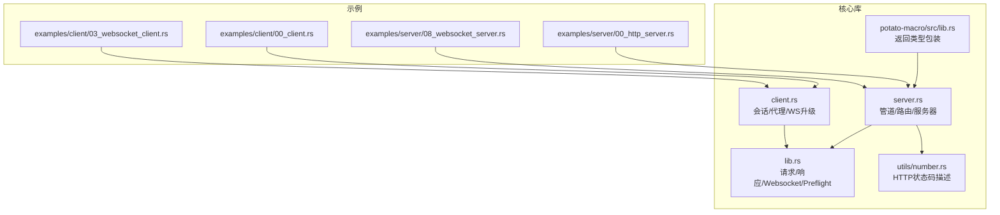
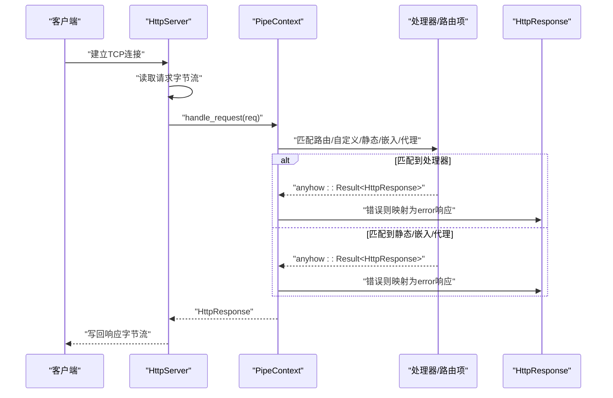
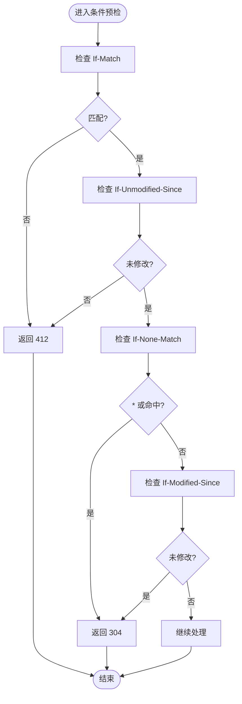
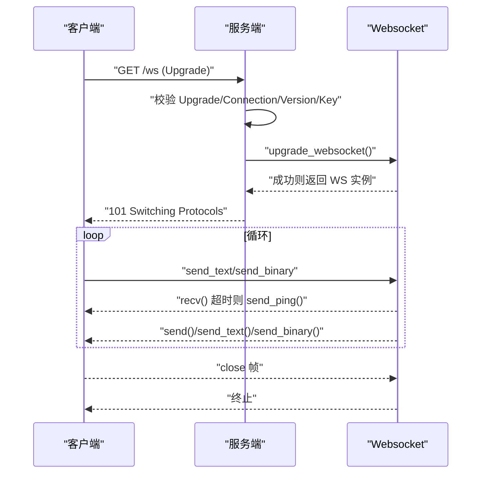
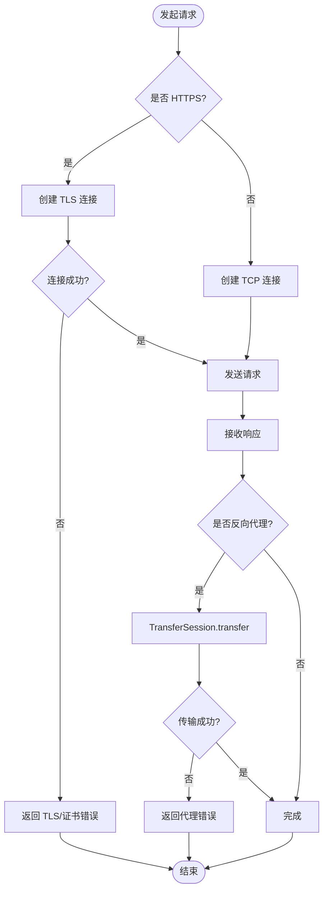
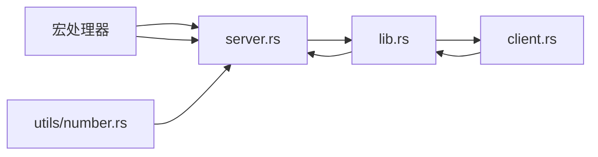

# 错误处理API

<cite>
**本文引用的文件**
- [lib.rs](file://potato/src/lib.rs)
- [server.rs](file://potato/src/server.rs)
- [client.rs](file://potato/src/client.rs)
- [number.rs](file://potato/src/utils/number.rs)
- [lib.rs（宏）](file://potato-macro/src/lib.rs)
- [00_client.rs](file://examples/client/00_client.rs)
- [03_websocket_client.rs](file://examples/client/03_websocket_client.rs)
- [00_http_server.rs](file://examples/server/00_http_server.rs)
- [08_websocket_server.rs](file://examples/server/08_websocket_server.rs)
</cite>

## 目录
1. [简介](#简介)
2. [项目结构](#项目结构)
3. [核心组件](#核心组件)
4. [架构总览](#架构总览)
5. [详细组件分析](#详细组件分析)
6. [依赖关系分析](#依赖关系分析)
7. [性能考量](#性能考量)
8. [故障排查指南](#故障排查指南)
9. [结论](#结论)
10. [附录](#附录)

## 简介
本文件系统性梳理 Potato 框架中的错误处理API与机制，覆盖以下方面：
- 错误类型与异常传播路径（anyhow::Result 与内部 HttpResponse 的组合）
- Result 类型在处理器与宏展开中的使用方式
- 常见 HTTP 错误码及语义（4xx/5xx），以及条件预检（304/412）的触发逻辑
- WebSocket 连接错误、网络超时、证书验证失败等特殊错误场景
- 最佳实践与调试技巧
- 错误日志记录与错误恢复的实现建议
- 完整的错误处理示例代码路径

## 项目结构
围绕错误处理的关键模块与文件如下：
- 错误与响应模型：lib.rs 中定义了 HttpRequest、HttpResponse、PreflightResult、Websocket 及其帧类型
- 服务器端路由与错误传播：server.rs 中的 PipeContext、HttpServer 将错误统一映射为 HttpResponse
- 客户端与代理错误传播：client.rs 中 Session/TransferSession 在连接、TLS、转发、WS 升级等环节返回错误
- HTTP 状态码描述工具：utils/number.rs 提供 u16 到标准原因短语的映射
- 宏展开与返回类型处理：potato-macro/src/lib.rs 对处理器返回类型进行统一包装，将错误转为 HttpResponse.error
- 示例：examples 下的客户端与服务端示例展示典型错误场景



**图表来源**
- [lib.rs](file://potato/src/lib.rs#L45-L1220)
- [server.rs](file://potato/src/server.rs#L1-L933)
- [client.rs](file://potato/src/client.rs#L1-L615)
- [number.rs](file://potato/src/utils/number.rs#L1-L13)
- [lib.rs（宏）](file://potato-macro/src/lib.rs#L203-L233)
- [00_http_server.rs](file://examples/server/00_http_server.rs#L1-L12)
- [08_websocket_server.rs](file://examples/server/08_websocket_server.rs#L1-L43)
- [00_client.rs](file://examples/client/00_client.rs#L1-L7)
- [03_websocket_client.rs](file://examples/client/03_websocket_client.rs#L1-L11)

**章节来源**
- [lib.rs](file://potato/src/lib.rs#L45-L1220)
- [server.rs](file://potato/src/server.rs#L1-L933)
- [client.rs](file://potato/src/client.rs#L1-L615)
- [number.rs](file://potato/src/utils/number.rs#L1-L13)
- [lib.rs（宏）](file://potato-macro/src/lib.rs#L203-L233)
- [00_http_server.rs](file://examples/server/00_http_server.rs#L1-L12)
- [08_websocket_server.rs](file://examples/server/08_websocket_server.rs#L1-L43)
- [00_client.rs](file://examples/client/00_client.rs#L1-L7)
- [03_websocket_client.rs](file://examples/client/03_websocket_client.rs#L1-L11)

## 核心组件
- 错误载体与传播
  - 处理器返回类型支持多种形态，宏会将其统一封装为 HttpResponse；若发生错误，则通过 HttpResponse.error 输出
  - 客户端与服务器在连接、TLS、WS 升级、反向代理等环节均以 anyhow::Result 形式返回错误
- HTTP 条件预检与状态码
  - PreflightResult 支持 304 Not Modified、412 Precondition Failed、Proceed
  - 服务器在静态路由、嵌入资源、WebDAV 等场景根据条件头返回相应状态码
- WebSocket 错误
  - 连接握手失败、非 101 状态码、接收超时、opcode 不支持、关闭帧等均视为错误
- HTTP 状态码描述
  - u16 到标准原因短语的映射，便于日志与错误消息输出

**章节来源**
- [lib.rs（宏）](file://potato-macro/src/lib.rs#L203-L233)
- [lib.rs](file://potato/src/lib.rs#L45-L1220)
- [server.rs](file://potato/src/server.rs#L420-L766)
- [client.rs](file://potato/src/client.rs#L68-L146)
- [number.rs](file://potato/src/utils/number.rs#L1-L13)

## 架构总览
下图展示了从请求进入、路由匹配、处理器执行到错误传播的整体流程。



**图表来源**
- [server.rs](file://potato/src/server.rs#L826-L871)
- [server.rs](file://potato/src/server.rs#L362-L766)
- [lib.rs（宏）](file://potato-macro/src/lib.rs#L203-L233)

**章节来源**
- [server.rs](file://potato/src/server.rs#L826-L933)
- [server.rs](file://potato/src/server.rs#L362-L766)
- [lib.rs（宏）](file://potato-macro/src/lib.rs#L203-L233)

## 详细组件分析

### 组件A：错误类型与传播模式
- 返回类型与宏包装
  - 宏支持四种返回类型：()、anyhow::Result<()>、HttpResponse、anyhow::Result<HttpResponse>
  - 未显式返回 HttpResponse 的处理器，最终会被包装为 HttpResponse；错误分支统一走 HttpResponse.error
- 服务器侧错误传播
  - 自定义处理器可直接返回 Option<HttpResponse>，Err 时映射为 error 响应
  - 静态/嵌入/反向代理等路由在 Err 时同样映射为 error 响应
- 客户端侧错误传播
  - Session/TransferSession 在 TLS、连接、WS 升级、反代等环节返回 anyhow::Result
  - WS 接收超时自动发送 Ping 并循环等待，收到 close 或错误即终止

```mermaid
flowchart TD
Start(["进入处理器"]) --> RetType{"返回类型"}
RetType --> |()| OkText["返回文本响应"]
RetType --> |Result<()>| OkOrErr1{"是否错误?"}
OkOrErr1 --> |是| Err1["HttpResponse.error(...)"]
OkOrErr1 --> |否| OkText
RetType --> |HttpResponse| ReturnRes["直接返回"]
RetType --> |Result<HttpResponse>| OkOrErr2{"是否错误?"}
OkOrErr2 --> |是| Err2["HttpResponse.error(...)"]
OkOrErr2 --> |否| ReturnRes
Err1 --> End(["结束"])
Err2 --> End
OkText --> End
ReturnRes --> End
```

**图表来源**
- [lib.rs（宏）](file://potato-macro/src/lib.rs#L203-L233)

**章节来源**
- [lib.rs（宏）](file://potato-macro/src/lib.rs#L203-L233)
- [server.rs](file://potato/src/server.rs#L610-L614)
- [server.rs](file://potato/src/server.rs#L623-L626)

### 组件B：HTTP 条件预检与状态码
- 预检结果
  - 304 Not Modified：If-None-Match=* 或命中 ETag；或 If-Modified-Since 未修改
  - 412 Precondition Failed：If-Match 不匹配或 If-Unmodified-Since 已修改
  - Proceed：继续常规处理
- 服务器端应用
  - 本地目录路由、嵌入资源路由、Jemalloc 路由、WebDAV 路由均在 Err 时返回 error 响应，在命中条件时返回 304/412



**图表来源**
- [lib.rs](file://potato/src/lib.rs#L777-L857)

**章节来源**
- [lib.rs](file://potato/src/lib.rs#L777-L857)
- [server.rs](file://potato/src/server.rs#L440-L461)
- [server.rs](file://potato/src/server.rs#L587-L597)

### 组件C：WebSocket 错误与超时
- 连接阶段
  - 握手非 101 状态码即报错
  - 无法获取底层流或握手键缺失时报错
- 数据收发
  - 接收超时自动发送 Ping 并循环等待
  - 收到 close 帧或错误时终止
  - 不支持的 opcode 报错
- 示例
  - 客户端示例展示连接、发送 ping、发送文本、接收帧
  - 服务端示例展示升级为 WS 并回显



**图表来源**
- [lib.rs](file://potato/src/lib.rs#L560-L579)
- [lib.rs](file://potato/src/lib.rs#L208-L359)
- [client.rs](file://potato/src/client.rs#L560-L591)

**章节来源**
- [lib.rs](file://potato/src/lib.rs#L208-L359)
- [lib.rs](file://potato/src/lib.rs#L560-L579)
- [client.rs](file://potato/src/client.rs#L560-L591)
- [03_websocket_client.rs](file://examples/client/03_websocket_client.rs#L1-L11)
- [08_websocket_server.rs](file://examples/server/08_websocket_server.rs#L25-L35)

### 组件D：客户端与反向代理错误
- 连接与 TLS
  - 非 TLS 构建启用 TLS 会报错
  - TLS 连接失败、证书链加载失败、DNS 名称解析失败等均以错误返回
- 反向代理
  - 代理路径前缀替换、目标主机解析、SSH 跳板连接、WS 升级透传等均可能出错
  - 修改内容时的压缩/解压与长度修正失败也会导致错误
- 示例
  - 客户端 GET 请求示例
  - 服务端 WS 透传示例



**图表来源**
- [client.rs](file://potato/src/client.rs#L68-L146)
- [client.rs](file://potato/src/client.rs#L275-L473)

**章节来源**
- [client.rs](file://potato/src/client.rs#L68-L146)
- [client.rs](file://potato/src/client.rs#L275-L473)
- [00_client.rs](file://examples/client/00_client.rs#L1-L7)
- [08_websocket_server.rs](file://examples/server/08_websocket_server.rs#L25-L35)

## 依赖关系分析
- 模块耦合
  - server.rs 依赖 lib.rs 中的请求/响应/Websocket/Preflight 与 utils/number.rs 的状态码描述
  - client.rs 依赖 lib.rs 的请求/响应/Websocket 与 utils/tcp_stream
  - 宏模块负责统一处理器返回类型包装，减少上层样板代码
- 外部依赖
  - anyhow::Result 作为统一错误载体
  - http 库用于状态码与原因短语映射
  - tokio/tokio-rustls/russh 等用于异步与 TLS/SSH



**图表来源**
- [server.rs](file://potato/src/server.rs#L1-L933)
- [lib.rs](file://potato/src/lib.rs#L1-L1220)
- [client.rs](file://potato/src/client.rs#L1-L615)
- [number.rs](file://potato/src/utils/number.rs#L1-L13)
- [lib.rs（宏）](file://potato-macro/src/lib.rs#L203-L233)

**章节来源**
- [server.rs](file://potato/src/server.rs#L1-L933)
- [lib.rs](file://potato/src/lib.rs#L1-L1220)
- [client.rs](file://potato/src/client.rs#L1-L615)
- [number.rs](file://potato/src/utils/number.rs#L1-L13)
- [lib.rs（宏）](file://potato-macro/src/lib.rs#L203-L233)

## 性能考量
- 压缩与编码
  - HttpResponse 支持 gzip 压缩，仅在满足阈值且未设置 Content-Encoding 时生效
  - 反向代理在修改内容时需解压/重压缩，注意 CPU 与内存开销
- 连接复用
  - Session/TransferSession 会按主机/协议/端口缓存连接，减少重复握手成本
- 超时与心跳
  - WS 接收超时自动 Ping，避免长时间阻塞；合理设置 ping 间隔与超时时间

[本节为通用指导，无需特定文件引用]

## 故障排查指南
- 常见错误定位
  - 404：路由未匹配，确认 use_handlers/use_location_route/use_embedded_route/use_reverse_proxy 的顺序与路径前缀
  - 412/304：检查 If-Match/If-Unmodified-Since/If-None-Match/If-Modified-Since 与 ETag 生成
  - 500：宏包装后的错误消息通常包含原始错误详情；检查处理器返回类型与内部异常
  - WS 握手失败：确认 Upgrade/Connection/Upgrade/WebSocket-Version/WebSocket-Key 头齐全且正确
  - TLS/证书问题：确认证书链、域名匹配、构建特性开关（feature = "tls"）
- 日志与可观测性
  - 使用 HttpResponse.error 的错误消息作为日志载体
  - 在宏包装前后记录上下文信息，便于追踪
- 恢复策略
  - 对于瞬时网络错误，可在上层重试（注意幂等性）
  - 对于 WS，超时自动 Ping 有助于维持连接；遇到 close 帧及时退出并清理资源

**章节来源**
- [server.rs](file://potato/src/server.rs#L420-L766)
- [lib.rs](file://potato/src/lib.rs#L777-L857)
- [client.rs](file://potato/src/client.rs#L68-L146)
- [lib.rs（宏）](file://potato-macro/src/lib.rs#L203-L233)

## 结论
Potato 框架通过宏包装与统一的 HttpResponse 错误传播，简化了错误处理复杂度；结合条件预检、WS 超时与 TLS/SSH 等场景的错误封装，提供了清晰的错误语义与可观测性。建议在实际工程中：
- 明确处理器返回类型，优先使用 Result<HttpResponse>
- 合理利用条件预检，减少不必要的数据传输
- 在 WS 场景中配置合适的 ping 间隔与超时
- 对 TLS/SSH/反代等高风险路径增加重试与降级策略

[本节为总结性内容，无需特定文件引用]

## 附录

### 常见 HTTP 错误码与含义
- 304 Not Modified：命中 ETag 或 If-Modified-Since 未变更
- 412 Precondition Failed：If-Match 不匹配或 If-Unmodified-Since 已变更
- 404 Not Found：路由未匹配或静态资源不存在
- 500 Internal Server Error：处理器或路由内部错误，通过 HttpResponse.error 返回

**章节来源**
- [lib.rs](file://potato/src/lib.rs#L777-L857)
- [server.rs](file://potato/src/server.rs#L420-L766)
- [number.rs](file://potato/src/utils/number.rs#L1-L13)

### 特殊错误类型与场景
- WebSocket 连接错误
  - 非 101 状态码、握手键缺失、底层流不可用
- 网络超时
  - WS 接收超时自动 Ping，持续无响应则终止
- 证书验证失败
  - TLS 连接失败、证书链加载失败、域名不匹配

**章节来源**
- [lib.rs](file://potato/src/lib.rs#L208-L359)
- [client.rs](file://potato/src/client.rs#L68-L146)
- [client.rs](file://potato/src/client.rs#L384-L411)

### 错误处理最佳实践
- 明确返回类型：优先 Result<HttpResponse>，便于错误传播与统一处理
- 使用条件预检：在静态/嵌入资源路由中充分利用 304/412
- 记录错误上下文：在宏包装前后记录请求路径、方法、参数等
- WS 超时与心跳：合理设置 ping 间隔，避免长时间阻塞
- TLS/SSH/反代：在上层增加重试与降级策略，提升可用性

[本节为通用指导，无需特定文件引用]

### 错误处理示例代码路径
- 服务器端处理器返回 HttpResponse
  - [00_http_server.rs](file://examples/server/00_http_server.rs#L1-L12)
- WebSocket 服务端升级与回显
  - [08_websocket_server.rs](file://examples/server/08_websocket_server.rs#L25-L35)
- 客户端 HTTP GET 请求
  - [00_client.rs](file://examples/client/00_client.rs#L1-L7)
- 客户端 WebSocket 连接与收发
  - [03_websocket_client.rs](file://examples/client/03_websocket_client.rs#L1-L11)

**章节来源**
- [00_http_server.rs](file://examples/server/00_http_server.rs#L1-L12)
- [08_websocket_server.rs](file://examples/server/08_websocket_server.rs#L25-L35)
- [00_client.rs](file://examples/client/00_client.rs#L1-L7)
- [03_websocket_client.rs](file://examples/client/03_websocket_client.rs#L1-L11)