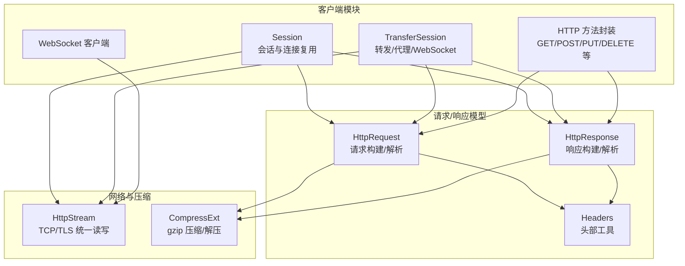
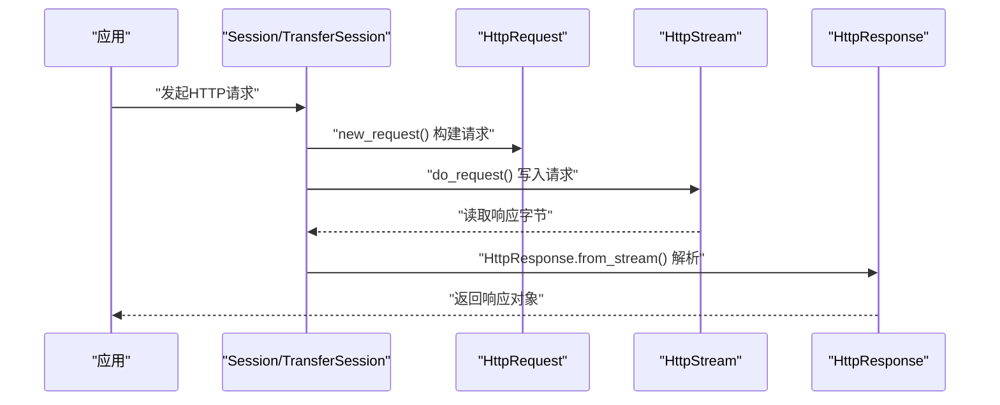
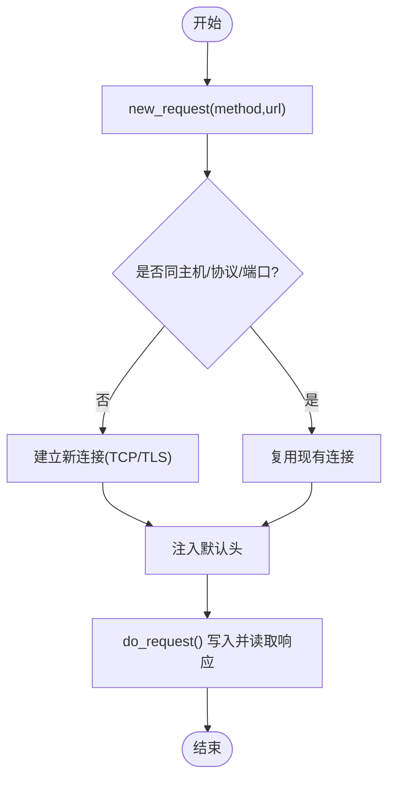
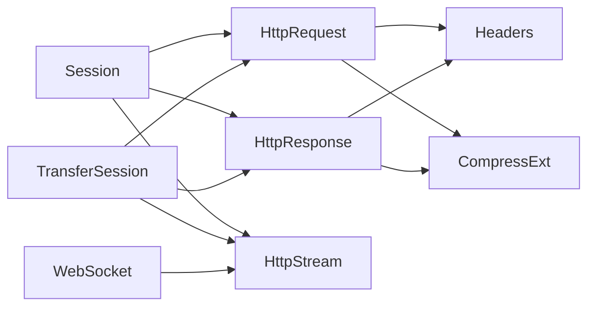

# HTTP客户端

<cite>
**本文引用的文件**
- [client.rs](file://potato/src/client.rs)
- [lib.rs](file://potato/src/lib.rs)
- [tcp_stream.rs](file://potato/src/utils/tcp_stream.rs)
- [bytes.rs](file://potato/src/utils/bytes.rs)
- [00_client.rs](file://examples/client/00_client.rs)
- [01_client_with_arg.rs](file://examples/client/01_client_with_arg.rs)
- [02_client_session.rs](file://examples/client/02_client_session.rs)
- [03_websocket_client.rs](file://examples/client/03_websocket_client.rs)
- [06_client.md](file://docs/guide/06_client.md)
- [Cargo.toml](file://Cargo.toml)
</cite>

## 目录
1. [简介](#简介)
2. [项目结构](#项目结构)
3. [核心组件](#核心组件)
4. [架构总览](#架构总览)
5. [组件详解](#组件详解)
6. [依赖关系分析](#依赖关系分析)
7. [性能与优化](#性能与优化)
8. [故障排查指南](#故障排查指南)
9. [结论](#结论)
10. [附录](#附录)

## 简介
本指南面向希望使用 Potato 提供的 HTTP 客户端能力的开发者，系统讲解如何创建与配置客户端、管理会话与连接复用、发起各类 HTTP 方法请求、传递参数与处理响应、进行 JSON 的序列化与反序列化、错误处理与重试策略、TLS/SSL 配置与证书验证、集成 RESTful API 与第三方服务，以及性能优化与最佳实践。

## 项目结构
- 客户端核心位于 potato/src/client.rs，包含 Session、TransferSession、HTTP 方法封装与 WebSocket 支持。
- 请求/响应模型与工具位于 potato/src/lib.rs，定义了 HttpRequest、HttpResponse、Headers、WebSocket 协议处理等。
- 底层网络抽象位于 potato/src/utils/tcp_stream.rs，统一 TCP/TLS 流读写接口。
- 压缩工具位于 potato/src/utils/bytes.rs，支持 gzip 压缩与解压。
- 示例位于 examples/client 下，涵盖基础 GET、带参数、会话复用、WebSocket。
- 文档位于 docs/guide/06_client.md，提供使用说明与示例说明。

图表来源
- [client.rs](file://potato/src/client.rs#L101-L157)
- [lib.rs](file://potato/src/lib.rs#L203-L359)
- [lib.rs](file://potato/src/lib.rs#L385-L477)
- [lib.rs](file://potato/src/lib.rs#L880-L951)
- [tcp_stream.rs](file://potato/src/utils/tcp_stream.rs#L11-L73)
- [bytes.rs](file://potato/src/utils/bytes.rs#L4-L32)

章节来源
- [Cargo.toml](file://Cargo.toml#L1-L4)
- [client.rs](file://potato/src/client.rs#L101-L157)
- [lib.rs](file://potato/src/lib.rs#L203-L359)
- [lib.rs](file://potato/src/lib.rs#L385-L477)
- [lib.rs](file://potato/src/lib.rs#L880-L951)
- [tcp_stream.rs](file://potato/src/utils/tcp_stream.rs#L11-L73)
- [bytes.rs](file://potato/src/utils/bytes.rs#L4-L32)

## 核心组件
- Session：无状态一次性请求或会话式请求；自动复用同一主机/协议/端口的连接。
- TransferSession：反向/正向代理与内容改写、WebSocket 转发。
- HTTP 方法封装：get/post/put/delete/head/options/connect/patch/trace 等，含 JSON 快捷方法。
- WebSocket 客户端：基于已升级的持久连接进行帧收发与心跳。
- 请求/响应模型：HttpRequest/HttpResponse，支持查询参数、表单、JSON、multipart 等。
- 网络层：HttpStream 封装 TCP/TLS/Duplex，统一读写接口。
- 压缩：gzip 压缩/解压工具，配合响应内容编码处理。

章节来源
- [client.rs](file://potato/src/client.rs#L101-L157)
- [client.rs](file://potato/src/client.rs#L224-L473)
- [lib.rs](file://potato/src/lib.rs#L203-L359)
- [lib.rs](file://potato/src/lib.rs#L385-L477)
- [lib.rs](file://potato/src/lib.rs#L880-L951)
- [tcp_stream.rs](file://potato/src/utils/tcp_stream.rs#L11-L73)
- [bytes.rs](file://potato/src/utils/bytes.rs#L4-L32)

## 架构总览
下图展示从应用到网络栈的整体调用链：应用通过 Session/TransferSession 发起请求，构建 HttpRequest，经由 HttpStream 写入底层 TCP/TLS，再由 HttpResponse 解析返回数据。

图表来源
- [client.rs](file://potato/src/client.rs#L110-L140)
- [lib.rs](file://potato/src/lib.rs#L588-L699)
- [tcp_stream.rs](file://potato/src/utils/tcp_stream.rs#L40-L73)

## 组件详解

### 会话与连接复用（Session）
- 自动识别目标主机、是否 HTTPS、端口，若与当前会话一致则复用连接；否则新建连接。
- 每次请求自动注入 User-Agent 头，必要时追加 Host 头。
- 提供 get/post/put/delete/head/options/connect/patch/trace 等方法；JSON 版本自动设置 Content-Type。

图表来源
- [client.rs](file://potato/src/client.rs#L110-L140)
- [client.rs](file://potato/src/client.rs#L67-L99)

章节来源
- [client.rs](file://potato/src/client.rs#L101-L157)
- [client.rs](file://potato/src/client.rs#L67-L99)

### HTTP 方法与参数传递
- 方法封装：get/post/put/delete/head/options/connect/patch/trace。
- 参数传递：通过 Headers 列表传入，如 User-Agent、Content-Type、自定义头等。
- JSON 请求：提供 post_json/put_json 等便捷方法，自动设置 application/json 并序列化请求体。

章节来源
- [client.rs](file://potato/src/client.rs#L148-L156)
- [client.rs](file://potato/src/client.rs#L191-L199)
- [client.rs](file://potato/src/client.rs#L40-L58)

### 响应处理与内容协商
- HttpResponse 提供常用构造器（html/json/text 等），默认包含 Date/Server/Connection/Content-Type/Cache-Control 等头部。
- 从流中解析响应：按头部长度读取完整头部，再读取 body；根据 Content-Encoding 进行 gzip 解压（在 TransferSession 中可选改写）。
- 状态码描述：通过扩展 trait 映射标准状态码描述。

章节来源
- [lib.rs](file://potato/src/lib.rs#L880-L951)
- [lib.rs](file://potato/src/lib.rs#L859-L876)
- [lib.rs](file://potato/src/lib.rs#L588-L699)
- [bytes.rs](file://potato/src/utils/bytes.rs#L4-L32)
- [lib.rs](file://potato/src/utils/number.rs#L1-L13)

### JSON 序列化与反序列化
- 请求侧：post_json/put_json 将 serde_json::Value 序列化为字节数组后发送。
- 响应侧：可直接以 application/json 形式接收并处理。
- 表单与 multipart：HttpRequest 支持解析 application/x-www-form-urlencoded 与 multipart/form-data，并填充 body_pairs/body_files 字段，便于后续反序列化。

章节来源
- [client.rs](file://potato/src/client.rs#L40-L58)
- [lib.rs](file://potato/src/lib.rs#L622-L697)

### 错误处理与超时/重试
- 统一使用 anyhow::Result 包裹错误，便于链路传播。
- 网络层：HttpStream 在读取 0 字节时返回“连接关闭”错误；gzip 解压失败时返回 io::Error。
- 超时与重试：当前未内置超时与重试逻辑，可在应用层结合 tokio::time::timeout 或外部重试库实现。

章节来源
- [tcp_stream.rs](file://potato/src/utils/tcp_stream.rs#L120-L128)
- [bytes.rs](file://potato/src/utils/bytes.rs#L16-L21)

### TLS/SSL 配置与证书验证
- 仅在启用 feature=tls 时支持 HTTPS；非 TLS 构建下访问 HTTPS 将报错。
- 使用 rustls 作为 TLS 客户端，根证书来自 webpki_roots，禁用客户端认证。
- 通过 DNS 名称 ServerName 进行 SNI 与证书校验。

章节来源
- [client.rs](file://potato/src/client.rs#L68-L99)
- [tcp_stream.rs](file://potato/src/utils/tcp_stream.rs#L11-L18)

### WebSocket 客户端
- 通过 Session 发起升级请求，检查 101 Switching Protocols。
- 支持 ping/pong 心跳与文本/二进制帧收发；内部维护持久 HttpStream。
- 与 TransferSession 结合可实现 WebSocket 转发。

章节来源
- [lib.rs](file://potato/src/lib.rs#L203-L359)
- [client.rs](file://potato/src/client.rs#L475-L592)

### 反向/正向代理与内容改写（TransferSession）
- 支持从正向代理或反向代理场景创建会话，自动复用目标主机/协议/端口的连接。
- 可选修改响应内容：替换 URL、更新 Content-Length、移除 Transfer-Encoding 等。
- 支持通过 SSH Jumpbox 建立隧道（feature=ssh）。

章节来源
- [client.rs](file://potato/src/client.rs#L224-L473)

### 实际 API 调用示例
- 基础 GET 请求：参见示例 00_client.rs。
- 带自定义头：参见示例 01_client_with_arg.rs。
- 会话复用：参见示例 02_client_session.rs。
- WebSocket：参见示例 03_websocket_client.rs。
- 文档中的使用说明与示例：参见 docs/guide/06_client.md。

章节来源
- [00_client.rs](file://examples/client/00_client.rs#L1-L7)
- [01_client_with_arg.rs](file://examples/client/01_client_with_arg.rs#L1-L7)
- [02_client_session.rs](file://examples/client/02_client_session.rs#L1-L10)
- [03_websocket_client.rs](file://examples/client/03_websocket_client.rs#L1-L11)
- [06_client.md](file://docs/guide/06_client.md#L1-L72)

## 依赖关系分析
- 组件耦合：Session/TransferSession 依赖 HttpRequest/HttpResponse 与 HttpStream；WebSocket 客户端依赖 Session 与 HttpStream。
- 外部依赖：tokio、rustls（feature=tls）、webpki_roots、flate2（gzip）、httparse（请求解析）。
- 功能开关：feature=tls 控制 HTTPS；feature=ssh 控制 Jumpbox。

图表来源
- [client.rs](file://potato/src/client.rs#L101-L157)
- [client.rs](file://potato/src/client.rs#L224-L473)
- [lib.rs](file://potato/src/lib.rs#L203-L359)
- [lib.rs](file://potato/src/lib.rs#L385-L477)
- [lib.rs](file://potato/src/lib.rs#L880-L951)
- [tcp_stream.rs](file://potato/src/utils/tcp_stream.rs#L11-L73)
- [bytes.rs](file://potato/src/utils/bytes.rs#L4-L32)

章节来源
- [client.rs](file://potato/src/client.rs#L101-L157)
- [client.rs](file://potato/src/client.rs#L224-L473)
- [lib.rs](file://potato/src/lib.rs#L203-L359)
- [lib.rs](file://potato/src/lib.rs#L385-L477)
- [lib.rs](file://potato/src/lib.rs#L880-L951)
- [tcp_stream.rs](file://potato/src/utils/tcp_stream.rs#L11-L73)
- [bytes.rs](file://potato/src/utils/bytes.rs#L4-L32)

## 性能与优化
- 连接复用：优先使用 Session，对同一主机/协议/端口复用连接，减少握手开销。
- 批量请求：在单个 Session 中顺序发起多个请求，利用 keep-alive。
- 压缩：服务端返回 gzip 时，使用 CompressExt 进行解压；必要时在应用层缓存解压结果。
- 超时与背压：结合 tokio::time::timeout 与限速策略，避免阻塞；合理设置缓冲区大小。
- TLS：在高并发场景下，尽量减少证书验证与握手次数，必要时考虑连接池与预热。
- 日志与监控：记录请求耗时、错误率与重试次数，定位瓶颈。

## 故障排查指南
- 访问 HTTPS 报“不支持 TLS”：确认构建启用了 feature=tls。
- “连接关闭”错误：检查远端是否提前断开，或网络不稳定。
- gzip 解压失败：确认 Content-Encoding 与响应体一致性。
- WebSocket 握手失败：确认 101 状态码与 Sec-WebSocket-* 头正确。
- 重试与超时：当前未内置，需在应用层实现；可参考 p-retry 等库。

章节来源
- [client.rs](file://potato/src/client.rs#L87-L88)
- [tcp_stream.rs](file://potato/src/utils/tcp_stream.rs#L120-L128)
- [bytes.rs](file://potato/src/utils/bytes.rs#L16-L21)
- [lib.rs](file://potato/src/lib.rs#L203-L359)

## 结论
Potato 的 HTTP 客户端以简洁的 API 提供了会话复用、TLS 支持、JSON/表单/multipart 处理、WebSocket 能力与代理转发功能。通过合理使用 Session 与 TransferSession，并结合超时/重试、压缩与连接池策略，可在保证易用性的同时获得良好的性能与可靠性。

## 附录

### 常用 API 一览（路径）
- 创建会话并发起 GET：[Session::get](file://potato/src/client.rs#L148)
- 发起 POST/PUT/DELETE 等：[Session::post/put/delete](file://potato/src/client.rs#L149-L151)
- JSON 请求（自动设置 Content-Type）：[post_json/put_json](file://potato/src/client.rs#L46-L57)
- WebSocket 连接与收发：[Websocket::connect/send/recv](file://potato/src/lib.rs#L208-L359)
- 反向/正向代理与内容改写：[TransferSession::from_reverse_proxy/from_forward_proxy/transfer](file://potato/src/client.rs#L233-L473)
- 请求构建与解析：[HttpRequest::from_url/from_stream](file://potato/src/lib.rs#L465-L477)
- 响应构建与头部：[HttpResponse::json/html/text 等](file://potato/src/lib.rs#L890-L924)
- 网络读写抽象：[HttpStream::read/write_all](file://potato/src/utils/tcp_stream.rs#L40-L72)
- gzip 压缩/解压：[CompressExt](file://potato/src/utils/bytes.rs#L4-L32)