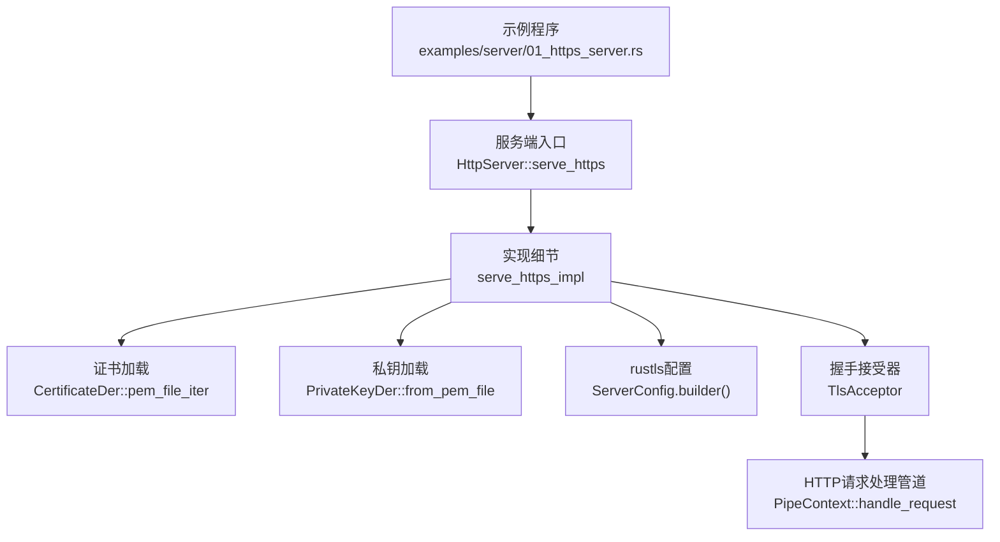
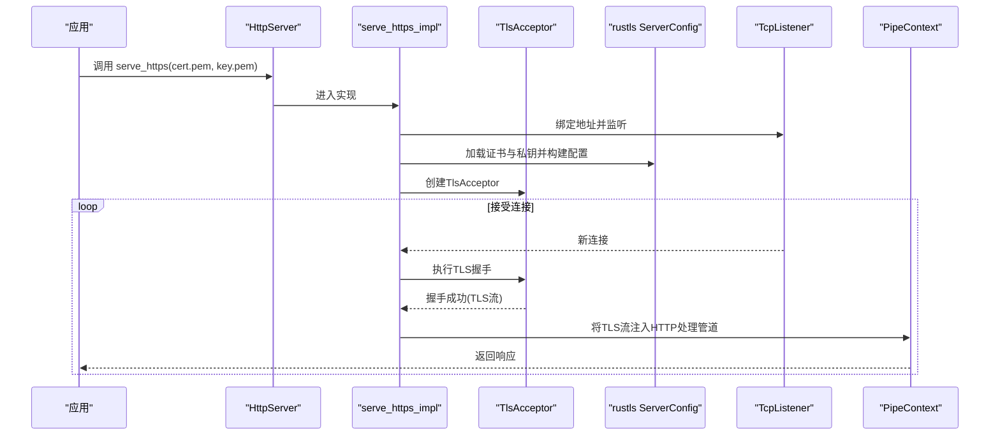
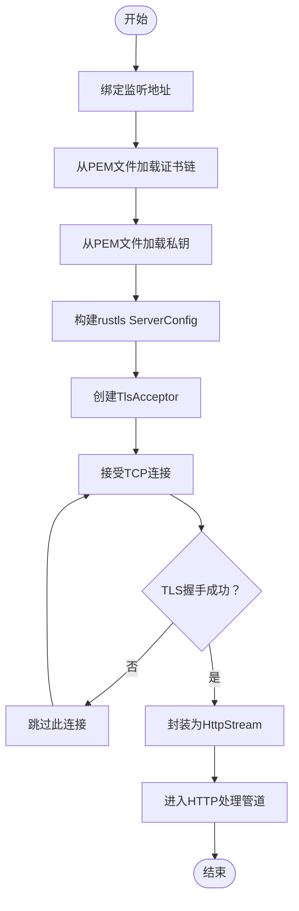
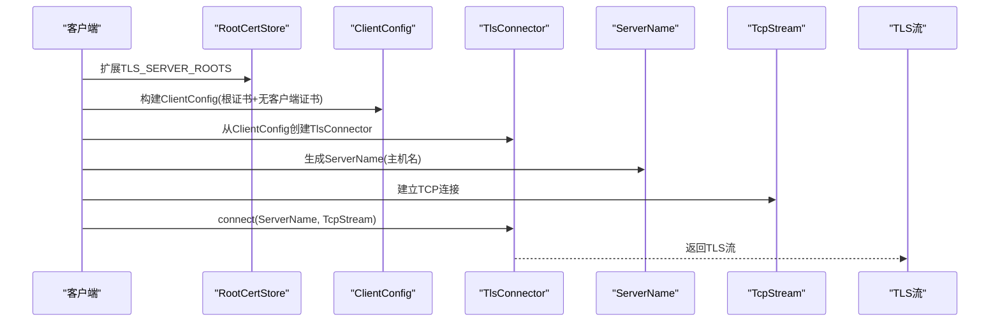
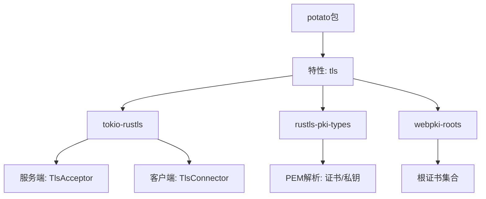

# HTTPS/TLS配置

<cite>
**本文引用的文件**
- [examples/server/01_https_server.rs](file://examples/server/01_https_server.rs)
- [potato/src/server.rs](file://potato/src/server.rs)
- [potato/src/client.rs](file://potato/src/client.rs)
- [potato/Cargo.toml](file://potato/Cargo.toml)
- [README.md](file://README.md)
</cite>

## 目录
1. [简介](#简介)
2. [项目结构](#项目结构)
3. [核心组件](#核心组件)
4. [架构总览](#架构总览)
5. [详细组件分析](#详细组件分析)
6. [依赖关系分析](#依赖关系分析)
7. [性能考虑](#性能考虑)
8. [故障排除指南](#故障排除指南)
9. [结论](#结论)
10. [附录](#附录)

## 简介
本指南围绕Potato框架中的HTTPS/TLS配置展开，系统讲解证书加载与配置流程（PEM格式证书与私钥）、证书链验证、域名匹配与过期检查机制、TLS握手过程与安全参数配置、证书热更新与轮换策略、常见证书颁发机构（Let's Encrypt、自签名证书、企业CA）的配置示例，以及性能优化建议（会话复用、ALPN支持）与故障排除方法。

## 项目结构
与HTTPS/TLS相关的核心位置：
- 示例：examples/server/01_https_server.rs 展示如何以HTTPS方式启动服务，并传入证书与私钥文件路径。
- 服务端实现：potato/src/server.rs 提供serve_https与内部实现serve_https_impl，使用rustls进行TLS配置与握手。
- 客户端实现：potato/src/client.rs 展示客户端侧TLS连接建立，使用webpki根证书进行验证。
- 依赖与特性：potato/Cargo.toml 定义了tls特性及依赖项（tokio-rustls、rustls-pki-types、webpki-roots等）。
- 使用说明：README.md 提供基本使用示例与在线文档链接。

**图示来源**
- [examples/server/01_https_server.rs](file://examples/server/01_https_server.rs#L1-L12)
- [potato/src/server.rs](file://potato/src/server.rs#L812-L887)

**章节来源**
- [examples/server/01_https_server.rs](file://examples/server/01_https_server.rs#L1-L12)
- [README.md](file://README.md#L1-L57)

## 核心组件
- TLS服务端入口
  - 公开方法：HttpServer::serve_https
  - 内部实现：serve_https_impl，负责监听、加载证书与私钥、构建rustls ServerConfig、创建TlsAcceptor并进入accept循环。
- TLS客户端连接
  - SessionImpl::new与代理转发场景中的连接逻辑，使用ClientConfig与RootCertStore，结合webpki_roots完成根证书验证。
- 证书与私钥加载
  - 使用rustls-pki-types提供的PEM解析能力，从文件读取证书链与私钥，构建ServerConfig。
- 握手与会话
  - TlsAcceptor执行TLS握手；成功后包装为HttpStream，进入HTTP请求处理流程。

**章节来源**
- [potato/src/server.rs](file://potato/src/server.rs#L812-L887)
- [potato/src/client.rs](file://potato/src/client.rs#L67-L98)
- [potato/src/client.rs](file://potato/src/client.rs#L384-L417)
- [potato/Cargo.toml](file://potato/Cargo.toml#L32-L41)

## 架构总览
下图展示Potato中HTTPS/TLS的端到端流程：从应用启动到TLS握手与HTTP处理。

**图示来源**
- [potato/src/server.rs](file://potato/src/server.rs#L812-L887)
- [potato/src/server.rs](file://potato/src/server.rs#L889-L931)

## 详细组件分析

### 服务端HTTPS配置与握手
- 证书与私钥加载
  - 证书链：通过CertificateDer::pem_file_iter从PEM文件读取证书列表。
  - 私钥：通过PrivateKeyDer::from_pem_file从PEM文件读取私钥。
  - 配置：使用rustls::ServerConfig::builder()构建配置，设置无客户端认证，绑定证书与私钥。
  - 接受器：基于配置创建TlsAcceptor，用于后续握手。
- 握手与处理
  - 每个新TCP连接进入accept循环，交由TlsAcceptor完成握手。
  - 握手成功后，将TLS流封装为HttpStream，注入PipeContext进行HTTP请求处理。
- 错误处理
  - 握手失败时跳过该连接，避免阻塞后续连接。

**图示来源**
- [potato/src/server.rs](file://potato/src/server.rs#L873-L931)

**章节来源**
- [potato/src/server.rs](file://potato/src/server.rs#L812-L887)
- [potato/src/server.rs](file://potato/src/server.rs#L889-L931)

### 客户端TLS连接与根证书验证
- 根证书来源
  - 使用webpki_roots::TLS_SERVER_ROOTS作为默认根证书集合，扩展到RootCertStore。
- 客户端配置
  - ClientConfig::builder()构建配置，设置根证书存储，无客户端证书（no client auth）。
  - 通过TlsConnector::from创建连接器，使用ServerName进行SNI与主机名校验。
- 连接建立
  - 建立TCP连接后，执行connector.connect(dnsname, tcp_stream)，完成TLS握手。
- 代理/转发场景
  - 在HTTP CONNECT或目标明确为HTTPS时，同样使用上述流程建立下游TLS连接。

**图示来源**
- [potato/src/client.rs](file://potato/src/client.rs#L67-L98)
- [potato/src/client.rs](file://potato/src/client.rs#L384-L417)

**章节来源**
- [potato/src/client.rs](file://potato/src/client.rs#L67-L98)
- [potato/src/client.rs](file://potato/src/client.rs#L384-L417)

### 证书链验证、域名匹配与过期检查
- 证书链验证
  - 服务端加载证书链后，rustls会依据根证书与中间证书完成链验证。
  - 客户端侧通过webpki_roots提供的根证书集合进行信任链校验。
- 域名匹配（SNI/主机名校验）
  - 客户端侧使用ServerName进行SNI与主机名校验，确保证书CN/SAN与目标主机名匹配。
- 过期检查
  - rustls会在握手过程中自动检查证书有效期（未过期），若证书过期则握手失败。
- 注意事项
  - 证书链顺序应正确（Leaf在前，中间CA在后，根CA在末尾），以便rustls正确构建信任链。
  - 私钥需与证书公钥匹配，且格式为PEM。

**章节来源**
- [potato/src/server.rs](file://potato/src/server.rs#L881-L885)
- [potato/src/client.rs](file://potato/src/client.rs#L72-L85)

### TLS握手过程与安全参数配置
- 握手流程
  - 客户端发起TLS握手，携带SNI；服务端根据证书链与私钥完成响应。
  - 成功后进入应用层HTTP处理。
- 安全参数
  - 当前实现采用默认rustls配置（无显式cipher suite或签名算法限制）。
  - 若需更严格的参数控制，可在构建ServerConfig时进一步定制（例如启用TLS1.2、禁用弱套件等，需在上层封装中添加相应配置）。
- ALPN与会话复用
  - 当前实现未显式配置ALPN与会话票据；如需支持HTTP/2或ALPN，可在ServerConfig中增加相应参数。

**章节来源**
- [potato/src/server.rs](file://potato/src/server.rs#L883-L885)
- [potato/src/client.rs](file://potato/src/client.rs#L78-L80)

### 证书热更新与轮换策略
- 当前实现
  - 服务端在启动时一次性加载证书与私钥，创建ServerConfig与TlsAcceptor后长期复用。
- 热更新建议
  - 方案一：定时任务轮询证书文件变更，检测到变化后重新加载证书与私钥，重建ServerConfig并替换TlsAcceptor。
  - 方案二：外部进程（如cert-manager）在证书更新后触发信号，服务端收到信号后执行重载。
  - 方案三：引入证书存储抽象（如内存缓存+文件监控），在握手前检查证书有效性，必要时切换至新配置。
- 轮换流程要点
  - 旧证书仍在有效期内时，先部署新证书，再逐步切换；确保平滑过渡期间无可用证书导致服务中断。
  - 对于客户端，若使用自定义CA或企业CA，需同步更新根证书存储。

**章节来源**
- [potato/src/server.rs](file://potato/src/server.rs#L873-L887)

### 常见证书颁发机构配置示例
- Let's Encrypt
  - 使用官方ACME客户端（如certbot）申请证书，输出PEM文件（包含证书链与私钥）。将证书与私钥路径传给serve_https即可。
- 自签名证书
  - 生成自签名证书与私钥，将其保存为PEM文件；服务端加载后即可使用。
  - 客户端侧如需信任自签证书，可将对应根证书加入RootCertStore（需在应用层扩展）。
- 企业CA
  - 使用企业根CA签发的服务端证书与私钥，将企业中间CA证书链与私钥一并提供给服务端。
  - 客户端侧需将企业根CA加入RootCertStore，或在应用层导入企业根证书以完成验证。

**章节来源**
- [potato/src/server.rs](file://potato/src/server.rs#L881-L885)
- [potato/src/client.rs](file://potato/src/client.rs#L76-L80)

## 依赖关系分析
- 特性与依赖
  - 默认启用tls特性，依赖tokio-rustls、rustls-pki-types、webpki-roots。
  - 仅在启用tls特性时编译相关代码。
- 关键依赖作用
  - tokio-rustls：提供TlsAcceptor、TlsConnector与异步TLS流。
  - rustls-pki-types：提供PEM解析与证书/密钥类型（CertificateDer、PrivateKeyDer）。
  - webpki-roots：提供标准根证书集合，用于客户端验证。

**图示来源**
- [potato/Cargo.toml](file://potato/Cargo.toml#L32-L41)

**章节来源**
- [potato/Cargo.toml](file://potato/Cargo.toml#L65-L72)

## 性能考虑
- 会话复用
  - 可在ServerConfig中启用会话票据与会话ID，降低重复握手开销。
- ALPN支持
  - 在ServerConfig中配置ALPN协议列表（如"h2","http/1.1"），以支持HTTP/2与多路复用。
- 并发与资源
  - 每个连接独立握手与处理，注意合理设置系统fd限制与线程/任务调度。
- 证书加载
  - 证书与私钥加载为I/O操作，建议在启动阶段完成，避免运行时频繁IO。

**章节来源**
- [potato/src/server.rs](file://potato/src/server.rs#L883-L885)

## 故障排除指南
- 证书验证失败
  - 症状：客户端连接报错，提示证书链不可信或主机名不匹配。
  - 排查：
    - 确认证书链顺序正确，包含中间CA与根CA。
    - 确认私钥与证书匹配，PEM格式正确。
    - 客户端侧确认根证书是否包含企业CA或Let's Encrypt根证书。
- 握手错误
  - 症状：握手失败，可能因协议版本不兼容或套件不被支持。
  - 排查：
    - 检查客户端与服务端TLS版本与套件兼容性。
    - 如需启用TLS1.2或特定套件，请在ServerConfig中显式配置。
- 证书过期
  - 症状：握手阶段立即失败。
  - 排查：检查证书有效期，及时续期并热更新。
- 证书热更新无效
  - 症状：更新证书后仍使用旧证书。
  - 排查：确认热更新逻辑已生效，或服务端已重新加载配置。

**章节来源**
- [potato/src/server.rs](file://potato/src/server.rs#L894-L897)
- [potato/src/client.rs](file://potato/src/client.rs#L76-L80)

## 结论
Potato通过tokio-rustls与rustls-pki-types提供了简洁而强大的HTTPS/TLS能力：支持PEM格式证书与私钥加载、基于webpki根证书的标准验证、以及标准的TLS握手流程。默认配置满足通用需求，同时可通过扩展ServerConfig实现更严格的参数控制（如ALPN、会话复用、协议与套件选择）。对于生产环境，建议结合企业CA与自动化证书管理工具，配合热更新策略，确保安全与可用性。

## 附录
- 快速开始（HTTPS服务）
  - 参考示例：examples/server/01_https_server.rs
  - 启动命令：cargo run --example 01_https_server
- 在线文档
  - 请参考README.md中的在线文档链接获取更多使用信息。

**章节来源**
- [examples/server/01_https_server.rs](file://examples/server/01_https_server.rs#L1-L12)
- [README.md](file://README.md#L10-L57)