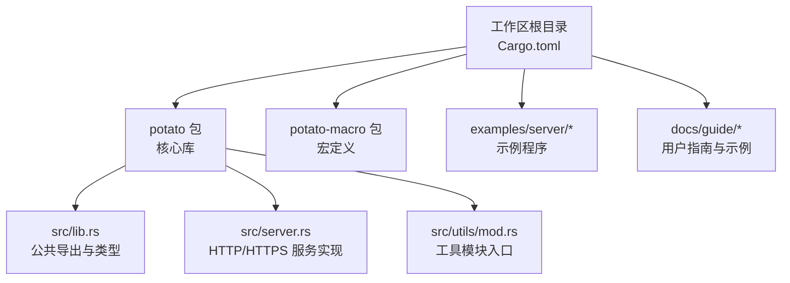
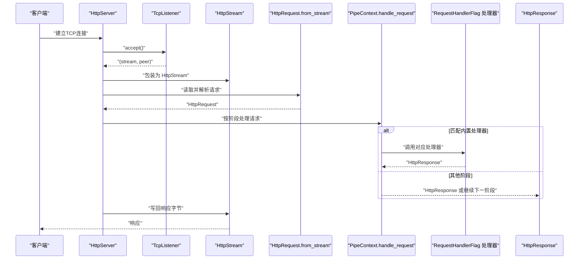
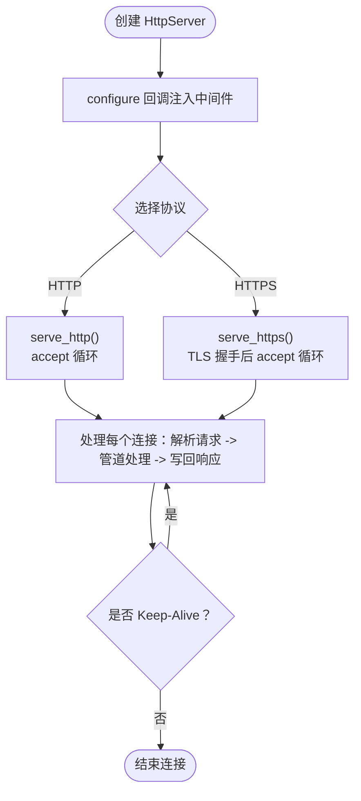
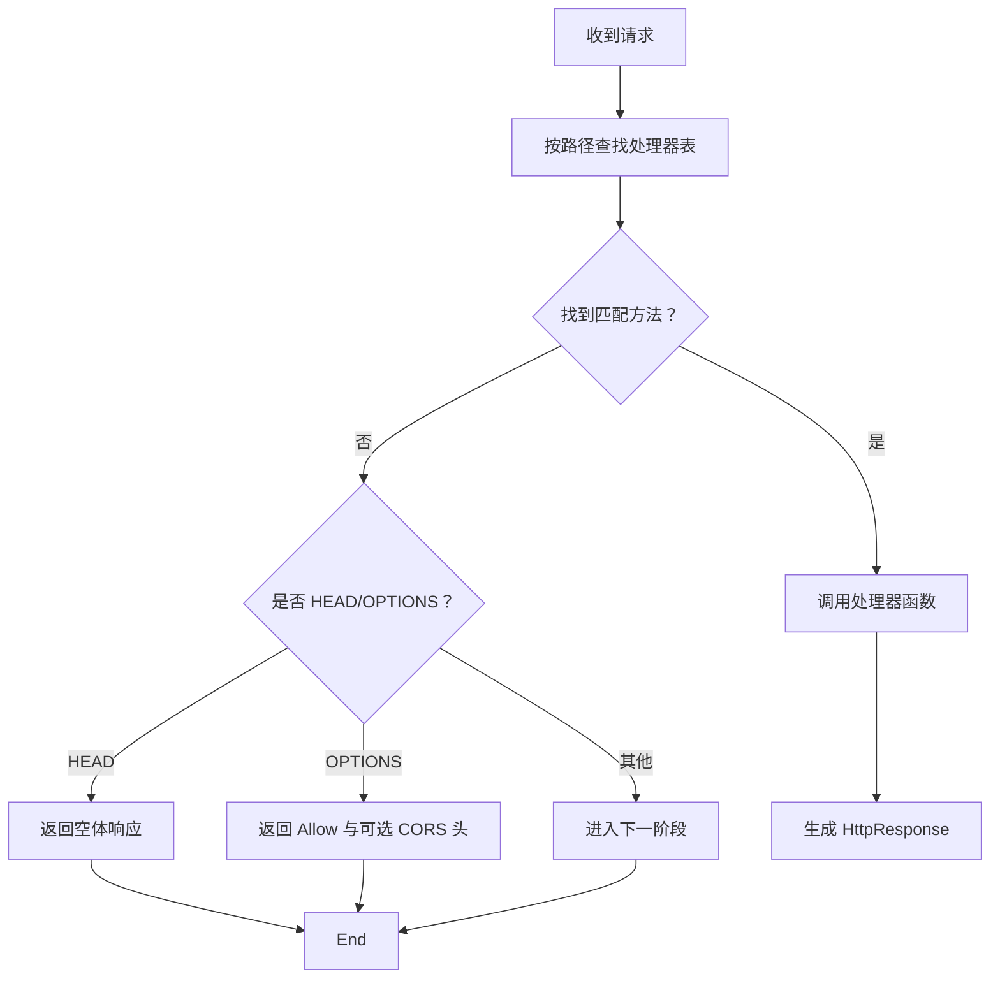
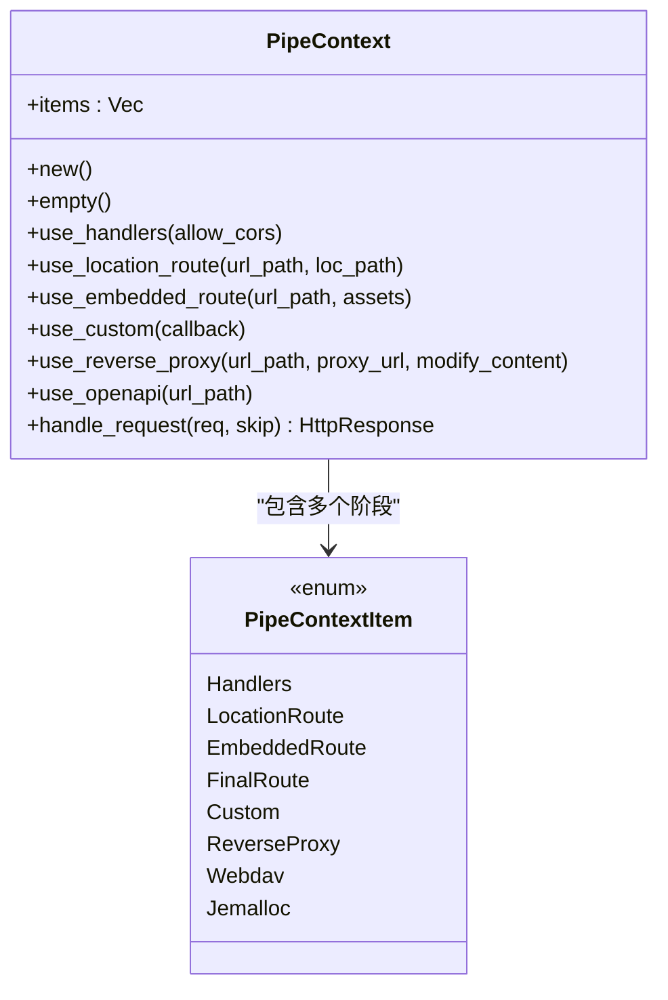
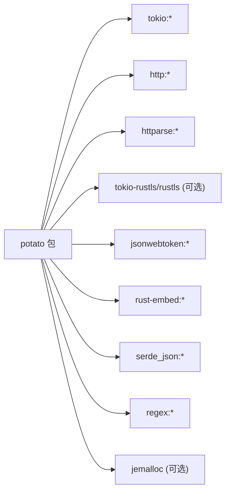

# HTTP服务器

<cite>
**本文引用的文件**
- [README.md](file://README.md)
- [Cargo.toml](file://Cargo.toml)
- [lib.rs](file://potato/src/lib.rs)
- [server.rs](file://potato/src/server.rs)
- [mod.rs](file://potato/src/utils/mod.rs)
- [00_http_server.rs](file://examples/server/00_http_server.rs)
- [01_https_server.rs](file://examples/server/01_https_server.rs)
- [03_handler_args_server.rs](file://examples/server/03_handler_args_server.rs)
- [04_http_method_server.rs](file://examples/server/04_http_method_server.rs)
- [05_location_route_server.rs](file://examples/server/05_location_route_server.rs)
- [06_embed_route_server.rs](file://examples/server/06_embed_route_server.rs)
- [07_auth_server.rs](file://examples/server/07_auth_server.rs)
- [08_websocket_server.rs](file://examples/server/08_websocket_server.rs)
- [09_jemalloc_server.rs](file://examples/server/09_jemalloc_server.rs)
- [10_shutdown_server.rs](file://examples/server/10_shutdown_server.rs)
</cite>

## 目录
1. [简介](#简介)
2. [项目结构](#项目结构)
3. [核心组件](#核心组件)
4. [架构总览](#架构总览)
5. [组件详解](#组件详解)
6. [依赖关系分析](#依赖关系分析)
7. [性能与调优](#性能与调优)
8. [故障排查指南](#故障排查指南)
9. [结论](#结论)
10. [附录](#附录)

## 简介
本指南面向希望使用 Potato HTTP 服务器构建高性能、简洁语法的 Web 应用或服务的开发者。文档覆盖服务器创建与配置（监听地址、端口、基础参数）、路由系统（基于路径与 HTTP 方法、动态参数提取）、中间件管道（请求预处理、响应后处理、错误拦截）、静态文件服务、文件上传下载与 MIME 类型处理、HTTPS/TLS 配置与安全最佳实践、性能调优建议以及生产环境部署要点。

## 项目结构
仓库采用多包工作区组织，核心库位于 potato 包，宏定义在 potato-macro 包；examples 提供丰富的使用示例；docs 提供在线文档与中文指南。

图示来源
- [Cargo.toml](file://Cargo.toml#L1-L4)
- [lib.rs](file://potato/src/lib.rs#L1-L16)
- [server.rs](file://potato/src/server.rs#L1-L27)
- [mod.rs](file://potato/src/utils/mod.rs#L1-L12)

章节来源
- [Cargo.toml](file://Cargo.toml#L1-L4)
- [README.md](file://README.md#L1-L57)

## 核心组件
- HttpServer：对外暴露的服务器对象，负责绑定地址、启动 HTTP/HTTPS 服务、接收连接、派发请求到管道。
- PipeContext：中间件管道上下文，串联多种处理阶段（内置处理器、位置路由、嵌入式资源、自定义处理器、反向代理、OpenAPI 文档等）。
- RequestHandlerFlag：通过宏注册的路由条目，包含方法、路径、处理器函数指针与文档元信息。
- HttpRequest/HttpResponse：请求与响应数据模型，支持查询参数、表单、JSON、文件上传、条件请求头（ETag/If-None-Match 等）。
- WebSocket：基于升级握手的双向通信通道。
- TLS 支持：可选特性，使用 rustls 进行 HTTPS 终端。

章节来源
- [lib.rs](file://potato/src/lib.rs#L124-L175)
- [server.rs](file://potato/src/server.rs#L28-L767)
- [lib.rs](file://potato/src/lib.rs#L385-L586)
- [lib.rs](file://potato/src/lib.rs#L203-L374)

## 架构总览
下图展示从客户端请求到响应返回的关键流程，以及中间件管道的执行顺序。

图示来源
- [server.rs](file://potato/src/server.rs#L826-L871)
- [server.rs](file://potato/src/server.rs#L362-L767)
- [lib.rs](file://potato/src/lib.rs#L588-L759)

## 组件详解

### 服务器创建与配置
- 基础创建：通过构造函数传入监听地址（主机:端口），默认不启用任何中间件。
- 配置管道：通过 configure 回调注入中间件阶段，如内置处理器、OpenAPI 文档、静态文件、嵌入式资源、反向代理、WebDAV、Jemalloc 分析等。
- 启动服务：
  - HTTP：serve_http() 绑定地址并进入事件循环。
  - HTTPS：serve_https() 在开启 tls 特性时可用，需要提供证书与私钥文件。
- 关闭信号：shutdown_signal() 返回发送器，用于优雅关闭。

图示来源
- [server.rs](file://potato/src/server.rs#L769-L824)
- [server.rs](file://potato/src/server.rs#L826-L931)

章节来源
- [server.rs](file://potato/src/server.rs#L769-L824)
- [00_http_server.rs](file://examples/server/00_http_server.rs#L1-L12)
- [01_https_server.rs](file://examples/server/01_https_server.rs#L1-L12)

### 路由系统
- 基于注解的声明式路由：通过宏为函数标注 HTTP 方法与路径，自动注册到路由表。
- 路由匹配顺序：管道中优先尝试内置处理器（按路径+方法精确匹配），未命中则进入后续阶段。
- 动态参数提取：
  - 查询参数：HttpRequest.url_query。
  - 表单与 JSON：根据 Content-Type 自动解析为键值对或对象。
  - 文件上传：multipart/form-data 中的文件字段映射为 PostFile 结构。
  - 客户端地址：HttpRequest.get_client_addr() 获取 SocketAddr。
- HEAD/OPTIONS 自动处理：当无匹配处理器时，OPTIONS 返回 Allow 列表，HEAD 返回空体。

图示来源
- [server.rs](file://potato/src/server.rs#L362-L407)
- [lib.rs](file://potato/src/lib.rs#L385-L586)

章节来源
- [lib.rs](file://potato/src/lib.rs#L124-L175)
- [03_handler_args_server.rs](file://examples/server/03_handler_args_server.rs#L1-L32)
- [04_http_method_server.rs](file://examples/server/04_http_method_server.rs#L1-L42)

### 中间件管道系统
管道阶段按顺序执行，每阶段可决定：
- 继续下一个阶段或直接返回响应。
- 对于静态资源、嵌入式资源、反向代理、WebDAV 等，会进行路径前缀匹配与内容生成。
- OpenAPI 文档：在指定 URL 前缀下提供交互式文档与 JSON 规范。

典型阶段：
- Handlers：内置处理器（可选允许 CORS）。
- LocationRoute：将 URL 映射到本地文件系统路径。
- EmbeddedRoute：将资源嵌入二进制，按 URL 返回内存中的文件内容。
- Custom：自定义回调，可返回响应或继续。
- ReverseProxy：将匹配路径转发到上游服务。
- Webdav：提供 WebDAV 能力（可选特性）。
- Jemalloc：在指定路径输出内存分析报告（可选特性）。
- OpenAPI：提供交互式文档（可选特性）。

图示来源
- [server.rs](file://potato/src/server.rs#L54-L132)
- [server.rs](file://potato/src/server.rs#L362-L767)

章节来源
- [server.rs](file://potato/src/server.rs#L54-L132)
- [server.rs](file://potato/src/server.rs#L362-L767)

### 静态文件服务
- 位置路由：将 URL 前缀映射到本地文件系统目录，支持自动索引页（index.htm/html），并使用条件请求头（If-None-Match/If-Modified-Since）与 ETag 优化缓存。
- 嵌入式资源：将资源打包进二进制，按 URL 返回内存中的文件内容，同样支持条件请求与 ETag。

章节来源
- [server.rs](file://potato/src/server.rs#L408-L567)
- [server.rs](file://potato/src/server.rs#L569-L608)
- [05_location_route_server.rs](file://examples/server/05_location_route_server.rs#L1-L11)
- [06_embed_route_server.rs](file://examples/server/06_embed_route_server.rs#L1-L11)

### 文件上传下载与 MIME 类型处理
- 上传：multipart/form-data 解析为表单项与文件项，PostFile 包含文件名与二进制数据。
- 下载：HttpResponse.from_file()/from_mem_file() 支持从文件或内存返回内容，并自动设置合适的 Content-Type 与缓存头。
- 条件请求：check_precondition_headers() 支持 304/412 返回，提升带宽效率。

章节来源
- [lib.rs](file://potato/src/lib.rs#L385-L586)
- [lib.rs](file://potato/src/lib.rs#L777-L800)
- [server.rs](file://potato/src/server.rs#L440-L461)

### WebSocket 支持
- 升级握手：HttpRequest.is_websocket() 检查 Upgrade/Connection/Sec-WebSocket-* 等头部；upgrade_websocket() 完成握手并返回 Websocket。
- 数据帧：支持文本、二进制、Ping/Pong、Close；内部处理掩码与分片拼接。
- 示例：提供简单 echo 服务，演示发送与接收。

章节来源
- [lib.rs](file://potato/src/lib.rs#L203-L374)
- [08_websocket_server.rs](file://examples/server/08_websocket_server.rs#L1-L43)

### HTTPS/TLS 配置与安全最佳实践
- 启用方式：编译时启用 tls 特性；运行时通过 serve_https() 启动，需提供证书与私钥文件。
- 证书加载：使用 rustls 的证书链与私钥加载接口。
- 最佳实践：
  - 使用强密码学套件与 TLS1.2+。
  - 仅暴露必要端口，结合反向代理（如 Nginx/Caddy）统一终止 TLS 并做限流与 WAF。
  - 定期轮换证书与密钥，监控过期时间。
  - 限制 HTTP 方法与来源（CORS/Origin），配合鉴权中间件。

章节来源
- [server.rs](file://potato/src/server.rs#L812-L824)
- [server.rs](file://potato/src/server.rs#L873-L931)
- [01_https_server.rs](file://examples/server/01_https_server.rs#L1-L12)

### OpenAPI 文档与鉴权
- OpenAPI：在指定前缀下提供交互式文档与 JSON 规范，自动从处理器注解提取路径、方法、参数与安全需求。
- 鉴权：内置 JWT 签发与校验能力，可通过注解启用受保护的路由。

章节来源
- [server.rs](file://potato/src/server.rs#L133-L331)
- [07_auth_server.rs](file://examples/server/07_auth_server.rs#L1-L24)

## 依赖关系分析
- 工作区与包管理：工作区定义成员包，确保版本一致与统一发布。
- 依赖特征：
  - 默认启用 openapi 与 tls。
  - 可选特性：ssh、webdav、jemalloc。
- 关键外部库：tokio（异步运行时）、http/httparse（HTTP 解析）、rustls（TLS）、jsonwebtoken（JWT）、rust-embed（嵌入资源）等。

图示来源
- [Cargo.toml](file://potato/Cargo.toml#L16-L76)

章节来源
- [Cargo.toml](file://Cargo.toml#L1-L4)
- [Cargo.toml](file://potato/Cargo.toml#L16-L76)

## 性能与调优
- 并发连接数控制：
  - 使用操作系统内核参数（如 fd limit、backlog）与运行时配置（如监听队列长度）。
  - 合理拆分任务，避免阻塞操作；利用 keep-alive 减少握手开销。
- 内存使用优化：
  - 启用 jemalloc 特性（Linux），通过 /profile.pdf 接口导出分析报告，定位热点与碎片。
  - 控制请求体大小与缓冲区容量，避免大对象驻留堆上。
- I/O 与压缩：
  - 根据 Accept-Encoding 选择合适压缩策略，减少带宽占用。
  - 对静态资源启用 ETag/Last-Modified，降低重复传输。
- 运行时：
  - 使用 release 构建，合理设置 RUST_LOG 级别。
  - 在容器或 systemd 环境中设置资源限制与健康检查。

章节来源
- [09_jemalloc_server.rs](file://examples/server/09_jemalloc_server.rs#L1-L16)
- [lib.rs](file://potato/src/lib.rs#L497-L509)

## 故障排查指南
- 常见问题与定位：
  - 无法访问：确认监听地址与端口未被占用，防火墙放行。
  - 404 未命中：检查路由注册与路径大小写，确认管道阶段顺序。
  - 证书错误（HTTPS）：确认证书链完整、私钥匹配、文件权限正确。
  - WebSocket 握手失败：检查 Upgrade/Connection/Sec-WebSocket-* 头部是否齐全。
  - 优雅关闭无效：确保在主进程中持有 shutdown_signal 发送器并在路由中触发。
- 日志与诊断：
  - 使用 jemalloc 分析内存泄漏与热点。
  - 打开更详细的日志级别以观察请求生命周期。

章节来源
- [10_shutdown_server.rs](file://examples/server/10_shutdown_server.rs#L1-L22)
- [server.rs](file://potato/src/server.rs#L790-L797)

## 结论
Potato 提供了简洁而强大的 HTTP 服务能力，通过声明式路由与可组合的中间件管道，能够快速搭建从静态站点到复杂 API 服务的各类应用。配合 HTTPS/TLS、OpenAPI、WebSocket、WebDAV 与 jemalloc 等特性，可在开发与生产环境中获得良好的体验与性能表现。

## 附录

### 快速开始示例
- HTTP 服务器：创建 HttpServer，注册路由宏，调用 serve_http()。
- HTTPS 服务器：同上，调用 serve_https() 并提供证书与私钥文件。
- 路由与参数：使用注解声明方法与路径，处理器可接受查询、表单、JSON、文件等参数。
- 中间件：通过 configure 注入 Handlers、OpenAPI、静态/嵌入式资源、反向代理等。

章节来源
- [00_http_server.rs](file://examples/server/00_http_server.rs#L1-L12)
- [01_https_server.rs](file://examples/server/01_https_server.rs#L1-L12)
- [03_handler_args_server.rs](file://examples/server/03_handler_args_server.rs#L1-L32)
- [04_http_method_server.rs](file://examples/server/04_http_method_server.rs#L1-L42)
- [05_location_route_server.rs](file://examples/server/05_location_route_server.rs#L1-L11)
- [06_embed_route_server.rs](file://examples/server/06_embed_route_server.rs#L1-L11)
- [07_auth_server.rs](file://examples/server/07_auth_server.rs#L1-L24)
- [08_websocket_server.rs](file://examples/server/08_websocket_server.rs#L1-L43)
- [09_jemalloc_server.rs](file://examples/server/09_jemalloc_server.rs#L1-L16)
- [10_shutdown_server.rs](file://examples/server/10_shutdown_server.rs#L1-L22)