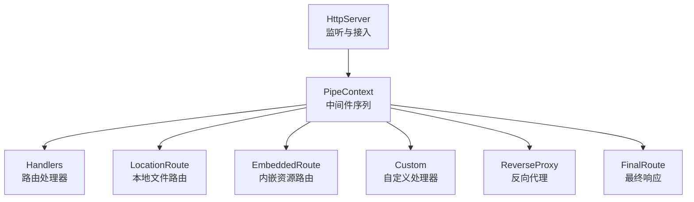
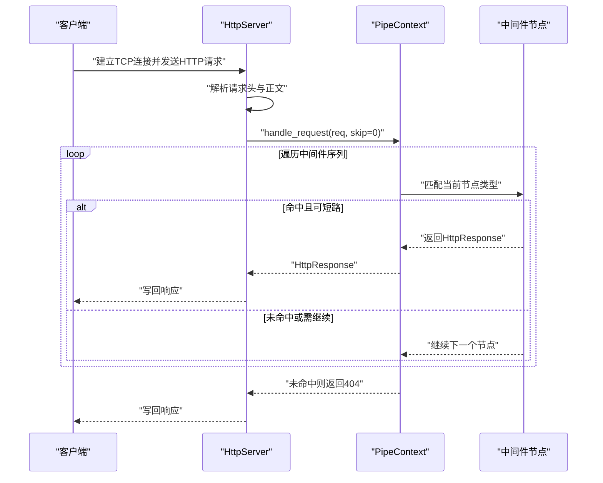
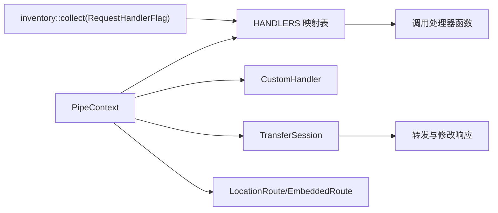
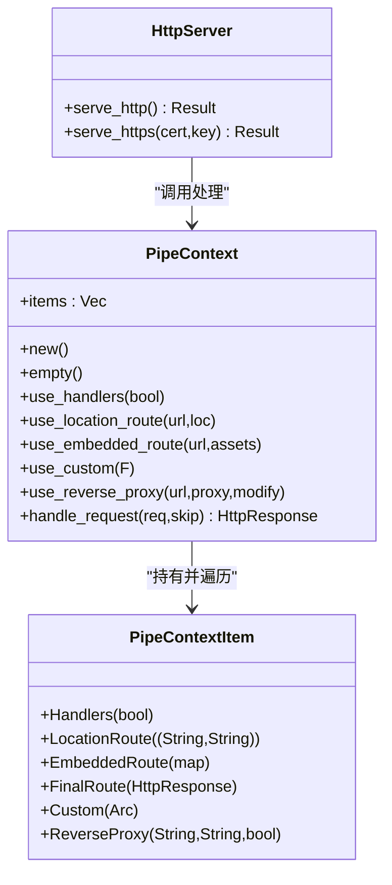

# 中间件管道

<cite>
**本文引用的文件**   
- [lib.rs](file://potato/src/lib.rs)
- [server.rs](file://potato/src/server.rs)
- [client.rs](file://potato/src/client.rs)
- [global_config.rs](file://potato/src/global_config.rs)
- [tcp_stream.rs](file://potato/src/utils/tcp_stream.rs)
- [00_http_server.rs](file://examples/server/00_http_server.rs)
- [05_location_route_server.rs](file://examples/server/05_location_route_server.rs)
- [06_embed_route_server.rs](file://examples/server/06_embed_route_server.rs)
- [07_auth_server.rs](file://examples/server/07_auth_server.rs)
- [12_custom_server.rs](file://examples/server/12_custom_server.rs)
- [13_reverse_proxy_server.rs](file://examples/server/13_reverse_proxy_server.rs)
</cite>

## 目录
1. [简介](#简介)
2. [项目结构](#项目结构)
3. [核心组件](#核心组件)
4. [架构总览](#架构总览)
5. [详细组件分析](#详细组件分析)
6. [依赖关系分析](#依赖关系分析)
7. [性能考量](#性能考量)
8. [故障排查指南](#故障排查指南)
9. [结论](#结论)
10. [附录](#附录)

## 简介
本文件系统性阐述 Potato 的中间件管道系统，重点解析 PipeContextItem 的各类类型与执行机制（Handlers、LocationRoute、EmbeddedRoute、Custom、ReverseProxy 等），说明中间件的执行顺序与条件判断逻辑；介绍自定义中间件的开发方式（闭包与函数两种形态）；解释错误处理与异常传播；给出常见中间件模式（鉴权、日志、CORS、限流）的实现思路；并提供性能优化与调试建议。

## 项目结构
- 中间件管道核心位于 server 模块，通过 PipeContext 与 PipeContextItem 组织执行序列。
- 请求从 HttpServer 接入后，经由 PipeContext::handle_request 逐项匹配并执行。
- 示例程序展示了不同中间件的组合用法，便于对照理解。



**图表来源**
- [server.rs](file://potato/src/server.rs#L362-L767)

**章节来源**
- [server.rs](file://potato/src/server.rs#L362-L767)

## 核心组件
- PipeContextItem：中间件节点类型集合，决定当前阶段的处理策略与分支。
- PipeContext：持有中间件序列，提供构建与追加中间件的方法。
- HttpServer：接收连接、解析请求、调用 PipeContext 执行并返回响应。
- TransferSession：用于反向代理场景的数据转发与内容修改。

关键要点
- 中间件按顺序从前到后逐一尝试，命中即返回结果；未命中则继续下一个节点。
- 特殊节点（如 Handlers、FinalRoute）可直接短路返回。
- 错误通过返回 HttpResponse::error 或在 Custom 节点中转换为 HttpResponse 返回。

**章节来源**
- [server.rs](file://potato/src/server.rs#L40-L131)
- [server.rs](file://potato/src/server.rs#L362-L767)
- [client.rs](file://potato/src/client.rs#L232-L473)

## 架构总览
下图展示一次请求从接入到响应的关键流程，以及中间件节点的匹配与短路规则。



**图表来源**
- [server.rs](file://potato/src/server.rs#L826-L871)
- [server.rs](file://potato/src/server.rs#L362-L767)

**章节来源**
- [server.rs](file://potato/src/server.rs#L826-L871)
- [server.rs](file://potato/src/server.rs#L362-L767)

## 详细组件分析

### PipeContextItem 类型与执行机制
- Handlers(allow_cors: bool)
  - 功能：根据 URL 路径与方法查找注册的处理器，命中则直接调用并返回。
  - 未命中时对 HEAD/OPTIONS 方法进行特殊处理：HEAD 返回空响应；OPTIONS 收集可用方法并可选设置 CORS 头。
  - 执行顺序：通常作为首个节点，优先匹配业务处理器。
- LocationRoute((prefix_url, local_root))
  - 功能：将请求路径前缀映射到本地文件系统根目录，支持静态文件服务与条件预检（ETag/304/412）。
  - 条件判断：检查路径合法性、是否文件/目录、是否存在 index 文件；命中后执行预检逻辑。
- EmbeddedRoute(HashMap<url, bytes>)
  - 功能：将内嵌资源映射为内存文件，支持条件预检。
  - 条件判断：命中后生成 ETag 并执行预检。
- Custom(Arc<CustomHandler>)
  - 功能：用户自定义中间件，返回 Some(Response) 则短路；返回 None 则继续；发生错误则转为错误响应。
  - 开发方式：支持闭包与函数两种形态（见“自定义中间件”小节）。
- ReverseProxy((req_path_prefix, dest_url, modify_content))
  - 功能：将匹配前缀的请求转发至目标地址，可选择修改响应内容（如替换链接）。
  - 执行：构造目标主机与端口，重写 Host 头，转发请求并读取响应。
- FinalRoute(HttpResponse)
  - 功能：最终兜底响应，命中即短路返回。

```mermaid
flowchart TD
Start(["进入中间件序列"]) --> CheckHandlers["匹配 Handlers"]
CheckHandlers --> |命中| ReturnHandlers["返回处理器响应"]
CheckHandlers --> |未命中| CheckLoc["匹配 LocationRoute"]
CheckLoc --> |命中| LocServe["静态文件服务<br/>含条件预检"]
LocServe --> ReturnLoc["返回响应"]
CheckLoc --> |未命中| CheckEmb["匹配 EmbeddedRoute"]
CheckEmb --> |命中| EmbServe["内存文件服务<br/>含条件预检"]
EmbServe --> ReturnEmb["返回响应"]
CheckEmb --> |未命中| CheckCustom["匹配 Custom"]
CheckCustom --> |Some(...)| ReturnCustom["短路返回"]
CheckCustom --> |None| CheckProxy["匹配 ReverseProxy"]
CheckProxy --> |命中| Proxy["转发并返回"]
CheckProxy --> |未命中| CheckFinal["匹配 FinalRoute"]
CheckFinal --> |命中| ReturnFinal["短路返回"]
CheckFinal --> |未命中| NotFound["返回404"]
ReturnHandlers --> End(["结束"])
ReturnLoc --> End
ReturnEmb --> End
ReturnCustom --> End
Proxy --> End
ReturnFinal --> End
NotFound --> End
```

**图表来源**
- [server.rs](file://potato/src/server.rs#L362-L767)

**章节来源**
- [server.rs](file://potato/src/server.rs#L40-L131)
- [server.rs](file://potato/src/server.rs#L362-L767)

### 中间件执行顺序与条件判断
- 顺序：从索引 0 开始遍历，可通过内部 skip 参数控制起始位置（例如在某些场景下跳过已处理节点）。
- 命中即短路：除 Custom 返回 None 外，其余节点一旦命中均直接返回。
- 条件判断：
  - Handlers：存在处理器则直接调用；否则 HEAD/OPTIONS 特判。
  - LocationRoute/EmbeddedRoute：路径前缀匹配、文件/目录存在性校验、索引页存在性校验、ETag 与条件请求处理。
  - Custom：返回 Ok(Some(...)) 短路；Ok(None) 继续；Err(...) 转为错误响应。
  - ReverseProxy：路径前缀匹配，构造目标地址与 Host，转发并读取响应。

**章节来源**
- [server.rs](file://potato/src/server.rs#L362-L767)

### 自定义中间件开发方法
- 闭包形式
  - 使用 ctx.use_custom(|req| async { ... }) 注册，返回类型为 anyhow::Result<Option<HttpResponse>>。
  - 可以在闭包中读取请求信息、执行业务逻辑、决定是否短路或继续。
- 函数形式
  - 将闭包封装为函数，签名满足 for<'a> Fn(&'a mut HttpRequest) -> Pin<Box<dyn Future<Output = anyhow::Result<Option<HttpResponse>>> + Send + 'a>> + Send + Sync + 'static。
  - 通过 ctx.use_custom(your_fn) 注册。
- 示例参考
  - 闭包示例：[12_custom_server.rs](file://examples/server/12_custom_server.rs#L10-L13)

**章节来源**
- [server.rs](file://potato/src/server.rs#L102-L113)
- [12_custom_server.rs](file://examples/server/12_custom_server.rs#L10-L13)

### 错误处理与异常传播
- Custom 节点：
  - Ok(Some(res))：短路返回指定响应。
  - Ok(None)：继续下一个节点。
  - Err(e)：转换为 HttpResponse::error 并返回。
- ReverseProxy：
  - 转发失败时返回 HttpResponse::error。
- Handlers：
  - 未找到处理器时，HEAD 返回空响应，OPTIONS 返回允许的方法列表（可选 CORS 头）。
- 全局异常：
  - 宏展开与处理器返回 Result 时，错误会被包装为 HttpResponse::error。

**章节来源**
- [server.rs](file://potato/src/server.rs#L610-L614)
- [server.rs](file://potato/src/server.rs#L623-L626)
- [server.rs](file://potato/src/server.rs#L378-L406)
- [potato-macro/src/lib.rs](file://potato-macro/src/lib.rs#L231-L262)

### 常见中间件模式示例

- 身份验证（JWT）
  - 使用注解声明鉴权参数，宏自动校验 Authorization 头并调用 ServerAuth::jwt_check。
  - 示例：[07_auth_server.rs](file://examples/server/07_auth_server.rs#L8-L11)
  - 配置密钥：[global_config.rs](file://potato/src/global_config.rs#L20-L26)
- 日志记录
  - 在 Custom 中间件中记录请求方法、路径、时间戳与响应状态，可选择性短路或继续。
  - 实现思路：使用 ctx.use_custom(|req| async move { ... }) 包裹后续处理。
- CORS 处理
  - 在 Handlers 节点启用 allow_cors=true，使 OPTIONS 响应包含 Allow 与 CORS 相关头。
  - 参考：[server.rs](file://potato/src/server.rs#L397-L401)
- 请求限流
  - 在 Custom 中间件中维护计数器与滑动窗口，超过阈值返回 429；否则放行。
  - 可结合 tokio::sync::Mutex 或原子变量实现并发安全。

**章节来源**
- [07_auth_server.rs](file://examples/server/07_auth_server.rs#L8-L11)
- [global_config.rs](file://potato/src/global_config.rs#L37-L63)
- [server.rs](file://potato/src/server.rs#L397-L401)

### 中间件组合与典型用法
- 静态文件服务
  - LocationRoute：将 / 映射到本地目录，支持索引页与条件预检。
  - 示例：[05_location_route_server.rs](file://examples/server/05_location_route_server.rs#L5-L7)
- 内嵌资源
  - EmbeddedRoute：将资源打包进二进制，按 URL 提供。
  - 示例：[06_embed_route_server.rs](file://examples/server/06_embed_route_server.rs#L5-L7)
- 反向代理
  - ReverseProxy：将 / 前缀转发到外部站点，可选修改响应内容。
  - 示例：[13_reverse_proxy_server.rs](file://examples/server/13_reverse_proxy_server.rs#L4-L6)
- 基础 HTTP 服务
  - 使用注解注册处理器，无需额外中间件。
  - 示例：[00_http_server.rs](file://examples/server/00_http_server.rs#L1-L4)

**章节来源**
- [05_location_route_server.rs](file://examples/server/05_location_route_server.rs#L5-L7)
- [06_embed_route_server.rs](file://examples/server/06_embed_route_server.rs#L5-L7)
- [13_reverse_proxy_server.rs](file://examples/server/13_reverse_proxy_server.rs#L4-L6)
- [00_http_server.rs](file://examples/server/00_http_server.rs#L1-L4)

## 依赖关系分析
- PipeContext 依赖 inventory 收集的 RequestHandlerFlag，形成路径+方法到处理器的映射。
- Handlers 节点依赖该映射表进行快速查找。
- ReverseProxy 依赖 TransferSession 进行转发与内容修改。
- WebSocket 升级与数据帧处理在 HttpRequest/Websocket 中实现，与中间件协同工作。



**图表来源**
- [lib.rs](file://potato/src/lib.rs#L175-L175)
- [server.rs](file://potato/src/server.rs#L28-L38)
- [server.rs](file://potato/src/server.rs#L362-L767)
- [client.rs](file://potato/src/client.rs#L232-L473)

**章节来源**
- [lib.rs](file://potato/src/lib.rs#L175-L175)
- [server.rs](file://potato/src/server.rs#L28-L38)
- [server.rs](file://potato/src/server.rs#L362-L767)
- [client.rs](file://potato/src/client.rs#L232-L473)

## 性能考量
- 中间件顺序优化
  - 将高命中率、低成本的节点前置（如 Custom 短路判断、OPTIONS 预热）。
  - 静态资源与缓存友好的节点尽量靠前，减少后续处理开销。
- 条件预检
  - 利用 ETag 与 304/412 返回可显著降低带宽与 CPU。
- 反向代理
  - 合理设置 modify_content，避免不必要的字符串替换与压缩/解压。
- 连接复用
  - Keep-Alive 下复用连接可减少握手成本；注意在长连接场景下的资源释放。
- 异步与并发
  - Custom/Handlers 均为异步，避免阻塞；合理使用 tokio::sync 控制共享状态。

[本节为通用指导，不直接分析具体文件]

## 故障排查指南
- 404 未命中
  - 检查中间件顺序与前缀匹配；确认 FinalRoute 是否存在。
- CORS 无效
  - 确认 Handlers 节点启用 allow_cors；核对浏览器实际请求头。
- 静态文件 304/412
  - 检查 If-None-Match/If-Modified-Since 与 ETag 生成逻辑。
- 反向代理异常
  - 核对目标 URL、Host 头、路径前缀；查看错误响应文本。
- 自定义中间件无效果
  - 确认返回的是 Ok(None) 时会继续下一个节点；若应短路请返回 Some(res)。
- WebSocket 升级失败
  - 检查 Sec-WebSocket-* 头是否完整；确认服务器返回 101。

**章节来源**
- [server.rs](file://potato/src/server.rs#L397-L401)
- [server.rs](file://potato/src/server.rs#L440-L461)
- [server.rs](file://potato/src/server.rs#L610-L614)
- [server.rs](file://potato/src/server.rs#L623-L626)

## 结论
Potato 的中间件管道以 PipeContext 为核心，通过 PipeContextItem 将多种处理能力（路由、静态文件、内嵌资源、自定义逻辑、反向代理）以链式方式组织。其执行模型简单明确：顺序匹配、命中即短路。配合条件预检与错误统一处理，既保证了灵活性，也兼顾了性能与可观测性。通过示例与最佳实践，开发者可以快速搭建鉴权、日志、CORS、限流等常见中间件模式。

[本节为总结性内容，不直接分析具体文件]

## 附录

### 关键流程类图（代码级）


**图表来源**
- [server.rs](file://potato/src/server.rs#L40-L131)
- [server.rs](file://potato/src/server.rs#L362-L767)