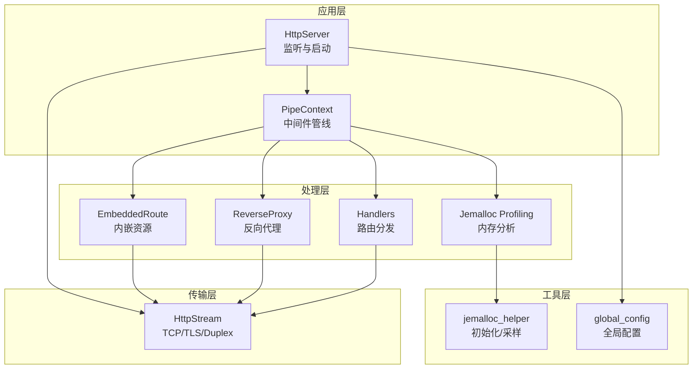
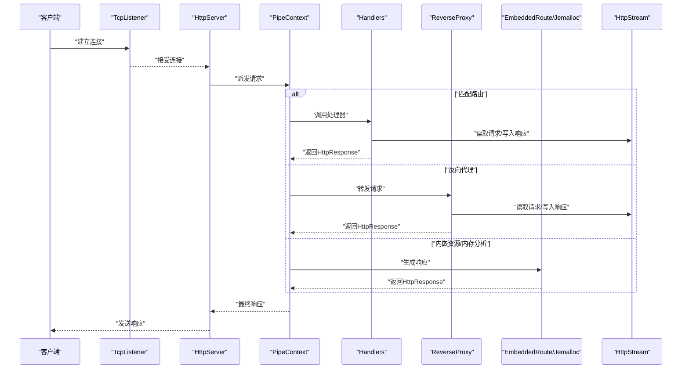
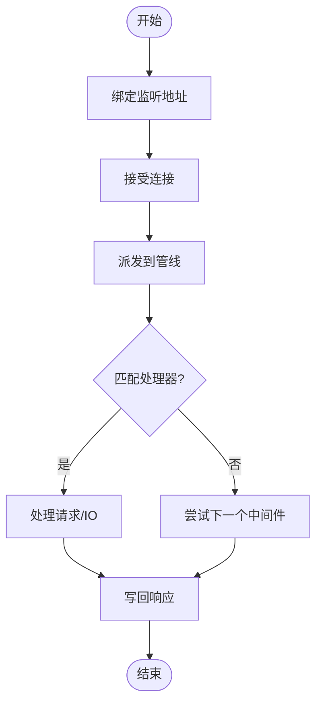
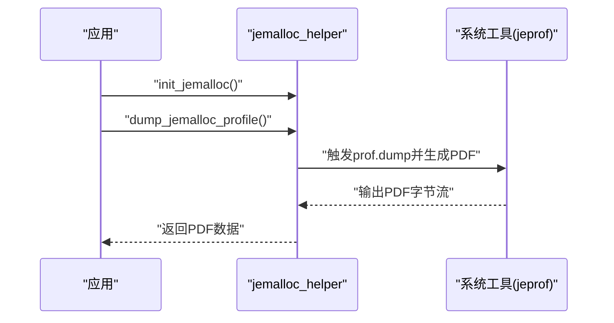
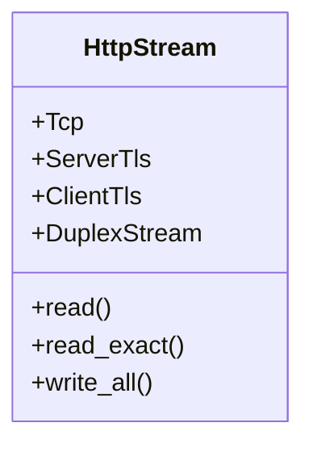
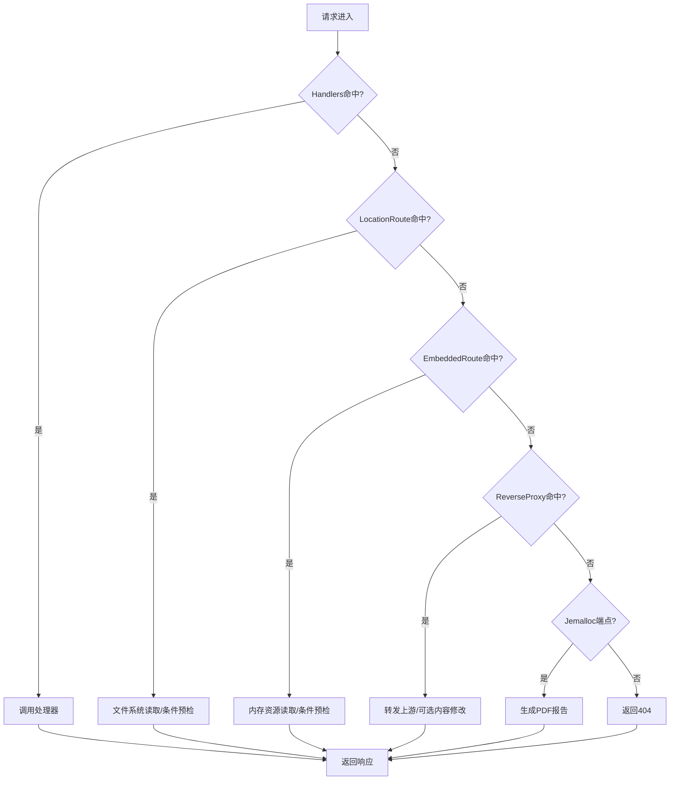
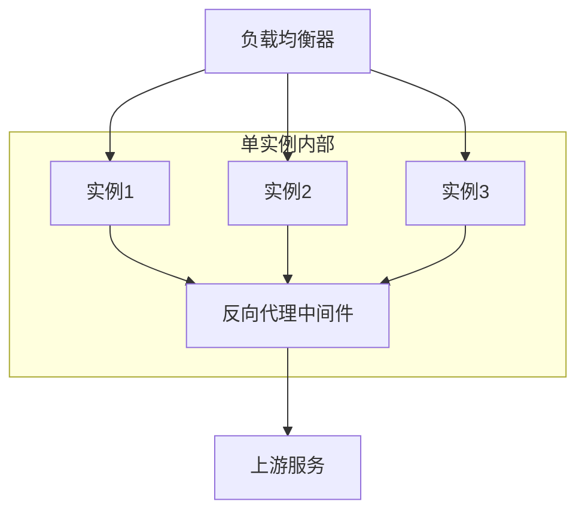
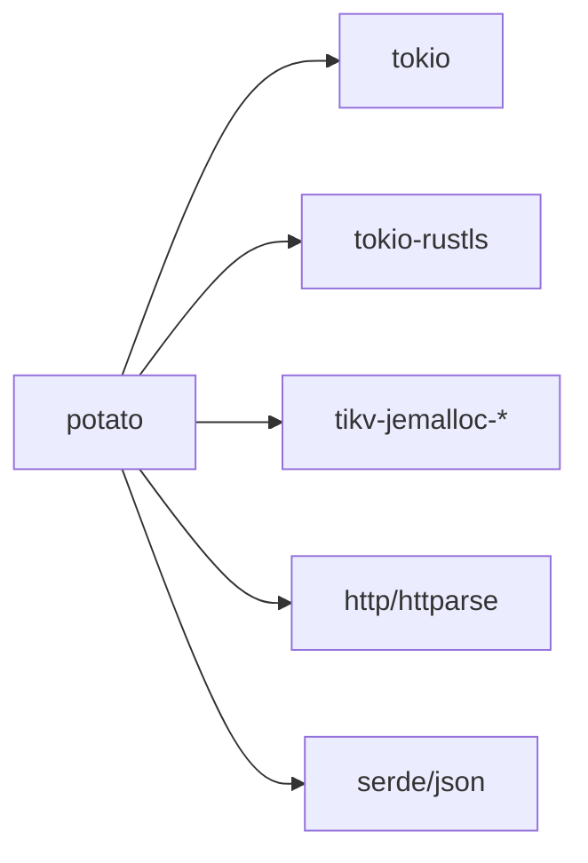

# 性能优化

<cite>
**本文引用的文件**
- [Cargo.toml](file://potato/Cargo.toml)
- [lib.rs](file://potato/src/lib.rs)
- [server.rs](file://potato/src/server.rs)
- [jemalloc_helper.rs](file://potato/src/utils/jemalloc_helper.rs)
- [tcp_stream.rs](file://potato/src/utils/tcp_stream.rs)
- [mod.rs](file://potato/src/utils/mod.rs)
- [global_config.rs](file://potato/src/global_config.rs)
- [00_http_server.rs](file://examples/server/00_http_server.rs)
- [01_https_server.rs](file://examples/server/01_https_server.rs)
- [09_jemalloc_server.rs](file://examples/server/09_jemalloc_server.rs)
- [13_reverse_proxy_server.rs](file://examples/server/13_reverse_proxy_server.rs)
- [05_graceful_shutdown.md](file://docs/en/guide/05_graceful_shutdown.md)
</cite>

## 目录
1. [简介](#简介)
2. [项目结构](#项目结构)
3. [核心组件](#核心组件)
4. [架构总览](#架构总览)
5. [详细组件分析](#详细组件分析)
6. [依赖关系分析](#依赖关系分析)
7. [性能考量与优化建议](#性能考量与优化建议)
8. [故障排查指南](#故障排查指南)
9. [结论](#结论)
10. [附录：基准测试与监控指标](#附录基准测试与监控指标)

## 简介
本指南围绕 Potato 服务器在高并发、低延迟场景下的性能优化展开，重点覆盖以下方面：
- 并发连接处理机制与线程池配置
- 内存管理策略（jemalloc 集成与内存分配优化）
- 协议支持现状与扩展路径（HTTP/1.1、TLS；HTTP/2/3 的集成思路）
- 负载均衡与集群部署策略
- 性能监控指标与基准测试方法
- CPU 与内存使用优化技巧（连接池、请求处理、缓存与 CDN）

## 项目结构
Potato 采用模块化设计，核心由服务端、客户端、工具集与示例组成。服务端通过管道式中间件链路组织路由、静态资源、反向代理等能力；工具模块提供 TCP 流抽象、jemalloc 辅助、进程执行等支撑。

图示来源
- [server.rs](file://potato/src/server.rs#L28-L767)
- [tcp_stream.rs](file://potato/src/utils/tcp_stream.rs#L11-L73)
- [jemalloc_helper.rs](file://potato/src/utils/jemalloc_helper.rs#L14-L70)
- [global_config.rs](file://potato/src/global_config.rs#L7-L35)

章节来源
- [server.rs](file://potato/src/server.rs#L28-L767)
- [tcp_stream.rs](file://potato/src/utils/tcp_stream.rs#L11-L73)
- [jemalloc_helper.rs](file://potato/src/utils/jemalloc_helper.rs#L14-L70)
- [global_config.rs](file://potato/src/global_config.rs#L7-L35)

## 核心组件
- HttpServer：负责监听、启动服务、优雅停机信号接入，并将请求交由 PipeContext 处理。
- PipeContext：以可插拔中间件的形式串联处理器，支持路由、静态资源、反向代理、OpenAPI 文档、WebDAV、jemalloc 分析等。
- HttpStream：统一抽象 TCP/TLS/Duplex 流，屏蔽传输细节，便于在 TLS 与非 TLS 场景下一致处理。
- jemalloc_helper：在启用 jemalloc 特性时，设置全局分配器、按需激活采样、导出采样结果为 PDF。
- global_config：提供 WebSocket 心跳周期、JWT 密钥等全局配置项，影响运行期行为与性能。

章节来源
- [server.rs](file://potato/src/server.rs#L769-L824)
- [server.rs](file://potato/src/server.rs#L54-L131)
- [tcp_stream.rs](file://potato/src/utils/tcp_stream.rs#L11-L73)
- [jemalloc_helper.rs](file://potato/src/utils/jemalloc_helper.rs#L8-L34)
- [global_config.rs](file://potato/src/global_config.rs#L7-L35)

## 架构总览
下图展示从连接建立到响应返回的关键流程，以及中间件管线如何组织处理逻辑。

图示来源
- [server.rs](file://potato/src/server.rs#L826-L887)
- [server.rs](file://potato/src/server.rs#L362-L767)
- [tcp_stream.rs](file://potato/src/utils/tcp_stream.rs#L40-L73)

章节来源
- [server.rs](file://potato/src/server.rs#L826-L887)
- [server.rs](file://potato/src/server.rs#L362-L767)

## 详细组件分析

### 并发连接处理与线程池配置
- 运行时：基于 Tokio 的异步运行时，通过多核事件循环高效调度大量并发任务。
- 监听与接受：使用 TcpListener 绑定地址，异步接受连接并交由管线处理。
- 优雅停机：通过 oneshot 通道接收停机信号，确保在当前请求处理完成后退出。
- 线程池：Tokio 默认使用多工作线程的线程池模型，可通过环境变量或运行时配置进行调优（例如 RUST_LOG、MALLOC_CONF 等）。

图示来源
- [server.rs](file://potato/src/server.rs#L826-L887)
- [05_graceful_shutdown.md](file://docs/en/guide/05_graceful_shutdown.md#L1-L29)

章节来源
- [server.rs](file://potato/src/server.rs#L790-L824)
- [05_graceful_shutdown.md](file://docs/en/guide/05_graceful_shutdown.md#L1-L29)

### 内存管理策略与 jemalloc 集成
- 全局分配器：启用 jemalloc 特性后，设置全局分配器，提升多线程场景下的分配效率与碎片控制。
- 初始化与采样：通过环境变量 MALLOC_CONF 激活采样；提供接口导出采样数据并生成 PDF 报告，便于定位热点与泄漏。
- 示例：示例程序展示了如何开启 jemalloc 分析端点，便于线上诊断。

图示来源
- [jemalloc_helper.rs](file://potato/src/utils/jemalloc_helper.rs#L14-L70)
- [09_jemalloc_server.rs](file://examples/server/09_jemalloc_server.rs#L7-L15)

章节来源
- [jemalloc_helper.rs](file://potato/src/utils/jemalloc_helper.rs#L8-L34)
- [jemalloc_helper.rs](file://potato/src/utils/jemalloc_helper.rs#L36-L70)
- [mod.rs](file://potato/src/utils/mod.rs#L10-L11)
- [Cargo.toml](file://potato/Cargo.toml#L43-L56)
- [09_jemalloc_server.rs](file://examples/server/09_jemalloc_server.rs#L7-L15)

### 传输层抽象与 TLS 支持
- HttpStream 将 TCP、Server TLS、Client TLS、Duplex Stream 统一抽象，简化上层逻辑。
- TLS：在启用 tls 特性时，支持 HTTPS 服务端与客户端 TLS 连接。
- 适用场景：在需要加密通信或与上游服务建立 TLS 会话时，可直接复用该抽象。

图示来源
- [tcp_stream.rs](file://potato/src/utils/tcp_stream.rs#L11-L73)

章节来源
- [tcp_stream.rs](file://potato/src/utils/tcp_stream.rs#L11-L73)
- [Cargo.toml](file://potato/Cargo.toml#L39-L41)

### 中间件管线与路由处理
- Handlers：根据 URL 与方法查找注册的处理器，未命中则返回 404 或 OPTIONS 预检。
- LocationRoute：将请求映射到本地文件系统路径，支持条件预检（ETag/Last-Modified）。
- EmbeddedRoute：将资源打包进二进制，按路径返回，同样支持条件预检。
- ReverseProxy：将请求转发至目标地址，支持可选的内容修改。
- Jemalloc：在启用特性时，暴露分析端点，返回 PDF 报告。
- OpenAPI/WebDAV：按需启用文档与 WebDAV 能力。

图示来源
- [server.rs](file://potato/src/server.rs#L28-L767)

章节来源
- [server.rs](file://potato/src/server.rs#L28-L767)

### 协议支持与性能优势
- HTTP/1.1：默认支持，具备成熟的生态与兼容性。
- TLS：通过 tokio-rustls 提供 HTTPS 服务端与客户端能力，适合加密传输与安全会话。
- HTTP/2/3：当前仓库未直接引入 HTTP/2/3 依赖；若需启用，可在现有 HttpStream 与 PipeContext 基础上扩展，利用底层传输能力实现多路复用与更优的头部压缩、连接开销控制等优势。

章节来源
- [Cargo.toml](file://potato/Cargo.toml#L39-L41)
- [server.rs](file://potato/src/server.rs#L668-L761)

### 负载均衡与集群部署策略
- 反向代理：内置 ReverseProxy 中间件，可将请求转发至上游服务，便于横向扩展与灰度发布。
- 集群部署：结合反向代理与外部负载均衡器（如 Nginx/LVS），实现多实例部署与健康检查。
- 优雅停机：通过 oneshot 通道接收停机信号，配合外部控制器实现平滑滚动升级。

图示来源
- [server.rs](file://potato/src/server.rs#L615-L627)
- [13_reverse_proxy_server.rs](file://examples/server/13_reverse_proxy_server.rs#L1-L10)
- [05_graceful_shutdown.md](file://docs/en/guide/05_graceful_shutdown.md#L1-L29)

章节来源
- [server.rs](file://potato/src/server.rs#L615-L627)
- [13_reverse_proxy_server.rs](file://examples/server/13_reverse_proxy_server.rs#L1-L10)
- [05_graceful_shutdown.md](file://docs/en/guide/05_graceful_shutdown.md#L1-L29)

### 缓存策略与 CDN 集成
- 条件预检：对静态资源与内嵌资源支持 If-None-Match/If-Modified-Since，自动返回 304，减少带宽消耗。
- ETag 生成：基于内容哈希与大小生成 ETag，确保缓存一致性。
- CDN 集成：建议将静态资源托管于 CDN，结合条件预检与缓存头，最大化边缘缓存命中率。

章节来源
- [lib.rs](file://potato/src/lib.rs#L777-L800)
- [server.rs](file://potato/src/server.rs#L426-L461)
- [server.rs](file://potato/src/server.rs#L576-L601)
- [server.rs](file://potato/src/server.rs#L634-L662)

## 依赖关系分析
- 依赖特征开关：通过 features 控制 jemalloc、tls、webdav、ssh、openapi 等能力的编译与运行时行为。
- 关键依赖：tokio（运行时）、tokio-rustls（TLS）、jemalloc 生态（采样与统计）等。
- 传输层：统一抽象 HttpStream，降低 TLS 与非 TLS 的差异。

图示来源
- [Cargo.toml](file://potato/Cargo.toml#L16-L72)

章节来源
- [Cargo.toml](file://potato/Cargo.toml#L16-L72)

## 性能考量与优化建议

### 并发与线程池
- 使用 Tokio 默认多工作线程模型，结合 CPU 核数合理设置工作线程数量。
- 对 CPU 密集型任务与 IO 密集型任务进行区分，避免阻塞运行时线程。

### 内存与分配
- 启用 jemalloc 特性并设置 MALLOC_CONF=prof:true，定期导出 PDF 报告进行热点分析。
- 避免频繁小块分配，优先使用大块缓冲与对象复用（如连接池、请求体解析缓存）。

### 传输与 TLS
- 在高并发场景下，合理配置 TLS 握手参数与会话复用，减少握手开销。
- 对静态资源启用条件预检，降低重复传输。

### 请求处理优化
- 路由与中间件顺序：将高频命中路径置于前部，减少匹配成本。
- 反序列化与序列化：对 JSON/表单等进行按需解析，避免不必要的字段解析。

### 连接池与上游交互
- 反向代理场景：对上游连接进行池化管理，复用长连接，降低三次握手与 TLS 握手次数。
- 超时与重试：为上游调用设置合理的超时与退避策略，防止级联故障。

### 缓存与 CDN
- 对静态资源与只读数据设置强缓存与条件预检，结合 CDN 实现就近加速。
- 对动态内容使用合理的缓存标签与失效策略，避免脏读。

### 生产最佳实践
- 通过 oneshot 通道实现优雅停机，结合外部控制器进行滚动升级。
- 结合 jemalloc 采样与系统监控（CPU、内存、网络、磁盘）进行全链路观测。
- 对关键路径进行基准测试，持续跟踪性能回归。

## 故障排查指南
- jemalloc 未启用：若未设置 MALLOC_CONF=prof:true，初始化会报错提示启用或禁用 jemalloc 特性。
- TLS 未编译：在非 tls 构建中调用 TLS 功能会报不支持错误。
- 优雅停机无效：确认是否正确获取并持有 shutdown_signal，且在外部触发了 oneshot 发送。

章节来源
- [jemalloc_helper.rs](file://potato/src/utils/jemalloc_helper.rs#L14-L34)
- [client.rs](file://potato/src/client.rs#L67-L99)
- [05_graceful_shutdown.md](file://docs/en/guide/05_graceful_shutdown.md#L1-L29)

## 结论
通过统一的传输抽象、中间件管线与 jemalloc 集成，Potato 在高并发场景下具备良好的可扩展性与可观测性。结合条件预检、反向代理与 CDN，可进一步降低延迟与带宽成本。建议在生产环境中启用 jemalloc 采样、设置合理的优雅停机策略，并持续进行性能监控与基准测试，以保障稳定与高性能。

## 附录：基准测试与监控指标

### 基准测试方法
- 工具：wrk、ab、hey、Vegeta 等。
- 指标：QPS、P95/P99 延迟、连接耗时、CPU 利用率、内存占用、GC/分配速率。
- 方法：针对不同中间件组合（仅路由、含反代、含 jemalloc 分析）分别压测，对比差异。

### 监控指标
- 应用层：请求数、成功率、错误码分布、响应时间分布、活跃连接数。
- 系统层：CPU 使用率、内存 RSS/堆、上下文切换、系统调用阻塞占比。
- 传输层：TLS 握手失败率、重传/丢包、拥塞窗口变化。
- jemalloc：分配次数、分配字节数、保留页数、后台线程回收状态。

### 示例参考
- HTTP/HTTPS 服务示例：用于验证基础吞吐与延迟。
- jemalloc 分析示例：用于内存热点定位。
- 反向代理示例：用于上游链路压测与延迟拆解。

章节来源
- [00_http_server.rs](file://examples/server/00_http_server.rs#L1-L12)
- [01_https_server.rs](file://examples/server/01_https_server.rs#L1-L12)
- [09_jemalloc_server.rs](file://examples/server/09_jemalloc_server.rs#L7-L15)
- [13_reverse_proxy_server.rs](file://examples/server/13_reverse_proxy_server.rs#L1-L10)