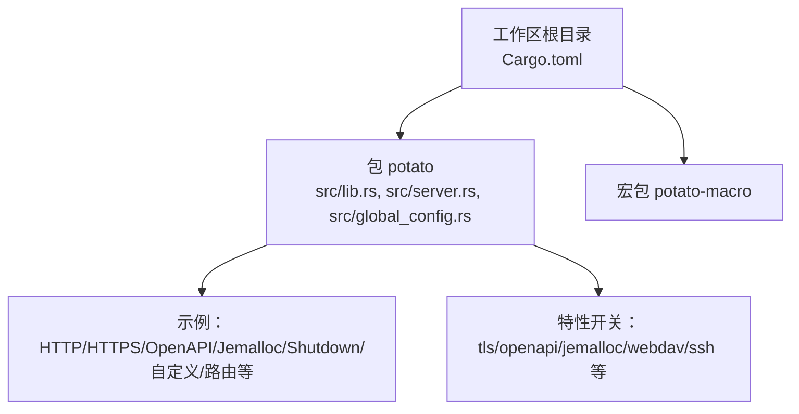
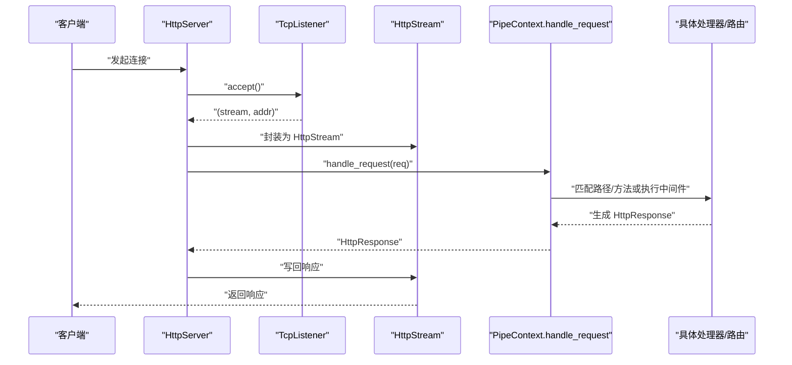
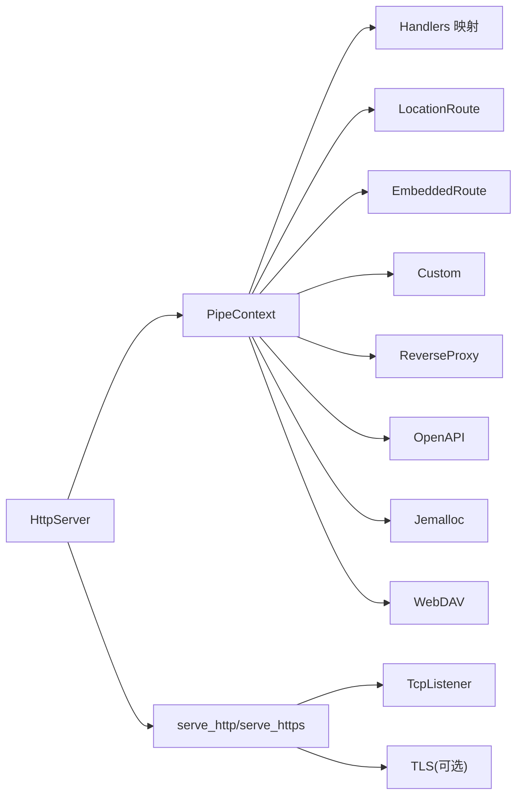

# 服务器配置

<cite>
**本文引用的文件**
- [lib.rs](file://potato/src/lib.rs)
- [server.rs](file://potato/src/server.rs)
- [global_config.rs](file://potato/src/global_config.rs)
- [Cargo.toml（工作区）](file://Cargo.toml)
- [Cargo.toml（包）](file://potato/Cargo.toml)
- [00_http_server.rs](file://examples/server/00_http_server.rs)
- [01_https_server.rs](file://examples/server/01_https_server.rs)
- [02_openapi_server.rs](file://examples/server/02_openapi_server.rs)
- [04_http_method_server.rs](file://examples/server/04_http_method_server.rs)
- [05_location_route_server.rs](file://examples/server/05_location_route_server.rs)
- [06_embed_route_server.rs](file://examples/server/06_embed_route_server.rs)
- [09_jemalloc_server.rs](file://examples/server/09_jemalloc_server.rs)
- [10_shutdown_server.rs](file://examples/server/10_shutdown_server.rs)
- [12_custom_server.rs](file://examples/server/12_custom_server.rs)
- [05_graceful_shutdown.md](file://docs/guide/05_graceful_shutdown.md)
</cite>

## 目录
1. [简介](#简介)
2. [项目结构](#项目结构)
3. [核心组件](#核心组件)
4. [架构总览](#架构总览)
5. [详细组件解析](#详细组件解析)
6. [依赖关系分析](#依赖关系分析)
7. [性能与并发参数](#性能与并发参数)
8. [故障排查指南](#故障排查指南)
9. [结论](#结论)
10. [附录：完整配置选项清单](#附录完整配置选项清单)

## 简介
本指南聚焦于 Potato HTTP 服务器的配置与使用，围绕以下主题展开：
- 服务器实例创建与监听地址配置
- configure() 回调函数对管道上下文（PipeContext）的配置
- shutdown_signal() 的优雅关闭机制
- serve_http() 与 serve_https() 的区别与选择
- 完整配置项说明（端口绑定、路由与中间件、TLS、OpenAPI、Jemalloc、WebDAV、反向代理等）
- 生产环境最佳实践（进程管理、日志、监控）

## 项目结构
仓库采用多包工作区组织，核心库为 potato，配套示例位于 examples/server 下，文档位于 docs/guide。

图表来源
- [Cargo.toml（工作区）](file://Cargo.toml#L1-L4)
- [Cargo.toml（包）](file://potato/Cargo.toml#L1-L76)

章节来源
- [Cargo.toml（工作区）](file://Cargo.toml#L1-L4)
- [Cargo.toml（包）](file://potato/Cargo.toml#L1-L76)

## 核心组件
- HttpServer：对外暴露的服务器入口，负责监听、启动与优雅关闭。
- PipeContext/PipeContextItem：请求处理流水线，支持处理器、静态路由、嵌入资源、自定义回调、反向代理、OpenAPI、Jemalloc、WebDAV 等。
- ServerConfig：全局配置访问器，提供 JWT 密钥与 WebSocket 心跳周期等运行时参数。
- 示例程序：演示不同配置与启动方式。

章节来源
- [server.rs](file://potato/src/server.rs#L769-L797)
- [server.rs](file://potato/src/server.rs#L40-L132)
- [global_config.rs](file://potato/src/global_config.rs#L12-L35)
- [00_http_server.rs](file://examples/server/00_http_server.rs#L1-L12)
- [01_https_server.rs](file://examples/server/01_https_server.rs#L1-L12)

## 架构总览
下图展示从客户端到请求处理的整体流程，以及 TLS 与非 TLS 的差异点。

图表来源
- [server.rs](file://potato/src/server.rs#L826-L871)
- [server.rs](file://potato/src/server.rs#L873-L931)

## 详细组件解析

### 1) 服务器实例创建与监听地址
- 使用 new() 指定监听地址（字符串形式），内部保存为 addr 字段。
- 启动时会解析该地址为 SocketAddr 并绑定监听。
- 支持 IPv4/IPv6 地址与端口组合。

参考路径
- [server.rs](file://potato/src/server.rs#L775-L782)
- [server.rs](file://potato/src/server.rs#L830-L831)

章节来源
- [server.rs](file://potato/src/server.rs#L775-L782)
- [server.rs](file://potato/src/server.rs#L830-L831)

### 2) configure() 配置管道上下文
- configure() 接收一个回调，传入空的 PipeContext，允许你按顺序添加中间件与路由。
- 常用项：
  - use_handlers(allow_cors)：启用自动注册的处理器映射。
  - use_location_route(url_path, local_path)：将 URL 路径前缀映射到本地文件系统目录。
  - use_embedded_route(url_path, assets)：将打包进二进制的资源作为静态文件提供。
  - use_custom(callback)：注入自定义逻辑，可直接返回响应或放行。
  - use_reverse_proxy(url_path, proxy_url, modify_content)：将匹配路径转发到上游。
  - use_openapi(url_path)：在指定路径提供 OpenAPI 文档页面与 JSON。
  - use_jemalloc(url_path)：在启用 jemalloc 特性时，暴露内存剖析下载接口。
  - use_webdav_localfs/use_webdav_memfs：启用 WebDAV 服务（需开启 webdav 特性）。

参考路径
- [server.rs](file://potato/src/server.rs#L784-L788)
- [server.rs](file://potato/src/server.rs#L73-L132)
- [server.rs](file://potato/src/server.rs#L133-L331)
- [server.rs](file://potato/src/server.rs#L333-L360)
- [12_custom_server.rs](file://examples/server/12_custom_server.rs#L10-L13)
- [02_openapi_server.rs](file://examples/server/02_openapi_server.rs#L9-L12)
- [05_location_route_server.rs](file://examples/server/05_location_route_server.rs#L5-L7)
- [06_embed_route_server.rs](file://examples/server/06_embed_route_server.rs#L5-L7)
- [09_jemalloc_server.rs](file://examples/server/09_jemalloc_server.rs#L10-L12)

章节来源
- [server.rs](file://potato/src/server.rs#L784-L788)
- [server.rs](file://potato/src/server.rs#L73-L132)
- [server.rs](file://potato/src/server.rs#L133-L331)
- [server.rs](file://potato/src/server.rs#L333-L360)
- [12_custom_server.rs](file://examples/server/12_custom_server.rs#L10-L13)
- [02_openapi_server.rs](file://examples/server/02_openapi_server.rs#L9-L12)
- [05_location_route_server.rs](file://examples/server/05_location_route_server.rs#L5-L7)
- [06_embed_route_server.rs](file://examples/server/06_embed_route_server.rs#L5-L7)
- [09_jemalloc_server.rs](file://examples/server/09_jemalloc_server.rs#L10-L12)

### 3) 优雅关闭 shutdown_signal()
- 提供 shutdown_signal() 获取发送器；调用后，serve_http()/serve_https() 将等待收到信号后返回。
- 可结合 oneshot 通道在运行时触发关闭（例如通过一个 /shutdown 接口）。

参考路径
- [server.rs](file://potato/src/server.rs#L790-L797)
- [server.rs](file://potato/src/server.rs#L800-L810)
- [server.rs](file://potato/src/server.rs#L814-L824)
- [10_shutdown_server.rs](file://examples/server/10_shutdown_server.rs#L17-L21)
- [05_graceful_shutdown.md](file://docs/guide/05_graceful_shutdown.md#L1-L29)

章节来源
- [server.rs](file://potato/src/server.rs#L790-L797)
- [server.rs](file://potato/src/server.rs#L800-L810)
- [server.rs](file://potato/src/server.rs#L814-L824)
- [10_shutdown_server.rs](file://examples/server/10_shutdown_server.rs#L17-L21)
- [05_graceful_shutdown.md](file://docs/guide/05_graceful_shutdown.md#L1-L29)

### 4) serve_http() 与 serve_https() 的区别
- serve_http()：基于明文 TCP 监听，逐连接解析请求并交由 PipeContext 处理。
- serve_https()：在启用 tls 特性时可用，先完成 TLS 握手，再进行请求处理。
- 两者均支持优雅关闭（通过 shutdown_signal）。

参考路径
- [server.rs](file://potato/src/server.rs#L799-L810)
- [server.rs](file://potato/src/server.rs#L812-L824)
- [server.rs](file://potato/src/server.rs#L826-L871)
- [server.rs](file://potato/src/server.rs#L873-L931)
- [00_http_server.rs](file://examples/server/00_http_server.rs#L8-L11)
- [01_https_server.rs](file://examples/server/01_https_server.rs#L8-L11)

章节来源
- [server.rs](file://potato/src/server.rs#L799-L810)
- [server.rs](file://potato/src/server.rs#L812-L824)
- [server.rs](file://potato/src/server.rs#L826-L871)
- [server.rs](file://potato/src/server.rs#L873-L931)
- [00_http_server.rs](file://examples/server/00_http_server.rs#L8-L11)
- [01_https_server.rs](file://examples/server/01_https_server.rs#L8-L11)

### 5) 请求处理流水线（PipeContext）与典型场景
- 流水线项按顺序执行，遇到“最终结果”即返回；否则继续下一个项。
- 典型场景：
  - 自定义中间件：use_custom 返回 Some(...) 可短路后续处理。
  - 静态文件：use_location_route 或 use_embedded_route。
  - OpenAPI：use_openapi 自动生成文档页与 JSON。
  - 反向代理：use_reverse_proxy 将请求转发至上游。
  - WebDAV：use_webdav_localfs/memfs。
  - Jemalloc：use_jemalloc 暴露剖析数据。

参考路径
- [server.rs](file://potato/src/server.rs#L362-L767)
- [server.rs](file://potato/src/server.rs#L40-L132)
- [server.rs](file://potato/src/server.rs#L133-L331)
- [server.rs](file://potato/src/server.rs#L333-L360)
- [server.rs](file://potato/src/server.rs#L615-L627)
- [server.rs](file://potato/src/server.rs#L668-L761)
- [server.rs](file://potato/src/server.rs#L629-L667)

章节来源
- [server.rs](file://potato/src/server.rs#L362-L767)
- [server.rs](file://potato/src/server.rs#L40-L132)
- [server.rs](file://potato/src/server.rs#L133-L331)
- [server.rs](file://potato/src/server.rs#L333-L360)
- [server.rs](file://potato/src/server.rs#L615-L627)
- [server.rs](file://potato/src/server.rs#L629-L667)
- [server.rs](file://potato/src/server.rs#L668-L761)

### 6) TLS 证书与 HTTPS
- 在启用 tls 特性时，serve_https() 可加载 PEM 证书与私钥，建立 TLS 握手。
- 证书与私钥文件路径通过参数传入。

参考路径
- [server.rs](file://potato/src/server.rs#L873-L931)
- [01_https_server.rs](file://examples/server/01_https_server.rs#L10-L11)
- [Cargo.toml（包）](file://potato/Cargo.toml#L65-L72)

章节来源
- [server.rs](file://potato/src/server.rs#L873-L931)
- [01_https_server.rs](file://examples/server/01_https_server.rs#L10-L11)
- [Cargo.toml（包）](file://potato/Cargo.toml#L65-L72)

### 7) OpenAPI 文档
- use_openapi(url_path) 注册 OpenAPI 文档页面与 JSON。
- 文档内容根据已注册的处理器自动生成。

参考路径
- [server.rs](file://potato/src/server.rs#L133-L331)
- [02_openapi_server.rs](file://examples/server/02_openapi_server.rs#L9-L12)

章节来源
- [server.rs](file://potato/src/server.rs#L133-L331)
- [02_openapi_server.rs](file://examples/server/02_openapi_server.rs#L9-L12)

### 8) 静态文件与嵌入资源
- use_location_route(url_path, local_path)：将 URL 前缀映射到本地目录，支持条件预检（ETag/304/412）。
- use_embedded_route(url_path, assets)：将打包进二进制的资源作为静态文件提供，同样支持条件预检。

参考路径
- [server.rs](file://potato/src/server.rs#L77-L100)
- [server.rs](file://potato/src/server.rs#L408-L567)
- [server.rs](file://potato/src/server.rs#L569-L608)
- [05_location_route_server.rs](file://examples/server/05_location_route_server.rs#L5-L7)
- [06_embed_route_server.rs](file://examples/server/06_embed_route_server.rs#L5-L7)

章节来源
- [server.rs](file://potato/src/server.rs#L77-L100)
- [server.rs](file://potato/src/server.rs#L408-L567)
- [server.rs](file://potato/src/server.rs#L569-L608)
- [05_location_route_server.rs](file://examples/server/05_location_route_server.rs#L5-L7)
- [06_embed_route_server.rs](file://examples/server/06_embed_route_server.rs#L5-L7)

### 9) 反向代理
- use_reverse_proxy(url_path, proxy_url, modify_content)：将匹配路径的请求转发到上游，可选修改内容。
- 内部使用 TransferSession 进行传输。

参考路径
- [server.rs](file://potato/src/server.rs#L115-L126)
- [server.rs](file://potato/src/server.rs#L615-L627)

章节来源
- [server.rs](file://potato/src/server.rs#L115-L126)
- [server.rs](file://potato/src/server.rs#L615-L627)

### 10) Jemalloc 剖析
- use_jemalloc(url_path)：在启用 jemalloc 特性时，暴露内存剖析数据下载接口。
- 仅 Linux 可用，且需要安装相关系统依赖。

参考路径
- [server.rs](file://potato/src/server.rs#L128-L131)
- [09_jemalloc_server.rs](file://examples/server/09_jemalloc_server.rs#L10-L12)
- [Cargo.toml（包）](file://potato/Cargo.toml#L65-L72)

章节来源
- [server.rs](file://potato/src/server.rs#L128-L131)
- [09_jemalloc_server.rs](file://examples/server/09_jemalloc_server.rs#L10-L12)
- [Cargo.toml（包）](file://potato/Cargo.toml#L65-L72)

### 11) WebDAV
- use_webdav_localfs(url_path, local_path)：挂载本地文件系统。
- use_webdav_memfs(url_path)：挂载内存文件系统。
- 需启用 webdav 特性。

参考路径
- [server.rs](file://potato/src/server.rs#L333-L360)

章节来源
- [server.rs](file://potato/src/server.rs#L333-L360)

### 12) 自定义处理器与 CORS
- use_handlers(allow_cors)：启用自动注册的处理器映射，并可选择是否允许跨域。
- use_custom(callback)：注入自定义逻辑，可直接返回响应或放行。

参考路径
- [server.rs](file://potato/src/server.rs#L73-L75)
- [server.rs](file://potato/src/server.rs#L102-L113)
- [12_custom_server.rs](file://examples/server/12_custom_server.rs#L10-L13)

章节来源
- [server.rs](file://potato/src/server.rs#L73-L75)
- [server.rs](file://potato/src/server.rs#L102-L113)
- [12_custom_server.rs](file://examples/server/12_custom_server.rs#L10-L13)

### 13) 全局配置与运行时参数
- ServerConfig 提供：
  - 设置/获取 JWT 密钥
  - 设置/获取 WebSocket Ping 周期
- Websocket 在接收循环中使用该周期进行心跳检测。

参考路径
- [global_config.rs](file://potato/src/global_config.rs#L12-L35)
- [lib.rs](file://potato/src/lib.rs#L288-L308)

章节来源
- [global_config.rs](file://potato/src/global_config.rs#L12-L35)
- [lib.rs](file://potato/src/lib.rs#L288-L308)

## 依赖关系分析

图表来源
- [server.rs](file://potato/src/server.rs#L769-L797)
- [server.rs](file://potato/src/server.rs#L40-L132)
- [server.rs](file://potato/src/server.rs#L826-L931)

章节来源
- [server.rs](file://potato/src/server.rs#L769-L797)
- [server.rs](file://potato/src/server.rs#L40-L132)
- [server.rs](file://potato/src/server.rs#L826-L931)

## 性能与并发参数
- 连接模型：每连接独立任务处理请求，适合高并发场景。
- Keep-Alive：依据请求头判断是否复用连接，减少握手开销。
- 压缩：根据 Accept-Encoding 选择压缩模式。
- TLS：启用 tls 特性以获得 HTTPS 支持，注意证书加载与握手成本。
- jemalloc：启用 jemalloc 特性以获得内存剖析能力，便于定位内存问题。
- WebDAV：启用 webdav 特性以提供 WebDAV 服务，注意文件系统权限与路径安全。

章节来源
- [server.rs](file://potato/src/server.rs#L851-L868)
- [server.rs](file://potato/src/server.rs#L911-L928)
- [Cargo.toml（包）](file://potato/Cargo.toml#L65-L72)

## 故障排查指南
- 无法启动监听
  - 检查地址格式与端口占用。
  - 参考路径：[server.rs](file://potato/src/server.rs#L830-L831)
- TLS 握手失败
  - 确认证书与私钥路径正确，PEM 文件有效。
  - 参考路径：[server.rs](file://potato/src/server.rs#L881-L886)
- OpenAPI 页面空白
  - 确认已注册处理器，且 use_openapi 已添加。
  - 参考路径：[server.rs](file://potato/src/server.rs#L133-L331)
- 静态文件 304/412 条件预检
  - 检查 If-None-Match/If-Modified-Since 与 ETag 生成。
  - 参考路径：[server.rs](file://potato/src/server.rs#L440-L447)
- 优雅关闭无效
  - 确保在主流程中调用 shutdown_signal() 并在触发点发送信号。
  - 参考路径：[server.rs](file://potato/src/server.rs#L790-L797), [10_shutdown_server.rs](file://examples/server/10_shutdown_server.rs#L17-L21)

章节来源
- [server.rs](file://potato/src/server.rs#L830-L831)
- [server.rs](file://potato/src/server.rs#L881-L886)
- [server.rs](file://potato/src/server.rs#L133-L331)
- [server.rs](file://potato/src/server.rs#L440-L447)
- [server.rs](file://potato/src/server.rs#L790-L797)
- [10_shutdown_server.rs](file://examples/server/10_shutdown_server.rs#L17-L21)

## 结论
- Potato 提供了简洁而强大的 HTTP 服务器配置能力，通过 PipeContext 实现灵活的中间件与路由组合。
- 通过 configure() 可快速接入静态文件、OpenAPI、反向代理、WebDAV、Jemalloc 等能力。
- 优雅关闭与 TLS 支持完善，适合生产环境部署。

## 附录：完整配置选项清单
- 监听地址：new(addr) 指定，如 "0.0.0.0:8080"
- 启动方式：serve_http()（明文）、serve_https()（TLS，需启用 tls 特性）
- 管道项：
  - use_handlers(allow_cors)
  - use_location_route(url_path, local_path)
  - use_embedded_route(url_path, assets)
  - use_custom(callback)
  - use_reverse_proxy(url_path, proxy_url, modify_content)
  - use_openapi(url_path)
  - use_jemalloc(url_path)（需启用 jemalloc 特性）
  - use_webdav_localfs(url_path, local_path)/use_webdav_memfs(url_path)（需启用 webdav 特性）
- 优雅关闭：shutdown_signal() 获取发送器，在合适时机发送信号
- 运行时参数：ServerConfig.set_jwt_secret()/set_ws_ping_duration()

章节来源
- [server.rs](file://potato/src/server.rs#L775-L797)
- [server.rs](file://potato/src/server.rs#L73-L132)
- [server.rs](file://potato/src/server.rs#L133-L331)
- [server.rs](file://potato/src/server.rs#L333-L360)
- [server.rs](file://potato/src/server.rs#L615-L627)
- [server.rs](file://potato/src/server.rs#L629-L667)
- [global_config.rs](file://potato/src/global_config.rs#L12-L35)