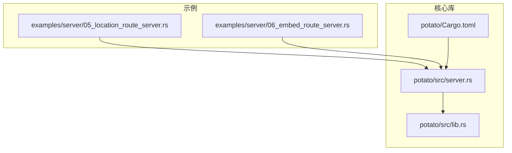
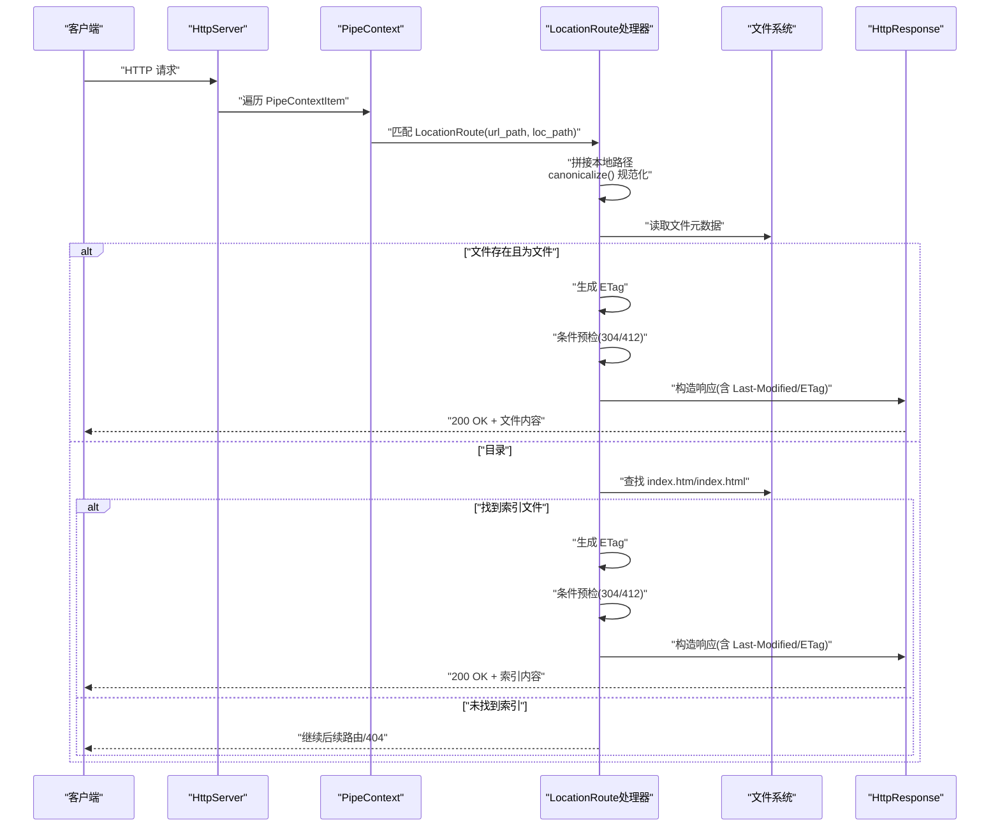
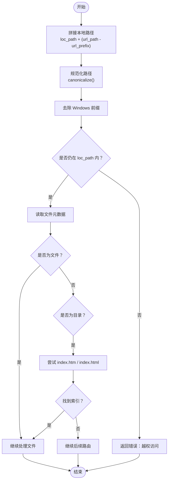
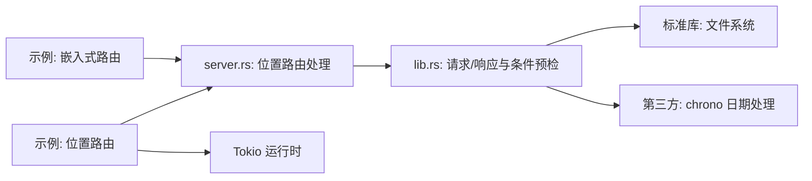

# 位置路由

<cite>
**本文引用的文件**
- [examples/server/05_location_route_server.rs](file://examples/server/05_location_route_server.rs)
- [examples/server/06_embed_route_server.rs](file://examples/server/06_embed_route_server.rs)
- [potato/src/server.rs](file://potato/src/server.rs)
- [potato/src/lib.rs](file://potato/src/lib.rs)
- [Cargo.toml](file://Cargo.toml)
- [potato/Cargo.toml](file://potato/Cargo.toml)
</cite>

## 目录
1. [简介](#简介)
2. [项目结构](#项目结构)
3. [核心组件](#核心组件)
4. [架构总览](#架构总览)
5. [详细组件分析](#详细组件分析)
6. [依赖关系分析](#依赖关系分析)
7. [性能考虑](#性能考虑)
8. [故障排查指南](#故障排查指南)
9. [结论](#结论)
10. [附录](#附录)

## 简介
本文件系统性阐述 Potato 的“位置路由”能力：基于 URL 路径前缀的静态文件服务与目录索引支持，涵盖以下主题：
- 基于 URL 路径前缀的路由机制与 use_location_route 配置
- 文件系统映射规则、目录遍历保护与安全校验
- 静态文件服务细节：ETag 生成、条件请求处理（304/412）、文件元数据注入与 MIME 类型推断
- 目录索引文件（index.htm、index.html）支持流程
- 性能优化建议：文件缓存策略、并发访问控制与内存使用优化
- 实际配置示例与最佳实践

## 项目结构
与位置路由直接相关的代码集中在 potato 模块中，示例程序演示了如何在服务器上启用位置路由。

图表来源
- [examples/server/05_location_route_server.rs](file://examples/server/05_location_route_server.rs#L1-L11)
- [examples/server/06_embed_route_server.rs](file://examples/server/06_embed_route_server.rs#L1-L11)
- [potato/src/server.rs](file://potato/src/server.rs#L40-L120)
- [potato/src/lib.rs](file://potato/src/lib.rs#L950-L1040)
- [potato/Cargo.toml](file://potato/Cargo.toml#L1-L76)

章节来源
- [examples/server/05_location_route_server.rs](file://examples/server/05_location_route_server.rs#L1-L11)
- [examples/server/06_embed_route_server.rs](file://examples/server/06_embed_route_server.rs#L1-L11)
- [potato/src/server.rs](file://potato/src/server.rs#L40-L120)
- [potato/src/lib.rs](file://potato/src/lib.rs#L950-L1040)
- [potato/Cargo.toml](file://potato/Cargo.toml#L1-L76)

## 核心组件
- 位置路由上下文项：通过 PipeContextItem::LocationRoute 将 URL 前缀与本地路径进行绑定，形成“前缀 → 本地根目录”的映射。
- 请求处理管线：在请求进入时，按顺序匹配各 PipeContextItem；当命中 LocationRoute 时执行文件系统映射与安全校验。
- 条件请求预检：通过 HttpRequest.check_precondition_headers 统一处理 If-Match/If-None-Match/If-Unmodified-Since/If-Modified-Since，返回 304 或 412。
- 静态文件响应：HttpResponse.from_file/from_mem_file 注入 Last-Modified、ETag，并根据扩展名或路径推断 Content-Type。

章节来源
- [potato/src/server.rs](file://potato/src/server.rs#L40-L120)
- [potato/src/server.rs](file://potato/src/server.rs#L408-L607)
- [potato/src/lib.rs](file://potato/src/lib.rs#L750-L857)
- [potato/src/lib.rs](file://potato/src/lib.rs#L950-L1040)

## 架构总览
位置路由在请求处理管线中的工作流如下：

图表来源
- [potato/src/server.rs](file://potato/src/server.rs#L408-L607)
- [potato/src/lib.rs](file://potato/src/lib.rs#L750-L857)
- [potato/src/lib.rs](file://potato/src/lib.rs#L950-L1040)

## 详细组件分析

### use_location_route 方法与配置
- 作用：注册一个“URL 前缀 → 本地路径”的静态资源映射。
- 使用方式：在服务器 configure 回调中调用 ctx.use_location_route(url_prefix, local_root)。
- 示例：示例程序将 "/" 映射到本地目录 "/wwwroot"，从而将所有以 "/" 开头的请求交由位置路由处理。

章节来源
- [examples/server/05_location_route_server.rs](file://examples/server/05_location_route_server.rs#L5-L8)
- [potato/src/server.rs](file://potato/src/server.rs#L77-L81)

### 文件系统映射与目录遍历保护
- 映射规则
  - 将 URL 路径截去前缀部分，拼接到本地根目录后，得到目标文件/目录路径。
  - 对路径进行规范化（canonicalize），并去除 Windows 前缀（如 UNC 前缀）。
- 安全校验
  - 规范化后的路径必须仍位于本地根目录之下，否则视为越权访问并返回错误。
- 目录遍历防护
  - 通过 starts_with(loc_path) 判断，确保最终路径不回溯到根目录之外。

图表来源
- [potato/src/server.rs](file://potato/src/server.rs#L408-L607)

章节来源
- [potato/src/server.rs](file://potato/src/server.rs#L408-L607)

### 静态文件服务细节
- ETag 生成
  - 基于文件最后修改时间（秒级）与文件大小组合生成，格式为双引号包裹的十六进制字符串。
  - 该值同时写入响应头 ETag。
- 条件请求处理
  - If-Match：若指定且不匹配则返回 412。
  - If-Unmodified-Since：若资源在此时间之后被修改则返回 412。
  - If-None-Match：若匹配则返回 304；通配符 "*" 在资源存在时直接返回 304。
  - If-Modified-Since：在无 If-None-Match 时生效，若未修改则返回 304。
- 文件元数据注入
  - Last-Modified：从文件修改时间转换为 RFC 1123 格式写入响应头。
- MIME 类型自动检测
  - 依据路径扩展名或路径结尾斜杠推断 Content-Type；默认二进制流类型。
- 下载模式
  - 可选将 Content-Disposition 设置为附件下载，文件名为路径最后一段。

章节来源
- [potato/src/server.rs](file://potato/src/server.rs#L426-L461)
- [potato/src/server.rs](file://potato/src/server.rs#L469-L510)
- [potato/src/server.rs](file://potato/src/server.rs#L519-L560)
- [potato/src/lib.rs](file://potato/src/lib.rs#L750-L857)
- [potato/src/lib.rs](file://potato/src/lib.rs#L970-L1040)

### 目录索引文件支持（index.htm、index.html）
- 当请求路径指向目录时，先尝试定位 index.htm；若不存在再尝试 index.html。
- 若找到任一索引文件，则按文件处理流程生成 ETag 并执行条件预检，随后返回该索引文件内容。
- 若目录下均无索引文件，则跳过位置路由处理，继续后续路由匹配。

章节来源
- [potato/src/server.rs](file://potato/src/server.rs#L463-L563)

### 与嵌入式路由的对比
- 嵌入式路由（EmbeddedRoute）将资源内嵌在二进制中，适合无需外部文件系统的场景。
- 位置路由（LocationRoute）面向真实文件系统，便于热更新与大文件分发。

章节来源
- [examples/server/06_embed_route_server.rs](file://examples/server/06_embed_route_server.rs#L5-L7)
- [potato/src/server.rs](file://potato/src/server.rs#L569-L607)

## 依赖关系分析
- 位置路由依赖于标准库文件系统接口（读取元数据、打开文件）与 HTTP 请求/响应模型。
- 条件请求处理依赖于日期解析工具函数与响应头注入。
- 示例程序依赖 tokio 运行时与 HttpServer 启动流程。

图表来源
- [examples/server/05_location_route_server.rs](file://examples/server/05_location_route_server.rs#L1-L11)
- [examples/server/06_embed_route_server.rs](file://examples/server/06_embed_route_server.rs#L1-L11)
- [potato/src/server.rs](file://potato/src/server.rs#L408-L607)
- [potato/src/lib.rs](file://potato/src/lib.rs#L55-L132)
- [potato/Cargo.toml](file://potato/Cargo.toml#L16-L42)

章节来源
- [Cargo.toml](file://Cargo.toml#L1-L4)
- [potato/Cargo.toml](file://potato/Cargo.toml#L16-L42)

## 性能考虑
- 文件缓存策略
  - 利用 ETag 与 Last-Modified，结合浏览器/代理缓存，可显著降低带宽与 I/O 压力。
  - 对频繁访问的大文件，建议配合 CDN 缓存与压缩策略。
- 并发访问控制
  - 采用异步 I/O（Tokio）处理请求，避免阻塞；对热点文件可考虑内存缓存（需注意一致性）。
- 内存使用优化
  - 大文件传输优先使用流式读取；仅在必要时将整个文件加载至内存。
  - MIME 类型与 ETag 计算应尽量避免重复计算，可在上层做轻量缓存。
- 压缩与传输
  - 响应体可按需启用 gzip 压缩（满足最小阈值且未设置编码时），减少网络传输开销。

章节来源
- [potato/src/lib.rs](file://potato/src/lib.rs#L1068-L1108)
- [potato/src/lib.rs](file://potato/src/lib.rs#L970-L1040)

## 故障排查指南
- “越权访问”错误
  - 现象：返回错误提示“url path over directory”。
  - 原因：规范化后的路径不在本地根目录之内。
  - 排查：确认 URL 路径未包含上层目录引用；确保 loc_path 正确且权限允许。
- 304/412 异常
  - 现象：收到 304 或 412。
  - 原因：客户端携带的条件请求头与当前资源状态不匹配。
  - 排查：检查 If-None-Match/If-Modified-Since/If-Match/If-Unmodified-Since 是否合理。
- 索引文件未生效
  - 现象：访问目录未返回 index.htm 或 index.html。
  - 原因：目录下不存在受支持的索引文件。
  - 排查：确认文件名与大小写正确，且具备读取权限。
- MIME 类型异常
  - 现象：浏览器无法正确渲染资源。
  - 原因：扩展名缺失或不被识别。
  - 排查：为文件添加合适扩展名，或在上层统一规范命名。

章节来源
- [potato/src/server.rs](file://potato/src/server.rs#L420-L422)
- [potato/src/lib.rs](file://potato/src/lib.rs#L750-L857)
- [potato/src/lib.rs](file://potato/src/lib.rs#L1012-L1024)

## 结论
位置路由通过简洁的 URL 前缀映射与严格的路径规范化校验，提供了安全可靠的静态文件服务能力；结合 ETag/Last-Modified 的条件请求处理与 MIME 自动推断，既保证了性能也提升了兼容性。配合 CDN、缓存与压缩等手段，可进一步优化大规模静态资源分发场景下的整体表现。

## 附录

### 实际配置示例与最佳实践
- 基础示例
  - 将根路径 "/" 映射到本地目录 "/wwwroot"，即可直接提供静态资源。
  - 参考示例文件路径：[examples/server/05_location_route_server.rs](file://examples/server/05_location_route_server.rs#L5-L8)
- 最佳实践
  - 将静态资源置于独立目录，避免与动态路由冲突。
  - 为目录提供 index.htm/index.html，提升用户体验。
  - 对大文件启用浏览器缓存与 CDN 缓存，减少重复传输。
  - 定期校验文件权限与路径合法性，防止越权访问。

章节来源
- [examples/server/05_location_route_server.rs](file://examples/server/05_location_route_server.rs#L5-L8)