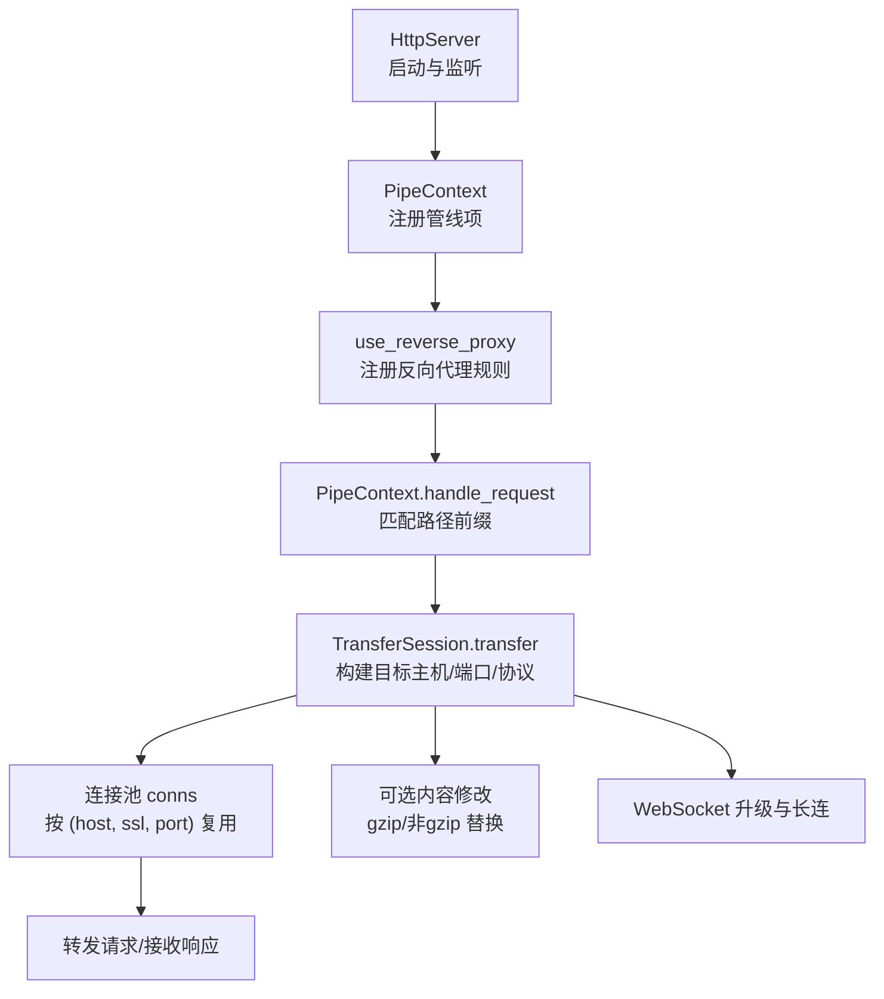
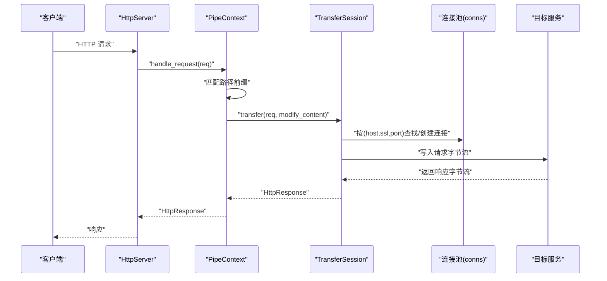
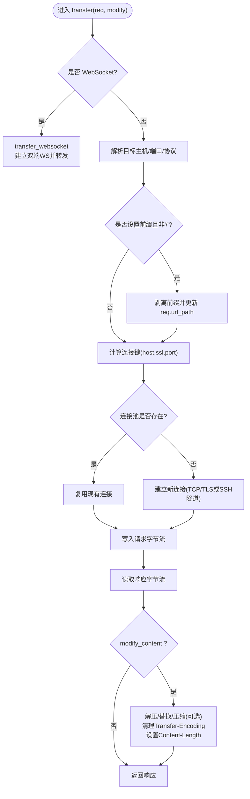
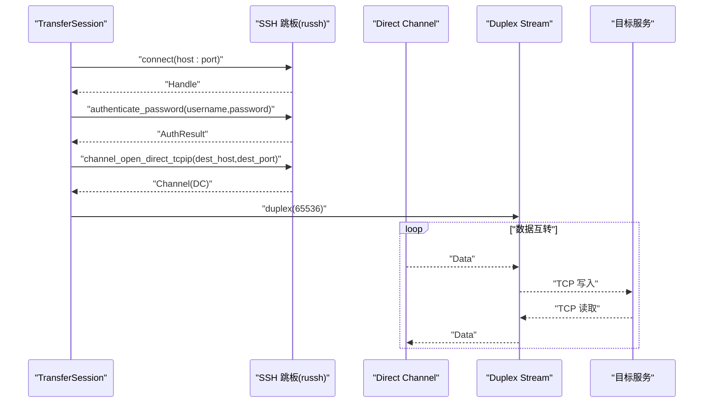
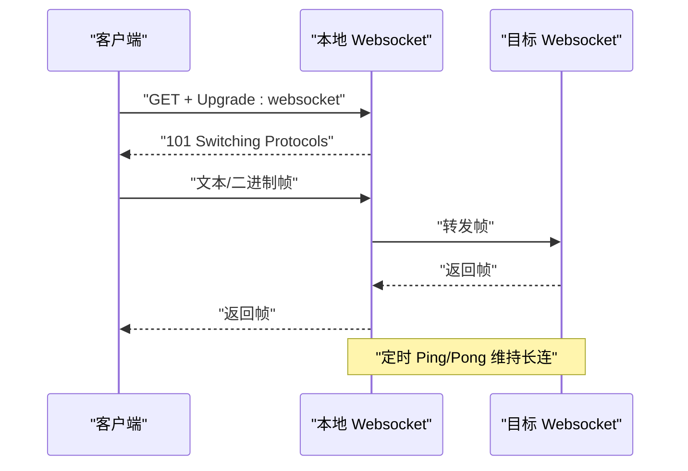
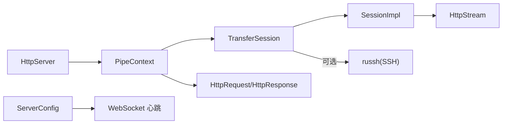

# 反向代理路由

<cite>
**本文档引用的文件**
- [lib.rs](file://potato/src/lib.rs)
- [server.rs](file://potato/src/server.rs)
- [client.rs](file://potato/src/client.rs)
- [global_config.rs](file://potato/src/global_config.rs)
- [tcp_stream.rs](file://potato/src/utils/tcp_stream.rs)
- [13_reverse_proxy_server.rs](file://examples/server/13_reverse_proxy_server.rs)
- [14_reverse_proxy_with_ssh_server.rs](file://examples/server/14_reverse_proxy_with_ssh_server.rs)
- [03_websocket_client.rs](file://examples/client/03_websocket_client.rs)
- [Cargo.toml（根）](file://Cargo.toml)
- [Cargo.toml（potato包）](file://potato/Cargo.toml)
</cite>

## 目录
1. [简介](#简介)
2. [项目结构](#项目结构)
3. [核心组件](#核心组件)
4. [架构总览](#架构总览)
5. [组件详解](#组件详解)
6. [依赖关系分析](#依赖关系分析)
7. [性能考量](#性能考量)
8. [故障排查指南](#故障排查指南)
9. [结论](#结论)
10. [附录：实际应用与配置示例](#附录实际应用与配置示例)

## 简介
本文件系统性阐述 Potato 框架中的“反向代理路由”能力，重点覆盖以下主题：
- use_reverse_proxy 方法的使用与配置项：URL 路径前缀匹配、目标 URL 配置、可选的内容修改（HTML 内容替换、链接重写、资源路径调整）。
- TransferSession 的工作原理：连接池管理、请求转发、响应处理、WebSocket 升级与长连接维持。
- SSH 跳板代理支持：russh 集成与隧道建立流程。
- WebSocket 升级处理与长连接保持机制。
- 性能优化策略：连接复用、缓冲区管理、超时控制。
- 安全考虑与最佳实践：请求头过滤、速率限制、访问控制。
- 实际应用场景与配置示例。

## 项目结构
围绕反向代理路由的关键模块与文件如下：
- 服务器管线与路由：server.rs 中的 PipeContext 与 use_reverse_proxy 注册逻辑。
- 请求/响应模型与 WebSocket：lib.rs 中的 HttpRequest/HttpResponse/Websocket。
- 传输会话与连接池：client.rs 中的 TransferSession、SessionImpl、HttpStream。
- 全局配置（如 WebSocket 心跳周期）：global_config.rs。
- 示例与特性开关：examples 下的反代与 SSH 示例、Cargo.toml 特性开关。

图表来源
- [server.rs](file://potato/src/server.rs#L115-L126)
- [server.rs](file://potato/src/server.rs#L615-L627)
- [client.rs](file://potato/src/client.rs#L275-L473)
- [client.rs](file://potato/src/client.rs#L475-L591)

章节来源
- [server.rs](file://potato/src/server.rs#L115-L126)
- [server.rs](file://potato/src/server.rs#L615-L627)
- [client.rs](file://potato/src/client.rs#L275-L473)
- [client.rs](file://potato/src/client.rs#L475-L591)

## 核心组件
- 反向代理注册：通过 PipeContext.use_reverse_proxy(url_path, proxy_url, modify_content) 将某路径前缀的请求交由 TransferSession 处理。
- 传输会话：TransferSession 维护连接池，解析目标主机/端口/协议，执行请求转发与响应读取；支持可选的内容修改与 WebSocket 升级。
- 请求/响应模型：HttpRequest/HttpResponse 提供请求解析、头部操作、WebSocket 升级等能力。
- 连接抽象：HttpStream 封装 TCP/TLS/Duplex 流，统一读写接口。
- 全局配置：ServerConfig 提供 WebSocket 心跳周期等运行期参数。

章节来源
- [server.rs](file://potato/src/server.rs#L115-L126)
- [client.rs](file://potato/src/client.rs#L224-L230)
- [lib.rs](file://potato/src/lib.rs#L385-L586)
- [tcp_stream.rs](file://potato/src/utils/tcp_stream.rs#L11-L73)
- [global_config.rs](file://potato/src/global_config.rs#L18-L35)

## 架构总览
反向代理在服务器管线中的位置与调用链如下：

图表来源
- [server.rs](file://potato/src/server.rs#L615-L627)
- [client.rs](file://potato/src/client.rs#L275-L473)

## 组件详解

### use_reverse_proxy 使用与配置
- 路径前缀匹配：当请求 URL 路径以注册的 url_path 前缀开头时，命中该反向代理规则。
- 目标 URL 配置：proxy_url 作为目标服务的基础地址，用于解析主机、端口与协议（http/https）。
- 内容修改选项：modify_content=true 时，对响应内容进行 HTML 文本替换与长度更新，支持 gzip 场景解压后再替换。
- 在服务器配置中注册：
  - ctx.use_reverse_proxy("/", "https://example.com", true)
  - 匹配所有路径，将请求转发到 https://example.com，并启用内容修改。

章节来源
- [server.rs](file://potato/src/server.rs#L115-L126)
- [server.rs](file://potato/src/server.rs#L615-L627)
- [13_reverse_proxy_server.rs](file://examples/server/13_reverse_proxy_server.rs#L1-L10)

### TransferSession 工作原理
- 连接池管理
  - conns: HashMap< (host, ssl, port), HttpStream >
  - 按目标三元组复用连接，减少握手与建连开销。
- 请求转发
  - 解析目标主机/端口/协议：优先从 dest_url 解析；否则根据请求头与方法推断。
  - 若设置了 req_path_prefix，会将原始路径前缀剥离后转发至目标服务。
  - 设置 Host 头为目标主机，写入请求字节流。
- 响应处理
  - 读取响应字节流，构造 HttpResponse。
  - 当 modify_content=true 时：
    - 若 Content-Encoding 为 gzip，则先解压再替换，再压缩回。
    - 否则直接对响应体文本进行替换。
    - 清除 Transfer-Encoding，设置 Content-Length。
- WebSocket 升级与长连接
  - 若请求是 WebSocket，走 transfer_websocket 分支：
    - 计算目标 ws/wss URL（含路径与查询串），保留必要头部（剔除 Host）。
    - 建立到目标的 WebSocket 连接与本地客户端的 WebSocket 连接。
    - 双向转发消息，维持心跳与关闭帧处理。
- SSH 跳板代理
  - 仅在启用 ssh 特性时可用。
  - with_ssh_jumpbox 建立到跳板的 SSH 连接并认证。
  - transfer 中若存在 jumpbox，通过 direct-tcpip 隧道建立双向数据通道，使用 tokio duplex 与 russh channel 数据互转。

图表来源
- [client.rs](file://potato/src/client.rs#L275-L473)
- [client.rs](file://potato/src/client.rs#L475-L591)

章节来源
- [client.rs](file://potato/src/client.rs#L224-L230)
- [client.rs](file://potato/src/client.rs#L275-L473)
- [client.rs](file://potato/src/client.rs#L475-L591)

### 内容修改机制（HTML/链接/资源）
- 生效条件：modify_content=true。
- 处理流程：
  - gzip：先解压，再进行字符串替换，最后压缩。
  - 非 gzip：直接对响应体字符串进行替换。
  - 更新响应头：移除 Transfer-Encoding，设置正确的 Content-Length。
- 替换范围：基于 dest_url 与 req_path_prefix 的组合，将目标站点的路径替换为代理路径前缀，确保内联资源与链接正确指向代理路径。

章节来源
- [client.rs](file://potato/src/client.rs#L424-L470)

### SSH 跳板代理（russh 集成）
- 特性开关：需要启用 ssh 特性。
- 连接与认证：
  - with_ssh_jumpbox 建立到跳板的 SSH 连接并使用密码认证。
- 隧道建立：
  - transfer 中若存在 jumpbox，通过 channel_open_direct_tcpip 打开到目标主机的直连隧道。
  - 使用 tokio::io::duplex 创建双向通道，russh channel 与本地 duplex 之间进行数据互转。
- 适用场景：代理目标服务位于受保护网络，需经由跳板访问。

图表来源
- [client.rs](file://potato/src/client.rs#L257-L273)
- [client.rs](file://potato/src/client.rs#L336-L381)

章节来源
- [client.rs](file://potato/src/client.rs#L257-L273)
- [client.rs](file://potato/src/client.rs#L336-L381)
- [14_reverse_proxy_with_ssh_server.rs](file://examples/server/14_reverse_proxy_with_ssh_server.rs#L1-L25)

### WebSocket 升级与长连接保持
- 升级判定：HttpRequest.is_websocket 基于 Connection/Upgrade/Sec-WebSocket-* 头判断。
- 升级流程：
  - 本地：通过 HttpRequest.upgrade_websocket 返回 Websocket，写入 101 响应。
  - 目标：Session::connect 建立到目标 ws/wss 的连接。
  - 转发：双端循环 select 接收并发送消息，自动处理 Ping/Pong 与 Close。
- 心跳控制：ServerConfig.get_ws_ping_duration 控制心跳间隔，避免空闲断开。

图表来源
- [lib.rs](file://potato/src/lib.rs#L560-L579)
- [lib.rs](file://potato/src/lib.rs#L208-L359)
- [client.rs](file://potato/src/client.rs#L475-L591)
- [global_config.rs](file://potato/src/global_config.rs#L28-L34)

章节来源
- [lib.rs](file://potato/src/lib.rs#L560-L579)
- [lib.rs](file://potato/src/lib.rs#L208-L359)
- [client.rs](file://potato/src/client.rs#L475-L591)
- [global_config.rs](file://potato/src/global_config.rs#L28-L34)
- [03_websocket_client.rs](file://examples/client/03_websocket_client.rs#L1-L11)

## 依赖关系分析
- 服务器管线依赖：
  - PipeContext 依赖 TransferSession 执行转发。
  - PipeContext 依赖 HttpRequest/HttpResponse 进行请求解析与响应生成。
- TransferSession 依赖：
  - HttpStream 抽象底层 I/O。
  - SessionImpl 封装 TLS/非 TLS 连接。
  - 可选 russh 用于 SSH 隧道。
- 全局配置：
  - ServerConfig 提供运行期参数（如 WebSocket 心跳周期）。

图表来源
- [server.rs](file://potato/src/server.rs#L615-L627)
- [client.rs](file://potato/src/client.rs#L62-L99)
- [tcp_stream.rs](file://potato/src/utils/tcp_stream.rs#L11-L73)
- [Cargo.toml（potato包）](file://potato/Cargo.toml#L58-L72)

章节来源
- [server.rs](file://potato/src/server.rs#L615-L627)
- [client.rs](file://potato/src/client.rs#L62-L99)
- [tcp_stream.rs](file://potato/src/utils/tcp_stream.rs#L11-L73)
- [Cargo.toml（potato包）](file://potato/Cargo.toml#L58-L72)

## 性能考量
- 连接复用
  - 连接池按 (host, ssl, port) 复用，避免重复握手与建连。
- 缓冲区管理
  - HttpStream 统一读写接口，TransferSession 使用固定容量缓冲读取响应。
  - SSH 隧道使用 tokio::io::duplex 并设定合适缓冲大小（示例中为 65536）。
- 超时控制
  - WebSocket 循环中使用 tokio::time::timeout 控制心跳等待，避免阻塞。
- 压缩与内容修改
  - gzip 场景先解压再替换，注意内存占用与 CPU 开销；可结合业务评估是否开启 modify_content。
- TLS 与特性
  - TLS 功能默认启用，可按需关闭以减少依赖与开销；SSH 特性按需启用。

章节来源
- [client.rs](file://potato/src/client.rs#L328-L417)
- [client.rs](file://potato/src/client.rs#L342-L381)
- [lib.rs](file://potato/src/lib.rs#L288-L308)
- [global_config.rs](file://potato/src/global_config.rs#L28-L34)
- [Cargo.toml（potato包）](file://potato/Cargo.toml#L65-L72)

## 故障排查指南
- 无法连接目标服务
  - 检查 dest_url 是否正确，主机与端口是否可达。
  - 若启用 TLS，确认证书链与域名匹配。
- WebSocket 无法升级
  - 核对客户端请求头：Connection/Upgrade/Sec-WebSocket-Version/Sec-WebSocket-Key。
  - 查看本地升级返回码是否为 101。
- SSH 隧道失败
  - 确认跳板主机可达、端口开放、凭据正确。
  - 检查 russh 认证结果与 direct-tcpip 通道状态。
- 内容修改异常
  - modify_content 仅对文本响应有效；gzip 场景需确保解压成功。
  - 注意 Content-Length 与 Transfer-Encoding 的一致性更新。
- 长连接中断
  - 调整 ServerConfig 的 WebSocket 心跳周期，避免中间设备超时。

章节来源
- [client.rs](file://potato/src/client.rs#L257-L273)
- [client.rs](file://potato/src/client.rs#L475-L591)
- [lib.rs](file://potato/src/lib.rs#L560-L579)
- [global_config.rs](file://potato/src/global_config.rs#L28-L34)

## 结论
Potato 的反向代理路由通过简洁的 API 与高效的内部实现，提供了路径前缀匹配、目标 URL 配置、连接池复用、内容修改与 WebSocket 支持等能力。结合 SSH 跳板与 TLS 特性，可在复杂网络环境中灵活部署。建议在生产环境关注连接复用、缓冲区大小、超时与心跳策略，并配合请求头过滤与访问控制提升安全性与稳定性。

## 附录：实际应用与配置示例
- 基础反向代理
  - 在服务器配置中注册 use_reverse_proxy("/", "https://example.com", true)，即可将所有请求转发至目标站点并启用内容修改。
  - 示例文件展示了如何快速启动一个反向代理服务器。
- SSH 跳板代理
  - 通过 with_ssh_jumpbox 配置跳板信息，随后使用 TransferSession.transfer 完成带隧道的请求转发。
  - 示例文件演示了在自定义处理器中集成 SSH 跳板的完整流程。
- WebSocket 客户端测试
  - 示例展示了如何连接本地 WebSocket 服务并发送/接收消息，便于验证代理后的 WebSocket 功能。

章节来源
- [13_reverse_proxy_server.rs](file://examples/server/13_reverse_proxy_server.rs#L1-L10)
- [14_reverse_proxy_with_ssh_server.rs](file://examples/server/14_reverse_proxy_with_ssh_server.rs#L1-L25)
- [03_websocket_client.rs](file://examples/client/03_websocket_client.rs#L1-L11)