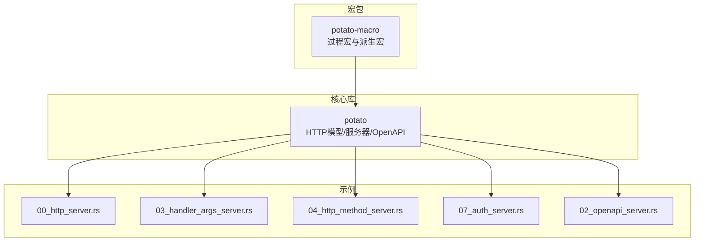
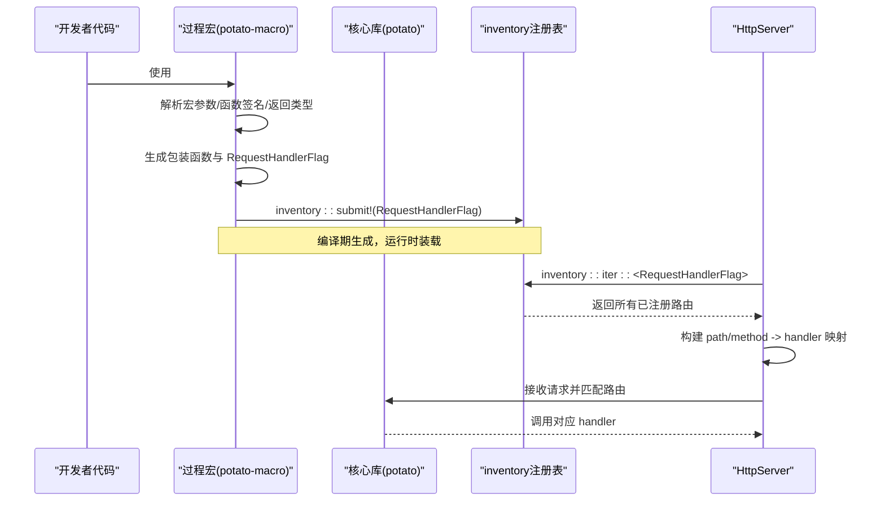
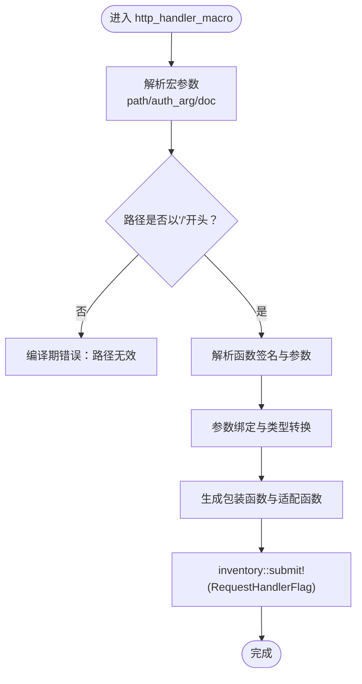
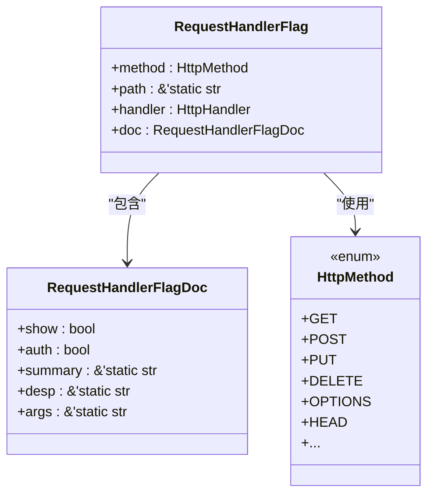
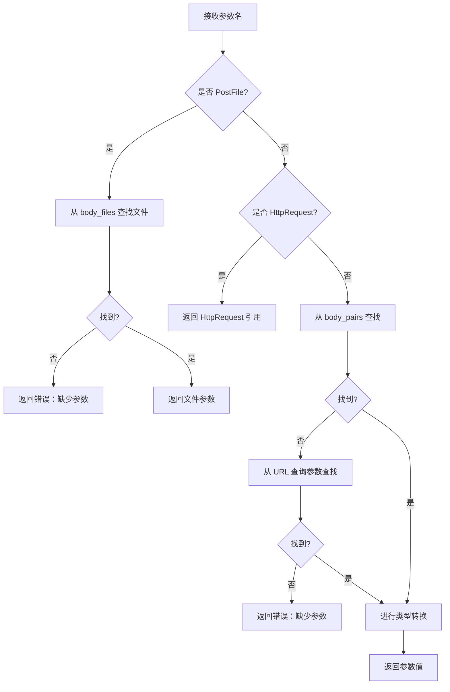
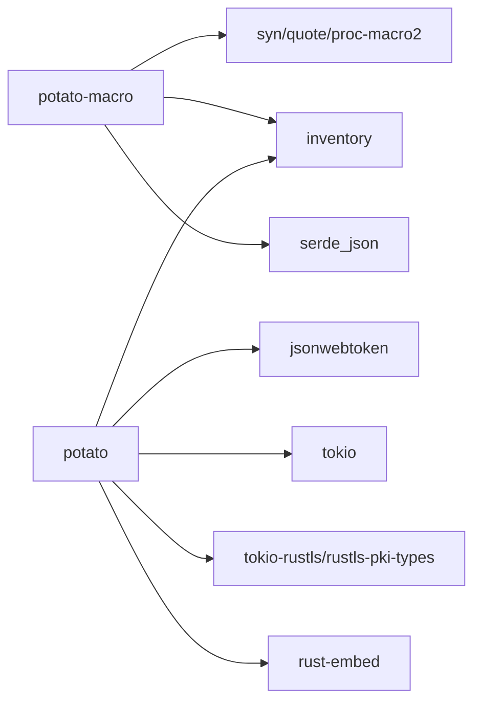

# 宏路由系统

<cite>
**本文引用的文件**
- [Cargo.toml](file://potato-macro/Cargo.toml)
- [lib.rs](file://potato-macro/src/lib.rs)
- [utils.rs](file://potato-macro/src/utils.rs)
- [Cargo.toml](file://potato/Cargo.toml)
- [lib.rs](file://potato/src/lib.rs)
- [server.rs](file://potato/src/server.rs)
- [main.rs](file://potato/src/main.rs)
- [00_http_server.rs](file://examples/server/00_http_server.rs)
- [04_http_method_server.rs](file://examples/server/04_http_method_server.rs)
- [03_handler_args_server.rs](file://examples/server/03_handler_args_server.rs)
- [07_auth_server.rs](file://examples/server/07_auth_server.rs)
- [02_openapi_server.rs](file://examples/server/02_openapi_server.rs)
- [02_method_annotation.md](file://docs/guide/02_method_annotation.md)
- [03_method_declare.md](file://docs/guide/03_method_declare.md)
</cite>

## 目录
1. [简介](#简介)
2. [项目结构](#项目结构)
3. [核心组件](#核心组件)
4. [架构总览](#架构总览)
5. [详细组件分析](#详细组件分析)
6. [依赖关系分析](#依赖关系分析)
7. [性能考量](#性能考量)
8. [故障排查指南](#故障排查指南)
9. [结论](#结论)
10. [附录](#附录)

## 简介
本文件系统性阐述 Potato 的“宏路由”机制，重点覆盖以下方面：
- 基于宏的路由声明语法与参数绑定规则（http_get、http_post、http_put、http_delete、http_options、http_head）。
- 宏处理器在编译时生成路由注册代码的流程，RequestHandlerFlag 结构体的作用，以及 inventory 库的运行时注册机制。
- 动态参数提取与类型转换机制：查询参数、路径参数、请求体参数的绑定策略。
- 宏参数配置项：路由路径、HTTP 方法、认证要求、OpenAPI 文档生成等。
- 完整示例路径与常见错误处理、调试技巧。

## 项目结构
该仓库采用多包结构：
- potato：核心库，包含 HTTP 请求/响应模型、服务器实现、OpenAPI 收集与注册等。
- potato-macro：过程宏库，提供 http_* 路由宏与派生宏，负责编译期代码生成与运行时注册。
- examples：演示各功能的最小可运行示例。
- docs：用户指南文档，涵盖注解与声明用法。

图表来源
- [Cargo.toml](file://potato-macro/Cargo.toml#L1-L24)
- [Cargo.toml](file://potato/Cargo.toml#L1-L76)

章节来源
- [Cargo.toml](file://potato-macro/Cargo.toml#L1-L24)
- [Cargo.toml](file://potato/Cargo.toml#L1-L76)

## 核心组件
- 过程宏模块（potato-macro）
  - 提供 http_get/http_post/http_put/http_delete/http_options/http_head 属性宏，负责解析宏参数、校验路由路径、解析函数签名、生成包装函数与 inventory::submit 注册。
  - 提供标准头派生宏（StandardHeader），自动派生枚举与应用逻辑。
  - 提供资源嵌入宏（embed_dir），简化静态资源加载。
- 核心库（potato）
  - 定义 RequestHandlerFlag、RequestHandlerFlagDoc、HttpMethod、HttpRequest、HttpResponse 等核心类型。
  - 使用 inventory::collect! 在运行时收集所有注册的路由条目，并建立 path/method 到处理器的映射。
  - 提供 OpenAPI 文档聚合逻辑，从已注册路由中抽取摘要、参数、标签等信息。
  - 提供 WebSocket 升级、条件预检、内容类型解析等能力。

章节来源
- [lib.rs](file://potato-macro/src/lib.rs#L1-L399)
- [utils.rs](file://potato-macro/src/utils.rs#L1-L19)
- [lib.rs](file://potato/src/lib.rs#L126-L175)
- [server.rs](file://potato/src/server.rs#L28-L38)

## 架构总览
下图展示了从“宏声明”到“运行时路由分发”的完整链路：

图表来源
- [lib.rs](file://potato-macro/src/lib.rs#L26-L300)
- [lib.rs](file://potato/src/lib.rs#L175-L175)
- [server.rs](file://potato/src/server.rs#L28-L38)

## 详细组件分析

### 1) 宏处理器与路由声明
- 宏入口
  - http_get/http_post/http_put/http_delete/http_options/http_head：统一委托给 http_handler_macro，仅传入 HTTP 方法名。
- 宏参数解析
  - 支持两种写法：
    - 直接传入路径字符串：#[http_get("/path")]。
    - 命名参数：#[http_get(path="/path", auth_arg=arg)]。
  - 路径必须以 “/” 开头；未提供 path 将触发编译期错误。
- 函数签名与参数绑定
  - 支持的参数类型集合：String、bool、u8/u16/u32/u64/usize、i8/i16/i32/i64/isize、f32/f64。
  - 特殊参数：
    - 引用型 HttpRequest：#[http_get("/hello", req: &mut HttpRequest)]。
    - 文件上传 PostFile：#[http_post("/upload", file: PostFile)]。
    - 认证参数 auth_arg：仅允许 String 类型，且必须指向一个存在的参数名。
  - 绑定顺序与优先级：
    - HttpRequest：总是第一个参数位置。
    - PostFile：从请求体文件映射中按参数名查找。
    - 普通标量参数：先查 body_pairs（JSON 或 x-www-form-urlencoded），再查 URL 查询参数；若缺失则返回错误。
    - 非 String 类型参数：尝试 parse，失败返回错误。
- 返回类型支持
  - ()、Result<(), E>、HttpResponse、Result<HttpResponse, E>。
- 包装函数与注册
  - 宏生成两个函数：异步包装函数与 Box+Pin 的适配函数。
  - 使用 inventory::submit! 提交 RequestHandlerFlag，包含方法、路径、处理器指针、文档元数据。

图表来源
- [lib.rs](file://potato-macro/src/lib.rs#L26-L300)

章节来源
- [lib.rs](file://potato-macro/src/lib.rs#L26-L300)
- [utils.rs](file://potato-macro/src/utils.rs#L5-L18)

### 2) RequestHandlerFlag 与 inventory 注册
- RequestHandlerFlag
  - 字段：method（HttpMethod）、path（静态字符串）、handler（函数指针）、doc（RequestHandlerFlagDoc）。
- RequestHandlerFlagDoc
  - 字段：show（是否加入 OpenAPI）、auth（是否需要认证）、summary/desp（文档摘要/描述）、args（参数 JSON 描述）。
- 运行时收集
  - 使用 inventory::collect!(RequestHandlerFlag) 在编译期标记，运行时通过 inventory::iter::<RequestHandlerFlag> 获取所有条目。
  - 服务器启动时构建 path/method -> handler 的映射表，用于请求匹配。

图表来源
- [lib.rs](file://potato/src/lib.rs#L126-L175)

章节来源
- [lib.rs](file://potato/src/lib.rs#L126-L175)
- [server.rs](file://potato/src/server.rs#L28-L38)

### 3) 参数绑定与类型转换机制
- 绑定来源
  - PostFile：从 body_files 中按参数名查找。
  - 标量参数：优先从 body_pairs（JSON 对象或 x-www-form-urlencoded）解析；若不存在，则回退到 URL 查询参数。
- 类型转换
  - String：直接使用字符串值。
  - 非 String：尝试 parse，失败返回错误。
- 认证参数 auth_arg
  - 必须为 String，且必须指向一个存在的参数名。
  - 处理器内部从 Authorization 头中提取 Bearer token 并调用 jwt_check 校验，失败返回 401。

图表来源
- [lib.rs](file://potato-macro/src/lib.rs#L119-L188)

章节来源
- [lib.rs](file://potato-macro/src/lib.rs#L119-L188)

### 4) OpenAPI 文档生成
- 文档元数据来源
  - 宏处理器在编译期收集函数的 doc 注释与参数类型，生成 JSON 字符串并存储在 RequestHandlerFlagDoc.args 中。
- 服务器端聚合
  - 运行时遍历所有 RequestHandlerFlag，根据 doc.show 控制是否纳入文档；根据 path 的前缀生成 tag；根据参数类型推断 OpenAPI 的 in/query/body/file 等。
- 示例
  - 在示例中通过 server.configure(ctx.use_openapi("/doc/")) 启用文档服务。

章节来源
- [lib.rs](file://potato-macro/src/lib.rs#L67-L102)
- [server.rs](file://potato/src/server.rs#L133-L200)
- [02_openapi_server.rs](file://examples/server/02_openapi_server.rs#L1-L16)

### 5) WebSocket 与条件预检
- WebSocket
  - 通过 HttpRequest.is_websocket() 判断升级条件，成功后调用 upgrade_websocket() 完成握手。
- 条件预检
  - check_precondition_headers() 支持 If-Modified-Since、If-None-Match、If-Match、If-Unmodified-Since 等头部，返回 304 或 412。

章节来源
- [lib.rs](file://potato/src/lib.rs#L532-L586)
- [lib.rs](file://potato/src/lib.rs#L777-L800)

## 依赖关系分析
- 过程宏依赖
  - syn/quote/proc-macro2：解析与生成 Rust 代码。
  - serde_json：序列化参数元数据。
  - inventory：运行时收集注册项。
- 核心库依赖
  - inventory：收集 RequestHandlerFlag。
  - jsonwebtoken：JWT 签发与校验（用于认证）。
  - tokio、tokio-rustls、rustls-pki-types：异步与 TLS。
  - rust-embed：静态资源嵌入。

图表来源
- [Cargo.toml](file://potato-macro/Cargo.toml#L14-L21)
- [Cargo.toml](file://potato/Cargo.toml#L16-L41)

章节来源
- [Cargo.toml](file://potato-macro/Cargo.toml#L14-L21)
- [Cargo.toml](file://potato/Cargo.toml#L16-L41)

## 性能考量
- 编译期生成
  - 宏在编译期生成包装函数与注册代码，运行时仅做映射查找，避免反射开销。
- 运行时查找
  - 使用 LazyLock 缓存已收集的路由映射，减少重复初始化成本。
- 内容类型解析
  - 对 JSON/x-www-form-urlencoded/multipart/form-data 分别解析，避免不必要的解析步骤。
- 压缩与传输
  - 支持 gzip 压缩模式，按 Accept-Encoding 自动选择。

章节来源
- [server.rs](file://potato/src/server.rs#L28-L38)
- [lib.rs](file://potato/src/lib.rs#L497-L510)

## 故障排查指南
- 常见编译期错误
  - 路径未以 “/” 开头：检查宏参数 path。
  - 缺少 auth_arg 指向的参数：确认 auth_arg 名称与函数签名一致且为 String。
  - 不支持的参数类型：仅支持 String/数字/布尔与 PostFile/HttpRequest。
  - 返回类型不受支持：仅支持 ()、Result<(), E>、HttpResponse、Result<HttpResponse, E>。
- 运行时错误
  - 缺少参数：宏会在绑定阶段返回错误，提示缺失的参数名。
  - 类型转换失败：非 String 参数 parse 失败时返回错误。
  - 认证失败：Authorization 头缺失或 JWT 校验失败返回 401。
- 调试建议
  - 打开 OpenAPI 文档页面查看路由与参数描述。
  - 使用示例工程快速验证宏声明与参数绑定。
  - 在 main 中设置 JWT 秘钥以便测试鉴权。

章节来源
- [lib.rs](file://potato-macro/src/lib.rs#L57-L65)
- [lib.rs](file://potato-macro/src/lib.rs#L135-L155)
- [lib.rs](file://potato-macro/src/lib.rs#L167-L178)
- [07_auth_server.rs](file://examples/server/07_auth_server.rs#L8-L11)

## 结论
Potato 的宏路由系统通过“编译期宏 + 运行时 inventory 收集”的组合，实现了简洁而强大的路由声明与注册机制。宏处理器负责解析参数、生成包装函数与文档元数据，inventory 负责在运行时集中管理路由表，最终由服务器完成请求匹配与分发。配合 OpenAPI 聚合与 WebSocket/条件预检等能力，形成一套易用、可扩展且高性能的 HTTP 能力体系。

## 附录

### A. 宏参数与配置选项
- 路由路径
  - 直接传参：#[http_get("/path")]。
  - 命名参数：#[http_get(path="/path", ...)]。
- 认证要求
  - auth_arg：指定一个 String 类型的参数作为认证载荷来源。
- OpenAPI 文档
  - 宏处理器会收集函数 doc 注释与参数类型，运行时由服务器聚合为 OpenAPI JSON。
- 其他
  - 可选 doc.hidden 控制是否显示在文档中。

章节来源
- [lib.rs](file://potato-macro/src/lib.rs#L28-L65)
- [lib.rs](file://potato-macro/src/lib.rs#L67-L102)

### B. 示例清单与路径
- 最小 HTTP 服务
  - 示例路径：[00_http_server.rs](file://examples/server/00_http_server.rs#L1-L12)
- 多 HTTP 方法
  - 示例路径：[04_http_method_server.rs](file://examples/server/04_http_method_server.rs#L1-L42)
- 参数绑定与文件上传
  - 示例路径：[03_handler_args_server.rs](file://examples/server/03_handler_args_server.rs#L1-L32)
- 认证与 JWT
  - 示例路径：[07_auth_server.rs](file://examples/server/07_auth_server.rs#L1-L24)
- OpenAPI 文档
  - 示例路径：[02_openapi_server.rs](file://examples/server/02_openapi_server.rs#L1-L16)

### C. 用户指南参考
- 方法注解
  - 文档路径：[02_method_annotation.md](file://docs/guide/02_method_annotation.md#L1-L39)
- 处理函数声明
  - 文档路径：[03_method_declare.md](file://docs/guide/03_method_declare.md#L1-L53)