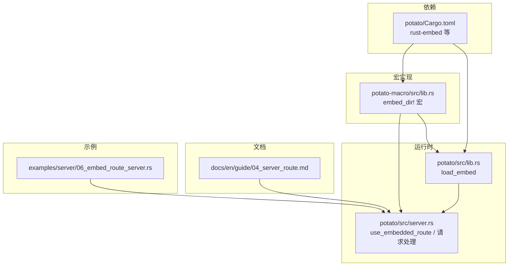
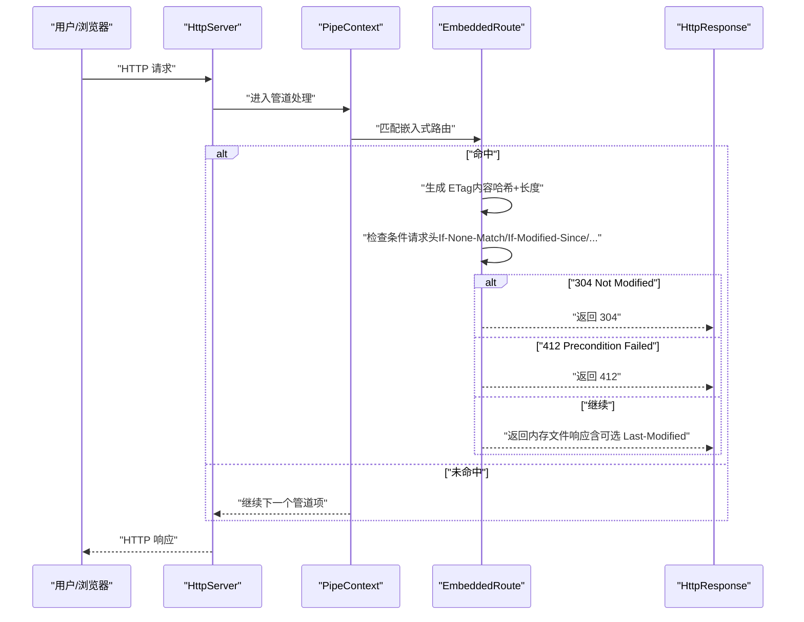
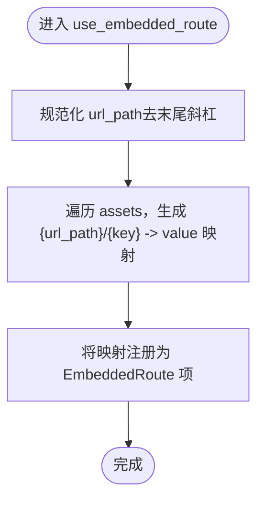
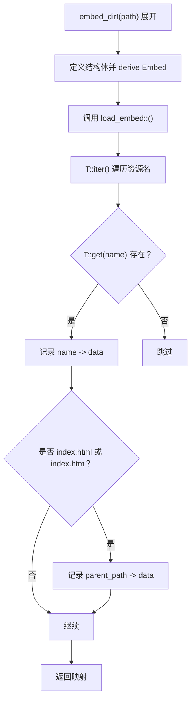
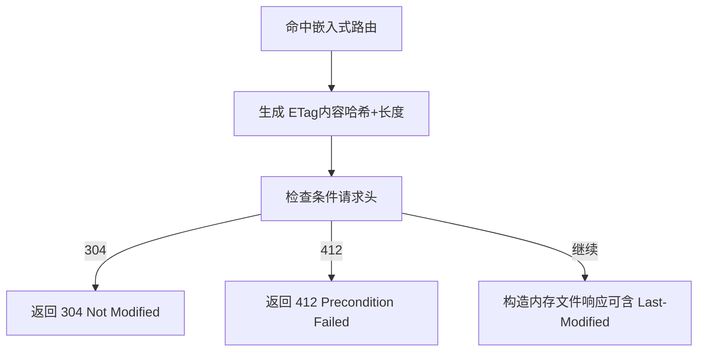

# 嵌入式路由

<cite>
**本文引用的文件**
- [examples/server/06_embed_route_server.rs](file://examples/server/06_embed_route_server.rs)
- [docs/en/guide/04_server_route.md](file://docs/en/guide/04_server_route.md)
- [potato/src/lib.rs](file://potato/src/lib.rs)
- [potato/src/server.rs](file://potato/src/server.rs)
- [potato-macro/src/lib.rs](file://potato-macro/src/lib.rs)
- [potato/Cargo.toml](file://potato/Cargo.toml)
</cite>

## 目录
1. [简介](#简介)
2. [项目结构](#项目结构)
3. [核心组件](#核心组件)
4. [架构总览](#架构总览)
5. [组件详解](#组件详解)
6. [依赖关系分析](#依赖关系分析)
7. [性能考量](#性能考量)
8. [故障排查指南](#故障排查指南)
9. [结论](#结论)
10. [附录](#附录)

## 简介
本篇文档聚焦于 Potato 的“嵌入式路由”能力，系统性讲解如何通过 use_embedded_route 将静态资源在编译期打包进二进制，并在运行时以高性能方式提供服务。内容涵盖：
- use_embedded_route 的使用方法与控制流
- rust_embed::Embed 宏与 embed_dir! 宏的配合机制
- 编译期资源打包与运行时内存存储、ETag 生成、条件请求处理
- MIME 类型与 Content-Type 设置（基于路径扩展名）
- 资源组织结构建议、命名规范与热重载策略
- 实际应用场景与配置示例（单页应用、仪表板、文档站点）

## 项目结构
围绕嵌入式路由的关键文件与职责如下：
- 示例：演示 use_embedded_route 的用法
- 文档：官方指南对嵌入式路由的说明
- 宏实现：embed_dir! 宏负责生成 Embed 派生并调用加载函数
- 运行时：use_embedded_route 注册路由项；请求处理时进行条件请求判断与响应返回
- 依赖：Cargo.toml 中声明了 rust-embed 与相关工具库

图表来源
- [examples/server/06_embed_route_server.rs](file://examples/server/06_embed_route_server.rs#L1-L11)
- [docs/en/guide/04_server_route.md](file://docs/en/guide/04_server_route.md#L43-L55)
- [potato-macro/src/lib.rs](file://potato-macro/src/lib.rs#L332-L343)
- [potato/src/lib.rs](file://potato/src/lib.rs#L1204-L1219)
- [potato/src/server.rs](file://potato/src/server.rs#L83-L100)
- [potato/Cargo.toml](file://potato/Cargo.toml#L31-L31)

章节来源
- [examples/server/06_embed_route_server.rs](file://examples/server/06_embed_route_server.rs#L1-L11)
- [docs/en/guide/04_server_route.md](file://docs/en/guide/04_server_route.md#L43-L55)
- [potato-macro/src/lib.rs](file://potato-macro/src/lib.rs#L332-L343)
- [potato/src/lib.rs](file://potato/src/lib.rs#L1204-L1219)
- [potato/src/server.rs](file://potato/src/server.rs#L83-L100)
- [potato/Cargo.toml](file://potato/Cargo.toml#L31-L31)

## 核心组件
- use_embedded_route：注册嵌入式资源路由表，将资源映射为内存字节序列
- embed_dir! 宏：生成 Embed 派生结构体并调用 load_embed<T> 加载资源
- load_embed<T>：遍历嵌入资源，构建键值映射，特殊处理 index.html/index.htm 的父路径
- 请求处理：命中嵌入式路由后，计算 ETag、执行条件请求预检、构造响应
- 条件请求：支持 If-None-Match、If-Modified-Since、If-Match、If-Unmodified-Since
- MIME/Content-Type：根据路径扩展名推断类型（由外部逻辑或上层约定，仓库未内置自动检测）

章节来源
- [potato/src/server.rs](file://potato/src/server.rs#L83-L100)
- [potato-macro/src/lib.rs](file://potato-macro/src/lib.rs#L332-L343)
- [potato/src/lib.rs](file://potato/src/lib.rs#L1204-L1219)
- [potato/src/lib.rs](file://potato/src/lib.rs#L761-L801)

## 架构总览
下图展示了从配置到请求处理的完整流程。

图表来源
- [potato/src/server.rs](file://potato/src/server.rs#L569-L606)
- [potato/src/lib.rs](file://potato/src/lib.rs#L761-L801)

## 组件详解

### use_embedded_route 使用与控制流
- 配置入口：在 server.configure 回调中调用 use_embedded_route(url_path, assets)
- 参数说明：
  - url_path：挂载前缀，内部会去除末尾斜杠
  - assets：键为相对路径字符串，值为静态字节数据（Cow<'static, [u8]>）
- 处理逻辑：
  - 将 assets 的每个键拼接为 "{url_path}/{key}"，形成最终路由表
  - 将该路由表作为 EmbeddedRoute 项加入管道上下文

图表来源
- [potato/src/server.rs](file://potato/src/server.rs#L83-L100)

章节来源
- [potato/src/server.rs](file://potato/src/server.rs#L83-L100)

### rust_embed::Embed 与 embed_dir! 宏
- embed_dir! 宏作用：
  - 接收一个目录路径字符串
  - 在展开时定义一个带有 #[folder = "..."] 的结构体，并派生 Embed
  - 调用 load_embed::<Asset>() 返回 HashMap<String, Cow<'static, [u8]>>
- load_embed<T> 行为：
  - 遍历 T::iter() 得到的资源名列表
  - 对每个名称通过 T::get(&name) 获取资源对象
  - 特殊处理：若资源名为 index.html 或 index.htm，同时将父路径作为键插入，便于 SPA 默认首页
  - 将 name -> file.data 加入结果映射

图表来源
- [potato-macro/src/lib.rs](file://potato-macro/src/lib.rs#L332-L343)
- [potato/src/lib.rs](file://potato/src/lib.rs#L1204-L1219)

章节来源
- [potato-macro/src/lib.rs](file://potato-macro/src/lib.rs#L332-L343)
- [potato/src/lib.rs](file://potato/src/lib.rs#L1204-L1219)

### 运行时访问机制与条件请求
- 命中路由后：
  - 计算 ETag：基于嵌入资源的内容哈希与长度，格式化为带引号的字符串
  - 执行条件请求预检：
    - If-None-Match 匹配则返回 304
    - If-Match 不匹配则返回 412
    - If-Modified-Since/If-Unmodified-Since 同步检查
  - 若允许继续：
    - 通过 HttpResponse::from_mem_file 生成响应，可携带 Last-Modified（来自当前二进制文件元信息）
- 注意：仓库未内置 MIME 类型自动检测，通常由上层约定或外部工具在打包阶段决定 Content-Type

图表来源
- [potato/src/server.rs](file://potato/src/server.rs#L569-L606)
- [potato/src/lib.rs](file://potato/src/lib.rs#L761-L801)

章节来源
- [potato/src/server.rs](file://potato/src/server.rs#L569-L606)
- [potato/src/lib.rs](file://potato/src/lib.rs#L761-L801)

### MIME 类型与 Content-Type 设置
- 当前仓库未内置自动 MIME 检测逻辑
- 建议实践：
  - 在打包阶段或上层中间件统一设置 Content-Type
  - 依据文件扩展名映射常见类型（如 .js -> application/javascript 等）
  - 对于 SPA，默认首页 index.html 可按需设置 text/html
- 本仓库对 index.html/index.htm 的特殊处理仅用于路由表键的父路径映射，不改变响应头

章节来源
- [potato/src/lib.rs](file://potato/src/lib.rs#L1204-L1219)

### 资源组织结构建议与命名规范
- 目录层次设计（示例）：
  - assets/wwwroot
    - images/
    - js/
    - css/
    - fonts/
    - index.html（SPA 默认首页）
- 命名规范：
  - 静态资源文件名保持稳定，避免频繁变更导致 ETag 频繁变化
  - 可采用内容散列命名策略（如 main.a1b2c3.js），由构建脚本生成并替换引用
- 嵌套路径：
  - 通过 use_embedded_route 的 url_path 前缀实现多级挂载
  - 嵌入时保留相对路径，确保浏览器请求与资源键一致

章节来源
- [examples/server/06_embed_route_server.rs](file://examples/server/06_embed_route_server.rs#L6-L6)
- [docs/en/guide/04_server_route.md](file://docs/en/guide/04_server_route.md#L43-L55)

### 资源更新与热重载策略
- 编译期打包：资源随二进制发布，无法在运行时直接替换
- 更新策略：
  - 采用内容散列命名（见“命名规范”），前端引用文件名不变时可长期缓存
  - 发布新版本即完成资源更新
- 热重载：
  - 仓库未提供运行时热重载机制
  - 开发阶段建议结合外部工具（如构建脚本）在本地修改后重新编译运行

章节来源
- [potato-macro/src/lib.rs](file://potato-macro/src/lib.rs#L332-L343)
- [potato/src/lib.rs](file://potato/src/lib.rs#L1204-L1219)

### 实际应用场景与配置示例
- 单页应用（SPA）部署：
  - 将前端构建产物放入 assets/wwwroot
  - use_embedded_route("/", embed_dir!("assets/wwwroot"))
  - index.html 作为默认首页，路由交由前端处理
- 仪表板界面：
  - 将样式、脚本、图片等资源一并嵌入，减少外部依赖
  - 通过 url_path 前缀隔离静态资源与其他接口
- 文档站点：
  - 将 HTML、CSS、JS 放入同一目录，统一由嵌入式路由提供
  - 可结合条件请求优化缓存命中

章节来源
- [examples/server/06_embed_route_server.rs](file://examples/server/06_embed_route_server.rs#L6-L6)
- [docs/en/guide/04_server_route.md](file://docs/en/guide/04_server_route.md#L43-L55)

## 依赖关系分析
- 宏依赖：embed_dir! 依赖 rust_embed::Embed 派生能力
- 运行时依赖：use_embedded_route 依赖 load_embed<T> 生成的 HashMap
- 外部库：Cargo.toml 中声明 rust-embed，用于资源打包

图表来源
- [potato-macro/src/lib.rs](file://potato-macro/src/lib.rs#L332-L343)
- [potato/src/lib.rs](file://potato/src/lib.rs#L1204-L1219)
- [potato/src/server.rs](file://potato/src/server.rs#L83-L100)
- [potato/Cargo.toml](file://potato/Cargo.toml#L31-L31)

章节来源
- [potato-macro/src/lib.rs](file://potato-macro/src/lib.rs#L332-L343)
- [potato/src/lib.rs](file://potato/src/lib.rs#L1204-L1219)
- [potato/src/server.rs](file://potato/src/server.rs#L83-L100)
- [potato/Cargo.toml](file://potato/Cargo.toml#L31-L31)

## 性能考量
- 内存驻留：资源以 Cow<'static, [u8]> 形式常驻内存，读取延迟低
- ETag 生成：基于内容哈希与长度，命中率高，显著降低带宽
- 条件请求：充分利用 304/412，提升缓存效率
- 建议：
  - 控制资源体积，避免超大文件频繁传输
  - 对静态资源启用压缩（如 gzip），结合 Accept-Encoding 选择
  - 使用内容散列命名，最大化长缓存命中

## 故障排查指南
- 412 Precondition Failed
  - 可能原因：If-Match 与当前 ETag 不匹配
  - 处理：移除或更新 If-Match，或重新获取最新资源
- 304 Not Modified
  - 正常行为：客户端可复用本地缓存
  - 观察：确认 If-None-Match/If-Modified-Since 是否正确传递
- 资源 404
  - 可能原因：请求路径不在嵌入式路由表中
  - 处理：检查 use_embedded_route 的 url_path 与资源相对路径是否一致
- Content-Type 异常
  - 当前仓库未内置自动检测，需在上层统一设置
  - 处理：在响应构造处显式设置 Content-Type

章节来源
- [potato/src/server.rs](file://potato/src/server.rs#L587-L601)
- [potato/src/lib.rs](file://potato/src/lib.rs#L761-L801)

## 结论
Potato 的嵌入式路由通过 embed_dir! 与 rust-embed 将静态资源编译进二进制，运行时以内存字节形式提供服务，并结合 ETag 与条件请求实现高效缓存。配合内容散列命名与合理的目录结构，可在生产环境实现稳定的单页应用、仪表板与文档站点部署。对于 MIME 类型与自动检测，建议在上层统一处理，以获得更灵活的响应头控制。

## 附录
- 示例参考路径
  - [examples/server/06_embed_route_server.rs](file://examples/server/06_embed_route_server.rs#L6-L6)
  - [docs/en/guide/04_server_route.md](file://docs/en/guide/04_server_route.md#L43-L55)
- 关键实现参考路径
  - [use_embedded_route](file://potato/src/server.rs#L83-L100)
  - [embed_dir! 宏](file://potato-macro/src/lib.rs#L332-L343)
  - [load_embed<T>](file://potato/src/lib.rs#L1204-L1219)
  - [条件请求与预检](file://potato/src/lib.rs#L761-L801)
  - [依赖声明（rust-embed）](file://potato/Cargo.toml#L31-L31)