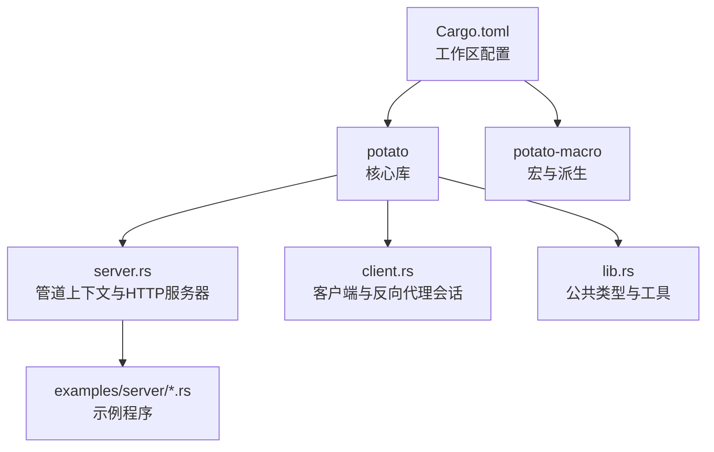
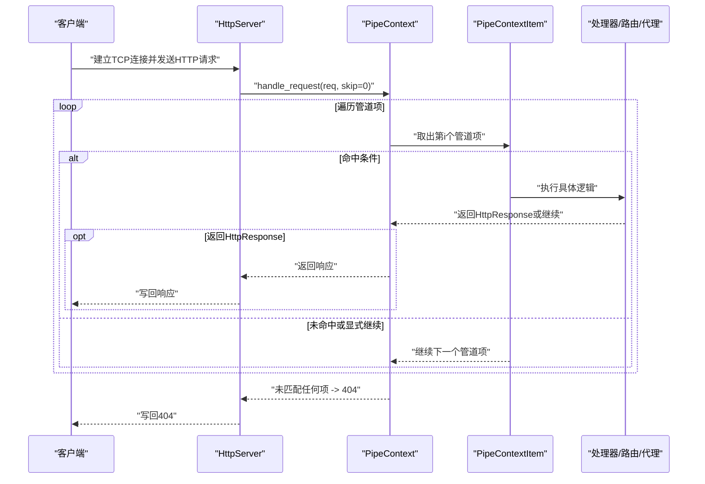
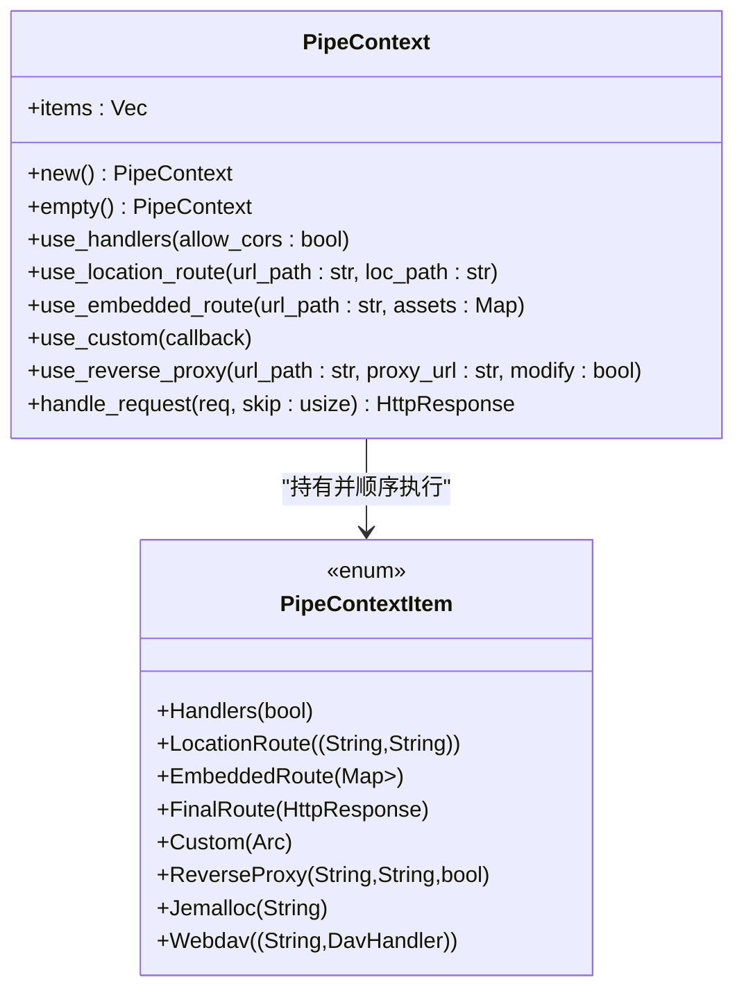
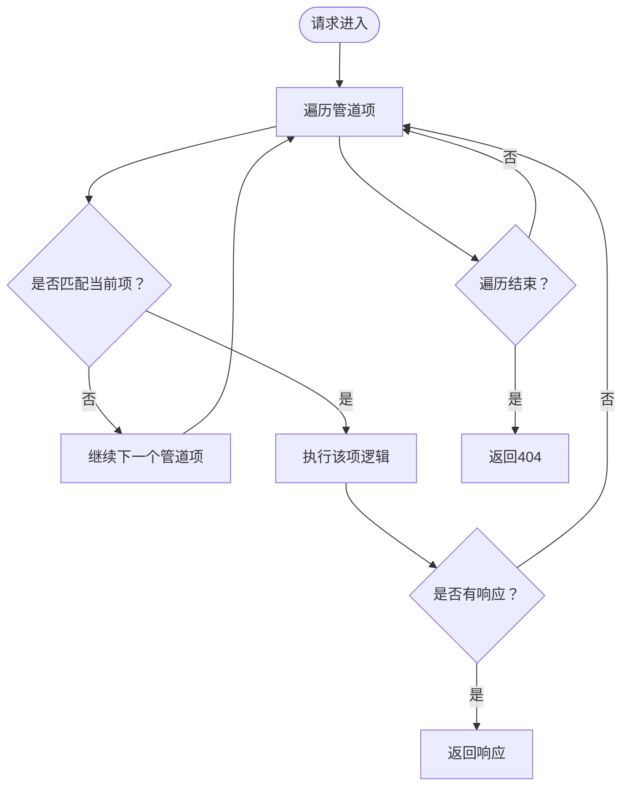
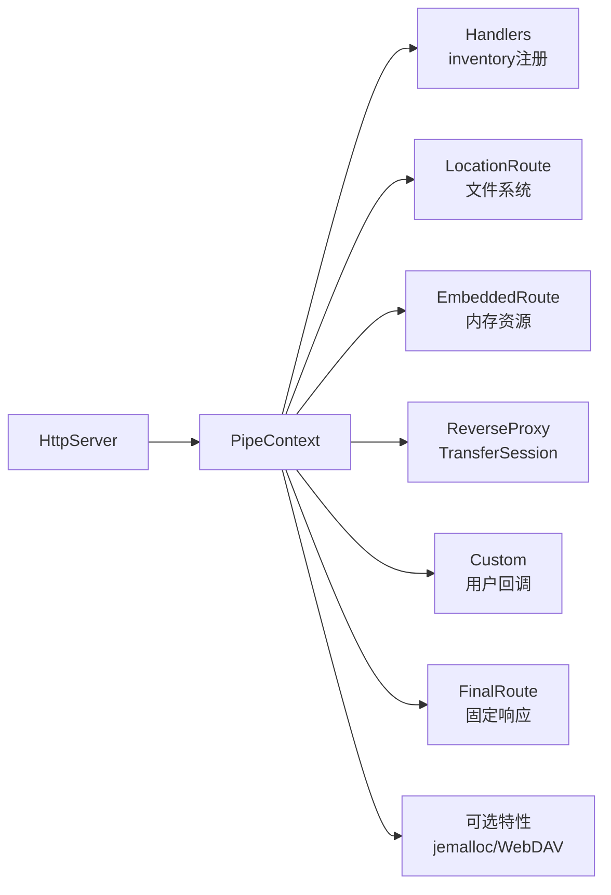

# 管道上下文

<cite>
**本文引用的文件**
- [lib.rs](file://potato/src/lib.rs)
- [server.rs](file://potato/src/server.rs)
- [client.rs](file://potato/src/client.rs)
- [00_http_server.rs](file://examples/server/00_http_server.rs)
- [05_location_route_server.rs](file://examples/server/05_location_route_server.rs)
- [06_embed_route_server.rs](file://examples/server/06_embed_route_server.rs)
- [12_custom_server.rs](file://examples/server/12_custom_server.rs)
- [13_reverse_proxy_server.rs](file://examples/server/13_reverse_proxy_server.rs)
- [Cargo.toml](file://Cargo.toml)
</cite>

## 目录
1. [简介](#简介)
2. [项目结构](#项目结构)
3. [核心组件](#核心组件)
4. [架构总览](#架构总览)
5. [详细组件分析](#详细组件分析)
6. [依赖关系分析](#依赖关系分析)
7. [性能考量](#性能考量)
8. [故障排除指南](#故障排除指南)
9. [结论](#结论)
10. [附录](#附录)

## 简介
本文件系统性阐述 Potato 的管道上下文（PipeContext）体系，覆盖其架构设计、执行顺序与优先级机制、各类管道项类型（处理器、位置路由、嵌入式路由、反向代理、自定义处理器等）的工作原理与用途，并给出匹配规则、执行流程、配置与扩展方式、性能优化策略、调试与排障方法以及典型使用场景与最佳实践。

## 项目结构
- 核心库位于 potato 模块，包含服务端、客户端、工具与宏等。
- 示例位于 examples/server 下，演示了多种管道项的组合使用方式。
- 工作区由两个成员模块组成：potato 与 potato-macro。

**图表来源**
- [Cargo.toml](file://Cargo.toml#L1-L4)
- [server.rs](file://potato/src/server.rs#L1-L50)
- [client.rs](file://potato/src/client.rs#L1-L30)
- [lib.rs](file://potato/src/lib.rs#L1-L30)

**章节来源**
- [Cargo.toml](file://Cargo.toml#L1-L4)

## 核心组件
- 管道上下文 PipeContext：以有序列表承载多个管道项，按顺序依次尝试匹配与执行。
- 管道项 PipeContextItem：统一的执行单元抽象，包含处理器、位置路由、嵌入式路由、反向代理、自定义处理器、最终响应、以及可选特性项（如 jemalloc、WebDAV）。
- HTTP 服务器 HttpServer：接收连接、解析请求、调用 PipeContext 执行请求处理。
- 反向代理会话 TransferSession：封装反向代理的请求转发与内容修改逻辑。

**章节来源**
- [server.rs](file://potato/src/server.rs#L40-L131)
- [server.rs](file://potato/src/server.rs#L362-L767)
- [client.rs](file://potato/src/client.rs#L232-L473)

## 架构总览
管道系统采用“请求逐项匹配”的顺序执行模型：每个请求从第一个管道项开始，依次尝试匹配当前项的条件；若命中则执行该项逻辑并返回响应；若未命中或显式继续，则进入下一项。该模型天然支持优先级控制：靠前的管道项具有更高的优先级。

**图表来源**
- [server.rs](file://potato/src/server.rs#L826-L871)
- [server.rs](file://potato/src/server.rs#L362-L767)

## 详细组件分析

### 管道项类型与职责
- 处理器（Handlers）
  - 功能：根据请求的 URL 路径与方法查找已注册的处理器函数并调用。
  - 匹配规则：先查路径映射表，再按方法匹配；若无匹配且为 HEAD/OPTIONS 则返回空体或允许头；否则继续下一个管道项。
  - 优先级：默认存在，通常作为首要检查点。
- 位置路由（LocationRoute）
  - 功能：将请求路径前缀映射到本地文件系统目录，支持静态文件与目录索引页（index.htm/html）。
  - 匹配规则：要求请求路径以配置的 URL 前缀开头；计算目标物理路径并进行安全校验（防止越界访问）；命中后执行预检（ETag/条件请求）并返回文件内容。
- 嵌入式路由（EmbeddedRoute）
  - 功能：将资源打包进二进制，通过内存文件形式对外提供静态内容。
  - 匹配规则：按请求路径精确匹配嵌入资源键；命中后执行预检并返回内存文件。
- 反向代理（ReverseProxy）
  - 功能：将匹配到的请求转发至目标地址，可选择修改响应内容（如替换链接）。
  - 匹配规则：请求路径需以配置前缀开头；构造目标主机/端口/协议；转发请求并返回响应。
- 自定义处理器（Custom）
  - 功能：允许注入任意异步回调，返回自定义响应或继续后续管道项。
  - 匹配规则：只要回调返回 Some(响应)，即刻返回；返回 None 则继续；异常则转为错误响应。
- 最终响应（FinalRoute）
  - 功能：直接返回预设的 HttpResponse，常用于兜底或强制返回固定响应。
- 可选特性项
  - jemalloc：导出内存分析数据。
  - WebDAV：提供 WebDAV 协议处理能力。

**图表来源**
- [server.rs](file://potato/src/server.rs#L40-L131)
- [server.rs](file://potato/src/server.rs#L362-L767)

**章节来源**
- [server.rs](file://potato/src/server.rs#L40-L131)
- [server.rs](file://potato/src/server.rs#L362-L767)

### 执行顺序与优先级机制
- 顺序执行：管道项按插入顺序依次尝试匹配。
- 优先级控制：将更具体的项（如反向代理、位置路由）置于更靠前的位置，以获得更高优先级。
- 继续与短路：当某项返回响应时立即短路；当某项返回继续时进入下一项。
- CORS 控制：处理器项支持可选的跨域头设置，影响 OPTIONS 预检响应。

**章节来源**
- [server.rs](file://potato/src/server.rs#L362-L767)

### 匹配规则与执行流程
- URL 路径匹配
  - 前缀匹配：位置路由与反向代理均基于请求路径前缀判断。
  - 精确匹配：嵌入式路由基于请求路径精确匹配资源键。
- 条件判断
  - 方法匹配：处理器项按 HTTP 方法匹配。
  - 安全校验：位置路由对目标路径进行规范化与越界检查。
  - 预检条件：所有静态/内存文件项均执行条件请求（If-None-Match/If-Modified-Since）判定。
- 结果传递
  - 返回响应：立即终止并写回。
  - 继续：跳过当前项，尝试下一项。
  - 异常：转换为错误响应。

**图表来源**
- [server.rs](file://potato/src/server.rs#L362-L767)

**章节来源**
- [server.rs](file://potato/src/server.rs#L362-L767)

### 各类管道项详解

#### 处理器（Handlers）
- 作用：将请求路由到通过注解注册的业务处理器。
- 关键点：支持 OPTIONS 预检与可选 CORS 头；HEAD 请求直接返回空体。
- 适用场景：REST 接口、API 路由。

**章节来源**
- [server.rs](file://potato/src/server.rs#L362-L406)
- [00_http_server.rs](file://examples/server/00_http_server.rs#L1-L12)

#### 位置路由（LocationRoute）
- 作用：将 URL 前缀映射到本地文件系统路径，提供静态文件与目录索引页。
- 关键点：安全校验防止路径穿越；支持条件请求（ETag/304）。
- 适用场景：静态站点、资源目录。

**章节来源**
- [server.rs](file://potato/src/server.rs#L408-L567)
- [05_location_route_server.rs](file://examples/server/05_location_route_server.rs#L1-L11)

#### 嵌入式路由（EmbeddedRoute）
- 作用：将资源打包进二进制，按路径提供内存文件。
- 关键点：精确路径匹配；条件请求（ETag/304）。
- 适用场景：无需外部文件、单体部署。

**章节来源**
- [server.rs](file://potato/src/server.rs#L569-L607)
- [06_embed_route_server.rs](file://examples/server/06_embed_route_server.rs#L1-L11)

#### 反向代理（ReverseProxy）
- 作用：将匹配的请求转发到目标地址，可选修改响应内容。
- 关键点：支持 WebSocket；可剥离/拼接路径前缀；可替换响应中的链接。
- 适用场景：微服务网关、API 聚合、开发联调。

**章节来源**
- [server.rs](file://potato/src/server.rs#L615-L627)
- [client.rs](file://potato/src/client.rs#L232-L473)
- [13_reverse_proxy_server.rs](file://examples/server/13_reverse_proxy_server.rs#L1-L10)

#### 自定义处理器（Custom）
- 作用：注入任意异步逻辑，灵活扩展管道行为。
- 关键点：返回 Some(响应) 立即短路；返回 None 继续；异常转错误响应。
- 适用场景：鉴权前置、日志记录、A/B 实验分流。

**章节来源**
- [server.rs](file://potato/src/server.rs#L610-L614)
- [12_custom_server.rs](file://examples/server/12_custom_server.rs#L1-L17)

#### 最终响应（FinalRoute）
- 作用：兜底返回固定响应。
- 适用场景：维护模式、健康检查、测试桩。

**章节来源**
- [server.rs](file://potato/src/server.rs#L609)

### 配置与扩展方法
- 新建管道上下文
  - 使用 PipeContext::new() 获取默认上下文（内置处理器项）。
  - 使用 PipeContext::empty() 获取空上下文，完全自定义。
- 添加管道项
  - use_handlers(allow_cors)：启用处理器项。
  - use_location_route(url_path, loc_path)：添加位置路由。
  - use_embedded_route(url_path, assets)：添加嵌入式路由。
  - use_reverse_proxy(url_path, proxy_url, modify_content)：添加反向代理。
  - use_custom(callback)：添加自定义处理器。
  - 可选：use_openapi(url_path)、use_webdav_*、use_jemalloc 等特性项。
- 修改现有管道项
  - 通过重新构建 PipeContext 并调用 configure 设置新的上下文。
  - 注意：新上下文会替换旧上下文，确保顺序与条件符合预期。

**章节来源**
- [server.rs](file://potato/src/server.rs#L58-L131)
- [server.rs](file://potato/src/server.rs#L784-L788)

## 依赖关系分析
- PipeContext 依赖于若干外部能力：
  - 处理器项依赖 inventory 收集的 RequestHandlerFlag 注册表。
  - 位置路由与嵌入式路由依赖文件系统与内存资源。
  - 反向代理依赖 TransferSession 与底层网络栈。
  - 可选特性（jemalloc、WebDAV）受编译特性开关控制。
- 服务器层负责将请求交给 PipeContext 执行，并根据连接状态决定是否复用连接。

**图表来源**
- [server.rs](file://potato/src/server.rs#L28-L38)
- [server.rs](file://potato/src/server.rs#L40-L131)
- [server.rs](file://potato/src/server.rs#L362-L767)

**章节来源**
- [server.rs](file://potato/src/server.rs#L28-L38)
- [server.rs](file://potato/src/server.rs#L40-L131)
- [server.rs](file://potato/src/server.rs#L362-L767)

## 性能考量
- 执行顺序与短路
  - 将高命中率、低成本的项置于前部，减少后续项的匹配开销。
  - 使用 FinalRoute 或 Custom 快速短路常见分支。
- 静态资源与条件请求
  - 利用 ETag/304 降低带宽与磁盘 IO；嵌入式路由同样支持条件请求。
- 反向代理
  - 合理设置 modify_content，避免不必要的内容重写。
  - 对 WebSocket 请求保持直连，减少中间层处理。
- 连接复用
  - Keep-Alive 连接可减少握手开销；注意在长连接场景下的资源释放。
- 内存与压缩
  - 嵌入式路由与静态文件应尽量启用合适的压缩与缓存策略。

[本节为通用指导，不直接分析具体文件]

## 故障排除指南
- 404 未找到
  - 检查管道项顺序与前缀匹配是否正确。
  - 确认路径大小写与尾随斜杠的一致性。
- CORS 问题
  - 确保处理器项启用了 allow_cors，或在自定义处理器中手动添加允许头。
- 条件请求未生效
  - 确认客户端发送了 If-None-Match/If-Modified-Since。
  - 检查服务端生成的 ETag 是否正确。
- 反向代理异常
  - 检查目标地址可达性与协议一致性（http/https）。
  - 对于 WebSocket，确认代理链路支持升级。
- 路径越界
  - 位置路由会对目标路径进行规范化与越界检查，若报错请修正映射路径。

**章节来源**
- [server.rs](file://potato/src/server.rs#L408-L567)
- [server.rs](file://potato/src/server.rs#L615-L627)

## 结论
Potato 的管道上下文以简洁的顺序执行模型实现了高度可扩展的请求处理框架。通过明确的匹配规则与优先级控制，开发者可以灵活地组织处理器、静态资源、反向代理与自定义逻辑，满足从简单 API 到复杂网关的多样化需求。配合条件请求、连接复用与特性开关，可在保证易用性的同时兼顾性能与可维护性。

[本节为总结性内容，不直接分析具体文件]

## 附录

### 使用示例与最佳实践
- 示例一：仅启用处理器
  - 在示例中通过注解声明接口，启动服务器即可直接访问。
  - 适合快速搭建 REST API。
- 示例二：静态站点
  - 使用位置路由映射根路径到本地目录，自动支持 index.htm/html 与条件请求。
- 示例三：嵌入式资源
  - 将前端产物打包进二进制，通过嵌入式路由提供，便于单体部署。
- 示例四：反向代理
  - 将特定前缀的请求转发到后端服务，可选修改响应内容以适配路径前缀。
- 示例五：自定义处理器
  - 在处理器之前插入鉴权或日志逻辑，利用返回 Some(响应) 快速短路。

**章节来源**
- [00_http_server.rs](file://examples/server/00_http_server.rs#L1-L12)
- [05_location_route_server.rs](file://examples/server/05_location_route_server.rs#L1-L11)
- [06_embed_route_server.rs](file://examples/server/06_embed_route_server.rs#L1-L11)
- [12_custom_server.rs](file://examples/server/12_custom_server.rs#L1-L17)
- [13_reverse_proxy_server.rs](file://examples/server/13_reverse_proxy_server.rs#L1-L10)