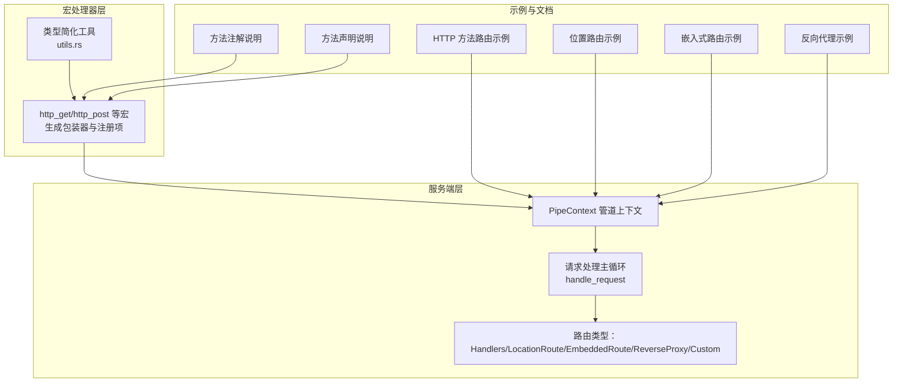
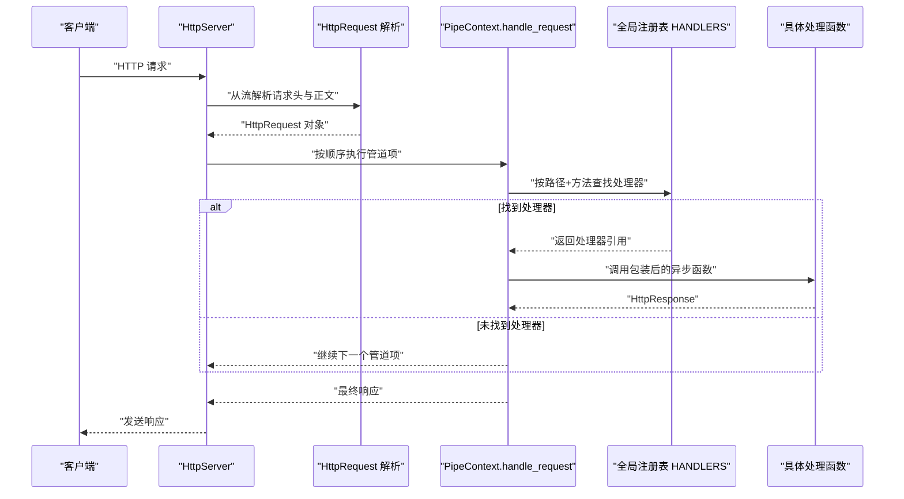
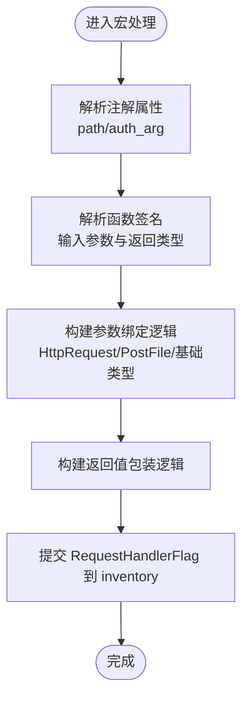
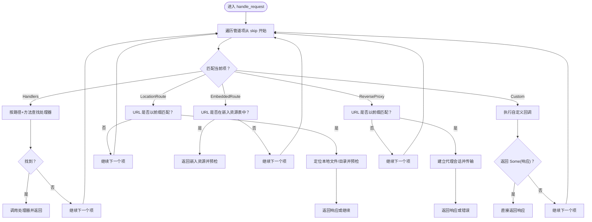
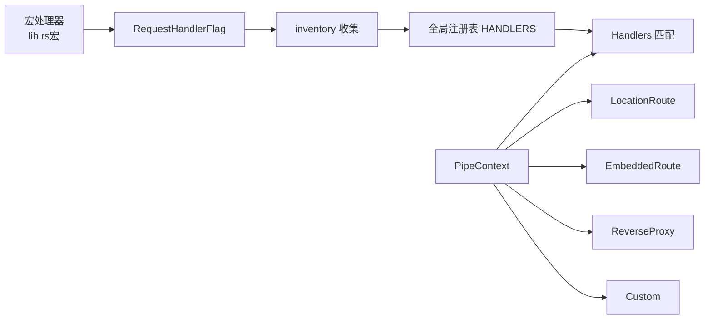

# 路由系统

<cite>
**本文引用的文件**
- [lib.rs](file://potato/src/lib.rs)
- [server.rs](file://potato/src/server.rs)
- [lib.rs（宏）](file://potato-macro/src/lib.rs)
- [utils.rs（宏）](file://potato-macro/src/utils.rs)
- [04_http_method_server.rs](file://examples/server/04_http_method_server.rs)
- [05_location_route_server.rs](file://examples/server/05_location_route_server.rs)
- [06_embed_route_server.rs](file://examples/server/06_embed_route_server.rs)
- [13_reverse_proxy_server.rs](file://examples/server/13_reverse_proxy_server.rs)
- [03_handler_args_server.rs](file://examples/server/03_handler_args_server.rs)
- [07_auth_server.rs](file://examples/server/07_auth_server.rs)
- [02_method_annotation.md](file://docs/guide/02_method_annotation.md)
- [03_method_declare.md](file://docs/guide/03_method_declare.md)
</cite>

## 目录
1. [简介](#简介)
2. [项目结构](#项目结构)
3. [核心组件](#核心组件)
4. [架构总览](#架构总览)
5. [详细组件分析](#详细组件分析)
6. [依赖关系分析](#依赖关系分析)
7. [性能考量](#性能考量)
8. [故障排查指南](#故障排查指南)
9. [结论](#结论)
10. [附录](#附录)

## 简介
本文件系统性阐述 Potato 的路由体系与运行机制，重点覆盖：
- 基于宏的路由声明机制（http_get、http_post 等），以及参数绑定与类型转换
- PipeContext 管道执行顺序与条件匹配
- 多种路由类型：基于 HTTP 方法的路由、基于 URL 的位置路由、嵌入式资源路由、反向代理路由
- 动态参数提取与类型转换机制
- 路由优先级与冲突解决策略
- 调试技巧与性能优化建议
- 实际配置示例与常见使用场景

## 项目结构
Potato 将路由系统分为三层：
- 宏处理器层：负责解析注解、生成包装器、注册到全局表
- 服务端层：负责请求解析、管道执行、路由分发
- 示例与文档：演示不同路由类型的使用方式与最佳实践

图表来源
- [lib.rs（宏）](file://potato-macro/src/lib.rs#L1-L399)
- [utils.rs（宏）](file://potato-macro/src/utils.rs#L1-L18)
- [server.rs](file://potato/src/server.rs#L28-L126)
- [04_http_method_server.rs](file://examples/server/04_http_method_server.rs#L1-L42)
- [05_location_route_server.rs](file://examples/server/05_location_route_server.rs#L1-L11)
- [06_embed_route_server.rs](file://examples/server/06_embed_route_server.rs#L1-L11)
- [13_reverse_proxy_server.rs](file://examples/server/13_reverse_proxy_server.rs#L1-L10)
- [02_method_annotation.md](file://docs/guide/02_method_annotation.md#L1-L39)
- [03_method_declare.md](file://docs/guide/03_method_declare.md#L1-L53)

章节来源
- [lib.rs（宏）](file://potato-macro/src/lib.rs#L1-L399)
- [server.rs](file://potato/src/server.rs#L28-L126)

## 核心组件
- 宏处理器：解析 http_get/http_post 等注解，生成包装函数与注册项，并写入全局注册表
- 请求模型：HttpRequest 提供方法、路径、查询参数、头部、请求体等统一访问接口
- 管道上下文：PipeContext 维护路由项序列，按序匹配并执行
- 路由类型：Handlers、LocationRoute、EmbeddedRoute、ReverseProxy、Custom 等
- 全局注册表：inventory 收集 RequestHandlerFlag，按路径+方法索引

章节来源
- [lib.rs（宏）](file://potato-macro/src/lib.rs#L26-L300)
- [lib.rs](file://potato/src/lib.rs#L152-L175)
- [server.rs](file://potato/src/server.rs#L28-L56)

## 架构总览
下图展示了从请求进入、参数绑定、到路由分发的整体流程。

图表来源
- [server.rs](file://potato/src/server.rs#L362-L407)
- [lib.rs](file://potato/src/lib.rs#L152-L175)

## 详细组件分析

### 基于宏的路由声明机制
- 宏支持的注解：http_get、http_post、http_put、http_delete、http_options、http_head
- 注解参数：
  - path：必填，必须以斜杠开头
  - auth_arg：可选，指定鉴权参数名（仅支持 String 类型）
- 参数绑定规则：
  - HttpRequest 引用：直接注入请求对象
  - PostFile：从 multipart 表单中按字段名提取文件
  - 基础类型：优先从 body_pairs（application/json 或 x-www-form-urlencoded）取值；若无，则从 url_query 取值；缺失则返回错误
  - 非 String 类型：尝试解析并失败时返回类型转换错误
- 返回值支持：
  - ()、Result<(), E>、HttpResponse、Result<HttpResponse, E>
- 文档元数据：
  - 自动收集函数文档、参数类型与是否需要鉴权，用于 OpenAPI 导出

图表来源
- [lib.rs（宏）](file://potato-macro/src/lib.rs#L26-L300)
- [utils.rs（宏）](file://potato-macro/src/utils.rs#L5-L17)

章节来源
- [lib.rs（宏）](file://potato-macro/src/lib.rs#L26-L300)
- [utils.rs（宏）](file://potato-macro/src/utils.rs#L5-L17)
- [02_method_annotation.md](file://docs/guide/02_method_annotation.md#L1-L39)
- [03_method_declare.md](file://docs/guide/03_method_declare.md#L1-L53)

### PipeContext 工作原理与执行顺序
- 管道项类型：
  - Handlers：启用基于方法+路径的处理器查找
  - LocationRoute：将 URL 映射到本地文件系统路径
  - EmbeddedRoute：将 URL 映射到编译进二进制的静态资源
  - ReverseProxy：将匹配路径转发到上游服务
  - Custom：自定义回调，可返回响应或交由后续管道继续
  - FinalRoute：直接返回固定响应
- 匹配与优先级：
  - 按管道项顺序从前到后匹配
  - Handlers 作为默认兜底，若未命中则尝试 OPTIONS/HEAD 特殊处理
  - LocationRoute/EmbeddedRoute/ReverseProxy 采用前缀匹配
  - Custom 可短路返回，否则继续
- 条件匹配：
  - Handlers：按路径+方法精确匹配
  - LocationRoute/EmbeddedRoute：检查 URL 前缀
  - ReverseProxy：检查 URL 前缀并进行代理传输

图表来源
- [server.rs](file://potato/src/server.rs#L362-L627)

章节来源
- [server.rs](file://potato/src/server.rs#L40-L126)
- [server.rs](file://potato/src/server.rs#L362-L627)

### 路由类型详解

#### 基于 HTTP 方法的路由（Handlers）
- 通过宏注册，按路径+方法映射到具体处理函数
- 未命中时自动处理 HEAD/OPTIONS，必要时返回 CORS 头

章节来源
- [lib.rs（宏）](file://potato-macro/src/lib.rs#L302-L331)
- [server.rs](file://potato/src/server.rs#L370-L407)
- [04_http_method_server.rs](file://examples/server/04_http_method_server.rs#L1-L42)

#### 基于 URL 的位置路由（LocationRoute）
- 将 URL 前缀映射到本地文件系统路径
- 支持目录索引页（index.htm/html）回退
- 内置预检：ETag/If-None-Match/If-Modified-Since 等，命中则返回 304/412

章节来源
- [server.rs](file://potato/src/server.rs#L408-L568)
- [05_location_route_server.rs](file://examples/server/05_location_route_server.rs#L1-L11)

#### 嵌入式资源路由（EmbeddedRoute）
- 将 URL 前缀映射到编译进二进制的静态资源
- 自动生成 ETag 并进行预检，命中返回 304/412

章节来源
- [server.rs](file://potato/src/server.rs#L569-L627)
- [06_embed_route_server.rs](file://examples/server/06_embed_route_server.rs#L1-L11)

#### 反向代理路由（ReverseProxy）
- 将匹配前缀的请求转发至上游服务
- 可选内容改写（如替换链接）

章节来源
- [server.rs](file://potato/src/server.rs#L615-L627)
- [13_reverse_proxy_server.rs](file://examples/server/13_reverse_proxy_server.rs#L1-L10)

#### 自定义路由（Custom）
- 允许开发者插入自定义逻辑，可短路返回或继续传递

章节来源
- [server.rs](file://potato/src/server.rs#L102-L113)

### 动态参数提取与类型转换
- 参数来源：
  - HttpRequest：直接注入请求对象
  - PostFile：从 multipart 表单字段提取文件
  - 基础类型：优先从 JSON/表单键值对取值，其次从查询参数取值
- 类型转换：
  - 非 String 类型：尝试 parse，失败则返回类型转换错误
- 鉴权参数：
  - auth_arg 必须为 String，从 Authorization 头 Bearer 中提取并校验 JWT

章节来源
- [lib.rs（宏）](file://potato-macro/src/lib.rs#L106-L191)
- [03_handler_args_server.rs](file://examples/server/03_handler_args_server.rs#L1-L32)
- [07_auth_server.rs](file://examples/server/07_auth_server.rs#L1-L24)

### 路由优先级与冲突解决策略
- 管道项顺序即优先级：先匹配者先执行
- Handlers 作为默认兜底，未命中时尝试 OPTIONS/HEAD
- LocationRoute/EmbeddedRoute/ReverseProxy 采用前缀匹配，建议按“更具体前缀优先”的原则组织
- Custom 可用于短路返回，避免后续项执行
- 冲突解决建议：
  - 为不同路由类型设置明确的 URL 前缀分层
  - 使用 Custom 进行前置校验或快速返回
  - 对静态资源与动态路由采用不同前缀，避免互相覆盖

章节来源
- [server.rs](file://potato/src/server.rs#L362-L627)

## 依赖关系分析
- 宏处理器依赖 inventory 将 RequestHandlerFlag 收集到全局表
- 服务端层依赖全局表进行 Handlers 查找
- 各路由类型通过 PipeContext 组合，形成可插拔的处理链

图表来源
- [lib.rs（宏）](file://potato-macro/src/lib.rs#L290-L295)
- [lib.rs](file://potato/src/lib.rs#L175-L175)
- [server.rs](file://potato/src/server.rs#L28-L38)

章节来源
- [lib.rs（宏）](file://potato-macro/src/lib.rs#L290-L295)
- [lib.rs](file://potato/src/lib.rs#L175-L175)
- [server.rs](file://potato/src/server.rs#L28-L38)

## 性能考量
- 管道项顺序应尽量将高命中率的项前置，减少后续匹配成本
- 静态资源路由建议使用 EmbeddedRoute 并开启预检缓存（ETag）
- 反向代理建议仅对必要路径启用，避免不必要的网络往返
- 大体积上传建议结合 Custom 做限速与校验，防止内存压力
- 日志与调试在生产环境建议关闭或降级，避免 IO 影响

## 故障排查指南
- 参数缺失或类型不匹配：
  - 检查请求体 Content-Type 与参数来源（body_pairs vs url_query）
  - 确认非 String 类型可被正确 parse
- 鉴权失败：
  - 确认 Authorization 头格式为 Bearer
  - 确认 auth_arg 指向的参数名为 String
- 路由未命中：
  - 检查管道项顺序与前缀匹配
  - 确认 Handlers 是否已注册（宏是否生效）
- 静态资源 304/412：
  - 检查客户端 If-None-Match/If-Modified-Since 是否合理
- 反向代理异常：
  - 检查上游地址与路径前缀配置
  - 观察 modify_content 是否导致内容改写问题

章节来源
- [lib.rs（宏）](file://potato-macro/src/lib.rs#L120-L191)
- [server.rs](file://potato/src/server.rs#L440-L461)
- [server.rs](file://potato/src/server.rs#L586-L600)

## 结论
Potato 的路由系统以宏驱动的声明式方式简化了 HTTP 路由开发，配合 PipeContext 的管道化设计实现了灵活的路由组合与优先级控制。通过内置的参数绑定、类型转换与预检机制，开发者可以快速构建高性能、可维护的 HTTP 服务。建议在实际项目中遵循前缀分层、优先短路与预检缓存的原则，以获得更好的可扩展性与性能表现。

## 附录

### 实际配置示例与常见场景
- 基于 HTTP 方法的路由：参见示例文件
  - [04_http_method_server.rs](file://examples/server/04_http_method_server.rs#L1-L42)
- 基于 URL 的位置路由：参见示例文件
  - [05_location_route_server.rs](file://examples/server/05_location_route_server.rs#L1-L11)
- 嵌入式资源路由：参见示例文件
  - [06_embed_route_server.rs](file://examples/server/06_embed_route_server.rs#L1-L11)
- 反向代理路由：参见示例文件
  - [13_reverse_proxy_server.rs](file://examples/server/13_reverse_proxy_server.rs#L1-L10)
- 参数绑定与鉴权：参见示例文件
  - [03_handler_args_server.rs](file://examples/server/03_handler_args_server.rs#L1-L32)
  - [07_auth_server.rs](file://examples/server/07_auth_server.rs#L1-L24)

### 方法注解与声明参考
- 方法注解说明：参见文档
  - [02_method_annotation.md](file://docs/guide/02_method_annotation.md#L1-L39)
- 方法声明说明：参见文档
  - [03_method_declare.md](file://docs/guide/03_method_declare.md#L1-L53)