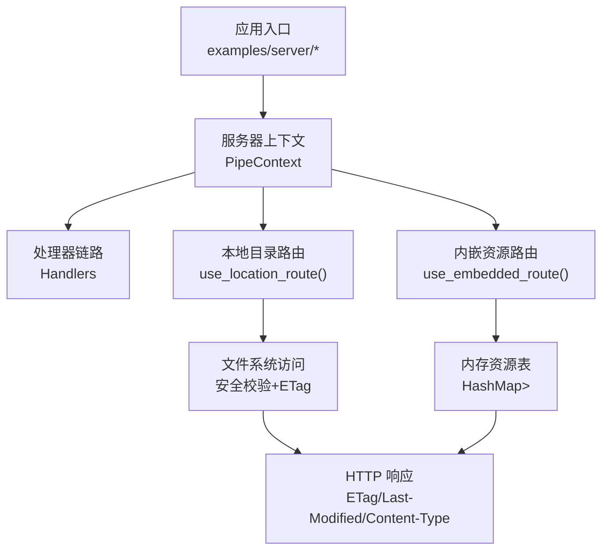
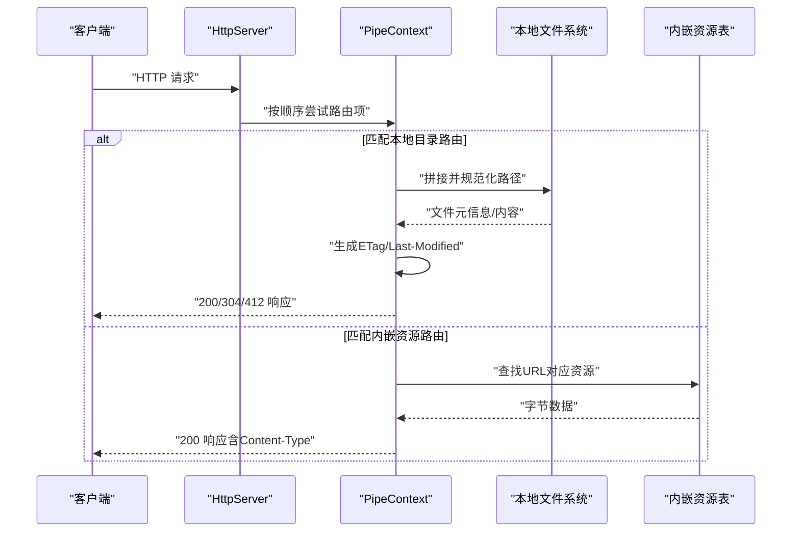
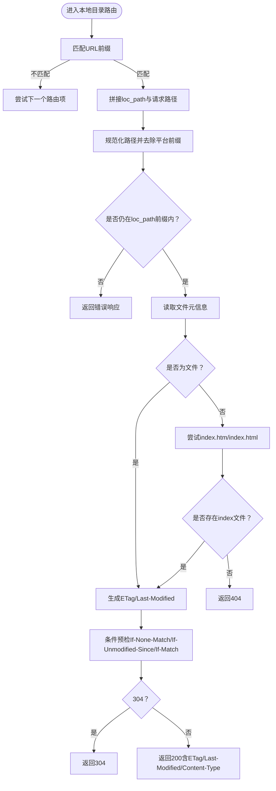
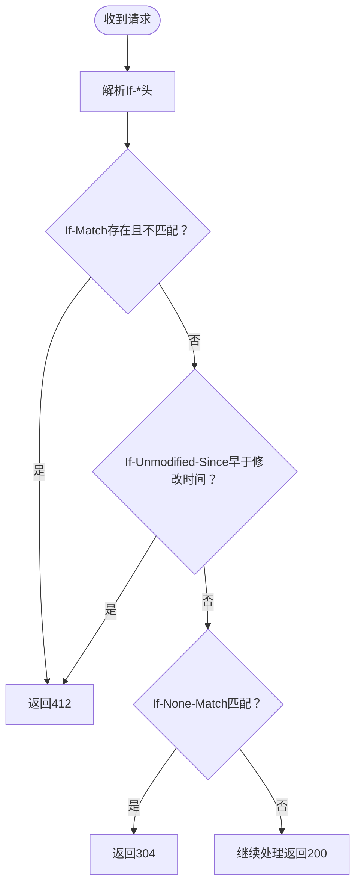
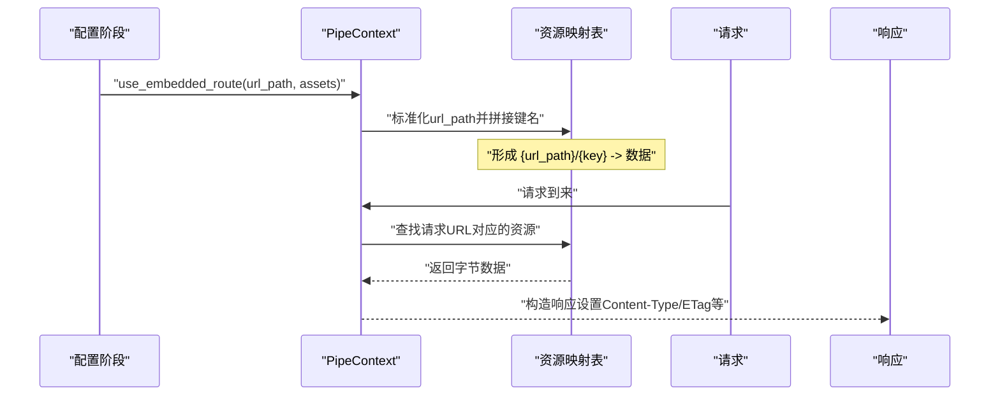
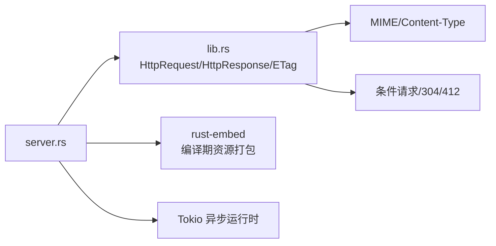

# 静态文件服务

<cite>
**本文引用的文件**
- [lib.rs](file://potato/src/lib.rs)
- [server.rs](file://potato/src/server.rs)
- [05_location_route_server.rs](file://examples/server/05_location_route_server.rs)
- [06_embed_route_server.rs](file://examples/server/06_embed_route_server.rs)
- [Cargo.toml（根）](file://Cargo.toml)
- [Cargo.toml（potato包）](file://potato/Cargo.toml)
- [04_server_route.md](file://docs/en/guide/04_server_route.md)
</cite>

## 目录
1. [简介](#简介)
2. [项目结构](#项目结构)
3. [核心组件](#核心组件)
4. [架构总览](#架构总览)
5. [组件详解](#组件详解)
6. [依赖关系分析](#依赖关系分析)
7. [性能与缓存策略](#性能与缓存策略)
8. [安全与合规](#安全与合规)
9. [故障排查](#故障排查)
10. [结论](#结论)
11. [附录：完整示例与最佳实践](#附录完整示例与最佳实践)

## 简介
本指南围绕 Potato 的静态文件服务能力展开，重点覆盖以下主题：
- use_location_route() 的工作原理：本地文件系统映射、路径安全校验（防止目录穿越）、ETag 生成与条件请求处理（304 Not Modified）。
- use_embedded_route() 的工作原理：内嵌资源打包、运行时内存管理与路由挂载。
- MIME 类型自动检测与 Content-Type 设置。
- 文件缓存策略与性能优化建议。
- 安全考量：路径遍历防护、文件访问权限控制。
- 完整静态网站托管示例与最佳实践。

## 项目结构
- 库入口与核心类型定义位于 potato/src/lib.rs，包含 HTTP 请求/响应模型、条件预检、ETag 生成等。
- 服务器管线与路由挂载逻辑位于 potato/src/server.rs，包含 use_location_route()、use_embedded_route() 等。
- 示例位于 examples/server，分别演示本地目录路由与内嵌资源路由。
- 文档位于 docs/en/guide/04_server_route.md，对路由配置进行说明。
- 依赖与特性开关在 Cargo.toml 中定义。

图表来源
- [server.rs](file://potato/src/server.rs#L54-L100)
- [lib.rs](file://potato/src/lib.rs#L970-L1040)

章节来源
- [Cargo.toml（根）](file://Cargo.toml#L1-L4)
- [Cargo.toml（potato包）](file://potato/Cargo.toml#L16-L76)
- [04_server_route.md](file://docs/en/guide/04_server_route.md#L1-L55)

## 核心组件
- PipeContext：负责串联多种路由与中间件（处理器、本地目录、内嵌资源、自定义回调等），形成请求处理管线。
- use_location_route(url_path, loc_path)：将 URL 前缀映射到本地文件系统路径，执行安全校验与条件请求处理。
- use_embedded_route(url_path, assets)：将编译期打包的资源表挂载到指定 URL 前缀下，支持运行时直接返回内存中的字节数据。
- HttpResponse.from_file/from_mem_file：从文件或内存构建响应，自动设置 ETag、Last-Modified、Content-Type 等。
- HttpRequest.check_precondition_headers：解析 If-* 条件头，返回 304 或 412 结果。

章节来源
- [server.rs](file://potato/src/server.rs#L54-L100)
- [lib.rs](file://potato/src/lib.rs#L970-L1040)
- [lib.rs](file://potato/src/lib.rs#L761-L823)

## 架构总览
静态文件服务通过“管线式”路由组合实现：
- 默认处理器链路优先匹配；
- 若未命中，则尝试本地目录路由；
- 再尝试内嵌资源路由；
- 最后可接入自定义处理或反向代理等扩展。

图表来源
- [server.rs](file://potato/src/server.rs#L77-L100)
- [server.rs](file://potato/src/server.rs#L414-L566)
- [server.rs](file://potato/src/server.rs#L569-L599)
- [lib.rs](file://potato/src/lib.rs#L970-L1040)

## 组件详解

### use_location_route() 使用与实现
- 功能概述
  - 将 URL 前缀映射到本地文件系统目录，实现静态文件托管。
  - 在访问前进行路径安全校验，防止目录穿越攻击。
  - 对文件生成 ETag 并支持条件请求，命中则返回 304。
- 关键流程
  - 路由注册：将 (url_path, loc_path) 作为路由项加入管线。
  - 请求处理：将请求 URL 与已注册的 url_path 前缀匹配；若匹配成功，拼接 loc_path 与请求路径段，规范化为绝对路径。
  - 安全校验：确保规范化后的路径仍以 loc_path 开头，否则拒绝访问。
  - 元信息与 ETag：读取文件元信息，生成 ETag（格式基于修改时间与大小），并设置 Last-Modified。
  - 条件请求：调用条件预检，若命中 304 则直接返回；否则返回 200 带内容。
- 安全要点
  - canonicalize 规范化路径，Windows 前缀兼容处理。
  - 严格前缀校验，禁止越权访问父级目录。
- 性能要点
  - 仅在命中文件时才读取文件内容；ETag 可显著减少带宽消耗。

图表来源
- [server.rs](file://potato/src/server.rs#L77-L81)
- [server.rs](file://potato/src/server.rs#L414-L566)
- [lib.rs](file://potato/src/lib.rs#L761-L823)
- [lib.rs](file://potato/src/lib.rs#L970-L1040)

章节来源
- [server.rs](file://potato/src/server.rs#L77-L81)
- [server.rs](file://potato/src/server.rs#L414-L566)
- [lib.rs](file://potato/src/lib.rs#L761-L823)
- [lib.rs](file://potato/src/lib.rs#L970-L1040)
- [05_location_route_server.rs](file://examples/server/05_location_route_server.rs#L1-L11)

### ETag 生成与条件请求处理
- ETag 生成
  - 基于文件最后修改时间（秒）与文件大小（字节）组合生成，格式为双引号包裹的十六进制字符串。
  - 同时设置 Last-Modified 头，遵循标准 HTTP 时间格式。
- 条件请求处理
  - If-None-Match：若与当前 ETag 匹配，返回 304 Not Modified。
  - If-Match：若存在且不匹配，返回 412 Precondition Failed。
  - If-Unmodified-Since：若资源在此时间之后被修改，返回 412。
  - If-Modified-Since：若资源未修改，返回 304。
- 返回码语义
  - 304：命中条件，无需传输内容。
  - 412：前置条件失败（如 ETag 不匹配或资源已更新）。
  - 200：正常返回内容。

图表来源
- [lib.rs](file://potato/src/lib.rs#L761-L823)

章节来源
- [lib.rs](file://potato/src/lib.rs#L761-L823)
- [lib.rs](file://potato/src/lib.rs#L970-L1040)

### use_embedded_route() 使用与实现
- 功能概述
  - 将编译期打包的资源表（HashMap<String, Cow<'static, [u8]>>）挂载到指定 URL 前缀下。
  - 运行时不依赖外部文件系统，直接从内存返回资源。
- 关键流程
  - 路由注册：将 url_path 标准化（去除末尾斜杠），并将 assets 中的每个键名拼接为 “{url_path}/{key}”，形成新的映射表。
  - 请求处理：根据请求 URL 在映射表中查找对应资源，命中即返回 200。
  - MIME 类型：根据文件扩展名自动设置 Content-Type；若为目录结尾则默认 HTML。
- 内存管理
  - 使用 Cow<'static, [u8]> 表示静态生命周期的数据，避免运行时复制与额外分配。
  - 通过 load_embed<T: Embed>() 收集资源，支持 index.html/index.htm 的父路径索引。

图表来源
- [server.rs](file://potato/src/server.rs#L83-L100)
- [lib.rs](file://potato/src/lib.rs#L1204-L1218)
- [lib.rs](file://potato/src/lib.rs#L970-L1040)

章节来源
- [server.rs](file://potato/src/server.rs#L83-L100)
- [lib.rs](file://potato/src/lib.rs#L1204-L1218)
- [lib.rs](file://potato/src/lib.rs#L970-L1040)
- [06_embed_route_server.rs](file://examples/server/06_embed_route_server.rs#L1-L11)

### MIME 类型自动检测与 Content-Type 设置
- 自动检测规则
  - 基于文件扩展名选择常见类型：CSS、CSV、HTML、JS、JSON、PDF、XML 等。
  - 若路径以斜杠结尾（目录），默认为 HTML。
  - 其他情况默认为二进制流。
- Content-Disposition
  - 当以下载模式返回时，会设置 Content-Disposition 以提示浏览器保存文件名。

章节来源
- [lib.rs](file://potato/src/lib.rs#L1012-L1036)

## 依赖关系分析
- 依赖与特性
  - 编译期资源打包依赖 rust-embed。
  - TLS 特性可选，默认启用 openapi/tls。
  - jemalloc 相关特性可选，用于内存统计与分析。
- 模块耦合
  - server.rs 依赖 lib.rs 中的 HttpRequest/HttpResponse、ETag/条件请求逻辑。
  - use_location_route/use_embedded_route 通过 PipeContextItem 组合在管线中。

图表来源
- [Cargo.toml（potato包）](file://potato/Cargo.toml#L16-L76)
- [server.rs](file://potato/src/server.rs#L1-L26)
- [lib.rs](file://potato/src/lib.rs#L25-L43)

章节来源
- [Cargo.toml（potato包）](file://potato/Cargo.toml#L16-L76)
- [server.rs](file://potato/src/server.rs#L1-L26)
- [lib.rs](file://potato/src/lib.rs#L25-L43)

## 性能与缓存策略
- ETag 与 304 命中
  - 通过 ETag 与 If-None-Match/If-Unmodified-Since 实现强缓存与条件请求，显著降低带宽与 CPU。
- 压缩与传输
  - HttpResponse 支持 gzip 压缩（当内容长度足够且未被显式设置编码时），可进一步降低传输体积。
- 内存驻留
  - 内嵌资源使用 Cow<'static, [u8]>，避免重复拷贝；适合小中型静态站点。
- I/O 优化
  - 本地目录路由仅在命中文件时读取，目录索引（index.htm/html）优先返回，减少磁盘扫描。
- 建议
  - 对频繁变更的资源，合理设置缓存策略与刷新频率。
  - 对大文件优先采用内嵌资源或 CDN 分发，结合 ETag 与压缩提升体验。

章节来源
- [lib.rs](file://potato/src/lib.rs#L1068-L1100)
- [lib.rs](file://potato/src/lib.rs#L970-L1040)

## 安全与合规
- 路径遍历防护
  - 规范化路径并强制前缀校验，确保访问受限在指定 loc_path 下，有效阻止 ../ 路径穿越。
- 权限控制
  - 通过操作系统文件权限控制实际可读性；建议仅授予最小必要权限给静态资源目录。
- 输入校验
  - 对 URL 路径进行规范化与白名单式前缀匹配，避免恶意路径注入。
- 证书与传输
  - 生产环境建议启用 TLS，避免明文传输敏感资源。

章节来源
- [server.rs](file://potato/src/server.rs#L414-L422)
- [Cargo.toml（potato包）](file://potato/Cargo.toml#L65-L72)

## 故障排查
- 访问报错“url path over directory”
  - 可能原因：请求路径经过规范化后超出了 loc_path 前缀范围。
  - 排查步骤：确认 url_path 与 loc_path 的映射关系，检查路径拼接与规范化逻辑。
- 304 未按预期触发
  - 可能原因：客户端未正确传递 If-None-Match/If-Modified-Since，或 ETag 生成异常。
  - 排查步骤：检查 ETag 生成与条件头解析逻辑，确认 Last-Modified 是否正确。
- 内嵌资源 404
  - 可能原因：URL 与映射表键名不一致，或未正确使用 embed_dir! 宏。
  - 排查步骤：核对 use_embedded_route 的 url_path 与资源键名拼接规则。

章节来源
- [server.rs](file://potato/src/server.rs#L414-L422)
- [lib.rs](file://potato/src/lib.rs#L761-L823)
- [server.rs](file://potato/src/server.rs#L569-L599)

## 结论
- use_location_route() 提供安全可靠的本地静态文件托管能力，配合 ETag 与条件请求显著提升缓存效率。
- use_embedded_route() 将资源编译入二进制，适合小型静态站点与快速部署场景。
- 通过 MIME 自动检测与合理的缓存策略，可在保证用户体验的同时降低带宽与服务器负载。
- 安全方面，路径规范化与前缀校验是抵御目录穿越的关键；生产环境务必启用 TLS 并限制文件系统权限。

## 附录：完整示例与最佳实践
- 本地目录托管示例
  - 使用 examples/server/05_location_route_server.rs 展示如何将 / 映射到 /wwwroot，并启动 HTTP 服务。
  - 最佳实践：将静态资源置于独立目录，仅开放只读权限；为常用资源设置较长缓存周期。
- 内嵌资源托管示例
  - 使用 examples/server/06_embed_route_server.rs 展示如何将 embed_dir!("assets/wwwroot") 内容挂载到 /。
  - 最佳实践：将资源目录放入项目内，使用 embed_dir! 宏在编译期打包；对大文件考虑 CDN 或分发压缩版本。
- 文档参考
  - docs/en/guide/04_server_route.md 对 use_location_route 与 use_embedded_route 的配置进行了说明。

章节来源
- [05_location_route_server.rs](file://examples/server/05_location_route_server.rs#L1-L11)
- [06_embed_route_server.rs](file://examples/server/06_embed_route_server.rs#L1-L11)
- [04_server_route.md](file://docs/en/guide/04_server_route.md#L29-L55)