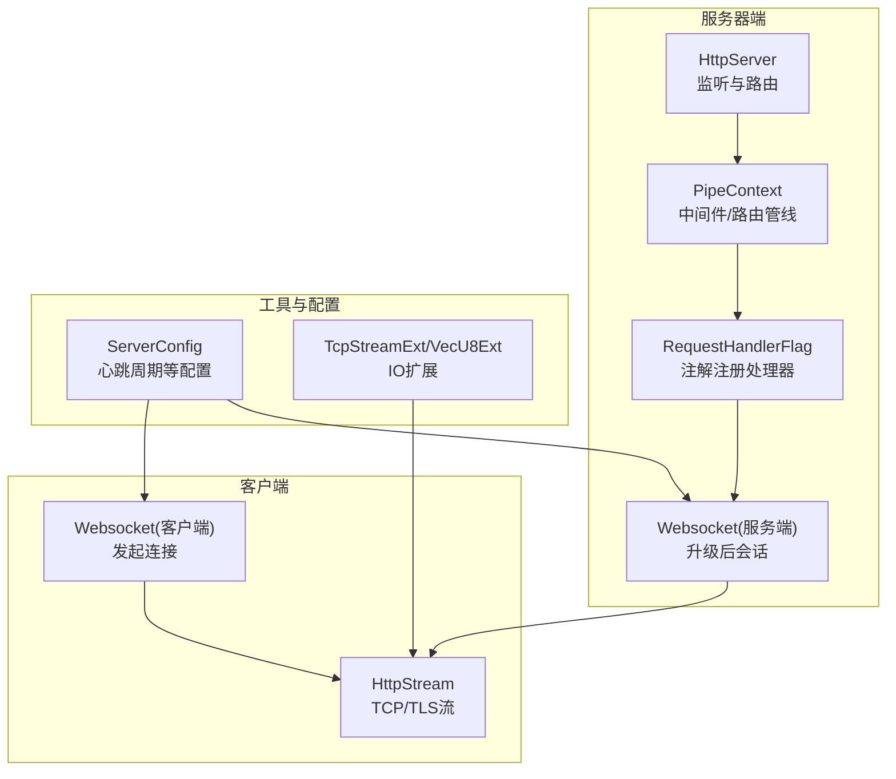
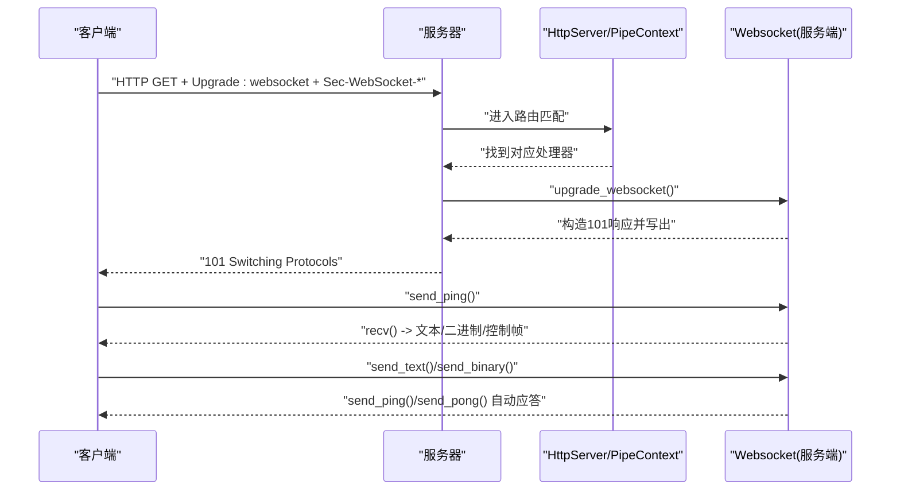
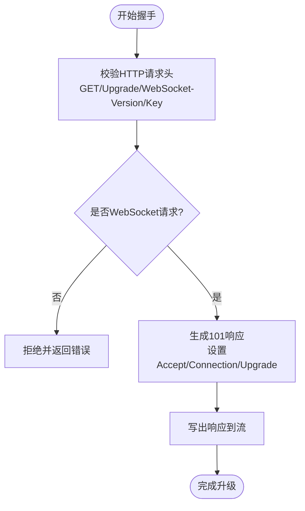
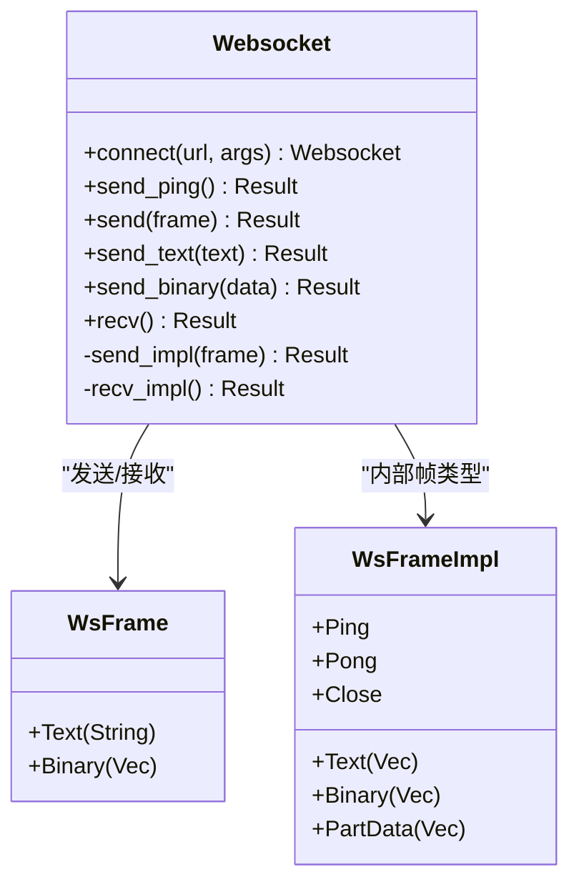
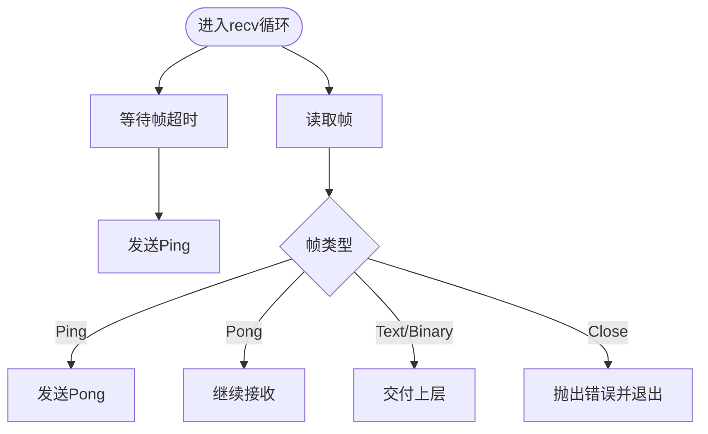
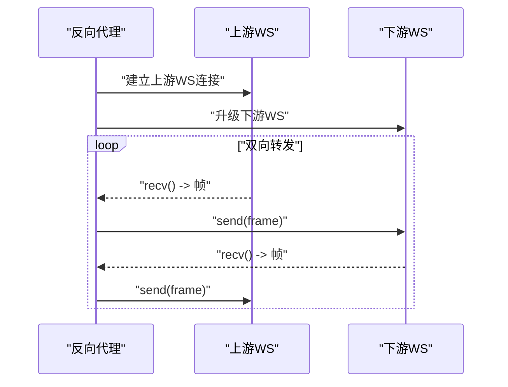
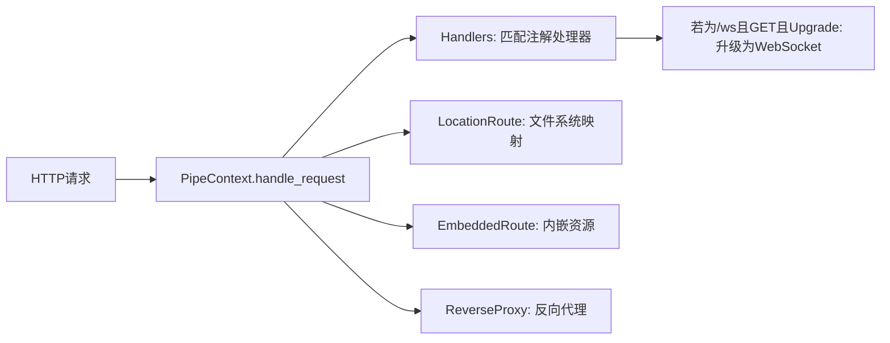
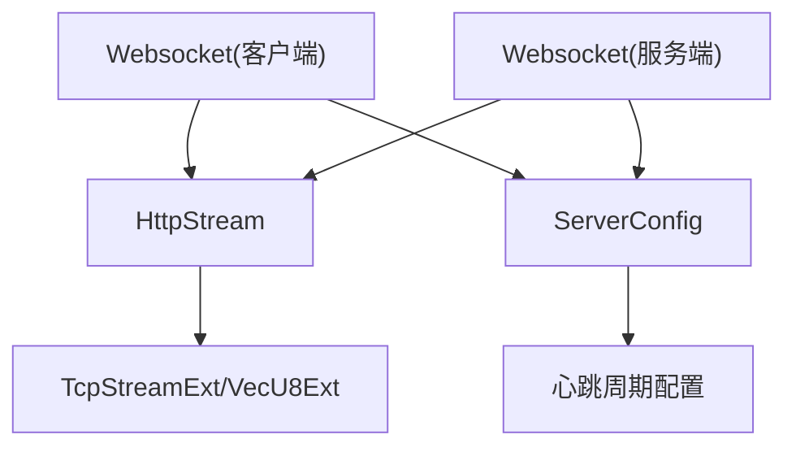

# WebSocket支持

<cite>
**本文引用的文件列表**
- [examples/server/08_websocket_server.rs](file://examples/server/08_websocket_server.rs)
- [examples/client/03_websocket_client.rs](file://examples/client/03_websocket_client.rs)
- [potato/src/lib.rs](file://potato/src/lib.rs)
- [potato/src/server.rs](file://potato/src/server.rs)
- [potato/src/client.rs](file://potato/src/client.rs)
- [potato/src/utils/tcp_stream.rs](file://potato/src/utils/tcp_stream.rs)
- [potato/src/global_config.rs](file://potato/src/global_config.rs)
- [potato/Cargo.toml](file://potato/Cargo.toml)
</cite>

## 目录
1. [简介](#简介)
2. [项目结构](#项目结构)
3. [核心组件](#核心组件)
4. [架构总览](#架构总览)
5. [详细组件分析](#详细组件分析)
6. [依赖关系分析](#依赖关系分析)
7. [性能考虑](#性能考虑)
8. [故障排查指南](#故障排查指南)
9. [结论](#结论)
10. [附录](#附录)

## 简介
本指南围绕Potato库中的WebSocket能力，系统讲解从握手升级到消息收发、心跳检测、连接状态管理、错误处理与异常恢复，以及与HTTP服务器的集成（路由匹配与中间件应用）。同时给出服务器与客户端的完整实现示例，并总结实时通信应用的最佳实践、性能优化与并发连接管理策略。

## 项目结构
与WebSocket相关的代码主要分布在以下模块：
- 服务器端：HTTP路由与请求处理、WebSocket升级、反向代理中转WebSocket
- 客户端：WebSocket连接、帧解析与发送、心跳控制
- 工具层：通用TCP/TLS流封装，用于底层读写
- 配置层：心跳周期等全局参数

图表来源
- [potato/src/server.rs](file://potato/src/server.rs#L28-L767)
- [potato/src/lib.rs](file://potato/src/lib.rs#L203-L374)
- [potato/src/utils/tcp_stream.rs](file://potato/src/utils/tcp_stream.rs#L11-L73)
- [potato/src/global_config.rs](file://potato/src/global_config.rs#L7-L35)

章节来源
- [potato/src/server.rs](file://potato/src/server.rs#L28-L767)
- [potato/src/lib.rs](file://potato/src/lib.rs#L203-L374)
- [potato/src/utils/tcp_stream.rs](file://potato/src/utils/tcp_stream.rs#L11-L73)
- [potato/src/global_config.rs](file://potato/src/global_config.rs#L7-L35)

## 核心组件
- Websocket(客户端)：负责发起WebSocket连接、解析帧、发送文本/二进制、心跳Ping/Pong。
- Websocket(服务端)：在HTTP请求满足WebSocket条件时进行升级，返回101切换协议，之后以帧为单位收发。
- HttpServer/PipeContext：HTTP服务器与中间件管线，负责路由匹配、处理器分发、静态资源、嵌入资源、反向代理等。
- HttpStream：统一的TCP/TLS流抽象，提供异步读写接口。
- ServerConfig：提供心跳周期等全局配置项。

章节来源
- [potato/src/lib.rs](file://potato/src/lib.rs#L203-L374)
- [potato/src/server.rs](file://potato/src/server.rs#L28-L767)
- [potato/src/utils/tcp_stream.rs](file://potato/src/utils/tcp_stream.rs#L11-L73)
- [potato/src/global_config.rs](file://potato/src/global_config.rs#L7-L35)

## 架构总览
WebSocket在Potato中的工作流程：
- 客户端通过HTTP GET请求携带升级头发起握手；服务端校验请求头后返回101切换协议响应。
- 升级成功后，双方以WebSocket帧为单位进行双向通信。
- 心跳采用Ping/Pong机制，客户端和服务端均支持定时发送Ping并在超时未收到响应时触发重连或关闭。

图表来源
- [examples/server/08_websocket_server.rs](file://examples/server/08_websocket_server.rs#L25-L35)
- [potato/src/lib.rs](file://potato/src/lib.rs#L560-L579)
- [potato/src/server.rs](file://potato/src/server.rs#L362-L407)

## 详细组件分析

### WebSocket握手与升级机制
- 握手条件：方法必须为GET，Connection为Upgrade，Upgrade为websocket，Sec-WebSocket-Version为13，且存在有效的Sec-WebSocket-Key。
- 升级响应：服务端根据Sec-WebSocket-Key计算Accept值并返回101 Switching Protocols，同时设置Connection和Upgrade头。
- 客户端握手：客户端发起GET请求并检查返回码是否为101，随后进入WebSocket会话。

图表来源
- [potato/src/lib.rs](file://potato/src/lib.rs#L532-L558)
- [potato/src/lib.rs](file://potato/src/lib.rs#L1042-L1066)

章节来源
- [potato/src/lib.rs](file://potato/src/lib.rs#L532-L558)
- [potato/src/lib.rs](file://potato/src/lib.rs#L1042-L1066)

### 消息收发API与帧格式
- 帧类型：文本、二进制、部分数据、Ping、Pong、Close。
- 发送：支持send_text、send_binary、send_ping、send。
- 接收：recv会聚合多片段，自动处理掩码与长度编码，超时则发送Ping以维持连接。
- 控制帧：Ping自动回Pong；Close触发错误退出。

图表来源
- [potato/src/lib.rs](file://potato/src/lib.rs#L203-L374)

章节来源
- [potato/src/lib.rs](file://potato/src/lib.rs#L234-L308)
- [potato/src/lib.rs](file://potato/src/lib.rs#L310-L359)
- [potato/src/lib.rs](file://potato/src/lib.rs#L361-L374)

### 心跳检测与异常恢复
- 心跳周期：通过ServerConfig设置，客户端/服务端在recv超时时自动发送Ping。
- 异常恢复：遇到Close帧或超时错误时，上层可选择重连或终止；服务端在升级失败时直接返回错误。

图表来源
- [potato/src/lib.rs](file://potato/src/lib.rs#L285-L308)
- [potato/src/global_config.rs](file://potato/src/global_config.rs#L28-L34)

章节来源
- [potato/src/lib.rs](file://potato/src/lib.rs#L285-L308)
- [potato/src/global_config.rs](file://potato/src/global_config.rs#L28-L34)

### 连接状态管理
- 服务端：通过HttpRequest的扩展方法判断是否WebSocket请求，并在升级后持有底层HttpStream以进行后续读写。
- 客户端：连接成功后持有底层HttpStream，封装为Websocket实例，后续所有读写通过该实例进行。
- 反向代理：当请求为WebSocket时，TransferSession会在两端分别建立WebSocket连接并进行双向转发。

图表来源
- [potato/src/client.rs](file://potato/src/client.rs#L475-L591)

章节来源
- [potato/src/lib.rs](file://potato/src/lib.rs#L560-L579)
- [potato/src/client.rs](file://potato/src/client.rs#L475-L591)

### 与HTTP服务器的集成
- 路由匹配：通过注解注册处理器，PipeContext按顺序尝试Handlers、LocationRoute、EmbeddedRoute、ReverseProxy等。
- 中间件应用：Handlers阶段可启用CORS；自定义中间件可通过use_custom注入。
- WebSocket路由：示例中将/ws作为WebSocket端点，其他静态页面通过HTML返回。

图表来源
- [potato/src/server.rs](file://potato/src/server.rs#L28-L767)
- [examples/server/08_websocket_server.rs](file://examples/server/08_websocket_server.rs#L25-L35)

章节来源
- [potato/src/server.rs](file://potato/src/server.rs#L28-L767)
- [examples/server/08_websocket_server.rs](file://examples/server/08_websocket_server.rs#L25-L35)

### 完整实现示例

#### 服务器端示例
- 提供一个简单的HTML页面，页面内通过WebSocket连接/ws端点。
- 在/ws处理器中调用upgrade_websocket()完成升级，然后循环接收并回显消息，发送Ping以维持心跳。

章节来源
- [examples/server/08_websocket_server.rs](file://examples/server/08_websocket_server.rs#L1-L43)

#### 客户端示例
- 使用Websocket::connect建立连接，发送Ping与文本消息，接收并打印帧类型。

章节来源
- [examples/client/03_websocket_client.rs](file://examples/client/03_websocket_client.rs#L1-L11)

## 依赖关系分析
- 组件耦合：Websocket依赖HttpStream进行底层读写；HttpRequest提供握手校验与升级；ServerConfig提供心跳周期配置。
- 外部依赖：Tokio用于异步网络；base64/sha1用于握手Accept计算；可选TLS特性通过tokio-rustls提供。

图表来源
- [potato/src/lib.rs](file://potato/src/lib.rs#L203-L374)
- [potato/src/utils/tcp_stream.rs](file://potato/src/utils/tcp_stream.rs#L11-L73)
- [potato/src/global_config.rs](file://potato/src/global_config.rs#L7-L35)

章节来源
- [potato/src/lib.rs](file://potato/src/lib.rs#L203-L374)
- [potato/src/utils/tcp_stream.rs](file://potato/src/utils/tcp_stream.rs#L11-L73)
- [potato/src/global_config.rs](file://potato/src/global_config.rs#L7-L35)
- [potato/Cargo.toml](file://potato/Cargo.toml#L16-L76)

## 性能考虑
- 心跳周期：通过ServerConfig::set_ws_ping_duration调整心跳间隔，平衡保活与CPU消耗。
- 批量读写：HttpStream提供read/read_exact/write_all，建议配合缓冲区减少系统调用次数。
- 并发模型：Tokio的异步任务模型适合高并发连接，建议结合连接池与背压策略。
- TLS开销：启用TLS会带来额外CPU与内存开销，仅在需要安全传输时开启。
- 反向代理：在TransferSession中复用底层连接，减少重复握手成本。

章节来源
- [potato/src/global_config.rs](file://potato/src/global_config.rs#L28-L34)
- [potato/src/utils/tcp_stream.rs](file://potato/src/utils/tcp_stream.rs#L40-L72)
- [potato/src/client.rs](file://potato/src/client.rs#L327-L417)

## 故障排查指南
- 握手失败：检查请求头是否包含正确的Upgrade、Connection、Sec-WebSocket-Version与Sec-WebSocket-Key。
- 101响应非预期：确认服务端已正确计算Accept并写出响应。
- 收不到消息：确认心跳周期设置合理，客户端/服务端均能正常发送Ping。
- 关闭帧导致断开：上层应捕获Close错误并进行重连或清理资源。
- 反向代理问题：检查目标URL构建逻辑与头部透传，确保WebSocket握手信息完整。

章节来源
- [potato/src/lib.rs](file://potato/src/lib.rs#L532-L558)
- [potato/src/lib.rs](file://potato/src/lib.rs#L1042-L1066)
- [potato/src/lib.rs](file://potato/src/lib.rs#L285-L308)
- [potato/src/client.rs](file://potato/src/client.rs#L475-L591)

## 结论
Potato提供了简洁而强大的WebSocket能力：从握手升级到帧收发、心跳保活、异常恢复与反向代理中转，均可在统一的API下完成。结合HTTP服务器的路由与中间件机制，可快速构建聊天室、实时通知与数据推送等实时通信应用。通过合理配置心跳周期与优化IO路径，可在保证稳定性的同时获得良好的性能表现。

## 附录

### 实时通信应用最佳实践
- 聊天室：服务端维护在线用户集合，广播消息；客户端定期发送Ping保持活跃。
- 实时通知：服务端在事件发生时推送消息；客户端按需订阅频道。
- 数据推送：服务端主动推送增量数据，客户端合并本地状态。

### 并发连接管理策略
- 连接池：对上游WebSocket连接进行复用，降低握手与上下文切换成本。
- 背压与限流：限制单连接的消息速率与队列长度，防止内存膨胀。
- 分片与压缩：对大消息进行分片与压缩，提升吞吐量。