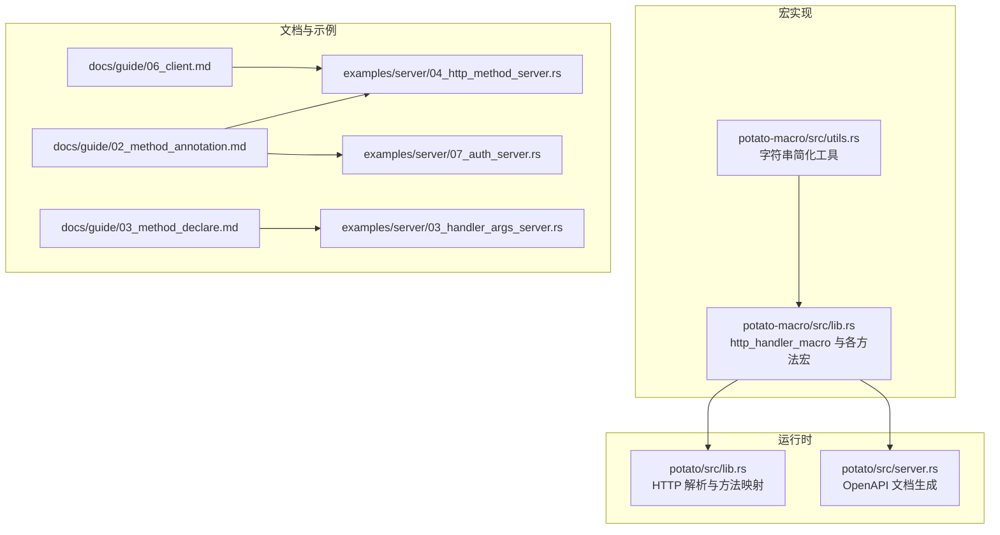
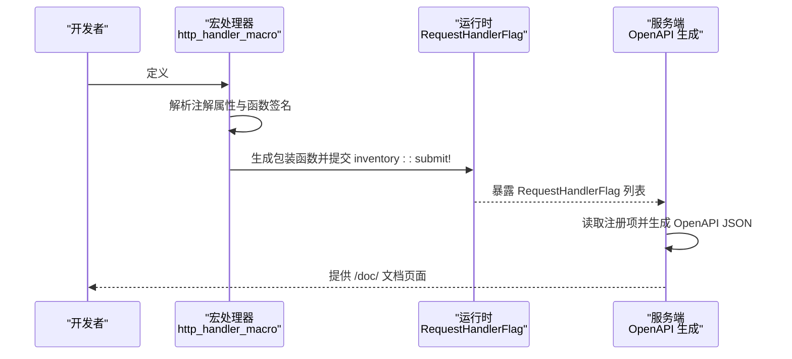
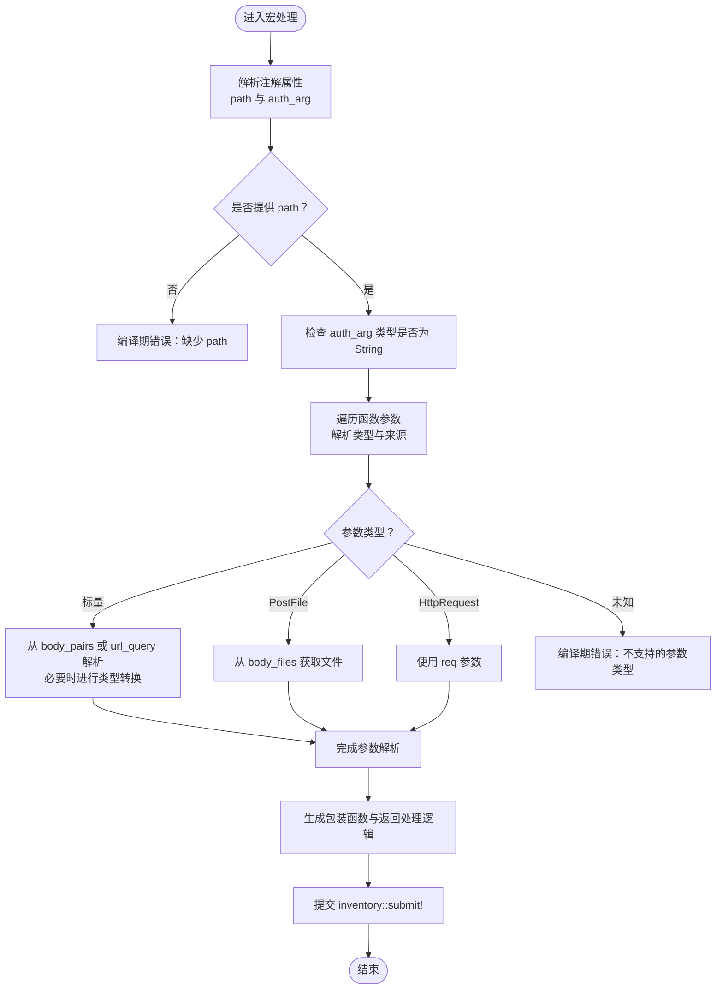
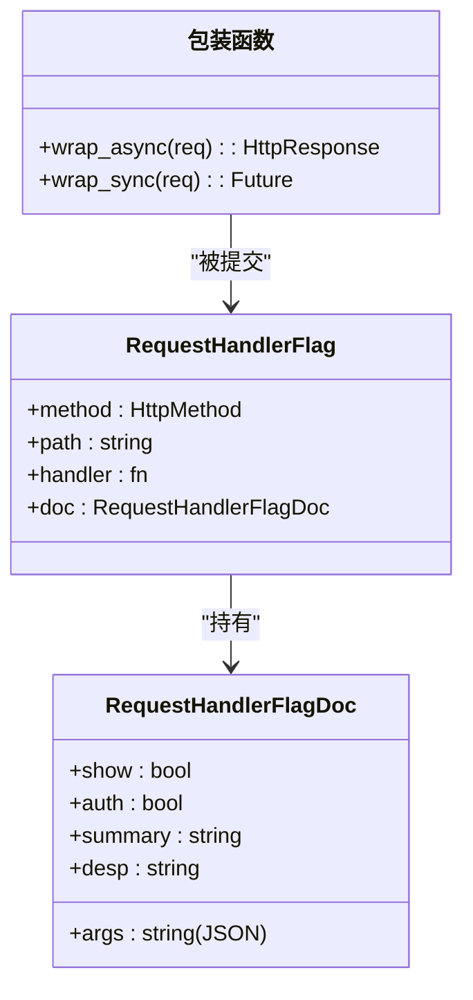
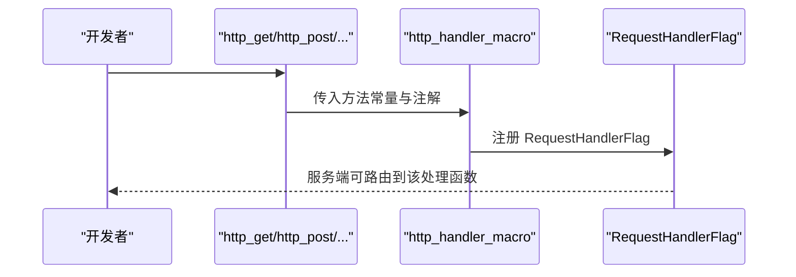
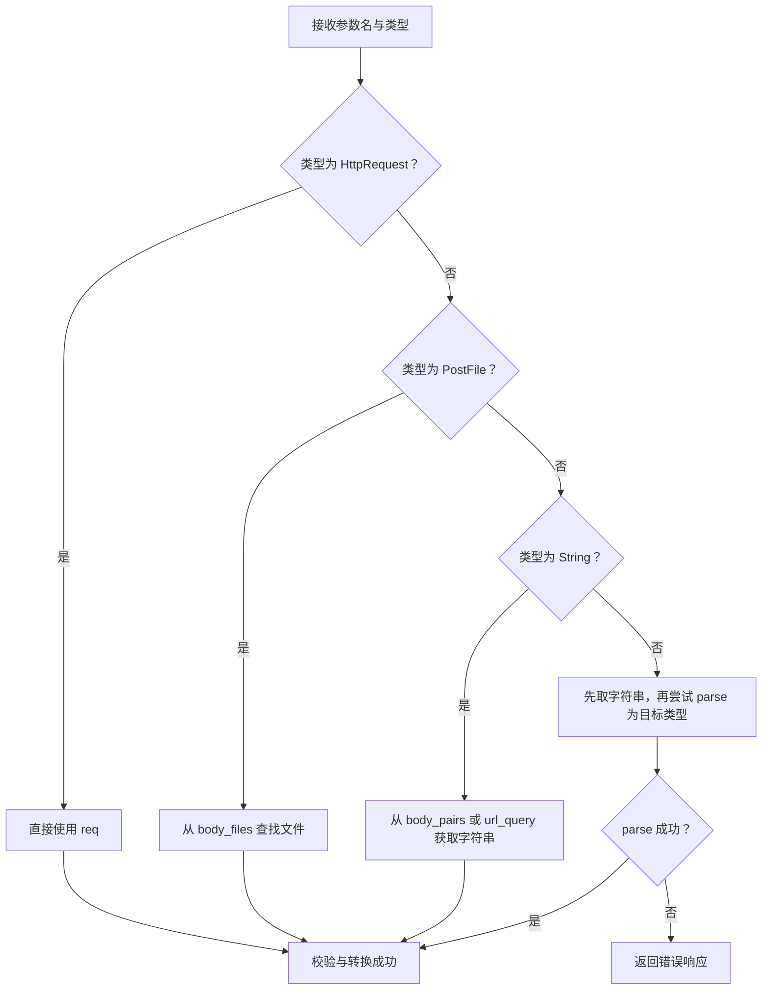
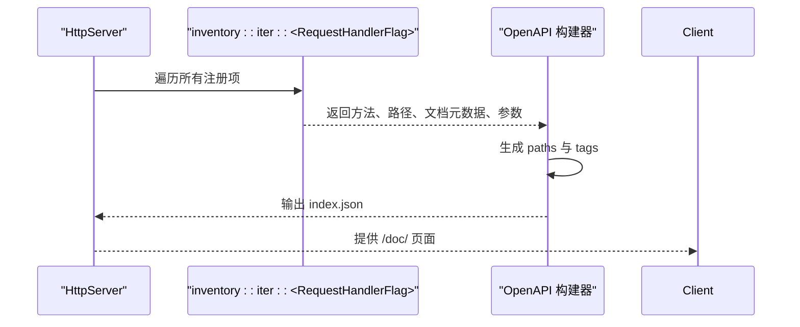
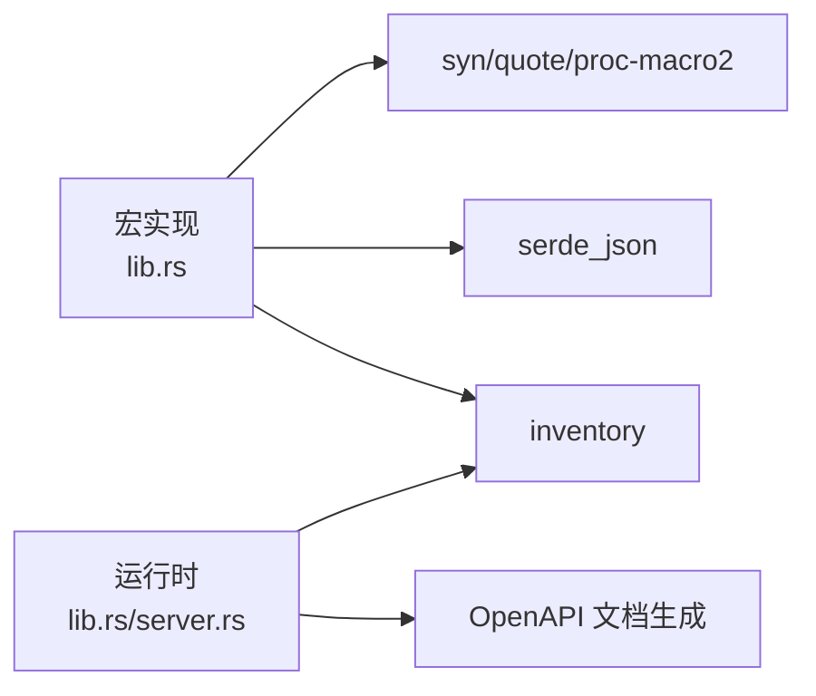

# HTTP方法宏

<cite>
**本文引用的文件**
- [lib.rs](file://potato-macro/src/lib.rs)
- [utils.rs](file://potato-macro/src/utils.rs)
- [lib.rs](file://potato/src/lib.rs)
- [server.rs](file://potato/src/server.rs)
- [02_method_annotation.md](file://docs/guide/02_method_annotation.md)
- [03_method_declare.md](file://docs/guide/03_method_declare.md)
- [06_client.md](file://docs/guide/06_client.md)
- [04_http_method_server.rs](file://examples/server/04_http_method_server.rs)
- [07_auth_server.rs](file://examples/server/07_auth_server.rs)
- [03_handler_args_server.rs](file://examples/server/03_handler_args_server.rs)
</cite>

## 目录
1. [简介](#简介)
2. [项目结构](#项目结构)
3. [核心组件](#核心组件)
4. [架构总览](#架构总览)
5. [详细组件分析](#详细组件分析)
6. [依赖关系分析](#依赖关系分析)
7. [性能考量](#性能考量)
8. [故障排查指南](#故障排查指南)
9. [结论](#结论)
10. [附录](#附录)

## 简介
本章节系统性介绍 Potato 提供的 HTTP 方法宏，覆盖 http_get、http_post、http_put、http_delete、http_options、http_head 六类宏的使用与实现原理。重点说明宏参数解析机制（path 路径参数与 auth_arg 认证参数）、宏展开后的代码结构与生成的包装函数、支持的参数与返回类型、典型使用示例与最佳实践、限制与约束规则，以及常见错误与调试方法。

## 项目结构
围绕 HTTP 方法宏的关键文件与模块分布如下：
- 宏实现与工具：potato-macro/src/lib.rs、potato-macro/src/utils.rs
- 运行时与服务端集成：potato/src/lib.rs、potato/src/server.rs
- 文档与示例：docs/guide/02_method_annotation.md、docs/guide/03_method_declare.md、docs/guide/06_client.md
- 示例工程：examples/server/04_http_method_server.rs、examples/server/07_auth_server.rs、examples/server/03_handler_args_server.rs

**图示来源**
- [lib.rs](file://potato-macro/src/lib.rs#L1-L399)
- [utils.rs](file://potato-macro/src/utils.rs#L1-L18)
- [lib.rs](file://potato/src/lib.rs#L709-L743)
- [server.rs](file://potato/src/server.rs#L133-L317)
- [02_method_annotation.md](file://docs/guide/02_method_annotation.md#L1-L39)
- [03_method_declare.md](file://docs/guide/03_method_declare.md#L50-L53)
- [06_client.md](file://docs/guide/06_client.md#L1-L72)
- [04_http_method_server.rs](file://examples/server/04_http_method_server.rs#L1-L42)
- [07_auth_server.rs](file://examples/server/07_auth_server.rs#L1-L24)
- [03_handler_args_server.rs](file://examples/server/03_handler_args_server.rs#L1-L32)

**章节来源**
- [lib.rs](file://potato-macro/src/lib.rs#L1-L399)
- [utils.rs](file://potato-macro/src/utils.rs#L1-L18)
- [lib.rs](file://potato/src/lib.rs#L709-L743)
- [server.rs](file://potato/src/server.rs#L133-L317)
- [02_method_annotation.md](file://docs/guide/02_method_annotation.md#L1-L39)
- [03_method_declare.md](file://docs/guide/03_method_declare.md#L50-L53)
- [06_client.md](file://docs/guide/06_client.md#L1-L72)
- [04_http_method_server.rs](file://examples/server/04_http_method_server.rs#L1-L42)
- [07_auth_server.rs](file://examples/server/07_auth_server.rs#L1-L24)
- [03_handler_args_server.rs](file://examples/server/03_handler_args_server.rs#L1-L32)

## 核心组件
- 宏处理器 http_handler_macro：统一解析注解属性、提取路由 path、可选 auth_arg、收集函数签名参数并生成包装函数，最终注册到 RequestHandlerFlag 并提交 inventory。
- 六个方法宏：http_get、http_post、http_put、http_delete、http_options、http_head，分别传入对应 HTTP 方法常量，委托给 http_handler_macro。
- 参数类型集：支持 String、bool、整型与浮点型共 12 种标量类型；支持 PostFile 文件参数；HttpRequest 引用参数。
- 返回类型集：()、Result<(), E>、Result<HttpResponse, E>、HttpResponse。
- OpenAPI 集成：根据注册的 RequestHandlerFlag 动态生成 OpenAPI JSON，自动识别 GET 的 query 参数与非 GET 的 multipart/form-data requestBody。

**章节来源**
- [lib.rs](file://potato-macro/src/lib.rs#L11-L18)
- [lib.rs](file://potato-macro/src/lib.rs#L26-L300)
- [lib.rs](file://potato/src/server.rs#L133-L237)
- [03_method_declare.md](file://docs/guide/03_method_declare.md#L50-L53)

## 架构总览
下图展示从宏定义到运行时处理的整体流程，包括参数解析、包装函数生成、注册与 OpenAPI 文档生成。

**图示来源**
- [lib.rs](file://potato-macro/src/lib.rs#L26-L300)
- [lib.rs](file://potato/src/server.rs#L133-L317)

## 详细组件分析

### 宏参数解析机制
- 路由 path 支持两种写法：
  - 直接以字面量字符串作为第一个参数：#[http_get("/users")]
  - 以命名参数形式：#[http_get(path="/users", auth_arg=payload)]
- auth_arg 仅支持一个参数名，且该参数类型必须为 String；若声明 auth_arg 却未在函数签名中出现，或类型不符，会在编译期报错。
- 函数参数解析：
  - 支持 "&mut HttpRequest" 作为第一个参数，用于直接访问底层请求对象。
  - 支持 "PostFile" 类型参数，表示上传文件。
  - 支持 12 种标量类型：String、bool、u8/u16/u32/u64/usize、i8/i16/i32/i64/isize、f32/f64。
  - 对于非 String 的标量参数，宏会尝试从请求体键值对或 URL 查询参数中解析并转换；缺失或类型不匹配时返回错误响应。
- 返回类型处理：
  - ()：执行后返回文本 "ok"
  - Result<(), E>：Ok 返回 "ok"，Err 返回错误文本
  - Result<HttpResponse, E> 或 HttpResponse：直接返回处理结果
  - 其他返回类型在编译期报错

**图示来源**
- [lib.rs](file://potato-macro/src/lib.rs#L26-L300)
- [utils.rs](file://potato-macro/src/utils.rs#L1-L18)

**章节来源**
- [lib.rs](file://potato-macro/src/lib.rs#L26-L191)
- [lib.rs](file://potato-macro/src/lib.rs#L199-L274)
- [utils.rs](file://potato-macro/src/utils.rs#L1-L18)

### 宏展开后的代码结构与生成的包装函数
- 宏会生成两个关键符号：
  - 包装异步函数：async fn 包裹原函数逻辑，负责参数解析与返回值处理
  - 包装同步函数：fn 将异步包装函数转为 Pin<Box<dyn Future<Output=HttpResponse>>>，以便统一调度
- 最终通过 inventory::submit! 注册 RequestHandlerFlag，包含：
  - HttpMethod（GET/POST/...）
  - 路由 path
  - 包装函数指针
  - 文档元数据（是否显示、是否鉴权、摘要、描述、参数列表）

**图示来源**
- [lib.rs](file://potato-macro/src/lib.rs#L280-L300)

**章节来源**
- [lib.rs](file://potato-macro/src/lib.rs#L280-L300)

### http_get、http_post、http_put、http_delete、http_options、http_head 的实现与使用
- 实现原理：六个宏均委托给 http_handler_macro，并将对应的 HTTP 方法字符串传入，其余逻辑一致。
- 使用方法：
  - 基础用法：直接以字面量字符串指定 path
  - 高级用法：同时指定 path 与 auth_arg，实现基于 Bearer Token 的鉴权
- 示例参考：
  - 六种方法的基础示例：examples/server/04_http_method_server.rs
  - 鉴权示例：examples/server/07_auth_server.rs
  - 参数与文件上传示例：examples/server/03_handler_args_server.rs
- 文档说明：docs/guide/02_method_annotation.md 与 docs/guide/03_method_declare.md

**图示来源**
- [lib.rs](file://potato-macro/src/lib.rs#L302-L330)
- [lib.rs](file://potato-macro/src/lib.rs#L26-L300)

**章节来源**
- [lib.rs](file://potato-macro/src/lib.rs#L302-L330)
- [04_http_method_server.rs](file://examples/server/04_http_method_server.rs#L1-L42)
- [07_auth_server.rs](file://examples/server/07_auth_server.rs#L1-L24)
- [03_handler_args_server.rs](file://examples/server/03_handler_args_server.rs#L1-L32)
- [02_method_annotation.md](file://docs/guide/02_method_annotation.md#L1-L39)
- [03_method_declare.md](file://docs/guide/03_method_declare.md#L50-L53)

### 参数解析与类型支持
- 支持的参数类型：
  - 标量：String、bool、u8/u16/u32/u64/usize、i8/i16/i32/i64/isize、f32/f64
  - 特殊：&mut HttpRequest、PostFile
- 参数来源优先级：
  - PostFile：从 body_files 中按参数名查找
  - 标量：先从 body_pairs（表单键值），再从 url_query（查询参数）；缺失则报错
  - 非 String 标量：尝试 parse，失败则报错
- auth_arg 约束：
  - 必须指向一个名为该名称的函数参数
  - 该参数类型必须为 String
  - 鉴权逻辑：从 Authorization 头提取 Bearer Token，调用 ServerAuth::jwt_check 校验，失败返回 401

**图示来源**
- [lib.rs](file://potato-macro/src/lib.rs#L110-L187)

**章节来源**
- [lib.rs](file://potato-macro/src/lib.rs#L11-L18)
- [lib.rs](file://potato-macro/src/lib.rs#L110-L187)

### 返回类型与错误处理
- 支持的返回类型：
  - ()：执行后返回 "ok"
  - Result<(), E>：Ok 返回 "ok"，Err 返回错误文本
  - Result<HttpResponse, E> 或 HttpResponse：直接返回处理结果
- 不支持的返回类型会在编译期报错
- 错误响应：
  - 缺少参数：返回错误响应
  - 类型转换失败：返回错误响应
  - 鉴权失败：返回 401

**章节来源**
- [lib.rs](file://potato-macro/src/lib.rs#L199-L274)
- [03_method_declare.md](file://docs/guide/03_method_declare.md#L50-L53)

### OpenAPI 文档生成
- 服务端在启用 OpenAPI 功能时，会扫描所有已注册的 RequestHandlerFlag：
  - GET 方法：将参数映射为 query parameters
  - 非 GET 方法：将参数映射为 multipart/form-data requestBody 的 properties
  - 若存在 auth_arg，添加 bearerAuth 安全方案与 401 响应码
- 文档输出：生成 index.json 并嵌入静态资源，通过 /doc/ 访问

**图示来源**
- [server.rs](file://potato/src/server.rs#L133-L237)

**章节来源**
- [server.rs](file://potato/src/server.rs#L133-L237)

## 依赖关系分析
- 宏实现依赖：
  - syn、quote、proc-macro2：语法解析与代码生成
  - serde_json：序列化文档参数
  - inventory：运行时注册
- 运行时依赖：
  - 服务端通过 inventory 读取注册项，构建 OpenAPI
  - lib.rs 中对 HTTP 方法字符串进行枚举映射

**图示来源**
- [lib.rs](file://potato-macro/src/lib.rs#L3-L9)
- [lib.rs](file://potato/src/lib.rs#L709-L743)
- [server.rs](file://potato/src/server.rs#L133-L317)

**章节来源**
- [lib.rs](file://potato-macro/src/lib.rs#L3-L9)
- [lib.rs](file://potato/src/lib.rs#L709-L743)
- [server.rs](file://potato/src/server.rs#L133-L317)

## 性能考量
- 宏展开发生在编译期，运行时无额外开销
- 参数解析采用哈希查找（body_pairs/body_files/url_query），时间复杂度近似 O(1)
- OpenAPI 文档生成在服务启动时一次性完成，不影响请求处理路径
- 建议：
  - 尽量使用标量类型参数，避免复杂的自定义类型
  - 对高频接口，优先使用 GET + query 参数，减少请求体解析成本

[本节为通用建议，无需特定文件来源]

## 故障排查指南
- 常见编译期错误
  - 缺少 path：注解必须提供 path
  - path 不以 "/" 开头：必须为绝对路径
  - auth_arg 未指向任何参数：需确保参数名与签名一致
  - auth_arg 类型不是 String：鉴权参数必须为 String
  - 不支持的参数类型：仅支持 12 种标量、HttpRequest、PostFile
  - 不支持的返回类型：仅支持 ()、Result<(), E>、Result<HttpResponse, E>、HttpResponse
- 运行时错误
  - 缺少参数：返回错误响应
  - 类型转换失败：返回错误响应
  - 鉴权失败：返回 401
- 调试建议
  - 打开 OpenAPI 文档页面 /doc/，核对参数与安全方案
  - 在函数中显式返回 HttpResponse 便于定位问题
  - 使用 &mut HttpRequest 直接访问请求头与体，辅助排错

**章节来源**
- [lib.rs](file://potato-macro/src/lib.rs#L28-L64)
- [lib.rs](file://potato-macro/src/lib.rs#L189-L191)
- [lib.rs](file://potato-macro/src/lib.rs#L182-L187)
- [lib.rs](file://potato-macro/src/lib.rs#L220-L221)
- [lib.rs](file://potato/src/server.rs#L133-L237)

## 结论
Potato 的 HTTP 方法宏通过统一的 http_handler_macro 实现，提供了简洁一致的注解语法与强大的参数解析能力。结合 inventory 注册与 OpenAPI 自动生成，开发者可以快速构建可文档化的 REST 接口。遵循参数与返回类型约束、正确配置 path 与 auth_arg，是稳定使用的关键。

[本节为总结，无需特定文件来源]

## 附录

### 使用示例与最佳实践
- 基础 GET/POST/PUT/OPTIONS/HEAD/DELETE
  - 参考：examples/server/04_http_method_server.rs
- 鉴权（Bearer Token）
  - 参考：examples/server/07_auth_server.rs
  - 文档：docs/guide/02_method_annotation.md
- 参数与文件上传
  - 参考：examples/server/03_handler_args_server.rs
- 客户端使用与会话
  - 参考：docs/guide/06_client.md
  - 示例：examples/client/*.rs

**章节来源**
- [04_http_method_server.rs](file://examples/server/04_http_method_server.rs#L1-L42)
- [07_auth_server.rs](file://examples/server/07_auth_server.rs#L1-L24)
- [03_handler_args_server.rs](file://examples/server/03_handler_args_server.rs#L1-L32)
- [02_method_annotation.md](file://docs/guide/02_method_annotation.md#L1-L39)
- [06_client.md](file://docs/guide/06_client.md#L1-L72)