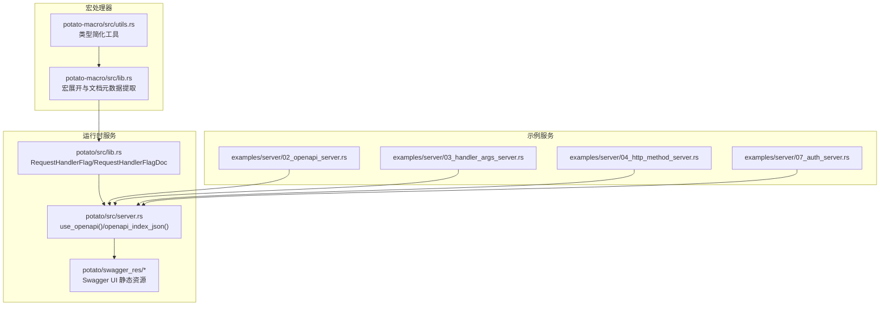
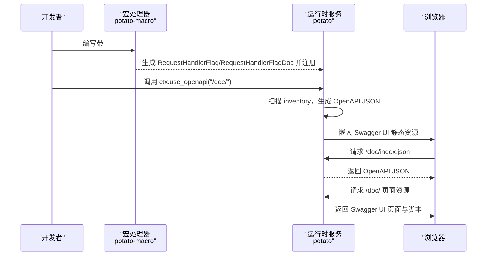
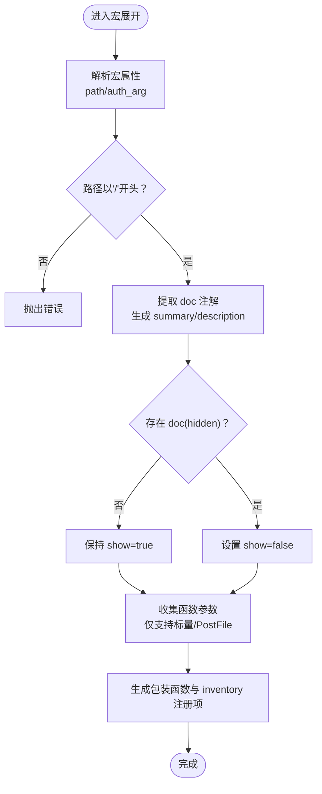
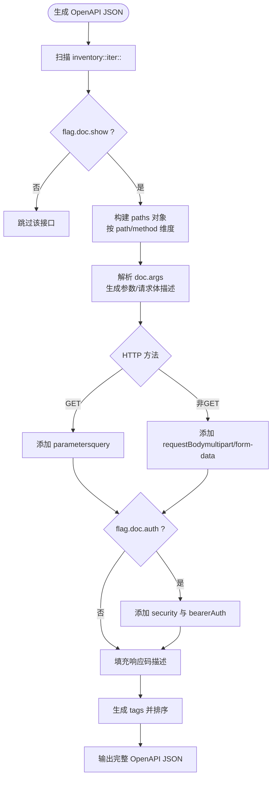
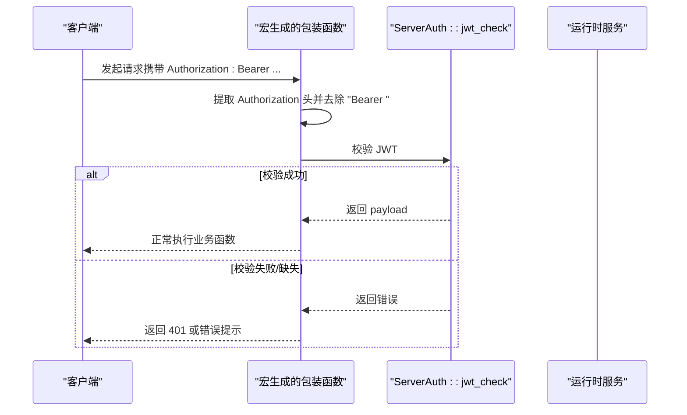
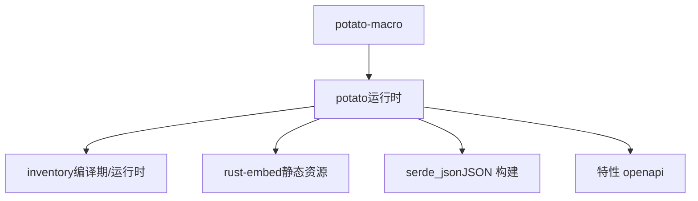

# OpenAPI文档集成

<cite>
**本文引用的文件**
- [Cargo.toml](file://potato/Cargo.toml)
- [lib.rs](file://potato/src/lib.rs)
- [server.rs](file://potato/src/server.rs)
- [lib.rs](file://potato-macro/src/lib.rs)
- [utils.rs](file://potato-macro/src/utils.rs)
- [02_openapi_server.rs](file://examples/server/02_openapi_server.rs)
- [03_handler_args_server.rs](file://examples/server/03_handler_args_server.rs)
- [04_http_method_server.rs](file://examples/server/04_http_method_server.rs)
- [07_auth_server.rs](file://examples/server/07_auth_server.rs)
- [02_method_annotation.md](file://docs/guide/02_method_annotation.md)
- [index.html](file://potato/swagger_res/index.html)
- [swagger-initializer.js](file://potato/swagger_res/swagger-initializer.js)
</cite>

## 目录
1. [简介](#简介)
2. [项目结构](#项目结构)
3. [核心组件](#核心组件)
4. [架构总览](#架构总览)
5. [详细组件分析](#详细组件分析)
6. [依赖关系分析](#依赖关系分析)
7. [性能考量](#性能考量)
8. [故障排查指南](#故障排查指南)
9. [结论](#结论)
10. [附录](#附录)

## 简介
本文件系统性阐述 Potato 宏系统与 OpenAPI 文档生成的集成机制，重点覆盖以下方面：
- 如何通过宏属性自动生成 OpenAPI 规范文档，包括文档元数据的提取与处理
- @doc 注释的解析规则与文档内容的组织方式
- 认证信息的自动提取与文档生成（含 Bearer Token 认证）
- 参数信息的收集与类型描述生成
- OpenAPI 文档的配置选项与自定义方法
- 调试技巧与常见问题解决方案
- 完整的 OpenAPI 集成示例与最佳实践

## 项目结构
围绕 OpenAPI 集成的关键模块与文件分布如下：
- 宏处理器：负责解析函数标注、提取文档元数据、生成路由注册与包装代码
- 运行时服务：负责收集已注册的路由、生成 OpenAPI JSON、嵌入 Swagger UI 资源
- 示例服务：演示如何启用 OpenAPI 文档页面与访问接口
- Swagger UI 资源：静态资源，用于渲染 OpenAPI 文档页面

**图表来源**
- [lib.rs](file://potato-macro/src/lib.rs#L1-L399)
- [utils.rs](file://potato-macro/src/utils.rs#L1-L19)
- [lib.rs](file://potato/src/lib.rs#L126-L175)
- [server.rs](file://potato/src/server.rs#L133-L331)
- [02_openapi_server.rs](file://examples/server/02_openapi_server.rs#L1-L16)
- [03_handler_args_server.rs](file://examples/server/03_handler_args_server.rs#L1-L32)
- [04_http_method_server.rs](file://examples/server/04_http_method_server.rs#L1-L42)
- [07_auth_server.rs](file://examples/server/07_auth_server.rs#L1-L24)

**章节来源**
- [Cargo.toml](file://potato/Cargo.toml#L65-L72)
- [lib.rs](file://potato/src/lib.rs#L126-L175)
- [server.rs](file://potato/src/server.rs#L133-L331)
- [lib.rs](file://potato-macro/src/lib.rs#L1-L399)
- [utils.rs](file://potato-macro/src/utils.rs#L1-L19)
- [02_openapi_server.rs](file://examples/server/02_openapi_server.rs#L1-L16)
- [03_handler_args_server.rs](file://examples/server/03_handler_args_server.rs#L1-L32)
- [04_http_method_server.rs](file://examples/server/04_http_method_server.rs#L1-L42)
- [07_auth_server.rs](file://examples/server/07_auth_server.rs#L1-L24)

## 核心组件
- 宏处理器（potato-macro）：解析 http_* 宏属性，提取文档元数据（是否显示、是否需要认证、摘要等），并生成包装函数与 inventory 注册项
- 运行时服务（potato）：在启用 openapi 功能时，扫描所有注册的 RequestHandlerFlag，构建 OpenAPI JSON，并嵌入 Swagger UI 静态资源
- 示例服务：通过配置启用 OpenAPI 文档页面，访问 http://127.0.0.1:8080/doc/

关键职责与交互要点：
- 宏展开阶段：从函数注解中提取 doc 属性，构造 RequestHandlerFlagDoc；根据 auth_arg 决定是否标记需要认证
- 运行时阶段：遍历 inventory 中的 RequestHandlerFlag，按路径与方法组织 paths，按标签组织 tags；若存在认证标记，则注入 securitySchemes

**章节来源**
- [lib.rs](file://potato-macro/src/lib.rs#L26-L300)
- [lib.rs](file://potato/src/lib.rs#L126-L175)
- [server.rs](file://potato/src/server.rs#L133-L331)

## 架构总览
下图展示了从宏展开到 OpenAPI 文档呈现的整体流程。

**图表来源**
- [lib.rs](file://potato-macro/src/lib.rs#L26-L300)
- [server.rs](file://potato/src/server.rs#L133-L331)
- [index.html](file://potato/swagger_res/index.html#L1-L19)
- [swagger-initializer.js](file://potato/swagger_res/swagger-initializer.js#L1-L20)

## 详细组件分析

### 宏系统与文档元数据提取
- 宏属性解析
  - 支持两种形式：直接传入路径字符串，或以键值对形式传入 path 与 auth_arg
  - 路径必须以 "/" 开头，否则抛出错误
- 文档元数据提取
  - 通过函数上的 doc 注解提取摘要（summary），支持多行注释合并
  - 若 doc 列表中所有条目均以空格缩进，则统一去除首列空格，保证排版一致性
  - 通过检查是否存在 doc(hidden) 来决定该接口是否出现在文档中
- 认证标记
  - 当指定 auth_arg 时，标记该接口需要认证；宏展开时会校验 auth_arg 对应参数类型必须为 String
- 参数信息收集
  - 仅支持基础标量类型与 PostFile 类型
  - 将参数名称与类型序列化为 JSON 字符串，供运行时生成 OpenAPI 参数/请求体描述

**图表来源**
- [lib.rs](file://potato-macro/src/lib.rs#L26-L191)
- [utils.rs](file://potato-macro/src/utils.rs#L5-L18)

**章节来源**
- [lib.rs](file://potato-macro/src/lib.rs#L26-L191)
- [utils.rs](file://potato-macro/src/utils.rs#L1-L19)

### 运行时 OpenAPI 文档生成
- 文档元数据
  - 使用环境变量中的包名、版本、描述、作者信息作为 OpenAPI info 字段
  - 作者信息解析为 name/email 结构
- 路由与路径组织
  - 遍历 inventory::iter::<RequestHandlerFlag>，过滤掉不显示的接口
  - 按路径分组，按方法映射到具体操作对象
  - 从 doc.args 中解析参数列表，生成 OpenAPI parameters 或 requestBody
- 参数与类型描述
  - GET 方法：将每个参数映射为 query 参数，类型基于参数类型字符串推断
  - 非 GET 方法：将参数映射为 multipart/form-data 的 requestBody，属性类型映射为 number/string/binary
  - PostFile 映射为二进制格式
- 认证与安全方案
  - 若任一接口标记为需要认证，则在 paths 中添加 security，并在 components.securitySchemes 中注入 bearerAuth
  - 响应码集合会扩展包含 401 与 500
- 标签与排序
  - 从路径末尾前的片段生成标签名，最终按字典序排序输出

**图表来源**
- [server.rs](file://potato/src/server.rs#L133-L273)

**章节来源**
- [server.rs](file://potato/src/server.rs#L133-L273)

### Swagger UI 集成与资源嵌入
- 启用 use_openapi(url_path) 后，运行时会将 swagger_res 目录下的静态资源打包进内存，并在指定 URL 下提供
- index.json 由运行时动态生成，指向 Swagger UI 的 url
- 初始化脚本负责加载 Swagger UI 并渲染 OpenAPI 文档

**图表来源**
- [server.rs](file://potato/src/server.rs#L275-L331)
- [index.html](file://potato/swagger_res/index.html#L1-L19)
- [swagger-initializer.js](file://potato/swagger_res/swagger-initializer.js#L1-L20)

**章节来源**
- [server.rs](file://potato/src/server.rs#L275-L331)
- [index.html](file://potato/swagger_res/index.html#L1-L19)
- [swagger-initializer.js](file://potato/swagger_res/swagger-initializer.js#L1-L20)

### 认证信息与 Bearer Token 支持
- 宏层面
  - 通过 auth_arg 指定认证参数名，宏展开时强制要求该参数类型为 String
- 运行时层面
  - 若任一接口标记为需要认证，则在 OpenAPI JSON 中注入 security 与 bearerAuth 安全方案
- 实际鉴权行为
  - 宏展开时会从 Authorization 头中提取 Bearer Token，并调用 ServerAuth::jwt_check 进行验证
  - 验证失败返回 401，未提供则返回错误提示

**图表来源**
- [lib.rs](file://potato-macro/src/lib.rs#L130-L191)
- [server.rs](file://potato/src/server.rs#L230-L234)

**章节来源**
- [lib.rs](file://potato-macro/src/lib.rs#L130-L191)
- [server.rs](file://potato/src/server.rs#L230-L234)

### 参数信息收集与类型描述生成
- 支持的参数类型
  - 标量类型：String、bool、整数/浮点数系列
  - 文件上传：PostFile
- 参数位置与类型映射
  - GET：query 参数，number/string/binary 由参数类型字符串推断
  - 非 GET：multipart/form-data，属性类型映射为 number/string/binary
- 必填性
  - 所有参数在 OpenAPI 中标记为 required

**章节来源**
- [lib.rs](file://potato-macro/src/lib.rs#L106-L191)
- [server.rs](file://potato/src/server.rs#L193-L229)

### 文档元数据与 @doc 注释解析
- doc 注释解析
  - 从函数 doc 注解中提取文本，拼接为 summary；若所有条目均缩进，则统一去除首列空格
  - 存在 doc(hidden) 时，接口不显示在文档中
- 元数据来源
  - OpenAPI info.title/version/description/contact 来自 Cargo 包元数据

**章节来源**
- [lib.rs](file://potato-macro/src/lib.rs#L67-L102)
- [server.rs](file://potato/src/server.rs#L137-L147)

## 依赖关系分析
- 宏依赖
  - 使用 syn/quote/proc-macro2 等进行语法树解析与代码生成
  - 依赖 inventory 在编译期收集注册项
- 运行时依赖
  - 通过 inventory 在运行时收集 RequestHandlerFlag
  - 通过 rust-embed 嵌入 Swagger UI 静态资源
  - 通过 serde_json 构建 OpenAPI JSON
- 特性开关
  - openapi 特性控制是否启用 OpenAPI 相关功能

**图表来源**
- [Cargo.toml](file://potato/Cargo.toml#L16-L72)
- [server.rs](file://potato/src/server.rs#L275-L331)

**章节来源**
- [Cargo.toml](file://potato/Cargo.toml#L16-L72)

## 性能考量
- OpenAPI JSON 生成
  - 仅在启用 use_openapi 时生成，且为一次性构建，后续通过内存资源提供
- Swagger UI 资源
  - 通过 rust-embed 嵌入，减少外部依赖与网络请求
- 参数与类型描述
  - 通过 doc.args 预先序列化，避免运行时重复解析

[本节为通用建议，无需特定文件来源]

## 故障排查指南
- 宏属性错误
  - 路径未以 "/" 开头：请修正为绝对路径
  - auth_arg 指向的参数类型非 String：请确保类型为 String
  - 未找到 auth_arg 对应参数：请确认参数名与宏属性一致
- 认证相关
  - 401 错误：检查 Authorization 头是否正确，以及 JWT 是否有效
  - 未提供 Authorization：确认客户端是否携带 Bearer Token
- 文档不显示
  - 若函数注释包含 doc(hidden)，接口不会出现在文档中
- OpenAPI 页面无法访问
  - 确认已调用 ctx.use_openapi("/doc/")，并确保路径末尾有斜杠
  - 确认已启用 openapi 特性

**章节来源**
- [lib.rs](file://potato-macro/src/lib.rs#L57-L65)
- [lib.rs](file://potato-macro/src/lib.rs#L136-L139)
- [lib.rs](file://potato-macro/src/lib.rs#L189-L191)
- [server.rs](file://potato/src/server.rs#L275-L331)

## 结论
Potato 的 OpenAPI 集成通过“宏解析 + 运行时生成”的方式，实现了零样板代码的文档自动生成。宏系统负责在编译期提取接口元数据与参数类型，运行时在启用 openapi 特性后，自动构建 OpenAPI JSON 并嵌入 Swagger UI，使开发者能够快速获得可交互的 API 文档。配合 Bearer Token 认证与多类型参数支持，满足大多数 REST 接口场景。

[本节为总结，无需特定文件来源]

## 附录

### OpenAPI 配置选项与自定义方法
- 启用 OpenAPI 文档页面
  - 在服务配置中调用 ctx.use_openapi("/doc/")，即可在 /doc/ 下提供 Swagger UI
- 自定义文档元数据
  - 通过函数 doc 注解编写摘要与描述
  - 通过 doc(hidden) 控制接口是否出现在文档中
- 自定义认证参数
  - 在宏属性中指定 auth_arg，确保参数类型为 String
  - 运行时将自动注入 security 与 bearerAuth

**章节来源**
- [02_openapi_server.rs](file://examples/server/02_openapi_server.rs#L8-L12)
- [02_method_annotation.md](file://docs/guide/02_method_annotation.md#L23-L36)
- [lib.rs](file://potato-macro/src/lib.rs#L67-L102)
- [server.rs](file://potato/src/server.rs#L230-L234)

### 完整集成示例与最佳实践
- 最小可用示例
  - 参考示例：examples/server/02_openapi_server.rs
  - 关键步骤：声明处理函数、启用 OpenAPI、启动服务
- 参数与文件上传
  - 参考示例：examples/server/03_handler_args_server.rs
  - GET 使用 query 参数，POST 使用 multipart/form-data 上传文件
- 多 HTTP 方法
  - 参考示例：examples/server/04_http_method_server.rs
  - 展示 GET/POST/PUT/OPTIONS/HEAD/DELETE 的不同宏标注
- 认证与 Bearer Token
  - 参考示例：examples/server/07_auth_server.rs
  - 通过 auth_arg 指定认证参数，运行时自动校验 JWT
- 最佳实践
  - 为每个接口编写清晰的 doc 注释，便于生成高质量摘要
  - 对于敏感接口，务必启用 auth_arg 并在客户端正确传递 Bearer Token
  - 使用 multipart/form-data 上传文件时，参数类型使用 PostFile

**章节来源**
- [02_openapi_server.rs](file://examples/server/02_openapi_server.rs#L1-L16)
- [03_handler_args_server.rs](file://examples/server/03_handler_args_server.rs#L1-L32)
- [04_http_method_server.rs](file://examples/server/04_http_method_server.rs#L1-L42)
- [07_auth_server.rs](file://examples/server/07_auth_server.rs#L1-L24)