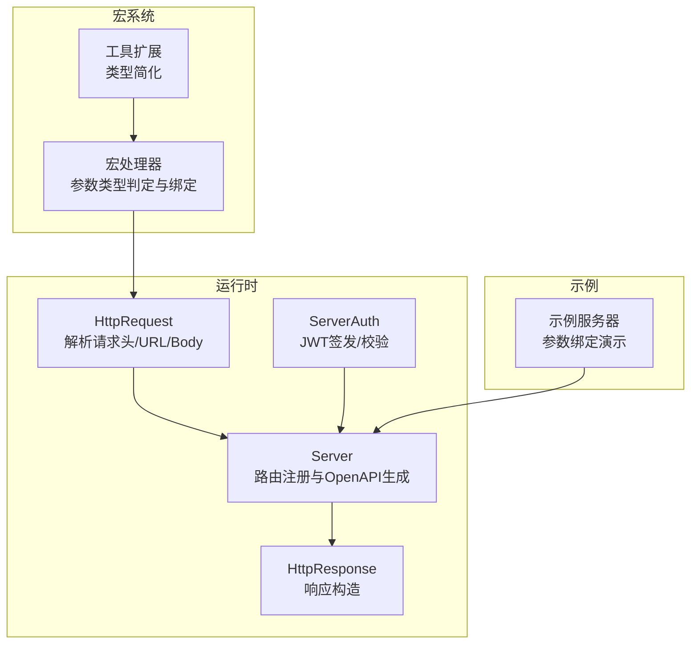
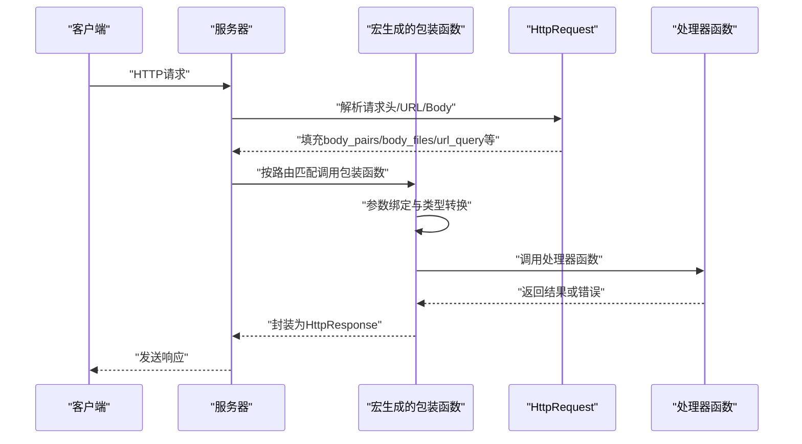
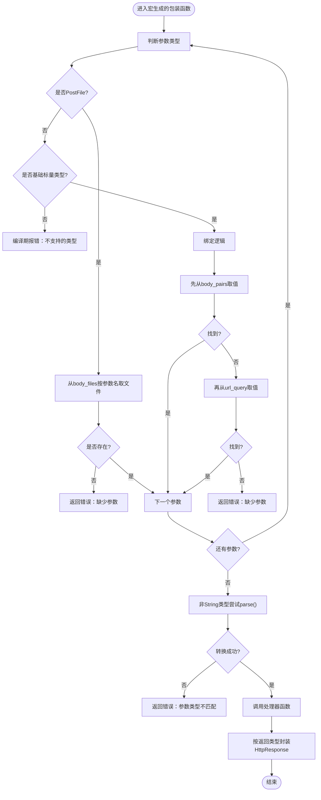
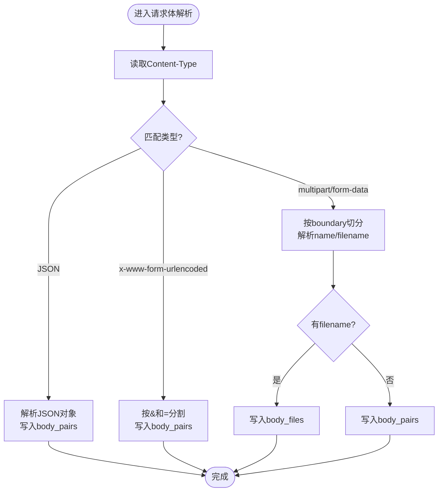
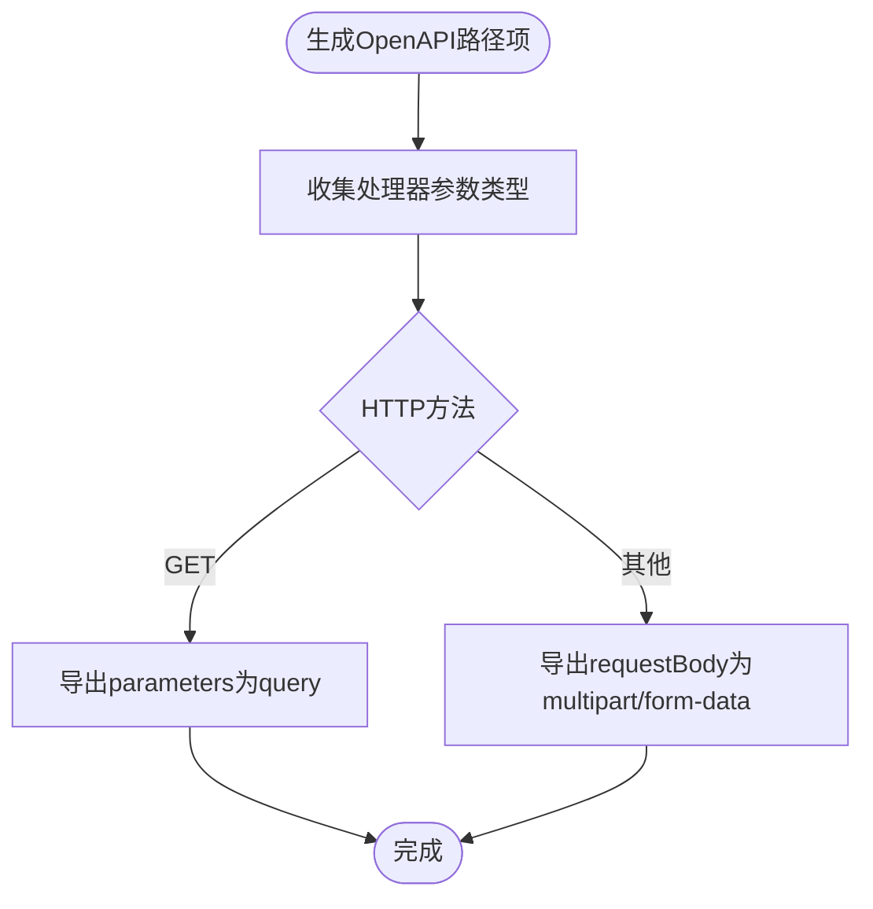
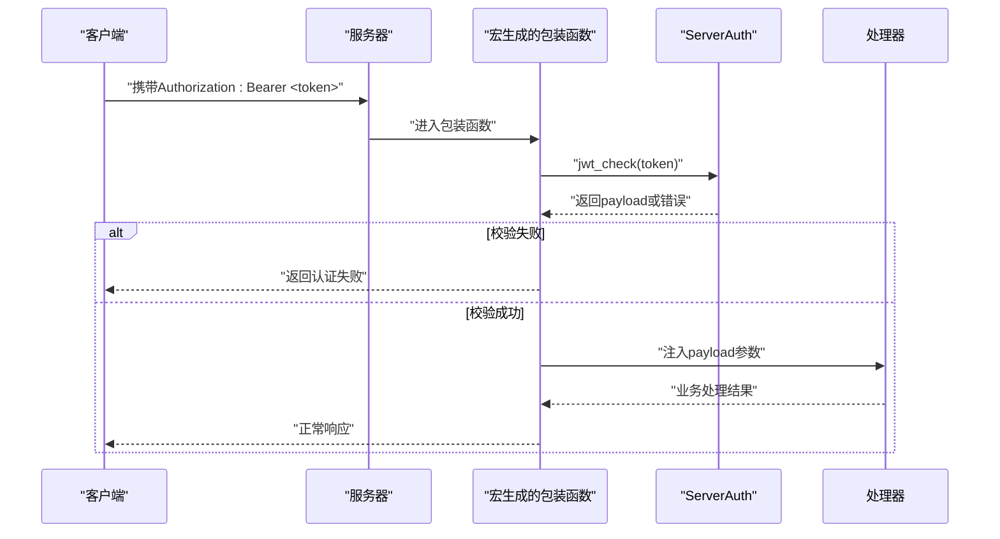
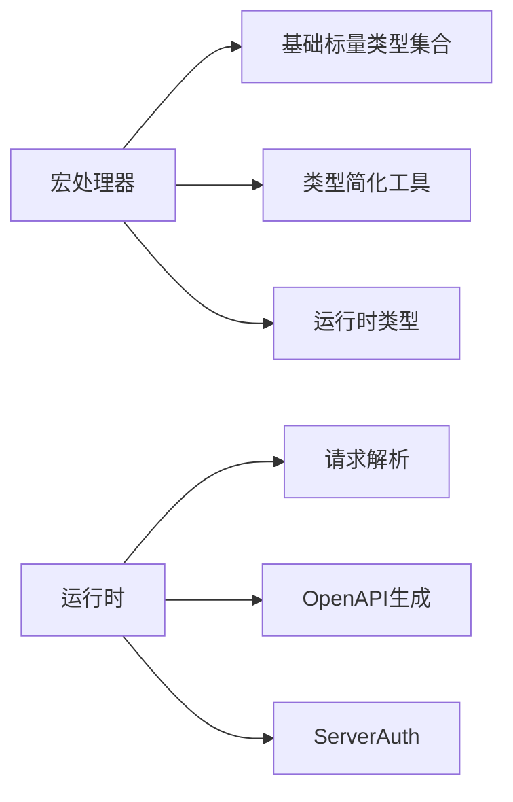

# 参数绑定与验证

<cite>
**本文引用的文件**
- [lib.rs](file://potato-macro/src/lib.rs)
- [utils.rs](file://potato-macro/src/utils.rs)
- [lib.rs](file://potato/src/lib.rs)
- [server.rs](file://potato/src/server.rs)
- [global_config.rs](file://potato/src/global_config.rs)
- [03_handler_args_server.rs](file://examples/server/03_handler_args_server.rs)
- [07_auth_server.rs](file://examples/server/07_auth_server.rs)
- [04_http_method_server.rs](file://examples/server/04_http_method_server.rs)
- [02_openapi_server.rs](file://examples/server/02_openapi_server.rs)
</cite>

## 目录
1. [简介](#简介)
2. [项目结构](#项目结构)
3. [核心组件](#核心组件)
4. [架构总览](#架构总览)
5. [详细组件分析](#详细组件分析)
6. [依赖关系分析](#依赖关系分析)
7. [性能考量](#性能考量)
8. [故障排查指南](#故障排查指南)
9. [结论](#结论)
10. [附录：参数命名规范与最佳实践](#附录参数命名规范与最佳实践)

## 简介
本篇文档深入解析 Potato 宏系统在 HTTP 处理器函数上的参数绑定与验证机制。重点覆盖以下方面：
- 如何从请求中提取并转换参数：路径参数、查询参数、请求体参数（含 JSON、表单编码、多部分表单）
- 支持的数据类型列表与类型转换逻辑
- 必需参数检查、类型验证与格式验证
- PostFile 文件参数的特殊处理与多部分表单数据解析
- 参数绑定的完整示例与错误处理策略
- 参数命名规范与最佳实践建议

## 项目结构
围绕参数绑定与验证，涉及的关键模块如下：
- 宏处理器：负责在编译期生成参数解析与调用包装代码
- 运行时请求对象：负责解析 HTTP 请求头、URL 查询串、JSON、表单与多部分表单，并将键值对与文件映射到请求对象
- OpenAPI 文档生成：根据处理器签名与注解生成 OpenAPI 规范
- 示例服务器：展示参数绑定的实际使用方式

**图表来源**
- [lib.rs](file://potato-macro/src/lib.rs#L11-L18)
- [lib.rs](file://potato/src/lib.rs#L384-L398)
- [server.rs](file://potato/src/server.rs#L184-L237)
- [global_config.rs](file://potato/src/global_config.rs#L37-L63)
- [03_handler_args_server.rs](file://examples/server/03_handler_args_server.rs#L1-L32)

**章节来源**
- [lib.rs](file://potato-macro/src/lib.rs#L11-L18)
- [lib.rs](file://potato/src/lib.rs#L384-L398)
- [server.rs](file://potato/src/server.rs#L184-L237)
- [global_config.rs](file://potato/src/global_config.rs#L37-L63)
- [03_handler_args_server.rs](file://examples/server/03_handler_args_server.rs#L1-L32)

## 核心组件
- 宏处理器（参数绑定与调用包装）
  - 编译期解析处理器函数签名，识别参数类型集合
  - 为每种参数类型生成对应的解析与转换代码
  - 对 PostFile 与基础标量类型分别处理
  - 对 auth_arg 注解进行安全校验
- 运行时请求对象（参数提取与类型转换）
  - 解析 URL 路径与查询串
  - 解析 Content-Type 并分派到 JSON、application/x-www-form-urlencoded 或 multipart/form-data
  - 将键值对存入 body_pairs，将带文件名的字段存入 body_files
- OpenAPI 文档生成（参数与安全信息导出）
  - 基于处理器签名与注解生成 OpenAPI 的 parameters/requestBody/security 等
- 认证与授权（可选）
  - 通过 auth_arg 指定的参数从 Authorization 头中提取 Bearer Token 并进行 JWT 校验

**章节来源**
- [lib.rs](file://potato-macro/src/lib.rs#L11-L18)
- [lib.rs](file://potato/src/lib.rs#L615-L699)
- [server.rs](file://potato/src/server.rs#L184-L237)
- [global_config.rs](file://potato/src/global_config.rs#L37-L63)

## 架构总览
下图展示了从请求进入、参数绑定、类型转换到最终调用处理器函数的整体流程。

**图表来源**
- [lib.rs](file://potato/src/lib.rs#L588-L699)
- [lib.rs](file://potato-macro/src/lib.rs#L119-L188)
- [server.rs](file://potato/src/server.rs#L184-L237)

## 详细组件分析

### 宏处理器：参数绑定与验证
- 支持的参数类型集合
  - 集合包含：String、bool、u8/u16/u32/u64/usize、i8/i16/i32/i64/isize、f32/f64
  - 该集合用于编译期判断是否允许绑定某参数类型
- 参数绑定策略
  - PostFile：直接从 body_files 中按参数名取值；缺失时报错
  - 基础标量类型：
    - 优先从 body_pairs（JSON/表单）取值
    - 若不存在，则回退到 url_query（查询串）
    - 若仍不存在，返回“缺少参数”错误
    - 非 String 类型会尝试 parse() 转换；失败则返回“参数类型不匹配”错误
  - 认证参数（auth_arg）：
    - 仅允许 String 类型
    - 从 Authorization 头中提取 Bearer Token 并调用 ServerAuth.jwt_check 校验
    - 校验失败返回“认证失败”错误；缺失头返回“缺少Authorization头”错误
- 返回值包装
  - 根据处理器返回类型（Result<(), HttpResponse, HttpResponse> 等）生成统一的响应包装逻辑

**图表来源**
- [lib.rs](file://potato-macro/src/lib.rs#L119-L188)
- [utils.rs](file://potato-macro/src/utils.rs#L1-L19)

**章节来源**
- [lib.rs](file://potato-macro/src/lib.rs#L11-L18)
- [lib.rs](file://potato-macro/src/lib.rs#L119-L188)
- [utils.rs](file://potato-macro/src/utils.rs#L1-L19)

### 运行时请求对象：参数提取与类型转换
- URL 与查询串
  - 解析 URL 路径与查询串，填充 url_path 与 url_query
- 请求体解析
  - ApplicationJson：将 JSON 对象的每个键值对转为字符串后放入 body_pairs
  - ApplicationXWwwFormUrlencoded：按 & 和 = 分割后放入 body_pairs
  - MultipartFormData：按 boundary 切分各部分，解析头部中的 name 与 filename，若存在 filename 则作为文件存入 body_files，否则作为普通键值对存入 body_pairs
- 错误处理
  - 解析过程中如遇不完整数据，返回 None 继续等待
  - 解析完成后返回 (HttpRequest, 总长度)，便于后续读取完整 Body

**图表来源**
- [lib.rs](file://potato/src/lib.rs#L615-L699)

**章节来源**
- [lib.rs](file://potato/src/lib.rs#L615-L699)

### OpenAPI 文档生成：参数与安全信息
- 参数导出
  - GET 方法：将所有参数导出为 query 参数，required=true
  - 非 GET 方法：将参数导出为 multipart/form-data 的 requestBody，属性类型依据参数类型，required 包含全部参数
- 安全信息
  - 若处理器声明了 auth_arg，则在 OpenAPI 中添加 bearerAuth 安全方案与 401 响应码

**图表来源**
- [server.rs](file://potato/src/server.rs#L184-L237)

**章节来源**
- [server.rs](file://potato/src/server.rs#L184-L237)

### 认证与授权：Bearer Token 校验
- auth_arg 注解
  - 仅允许 String 类型参数作为认证载荷
  - 从 Authorization 头中提取 Bearer Token 并调用 ServerAuth.jwt_check
  - 成功则将载荷注入处理器参数，失败则返回错误
- JWT 生命周期
  - ServerAuth.jwt_issue 用于签发带过期时间的 Token
  - ServerAuth.jwt_check 用于校验 Token 并判断是否过期

**图表来源**
- [lib.rs](file://potato-macro/src/lib.rs#L130-L155)
- [global_config.rs](file://potato/src/global_config.rs#L37-L63)

**章节来源**
- [lib.rs](file://potato-macro/src/lib.rs#L130-L155)
- [global_config.rs](file://potato/src/global_config.rs#L37-L63)

### 示例：参数绑定与错误处理
- 基础标量参数（String）
  - 优先从请求体键值对取值，其次从查询串取值，最后缺失时报错
- 文件参数（PostFile）
  - 从 multipart/form-data 中按 name 取文件；缺失时报错
- 认证参数（auth_arg）
  - 从 Authorization 头提取 Bearer Token 并校验；缺失或失败均报错

**章节来源**
- [03_handler_args_server.rs](file://examples/server/03_handler_args_server.rs#L8-L20)
- [07_auth_server.rs](file://examples/server/07_auth_server.rs#L8-L11)

## 依赖关系分析
- 宏处理器依赖
  - 类型集合（基础标量类型）
  - 工具扩展（类型简化）
  - 运行时类型（HttpRequest、HttpResponse、ServerAuth）
- 运行时依赖
  - 请求解析（HTTP 头、URL、Body）
  - OpenAPI 生成（基于处理器注解与签名）
  - 认证（JWT）

**图表来源**
- [lib.rs](file://potato-macro/src/lib.rs#L11-L18)
- [utils.rs](file://potato-macro/src/utils.rs#L1-L19)
- [lib.rs](file://potato/src/lib.rs#L384-L398)
- [server.rs](file://potato/src/server.rs#L184-L237)
- [global_config.rs](file://potato/src/global_config.rs#L37-L63)

**章节来源**
- [lib.rs](file://potato-macro/src/lib.rs#L11-L18)
- [utils.rs](file://potato-macro/src/utils.rs#L1-L19)
- [lib.rs](file://potato/src/lib.rs#L384-L398)
- [server.rs](file://potato/src/server.rs#L184-L237)
- [global_config.rs](file://potato/src/global_config.rs#L37-L63)

## 性能考量
- 类型转换开销
  - 非 String 类型的 parse() 会在每次请求上执行，建议在高频接口中尽量使用 String 并在业务层做显式转换
- 多部分表单解析
  - 按 boundary 切分与逐段解析会带来额外内存与 CPU 开销；建议对大文件上传采用流式处理或外部存储
- OpenAPI 导出
  - 仅在启用 OpenAPI 时生成，不会影响运行时性能

## 故障排查指南
- 缺少参数
  - 现象：返回“缺少参数”
  - 排查：确认请求体键值对、查询串或文件名是否正确传递
- 参数类型不匹配
  - 现象：返回“参数类型不匹配”
  - 排查：确认传入字符串是否符合目标类型（如整数范围、布尔值）
- 认证失败
  - 现象：返回“认证失败”或“缺少Authorization头”
  - 排查：确认 Authorization 头格式为 Bearer Token，且 Token 未过期
- 不支持的参数类型
  - 现象：编译期报错
  - 排查：仅支持指定的基础标量类型与 PostFile

**章节来源**
- [lib.rs](file://potato-macro/src/lib.rs#L167-L177)
- [lib.rs](file://potato-macro/src/lib.rs#L153-L154)
- [lib.rs](file://potato-macro/src/lib.rs#L182-L182)

## 结论
Potato 宏系统通过编译期与运行时的协同，实现了简洁而强大的参数绑定与验证能力：
- 编译期确定参数类型与绑定策略，减少运行时分支
- 运行时对多种请求体格式进行解析与映射，覆盖常见场景
- 提供 OpenAPI 自动导出与可选的 JWT 认证支持
- 通过清晰的错误处理与示例，帮助开发者快速落地

## 附录：参数命名规范与最佳实践
- 命名规范
  - 参数名应与请求体键名、查询串键名保持一致
  - 文件参数使用 multipart/form-data 中的 name 字段
- 最佳实践
  - 明确区分查询串参数与请求体参数，避免同名冲突
  - 对非 String 类型参数，建议在业务层做二次校验与转换
  - 使用 auth_arg 时，确保 Authorization 头始终以 Bearer 方式提供
  - 对大文件上传，优先考虑流式处理或外部存储，降低内存占用
  - 启用 OpenAPI 以便自动生成文档与测试用例