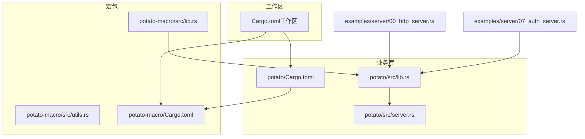
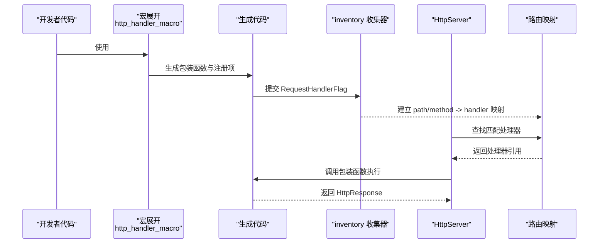
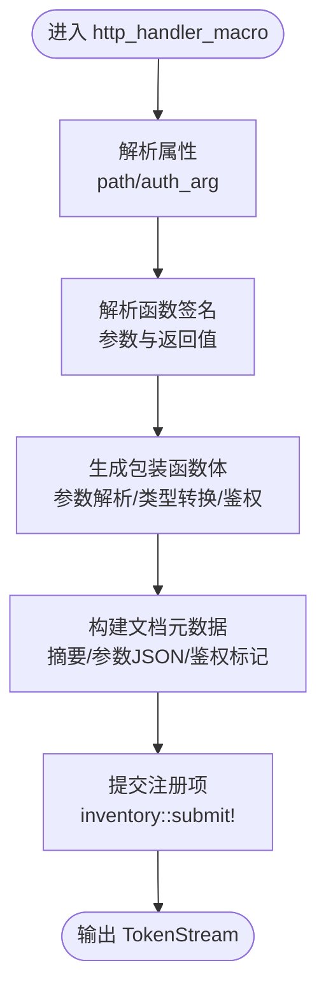
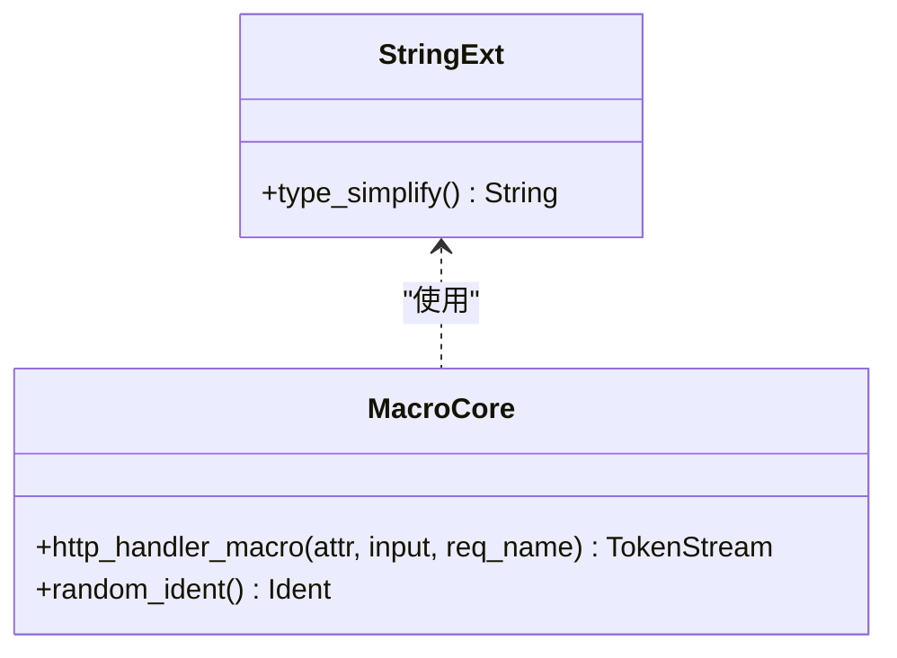
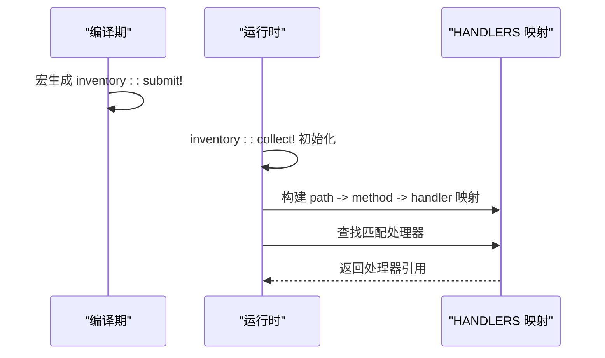
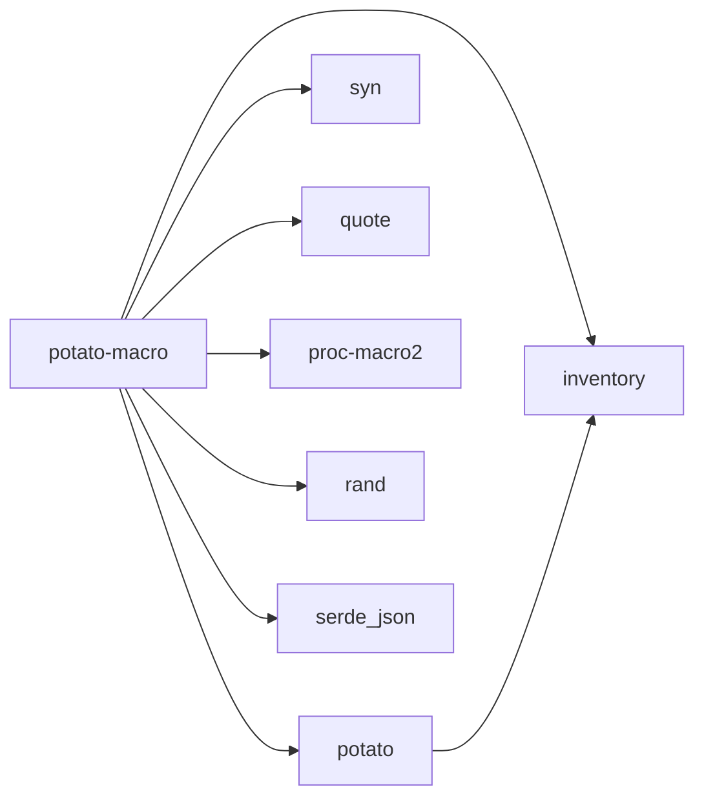

# 宏原理与编译时生成

<cite>
**本文引用的文件**
- [potato-macro/src/lib.rs](file://potato-macro/src/lib.rs)
- [potato-macro/src/utils.rs](file://potato-macro/src/utils.rs)
- [potato/Cargo.toml](file://potato/Cargo.toml)
- [potato-macro/Cargo.toml](file://potato-macro/Cargo.toml)
- [Cargo.toml（工作区）](file://Cargo.toml)
- [examples/server/00_http_server.rs](file://examples/server/00_http_server.rs)
- [examples/server/07_auth_server.rs](file://examples/server/07_auth_server.rs)
- [potato/src/lib.rs](file://potato/src/lib.rs)
- [potato/src/server.rs](file://potato/src/server.rs)
- [README.md](file://README.md)
- [README.zh.md](file://README.zh.md)
</cite>

## 目录
1. [引言](#引言)
2. [项目结构](#项目结构)
3. [核心组件](#核心组件)
4. [架构总览](#架构总览)
5. [详细组件分析](#详细组件分析)
6. [依赖关系分析](#依赖关系分析)
7. [性能考量](#性能考量)
8. [故障排查指南](#故障排查指南)
9. [结论](#结论)
10. [附录](#附录)

## 引言
本文件深入解析 Potato 宏系统的核心原理与编译时代码生成机制，重点覆盖以下方面：
- 宏展开时间点与执行顺序：在编译期由 proc-macro 展开，生成路由注册与函数包装代码，并通过运行时 inventory 收集器在进程启动时完成注册。
- TokenStream 处理、AST 解析与代码生成：使用 syn/quote 解析函数签名、属性与文档注释，生成包装函数与静态注册项。
- 路由注册与函数包装：为每个被宏标注的异步函数生成一个适配器，负责参数解析、类型转换、鉴权校验与返回值包装。
- 类型推断与匹配算法：对参数类型进行白名单匹配与简化，支持基础标量、字符串、文件上传等；对返回值类型进行分支生成。
- 随机标识符生成：使用随机数生成唯一内部标识符，避免命名冲突。
- 安全机制与错误处理策略：严格的参数与返回值类型检查、鉴权头解析与错误响应生成。
- 宏调试技巧与常见编译错误解决：定位宏展开失败、类型不支持、鉴权参数不匹配等问题。
- 性能考虑与最佳实践：减少宏生成代码体积、合理使用类型简化、避免不必要的动态分派。

## 项目结构
仓库采用双 crate 工作区组织，宏定义位于独立 crate 中，业务库依赖该宏 crate 完成编译期扩展与运行时注册。

**图表来源**
- [Cargo.toml（工作区）](file://Cargo.toml#L1-L4)
- [potato-macro/Cargo.toml](file://potato-macro/Cargo.toml#L1-L24)
- [potato/Cargo.toml](file://potato/Cargo.toml#L1-L76)
- [potato/src/lib.rs](file://potato/src/lib.rs#L1-L16)
- [potato/src/server.rs](file://potato/src/server.rs#L1-L20)
- [examples/server/00_http_server.rs](file://examples/server/00_http_server.rs#L1-L12)
- [examples/server/07_auth_server.rs](file://examples/server/07_auth_server.rs#L1-L24)

**章节来源**
- [Cargo.toml（工作区）](file://Cargo.toml#L1-L4)
- [potato/Cargo.toml](file://potato/Cargo.toml#L28-L28)
- [potato-macro/Cargo.toml](file://potato-macro/Cargo.toml#L14-L23)

## 核心组件
- 宏定义与生成器
  - http_get/post/put/delete/options/head：基于统一的 http_handler_macro 生成包装函数与注册项。
  - embed_dir：生成嵌入资源的 derive 并调用加载函数。
  - StandardHeader derive：枚举派生标准头部的解析与应用逻辑。
- 运行时注册与收集
  - inventory::collect! 在运行时收集 RequestHandlerFlag，形成路径到方法的映射。
- 请求适配与类型处理
  - 参数解析：从请求体、查询参数、文件上传中提取并转换为函数参数类型。
  - 返回值包装：根据返回值类型生成统一的 HttpResponse 或文本响应。
  - 文档元数据：汇总摘要、描述、是否鉴权、参数列表等信息。

**章节来源**
- [potato-macro/src/lib.rs](file://potato-macro/src/lib.rs#L26-L300)
- [potato/src/lib.rs](file://potato/src/lib.rs#L152-L175)
- [potato/src/server.rs](file://potato/src/server.rs#L28-L38)

## 架构总览
下图展示从源码到运行时处理的关键流程：宏在编译期展开，生成包装函数与注册项；运行时通过 inventory 收集器建立路由表；请求到达时按路径与方法查找处理器并执行。

**图表来源**
- [potato-macro/src/lib.rs](file://potato-macro/src/lib.rs#L26-L300)
- [potato/src/lib.rs](file://potato/src/lib.rs#L152-L175)
- [potato/src/server.rs](file://potato/src/server.rs#L28-L38)

## 详细组件分析

### 宏处理器与代码生成（http_handler_macro）
- 输入解析
  - 属性解析：支持 path 字面量或键值对形式；支持 auth_arg 指定鉴权参数名。
  - 函数签名解析：遍历参数列表，识别 HttpRequest 引用、PostFile、基础标量类型等。
- 文档元数据
  - 读取文档注释，生成摘要与参数 JSON；控制是否对外展示与是否需要鉴权。
- 参数与返回值处理
  - 参数类型白名单匹配与简化；非 String 类型自动尝试解析与错误处理。
  - 返回值类型分支：Result<(), HttpResponse>、()、HttpResponse 等，统一包装为 HttpResponse。
- 随机标识符
  - 生成唯一内部函数名与中间变量名，避免命名冲突。
- 注册与导出
  - 生成隐藏的包装函数与适配器，并通过 inventory::submit! 注册 RequestHandlerFlag。

**图表来源**
- [potato-macro/src/lib.rs](file://potato-macro/src/lib.rs#L26-L300)

**章节来源**
- [potato-macro/src/lib.rs](file://potato-macro/src/lib.rs#L26-L300)

### TokenStream 处理与 AST 解析
- 使用 syn 解析属性与函数签名，支持 meta::parser 与 require_* 等 API。
- 使用 quote 生成稳定的 TokenStream，确保生成代码可读且可调试。
- 类型简化工具：去除模块前缀与箭头，便于统一比较与分支生成。

**图表来源**
- [potato-macro/src/utils.rs](file://potato-macro/src/utils.rs#L1-L18)
- [potato-macro/src/lib.rs](file://potato-macro/src/lib.rs#L20-L24)

**章节来源**
- [potato-macro/src/utils.rs](file://potato-macro/src/utils.rs#L1-L18)
- [potato-macro/src/lib.rs](file://potato-macro/src/lib.rs#L20-L24)

### 运行时路由注册与查找
- 注册结构
  - RequestHandlerFlag：包含 HTTP 方法、路径、处理器函数指针与文档元数据。
  - inventory::collect! 在编译后收集所有注册项，形成静态映射。
- 查找流程
  - 以路径为一级索引，方法为二级索引；未命中时处理 HEAD/OPTIONS 等特殊场景。
- OpenAPI 文档
  - 基于注册项与文档元数据生成 OpenAPI JSON，支持鉴权与参数类型推断。

**图表来源**
- [potato/src/lib.rs](file://potato/src/lib.rs#L152-L175)
- [potato/src/server.rs](file://potato/src/server.rs#L28-L38)

**章节来源**
- [potato/src/lib.rs](file://potato/src/lib.rs#L152-L175)
- [potato/src/server.rs](file://potato/src/server.rs#L28-L38)

### 示例与用法
- 基础 GET 路由
  - 使用 #[http_get] 注解，返回 HttpResponse。
- 鉴权路由
  - 使用 path 与 auth_arg 组合，要求 Authorization 头并通过 JWT 校验。

**章节来源**
- [examples/server/00_http_server.rs](file://examples/server/00_http_server.rs#L1-L12)
- [examples/server/07_auth_server.rs](file://examples/server/07_auth_server.rs#L1-L24)

## 依赖关系分析
- 工作区成员
  - workspace 成员包含 potato 与 potato-macro，二者通过 Cargo.toml 关联。
- 依赖关系
  - potato 依赖 potato-macro 作为 proc-macro 使用方。
  - 宏 crate 依赖 syn/quote/proc-macro2/inventory/rand/serde_json 等。

**图表来源**
- [Cargo.toml（工作区）](file://Cargo.toml#L1-L4)
- [potato/Cargo.toml](file://potato/Cargo.toml#L28-L28)
- [potato-macro/Cargo.toml](file://potato-macro/Cargo.toml#L14-L23)

**章节来源**
- [Cargo.toml（工作区）](file://Cargo.toml#L1-L4)
- [potato/Cargo.toml](file://potato/Cargo.toml#L28-L28)
- [potato-macro/Cargo.toml](file://potato-macro/Cargo.toml#L14-L23)

## 性能考量
- 宏生成代码体积
  - 尽量复用分支逻辑与常量，避免重复生成相同结构。
- 类型简化与分支
  - 使用类型简化工具减少分支复杂度，提高编译期判断效率。
- 运行时查找
  - 使用两级哈希表（路径->方法->处理器）降低查找成本。
- 静态注册
  - 通过 inventory 在进程启动时一次性收集，避免运行时反射开销。

[本节为通用指导，无需具体文件引用]

## 故障排查指南
- 常见错误与定位
  - 缺少 path 参数：宏会直接 panic，提示需要 path。
  - 路径格式错误：必须以斜杠开头，否则触发 panic。
  - 不支持的参数类型：仅支持白名单内的基础标量与 PostFile，其他类型会触发 panic。
  - auth_arg 类型不符：必须为 String，否则触发 panic。
  - auth_arg 未指向任何参数：若声明了 auth_arg 却未找到对应参数，触发 panic。
  - 返回值类型不支持：仅支持特定分支，其他类型会触发 panic。
- 调试技巧
  - 启用详细日志与错误回退：在包装函数中返回 HttpResponse::error，便于定位问题。
  - 分步验证：先最小化函数签名与返回值，逐步增加复杂度。
  - 使用文档注释：通过 doc 注释生成 OpenAPI 文档，辅助验证参数与鉴权需求。

**章节来源**
- [potato-macro/src/lib.rs](file://potato-macro/src/lib.rs#L28-L65)
- [potato-macro/src/lib.rs](file://potato-macro/src/lib.rs#L119-L191)
- [potato-macro/src/lib.rs](file://potato-macro/src/lib.rs#L199-L274)

## 结论
Potato 的宏系统通过编译期代码生成实现了“零运行时开销”的路由注册与函数包装，结合运行时 inventory 收集器与两级哈希映射，提供了高效稳定的请求处理链路。宏在编译期完成类型检查、参数解析与文档元数据生成，显著降低了运行时负担。配合清晰的错误处理与调试策略，开发者可以快速定位问题并优化性能。

[本节为总结性内容，无需具体文件引用]

## 附录
- 快速开始
  - 参考示例与文档，添加依赖并编写第一个 http_get 路由。
- 最佳实践
  - 使用 path 与 auth_arg 明确路由与鉴权需求。
  - 控制参数数量与类型，优先使用基础标量与 PostFile。
  - 利用 OpenAPI 功能自动生成接口文档，提升协作效率。

**章节来源**
- [README.md](file://README.md#L14-L35)
- [README.zh.md](file://README.zh.md#L14-L35)