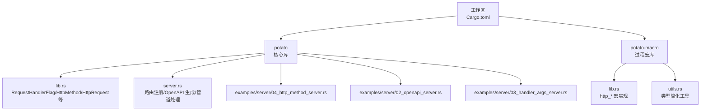
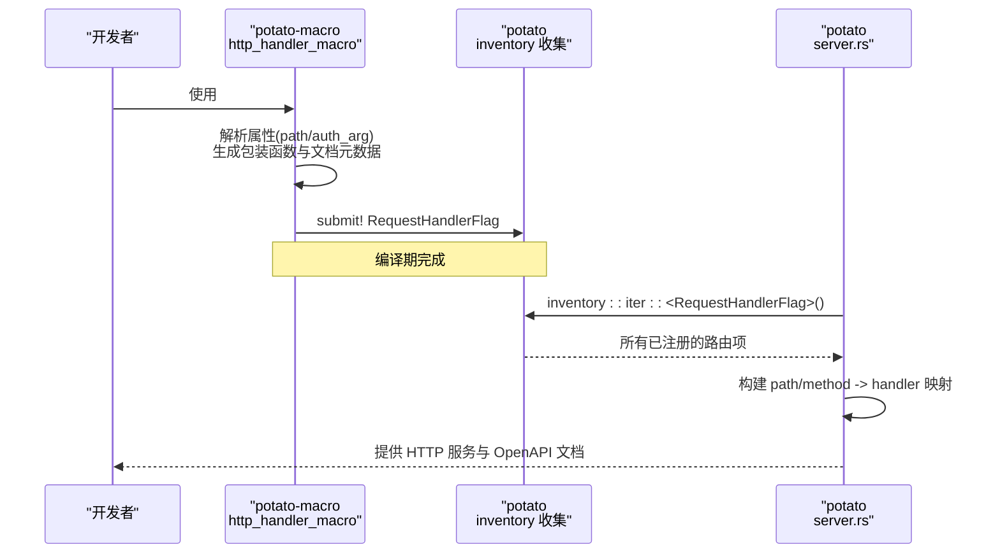
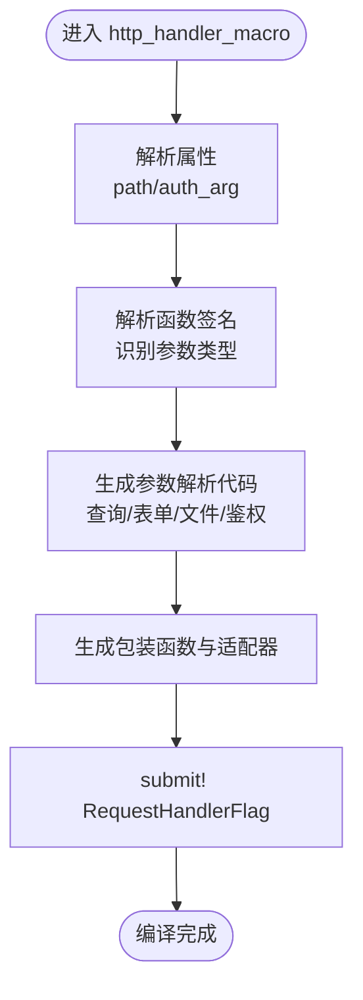
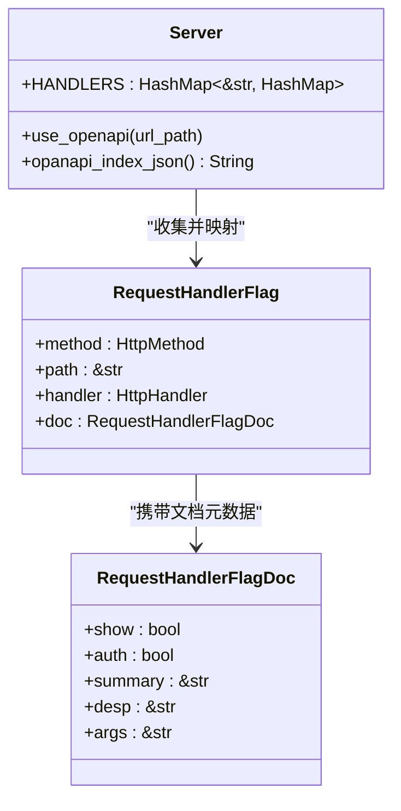
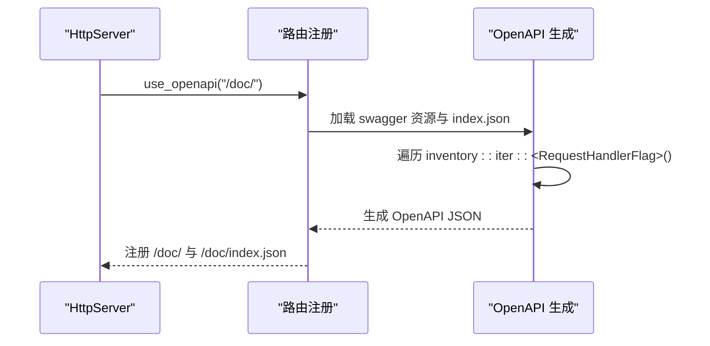
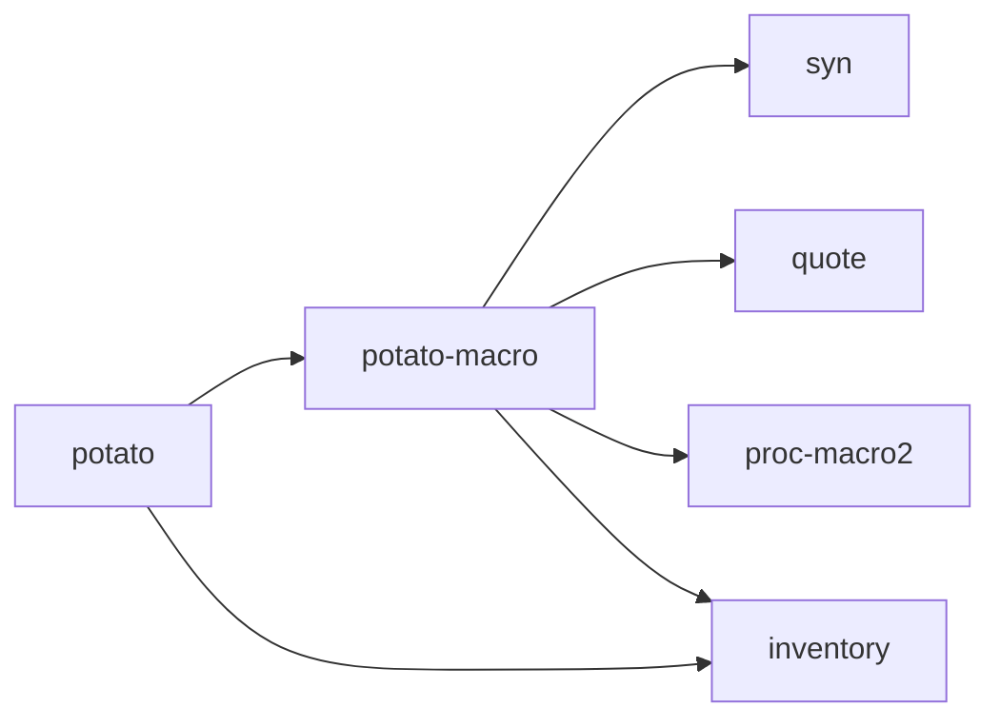

# 宏系统

<cite>
**本文引用的文件**
- [Cargo.toml](file://Cargo.toml)
- [Cargo.toml](file://potato/Cargo.toml)
- [Cargo.toml](file://potato-macro/Cargo.toml)
- [lib.rs](file://potato-macro/src/lib.rs)
- [utils.rs](file://potato-macro/src/utils.rs)
- [lib.rs](file://potato/src/lib.rs)
- [server.rs](file://potato/src/server.rs)
- [04_http_method_server.rs](file://examples/server/04_http_method_server.rs)
- [02_openapi_server.rs](file://examples/server/02_openapi_server.rs)
- [03_handler_args_server.rs](file://examples/server/03_handler_args_server.rs)
- [02_method_annotation.md](file://docs/guide/02_method_annotation.md)
- [03_method_declare.md](file://docs/guide/03_method_declare.md)
- [README.md](file://README.md)
</cite>

## 目录
1. [简介](#简介)
2. [项目结构](#项目结构)
3. [核心组件](#核心组件)
4. [架构总览](#架构总览)
5. [详细组件分析](#详细组件分析)
6. [依赖关系分析](#依赖关系分析)
7. [性能考量](#性能考量)
8. [故障排查指南](#故障排查指南)
9. [结论](#结论)
10. [附录](#附录)

## 简介
本文件深入解析 Potato 宏系统的设计与实现，重点覆盖以下方面：
- 宏处理器工作原理：编译时代码生成与运行时注册机制
- HTTP 方法宏的使用：http_get、http_post、http_put、http_delete、http_options、http_head 的参数配置与返回值处理
- 参数绑定与验证：路径参数、查询参数、请求体参数的自动解析
- OpenAPI 文档自动生成：实现原理与配置方法
- 自定义宏开发指南：宏规则定义与代码生成模板
- 调试技巧与常见问题解决方案

## 项目结构
仓库采用工作区组织，包含两个主要成员包：
- potato：核心库，提供 HTTP 服务、客户端、WebSocket、OpenAPI 文档等能力
- potato-macro：过程宏库，提供 http_* 宏、嵌入资源宏、派生宏等



图表来源
- [Cargo.toml](file://Cargo.toml#L1-L4)
- [Cargo.toml](file://potato/Cargo.toml#L1-L76)
- [Cargo.toml](file://potato-macro/Cargo.toml#L1-L24)

章节来源
- [Cargo.toml](file://Cargo.toml#L1-L4)
- [Cargo.toml](file://potato/Cargo.toml#L1-L76)
- [Cargo.toml](file://potato-macro/Cargo.toml#L1-L24)

## 核心组件
- 过程宏库（potato-macro）：提供 http_get/post/put/delete/options/head 宏，负责将标注转换为可执行的异步处理函数，并通过 inventory 在运行时注册到全局路由表
- 核心库（potato）：提供 RequestHandlerFlag、HttpMethod、HttpRequest、HttpResponse 等运行时基础设施；通过 inventory 收集宏注册的路由项，构建路由映射并在服务启动时生效
- 示例与文档：展示宏的使用方式、参数绑定、OpenAPI 自动生成等

章节来源
- [lib.rs](file://potato-macro/src/lib.rs#L26-L300)
- [lib.rs](file://potato/src/lib.rs#L126-L175)
- [server.rs](file://potato/src/server.rs#L28-L38)

## 架构总览
下图展示了从源码编写到运行时路由生效的关键流程：宏在编译期生成包装函数并提交到 inventory，运行时由 server.rs 建立路由映射，最终对外提供 HTTP 服务与 OpenAPI 文档。



图表来源
- [lib.rs](file://potato-macro/src/lib.rs#L26-L300)
- [lib.rs](file://potato/src/lib.rs#L175-L175)
- [server.rs](file://potato/src/server.rs#L28-L38)

## 详细组件分析

### 宏处理器与编译时代码生成
- 属性解析：支持两种写法
  - 直接传入路径字符串
  - 使用命名属性 path 与 auth_arg 指定路径与鉴权参数名
- 函数签名解析：识别 HttpRequest 引用、PostFile、基础标量类型（String/布尔/整数/浮点），并生成参数解析逻辑
- 鉴权参数：当标注中声明 auth_arg 时，会在运行时从 Authorization 头提取 Bearer Token 并进行 JWT 校验，校验失败直接返回错误响应
- 包装函数生成：生成一个异步包装函数与一个返回 Pin<Box<...>> 的适配器函数，最终以 RequestHandlerFlag 形式提交给 inventory
- 文档元数据：收集函数的 doc 注释摘要、是否显示、是否需要鉴权、参数列表（JSON 字符串）等信息



图表来源
- [lib.rs](file://potato-macro/src/lib.rs#L26-L300)

章节来源
- [lib.rs](file://potato-macro/src/lib.rs#L26-L300)
- [utils.rs](file://potato-macro/src/utils.rs#L1-L19)

### HTTP 方法宏与参数绑定
- 支持的方法：http_get、http_post、http_put、http_delete、http_options、http_head
- 参数绑定规则：
  - HttpRequest 引用：直接注入请求对象
  - PostFile：从 multipart/form-data 中解析文件字段
  - 基础标量类型：优先从 URL 查询参数解析，若缺失则尝试从表单或 JSON 请求体解析；非 String 类型会进行类型转换，失败则返回错误
- 返回值处理：支持 ()、Result<(), E>、HttpResponse、Result<HttpResponse, E> 四种模式，分别映射为固定文本、错误转 HttpResponse 或直接返回

```mermaid
flowchart TD
A["收到请求"] --> B{"参数类型？"}
B --> |HttpRequest| C["直接注入 req"]
B --> |PostFile| D["从 body_files 查找文件"]
B --> |标量类型| E["先查 query，再查表单/JSON"]
E --> F{"类型转换成功？"}
F --> |否| G["返回错误响应"]
F --> |是| H["调用用户函数"]
C --> H
D --> H
H --> I{"返回类型？"}
I --> |()| J["返回 ok 文本"]
I --> |Result<(), _>| J
I --> |HttpResponse| K["直接返回"]
I --> |Result<HttpResponse, _>| K
```

图表来源
- [lib.rs](file://potato-macro/src/lib.rs#L106-L274)
- [03_method_declare.md](file://docs/guide/03_method_declare.md#L36-L53)

章节来源
- [04_http_method_server.rs](file://examples/server/04_http_method_server.rs#L1-L42)
- [03_handler_args_server.rs](file://examples/server/03_handler_args_server.rs#L1-L32)
- [03_method_declare.md](file://docs/guide/03_method_declare.md#L1-L53)

### 运行时注册与路由查找
- 运行时收集：通过 inventory::collect!(RequestHandlerFlag) 在编译期提交的路由项在运行时被收集
- 路由映射：server.rs 将所有 RequestHandlerFlag 按路径与方法建立映射，用于请求到达时的快速匹配
- OpenAPI 生成：遍历所有已注册的 RequestHandlerFlag，基于 doc 元数据生成 OpenAPI JSON，并嵌入静态资源提供在线文档页面



图表来源
- [lib.rs](file://potato/src/lib.rs#L126-L175)
- [server.rs](file://potato/src/server.rs#L28-L38)
- [server.rs](file://potato/src/server.rs#L133-L317)

章节来源
- [lib.rs](file://potato/src/lib.rs#L126-L175)
- [server.rs](file://potato/src/server.rs#L28-L38)
- [server.rs](file://potato/src/server.rs#L133-L317)

### OpenAPI 文档自动生成
- 触发方式：在服务配置中启用 use_openapi(url_path)，会将内置 Swagger UI 资源与动态生成的 index.json 注册为路由
- 动态生成：遍历 inventory 中的 RequestHandlerFlag，提取摘要、描述、参数类型、是否鉴权等信息，组装成 OpenAPI 3.1 文档
- 安全方案：若存在鉴权参数，自动添加 Bearer JWT 安全方案



图表来源
- [server.rs](file://potato/src/server.rs#L276-L317)
- [server.rs](file://potato/src/server.rs#L133-L273)

章节来源
- [02_openapi_server.rs](file://examples/server/02_openapi_server.rs#L1-L16)
- [server.rs](file://potato/src/server.rs#L133-L317)

### 自定义宏开发指南
- 基于 syn/quote：解析输入函数签名、生成包装函数、构造 RequestHandlerFlag
- 元数据收集：将 doc 注释、是否显示、是否鉴权、参数列表（JSON）等打包进 RequestHandlerFlagDoc
- 注册机制：使用 inventory::submit! 将路由项提交到全局集合
- 参考实现：可参照 http_handler_macro 的实现模式，扩展新的宏或派生宏

章节来源
- [lib.rs](file://potato-macro/src/lib.rs#L26-L300)
- [lib.rs](file://potato/src/lib.rs#L126-L175)

## 依赖关系分析
- 工作区成员：Cargo.toml 指定 potato 与 potato-macro 为成员包
- 依赖关系：
  - potato 依赖 potato-macro 作为外部宏库
  - potato-macro 依赖 syn/quote/proc-macro2/inventory 等过程宏生态库
  - 运行时依赖 inventory 收集宏提交的路由项



图表来源
- [Cargo.toml](file://Cargo.toml#L1-L4)
- [Cargo.toml](file://potato/Cargo.toml#L16-L41)
- [Cargo.toml](file://potato-macro/Cargo.toml#L14-L20)

章节来源
- [Cargo.toml](file://Cargo.toml#L1-L4)
- [Cargo.toml](file://potato/Cargo.toml#L16-L41)
- [Cargo.toml](file://potato-macro/Cargo.toml#L14-L20)

## 性能考量
- 编译期开销：宏展开与代码生成在编译阶段完成，运行时仅保留少量包装与分发逻辑
- 运行时开销：inventory::iter 在首次访问时建立路由映射，后续按路径+方法 O(1) 查找
- 请求体解析：针对不同 Content-Type 分支解析，避免不必要的转换；建议在高频接口中尽量使用简单参数类型
- OpenAPI 生成：仅在启用 use_openapi 时生成 JSON，且为静态资源嵌入，不影响业务请求路径

## 故障排查指南
- 路由未生效
  - 检查宏是否正确导入：确保使用 use 语句引入 potato_macro
  - 确认宏标注语法正确，path 必须以斜杠开头
  - 确认函数签名与参数类型符合支持范围
- 参数缺失或类型不匹配
  - 检查查询参数名与函数形参名一致
  - 对于非 String 类型，确认请求体中的值可被解析为目标类型
- 鉴权失败
  - 确保 Authorization 头格式为 Bearer Token
  - 确认 auth_arg 指向的参数名为 String 类型
  - 检查 JWT 密钥配置是否正确
- OpenAPI 文档为空
  - 确认已调用 use_openapi 并正确设置路径
  - 检查函数 doc 注释是否隐藏（hidden）

章节来源
- [lib.rs](file://potato-macro/src/lib.rs#L26-L65)
- [lib.rs](file://potato-macro/src/lib.rs#L130-L191)
- [server.rs](file://potato/src/server.rs#L133-L317)
- [02_method_annotation.md](file://docs/guide/02_method_annotation.md#L23-L39)

## 结论
Potato 的宏系统通过“编译时代码生成 + 运行时注册”的组合，实现了简洁而强大的 HTTP 路由定义与文档生成能力。宏处理器对参数绑定与类型转换进行了统一抽象，配合 inventory 的运行时收集，使得路由注册与 OpenAPI 文档生成高度自动化。对于开发者而言，只需专注于业务逻辑，其余细节由宏与运行时框架自动处理。

## 附录
- 快速开始示例参考
  - HTTP 方法宏示例：[04_http_method_server.rs](file://examples/server/04_http_method_server.rs#L1-L42)
  - OpenAPI 文档示例：[02_openapi_server.rs](file://examples/server/02_openapi_server.rs#L1-L16)
  - 参数绑定示例：[03_handler_args_server.rs](file://examples/server/03_handler_args_server.rs#L1-L32)
- 官方文档与示例
  - 方法标注说明：[02_method_annotation.md](file://docs/guide/02_method_annotation.md#L1-L39)
  - 处理函数声明与返回类型：[03_method_declare.md](file://docs/guide/03_method_declare.md#L1-L53)
  - 项目总览与示例入口：[README.md](file://README.md#L1-L57)