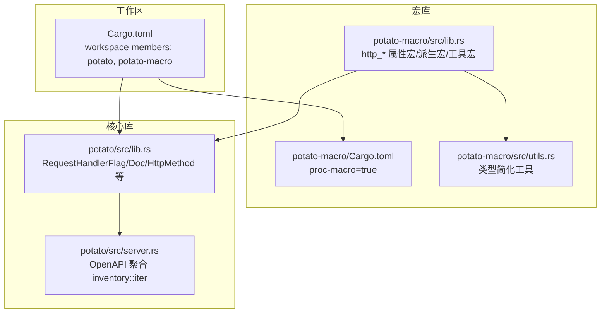
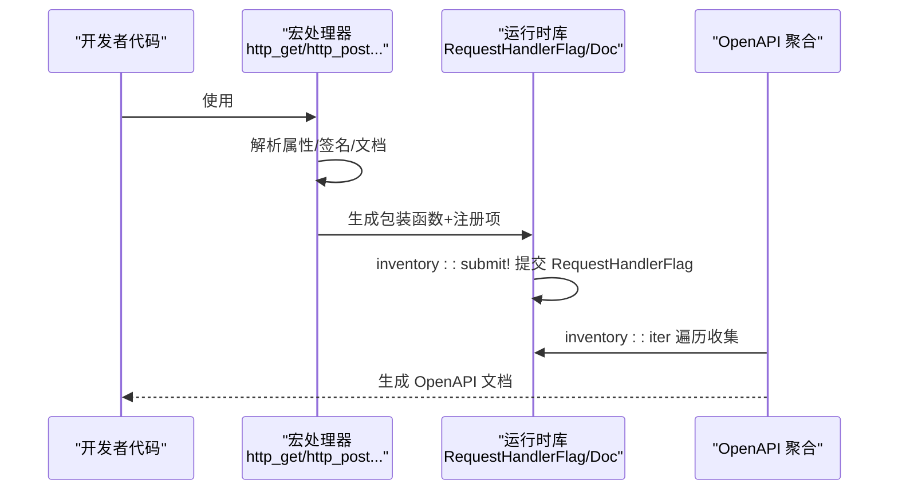
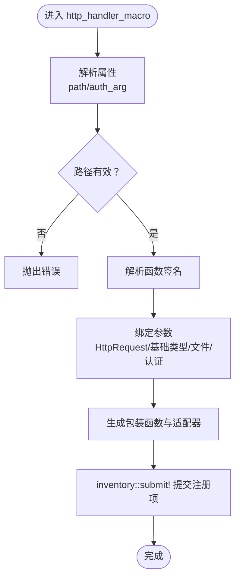
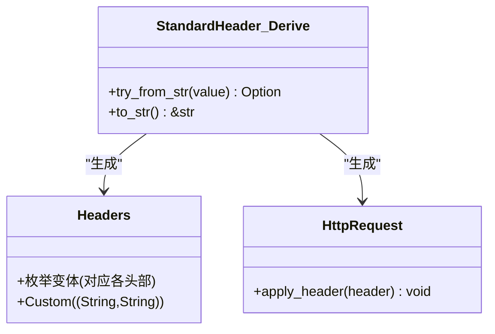
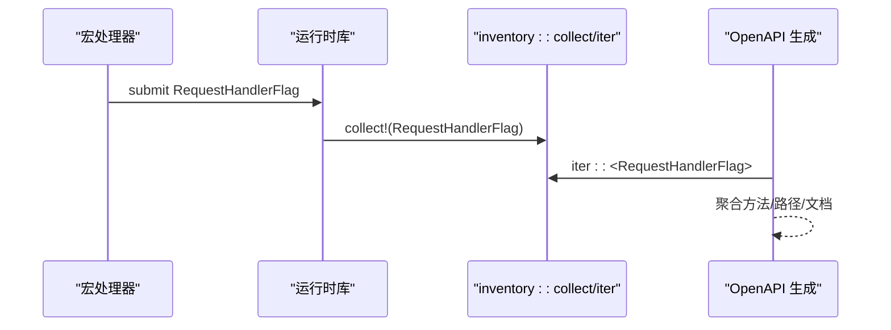
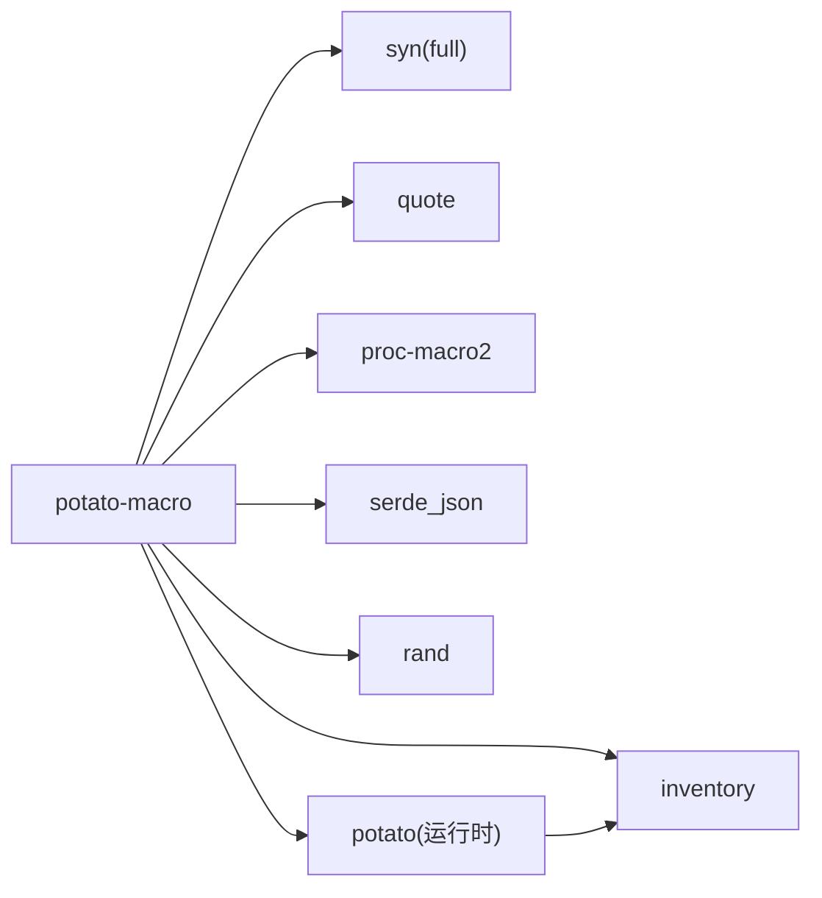

# 自定义宏开发

<cite>
**本文引用的文件**
- [Cargo.toml](file://Cargo.toml)
- [README.md](file://README.md)
- [potato-macro/Cargo.toml](file://potato-macro/Cargo.toml)
- [potato-macro/src/lib.rs](file://potato-macro/src/lib.rs)
- [potato-macro/src/utils.rs](file://potato-macro/src/utils.rs)
- [potato/src/lib.rs](file://potato/src/lib.rs)
- [potato/src/server.rs](file://potato/src/server.rs)
- [examples/server/00_http_server.rs](file://examples/server/00_http_server.rs)
- [docs/guide/00_introduction.md](file://docs/guide/00_introduction.md)
- [docs/guide/01_hello_world.md](file://docs/guide/01_hello_world.md)
- [docs/guide/02_method_annotation.md](file://docs/guide/02_method_annotation.md)
- [docs/guide/03_method_declare.md](file://docs/guide/03_method_declare.md)
</cite>

## 目录
1. [简介](#简介)
2. [项目结构](#项目结构)
3. [核心组件](#核心组件)
4. [架构总览](#架构总览)
5. [详细组件分析](#详细组件分析)
6. [依赖关系分析](#依赖关系分析)
7. [性能考量](#性能考量)
8. [故障排查指南](#故障排查指南)
9. [结论](#结论)
10. [附录](#附录)

## 简介
本指南面向希望基于 Potato 宏系统开发自定义宏处理器的工程师，覆盖以下主题：
- 基于现有宏系统的扩展点与插件机制
- 宏规则定义、输入解析与代码生成的关键技术要点
- 编写 proc-macro 的规范与最佳实践
- 自定义宏的开发模板与示例路径
- 测试策略与调试方法
- 安全考虑与性能优化建议
- 从简单宏到复杂宏的完整开发流程

## 项目结构
仓库采用工作区组织，包含核心库与宏库两个成员：
- 工作区配置：根目录 Cargo.toml
- 宏库：potato-macro（proc-macro 库，提供 http_* 属性宏、派生宏与工具宏）
- 核心库：potato（运行时库，负责 HTTP 服务、OpenAPI 收集等）

图表来源
- [Cargo.toml](file://Cargo.toml#L1-L4)
- [potato-macro/Cargo.toml](file://potato-macro/Cargo.toml#L1-L24)
- [potato-macro/src/lib.rs](file://potato-macro/src/lib.rs#L1-L399)
- [potato/src/lib.rs](file://potato/src/lib.rs#L126-L175)
- [potato/src/server.rs](file://potato/src/server.rs#L133-L163)

章节来源
- [Cargo.toml](file://Cargo.toml#L1-L4)
- [README.md](file://README.md#L1-L57)

## 核心组件
- 宏库（potato-macro）提供三类宏：
  - 属性宏：http_get/http_post/http_put/http_delete/http_options/http_head
  - 派生宏：StandardHeader
  - 工具宏：embed_dir
- 运行时库（potato）通过 inventory 收集宏生成的 RequestHandlerFlag，构建 OpenAPI 文档与路由表。

关键实现要点：
- 使用 syn 解析输入，quote 生成输出 TokenStream
- 使用 inventory 在编译期收集处理器注册信息
- 使用 serde_json 构造文档元数据（如参数列表）
- 使用随机标识符避免命名冲突

章节来源
- [potato-macro/src/lib.rs](file://potato-macro/src/lib.rs#L1-L399)
- [potato/src/lib.rs](file://potato/src/lib.rs#L126-L175)

## 架构总览
下图展示了从用户代码到运行时注册的整体流程：

图表来源
- [potato-macro/src/lib.rs](file://potato-macro/src/lib.rs#L26-L300)
- [potato/src/lib.rs](file://potato/src/lib.rs#L126-L175)
- [potato/src/server.rs](file://potato/src/server.rs#L133-L163)

## 详细组件分析

### 组件A：HTTP 属性宏（http_get/http_post/...）
- 功能：将标注函数包装为异步处理器，并通过 inventory 注册到 RequestHandlerFlag
- 输入解析：
  - 支持两种形式：直接传入路径字符串，或以键值对形式传入 path 与 auth_arg
  - 校验路径必须以 “/” 开头；未提供 path 时抛错
- 参数绑定：
  - 特殊参数：HttpRequest 引用
  - 基础类型参数：String/布尔/整数/浮点等，自动从 query 或 body 解析
  - 文件参数：PostFile，从 multipart/form-data 中提取
  - 认证参数：auth_arg 指向的参数需为 String，从 Authorization 头中解析 JWT 并校验
- 返回类型：
  - ()、Result<(), E>、HttpResponse、Result<HttpResponse, E> 四种模式
- 代码生成：
  - 生成两个辅助函数：一个异步包装器，一个返回 Pin<Box<dyn Future>> 的适配器
  - 使用 inventory::submit! 提交 RequestHandlerFlag，包含方法、路径、处理器与文档元数据

图表来源
- [potato-macro/src/lib.rs](file://potato-macro/src/lib.rs#L26-L300)

章节来源
- [potato-macro/src/lib.rs](file://potato-macro/src/lib.rs#L26-L300)
- [docs/guide/02_method_annotation.md](file://docs/guide/02_method_annotation.md#L1-L39)
- [docs/guide/03_method_declare.md](file://docs/guide/03_method_declare.md#L1-L53)

### 组件B：StandardHeader 派生宏
- 功能：为枚举生成标准 HTTP 头部的互转与应用逻辑
- 输入：仅支持无字段变体的枚举
- 输出：
  - 实现 try_from_str 与 to_str 方法
  - 生成 Headers 枚举与 HttpRequest.apply_header 方法
- 用途：简化头部设置与解析

图表来源
- [potato-macro/src/lib.rs](file://potato-macro/src/lib.rs#L345-L398)

章节来源
- [potato-macro/src/lib.rs](file://potato-macro/src/lib.rs#L345-L398)

### 组件C：embed_dir 工具宏
- 功能：将目录打包为嵌入资源并加载
- 输入：字面量字符串（目录路径）
- 输出：生成 Embed 派生并调用 load_embed 加载

章节来源
- [potato-macro/src/lib.rs](file://potato-macro/src/lib.rs#L332-L343)

### 组件D：运行时注册与 OpenAPI 聚合
- 运行时通过 inventory::collect!(RequestHandlerFlag) 收集宏注册的处理器
- OpenAPI 聚合遍历 inventory::iter，生成文档索引与路径映射

图表来源
- [potato/src/lib.rs](file://potato/src/lib.rs#L126-L175)
- [potato/src/server.rs](file://potato/src/server.rs#L133-L163)

章节来源
- [potato/src/lib.rs](file://potato/src/lib.rs#L126-L175)
- [potato/src/server.rs](file://potato/src/server.rs#L133-L163)

## 依赖关系分析
- 宏库依赖：
  - syn（full 特性）：解析 Rust AST
  - quote/proc-macro2：生成 TokenStream
  - serde_json：序列化文档元数据
  - inventory：编译期收集注册项
  - rand：生成唯一标识符
- 运行时库依赖 inventory：运行期遍历注册项

图表来源
- [potato-macro/Cargo.toml](file://potato-macro/Cargo.toml#L14-L24)
- [potato/src/lib.rs](file://potato/src/lib.rs#L126-L175)

章节来源
- [potato-macro/Cargo.toml](file://potato-macro/Cargo.toml#L14-L24)
- [Cargo.toml](file://Cargo.toml#L1-L4)

## 性能考量
- TokenStream 生成与拼接
  - 尽量复用 quote 块，减少中间变量与字符串拼接
  - 对重复生成的片段进行常量化（如静态集合、常量字符串）
- 类型简化与字符串处理
  - 使用 StringExt.type_simplify 减少冗余前缀，提升可读性与一致性
- 随机标识符
  - 使用 rand 生成唯一标识符，避免命名冲突，同时注意生成成本
- 文档元数据
  - 仅在必要时序列化 JSON，避免在热路径中频繁计算

章节来源
- [potato-macro/src/utils.rs](file://potato-macro/src/utils.rs#L1-L19)
- [potato-macro/src/lib.rs](file://potato-macro/src/lib.rs#L11-L24)

## 故障排查指南
- 常见错误与定位
  - 缺少 path 属性：宏会直接抛错，检查宏属性是否正确传入
  - 路径不以 “/” 开头：宏会抛错，修正为绝对路径
  - 不支持的参数类型：仅支持特定基础类型与 PostFile，其余类型会抛错
  - auth_arg 指向不存在参数：宏会抛错，确保参数名与签名一致
  - 认证失败：Authorization 头缺失或 JWT 校验失败，返回 401
- 调试技巧
  - 使用 cargo expand 查看宏展开后的代码，确认生成的包装函数与注册项
  - 在宏内部打印中间结果（如解析到的参数、生成的 TokenStream），便于定位问题
  - 分模块测试：先验证参数绑定，再验证返回类型，最后验证注册与 OpenAPI 聚合
- 运行期验证
  - 通过 inventory::iter 验证 RequestHandlerFlag 是否被正确收集
  - 手动访问 /openapi 路由（若启用）查看生成的文档

章节来源
- [potato-macro/src/lib.rs](file://potato-macro/src/lib.rs#L26-L300)
- [potato/src/lib.rs](file://potato/src/lib.rs#L126-L175)
- [docs/guide/02_method_annotation.md](file://docs/guide/02_method_annotation.md#L23-L39)

## 结论
Potato 宏系统通过简洁的 API 与完善的编译期/运行期协作，实现了从函数标注到路由注册与文档聚合的完整链路。开发者可基于现有宏扩展点快速开发自定义宏处理器，遵循本文的规范与最佳实践，即可高效、安全地构建高性能的 HTTP 宏生态。

## 附录

### 开发模板与示例路径
- 最小可用属性宏模板
  - 参考：[http_get 属性宏实现](file://potato-macro/src/lib.rs#L302-L330)
- 派生宏模板
  - 参考：[StandardHeader 派生宏实现](file://potato-macro/src/lib.rs#L345-L398)
- 工具宏模板
  - 參考：[embed_dir 工具宏实现](file://potato-macro/src/lib.rs#L332-L343)
- 示例用法
  - 服务器端示例：[00_http_server.rs](file://examples/server/00_http_server.rs#L1-L12)
  - 文档示例：[01_hello_world.md](file://docs/guide/01_hello_world.md#L15-L27)

### 宏规则定义与输入解析要点
- 属性解析
  - 支持直接传入路径字符串或键值对（path/auth_arg）
  - 使用 syn::meta::parser 解析键值对属性
- 函数签名解析
  - 识别 HttpRequest 引用、基础类型、PostFile
  - 对基础类型进行字符串到目标类型的转换
- 文档元数据
  - 收集 doc 注释、参数类型与名称，序列化为 JSON 字符串

章节来源
- [potato-macro/src/lib.rs](file://potato-macro/src/lib.rs#L26-L300)
- [docs/guide/02_method_annotation.md](file://docs/guide/02_method_annotation.md#L1-L39)
- [docs/guide/03_method_declare.md](file://docs/guide/03_method_declare.md#L1-L53)

### 代码生成技术要点
- 包装函数与适配器
  - 生成异步包装器与 Pin<Box<...>> 适配器，保证统一的处理器签名
- 注册与收集
  - 使用 inventory::submit!/collect! 完成编译期提交与运行期收集
- OpenAPI 聚合
  - 通过 inventory::iter 遍历 RequestHandlerFlag，生成文档索引

章节来源
- [potato-macro/src/lib.rs](file://potato-macro/src/lib.rs#L280-L296)
- [potato/src/lib.rs](file://potato/src/lib.rs#L126-L175)
- [potato/src/server.rs](file://potato/src/server.rs#L133-L163)

### 测试策略与调试方法
- 单元测试
  - 针对宏输入（不同属性组合、参数类型）编写测试用例，验证 TokenStream 生成
- 集成测试
  - 在示例工程中集成宏，启动服务器，验证路由注册与 OpenAPI 文档
- 调试
  - 使用 cargo expand 查看展开代码
  - 在宏内部输出中间状态（如解析到的参数、生成的代码片段）

章节来源
- [README.md](file://README.md#L21-L50)
- [docs/guide/01_hello_world.md](file://docs/guide/01_hello_world.md#L15-L27)

### 安全考虑
- 认证参数
  - auth_arg 必须为 String 类型，从 Authorization 头解析并校验 JWT
  - 未提供或校验失败时直接返回 401，不执行业务函数
- 参数校验
  - 对基础类型参数进行严格解析与类型转换，缺失或类型不符时返回错误响应
- 资源暴露
  - OpenAPI 文档仅展示标记为可见的处理器，隐藏敏感接口

章节来源
- [potato-macro/src/lib.rs](file://potato-macro/src/lib.rs#L130-L191)
- [docs/guide/02_method_annotation.md](file://docs/guide/02_method_annotation.md#L23-L39)

### 从简单宏到复杂宏的完整开发流程
- 步骤一：确定目标
  - 明确宏要解决的问题域（如路由、序列化、头部处理等）
- 步骤二：设计接口
  - 设计属性/参数/返回值约定，参考现有宏的风格
- 步骤三：实现解析与生成
  - 使用 syn 解析输入，quote 生成输出
- 步骤四：注册与收集
  - 如需运行期参与，使用 inventory 提交/收集注册项
- 步骤五：文档与聚合
  - 生成文档元数据，接入 OpenAPI 聚合
- 步骤六：测试与调试
  - 编写单元与集成测试，使用 cargo expand 辅助调试
- 步骤七：发布与维护
  - 发布宏包，保持与运行时库的兼容性

章节来源
- [docs/guide/00_introduction.md](file://docs/guide/00_introduction.md#L1-L76)
- [docs/guide/01_hello_world.md](file://docs/guide/01_hello_world.md#L1-L41)