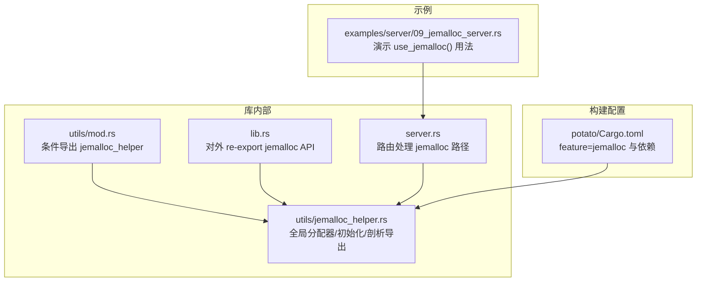
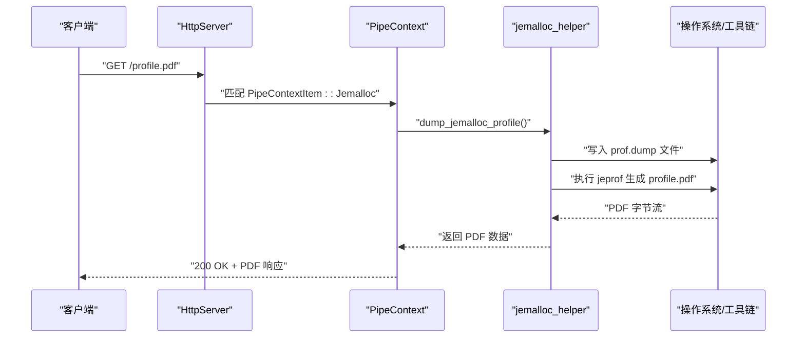
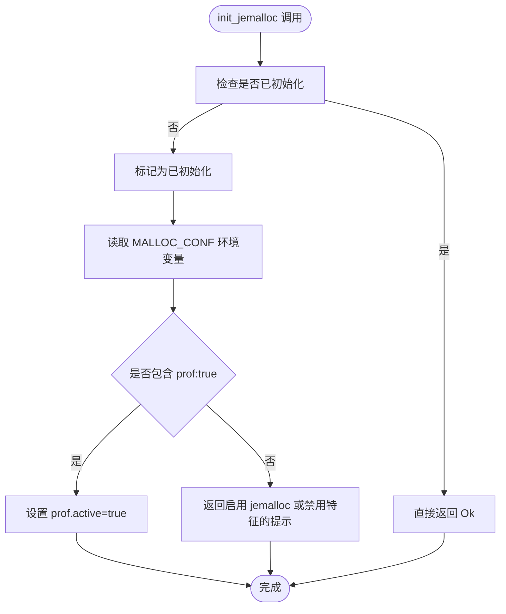
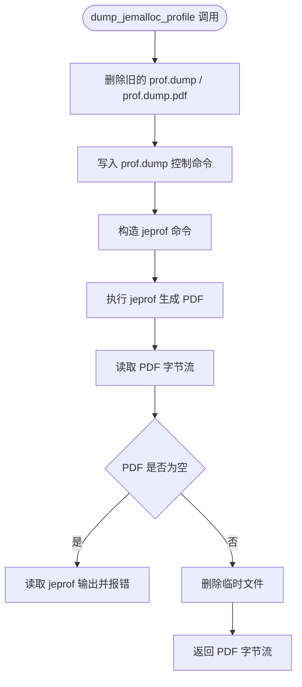
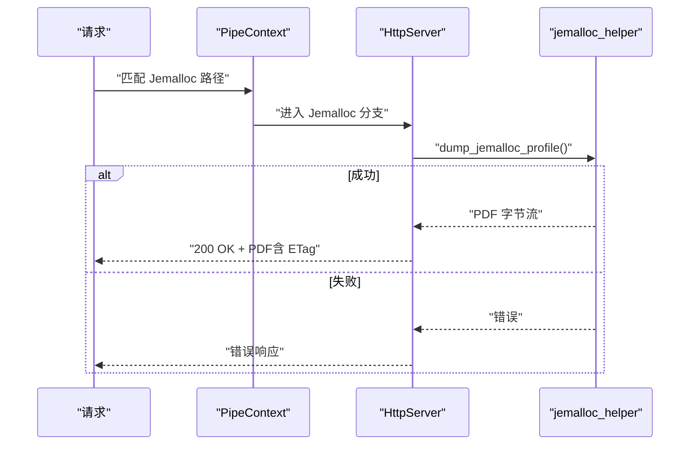
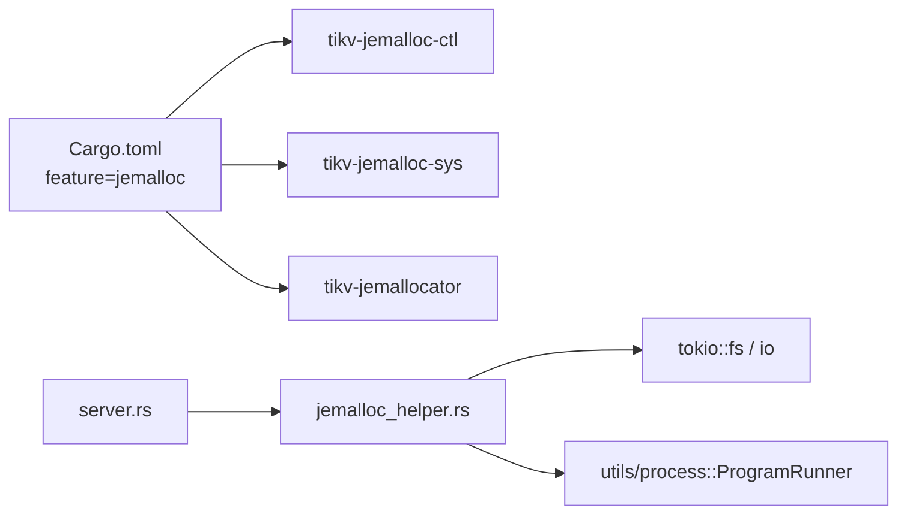

# 内存管理辅助

<cite>
**本文档引用的文件**
- [jemalloc_helper.rs](file://potato/src/utils/jemalloc_helper.rs)
- [server.rs](file://potato/src/server.rs)
- [lib.rs](file://potato/src/lib.rs)
- [Cargo.toml（主包）](file://potato/Cargo.toml)
- [09_jemalloc_server.rs](file://examples/server/09_jemalloc_server.rs)
- [mod.rs（utils）](file://potato/src/utils/mod.rs)
</cite>

## 目录
1. [简介](#简介)
2. [项目结构](#项目结构)
3. [核心组件](#核心组件)
4. [架构总览](#架构总览)
5. [组件详解](#组件详解)
6. [依赖关系分析](#依赖关系分析)
7. [性能考量](#性能考量)
8. [故障排查指南](#故障排查指南)
9. [结论](#结论)
10. [附录](#附录)

## 简介
本文件系统性梳理“内存管理辅助”模块，重点覆盖以下方面：
- jemalloc 集成：全局分配器启用、初始化与性能剖析触发
- 内存使用监控：通过 jemalloc profiling 导出 PDF 剖析报告
- 内存池与对象复用：当前仓库未提供专用内存池实现，但可结合 jemalloc 的线程缓存与后台回收特性进行高并发优化
- 实战示例：在高并发场景下如何开启 jemalloc 并导出内存剖析图
- 调试与调优：基于环境变量与命令行工具的内存问题定位方法

## 项目结构
与内存管理辅助直接相关的代码主要位于：
- utils 子模块中的 jemalloc 辅助模块
- 服务器路由中对 jemalloc profile 的导出能力
- 主库对外暴露的 API 与特征开关
- 示例工程中的 jemalloc 使用方式

图表来源
- [mod.rs（utils）](file://potato/src/utils/mod.rs#L1-L12)
- [jemalloc_helper.rs](file://potato/src/utils/jemalloc_helper.rs#L1-L71)
- [server.rs](file://potato/src/server.rs#L629-L667)
- [lib.rs](file://potato/src/lib.rs#L17-L18)
- [Cargo.toml（主包）](file://potato/Cargo.toml#L43-L76)
- [09_jemalloc_server.rs](file://examples/server/09_jemalloc_server.rs#L1-L16)

章节来源
- [mod.rs（utils）](file://potato/src/utils/mod.rs#L1-L12)
- [jemalloc_helper.rs](file://potato/src/utils/jemalloc_helper.rs#L1-L71)
- [server.rs](file://potato/src/server.rs#L629-L667)
- [lib.rs](file://potato/src/lib.rs#L17-L18)
- [Cargo.toml（主包）](file://potato/Cargo.toml#L43-L76)
- [09_jemalloc_server.rs](file://examples/server/09_jemalloc_server.rs#L1-L16)

## 核心组件
- jemalloc 全局分配器与初始化
  - 在启用 jemalloc 特征时，设置全局分配器为 jemalloc，并提供初始化函数以激活 profiling 功能
- jemalloc 剖析导出
  - 提供异步导出 profile 到临时文件，并生成 PDF 报告的能力
- 服务器集成
  - 当启用 jemalloc 特征时，服务器在特定路径上响应导出请求，返回 PDF 文件
- 对外 API 暴露
  - 通过库入口统一 re-export，便于用户直接使用

章节来源
- [jemalloc_helper.rs](file://potato/src/utils/jemalloc_helper.rs#L8-L34)
- [jemalloc_helper.rs](file://potato/src/utils/jemalloc_helper.rs#L36-L70)
- [server.rs](file://potato/src/server.rs#L629-L667)
- [lib.rs](file://potato/src/lib.rs#L17-L18)

## 架构总览
jemalloc 集成采用“特征开关 + 全局分配器 + 运行时控制”的模式：
- 构建期：通过 feature=jemalloc 启用 jemalloc 依赖与特性
- 运行期：通过环境变量 MALLOC_CONF 控制是否启用 profiling；通过 API 触发导出 profile
- 服务器侧：在指定路由上直接输出 PDF 报告，便于浏览器查看

图表来源
- [server.rs](file://potato/src/server.rs#L629-L667)
- [jemalloc_helper.rs](file://potato/src/utils/jemalloc_helper.rs#L36-L70)

## 组件详解

### jemalloc 全局分配器与初始化
- 全局分配器
  - 在启用 jemalloc 特征时，将全局分配器设置为 jemalloc，从而替换系统的 malloc
- 初始化流程
  - 仅首次初始化时生效，使用原子布尔量保证幂等
  - 读取环境变量 MALLOC_CONF，若包含 prof:true，则通过 jemalloc ctl 将 prof.active 设为 true
  - 若未满足条件，返回错误提示，指导用户正确设置环境变量或关闭 jemalloc 特征

图表来源
- [jemalloc_helper.rs](file://potato/src/utils/jemalloc_helper.rs#L14-L34)

章节来源
- [jemalloc_helper.rs](file://potato/src/utils/jemalloc_helper.rs#L8-L34)

### jemalloc 剖析导出与 PDF 生成
- 导出流程
  - 生成临时文件名，清理旧文件
  - 通过 jemalloc ctl 写入 prof.dump，保存堆栈采样数据
  - 获取当前可执行文件路径，拼接 jeprof 命令，生成 PDF
  - 异步读取 PDF 文件内容，删除临时文件，返回字节流
- 错误处理
  - 若 PDF 为空，读取 jeprof 输出并抛出错误
  - 路径转换失败时返回错误

图表来源
- [jemalloc_helper.rs](file://potato/src/utils/jemalloc_helper.rs#L36-L70)

章节来源
- [jemalloc_helper.rs](file://potato/src/utils/jemalloc_helper.rs#L36-L70)

### 服务器集成与路由导出
- 路由匹配
  - 当 PipeContext 中包含 Jemalloc 项且请求路径命中时，进入导出分支
- 条件响应
  - 计算 ETag（基于内容哈希与长度），支持 304/412 场景
  - 返回 profile.pdf 的二进制响应
- 失败处理
  - 若导出失败，返回错误响应

图表来源
- [server.rs](file://potato/src/server.rs#L629-L667)
- [jemalloc_helper.rs](file://potato/src/utils/jemalloc_helper.rs#L36-L70)

章节来源
- [server.rs](file://potato/src/server.rs#L629-L667)

### 对外 API 与特征开关
- 特征开关
  - feature=jemalloc 启用 jemalloc 相关依赖与特性（profiling、stats、unprefixed_malloc_on_supported_platforms、background_threads）
- 库级 re-export
  - 在启用 jemalloc 特征时，从 utils 模块 re-export jemalloc_helper 的公共 API，便于用户直接使用

章节来源
- [Cargo.toml（主包）](file://potato/Cargo.toml#L43-L76)
- [lib.rs](file://potato/src/lib.rs#L17-L18)
- [mod.rs（utils）](file://potato/src/utils/mod.rs#L10-L11)

### 示例：在高并发服务中启用 jemalloc
- 示例程序
  - 展示了如何在服务器配置中启用 jemalloc，并将 profile.pdf 暴露到指定路由
- 使用步骤
  - 安装系统依赖（jemalloc 开发包、Graphviz、Ghostscript）
  - 添加 jemalloc 特征
  - 设置 MALLOC_CONF=prof:true 运行程序
  - 访问 /profile.pdf 查看内存剖析图

章节来源
- [09_jemalloc_server.rs](file://examples/server/09_jemalloc_server.rs#L1-L16)

## 依赖关系分析
- 构建期依赖
  - tikv-jemalloc-ctl、tikv-jemalloc-sys、tikv-jemallocator：提供 jemalloc 控制、系统绑定与分配器实现
  - feature=jemalloc：聚合上述依赖
- 运行期依赖
  - tokio：异步文件操作与进程执行
  - jeprof：外部工具用于生成 PDF 剖析图
- 内部耦合
  - utils/jemalloc_helper 与 server 路由存在条件编译耦合（feature=jemalloc）

图表来源
- [Cargo.toml（主包）](file://potato/Cargo.toml#L43-L76)
- [jemalloc_helper.rs](file://potato/src/utils/jemalloc_helper.rs#L1-L71)
- [server.rs](file://potato/src/server.rs#L629-L667)

章节来源
- [Cargo.toml（主包）](file://potato/Cargo.toml#L43-L76)
- [jemalloc_helper.rs](file://potato/src/utils/jemalloc_helper.rs#L1-L71)
- [server.rs](file://potato/src/server.rs#L629-L667)

## 性能考量
- jemalloc 特性建议
  - 启用 profiling 与 stats，便于运行时观察与离线分析
  - 启用 background_threads，有助于后台合并与释放，降低主线程抖动
- 环境变量
  - MALLOC_CONF=prof:true 可在运行时激活 profiling；其他参数可通过该变量进一步微调
- 高并发实践
  - 结合 jemalloc 的线程缓存与后台回收，减少锁竞争与碎片化
  - 在压力测试中定期导出 profile.pdf，观察热点路径与增长趋势
- 注意事项
  - profiling 会带来额外开销，生产环境建议按需开启或分时段采集

## 故障排查指南
- 无法导出 profile.pdf
  - 检查 jeprof 是否可用，以及系统是否安装 Graphviz/Ghostscript
  - 确认 MALLOC_CONF=prof:true 已设置，且 init_jemalloc 成功
  - 查看服务器日志中的 jeprof 输出，定位具体错误
- PDF 为空
  - 可能是 jeprof 执行失败或无采样数据，检查 jemalloc 是否处于活跃状态
- 路由不生效
  - 确认服务器配置中已调用 use_jemalloc 注册对应路径
  - 确认 feature=jemalloc 已启用

章节来源
- [jemalloc_helper.rs](file://potato/src/utils/jemalloc_helper.rs#L36-L70)
- [server.rs](file://potato/src/server.rs#L629-L667)

## 结论
本模块通过特征开关与全局分配器，将 jemalloc 无缝集成至服务端运行时，并提供一键导出内存剖析图的能力。配合合理的环境变量与外部工具，可在高并发场景下快速定位内存热点与异常增长，支撑持续优化。

## 附录
- 相关实现位置
  - jemalloc 初始化与控制：[jemalloc_helper.rs](file://potato/src/utils/jemalloc_helper.rs#L14-L34)
  - 剖析导出与 PDF 生成：[jemalloc_helper.rs](file://potato/src/utils/jemalloc_helper.rs#L36-L70)
  - 服务器路由导出：[server.rs](file://potato/src/server.rs#L629-L667)
  - 特征与依赖声明：[Cargo.toml（主包）](file://potato/Cargo.toml#L43-L76)
  - 示例用法：[09_jemalloc_server.rs](file://examples/server/09_jemalloc_server.rs#L1-L16)