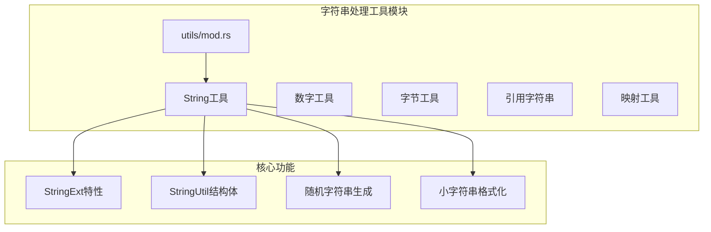
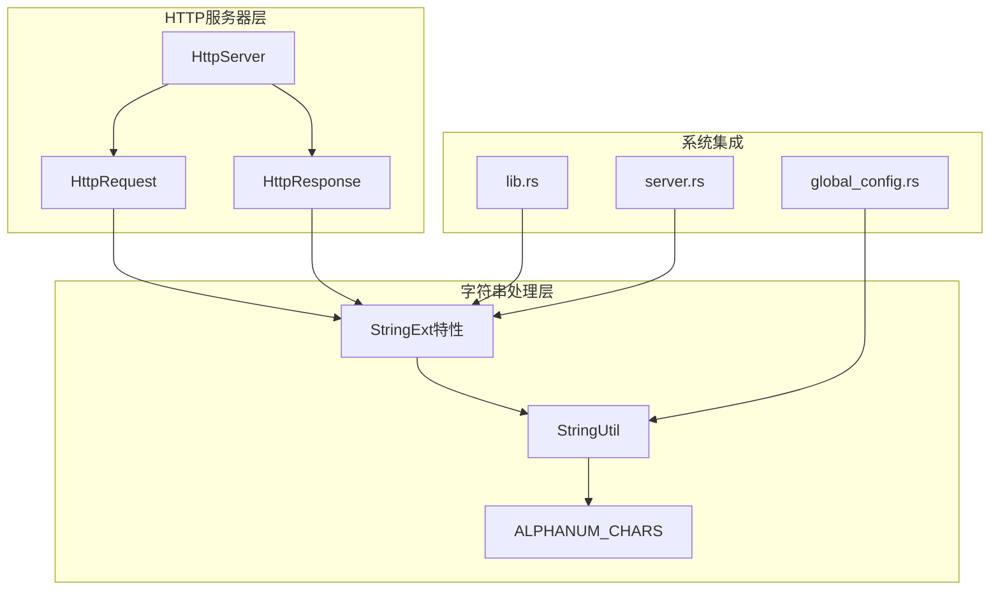
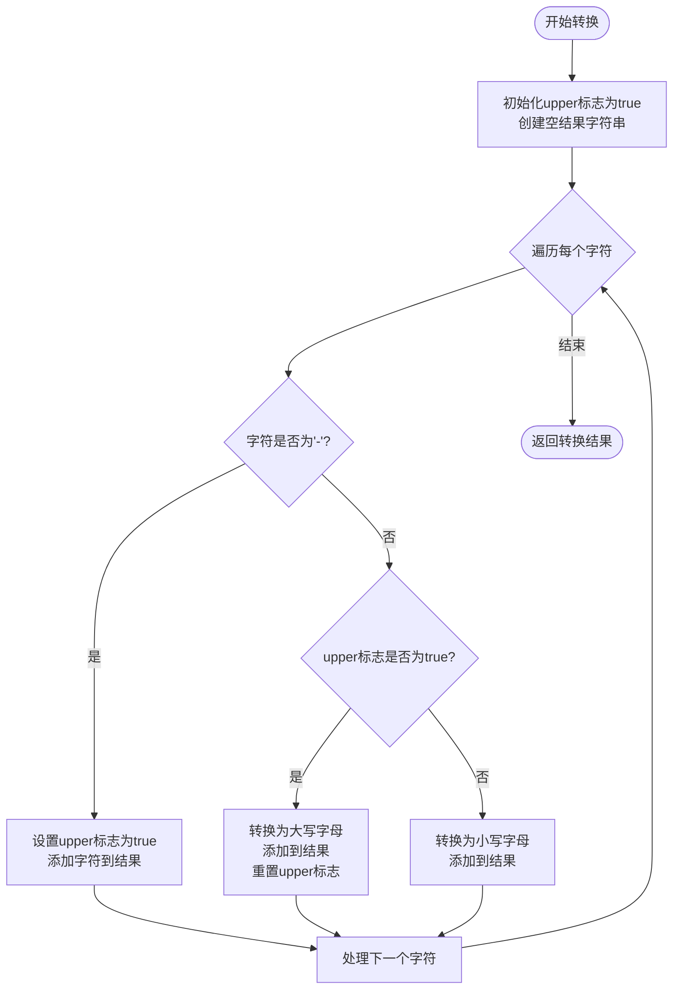
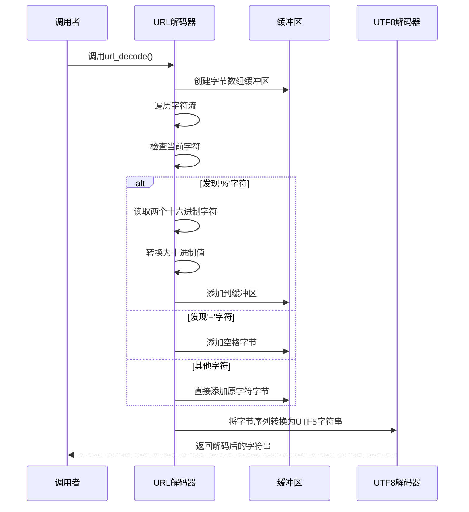
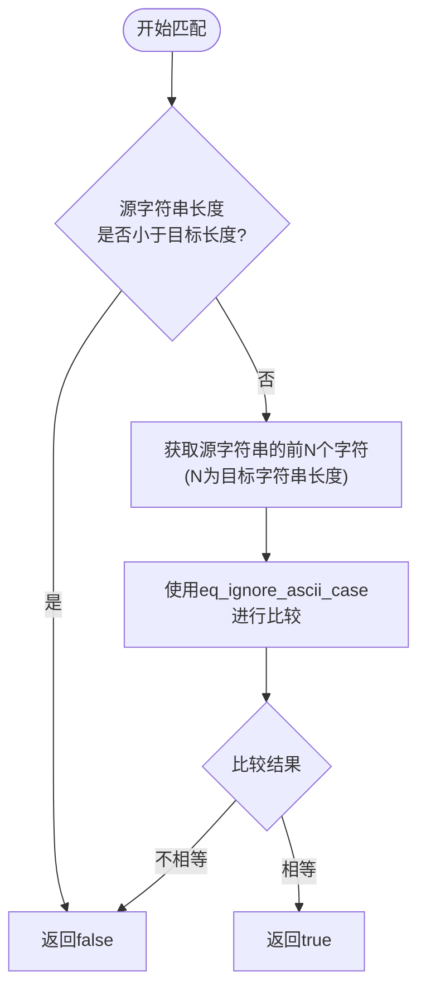
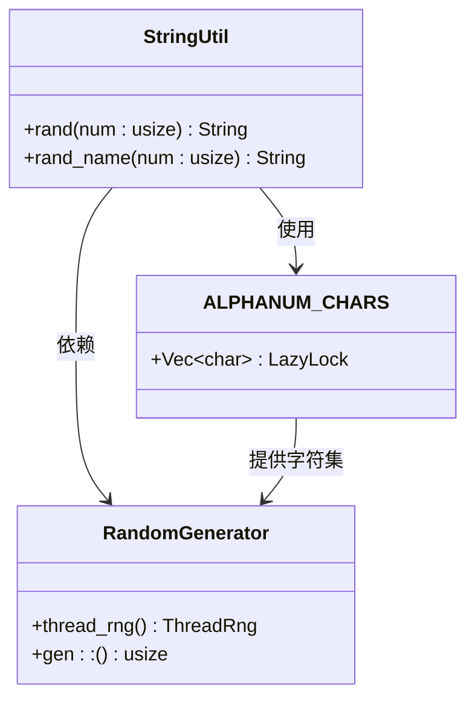
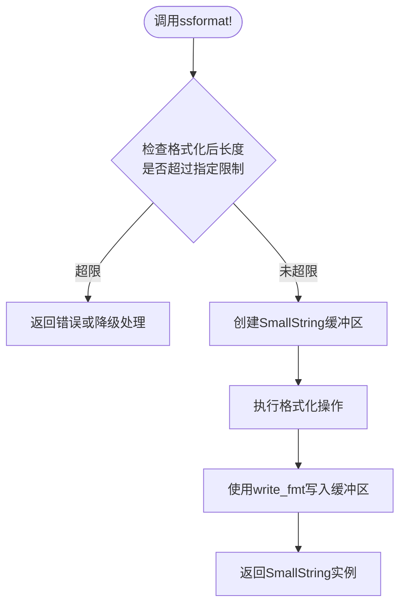
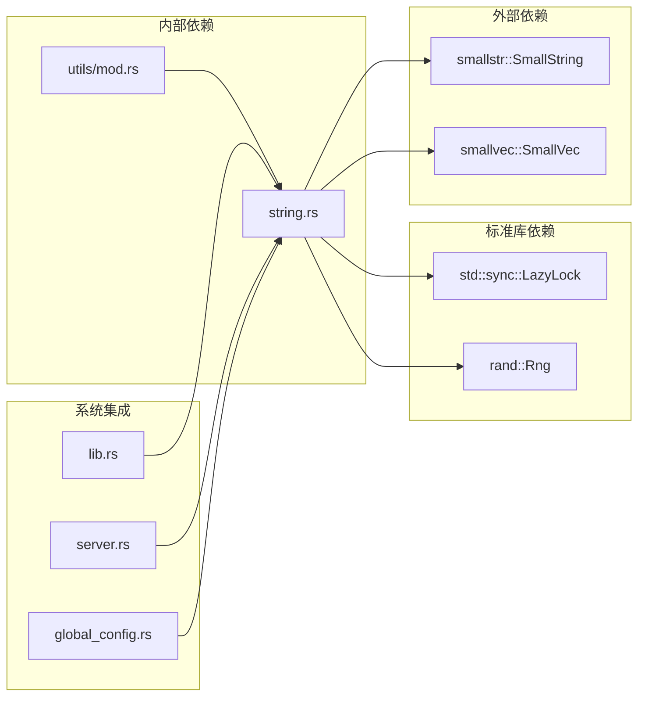

# 字符串处理工具

<cite>
**本文档引用的文件**
- [string.rs](file://potato/src/utils/string.rs)
- [mod.rs](file://potato/src/utils/mod.rs)
- [lib.rs](file://potato/src/lib.rs)
- [server.rs](file://potato/src/server.rs)
- [Cargo.toml](file://potato/Cargo.toml)
- [global_config.rs](file://potato/src/global_config.rs)
- [03_handler_args_server.rs](file://examples/server/03_handler_args_server.rs)
- [04_http_method_server.rs](file://examples/server/04_http_method_server.rs)
</cite>

## 目录
1. [简介](#简介)
2. [项目结构](#项目结构)
3. [核心组件](#核心组件)
4. [架构概览](#架构概览)
5. [详细组件分析](#详细组件分析)
6. [依赖关系分析](#依赖关系分析)
7. [性能考虑](#性能考虑)
8. [故障排除指南](#故障排除指南)
9. [结论](#结论)

## 简介

字符串处理工具模块是Potato HTTP框架中的一个关键组件，专门用于处理HTTP请求和响应中的字符串操作。该模块提供了丰富的字符串处理功能，包括大小写转换、字符查找和替换、URL解码、以及随机字符串生成等实用工具。

该模块的设计目标是为HTTP服务器提供高效、可靠的字符串处理能力，特别是在处理HTTP头部字段命名规范（如RFC标准）和URL参数解码时发挥重要作用。

## 项目结构

字符串处理工具模块位于Potato项目的utils目录下，采用模块化设计，便于单独使用和维护。

**图表来源**
- [mod.rs](file://potato/src/utils/mod.rs#L1-L12)
- [string.rs](file://potato/src/utils/string.rs#L1-L107)

**章节来源**
- [mod.rs](file://potato/src/utils/mod.rs#L1-L12)
- [Cargo.toml](file://potato/Cargo.toml#L16-L40)

## 核心组件

### StringExt特性接口

StringExt特性定义了三个核心字符串处理方法：

1. **http_std_case()** - 将字符串转换为HTTP标准大小写格式
2. **url_decode()** - 解码URL编码的字符串
3. **starts_with_ignore_ascii_case()** - 忽略ASCII大小写的前缀匹配

这些方法同时实现了`str`和`String`类型，确保了广泛的兼容性。

### StringUtil结构体

StringUtil提供了实用的字符串生成功能：

- **rand()** - 生成指定长度的随机字符串
- **rand_name()** - 生成随机名称（以特定字符开头）

### 随机字符集

模块预定义了一个包含所有字母数字字符的静态字符集，用于随机字符串生成。

**章节来源**
- [string.rs](file://potato/src/utils/string.rs#L4-L69)
- [string.rs](file://potato/src/utils/string.rs#L71-L94)

## 架构概览

字符串处理工具模块在整个Potato框架中扮演着基础设施的角色，为HTTP服务器的核心功能提供支持。

**图表来源**
- [lib.rs](file://potato/src/lib.rs#L1180-L1201)
- [server.rs](file://potato/src/server.rs#L740-L760)
- [string.rs](file://potato/src/utils/string.rs#L71-L94)

## 详细组件分析

### HTTP标准大小写转换

HTTP头部字段名遵循特定的命名规范，需要将连字符分隔的单词转换为首字母大写的格式。

**图表来源**
- [string.rs](file://potato/src/utils/string.rs#L10-L26)

#### 实际应用场景

在HTTP服务器中，这个功能主要用于标准化头部字段名：

- **请求处理**：将收到的头部字段名转换为标准格式
- **响应生成**：确保发送的头部字段名符合HTTP规范

**章节来源**
- [string.rs](file://potato/src/utils/string.rs#L10-L26)
- [lib.rs](file://potato/src/lib.rs#L1188-L1195)
- [server.rs](file://potato/src/server.rs#L749-L750)

### URL解码功能

URL解码是处理表单数据和查询参数的关键功能，支持十六进制编码和空格替换。

**图表来源**
- [string.rs](file://potato/src/utils/string.rs#L28-L47)

#### 实现特点

- **错误处理**：对无效的十六进制字符进行安全降级
- **内存效率**：使用字节数组避免不必要的字符串分配
- **UTF8支持**：正确处理多字节字符编码

**章节来源**
- [string.rs](file://potato/src/utils/string.rs#L28-L47)

### 忽略ASCII大小写的前缀匹配

这个功能用于HTTP头部字段的不区分大小写匹配，符合HTTP协议规范。

**图表来源**
- [string.rs](file://potato/src/utils/string.rs#L49-L54)

**章节来源**
- [string.rs](file://potato/src/utils/string.rs#L49-L54)

### 随机字符串生成

StringUtil提供了高效的随机字符串生成功能，广泛应用于会话管理和其他需要唯一标识的场景。

**图表来源**
- [string.rs](file://potato/src/utils/string.rs#L71-L94)

#### 字符集设计

预定义的字符集包含所有ASCII字母数字字符，确保生成的字符串具有良好的可读性和兼容性。

**章节来源**
- [string.rs](file://potato/src/utils/string.rs#L71-L94)
- [global_config.rs](file://potato/src/global_config.rs#L0-L7)

### 小字符串格式化宏

ssformat!宏提供了高效的字符串格式化功能，特别适用于HTTP头部等高频使用的场景。

**图表来源**
- [string.rs](file://potato/src/utils/string.rs#L96-L106)

**章节来源**
- [string.rs](file://potato/src/utils/string.rs#L96-L106)

## 依赖关系分析

字符串处理工具模块的依赖关系相对简单，主要依赖于标准库和外部crate。

**图表来源**
- [Cargo.toml](file://potato/Cargo.toml#L16-L40)
- [string.rs](file://potato/src/utils/string.rs#L1-L2)

**章节来源**
- [Cargo.toml](file://potato/Cargo.toml#L16-L40)

## 性能考虑

### 内存优化策略

1. **SmallString使用**：通过ssformat!宏减少字符串分配次数
2. **字节数组缓冲**：URL解码使用Vec<u8>避免中间字符串转换
3. **懒加载字符集**：ALPHANUM_CHARS使用LazyLock延迟初始化

### 时间复杂度分析

- **http_std_case()**: O(n)，其中n为字符串长度
- **url_decode()**: O(n)，需要遍历整个输入字符串
- **starts_with_ignore_ascii_case()**: O(m)，其中m为比较字符串长度
- **rand()**: O(n)，n为随机字符串长度

### 并发安全性

- 所有公共接口都是线程安全的
- ALPHANUM_CHARS使用LazyLock确保线程安全的单例模式
- StringUtil的随机数生成器在每次调用时创建新的实例

## 故障排除指南

### 常见问题及解决方案

1. **URL解码失败**
   - 检查输入是否包含有效的十六进制字符
   - 确认字符串编码为UTF8格式

2. **HTTP头部大小写转换异常**
   - 验证输入字符串是否包含连字符分隔符
   - 确认字符串包含有效的ASCII字符

3. **随机字符串生成重复**
   - 检查随机数生成器的状态
   - 考虑增加字符串长度提高唯一性

### 调试技巧

- 使用日志记录字符串处理前后的状态
- 在边界条件下测试字符串处理函数
- 监控内存使用情况，特别是大量字符串操作时

**章节来源**
- [string.rs](file://potato/src/utils/string.rs#L28-L47)
- [string.rs](file://potato/src/utils/string.rs#L10-L26)

## 结论

字符串处理工具模块为Potato HTTP框架提供了坚实的基础字符串处理能力。其设计充分考虑了HTTP协议的特殊需求，提供了高效、可靠且易于使用的字符串处理功能。

### 主要优势

1. **协议兼容性**：完全符合HTTP/1.x协议规范
2. **性能优化**：采用多种技术减少内存分配和CPU消耗
3. **易用性**：提供简洁的API接口，易于集成到现有代码中
4. **扩展性**：模块化设计便于功能扩展和维护

### 应用场景

- HTTP头部字段的标准格式化
- URL参数和表单数据的解码
- 随机字符串生成（会话ID、令牌等）
- 字符串格式化和模板渲染

该模块的成功实现展示了如何在高性能网络框架中设计和实现高质量的基础设施组件，为开发者提供了可靠的字符串处理解决方案。