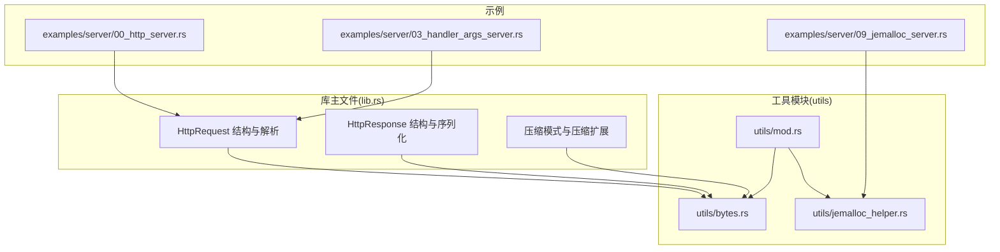
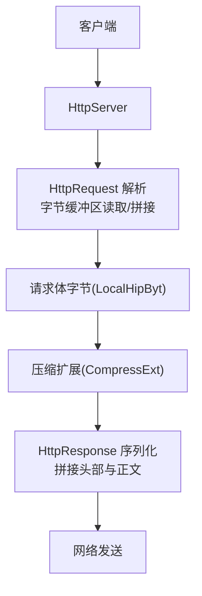
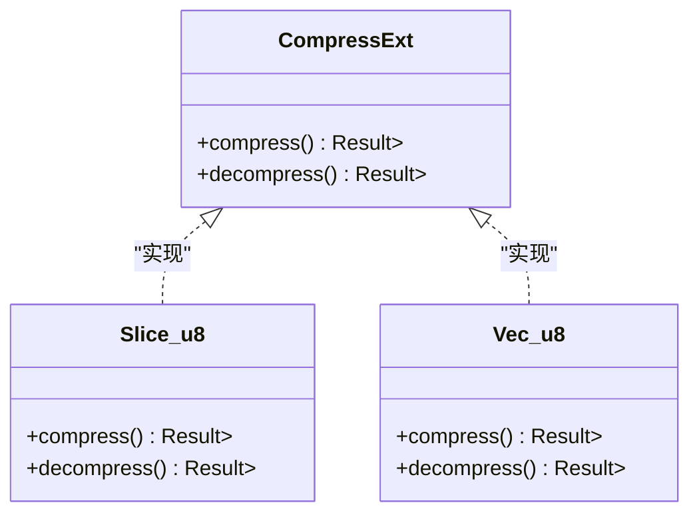
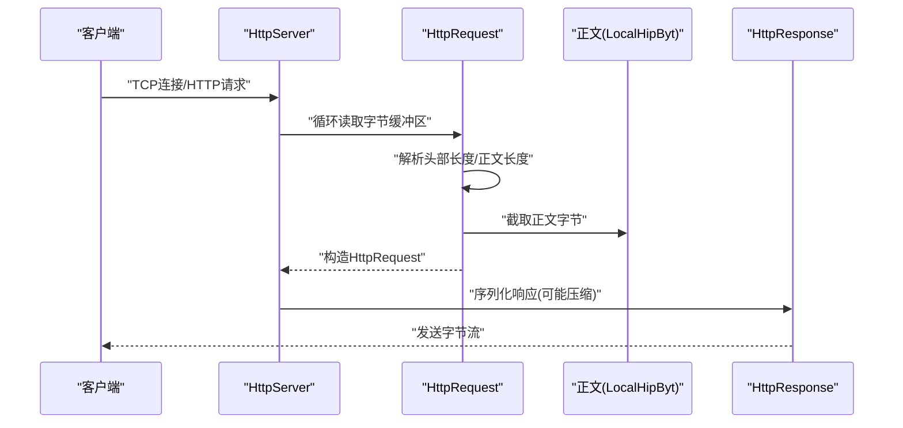
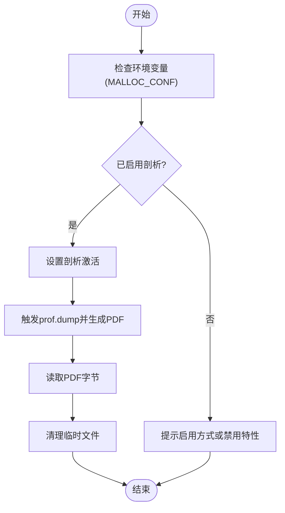
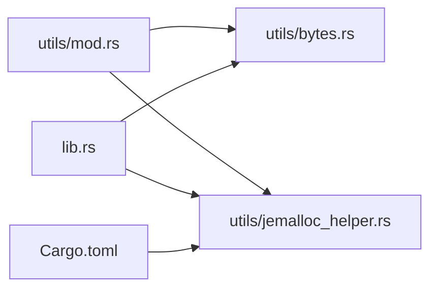

# 字节操作工具

<cite>
**本文引用的文件**
- [bytes.rs](file://potato/src/utils/bytes.rs)
- [mod.rs](file://potato/src/utils/mod.rs)
- [lib.rs](file://potato/src/lib.rs)
- [00_http_server.rs](file://examples/server/00_http_server.rs)
- [03_handler_args_server.rs](file://examples/server/03_handler_args_server.rs)
- [09_jemalloc_server.rs](file://examples/server/09_jemalloc_server.rs)
- [jemalloc_helper.rs](file://potato/src/utils/jemalloc_helper.rs)
- [Cargo.toml](file://potato/Cargo.toml)
</cite>

## 目录
1. [简介](#简介)
2. [项目结构](#项目结构)
3. [核心组件](#核心组件)
4. [架构总览](#架构总览)
5. [详细组件分析](#详细组件分析)
6. [依赖分析](#依赖分析)
7. [性能考虑](#性能考虑)
8. [故障排查指南](#故障排查指南)
9. [结论](#结论)
10. [附录：使用示例与最佳实践](#附录使用示例与最佳实践)

## 简介
本文件聚焦于“字节操作工具”模块，系统性阐述字节数组处理能力，涵盖以下主题：
- 字节序与内存布局：通过HTTP请求/响应中的字节缓冲区读写与拼接，说明内存布局与零拷贝策略。
- 编码解码工具：基于现有依赖与内部扩展，介绍Base64、十六进制与二进制数据处理思路（以现有模块为依据）。
- 压缩与解压：通过CompressExt扩展接口对字节进行Gzip压缩与解压。
- 内存管理：结合jemalloc特性与HTTP流式读取，讲解内存分配、释放与安全访问。
- 实战示例：在HTTP请求/响应中处理字节数据，包括上传文件、正文解析与压缩传输。
- 性能优化与安全最佳实践：从缓冲区复用、压缩阈值、内存分配器选择等角度给出建议。

## 项目结构
字节操作工具位于工具模块目录下，对外通过统一入口导出；HTTP核心逻辑在库主文件中实现，二者协同完成字节级处理。

图表来源
- [mod.rs](file://potato/src/utils/mod.rs#L1-L12)
- [bytes.rs](file://potato/src/utils/bytes.rs#L1-L33)
- [jemalloc_helper.rs](file://potato/src/utils/jemalloc_helper.rs#L1-L70)
- [lib.rs](file://potato/src/lib.rs#L38-L44)
- [00_http_server.rs](file://examples/server/00_http_server.rs#L1-L12)
- [03_handler_args_server.rs](file://examples/server/03_handler_args_server.rs#L1-L32)
- [09_jemalloc_server.rs](file://examples/server/09_jemalloc_server.rs#L1-L16)

章节来源
- [mod.rs](file://potato/src/utils/mod.rs#L1-L12)
- [Cargo.toml](file://potato/Cargo.toml#L1-L76)

## 核心组件
- CompressExt 扩展接口：为字节切片与向量提供压缩与解压能力，底层使用Gzip编解码器。
- jemalloc 辅助：在启用相关特性时，提供全局分配器与剖析导出能力，便于内存分析与优化。
- HTTP 请求/响应：在请求解析与响应序列化过程中，大量涉及字节缓冲区的读取、拼接与压缩传输。

章节来源
- [bytes.rs](file://potato/src/utils/bytes.rs#L4-L32)
- [jemalloc_helper.rs](file://potato/src/utils/jemalloc_helper.rs#L1-L70)
- [lib.rs](file://potato/src/lib.rs#L38-L44)

## 架构总览
字节操作工具在HTTP栈中的位置如下：

图表来源
- [lib.rs](file://potato/src/lib.rs#L588-L715)
- [lib.rs](file://potato/src/lib.rs#L1068-L1108)
- [bytes.rs](file://potato/src/utils/bytes.rs#L9-L32)

## 详细组件分析

### 组件A：压缩扩展 CompressExt
- 功能概述
  - 针对字节切片与向量提供压缩与解压方法，返回新的字节向量。
  - 压缩采用默认压缩级别，解压将输入作为Gzip流完整读取到缓冲区。
- 数据结构与复杂度
  - 输入输出均为Vec<u8>，时间复杂度近似 O(n)，空间复杂度与数据可压缩性相关。
- 错误处理
  - 压缩/解压过程可能因底层IO错误返回错误结果。
- 使用场景
  - 在HTTP响应序列化阶段，根据配置对正文进行Gzip压缩后再发送。

图表来源
- [bytes.rs](file://potato/src/utils/bytes.rs#L4-L32)

章节来源
- [bytes.rs](file://potato/src/utils/bytes.rs#L9-L32)

### 组件B：HTTP 请求解析与响应序列化
- 请求解析
  - 通过循环从网络流读取固定大小缓冲区，逐步扩展至完整头部长度，再补齐正文长度。
  - 将正文部分封装为轻量字节类型，避免不必要的复制。
- 响应序列化
  - 根据是否满足压缩条件与配置，决定是否对正文进行Gzip压缩，并设置相应头部。
  - 按HTTP格式拼接状态行、头部与正文，最终输出字节向量。

图表来源
- [lib.rs](file://potato/src/lib.rs#L588-L715)
- [lib.rs](file://potato/src/lib.rs#L1068-L1108)

章节来源
- [lib.rs](file://potato/src/lib.rs#L588-L715)
- [lib.rs](file://potato/src/lib.rs#L1068-L1108)

### 组件C：jemalloc 内存剖析与导出
- 功能概述
  - 在启用相关特性时，注册全局分配器；支持动态开启剖析开关与导出剖析文件。
  - 提供异步导出剖析PDF的能力，便于定位内存热点。
- 安全与性能
  - 通过环境变量控制剖析开关，避免无谓开销。
  - 导出流程包含文件清理，防止残留文件占用磁盘。

图表来源
- [jemalloc_helper.rs](file://potato/src/utils/jemalloc_helper.rs#L14-L70)
- [09_jemalloc_server.rs](file://examples/server/09_jemalloc_server.rs#L1-L16)

章节来源
- [jemalloc_helper.rs](file://potato/src/utils/jemalloc_helper.rs#L14-L70)
- [09_jemalloc_server.rs](file://examples/server/09_jemalloc_server.rs#L1-L16)

## 依赖分析
- 工具模块导出
  - utils/mod.rs 将 bytes 与 jemalloc_helper 等模块统一导出，便于上层按需使用。
- 依赖关系
  - lib.rs 引入 CompressExt 并在响应序列化中使用。
  - jemalloc_helper.rs 依赖 jemalloc 控制器与系统命令执行，用于剖析导出。
- 特性开关
  - Cargo.toml 中定义了 jemalloc 特性，仅在启用时引入相关依赖。

图表来源
- [mod.rs](file://potato/src/utils/mod.rs#L1-L12)
- [bytes.rs](file://potato/src/utils/bytes.rs#L1-L33)
- [jemalloc_helper.rs](file://potato/src/utils/jemalloc_helper.rs#L1-L70)
- [Cargo.toml](file://potato/Cargo.toml#L65-L76)

章节来源
- [mod.rs](file://potato/src/utils/mod.rs#L1-L12)
- [Cargo.toml](file://potato/Cargo.toml#L65-L76)

## 性能考虑
- 压缩策略
  - 仅当正文长度超过一定阈值且未设置内容编码时才进行Gzip压缩，避免小数据的额外开销。
- 缓冲区复用
  - 请求解析阶段使用固定大小缓冲区循环读取，减少频繁分配；解析完成后将正文封装为轻量字节类型，避免复制。
- 分配器选择
  - 在Linux环境下启用 jemalloc 可获得更精细的内存统计与剖析能力，有助于发现内存泄漏与热点。
- I/O 吞吐
  - 通过异步流式读取与拼接，降低阻塞与上下文切换成本。

[本节为通用性能建议，不直接分析具体文件]

## 故障排查指南
- 压缩/解压失败
  - 检查输入字节是否为合法的Gzip格式；确认底层IO未中断。
- jemalloc 剖析未生效
  - 确认已按示例设置环境变量并启用对应特性；检查系统是否具备 jeprof 依赖。
- HTTP 请求体为空
  - 确认 Content-Length 头部正确；检查客户端是否正确发送正文。
- 响应未压缩
  - 确认正文长度满足压缩阈值；检查是否已设置合适的压缩模式。

章节来源
- [bytes.rs](file://potato/src/utils/bytes.rs#L9-L32)
- [jemalloc_helper.rs](file://potato/src/utils/jemalloc_helper.rs#L14-L70)
- [lib.rs](file://potato/src/lib.rs#L588-L715)

## 结论
字节操作工具模块围绕“压缩扩展”“HTTP字节缓冲区处理”“jemalloc内存剖析”三大方向构建，既满足高性能字节处理需求，又提供了内存可观测性与安全性保障。结合示例工程，可在HTTP请求/响应场景中高效地处理二进制与文本数据。

[本节为总结性内容，不直接分析具体文件]

## 附录：使用示例与最佳实践

### 示例一：在HTTP服务中处理上传文件字节
- 场景描述
  - 通过表单上传文件，后端读取文件字节并统计长度。
- 关键点
  - 请求体解析会将文件数据封装为字节类型，便于直接读取长度与后续处理。
- 参考路径
  - [03_handler_args_server.rs](file://examples/server/03_handler_args_server.rs#L13-L20)

章节来源
- [03_handler_args_server.rs](file://examples/server/03_handler_args_server.rs#L13-L20)

### 示例二：启用 jemalloc 进行内存剖析
- 场景描述
  - 在Linux环境下启用 jemalloc 特性，导出剖析PDF以分析内存使用。
- 关键点
  - 通过环境变量开启剖析；服务启动后可访问导出的PDF。
- 参考路径
  - [09_jemalloc_server.rs](file://examples/server/09_jemalloc_server.rs#L1-L16)
  - [jemalloc_helper.rs](file://potato/src/utils/jemalloc_helper.rs#L36-L70)

章节来源
- [09_jemalloc_server.rs](file://examples/server/09_jemalloc_server.rs#L1-L16)
- [jemalloc_helper.rs](file://potato/src/utils/jemalloc_helper.rs#L36-L70)

### 最佳实践清单
- 压缩
  - 对大体积正文启用Gzip压缩；对小体积正文避免压缩以节省CPU。
- 缓冲区
  - 使用固定大小缓冲区循环读取，避免一次性分配过大的临时缓冲。
- 内存
  - 在开发/生产环境中按需启用 jemalloc；剖析仅在问题定位阶段开启。
- 安全
  - 对来自网络的字节数据进行长度与格式校验；避免越界访问。
- I/O
  - 优先使用异步流式处理，减少阻塞与上下文切换。

[本节为通用指导，不直接分析具体文件]