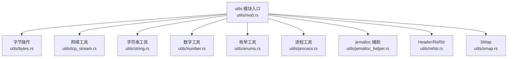
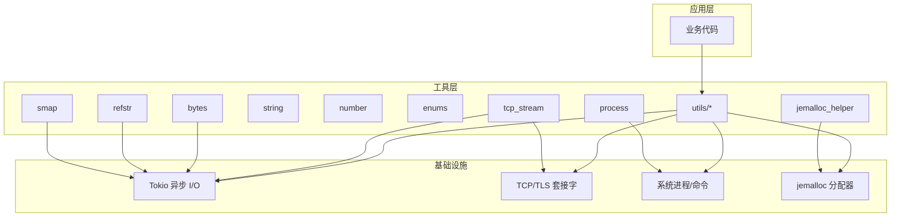
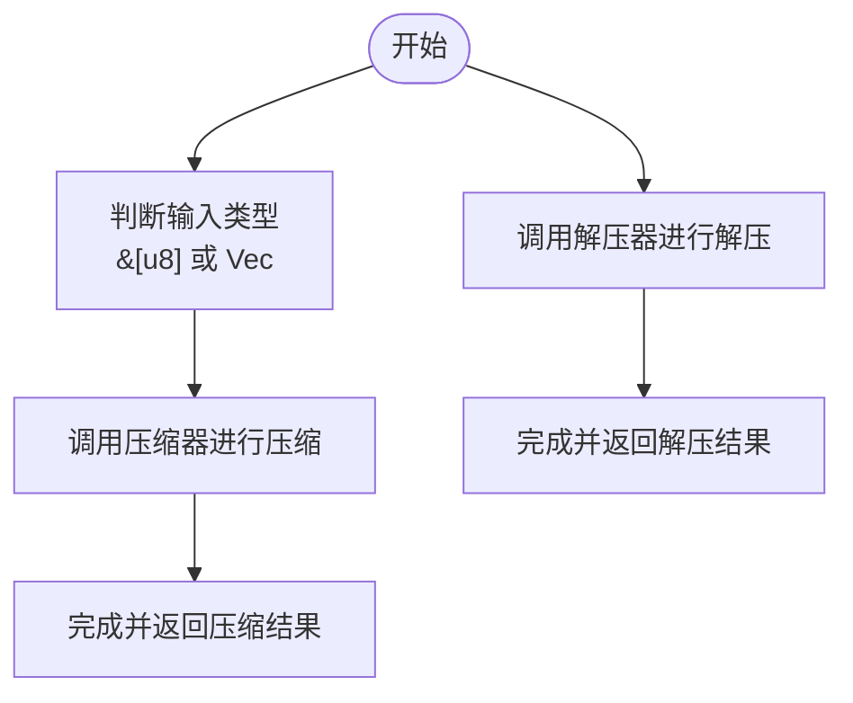
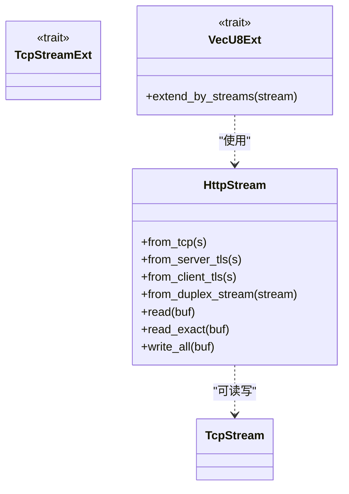
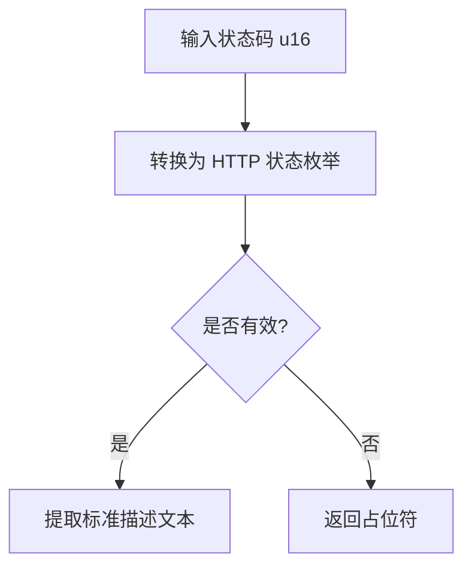
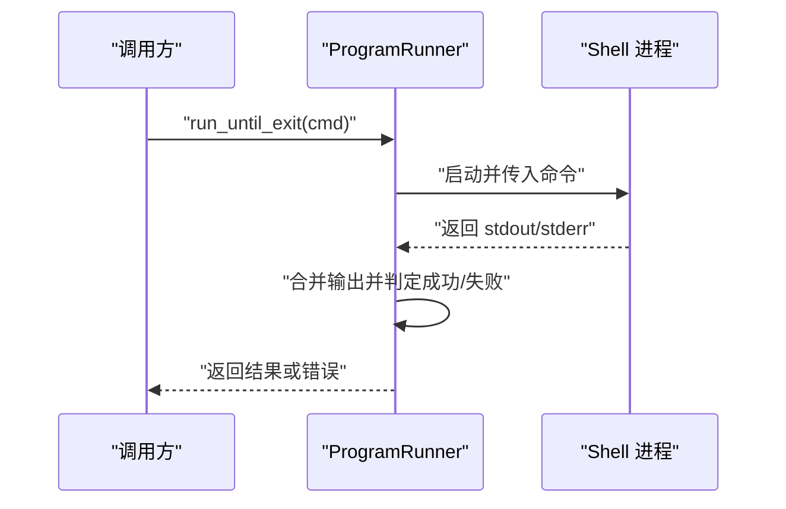
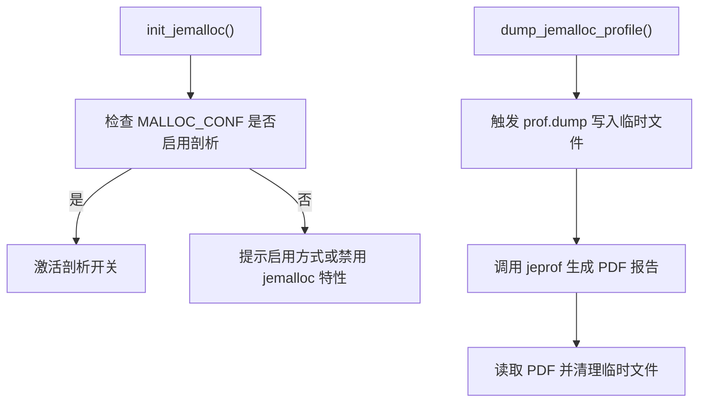
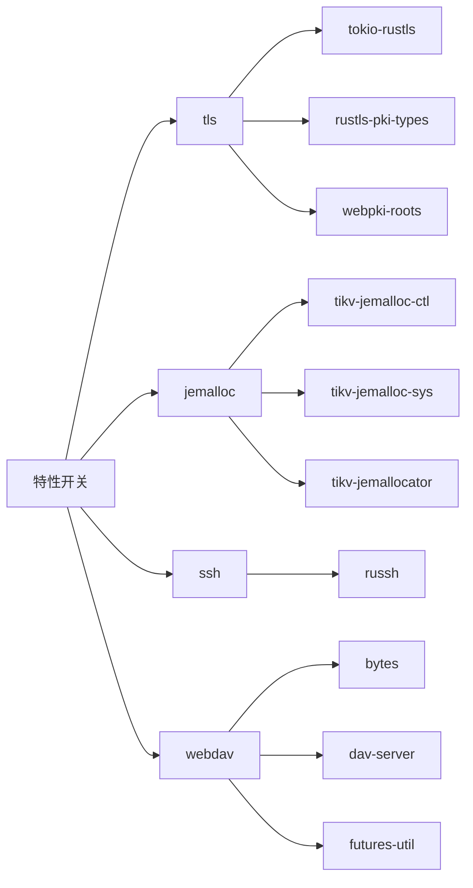

# 工具模块

<cite>
**本文引用的文件**
- [mod.rs](file://potato/src/utils/mod.rs)
- [bytes.rs](file://potato/src/utils/bytes.rs)
- [tcp_stream.rs](file://potato/src/utils/tcp_stream.rs)
- [string.rs](file://potato/src/utils/string.rs)
- [number.rs](file://potato/src/utils/number.rs)
- [enums.rs](file://potato/src/utils/enums.rs)
- [process.rs](file://potato/src/utils/process.rs)
- [jemalloc_helper.rs](file://potato/src/utils/jemalloc_helper.rs)
- [refstr.rs](file://potato/src/utils/refstr.rs)
- [smap.rs](file://potato/src/utils/smap.rs)
- [Cargo.toml（potato 包）](file://potato/Cargo.toml)
- [09_jemalloc_server.rs](file://examples/server/09_jemalloc_server.rs)
- [lib.rs](file://potato/src/lib.rs)
- [client.rs](file://potato/src/client.rs)
- [server.rs](file://potato/src/server.rs)
- [global_config.rs](file://potato/src/global_config.rs)
- [lib.rs（potato-macro）](file://potato-macro/src/lib.rs)
</cite>

## 目录
1. [简介](#简介)
2. [项目结构](#项目结构)
3. [核心组件](#核心组件)
4. [架构总览](#架构总览)
5. [详细组件分析](#详细组件分析)
6. [依赖分析](#依赖分析)
7. [性能考量](#性能考量)
8. [故障排查指南](#故障排查指南)
9. [结论](#结论)
10. [附录：使用示例与最佳实践](#附录使用示例与最佳实践)

## 简介
本章节概述 Potato 框架工具模块的目标与范围，涵盖字节操作、网络工具、类型转换、进程管理、内存管理辅助等能力，并给出各模块在框架中的定位与使用建议。

## 项目结构
工具模块集中于 potato/src/utils 下，通过统一入口导出，便于按需引入与组合使用。模块清单如下：
- 字节操作：压缩/解压扩展
- 网络工具：HTTP 流抽象、TCP 扩展、向量读取
- 类型转换：HTTP 状态码描述、字符串处理、枚举派生
- 进程管理：命令执行封装
- 内存管理辅助：jemalloc 集成与分析
- 其他实用：大小写标准化、URL 解码、随机字符串、小字符串格式化、SMap、Header 枚举与高效存储

图表来源
- [mod.rs](file://potato/src/utils/mod.rs#L1-L12)

章节来源
- [mod.rs](file://potato/src/utils/mod.rs#L1-L12)

## 核心组件
- 字节操作工具：为字节数组提供压缩与解压扩展，简化常见数据处理流程。
- 网络工具模块：统一 TCP/TLS/Duplex 流访问接口，提供异步读写与基于流的向量扩展读取。
- 类型转换工具：HTTP 状态码到描述文本映射；字符串的 HTTP 标准命名风格、URL 解码、忽略大小写前缀匹配；枚举派生与解析。
- 进程管理工具：以异步方式运行系统命令，收集标准输出与错误输出，统一返回结果或错误。
- 内存管理辅助：jemalloc 全局分配器集成、初始化与分析转储，支持性能剖析。
- 其他实用工具：随机字符串生成、小字符串格式化宏、SMap（紧凑+扩展哈希混合）、Header 枚举与高效存储。

章节来源
- [bytes.rs](file://potato/src/utils/bytes.rs#L1-L33)
- [tcp_stream.rs](file://potato/src/utils/tcp_stream.rs#L1-L130)
- [string.rs](file://potato/src/utils/string.rs#L1-L107)
- [number.rs](file://potato/src/utils/number.rs#L1-L14)
- [enums.rs](file://potato/src/utils/enums.rs#L1-L41)
- [process.rs](file://potato/src/utils/process.rs#L1-L27)
- [jemalloc_helper.rs](file://potato/src/utils/jemalloc_helper.rs#L1-L71)
- [refstr.rs](file://potato/src/utils/refstr.rs#L1-L138)
- [smap.rs](file://potato/src/utils/smap.rs#L1-L148)

## 架构总览
工具模块与上层组件的交互关系如下：

图表来源
- [tcp_stream.rs](file://potato/src/utils/tcp_stream.rs#L1-L130)
- [bytes.rs](file://potato/src/utils/bytes.rs#L1-L33)
- [process.rs](file://potato/src/utils/process.rs#L1-L27)
- [jemalloc_helper.rs](file://potato/src/utils/jemalloc_helper.rs#L1-L71)
- [refstr.rs](file://potato/src/utils/refstr.rs#L1-L138)
- [smap.rs](file://potato/src/utils/smap.rs#L1-L148)

## 详细组件分析

### 字节操作工具（CompressExt）
- 功能要点
  - 为字节切片与向量提供压缩与解压扩展方法，基于 gzip 编码实现。
  - 支持错误传播，便于在调用链中统一处理异常。
- 数据结构与复杂度
  - 压缩/解压过程为线性时间复杂度 O(n)，空间开销取决于压缩比。
- 使用场景
  - 网络传输前的数据压缩、日志或缓存数据的压缩存储。
- 注意事项
  - 大数据集压缩可能带来 CPU 开销，应结合业务吞吐评估。
  - 解压时需确保输入完整性，避免解码失败导致的错误。

图表来源
- [bytes.rs](file://potato/src/utils/bytes.rs#L9-L32)

章节来源
- [bytes.rs](file://potato/src/utils/bytes.rs#L1-L33)

### 网络工具模块（HttpStream 与 TcpStreamExt）
- 功能要点
  - 统一抽象 TCP/TLS/Duplex 流，提供一致的异步读写接口。
  - 为 Vec<u8> 提供基于流的增量扩展读取，便于按块读取网络数据。
  - 条件编译支持 TLS 特性，按需启用服务端/客户端 TLS 流。
- 数据结构与复杂度
  - HttpStream 为枚举，内部持有不同类型的流对象，读写为 O(1) 路由。
  - VecU8Ext 的扩展读取采用固定缓冲区大小，单次读取为 O(k)。
- 使用场景
  - HTTP 协议栈底层读写、WebSocket 握手、代理转发等。
- 注意事项
  - 连接关闭时扩展读取会返回错误，需在上层处理“连接已关闭”场景。
  - TLS 特性需在构建时启用相应特性，否则相关构造函数不可用。

图表来源
- [tcp_stream.rs](file://potato/src/utils/tcp_stream.rs#L11-L129)

章节来源
- [tcp_stream.rs](file://potato/src/utils/tcp_stream.rs#L1-L130)

### 类型转换工具
- HTTP 状态码描述（HttpCodeExt）
  - 将 u16 状态码映射为标准描述文本，未知状态码返回占位符。
- 字符串处理（StringExt）
  - HTTP 标准命名风格转换（如 header 名称风格化）。
  - URL 解码（支持 %xx 与 + 转空格）。
  - 忽略 ASCII 大小写的前缀匹配。
- 枚举派生（HttpConnection、HttpContentType）
  - 提供从字符串解析的工厂方法，支持忽略大小写与边界条件判断。
- 使用场景
  - 日志记录与调试信息展示、请求头解析与规范化、协议字段校验。

图表来源
- [number.rs](file://potato/src/utils/number.rs#L5-L13)

章节来源
- [number.rs](file://potato/src/utils/number.rs#L1-L14)
- [string.rs](file://potato/src/utils/string.rs#L1-L107)
- [enums.rs](file://potato/src/utils/enums.rs#L1-L41)

### 进程管理工具（ProgramRunner）
- 功能要点
  - 通过 SHELL 执行命令字符串，收集 stdout/stderr 并合并输出。
  - 若存在 stderr，则整体作为错误返回，便于上层统一处理。
- 使用场景
  - 启动外部工具、执行脚本、触发系统级任务。
- 注意事项
  - 命令字符串需安全拼接，避免注入风险。
  - 输出截断与编码问题需在上层处理。

图表来源
- [process.rs](file://potato/src/utils/process.rs#L7-L25)

章节来源
- [process.rs](file://potato/src/utils/process.rs#L1-L27)

### 内存管理辅助（jemalloc_helper）
- 功能要点
  - 在启用 jemalloc 特性时设置全局分配器。
  - 初始化：若环境变量包含特定配置则激活剖析，否则提示启用方式。
  - 剖析转储：触发 jemalloc 剖析并生成 PDF 报告，借助外部 jeprof 工具。
- 使用场景
  - 性能分析、内存泄漏排查、热点定位。
- 注意事项
  - 仅在 Linux 上支持，且需要安装 jemalloc 及相关工具。
  - 需要正确配置 MALLOC_CONF 以启用剖析功能。

图表来源
- [jemalloc_helper.rs](file://potato/src/utils/jemalloc_helper.rs#L14-L70)

章节来源
- [jemalloc_helper.rs](file://potato/src/utils/jemalloc_helper.rs#L1-L71)
- [Cargo.toml（potato 包）](file://potato/Cargo.toml#L65-L72)

### 其他实用工具
- Header/RefStr（HeaderItem、HeaderOrHipStr）
  - 定义常用 HTTP 头枚举并通过宏派生标准格式化。
  - 提供高效字符串存储与转换，兼顾内存占用与访问效率。
- SMap（紧凑+扩展哈希混合）
  - 初始阶段使用小容量数组，超过阈值后自动迁移至哈希表，兼顾小规模与大规模场景。
- 小字符串格式化宏（ssformat!）
  - 在栈上分配的小字符串缓冲区，减少堆分配与拷贝。

章节来源
- [refstr.rs](file://potato/src/utils/refstr.rs#L1-L138)
- [smap.rs](file://potato/src/utils/smap.rs#L1-L148)
- [string.rs](file://potato/src/utils/string.rs#L96-L107)

## 依赖分析
- 特性开关
  - tls：启用 TLS 支持，包含 rustls、证书根等依赖。
  - jemalloc：启用 jemalloc 分配器与剖析能力。
  - ssh/webdav：可选的 SSH 与 WebDAV 支持。
- 关键依赖
  - tokio：异步 I/O 与进程管理。
  - flate2：gzip 压缩/解压。
  - smallvec/smallstr：零拷贝与小对象优化。
  - rand：随机字符串生成。
  - tikv-jemalloc-*：jemalloc 控制与剖析。

图表来源
- [Cargo.toml（potato 包）](file://potato/Cargo.toml#L65-L72)

章节来源
- [Cargo.toml（potato 包）](file://potato/Cargo.toml#L1-L76)

## 性能考量
- 字节操作
  - 压缩/解压为 CPU 密集型，建议对大块数据批量处理，避免频繁小块压缩。
  - 使用流式读写减少中间缓冲复制。
- 网络工具
  - HttpStream 的读写为分发调用，开销极低；注意连接关闭与错误处理。
  - VecU8Ext 的固定缓冲区大小可根据实际带宽与延迟调整。
- 类型转换
  - 字符串处理与枚举解析为常数时间，适合高频路径。
- 进程管理
  - 异步命令执行避免阻塞事件循环；注意命令安全性与超时控制。
- jemalloc
  - 启用剖析会增加运行时开销，仅在诊断阶段使用。
  - 正确配置 MALLOC_CONF 以获得准确剖析数据。

## 故障排查指南
- jemalloc 初始化失败
  - 现象：初始化返回错误，提示启用方式或禁用 jemalloc 特性。
  - 排查：确认环境变量 MALLOC_CONF 是否包含剖析配置；确保平台支持。
- jemalloc 剖析无输出
  - 现象：生成 PDF 为空。
  - 排查：确认 jeprof 工具可用；检查临时文件是否存在与权限；查看命令输出。
- 网络读取异常
  - 现象：扩展读取返回“连接已关闭”。
  - 排查：检查对端是否主动关闭；在上层进行重试或降级处理。
- 压缩/解压失败
  - 现象：解码错误或数据不完整。
  - 排查：确认输入数据完整性；检查压缩算法一致性。

章节来源
- [jemalloc_helper.rs](file://potato/src/utils/jemalloc_helper.rs#L30-L34)
- [tcp_stream.rs](file://potato/src/utils/tcp_stream.rs#L120-L128)
- [bytes.rs](file://potato/src/utils/bytes.rs#L16-L21)

## 结论
Potato 的工具模块围绕高性能与易用性设计，覆盖了字节处理、网络 I/O、类型转换、进程管理与内存剖析等关键领域。通过特性开关与条件编译，用户可在满足需求的前提下最小化依赖与开销。建议在生产环境中谨慎启用 jemalloc 剖析，并对网络与压缩路径进行基准测试与容量规划。

## 附录：使用示例与最佳实践

- 字节操作
  - 示例：对字节切片进行压缩与解压，参考路径 [bytes.rs](file://potato/src/utils/bytes.rs#L9-L32)。
  - 最佳实践：大文件分块压缩；解压前校验长度与完整性；避免在热路径重复创建压缩器实例。

- 网络工具
  - 示例：使用 HttpStream 进行读写，参考路径 [tcp_stream.rs](file://potato/src/utils/tcp_stream.rs#L40-L73)。
  - 最佳实践：在 TLS 特性开启时使用对应构造函数；对 Vec<u8> 使用 extend_by_streams 增量读取；处理连接关闭与超时。

- 类型转换
  - 示例：状态码描述映射，参考路径 [number.rs](file://potato/src/utils/number.rs#L5-L13)。
  - 示例：字符串风格化与 URL 解码，参考路径 [string.rs](file://potato/src/utils/string.rs#L10-L47)。
  - 示例：枚举解析，参考路径 [enums.rs](file://potato/src/utils/enums.rs#L10-L39)。
  - 最佳实践：统一使用 HTTP 标准命名风格；忽略大小写比较时注意边界长度。

- 进程管理
  - 示例：运行命令并收集输出，参考路径 [process.rs](file://potato/src/utils/process.rs#L7-L25)。
  - 最佳实践：严格拼接命令参数；设置超时；区分 stdout/stderr 并记录日志。

- jemalloc 辅助
  - 示例：启用 jemalloc 并生成剖析报告，参考路径 [09_jemalloc_server.rs](file://examples/server/09_jemalloc_server.rs#L10-L12)。
  - 最佳实践：仅在诊断阶段启用；正确配置 MALLOC_CONF；使用外部 jeprof 工具生成可视化报告。

- Header/RefStr 与 SMap
  - 示例：Header 枚举与高效存储，参考路径 [refstr.rs](file://potato/src/utils/refstr.rs#L32-L131)。
  - 示例：SMap 的插入/查询/迭代，参考路径 [smap.rs](file://potato/src/utils/smap.rs#L25-L96)。
  - 最佳实践：小规模场景优先使用紧凑存储；大规模场景自动迁移至哈希表；避免不必要的字符串拷贝。

- 小字符串格式化
  - 示例：ssformat! 宏，参考路径 [string.rs](file://potato/src/utils/string.rs#L96-L107)。
  - 最佳实践：合理设置缓冲区大小；避免在热路径频繁分配。

章节来源
- [bytes.rs](file://potato/src/utils/bytes.rs#L1-L33)
- [tcp_stream.rs](file://potato/src/utils/tcp_stream.rs#L1-L130)
- [string.rs](file://potato/src/utils/string.rs#L1-L107)
- [number.rs](file://potato/src/utils/number.rs#L1-L14)
- [enums.rs](file://potato/src/utils/enums.rs#L1-L41)
- [process.rs](file://potato/src/utils/process.rs#L1-L27)
- [jemalloc_helper.rs](file://potato/src/utils/jemalloc_helper.rs#L1-L71)
- [refstr.rs](file://potato/src/utils/refstr.rs#L1-L138)
- [smap.rs](file://potato/src/utils/smap.rs#L1-L148)
- [09_jemalloc_server.rs](file://examples/server/09_jemalloc_server.rs#L1-L16)
- [Cargo.toml（potato 包）](file://potato/Cargo.toml#L65-L72)