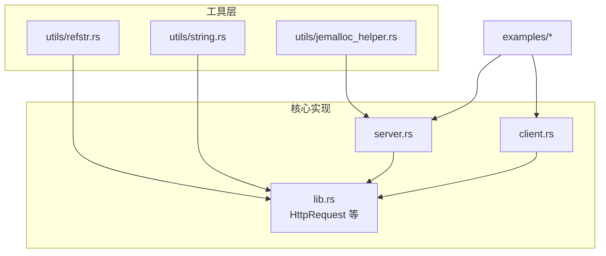
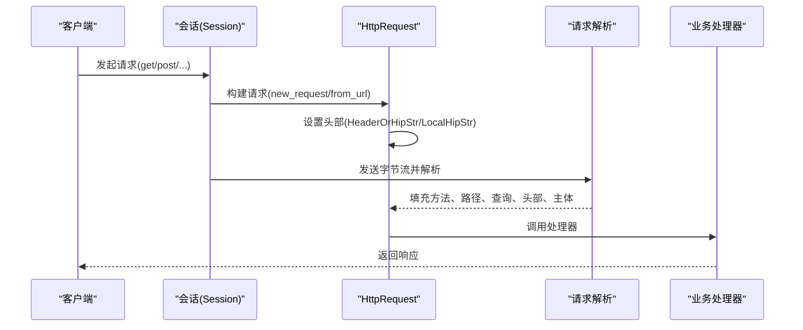
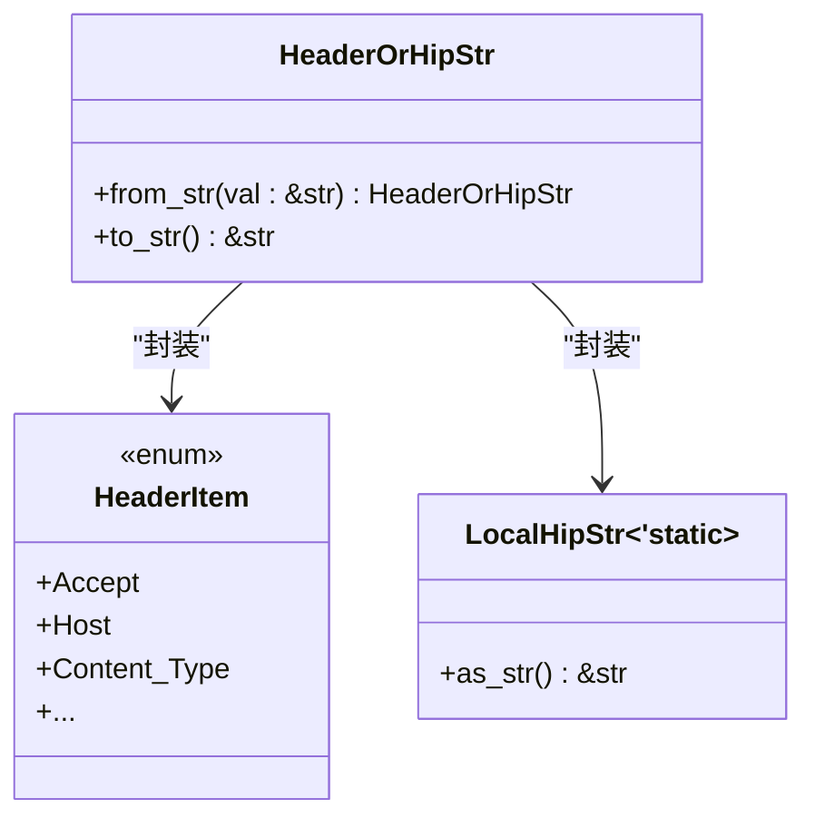
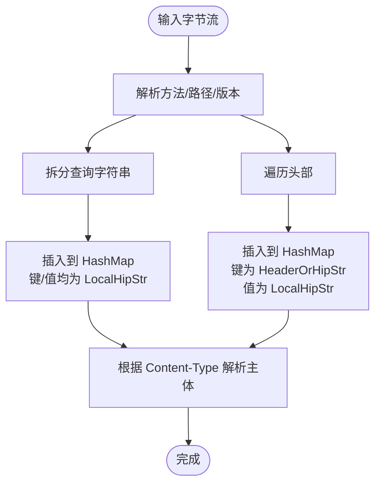
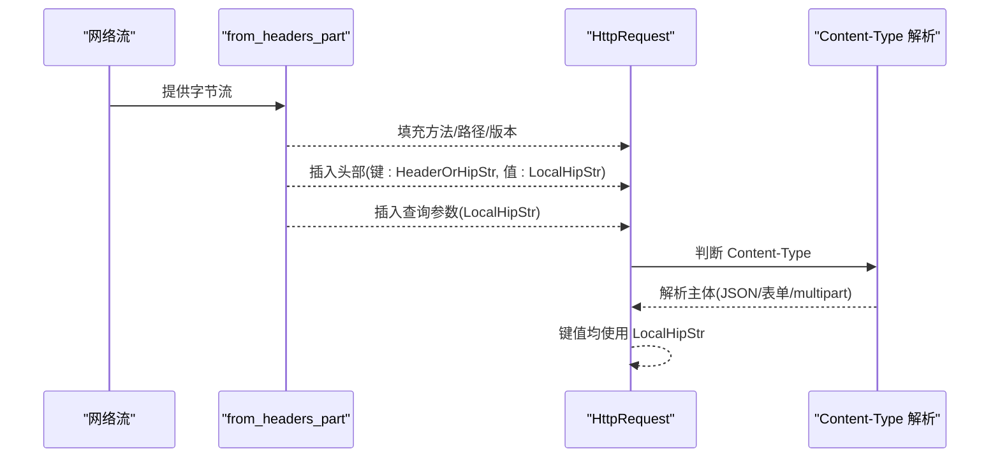
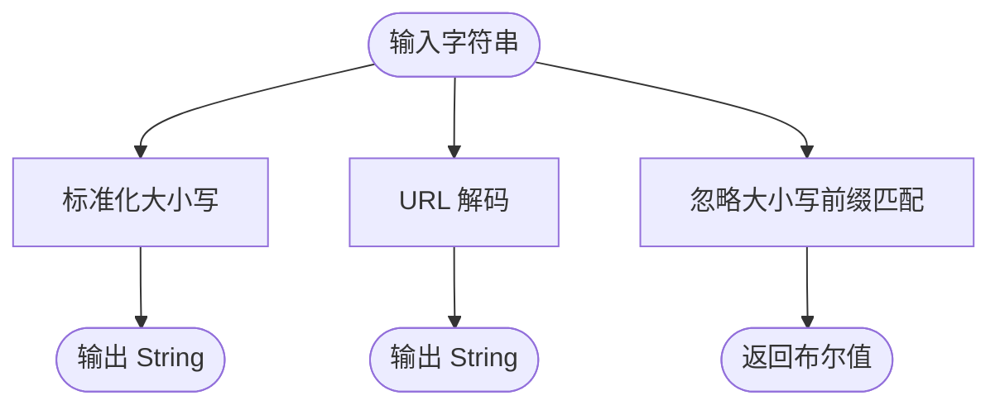
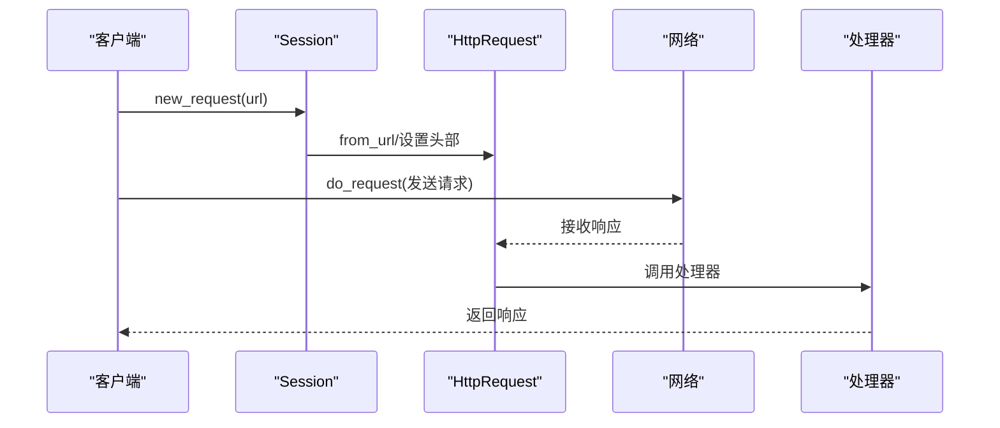
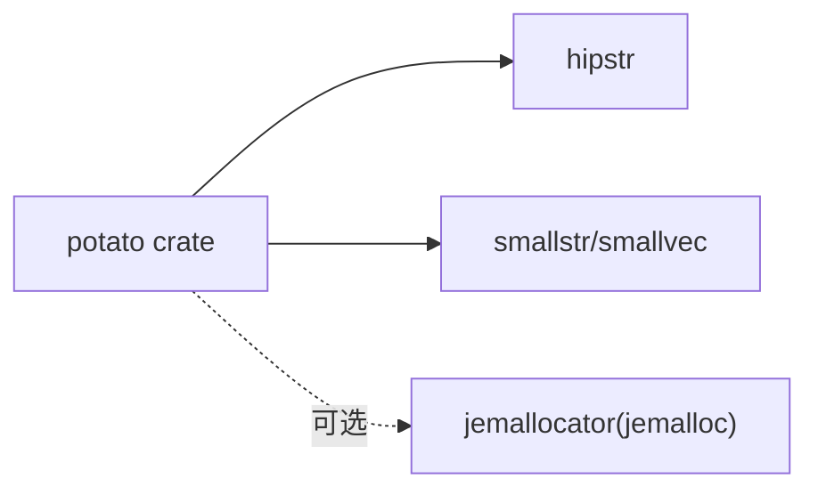

# 引用字符串工具

<cite>
**本文引用的文件**
- [refstr.rs](file://potato/src/utils/refstr.rs)
- [lib.rs](file://potato/src/lib.rs)
- [Cargo.toml](file://potato/Cargo.toml)
- [string.rs](file://potato/src/utils/string.rs)
- [server.rs](file://potato/src/server.rs)
- [client.rs](file://potato/src/client.rs)
- [jemalloc_helper.rs](file://potato/src/utils/jemalloc_helper.rs)
- [00_http_server.rs](file://examples/server/00_http_server.rs)
- [00_client.rs](file://examples/client/00_client.rs)
- [01_client_with_arg.rs](file://examples/client/01_client_with_arg.rs)
</cite>

## 目录
1. [简介](#简介)
2. [项目结构](#项目结构)
3. [核心组件](#核心组件)
4. [架构总览](#架构总览)
5. [详细组件分析](#详细组件分析)
6. [依赖关系分析](#依赖关系分析)
7. [性能考量](#性能考量)
8. [故障排查指南](#故障排查指南)
9. [结论](#结论)
10. [附录](#附录)

## 简介
本文件系统性阐述 potato 项目中的引用字符串工具，重点围绕以下目标展开：
- 深入解释 RefStr 的零拷贝字符串设计原理与内存管理模式
- 详解 LocalHipStr 的使用场景与性能优势（含堆栈分配与内存池技术）
- 展示引用字符串在 HTTP 协议处理中的应用（URL 解析、头部字段处理等）
- 提供内存优化最佳实践（生命周期管理、引用传递）
- 给出性能对比思路与建议（RefStr 相比普通 String 的优势）
- 提供使用示例与常见陷阱规避方法（悬垂引用、内存泄漏）

## 项目结构
与引用字符串工具直接相关的模块与文件如下：
- 工具层：utils/refstr.rs（定义 HeaderOrHipStr、HeaderItem 及其转换）
- 核心数据结构：lib.rs 中的 HttpRequest 结构体及其字段类型
- 字符串扩展：utils/string.rs（HTTP 标准化大小写、URL 解码、小字符串格式化宏）
- 客户端/服务端集成：client.rs、server.rs（通过 HeaderOrHipStr、LocalHipStr 使用引用字符串）
- 内存分配器：utils/jemalloc_helper.rs（可选 jemalloc 分配器与内存分析）
- 示例：examples 下的 HTTP 服务器与客户端示例

**图表来源**
- [refstr.rs](file://potato/src/utils/refstr.rs#L1-L138)
- [lib.rs](file://potato/src/lib.rs#L385-L759)
- [string.rs](file://potato/src/utils/string.rs#L1-L107)
- [client.rs](file://potato/src/client.rs#L1-L200)
- [server.rs](file://potato/src/server.rs#L1-L200)
- [jemalloc_helper.rs](file://potato/src/utils/jemalloc_helper.rs#L1-L71)

**章节来源**
- [refstr.rs](file://potato/src/utils/refstr.rs#L1-L138)
- [lib.rs](file://potato/src/lib.rs#L385-L759)
- [string.rs](file://potato/src/utils/string.rs#L1-L107)
- [client.rs](file://potato/src/client.rs#L1-L200)
- [server.rs](file://potato/src/server.rs#L1-L200)
- [jemalloc_helper.rs](file://potato/src/utils/jemalloc_helper.rs#L1-L71)

## 核心组件
- HeaderOrHipStr：统一头部键的两种表示形式
  - HeaderItem：标准 HTTP 头部枚举项
  - HipStr(LocalHipStr<'static>)：零拷贝引用字符串
- HeaderItem：覆盖常见 HTTP 头部的枚举集合
- LocalHipStr<'static>：来自 hipstr 库的零拷贝字符串类型，生命周期为 'static
- HttpRequest：HTTP 请求对象，广泛使用 HeaderOrHipStr 和 LocalHipStr
- StringExt：对 str/String 的扩展方法（HTTP 标准化大小写、URL 解码、忽略大小写前缀判断）
- 小字符串格式化宏 ssformat！：基于 smallstr 的小字符串格式化

**章节来源**
- [refstr.rs](file://potato/src/utils/refstr.rs#L7-L138)
- [lib.rs](file://potato/src/lib.rs#L385-L759)
- [string.rs](file://potato/src/utils/string.rs#L4-L107)

## 架构总览
引用字符串工具在 HTTP 协议处理中的位置与交互如下：

**图表来源**
- [client.rs](file://potato/src/client.rs#L110-L140)
- [lib.rs](file://potato/src/lib.rs#L465-L477)
- [lib.rs](file://potato/src/lib.rs#L701-L759)

## 详细组件分析

### HeaderOrHipStr 与 HeaderItem
- 设计目的：在“标准头部枚举”和“动态字符串键”之间提供统一抽象，避免频繁分配
- 关键点：
  - 支持从 &str 转换为 LocalHipStr 并封装为 HeaderOrHipStr
  - 支持从 HeaderItem 转换为 HeaderOrHipStr
  - 提供 to_str() 获取底层字符串视图，便于比较与打印

**图表来源**
- [refstr.rs](file://potato/src/utils/refstr.rs#L7-L31)
- [refstr.rs](file://potato/src/utils/refstr.rs#L32-L131)
- [refstr.rs](file://potato/src/utils/refstr.rs#L133-L138)

**章节来源**
- [refstr.rs](file://potato/src/utils/refstr.rs#L7-L138)

### LocalHipStr 的零拷贝与内存模型
- 零拷贝含义：LocalHipStr<'static> 在内部以静态生命周期持有字符串视图，不进行额外分配；当需要时可安全地转换为 &str
- 生命周期约束：由于生命周期为 'static，LocalHipStr 适合存储在结构体内并长期持有，避免悬垂引用
- 内存池与堆栈分配：
  - 项目中通过 hipstr::LocalHipStr 实现零拷贝字符串
  - 与 smallvec、smallstr 等小型容器配合，可在热点路径上减少堆分配
- 在 HttpRequest 中的应用：
  - url_path、url_query 键值、headers 的键与值、body_pairs 的键值、body_files 的键值均采用 LocalHipStr 或 LocalHipByt，降低内存占用与复制成本

**图表来源**
- [lib.rs](file://potato/src/lib.rs#L701-L759)
- [lib.rs](file://potato/src/lib.rs#L735-L757)

**章节来源**
- [lib.rs](file://potato/src/lib.rs#L385-L759)

### HTTP 协议处理中的应用
- URL 解析与查询参数：
  - 从原始字节流解析请求头后，将路径与查询参数转换为 LocalHipStr，避免重复分配
  - 查询参数被拆分为键值对并存入 HashMap，键与值均为 LocalHipStr
- 头部字段处理：
  - 头部键统一使用 HeaderOrHipStr，支持标准枚举与动态字符串
  - 头部值统一使用 LocalHipStr，保证零拷贝访问
- 主体解析：
  - 根据 Content-Type 对 JSON、表单、multipart 进行解析，键值同样采用 LocalHipStr，减少内存复制

**图表来源**
- [lib.rs](file://potato/src/lib.rs#L701-L759)
- [lib.rs](file://potato/src/lib.rs#L626-L697)

**章节来源**
- [lib.rs](file://potato/src/lib.rs#L701-L759)
- [lib.rs](file://potato/src/lib.rs#L626-L697)

### 字符串扩展与小字符串格式化
- StringExt：
  - http_std_case：将类似 “content-type” 转换为 “Content-Type”
  - url_decode：对 “%xx” 与 “+” 进行解码
  - starts_with_ignore_ascii_case：忽略 ASCII 大小写的前缀匹配
- ssformat！宏：在栈上生成小字符串，避免堆分配，适合短格式化场景

**图表来源**
- [string.rs](file://potato/src/utils/string.rs#L10-L69)
- [string.rs](file://potato/src/utils/string.rs#L96-L107)

**章节来源**
- [string.rs](file://potato/src/utils/string.rs#L1-L107)

### 客户端与服务端集成
- 客户端：
  - 通过 Session::new_request/from_url 构造 HttpRequest，设置头部时使用 HeaderOrHipStr/LocalHipStr
  - do_request 发送请求并接收响应
- 服务端：
  - 通过 HttpRequest::from_stream 从网络流解析完整请求
  - 通过 HttpRequest::from_headers_part 解析头部部分，填充结构体字段

**图表来源**
- [client.rs](file://potato/src/client.rs#L110-L140)
- [lib.rs](file://potato/src/lib.rs#L588-L699)

**章节来源**
- [client.rs](file://potato/src/client.rs#L1-L200)
- [lib.rs](file://potato/src/lib.rs#L588-L699)

## 依赖关系分析
- 依赖 hipstr：提供 LocalHipStr/LocalHipByt 的零拷贝字符串与字节容器
- 依赖 smallstr/smallvec：用于小字符串与小向量，减少堆分配
- 可选 jemalloc：通过 tikv-jemallocator 提供全局分配器与内存分析能力

**图表来源**
- [Cargo.toml](file://potato/Cargo.toml#L63)
- [jemalloc_helper.rs](file://potato/src/utils/jemalloc_helper.rs#L8-L10)

**章节来源**
- [Cargo.toml](file://potato/Cargo.toml#L16-L76)
- [jemalloc_helper.rs](file://potato/src/utils/jemalloc_helper.rs#L1-L71)

## 性能考量
- 零拷贝字符串的优势
  - 减少堆分配与复制：LocalHipStr/LocalHipByt 直接持有静态生命周期的字符串视图，避免 String 的堆分配
  - 缓存友好：在高频路径（解析头部、URL、查询参数）中显著降低内存占用与 GC 压力
- 小字符串优化
  - ssformat！宏在栈上生成小字符串，适合短格式化场景，避免堆分配
- 内存池与堆栈分配
  - 与 smallvec 配合，可将短数组驻留于栈或小容量缓冲区，进一步降低分配次数
- jemalloc 集成
  - 可选启用 jemalloc 全局分配器，结合内存分析功能定位潜在问题

注意：仓库未提供具体性能基准数据。建议在关键路径（解析头部、URL、查询参数、JSON/表单解析）进行基准测试，对比 String 与 LocalHipStr 的内存分配次数与 CPU 时间。

**章节来源**
- [string.rs](file://potato/src/utils/string.rs#L96-L107)
- [jemalloc_helper.rs](file://potato/src/utils/jemalloc_helper.rs#L1-L71)

## 故障排查指南
- 悬垂引用
  - 由于 LocalHipStr 生命周期为 'static，只要其底层数据保持有效，即可安全使用
  - 避免将临时字符串（例如函数局部变量）放入结构体中后跨作用域使用
- 内存泄漏
  - jemalloc 功能可用于内存分析与泄漏排查（需 Linux 环境与相应工具）
  - 启用 jemalloc 特性后，可通过路由导出内存分析报告
- 常见陷阱
  - 不要将非静态来源的字符串直接赋给需要 'static 生命周期的字段
  - 在解析过程中避免不必要的 String 转换，优先使用 &str 视图与 HeaderOrHipStr/LocalHipStr
  - 注意 Content-Type 解析顺序，先获取字符串再进行后续处理，避免借用冲突

**章节来源**
- [jemalloc_helper.rs](file://potato/src/utils/jemalloc_helper.rs#L14-L34)
- [lib.rs](file://potato/src/lib.rs#L615-L619)

## 结论
引用字符串工具通过 HeaderOrHipStr 与 LocalHipStr/LocalHipByt，在 HTTP 协议处理中实现了零拷贝与低分配的字符串管理策略。结合 smallstr/smallvec 与可选 jemalloc，能够在高并发场景下显著降低内存占用与复制开销。遵循生命周期与引用传递的最佳实践，可有效避免悬垂引用与内存泄漏风险。

## 附录

### 使用示例
- 服务器示例
  - [00_http_server.rs](file://examples/server/00_http_server.rs#L1-L12)
- 客户端示例
  - [00_client.rs](file://examples/client/00_client.rs#L1-L7)
  - [01_client_with_arg.rs](file://examples/client/01_client_with_arg.rs#L1-L7)

**章节来源**
- [00_http_server.rs](file://examples/server/00_http_server.rs#L1-L12)
- [00_client.rs](file://examples/client/00_client.rs#L1-L7)
- [01_client_with_arg.rs](file://examples/client/01_client_with_arg.rs#L1-L7)