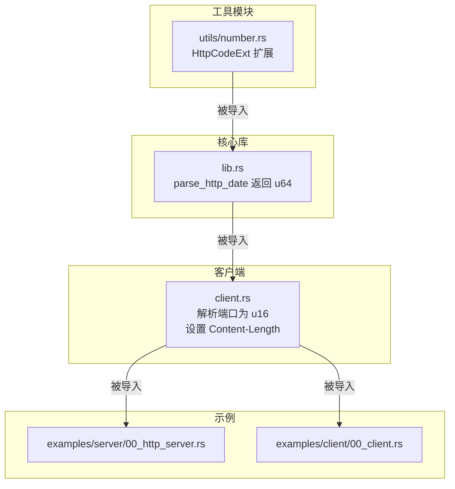
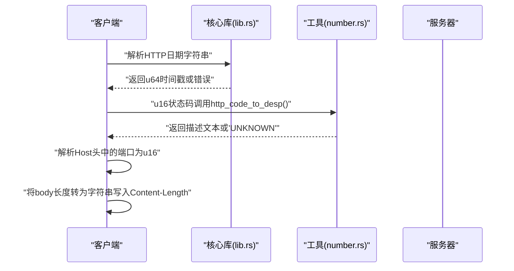
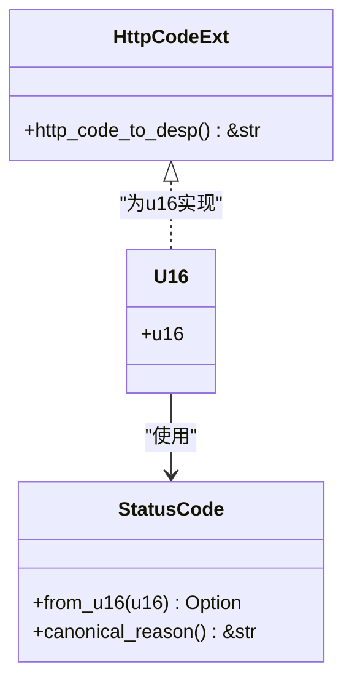
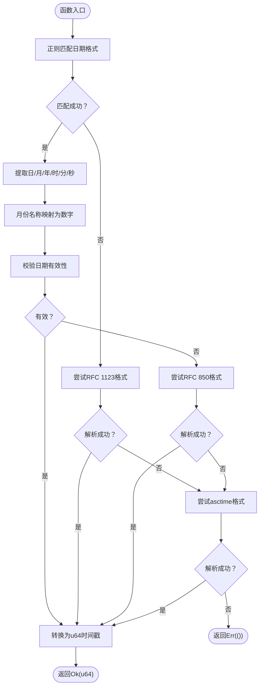
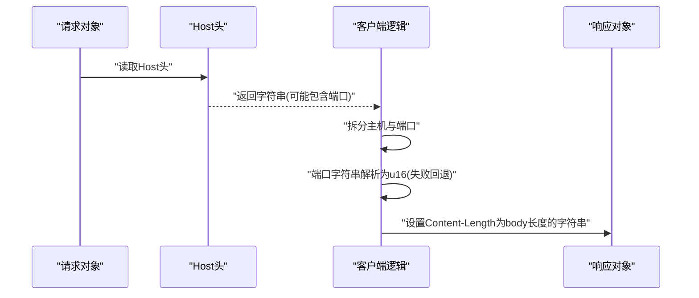
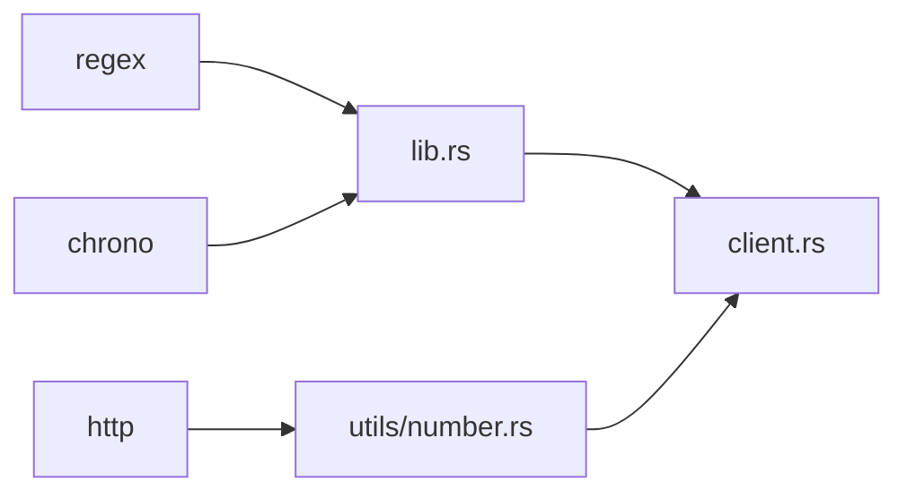

# 数字转换工具

<cite>
**本文引用的文件**
- [number.rs](file://potato/src/utils/number.rs)
- [lib.rs](file://potato/src/lib.rs)
- [client.rs](file://potato/src/client.rs)
- [Cargo.toml](file://potato/Cargo.toml)
- [00_http_server.rs](file://examples/server/00_http_server.rs)
- [00_client.rs](file://examples/client/00_client.rs)
</cite>

## 目录
1. [简介](#简介)
2. [项目结构](#项目结构)
3. [核心组件](#核心组件)
4. [架构总览](#架构总览)
5. [详细组件分析](#详细组件分析)
6. [依赖关系分析](#依赖关系分析)
7. [性能考虑](#性能考虑)
8. [故障排查指南](#故障排查指南)
9. [结论](#结论)
10. [附录](#附录)

## 简介
本文件系统性梳理“数字转换工具”在项目中的实现与应用，重点覆盖以下方面：
- 整数与浮点数之间的类型转换机制（含精度与舍入策略）
- 数字格式化选项（十进制、十六进制、科学计数法等）
- 数值范围检查与溢出处理的安全机制
- 性能优化建议（避免不必要类型转换与内存分配）
- 实际使用场景（HTTP状态码转换、Content-Length头字段处理等）
- 错误处理策略与边界情况处理

## 项目结构
数字转换工具相关代码主要分布在如下位置：
- 工具模块：utils/number.rs 提供HTTP状态码到描述文本的映射扩展
- 核心库：lib.rs 提供HTTP日期解析（返回Unix时间戳u64），并被其他模块复用
- 客户端：client.rs 展示了从字符串解析端口为u16、以及将字节长度转为字符串写入Content-Length头等典型数值转换场景
- 示例：examples/server/00_http_server.rs 与 examples/client/00_client.rs 展示了HTTP服务与客户端的基本用法

图表来源
- [number.rs](file://potato/src/utils/number.rs#L1-L14)
- [lib.rs](file://potato/src/lib.rs#L56-L119)
- [client.rs](file://potato/src/client.rs#L300-L325)
- [00_http_server.rs](file://examples/server/00_http_server.rs#L1-L12)
- [00_client.rs](file://examples/client/00_client.rs#L1-L7)

章节来源
- [Cargo.toml](file://potato/Cargo.toml#L16-L41)
- [number.rs](file://potato/src/utils/number.rs#L1-L14)
- [lib.rs](file://potato/src/lib.rs#L56-L119)
- [client.rs](file://potato/src/client.rs#L300-L325)
- [00_http_server.rs](file://examples/server/00_http_server.rs#L1-L12)
- [00_client.rs](file://examples/client/00_client.rs#L1-L7)

## 核心组件
- HttpCodeExt 扩展：为u16提供http_code_to_desp方法，将HTTP状态码映射为规范原因短语或“UNKNOWN”
- parse_http_date：将多种HTTP日期格式解析为u64时间戳
- 客户端数值转换：从字符串解析端口号为u16；将响应体长度写入Content-Length头字段

章节来源
- [number.rs](file://potato/src/utils/number.rs#L1-L14)
- [lib.rs](file://potato/src/lib.rs#L56-L119)
- [client.rs](file://potato/src/client.rs#L300-L325)
- [client.rs](file://potato/src/client.rs#L468-L469)

## 架构总览
数字转换工具在HTTP生态中的交互路径如下：

图表来源
- [lib.rs](file://potato/src/lib.rs#L56-L119)
- [number.rs](file://potato/src/utils/number.rs#L1-L14)
- [client.rs](file://potato/src/client.rs#L300-L325)
- [client.rs](file://potato/src/client.rs#L468-L469)

## 详细组件分析

### 组件A：HTTP状态码扩展（HttpCodeExt）
- 设计目标：将u16状态码安全地映射为标准原因短语，无法识别时回退为“UNKNOWN”
- 类型转换机制：
  - 输入：u16
  - 转换：通过http库的StatusCode::from_u16进行类型转换
  - 输出：&'static str（描述文本或“UNKNOWN”）
- 精度与舍入策略：无浮点参与，不存在精度损失
- 边界与错误处理：
  - 非法状态码：返回“UNKNOWN”
  - 可选链式处理：map/ok/flatten后回退到默认值
- 性能特性：常量时间、零堆分配

图表来源
- [number.rs](file://potato/src/utils/number.rs#L1-L14)

章节来源
- [number.rs](file://potato/src/utils/number.rs#L1-L14)

### 组件B：HTTP日期解析（parse_http_date）
- 设计目标：支持RFC 7231标准的多种HTTP日期格式，统一输出为u64秒级时间戳
- 类型转换机制：
  - 输入：&str（日期字符串）
  - 解析：正则匹配与月份名映射，随后使用chrono解析
  - 输出：Result<u64, ()>
- 精度与舍入策略：
  - 使用chrono::NaiveDateTime/DateTime解析，最终转换为u64秒
  - 无浮点运算，避免浮点精度问题
- 边界与错误处理：
  - 不支持的格式直接返回Err(())
  - 月份名称大小写不敏感
- 性能特性：正则编译一次，后续按需匹配；解析失败快速返回

图表来源
- [lib.rs](file://potato/src/lib.rs#L56-L119)

章节来源
- [lib.rs](file://potato/src/lib.rs#L56-L119)

### 组件C：客户端数值转换（端口解析与Content-Length写入）
- 端口解析（u16）：
  - 从Host头中分离端口字符串，解析为u16
  - 失败时回退到默认端口（如80或443）
- Content-Length写入：
  - 将响应体长度转换为字符串，写入Content-Length头
  - 在代理/修改响应时移除Transfer-Encoding，确保正确的实体长度

图表来源
- [client.rs](file://potato/src/client.rs#L300-L325)
- [client.rs](file://potato/src/client.rs#L468-L469)

章节来源
- [client.rs](file://potato/src/client.rs#L300-L325)
- [client.rs](file://potato/src/client.rs#L468-L469)

### 组件D：数值格式化选项
- 十进制：用于u16状态码与u64时间戳的常规显示
- 十六进制：可由上层业务根据需要自行格式化（例如调试输出）
- 科学计数法：当前未在核心库中直接使用，但可由上层按需采用标准库格式化能力
- 注意：本项目未提供专门的格式化宏或工具函数，推荐在需要时使用标准库的格式化能力

章节来源
- [number.rs](file://potato/src/utils/number.rs#L1-L14)
- [lib.rs](file://potato/src/lib.rs#L56-L119)

### 组件E：数值范围检查与溢出处理
- 端口解析（u16）：parse::<u16>()失败时回退到默认端口，避免异常传播
- Content-Length写入：使用响应体长度（usize）转为字符串，再写入头字段，避免越界
- HTTP日期解析：使用chrono进行日期合法性校验，非法输入直接返回错误
- 建议：在上层业务中对关键数值（如Content-Length）进行范围校验，防止过大导致内存压力

章节来源
- [client.rs](file://potato/src/client.rs#L300-L325)
- [client.rs](file://potato/src/client.rs#L468-L469)
- [lib.rs](file://potato/src/lib.rs#L56-L119)

## 依赖关系分析
- 依赖外部库：
  - http：提供StatusCode与canonical_reason
  - regex：用于HTTP日期解析的正则匹配
  - chrono：用于多种日期格式解析与时间戳生成
- 模块间耦合：
  - utils/number.rs 仅依赖http库，低耦合
  - lib.rs 同时依赖regex与chrono，承担日期解析职责
  - client.rs 依赖lib.rs提供的日期解析能力（间接）

图表来源
- [Cargo.toml](file://potato/Cargo.toml#L16-L41)
- [number.rs](file://potato/src/utils/number.rs#L1-L14)
- [lib.rs](file://potato/src/lib.rs#L56-L119)
- [client.rs](file://potato/src/client.rs#L300-L325)

章节来源
- [Cargo.toml](file://potato/Cargo.toml#L16-L41)

## 性能考虑
- 避免不必要类型转换：
  - 在解析Host头时，先判断是否包含端口，再进行parse::<u16>()，减少无效解析
  - Content-Length写入前确保已计算body长度，避免重复计算
- 内存分配优化：
  - 使用&'static str作为状态码描述，避免堆分配
  - 对于大响应体，尽量复用缓冲区，避免频繁扩容
- 正则与解析：
  - 正则表达式在首次使用时编译，后续复用；若频繁切换格式，可考虑预编译多个模式
- I/O与并发：
  - 客户端连接池与TLS握手成本较高，应复用连接并合理设置超时

## 故障排查指南
- HTTP状态码描述为“UNKNOWN”：
  - 检查状态码是否在http库支持范围内
  - 若为自定义状态码，建议在上层补充映射
- HTTP日期解析失败：
  - 确认输入格式符合RFC 7231标准
  - 检查月份名称拼写与大小写
- 端口解析异常：
  - Host头中端口缺失或非数字时，会回退到默认端口
  - 如需严格校验，可在上层增加显式的范围检查
- Content-Length不正确：
  - 确保在修改响应后移除了Transfer-Encoding
  - 检查body是否经过压缩/编码，需重新计算长度

章节来源
- [number.rs](file://potato/src/utils/number.rs#L1-L14)
- [lib.rs](file://potato/src/lib.rs#L56-L119)
- [client.rs](file://potato/src/client.rs#L300-L325)
- [client.rs](file://potato/src/client.rs#L468-L469)

## 结论
本项目的数字转换工具以简洁、安全为核心设计原则：
- 通过HttpCodeExt与parse_http_date分别覆盖HTTP状态码与日期解析两大关键场景
- 在客户端侧完成常见的端口解析与Content-Length写入，保证HTTP协议一致性
- 采用可恢复的错误处理策略与合理的回退机制，提升鲁棒性
- 建议在上层业务中结合具体需求，补充必要的范围校验与格式化策略，以获得更佳的性能与可靠性

## 附录
- 实际使用场景示例（路径参考）：
  - HTTP状态码转换：参见 [number.rs](file://potato/src/utils/number.rs#L1-L14)
  - Content-Length头字段处理：参见 [client.rs](file://potato/src/client.rs#L468-L469)
  - HTTP日期解析：参见 [lib.rs](file://potato/src/lib.rs#L56-L119)
  - 基本HTTP服务与客户端示例：参见 [00_http_server.rs](file://examples/server/00_http_server.rs#L1-L12)、[00_client.rs](file://examples/client/00_client.rs#L1-L7)