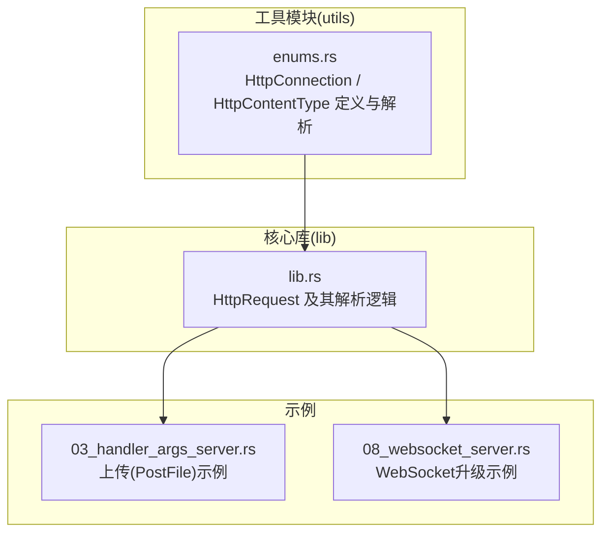
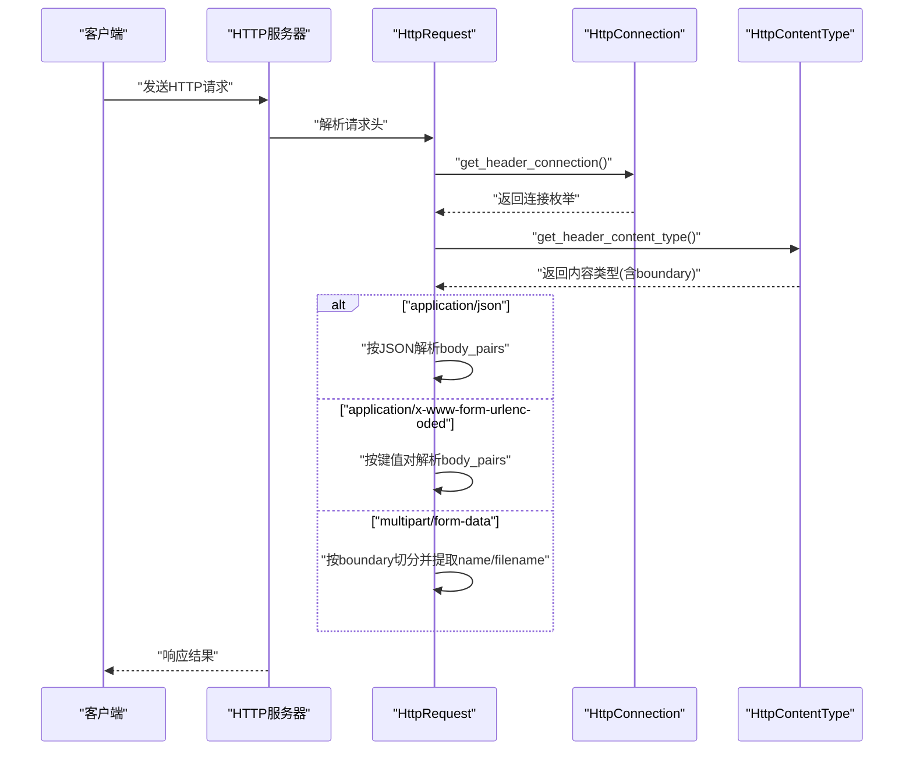
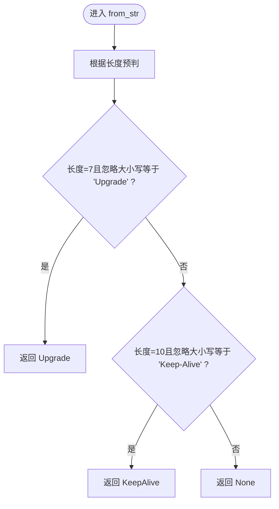
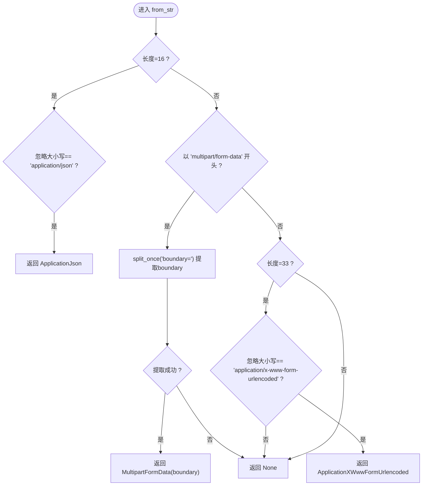
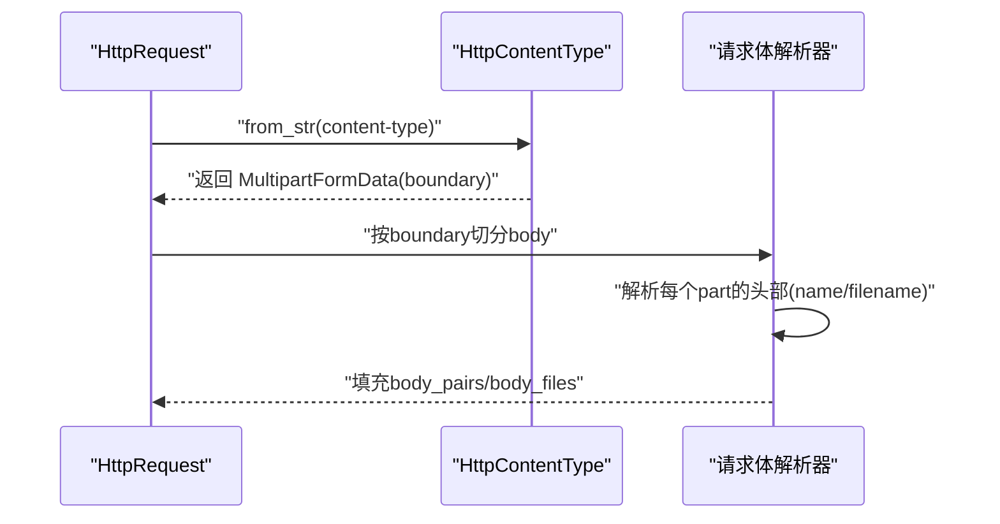
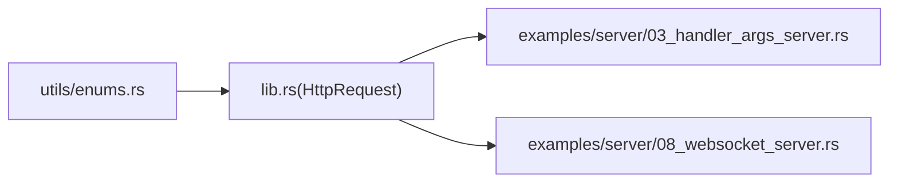

# 枚举派生功能

<cite>
**本文档引用的文件**
- [potato/src/utils/enums.rs](file://potato/src/utils/enums.rs)
- [potato/src/lib.rs](file://potato/src/lib.rs)
- [potato/src/utils/mod.rs](file://potato/src/utils/mod.rs)
- [examples/server/03_handler_args_server.rs](file://examples/server/03_handler_args_server.rs)
- [examples/server/08_websocket_server.rs](file://examples/server/08_websocket_server.rs)
</cite>

## 目录
1. [引言](#引言)
2. [项目结构](#项目结构)
3. [核心组件](#核心组件)
4. [架构总览](#架构总览)
5. [详细组件分析](#详细组件分析)
6. [依赖关系分析](#依赖关系分析)
7. [性能考量](#性能考量)
8. [故障排查指南](#故障排查指南)
9. [结论](#结论)
10. [附录](#附录)

## 引言
本文件聚焦于HTTP连接类型枚举(HttpConnection)与HTTP内容类型枚举(HttpContentType)的“枚举派生”设计与实现，系统阐述其设计理念、字符串解析机制（含大小写不敏感匹配与特殊处理）、MultipartFormData中boundary参数提取策略，以及LocalHipStr的使用方式，并给出在HTTP服务器中进行类型安全处理的最佳实践与性能建议。

## 项目结构
与枚举派生相关的代码主要分布在以下位置：
- 枚举定义与解析：utils/enums.rs
- 在HTTP请求处理中的应用：lib.rs 中的 HttpRequest 及其方法
- 示例用法：examples/server 下的示例程序
- 模块导出：utils/mod.rs

**图表来源**
- [potato/src/utils/enums.rs](file://potato/src/utils/enums.rs#L1-L40)
- [potato/src/lib.rs](file://potato/src/lib.rs#L515-L530)
- [examples/server/03_handler_args_server.rs](file://examples/server/03_handler_args_server.rs#L13-L20)
- [examples/server/08_websocket_server.rs](file://examples/server/08_websocket_server.rs#L25-L35)

**章节来源**
- [potato/src/utils/mod.rs](file://potato/src/utils/mod.rs#L1-L12)

## 核心组件
- HttpConnection：表示HTTP连接控制语义，支持从字符串解析为枚举值，用于判断连接是否保持、关闭或升级。
- HttpContentType：表示HTTP请求体的内容类型，支持JSON、表单URL编码、以及多部分表单（含boundary）解析；其中boundary以LocalHipStr持有，避免额外分配。

关键点：
- 字符串解析采用长度预判+等价性检查，保证O(1)时间复杂度。
- 大小写不敏感匹配通过ASCII大小写忽略比较实现。
- MultipartFormData分支中，boundary参数通过“boundary=”键值对提取并存入LocalHipStr，减少内存拷贝。

**章节来源**
- [potato/src/utils/enums.rs](file://potato/src/utils/enums.rs#L3-L18)
- [potato/src/utils/enums.rs](file://potato/src/utils/enums.rs#L20-L40)

## 架构总览
下图展示了从HTTP请求头到内容类型解析，再到请求体处理的整体流程：

**图表来源**
- [potato/src/lib.rs](file://potato/src/lib.rs#L515-L530)
- [potato/src/lib.rs](file://potato/src/lib.rs#L622-L697)
- [potato/src/utils/enums.rs](file://potato/src/utils/enums.rs#L10-L18)
- [potato/src/utils/enums.rs](file://potato/src/utils/enums.rs#L27-L40)

## 详细组件分析

### HttpConnection：连接类型枚举与解析
- 设计要点
  - 仅包含KeepAlive、Close、Upgrade三种语义，覆盖常见HTTP连接控制场景。
  - 提供from_str静态方法，基于长度预判与ASCII大小写不敏感比较，快速判定枚举值。
- 解析机制
  - 首先检查输入长度，再进行字符串比较，避免不必要的全量比较。
  - 使用ASCII大小写不敏感匹配，提升兼容性。
- 性能特征
  - 时间复杂度O(1)，空间开销极低，适合高频调用（如每请求解析一次Connection头）。

**图表来源**
- [potato/src/utils/enums.rs](file://potato/src/utils/enums.rs#L10-L18)

**章节来源**
- [potato/src/utils/enums.rs](file://potato/src/utils/enums.rs#L3-L18)
- [potato/src/lib.rs](file://potato/src/lib.rs#L515-L521)

### HttpContentType：内容类型枚举与解析
- 设计要点
  - 支持JSON、表单URL编码、多部分表单三类主流内容类型。
  - MultipartFormData携带LocalHipStr类型的boundary，避免重复分配。
- 解析机制
  - JSON：长度=16且忽略大小写等于“application/json”。
  - 表单URL编码：长度=33且忽略大小写等于“application/x-www-form-urlencoded”。
  - 多部分表单：以“multipart/form-data”开头，随后通过“boundary=”提取边界标识，封装为MultipartFormData(LocalHipStr)。
- 特殊处理
  - 大小写不敏感匹配确保与浏览器/客户端的兼容性。
  - 对多部分表单的boundary提取采用键值分割，直接得到边界字符串。

**图表来源**
- [potato/src/utils/enums.rs](file://potato/src/utils/enums.rs#L27-L40)

**章节来源**
- [potato/src/utils/enums.rs](file://potato/src/utils/enums.rs#L20-L40)

### MultipartFormData 的 boundary 提取与 LocalHipStr 使用
- boundary 提取
  - 通过“boundary=”键值对分割，仅保留等号后的值作为boundary。
  - 将boundary包装为LocalHipStr，避免额外的堆分配与拷贝。
- 请求体解析
  - 在HttpRequest::from_stream中，当内容类型为MultipartFormData时，使用boundary作为分隔符切分请求体。
  - 解析每个字段的头部信息，提取name与filename，分别填充body_pairs或body_files。
- 性能与内存
  - LocalHipStr在内部复用短字符串存储，减少分配次数。
  - 边界字符串仅在解析阶段使用，生命周期短，适合临时持有。

**图表来源**
- [potato/src/lib.rs](file://potato/src/lib.rs#L622-L697)
- [potato/src/utils/enums.rs](file://potato/src/utils/enums.rs#L31-L33)

**章节来源**
- [potato/src/lib.rs](file://potato/src/lib.rs#L650-L697)
- [potato/src/utils/enums.rs](file://potato/src/utils/enums.rs#L24-L25)

### 在HTTP服务器中的类型安全处理最佳实践
- 使用场景
  - 连接控制：在请求处理前读取Connection头并解析为HttpConnection，决定keep-alive或upgrade行为。
  - 内容类型：根据Content-Type解析为HttpContentType，选择对应的请求体解析策略。
- 类型安全
  - 通过枚举替代原始字符串，避免魔法字符串与拼写错误。
  - 将boundary等动态参数以LocalHipStr持有，降低内存压力。
- 性能考虑
  - from_str采用长度预判+常量时间比较，适合高频路径。
  - 对于多部分表单，尽量避免重复分配，优先使用LocalHipStr。
- 实际示例
  - 上传文件示例中，PostFile结构体使用LocalHipStr持有文件名与数据，体现类型安全与内存友好。
  - WebSocket升级示例中，通过HttpConnection::Upgrade判断升级条件，确保协议切换正确。

**章节来源**
- [potato/src/lib.rs](file://potato/src/lib.rs#L515-L530)
- [potato/src/lib.rs](file://potato/src/lib.rs#L622-L697)
- [examples/server/03_handler_args_server.rs](file://examples/server/03_handler_args_server.rs#L13-L20)
- [examples/server/08_websocket_server.rs](file://examples/server/08_websocket_server.rs#L25-L35)

## 依赖关系分析
- 枚举定义位于utils/enums.rs，被lib.rs中的HttpRequest广泛使用。
- 示例程序通过宏与处理器将枚举能力暴露给用户，形成“从请求到处理”的闭环。

**图表来源**
- [potato/src/utils/enums.rs](file://potato/src/utils/enums.rs#L1-L40)
- [potato/src/lib.rs](file://potato/src/lib.rs#L515-L530)
- [examples/server/03_handler_args_server.rs](file://examples/server/03_handler_args_server.rs#L13-L20)
- [examples/server/08_websocket_server.rs](file://examples/server/08_websocket_server.rs#L25-L35)

**章节来源**
- [potato/src/utils/mod.rs](file://potato/src/utils/mod.rs#L1-L12)

## 性能考量
- 字符串解析
  - 长度预判+ASCII大小写不敏感比较，时间复杂度O(1)，适合高频调用。
- 内存管理
  - LocalHipStr用于短字符串与边界标识，减少分配与拷贝。
- 分支处理
  - 多部分表单解析按boundary切分，避免全量扫描；仅在必要时进行键值解析。
- 建议
  - 在热路径上优先使用枚举而非字符串比较。
  - 对可复用的边界字符串，尽量复用LocalHipStr实例，避免重复构造。

[本节为通用性能讨论，无需特定文件引用]

## 故障排查指南
- Connection头解析失败
  - 现象：默认降级为Close。
  - 排查：确认客户端是否发送了正确的Connection头值（如Upgrade、Keep-Alive），注意大小写。
- Content-Type解析失败
  - 现象：请求体未按预期解析。
  - 排查：确认Content-Type字符串格式是否符合预期（如application/json、multipart/form-data; boundary=...），注意大小写与空格。
- 多部分表单未提取到字段
  - 现象：body_pairs或body_files为空。
  - 排查：确认boundary是否存在且与Content-Type一致；检查multipart报文格式是否完整。
- WebSocket升级失败
  - 现象：无法完成协议升级。
  - 排查：确认Connection为Upgrade、Upgrade头为websocket、Sec-WebSocket-Version为13、Sec-WebSocket-Key非空。

**章节来源**
- [potato/src/lib.rs](file://potato/src/lib.rs#L515-L530)
- [potato/src/lib.rs](file://potato/src/lib.rs#L528-L530)
- [potato/src/lib.rs](file://potato/src/lib.rs#L622-L697)
- [potato/src/lib.rs](file://potato/src/lib.rs#L532-L558)

## 结论
该枚举派生方案以简洁高效的字符串解析为核心，结合LocalHipStr实现内存友好与高性能的请求体处理。通过HttpConnection与HttpContentType的类型化抽象，显著提升了HTTP服务器在连接控制与内容类型处理上的安全性与可维护性。配合示例程序，开发者可以快速在实际项目中落地这些最佳实践。

[本节为总结性内容，无需特定文件引用]

## 附录
- 关键API与路径
  - HttpConnection::from_str：[potato/src/utils/enums.rs](file://potato/src/utils/enums.rs#L10-L18)
  - HttpContentType::from_str：[potato/src/utils/enums.rs](file://potato/src/utils/enums.rs#L27-L40)
  - 请求头解析与内容类型处理：[potato/src/lib.rs](file://potato/src/lib.rs#L515-L530), [potato/src/lib.rs](file://potato/src/lib.rs#L622-L697)
  - 示例：上传与WebSocket：[examples/server/03_handler_args_server.rs](file://examples/server/03_handler_args_server.rs#L13-L20), [examples/server/08_websocket_server.rs](file://examples/server/08_websocket_server.rs#L25-L35)

[本节为参考清单，无需特定文件引用]