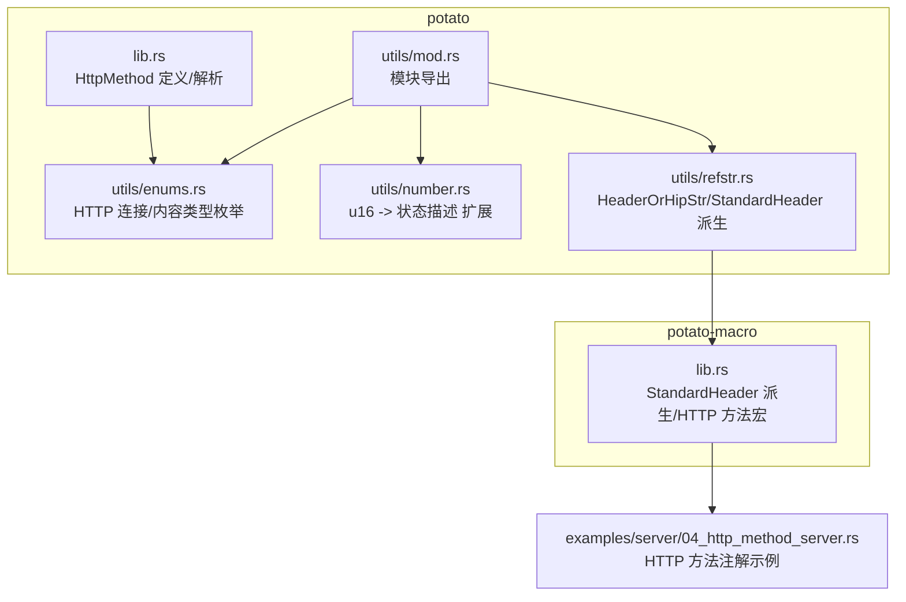
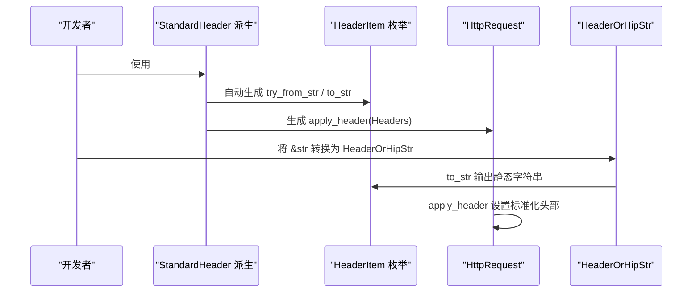
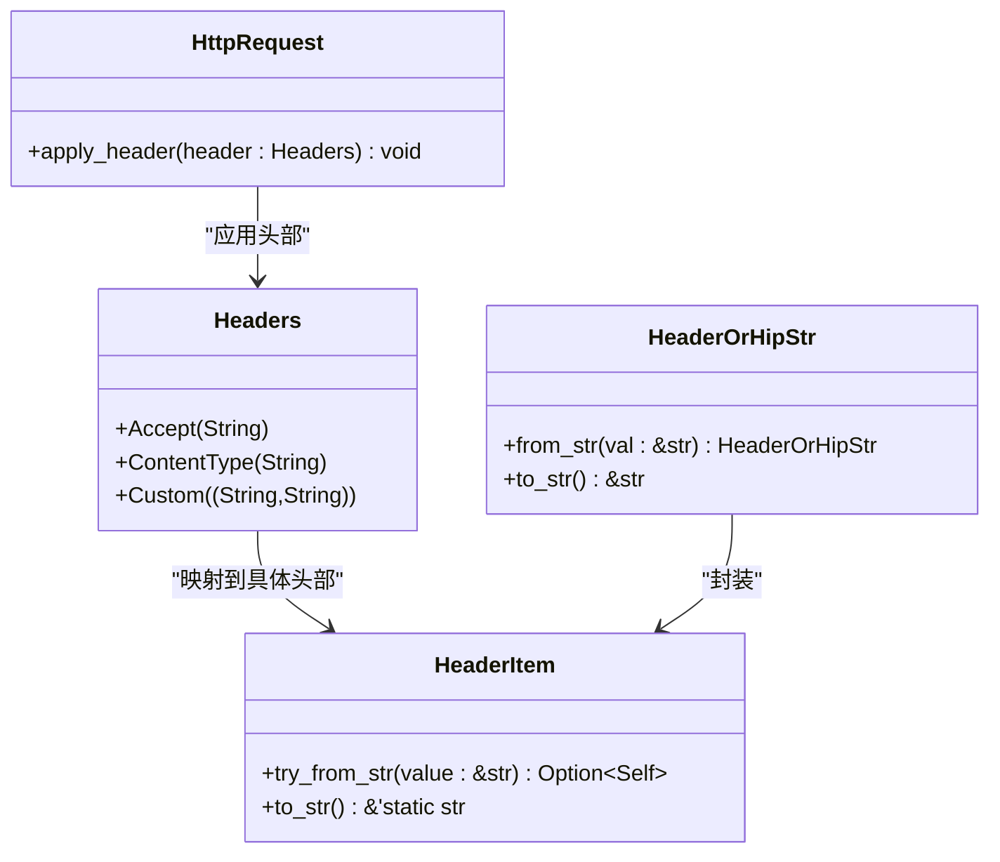
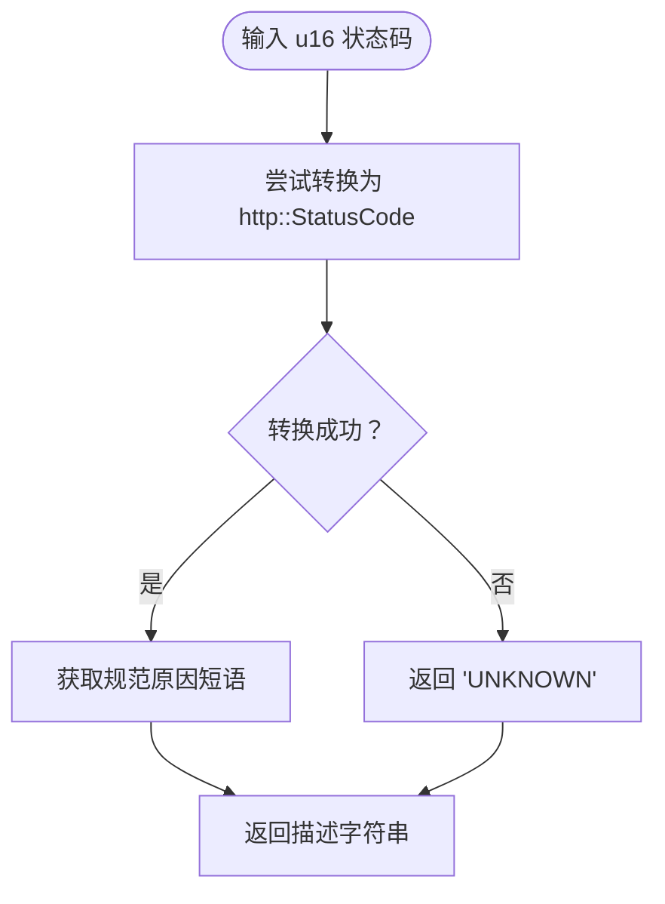
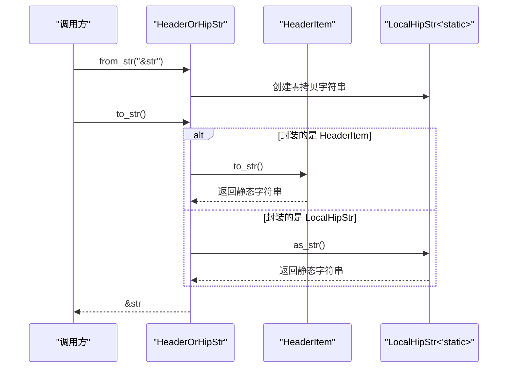
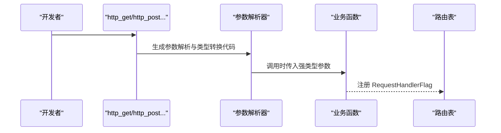
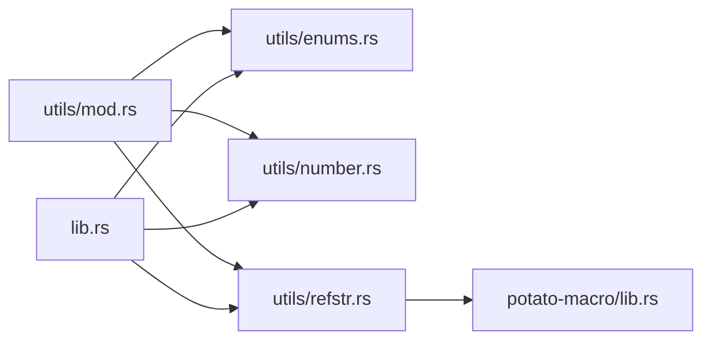

# 类型转换工具

<cite>
**本文档引用的文件**
- [potato/src/utils/enums.rs](file://potato/src/utils/enums.rs)
- [potato/src/utils/number.rs](file://potato/src/utils/number.rs)
- [potato/src/utils/refstr.rs](file://potato/src/utils/refstr.rs)
- [potato/src/utils/mod.rs](file://potato/src/utils/mod.rs)
- [potato-macro/src/lib.rs](file://potato-macro/src/lib.rs)
- [potato/src/lib.rs](file://potato/src/lib.rs)
- [examples/server/04_http_method_server.rs](file://examples/server/04_http_method_server.rs)
- [Cargo.toml](file://Cargo.toml)
</cite>

## 目录
1. [简介](#简介)
2. [项目结构](#项目结构)
3. [核心组件](#核心组件)
4. [架构总览](#架构总览)
5. [详细组件分析](#详细组件分析)
6. [依赖关系分析](#依赖关系分析)
7. [性能考量](#性能考量)
8. [故障排查指南](#故障排查指南)
9. [结论](#结论)
10. [附录](#附录)

## 简介
本文件系统性梳理“类型转换工具”模块，聚焦以下能力：
- 枚举派生：HTTP 方法枚举、状态码扩展、标准头枚举的自动实现与派生
- 数字转换：整数到 HTTP 状态描述的映射与安全转换
- 引用字符串：零拷贝字符串处理与内存优化
- 类型安全最佳实践：错误处理、边界条件与宏驱动的类型推断
- 性能对比与使用场景建议

该模块通过宏派生与标准库组合，提供高性能、类型安全且易于扩展的 HTTP 类型转换能力。

## 项目结构
类型转换工具位于 potato 工程的 utils 子模块中，并由 potato-macro 提供枚举派生支持；HTTP 方法枚举在根库中定义并在解析器中使用。

图表来源
- [potato/src/utils/mod.rs](file://potato/src/utils/mod.rs#L1-L12)
- [potato/src/utils/enums.rs](file://potato/src/utils/enums.rs#L1-L41)
- [potato/src/utils/number.rs](file://potato/src/utils/number.rs#L1-L14)
- [potato/src/utils/refstr.rs](file://potato/src/utils/refstr.rs#L1-L138)
- [potato/src/lib.rs](file://potato/src/lib.rs#L177-L195)
- [potato-macro/src/lib.rs](file://potato-macro/src/lib.rs#L345-L398)
- [examples/server/04_http_method_server.rs](file://examples/server/04_http_method_server.rs#L1-L42)

章节来源
- [potato/src/utils/mod.rs](file://potato/src/utils/mod.rs#L1-L12)
- [Cargo.toml](file://Cargo.toml#L1-L4)

## 核心组件
- 枚举派生（HTTP 方法、标准头）
  - 通过 StandardHeader 派生为每个变体生成大小写不敏感的字符串匹配与静态字符串输出
  - 自动派生 HeaderItem 的 try_from_str 与 to_str，以及 Headers 枚举与 HttpRequest.apply_header
- 数字转换（状态码）
  - 为 u16 实现 http_code_to_desp，基于 http::StatusCode 映射到规范原因短语或 UNKNOWN
- 引用字符串（零拷贝）
  - HeaderOrHipStr 统一封装 HeaderItem 与 LocalHipStr<'static>，提供 from_str 与 to_str
  - 通过 StandardHeader 派生减少重复样板代码，提升可维护性

章节来源
- [potato-macro/src/lib.rs](file://potato-macro/src/lib.rs#L345-L398)
- [potato/src/utils/number.rs](file://potato/src/utils/number.rs#L1-L14)
- [potato/src/utils/refstr.rs](file://potato/src/utils/refstr.rs#L1-L138)

## 架构总览
类型转换工具围绕“宏派生 + 标准库 + 零拷贝字符串”构建，形成如下交互：

图表来源
- [potato-macro/src/lib.rs](file://potato-macro/src/lib.rs#L345-L398)
- [potato/src/utils/refstr.rs](file://potato/src/utils/refstr.rs#L1-L138)

## 详细组件分析

### 枚举派生：HTTP 方法与标准头
- HTTP 方法枚举
  - 在根库中定义 HttpMethod，解析器根据长度与内容进行常量时间匹配，支持常见方法集
- 标准头枚举
  - HeaderItem 通过 StandardHeader 派生，自动生成：
    - try_from_str：按长度分支 + 忽略大小写的相等判断
    - to_str：将下划线风格转为连字符风格的静态字符串
  - Headers 枚举用于封装已知头部与自定义键值对
  - HttpRequest.apply_header 将 Headers 应用到请求实例

图表来源
- [potato-macro/src/lib.rs](file://potato-macro/src/lib.rs#L345-L398)
- [potato/src/utils/refstr.rs](file://potato/src/utils/refstr.rs#L1-L138)

章节来源
- [potato/src/lib.rs](file://potato/src/lib.rs#L177-L195)
- [potato/src/lib.rs](file://potato/src/lib.rs#L709-L743)
- [potato-macro/src/lib.rs](file://potato-macro/src/lib.rs#L345-L398)
- [potato/src/utils/refstr.rs](file://potato/src/utils/refstr.rs#L1-L138)

### 数字转换：状态码到描述
- 设计要点
  - 为 u16 实现 HttpCodeExt::http_code_to_desp，内部委托 http::StatusCode::from_u16
  - 若无法构造有效状态码，返回 "UNKNOWN"，确保调用端无需额外错误处理
- 使用场景
  - 日志记录、响应描述、调试输出

图表来源
- [potato/src/utils/number.rs](file://potato/src/utils/number.rs#L1-L14)

章节来源
- [potato/src/utils/number.rs](file://potato/src/utils/number.rs#L1-L14)

### 引用字符串：零拷贝与内存优化
- HeaderOrHipStr
  - 统一承载 HeaderItem 与 LocalHipStr<'static>，避免重复分配
  - 提供 from_str 与 to_str，实现从 &str 到零拷贝字符串的转换
- 标准头派生
  - StandardHeader 为 HeaderItem 自动生成 try_from_str / to_str，减少手工拼写错误
- 典型流程
  - 将字符串输入转换为 HeaderOrHipStr
  - 通过 HeaderItem.to_str 获取静态字符串，避免额外拷贝

图表来源
- [potato/src/utils/refstr.rs](file://potato/src/utils/refstr.rs#L1-L138)

章节来源
- [potato/src/utils/refstr.rs](file://potato/src/utils/refstr.rs#L1-L138)

### HTTP 方法枚举与宏驱动的类型转换
- HTTP 方法解析
  - 解析器根据长度与内容常量时间匹配 HttpMethod 变体，覆盖常见方法集合
- 注解宏
  - http_get/post/put/delete/options/head 等宏将函数包装为 HTTP 处理器
  - 内部完成参数解析、类型转换、错误处理与路由注册

图表来源
- [examples/server/04_http_method_server.rs](file://examples/server/04_http_method_server.rs#L1-L42)
- [potato-macro/src/lib.rs](file://potato-macro/src/lib.rs#L26-L300)

章节来源
- [examples/server/04_http_method_server.rs](file://examples/server/04_http_method_server.rs#L1-L42)
- [potato/src/lib.rs](file://potato/src/lib.rs#L709-L743)
- [potato-macro/src/lib.rs](file://potato-macro/src/lib.rs#L26-L300)

## 依赖关系分析
- 组件耦合
  - utils/mod.rs 导出各子模块，保持低耦合高内聚
  - StandardHeader 派生依赖宏实现，HeaderItem 与 HeaderOrHipStr 协作
- 外部依赖
  - http crate 提供状态码规范原因短语
  - hipstr 提供零拷贝字符串 LocalHipStr
  - regex 用于日期解析与参数提取
  - inventory 用于运行时收集处理器标志

图表来源
- [potato/src/utils/mod.rs](file://potato/src/utils/mod.rs#L1-L12)
- [potato/src/utils/enums.rs](file://potato/src/utils/enums.rs#L1-L41)
- [potato/src/utils/number.rs](file://potato/src/utils/number.rs#L1-L14)
- [potato/src/utils/refstr.rs](file://potato/src/utils/refstr.rs#L1-L138)
- [potato/src/lib.rs](file://potato/src/lib.rs#L1-L50)
- [potato-macro/src/lib.rs](file://potato-macro/src/lib.rs#L1-L30)

章节来源
- [potato/src/utils/mod.rs](file://potato/src/utils/mod.rs#L1-L12)
- [Cargo.toml](file://Cargo.toml#L1-L4)

## 性能考量
- 常量时间匹配
  - HttpMethod 与 HeaderItem 的字符串匹配基于长度分支 + 忽略大小写的常量比较，避免 O(n) 查找
- 零拷贝字符串
  - LocalHipStr<'static> 减少堆分配与复制，HeaderOrHipStr 统一封装，便于统一访问
- 状态码映射
  - u16 -> http::StatusCode -> 规范原因短语，失败时直接返回 "UNKNOWN"，避免异常路径开销
- 宏展开优化
  - 参数解析与类型转换在编译期生成，运行时仅保留最小调用开销

[本节为通用性能讨论，不直接分析特定文件]

## 故障排查指南
- 标准头解析失败
  - 现象：HeaderItem.try_from_str 返回 None
  - 排查：确认输入是否符合大小写不敏感规则；检查连字符与下划线差异
- 状态码未知
  - 现象：http_code_to_desp 返回 "UNKNOWN"
  - 排查：确认 u16 是否为有效 HTTP 状态码范围
- 参数类型转换失败
  - 现象：宏生成的解析逻辑返回错误响应
  - 排查：确认请求中是否存在缺失参数或类型不匹配；检查 Authorization 头格式

章节来源
- [potato/src/utils/number.rs](file://potato/src/utils/number.rs#L1-L14)
- [potato-macro/src/lib.rs](file://potato-macro/src/lib.rs#L120-L180)

## 结论
类型转换工具通过宏派生与零拷贝字符串，实现了高性能、类型安全的 HTTP 类型转换方案。其设计兼顾易用性与可维护性，适合在高并发服务端场景中广泛使用。

[本节为总结性内容，不直接分析特定文件]

## 附录
- 最佳实践
  - 优先使用 HeaderItem 与 HeaderOrHipStr，避免直接使用原始字符串
  - 对外部输入采用忽略大小写的匹配策略，确保兼容性
  - 对状态码统一使用 http_code_to_desp，保证日志一致性
- 使用场景建议
  - 高频头部解析：使用 StandardHeader 派生与 HeaderOrHipStr
  - 状态码描述：使用 HttpCodeExt 扩展
  - HTTP 方法路由：使用 http_get/http_post 等宏简化开发

[本节为通用指导，不直接分析特定文件]