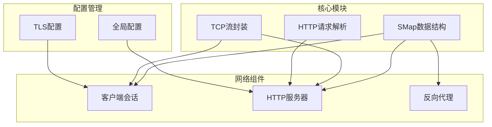
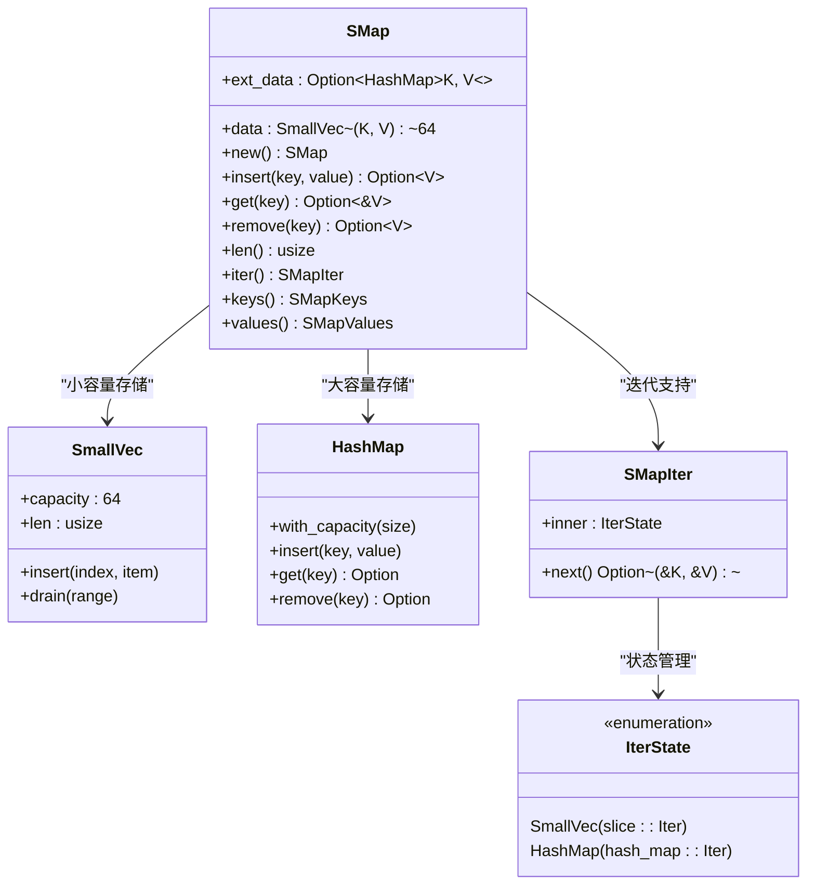
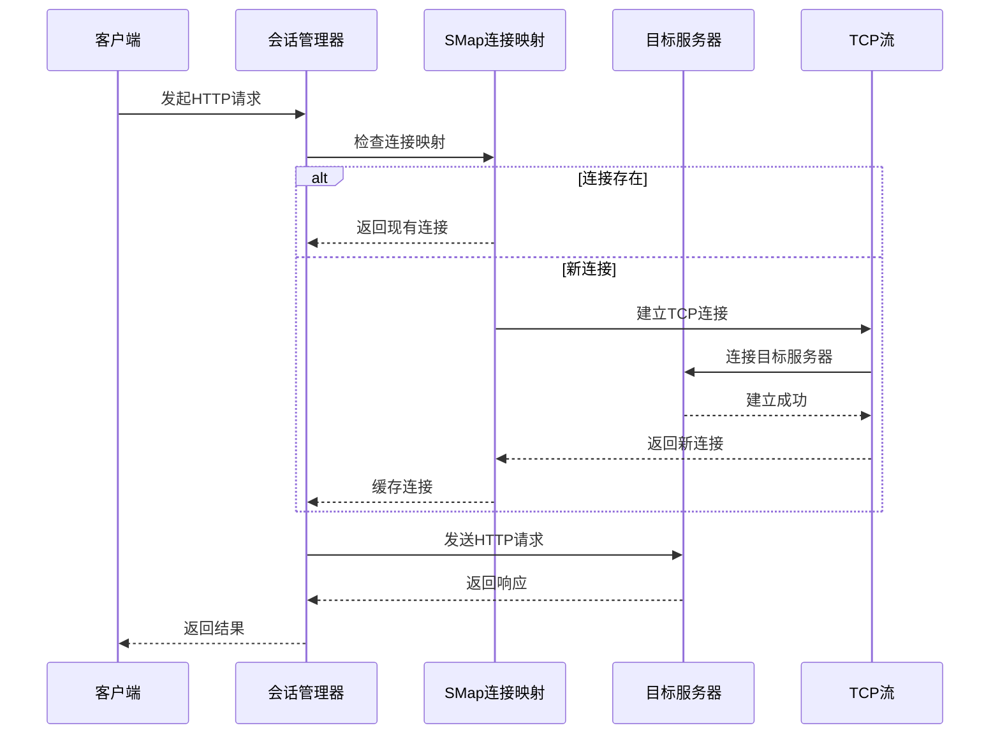
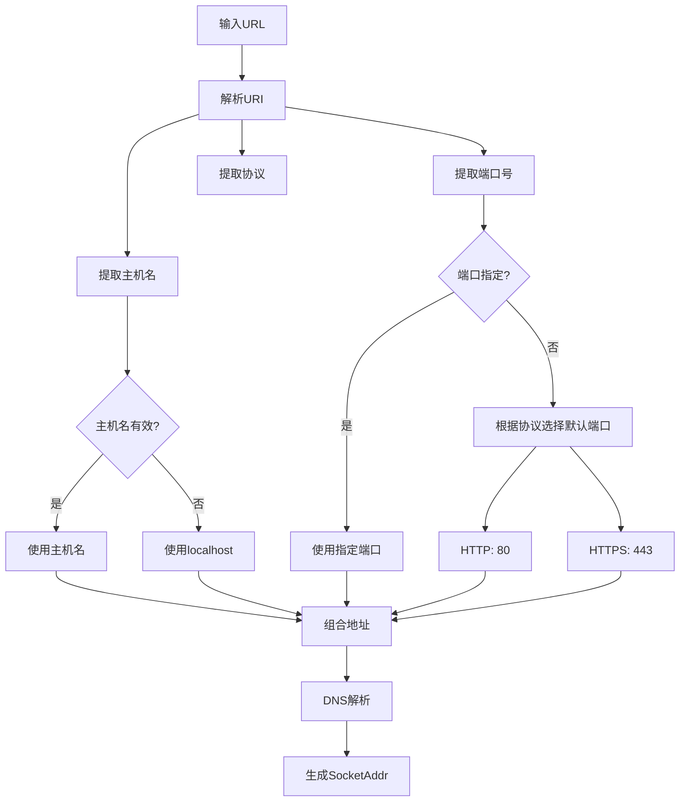
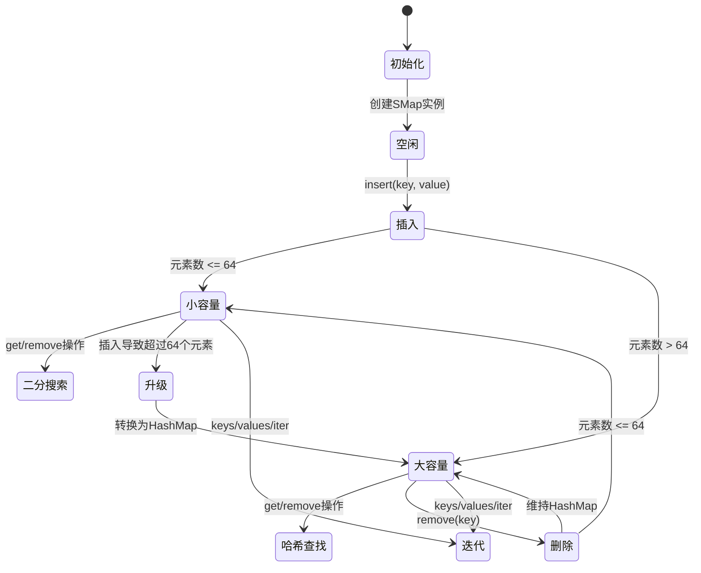
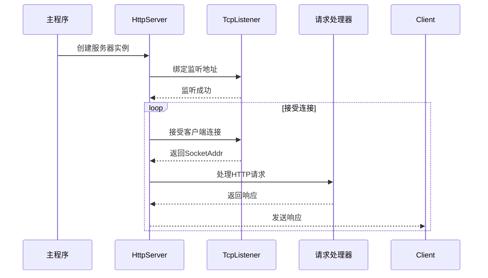
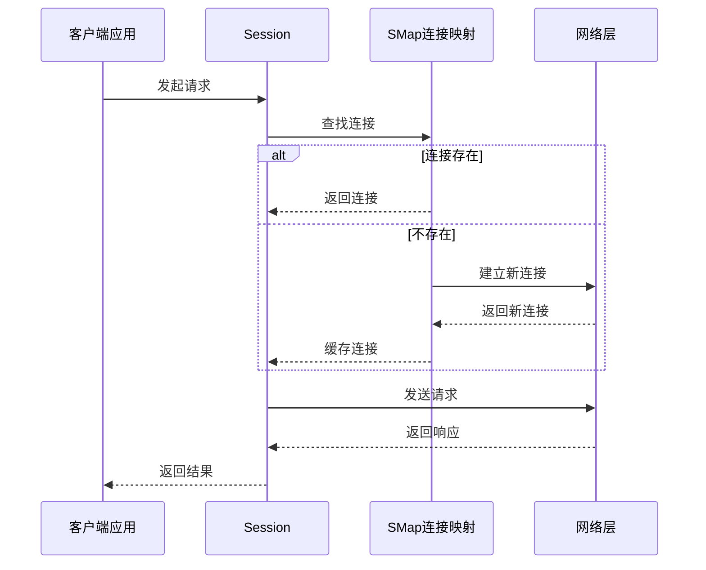
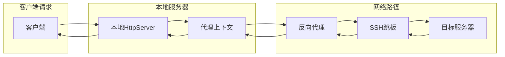
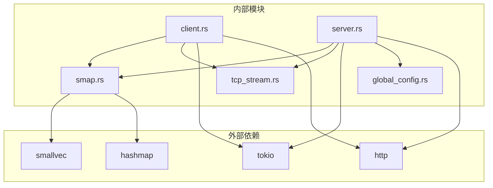
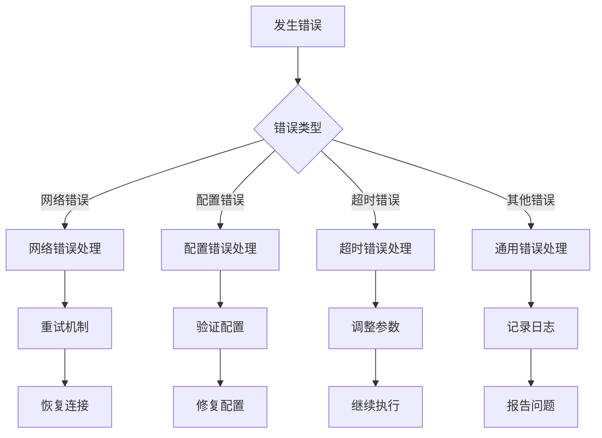

# Socket映射工具

<cite>
**本文档引用的文件**
- [smap.rs](file://potato/src/utils/smap.rs)
- [lib.rs](file://potato/src/lib.rs)
- [client.rs](file://potato/src/client.rs)
- [server.rs](file://potato/src/server.rs)
- [global_config.rs](file://potato/src/global_config.rs)
- [tcp_stream.rs](file://potato/src/utils/tcp_stream.rs)
- [Cargo.toml](file://potato/Cargo.toml)
- [00_http_server.rs](file://examples/server/00_http_server.rs)
- [00_client.rs](file://examples/client/00_client.rs)
- [13_reverse_proxy_server.rs](file://examples/server/13_reverse_proxy_server.rs)
- [14_reverse_proxy_with_ssh_server.rs](file://examples/server/14_reverse_proxy_with_ssh_server.rs)
</cite>

## 目录
1. [简介](#简介)
2. [项目结构](#项目结构)
3. [核心组件](#核心组件)
4. [架构概览](#架构概览)
5. [详细组件分析](#详细组件分析)
6. [依赖关系分析](#依赖关系分析)
7. [性能考虑](#性能考虑)
8. [故障排除指南](#故障排除指南)
9. [结论](#结论)
10. [附录](#附录)

## 简介

Socket映射工具（SMAP）是Potato HTTP框架中的一个高性能数据结构组件，专门用于管理网络连接映射和地址解析。该工具通过智能的内存管理和二进制搜索算法，为HTTP服务器和客户端提供了高效的连接池管理能力。

SMAP工具的核心价值在于其独特的混合存储架构：当键值对数量较少时使用紧凑的数组存储，超过阈值后自动升级到哈希表，实现了内存效率和访问速度的最佳平衡。这种设计特别适合网络编程中常见的连接映射场景。

## 项目结构

Potato项目采用模块化架构设计，SMAP作为底层工具被广泛应用于各个网络组件中：



**图表来源**
- [smap.rs](file://potato/src/utils/smap.rs#L1-L148)
- [client.rs](file://potato/src/client.rs#L1-L200)
- [server.rs](file://potato/src/server.rs#L1-L200)

**章节来源**
- [Cargo.toml](file://potato/Cargo.toml#L1-L76)
- [lib.rs](file://potato/src/lib.rs#L1-L800)

## 核心组件

### SMap数据结构

SMap是SMAP工具的核心实现，采用了创新的混合存储策略：



**图表来源**
- [smap.rs](file://potato/src/utils/smap.rs#L5-L148)

SMap的关键特性包括：

1. **智能容量管理**：当元素数量小于等于64时使用SmallVec，超过64个元素时自动转换为HashMap
2. **二分搜索优化**：SmallVec部分使用有序存储和二分查找算法
3. **内存效率**：避免了HashMap在小规模数据下的内存开销
4. **类型安全**：通过泛型约束确保键的可比较性、可哈希性和可排序性

**章节来源**
- [smap.rs](file://potato/src/utils/smap.rs#L1-L148)

### 网络配置管理

Potato框架提供了完善的网络配置管理机制，包括：

- **本地地址检测**：通过SocketAddr类型统一表示IPv4和IPv6地址
- **端口范围管理**：支持标准端口（80/443）和自定义端口配置
- **连接超时设置**：通过Tokio的异步I/O机制实现非阻塞连接
- **TLS配置**：可选的TLS支持，包括证书验证和加密传输

**章节来源**
- [global_config.rs](file://potato/src/global_config.rs#L1-L64)
- [tcp_stream.rs](file://potato/src/utils/tcp_stream.rs#L1-L130)

## 架构概览

SMAP工具在整个Potato框架中的作用和交互关系如下：



**图表来源**
- [client.rs](file://potato/src/client.rs#L101-L157)
- [smap.rs](file://potato/src/utils/smap.rs#L25-L46)

## 详细组件分析

### 地址解析和端口管理

Potato框架提供了完整的地址解析功能，支持多种URL格式：



**图表来源**
- [lib.rs](file://potato/src/lib.rs#L465-L477)

地址解析的关键流程包括：

1. **URL解析**：使用标准URI解析器提取协议、主机名、端口等信息
2. **默认值处理**：为未指定的端口和协议设置合理的默认值
3. **DNS解析**：将主机名转换为实际的IP地址
4. **SocketAddr构建**：创建统一的地址表示格式

**章节来源**
- [lib.rs](file://potato/src/lib.rs#L465-L477)

### 连接状态跟踪

SMAP工具通过以下机制实现连接状态的有效管理：



**图表来源**
- [smap.rs](file://potato/src/utils/smap.rs#L14-L97)

连接状态管理的特点：

1. **动态容量调整**：根据元素数量自动在SmallVec和HashMap之间切换
2. **状态一致性**：所有操作都保持数据结构的一致性
3. **高效查询**：小容量时使用二分搜索，大容量时使用哈希查找

**章节来源**
- [smap.rs](file://potato/src/utils/smap.rs#L25-L97)

### 网络编程实际示例

#### 服务器启动示例

下面展示如何使用Potato框架启动一个简单的HTTP服务器：



**图表来源**
- [00_http_server.rs](file://examples/server/00_http_server.rs#L1-L12)
- [server.rs](file://potato/src/server.rs#L889-L916)

#### 客户端连接示例

展示客户端如何建立和管理网络连接：



**图表来源**
- [00_client.rs](file://examples/client/00_client.rs#L1-L7)
- [client.rs](file://potato/src/client.rs#L101-L157)

**章节来源**
- [00_http_server.rs](file://examples/server/00_http_server.rs#L1-L12)
- [00_client.rs](file://examples/client/00_client.rs#L1-L7)

### 反向代理和SSH隧道

Potato框架还提供了高级的网络功能，包括反向代理和SSH隧道支持：



**图表来源**
- [13_reverse_proxy_server.rs](file://examples/server/13_reverse_proxy_server.rs#L1-L10)
- [14_reverse_proxy_with_ssh_server.rs](file://examples/server/14_reverse_proxy_with_ssh_server.rs#L1-L25)

**章节来源**
- [13_reverse_proxy_server.rs](file://examples/server/13_reverse_proxy_server.rs#L1-L10)
- [14_reverse_proxy_with_ssh_server.rs](file://examples/server/14_reverse_proxy_with_ssh_server.rs#L1-L25)

## 依赖关系分析

SMAP工具在整个Potato框架中的依赖关系如下：



**图表来源**
- [smap.rs](file://potato/src/utils/smap.rs#L1-L3)
- [client.rs](file://potato/src/client.rs#L1-L10)
- [server.rs](file://potato/src/server.rs#L1-L16)

**章节来源**
- [Cargo.toml](file://potato/Cargo.toml#L16-L63)

## 性能考虑

### 内存优化策略

SMAP工具采用了多项内存优化技术：

1. **SmallVec优化**：对于小规模数据使用紧凑数组存储，减少内存分配开销
2. **延迟升级**：只有在元素数量超过阈值时才进行数据结构转换
3. **就地更新**：支持在不重新分配内存的情况下更新现有值

### 访问性能优化

1. **二分搜索**：SmallVec部分使用二分查找算法，时间复杂度为O(log n)
2. **哈希查找**：HashMap部分提供平均O(1)的查找性能
3. **迭代器优化**：提供高效的迭代器实现，避免不必要的数据复制

### 并发安全性

SMAP工具设计为线程安全的数据结构，支持在多线程环境中安全使用。通过适当的锁机制和不可变引用，确保了并发访问时的数据一致性。

## 故障排除指南

### 常见问题和解决方案

1. **连接超时问题**
   - 检查网络连接状态
   - 验证防火墙设置
   - 调整超时参数配置

2. **内存使用过高**
   - 监控SMap中的元素数量
   - 实现定期清理机制
   - 考虑使用更合适的数据结构

3. **性能下降**
   - 分析数据结构转换频率
   - 优化键的哈希分布
   - 考虑预分配容量

### 错误处理策略

Potato框架采用了全面的错误处理机制：



**章节来源**
- [lib.rs](file://potato/src/lib.rs#L56-L119)
- [client.rs](file://potato/src/client.rs#L321-L344)

## 结论

Socket映射工具（SMAP）作为Potato HTTP框架的核心组件，通过其创新的混合存储架构和高效的内存管理策略，为网络编程提供了强大的基础设施支持。其智能的容量管理和类型安全设计，使其成为处理大量连接映射场景的理想选择。

SMAP工具的主要优势包括：

1. **高性能**：通过SmallVec和HashMap的智能切换，实现了内存效率和访问速度的最佳平衡
2. **易用性**：提供了简洁的API接口，支持泛型键值对操作
3. **扩展性**：支持迭代器模式，便于与其他组件集成
4. **可靠性**：完善的错误处理和类型安全机制

随着Potato框架的不断发展，SMAP工具将继续演进，为用户提供更加高效、可靠的网络编程体验。

## 附录

### 使用示例

#### 基本连接管理

```rust
// 创建SMap实例
let mut conn_map = SMap::new();

// 添加连接映射
conn_map.insert("server1:8080", connection1);
conn_map.insert("server2:9090", connection2);

// 查询连接
if let Some(conn) = conn_map.get(&"server1:8080") {
    // 使用连接处理请求
}

// 删除过期连接
conn_map.remove(&"server2:9090");
```

#### 高级配置

```rust
// 配置WebSocket心跳间隔
ServerConfig::set_ws_ping_duration(Duration::from_secs(30));

// 获取当前配置
let ping_duration = ServerConfig::get_ws_ping_duration().await;
```

### 最佳实践

1. **合理设置容量阈值**：根据预期的连接数量选择合适的初始容量
2. **及时清理过期连接**：实现定期清理机制，避免内存泄漏
3. **监控性能指标**：关注SMap的转换频率和内存使用情况
4. **错误处理优先**：始终为网络操作提供适当的错误处理逻辑