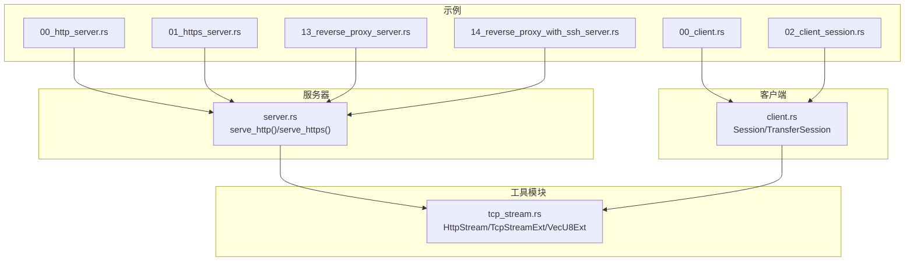
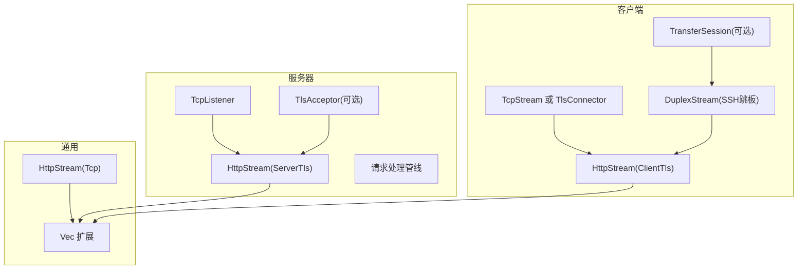
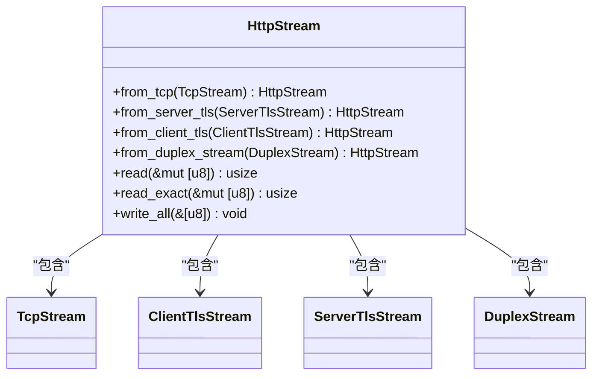
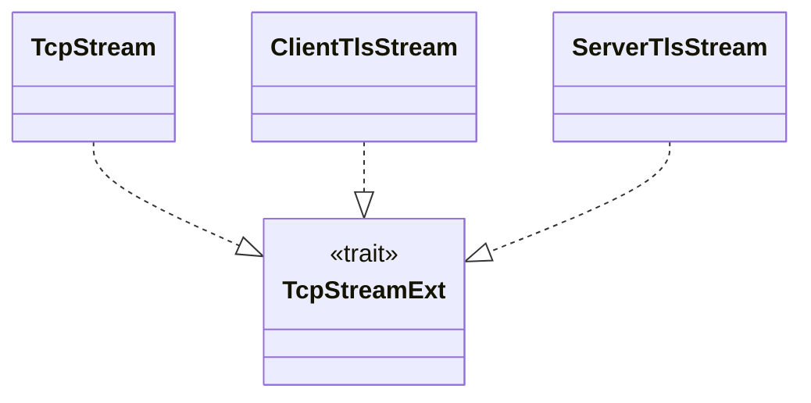
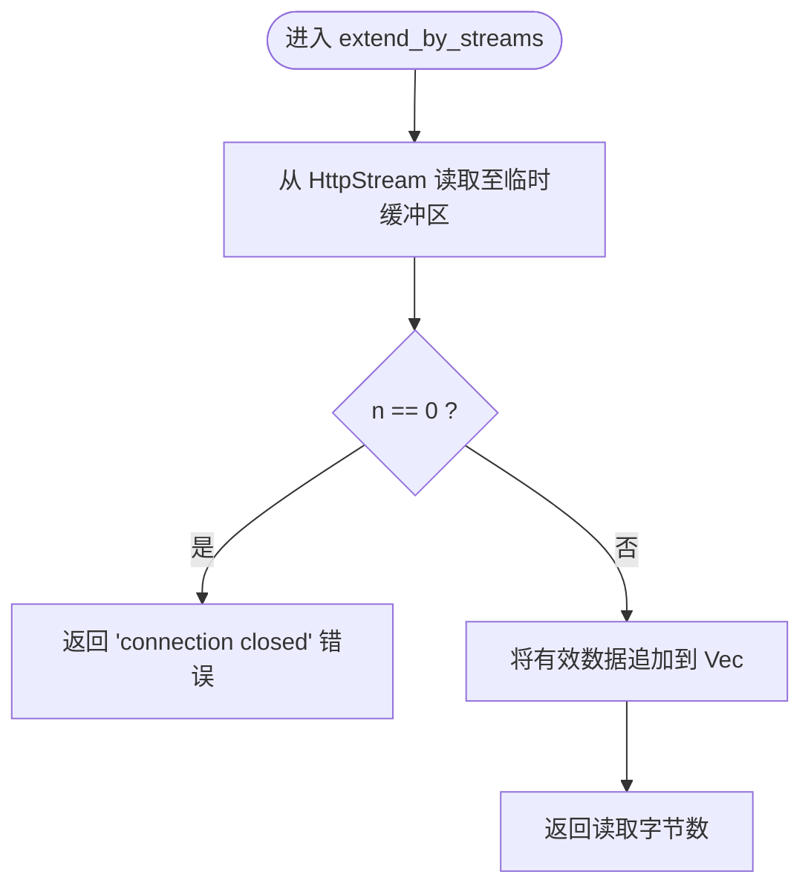
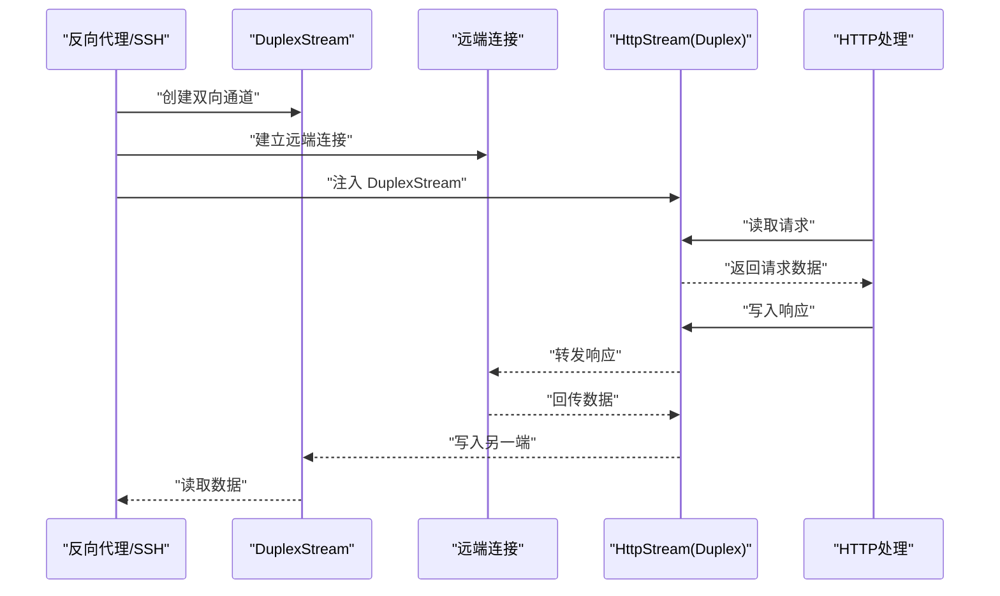
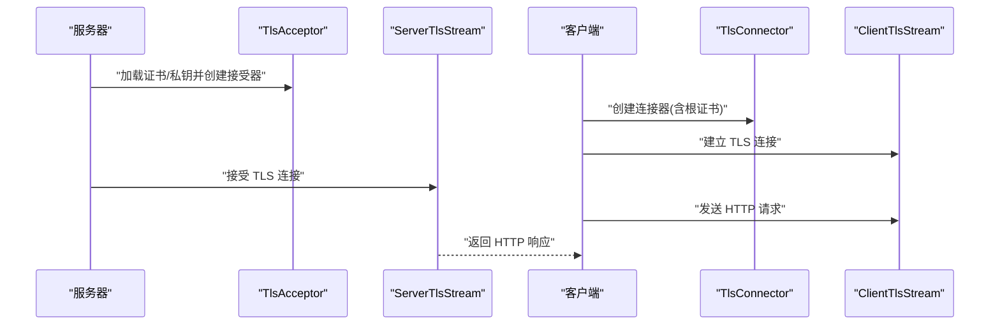
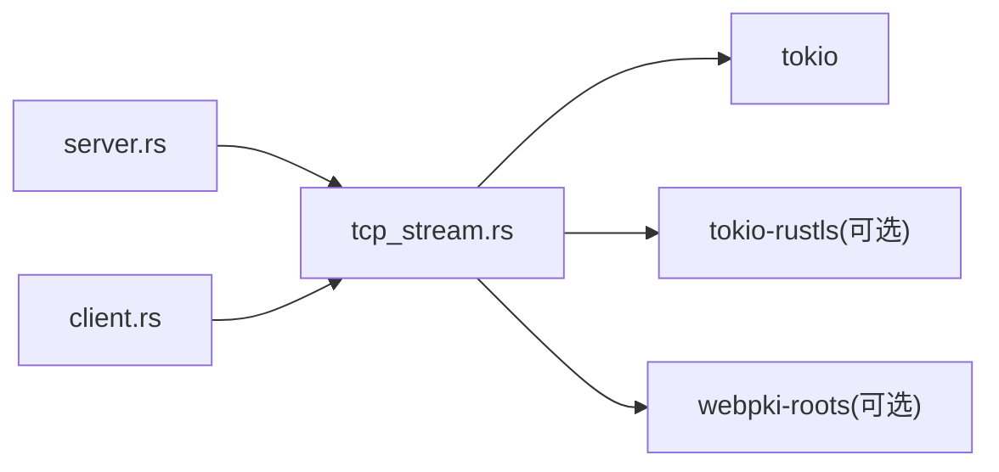

# TCP流处理

<cite>
**本文引用的文件**
- [tcp_stream.rs](file://potato/src/utils/tcp_stream.rs)
- [Cargo.toml](file://potato/Cargo.toml)
- [server.rs](file://potato/src/server.rs)
- [client.rs](file://potato/src/client.rs)
- [00_http_server.rs](file://examples/server/00_http_server.rs)
- [01_https_server.rs](file://examples/server/01_https_server.rs)
- [00_client.rs](file://examples/client/00_client.rs)
- [02_client_session.rs](file://examples/client/02_client_session.rs)
- [13_reverse_proxy_server.rs](file://examples/server/13_reverse_proxy_server.rs)
- [14_reverse_proxy_with_ssh_server.rs](file://examples/server/14_reverse_proxy_with_ssh_server.rs)
</cite>

## 目录
1. [简介](#简介)
2. [项目结构](#项目结构)
3. [核心组件](#核心组件)
4. [架构总览](#架构总览)
5. [详细组件分析](#详细组件分析)
6. [依赖关系分析](#依赖关系分析)
7. [性能考量](#性能考量)
8. [故障排查指南](#故障排查指南)
9. [结论](#结论)
10. [附录](#附录)

## 简介
本文件系统性阐述 TCP 流处理模块的设计与实现，重点覆盖以下方面：
- HttpStream 枚举类型的统一抽象：对 TCP、TLS 客户端与服务器 TLS 流进行一致封装，屏蔽底层差异。
- TcpStreamExt 特征的扩展能力：为 TCP 与 TLS 流提供统一的异步读写接口与扩展点。
- VecU8Ext 特征：为 Vec<u8> 提供基于 HttpStream 的增量读取扩展，简化缓冲区管理。
- 实际使用示例：HTTP 服务器与客户端、HTTPS 服务、反向代理与通过 SSH 跳板的反向代理。
- TLS 支持与安全配置：特性开关、证书加载、连接器与接受器的使用方式。
- DuplexStream 的用途与场景：在反向代理与 SSH 跳板场景中作为中间桥接通道。

## 项目结构
该模块位于 potato/src/utils/tcp_stream.rs，围绕 HttpStream、TcpStreamExt、VecU8Ext 三个核心构件构建，并在 server.rs 与 client.rs 中被广泛使用。特性开关 tls 控制 TLS 功能的编译与运行时行为。

图表来源
- [tcp_stream.rs](file://potato/src/utils/tcp_stream.rs#L1-L130)
- [server.rs](file://potato/src/server.rs#L826-L916)
- [client.rs](file://potato/src/client.rs#L62-L157)
- [00_http_server.rs](file://examples/server/00_http_server.rs#L1-L12)
- [01_https_server.rs](file://examples/server/01_https_server.rs#L1-L12)
- [00_client.rs](file://examples/client/00_client.rs#L1-L7)
- [02_client_session.rs](file://examples/client/02_client_session.rs#L1-L10)
- [13_reverse_proxy_server.rs](file://examples/server/13_reverse_proxy_server.rs#L1-L10)
- [14_reverse_proxy_with_ssh_server.rs](file://examples/server/14_reverse_proxy_with_ssh_server.rs#L1-L24)

章节来源
- [tcp_stream.rs](file://potato/src/utils/tcp_stream.rs#L1-L130)
- [Cargo.toml](file://potato/Cargo.toml#L65-L72)

## 核心组件
- HttpStream：统一抽象 TCP、服务器 TLS、客户端 TLS 与 DuplexStream，提供统一的读写接口。
- TcpStreamExt：为 TCP 与 TLS 流提供扩展能力（当前为空实现，预留扩展点）。
- VecU8Ext：为 Vec<u8> 提供基于 HttpStream 的增量读取扩展，简化缓冲区增长与 EOF 处理。

章节来源
- [tcp_stream.rs](file://potato/src/utils/tcp_stream.rs#L11-L129)

## 架构总览
下图展示了服务器与客户端如何通过 HttpStream 统一处理 TCP/TLS/DuplexStream，以及 TLS 的启用条件与证书加载流程。

图表来源
- [server.rs](file://potato/src/server.rs#L874-L916)
- [client.rs](file://potato/src/client.rs#L68-L98)
- [client.rs](file://potato/src/client.rs#L342-L381)
- [tcp_stream.rs](file://potato/src/utils/tcp_stream.rs#L11-L73)

## 详细组件分析

### HttpStream：统一 TCP/TLS/Duplex 抽象
- 设计目标：对 TCP、服务器 TLS、客户端 TLS 与 DuplexStream 进行统一建模，使上层逻辑无需关心底层传输细节。
- 关键方法：
  - from_tcp/from_server_tls/from_client_tls/from_duplex_stream：从具体流构造 HttpStream。
  - read/read_exact/write_all：统一的异步读写接口，内部根据变体分发到对应底层流。
- 安全与并发：HttpStream 标记为 Send，确保跨任务传递的安全性。

图表来源
- [tcp_stream.rs](file://potato/src/utils/tcp_stream.rs#L11-L73)

章节来源
- [tcp_stream.rs](file://potato/src/utils/tcp_stream.rs#L21-L73)

### TcpStreamExt：扩展点设计
- 当前实现：空特征，仅约束 AsyncRead + AsyncWrite + Unpin + Send，为后续扩展保留空间。
- 已绑定实现：针对 TcpStream、ClientTlsStream、ServerTlsStream 均实现了该特征，保证多态一致性。
- 使用建议：可在该特征上添加常用读取/解析辅助方法，如按分隔符读取、按行读取等。

图表来源
- [tcp_stream.rs](file://potato/src/utils/tcp_stream.rs#L75-L101)

章节来源
- [tcp_stream.rs](file://potato/src/utils/tcp_stream.rs#L75-L101)

### VecU8Ext：向量缓冲区的流读取扩展
- 设计目标：简化从 HttpStream 中增量读取数据到 Vec<u8> 的过程，自动处理 EOF 与缓冲区扩容。
- 关键行为：
  - 使用固定大小临时缓冲区（1024 字节）循环读取。
  - 若读到 0 字节，返回“连接关闭”错误。
  - 将有效数据追加到 Vec<u8> 并返回读取字节数。
- 适用场景：HTTP 请求/响应头与正文的逐步拼接。

图表来源
- [tcp_stream.rs](file://potato/src/utils/tcp_stream.rs#L118-L129)

章节来源
- [tcp_stream.rs](file://potato/src/utils/tcp_stream.rs#L118-L129)

### DuplexStream 的用途与使用场景
- 用途：在需要双向桥接的场景中，将一个方向的数据通过 DuplexStream 另一端透传，常用于反向代理或 SSH 跳板。
- 使用方式：
  - 通过 tokio::io::duplex 创建双向通道。
  - 一端交给 TransferSession/ReverseProxy 使用，另一端注入到 HttpStream::from_duplex_stream。
  - 在 SSH 场景中，通过 SSH 会话通道与本地 DuplexStream 的两端进行数据互转。

图表来源
- [client.rs](file://potato/src/client.rs#L342-L381)
- [client.rs](file://potato/src/client.rs#L382-L390)
- [server.rs](file://potato/src/server.rs#L898-L916)

章节来源
- [client.rs](file://potato/src/client.rs#L342-L390)
- [server.rs](file://potato/src/server.rs#L898-L916)

### TLS 支持与安全配置
- 特性开关：默认启用 tls；可通过特性控制是否编译 TLS 依赖。
- 服务器 HTTPS：
  - 通过证书与私钥文件加载，构建 rustls::ServerConfig，并用 TlsAcceptor 接受连接。
  - 接受后的 TLS 流封装为 HttpStream::ServerTls，后续处理与普通 TCP 一致。
- 客户端 HTTPS：
  - 使用 RootCertStore 加载系统根证书，构建 ClientConfig 与 TlsConnector。
  - 连接成功后封装为 HttpStream::ClientTls，随后进行 HTTP 请求/响应读写。
- 安全建议：
  - 生产环境务必使用受信 CA 签发的证书与私钥。
  - 避免使用默认信任集合，明确指定可信根证书。
  - 启用 TLS1.2+，禁用过时协议与弱密码套件（由依赖库默认策略决定）。

图表来源
- [server.rs](file://potato/src/server.rs#L874-L887)
- [server.rs](file://potato/src/server.rs#L894-L898)
- [client.rs](file://potato/src/client.rs#L68-L98)
- [client.rs](file://potato/src/client.rs#L382-L390)

章节来源
- [Cargo.toml](file://potato/Cargo.toml#L65-L72)
- [server.rs](file://potato/src/server.rs#L874-L916)
- [client.rs](file://potato/src/client.rs#L68-L98)

### 实际使用示例

#### HTTP 服务器
- 示例路径：examples/server/00_http_server.rs
- 行为：启动 HTTP 服务器监听指定地址，处理 /hello 路由。

章节来源
- [00_http_server.rs](file://examples/server/00_http_server.rs#L1-L12)

#### HTTPS 服务器
- 示例路径：examples/server/01_https_server.rs
- 行为：启动 HTTPS 服务器，使用证书与私钥文件提供加密通信。

章节来源
- [01_https_server.rs](file://examples/server/01_https_server.rs#L1-L12)

#### HTTP 客户端（单次请求）
- 示例路径：examples/client/00_client.rs
- 行为：发起一次 HTTPS 请求并打印响应体。

章节来源
- [00_client.rs](file://examples/client/00_client.rs#L1-L7)

#### HTTP 客户端（会话复用）
- 示例路径：examples/client/02_client_session.rs
- 行为：使用 Session 对象复用连接，连续两次请求。

章节来源
- [02_client_session.rs](file://examples/client/02_client_session.rs#L1-L10)

#### 反向代理服务器
- 示例路径：examples/server/13_reverse_proxy_server.rs
- 行为：将请求转发到外部目标（如 GitHub），支持 HTTP/HTTPS。

章节来源
- [13_reverse_proxy_server.rs](file://examples/server/13_reverse_proxy_server.rs#L1-L10)

#### 通过 SSH 跳板的反向代理
- 示例路径：examples/server/14_reverse_proxy_with_ssh_server.rs
- 行为：通过 SSH 跳板建立隧道，结合 DuplexStream 实现数据桥接。

章节来源
- [14_reverse_proxy_with_ssh_server.rs](file://examples/server/14_reverse_proxy_with_ssh_server.rs#L1-L24)

## 依赖关系分析
- 模块内聚：tcp_stream.rs 仅负责流抽象与扩展，职责单一。
- 外部依赖：Tokio 异步 I/O、可选的 tokio-rustls 与 webpki-roots（TLS 功能）。
- 特性控制：tls 特性开启时，编译并启用 TLS 相关类型与实现；否则禁止使用 TLS。

图表来源
- [Cargo.toml](file://potato/Cargo.toml#L39-L41)
- [Cargo.toml](file://potato/Cargo.toml#L65-L72)
- [tcp_stream.rs](file://potato/src/utils/tcp_stream.rs#L1-L9)

章节来源
- [Cargo.toml](file://potato/Cargo.toml#L65-L72)

## 性能考量
- 缓冲策略：VecU8Ext 使用 1024 字节临时缓冲区，平衡内存占用与系统调用次数。
- 复用连接：客户端 Session 通过唯一主机信息复用连接，减少握手开销。
- DuplexStream：在反向代理与 SSH 场景中，避免额外拷贝，直接桥接两端数据。
- TLS 开销：TLS 握手与加解密带来额外 CPU 开销，建议在高并发场景中合理配置证书与会话复用。

## 故障排查指南
- “connection closed”错误：通常表示对端提前关闭连接。检查网络连通性、超时设置与对端行为。
- TLS 握手失败：确认证书链完整、域名匹配与根证书可信。生产环境避免使用默认信任集合。
- 反向代理无响应：检查目标 URL、端口与跳板 SSH 认证状态；验证 DuplexStream 两端数据流转。

章节来源
- [tcp_stream.rs](file://potato/src/utils/tcp_stream.rs#L120-L128)
- [client.rs](file://potato/src/client.rs#L382-L390)

## 结论
TCP 流处理模块通过 HttpStream 将 TCP、TLS 与 DuplexStream 统一抽象，配合 TcpStreamExt 与 VecU8Ext 提供了简洁而强大的扩展能力。在服务器与客户端中，该模块支撑了 HTTP/HTTPS、反向代理与 SSH 跳板等复杂场景，既保持了代码的可维护性，又兼顾了性能与安全性。

## 附录
- 特性开关参考：tls、openapi、ssh、webdav、jemalloc 等。
- 关键实现参考路径：
  - HttpStream 与扩展：[tcp_stream.rs](file://potato/src/utils/tcp_stream.rs#L11-L129)
  - 服务器 HTTPS：[server.rs](file://potato/src/server.rs#L874-L916)
  - 客户端 HTTPS：[client.rs](file://potato/src/client.rs#L68-L98)
  - 反向代理与 SSH：[client.rs](file://potato/src/client.rs#L342-L390)