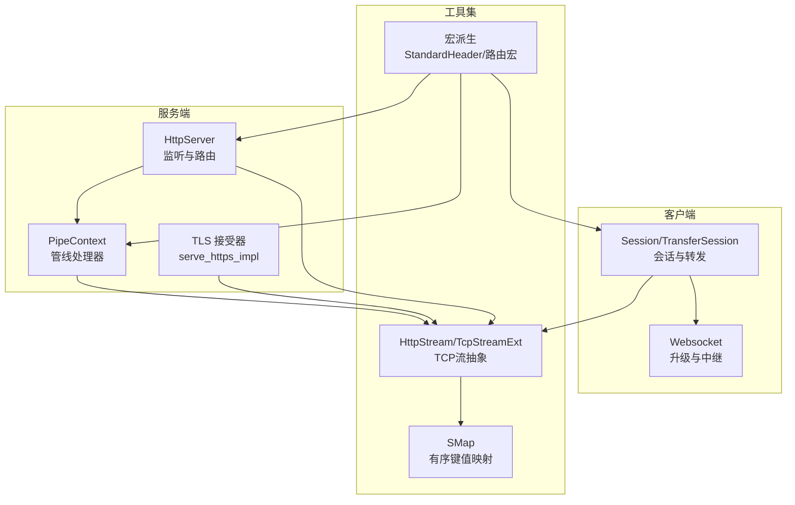
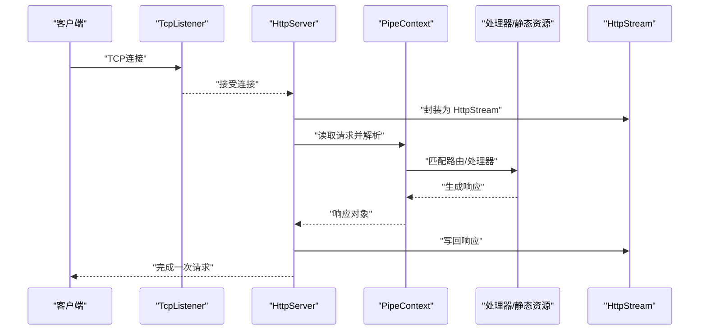
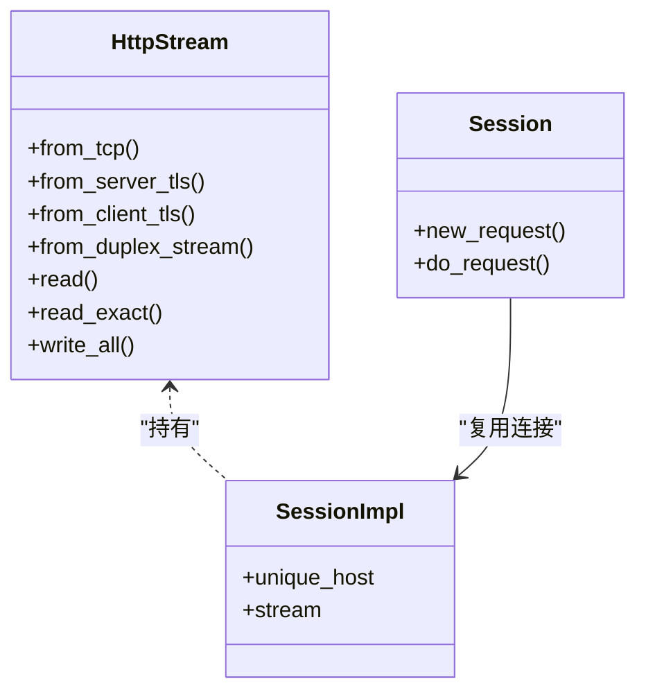
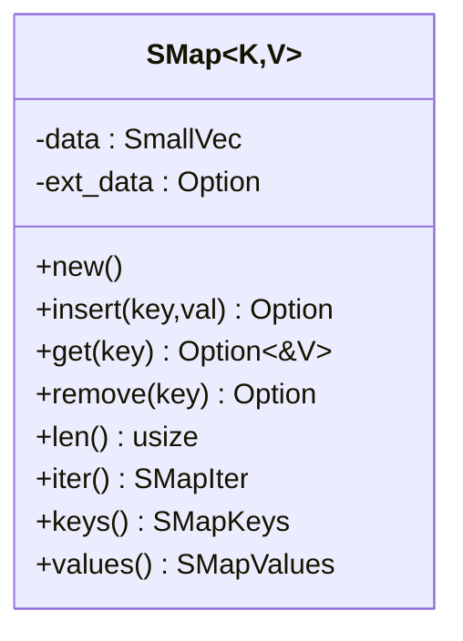
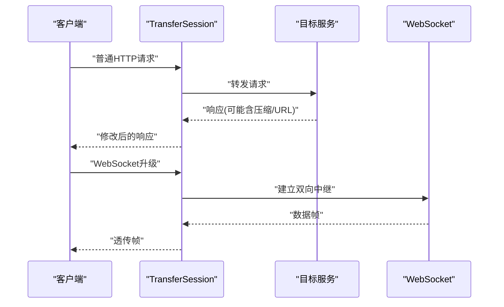
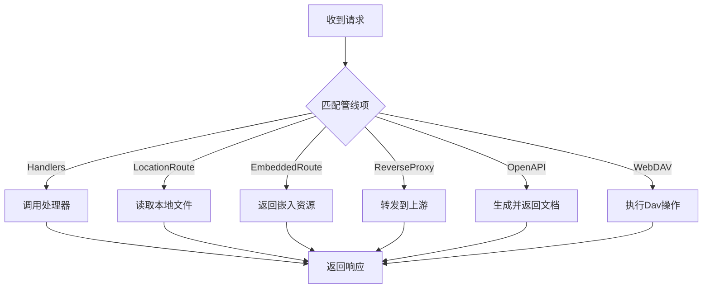
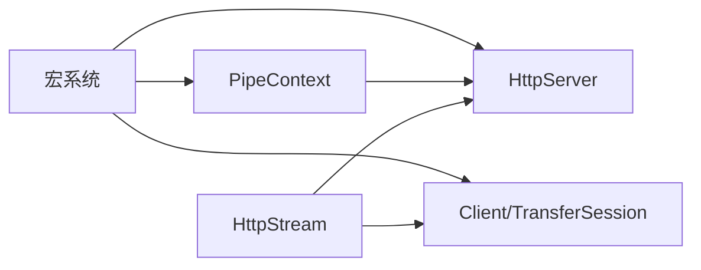

# 网络工具

<cite>
**本文引用的文件**
- [lib.rs](file://potato/src/lib.rs)
- [tcp_stream.rs](file://potato/src/utils/tcp_stream.rs)
- [smap.rs](file://potato/src/utils/smap.rs)
- [client.rs](file://potato/src/client.rs)
- [server.rs](file://potato/src/server.rs)
- [global_config.rs](file://potato/src/global_config.rs)
- [lib.rs（宏）](file://potato-macro/src/lib.rs)
- [00_http_server.rs](file://examples/server/00_http_server.rs)
- [00_client.rs](file://examples/client/00_client.rs)
- [04_server_route.md](file://docs/en/guide/04_server_route.md)
</cite>

## 目录
1. [简介](#简介)
2. [项目结构](#项目结构)
3. [核心组件](#核心组件)
4. [架构总览](#架构总览)
5. [详细组件分析](#详细组件分析)
6. [依赖关系分析](#依赖关系分析)
7. [性能考量](#性能考量)
8. [故障排查指南](#故障排查指南)
9. [结论](#结论)
10. [附录：实际示例与最佳实践](#附录实际示例与最佳实践)

## 简介
本文件系统性梳理“网络工具模块”的设计与实现，重点覆盖以下方面：
- TCP 流处理：连接管理、流控制、错误恢复
- Socket 映射工具（SMAP）：地址解析、端口管理、网络配置
- 网络状态监控与诊断：连接统计与性能指标
- 实战示例：HTTP 服务器与客户端的应用
- 安全与防火墙建议：TLS、认证、代理与跳板机

## 项目结构
该模块以“服务端 + 客户端 + 工具集”为核心组织，核心文件分布如下：
- 服务端：负责监听、路由、管线化处理、TLS 终止、反向代理等
- 客户端：会话复用、连接池、反向/正向代理、WebSocket 转发
- 工具集：TCP 流抽象、键值映射（SMAP）、宏派生与头部标准化

图示来源
- [server.rs](file://potato/src/server.rs#L769-L933)
- [client.rs](file://potato/src/client.rs#L101-L157)
- [tcp_stream.rs](file://potato/src/utils/tcp_stream.rs#L11-L73)
- [smap.rs](file://potato/src/utils/smap.rs#L5-L97)
- [lib.rs（宏）](file://potato-macro/src/lib.rs#L302-L343)

章节来源
- [server.rs](file://potato/src/server.rs#L769-L933)
- [client.rs](file://potato/src/client.rs#L101-L157)
- [tcp_stream.rs](file://potato/src/utils/tcp_stream.rs#L11-L73)
- [smap.rs](file://potato/src/utils/smap.rs#L5-L97)
- [lib.rs（宏）](file://potato-macro/src/lib.rs#L302-L343)

## 核心组件
- HttpStream：统一 TCP/TLS/Duplex 流抽象，屏蔽底层差异，提供统一的读写接口
- Session/TransferSession：客户端会话与连接池、目标主机识别、TLS 连接建立、反向/正向代理、WebSocket 升级与中继
- PipeContext：服务端管线化路由，支持处理器、静态资源、嵌入资源、OpenAPI 文档、反向代理、WebDAV 等
- SMap：基于 SmallVec 的有序键值映射，兼顾小规模快速路径与扩展哈希表
- 宏系统：路由宏与 StandardHeader 派生，简化 HTTP 方法与头部声明

章节来源
- [tcp_stream.rs](file://potato/src/utils/tcp_stream.rs#L11-L73)
- [client.rs](file://potato/src/client.rs#L62-L157)
- [server.rs](file://potato/src/server.rs#L54-L127)
- [smap.rs](file://potato/src/utils/smap.rs#L5-L97)
- [lib.rs（宏）](file://potato-macro/src/lib.rs#L302-L343)

## 架构总览
下图展示了从请求进入、路由匹配到响应返回的完整链路，以及 TLS 终止、代理与 WebSocket 中继的关键节点。

图示来源
- [server.rs](file://potato/src/server.rs#L826-L871)
- [lib.rs](file://potato/src/lib.rs#L588-L699)

章节来源
- [server.rs](file://potato/src/server.rs#L826-L871)
- [lib.rs](file://potato/src/lib.rs#L588-L699)

## 详细组件分析

### TCP 流处理与连接管理
- HttpStream 抽象
  - 支持原生 TCP、服务端 TLS、客户端 TLS、DuplexStream
  - 提供统一的 read/read_exact/write_all 接口，便于上层协议处理
- 连接生命周期
  - 服务端：每连接一个任务循环读取请求、写回响应；根据 Connection 头决定是否保持连接
  - 客户端：按目标主机+SSL+端口聚合为连接键，复用已有连接，减少握手开销
- 错误恢复
  - 读到 0 字节视为连接关闭，立即退出循环
  - TLS 握手失败或代理通道异常时返回错误，由上层决定重试策略

图示来源
- [tcp_stream.rs](file://potato/src/utils/tcp_stream.rs#L11-L73)
- [client.rs](file://potato/src/client.rs#L62-L147)

章节来源
- [tcp_stream.rs](file://potato/src/utils/tcp_stream.rs#L11-L73)
- [client.rs](file://potato/src/client.rs#L62-L147)
- [server.rs](file://potato/src/server.rs#L834-L871)

### Socket 映射工具（SMap）
- 设计要点
  - 小数组优先：容量达阈值后切换到 HashMap，兼顾小规模场景的高性能与可扩展性
  - 二分查找插入/查询：在小规模时保持有序，提升局部性
  - 迭代器：统一 SmallVec 与 HashMap 的遍历语义
- 适用场景
  - 服务端内部路由表、连接映射、会话索引
  - 客户端连接池键空间（主机+SSL+端口）

图示来源
- [smap.rs](file://potato/src/utils/smap.rs#L5-L97)

章节来源
- [smap.rs](file://potato/src/utils/smap.rs#L5-L97)

### 网络状态监控与诊断
- 条件预检与缓存命中
  - 服务端对静态资源与嵌入资源计算 ETag 并支持 If-None-Match/If-Modified-Since，命中则返回 304
  - 客户端在代理模式下可替换响应中的 URL，降低跨域与路径不一致问题
- 性能指标
  - 可通过外部工具采集连接数、吞吐量、延迟；模块内未内置专用计数器
  - 建议结合操作系统监控（如 netstat/ss、系统指标）与业务埋点

章节来源
- [lib.rs](file://potato/src/lib.rs#L777-L800)
- [server.rs](file://potato/src/server.rs#L426-L561)
- [client.rs](file://potato/src/client.rs#L424-L470)

### 客户端与代理
- 会话复用
  - 同一目标主机/SSL/端口共享连接，避免重复握手
- 反向代理
  - 自动剥离/改写响应中的 Transfer-Encoding，注入 Content-Length，必要时替换 URL
  - 支持 WebSocket 升级与中继，自动处理心跳与掩码
- 正向代理
  - 通过 CONNECT 方法建立隧道，支持可选的 SSH 跳板机中转

图示来源
- [client.rs](file://potato/src/client.rs#L275-L591)

章节来源
- [client.rs](file://potato/src/client.rs#L224-L591)

### 服务端管线与路由
- 管线项
  - Handlers：注册处理器函数，按路径与方法匹配
  - LocationRoute：本地文件系统路由
  - EmbeddedRoute：编译期嵌入资源路由
  - ReverseProxy：反向代理
  - OpenAPI：自动生成文档
  - WebDAV：本地/内存文件系统
- TLS 终止
  - 服务端可加载证书与私钥，对进入连接进行 TLS 握手

图示来源
- [server.rs](file://potato/src/server.rs#L54-L127)
- [server.rs](file://potato/src/server.rs#L362-L767)

章节来源
- [server.rs](file://potato/src/server.rs#L54-L127)
- [server.rs](file://potato/src/server.rs#L362-L767)

### 宏与头部标准化
- 路由宏：http_get/post/put/delete/options/head 等，自动收集处理器并注册
- StandardHeader 派生：自动生成头部枚举、字符串互转与应用方法，简化请求头设置

章节来源
- [lib.rs（宏）](file://potato-macro/src/lib.rs#L302-L343)
- [lib.rs（宏）](file://potato-macro/src/lib.rs#L345-L399)

## 依赖关系分析
- 组件耦合
  - HttpStream 作为底层抽象被服务端与客户端广泛使用，耦合度高但职责单一
  - PipeContext 作为路由中枢，向上游暴露统一接口，向下依赖处理器与外部服务
  - 宏系统解耦了路由与头部声明的样板代码
- 外部依赖
  - TLS：tokio-rustls、webpki-roots
  - WebSocket：标准帧格式解析与掩码处理
  - 反向代理：HTTP/1.1 语义与压缩响应处理

图示来源
- [tcp_stream.rs](file://potato/src/utils/tcp_stream.rs#L11-L73)
- [server.rs](file://potato/src/server.rs#L769-L933)
- [client.rs](file://potato/src/client.rs#L101-L157)
- [lib.rs（宏）](file://potato-macro/src/lib.rs#L302-L343)

章节来源
- [tcp_stream.rs](file://potato/src/utils/tcp_stream.rs#L11-L73)
- [server.rs](file://potato/src/server.rs#L769-L933)
- [client.rs](file://potato/src/client.rs#L101-L157)
- [lib.rs（宏）](file://potato-macro/src/lib.rs#L302-L343)

## 性能考量
- 连接复用
  - 客户端按目标三元组复用连接，显著降低 TLS 握手与建连成本
- 小对象优化
  - SMap 在小规模时使用 SmallVec，减少分配与提升缓存命中
- 压缩与内容改写
  - 反向代理可对 gzip 内容进行解压、替换 URL 后再压缩，平衡带宽与一致性
- I/O 批量
  - HttpStream 使用固定缓冲区批量读取，避免过多系统调用

章节来源
- [client.rs](file://potato/src/client.rs#L327-L473)
- [smap.rs](file://potato/src/utils/smap.rs#L5-L97)
- [tcp_stream.rs](file://potato/src/utils/tcp_stream.rs#L118-L129)

## 故障排查指南
- 连接提前关闭
  - 现象：读取返回 0 字节
  - 处理：检查对端是否主动断开、超时设置、代理链路健康
- TLS 握手失败
  - 现象：客户端报错或服务端无法接受 TLS
  - 处理：确认证书链、域名 SAN、时间同步；非 TLS 构建禁用 SSL 场景
- WebSocket 心跳中断
  - 现象：长时间无活动后断开
  - 处理：调整心跳间隔；服务端可通过配置接口设置 ping 周期
- 反向代理 URL 不一致
  - 现象：静态资源路径指向上游地址
  - 处理：启用 modify_content，自动替换响应中的上游 URL 为本地前缀

章节来源
- [tcp_stream.rs](file://potato/src/utils/tcp_stream.rs#L120-L128)
- [client.rs](file://potato/src/client.rs#L384-L411)
- [global_config.rs](file://potato/src/global_config.rs#L28-L34)
- [client.rs](file://potato/src/client.rs#L424-L470)

## 结论
该网络工具模块以 HttpStream 为统一抽象，配合 SMap、宏系统与管线化路由，实现了简洁而强大的 HTTP 服务能力。客户端侧提供连接复用、代理与 WebSocket 中继；服务端侧支持多路由模式与 TLS 终止。通过条件预检与内容改写，兼顾性能与可用性。建议在生产环境结合 TLS 与认证策略、严格的防火墙规则与可观测性体系，确保安全与稳定。

## 附录：实际示例与最佳实践
- HTTP 服务器示例
  - 使用路由宏定义处理器，启动 HTTP 服务
  - 参考：[00_http_server.rs](file://examples/server/00_http_server.rs#L1-L12)
- HTTP 客户端示例
  - 直接发起 GET 请求并打印响应
  - 参考：[00_client.rs](file://examples/client/00_client.rs#L1-L7)
- 路由与代理
  - 反向代理与内容改写、OpenAPI 文档、WebDAV 等能力可参考文档
  - 参考：[04_server_route.md](file://docs/en/guide/04_server_route.md#L117-L134)

章节来源
- [00_http_server.rs](file://examples/server/00_http_server.rs#L1-L12)
- [00_client.rs](file://examples/client/00_client.rs#L1-L7)
- [04_server_route.md](file://docs/en/guide/04_server_route.md#L117-L134)