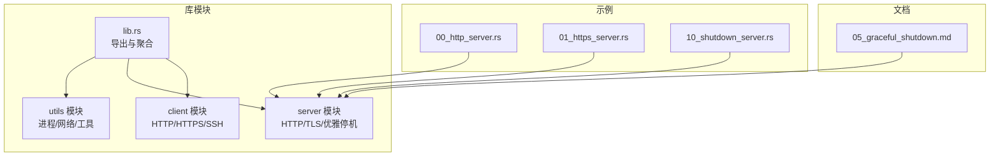
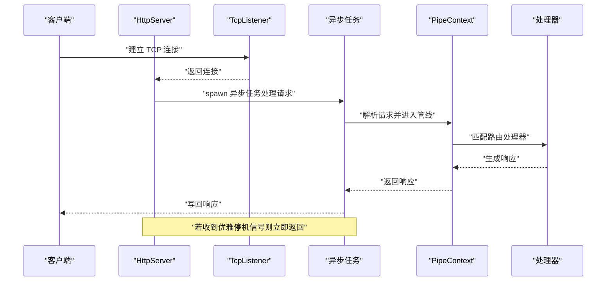
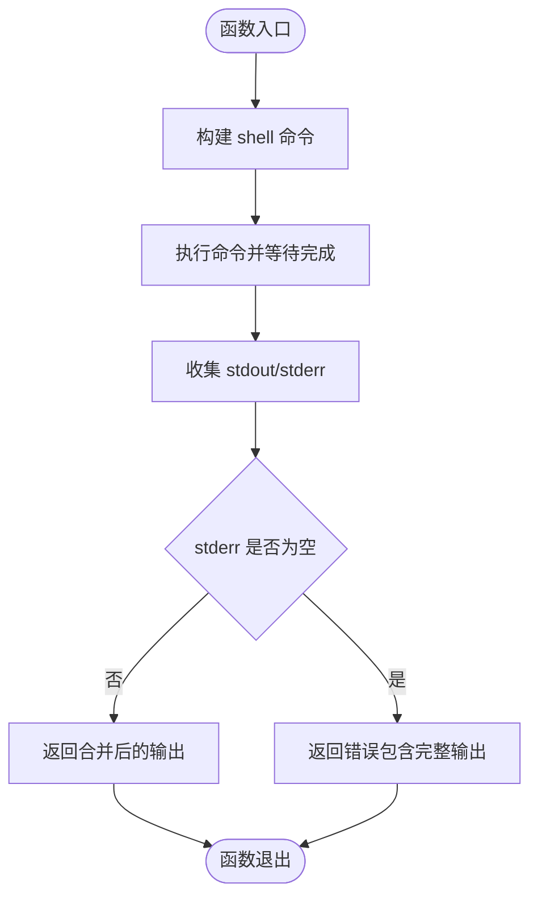
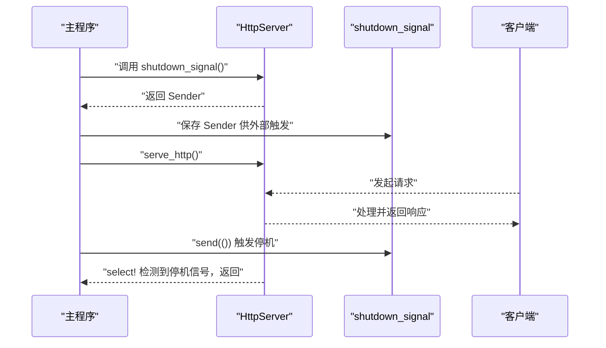
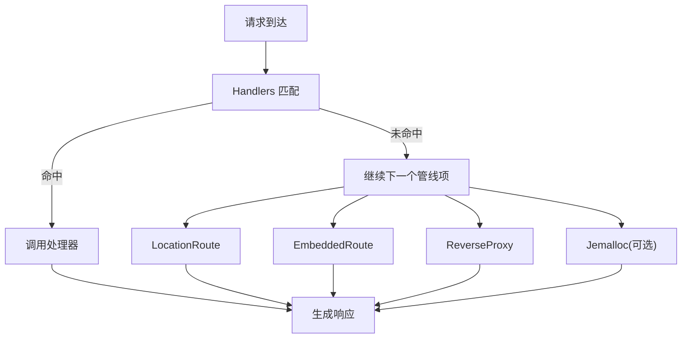
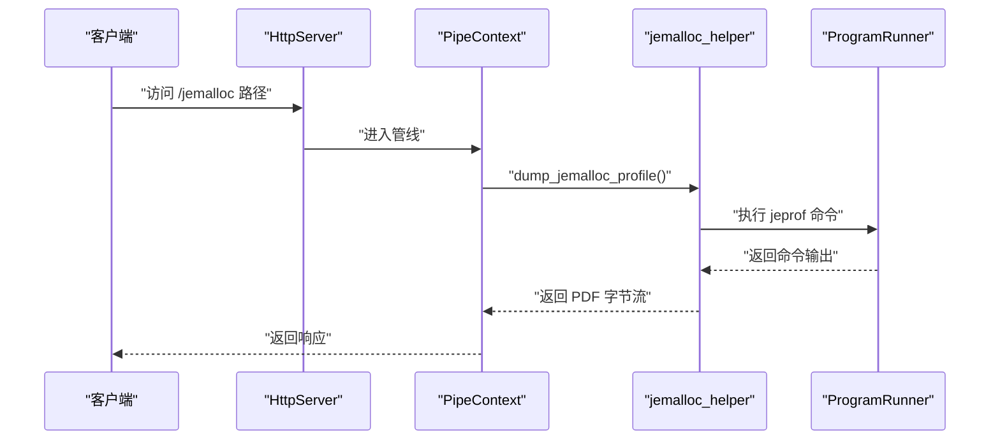
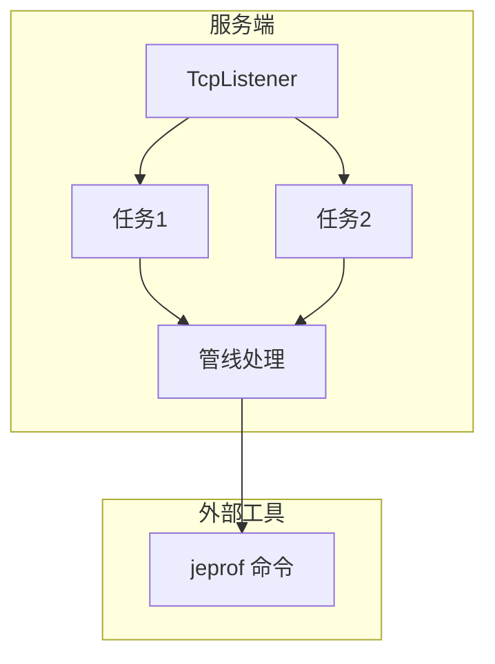
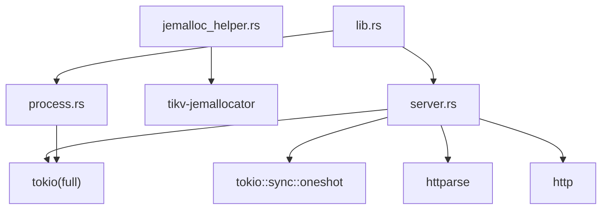

# 进程管理工具

<cite>
**本文引用的文件**
- [process.rs](file://potato/src/utils/process.rs)
- [server.rs](file://potato/src/server.rs)
- [lib.rs](file://potato/src/lib.rs)
- [Cargo.toml](file://potato/Cargo.toml)
- [05_graceful_shutdown.md](file://docs/guide/05_graceful_shutdown.md)
- [10_shutdown_server.rs](file://examples/server/10_shutdown_server.rs)
- [00_http_server.rs](file://examples/server/00_http_server.rs)
- [01_https_server.rs](file://examples/server/01_https_server.rs)
- [jemalloc_helper.rs](file://potato/src/utils/jemalloc_helper.rs)
</cite>

## 目录
1. [简介](#简介)
2. [项目结构](#项目结构)
3. [核心组件](#核心组件)
4. [架构总览](#架构总览)
5. [详细组件分析](#详细组件分析)
6. [依赖关系分析](#依赖关系分析)
7. [性能考量](#性能考量)
8. [故障排查指南](#故障排查指南)
9. [结论](#结论)
10. [附录](#附录)

## 简介
本文件系统化梳理“进程管理工具”模块的设计与实现，重点覆盖以下方面：
- 进程监控：通过命令执行封装与输出收集，实现对子进程运行结果的统一采集与错误判定
- 生命周期管理：基于 Tokio 的异步任务模型，结合 oneshot 通道实现优雅停机
- 资源使用监控：集成 jemalloc 分析能力，支持生成内存剖析报告并返回给客户端
- 信号处理机制：通过 oneshot 通道模拟外部信号（如 SIGTERM/SIGINT）的捕获与响应
- 进程间通信（IPC）：涵盖 TCP 套接字、HTTP 请求/响应流、以及通过命令行工具进行的外部进程交互
- 多进程架构与故障恢复：以单进程主服务为核心，配合异步任务池与连接复用策略，实现高可用与可恢复性

## 项目结构
该模块位于 potato 库中，核心文件组织如下：
- 工具模块 utils：包含进程执行、TCP 流、枚举、字符串等通用工具
- 服务器模块 server：提供 HTTP/TLS 服务、优雅停机、中间件管线
- 客户端模块 client：提供 HTTP/HTTPS/SSH 等连接能力（与 IPC 相关）
- 示例 examples：包含 HTTP/HTTPS 服务与优雅停机示例
- 文档 docs：包含优雅停机指南与使用说明

图表来源
- [server.rs](file://potato/src/server.rs#L769-L871)
- [lib.rs](file://potato/src/lib.rs#L1-L20)

章节来源
- [lib.rs](file://potato/src/lib.rs#L1-L20)
- [Cargo.toml](file://potato/Cargo.toml#L1-L20)

## 核心组件
- 进程执行器 ProgramRunner：封装 shell 命令执行，收集 stdout/stderr 并根据错误输出判定结果
- 服务器 HttpServer：提供 serve_http/serve_https 服务方法，支持优雅停机
- 中间件管线 PipeContext：路由、静态资源、反向代理、OpenAPI、WebDAV 等扩展点
- 优雅停机通道：通过 shutdown_signal 获取 oneshot Sender/Receiver，实现外部触发停机
- jemalloc 辅助：初始化 jemalloc、生成内存剖析 PDF，并通过 HTTP 接口返回

章节来源
- [process.rs](file://potato/src/utils/process.rs#L1-L27)
- [server.rs](file://potato/src/server.rs#L769-L871)
- [jemalloc_helper.rs](file://potato/src/utils/jemalloc_helper.rs#L14-L70)

## 架构总览
下图展示了从请求接入到处理完成的关键路径，以及优雅停机的触发流程。

图表来源
- [server.rs](file://potato/src/server.rs#L826-L871)
- [server.rs](file://potato/src/server.rs#L362-L380)

## 详细组件分析

### 组件一：进程执行器 ProgramRunner
- 功能概述
  - 使用 SHELL 执行传入的命令字符串，收集标准输出与标准错误
  - 将输出拼接为字符串，依据 stderr 是否为空决定成功或失败
- 关键点
  - 命令通过 shell -c 执行，便于支持复杂命令链
  - 输出合并后统一返回，便于上层进行日志与错误处理
- 复杂度与性能
  - 时间复杂度近似 O(N)，N 为输出大小；空间复杂度 O(N)
  - 适合短时、非高频的外部命令调用场景

图表来源
- [process.rs](file://potato/src/utils/process.rs#L7-L25)

章节来源
- [process.rs](file://potato/src/utils/process.rs#L1-L27)

### 组件二：HttpServer 与优雅停机
- 功能概述
  - 提供 serve_http/serve_https 两种服务模式
  - 通过 shutdown_signal 获取 oneshot 通道，实现外部触发的优雅停机
  - 在服务循环中使用 select! 同时监听服务逻辑与停机信号
- 关键点
  - shutdown_signal 返回 Sender，由外部通过 HTTP 接口触发
  - 服务循环在收到信号后立即返回，不再接受新连接或处理新请求
- 复杂度与性能
  - 服务循环为 O(1) 每次迭代，受连接数影响主要体现在任务并发与 IO
  - 优雅停机不中断已处理中的请求，保证一致性

图表来源
- [server.rs](file://potato/src/server.rs#L790-L810)
- [server.rs](file://potato/src/server.rs#L799-L810)

章节来源
- [server.rs](file://potato/src/server.rs#L769-L871)
- [05_graceful_shutdown.md](file://docs/guide/05_graceful_shutdown.md#L1-L29)
- [10_shutdown_server.rs](file://examples/server/10_shutdown_server.rs#L1-L22)

### 组件三：中间件管线 PipeContext
- 功能概述
  - 支持处理器链、静态资源、嵌入式资源、反向代理、OpenAPI、WebDAV 等扩展
  - 通过有序的 PipeContextItem 列表串联处理步骤
- 关键点
  - Handlers：按路径与方法匹配处理器
  - LocationRoute：本地文件系统路由，支持 ETag 预检
  - EmbeddedRoute：将资源内嵌进二进制，支持 ETag 预检
  - ReverseProxy：转发请求至上游服务
  - Jemalloc：在启用 jemalloc 特性时，暴露内存剖析接口
- 复杂度与性能
  - 管线遍历为 O(K)，K 为管线项数量；通常 K 很小
  - 静态资源与嵌入式资源命中后直接返回，IO 受文件大小影响

图表来源
- [server.rs](file://potato/src/server.rs#L362-L767)

章节来源
- [server.rs](file://potato/src/server.rs#L40-L132)
- [server.rs](file://potato/src/server.rs#L362-L767)

### 组件四：jemalloc 内存剖析与资源监控
- 功能概述
  - 初始化 jemalloc，支持通过环境变量启用剖析
  - 生成剖析数据并转换为 PDF，通过 HTTP 接口返回
- 关键点
  - 通过 ProgramRunner 调用 jeprof 生成 PDF
  - 返回前清理临时文件，避免磁盘污染
- 复杂度与性能
  - 剖析生成为 CPU 密集型操作，建议在低频场景使用
  - 返回响应为一次性读取，内存占用与 PDF 大小相关

图表来源
- [jemalloc_helper.rs](file://potato/src/utils/jemalloc_helper.rs#L36-L70)
- [server.rs](file://potato/src/server.rs#L629-L667)

章节来源
- [jemalloc_helper.rs](file://potato/src/utils/jemalloc_helper.rs#L14-L70)
- [server.rs](file://potato/src/server.rs#L629-L667)

### 组件五：进程间通信（IPC）与多进程架构
- TCP 套接字
  - 服务器通过 TcpListener 接收连接，每个连接 spawn 一个异步任务处理
  - 任务内部循环解析请求、调用管线、写回响应
- 命令行工具与外部进程
  - 通过 ProgramRunner 执行外部命令（如 jeprof），实现与外部工具的 IPC
- 多进程架构与故障恢复
  - 单进程主服务 + 多个异步任务处理请求，具备良好的并发与隔离性
  - 优雅停机确保在无新请求接入的情况下平滑结束现有任务
  - TLS 与反向代理等特性增强服务的可扩展性与安全性

图表来源
- [server.rs](file://potato/src/server.rs#L826-L871)
- [process.rs](file://potato/src/utils/process.rs#L7-L25)

章节来源
- [server.rs](file://potato/src/server.rs#L826-L916)
- [process.rs](file://potato/src/utils/process.rs#L1-L27)

## 依赖关系分析
- 依赖特征
  - 服务器模块依赖 Tokio 的异步运行时与 oneshot 通道
  - jemalloc 相关功能通过特性开关启用
  - 客户端模块支持 SSH 通道（与 IPC 相关）
- 依赖图

图表来源
- [Cargo.toml](file://potato/Cargo.toml#L16-L42)
- [server.rs](file://potato/src/server.rs#L1-L20)
- [jemalloc_helper.rs](file://potato/src/utils/jemalloc_helper.rs#L1-L10)
- [process.rs](file://potato/src/utils/process.rs#L1-L3)

章节来源
- [Cargo.toml](file://potato/Cargo.toml#L16-L76)

## 性能考量
- 服务器并发模型
  - 每个连接 spawn 一个任务，适合高并发短连接场景
  - Keep-Alive 连接可减少任务创建开销，但需注意资源占用
- IO 与内存
  - 静态资源与嵌入式资源命中后直接返回，减少解析成本
  - jemalloc 剖析为一次性操作，建议在诊断阶段使用
- 网络与 TLS
  - TLS 会增加 CPU 开销，建议在需要加密的场景启用
- 建议
  - 对高频请求采用连接池与缓存策略
  - 在生产环境谨慎开启 jemalloc 剖析，避免影响性能

## 故障排查指南
- 优雅停机无效
  - 确认是否正确调用 shutdown_signal 并保存了 Sender
  - 确认是否通过 HTTP 接口触发了 send(())
- jemalloc 剖析失败
  - 确认 MALLOC_CONF=prof:true 环境变量已设置
  - 确认 jeprof 工具可用且路径正确
- 命令执行异常
  - 检查 SHELL 环境变量与命令格式
  - 查看 stderr 输出定位问题
- TLS 证书问题
  - 确认证书与私钥文件路径正确
  - 检查证书格式与权限

章节来源
- [05_graceful_shutdown.md](file://docs/guide/05_graceful_shutdown.md#L1-L29)
- [jemalloc_helper.rs](file://potato/src/utils/jemalloc_helper.rs#L20-L34)
- [process.rs](file://potato/src/utils/process.rs#L14-L16)

## 结论
本模块以简洁的 API 和清晰的职责划分，提供了可靠的进程执行、优雅停机、资源监控与多进程协作能力。通过中间件管线与特性开关，既能满足轻量需求，也能扩展到更复杂的生产场景。建议在实际部署中结合业务特点选择合适的并发模型与监控手段，并在变更前做好回归测试与性能评估。

## 附录
- 示例参考
  - HTTP 服务示例：[00_http_server.rs](file://examples/server/00_http_server.rs#L1-L12)
  - HTTPS 服务示例：[01_https_server.rs](file://examples/server/01_https_server.rs#L1-L12)
  - 优雅停机示例：[10_shutdown_server.rs](file://examples/server/10_shutdown_server.rs#L1-L22)
  - 优雅停机文档：[05_graceful_shutdown.md](file://docs/guide/05_graceful_shutdown.md#L1-L29)