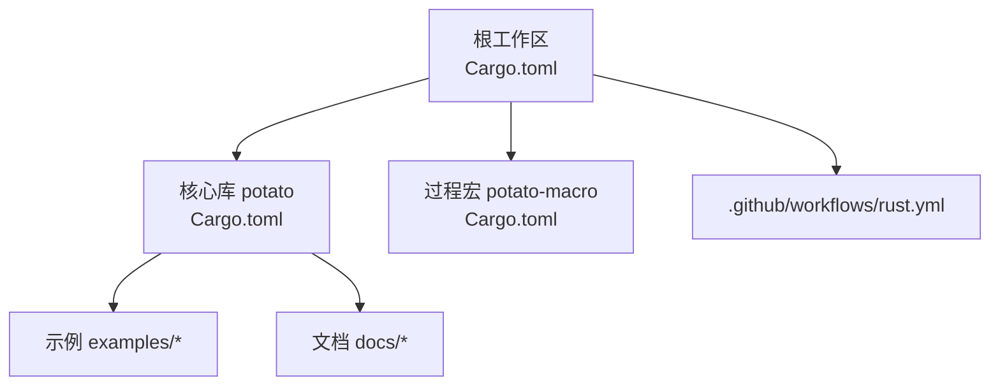
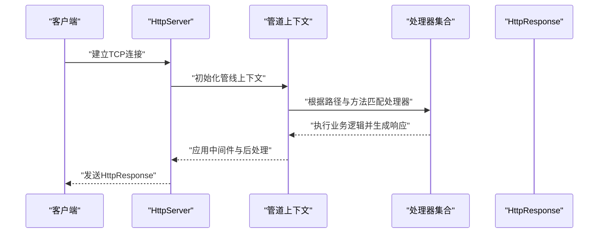
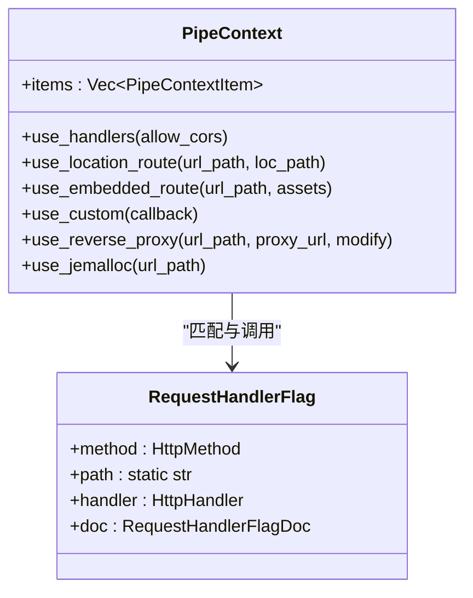
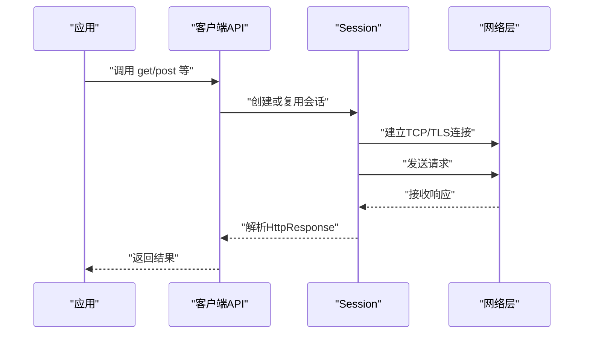
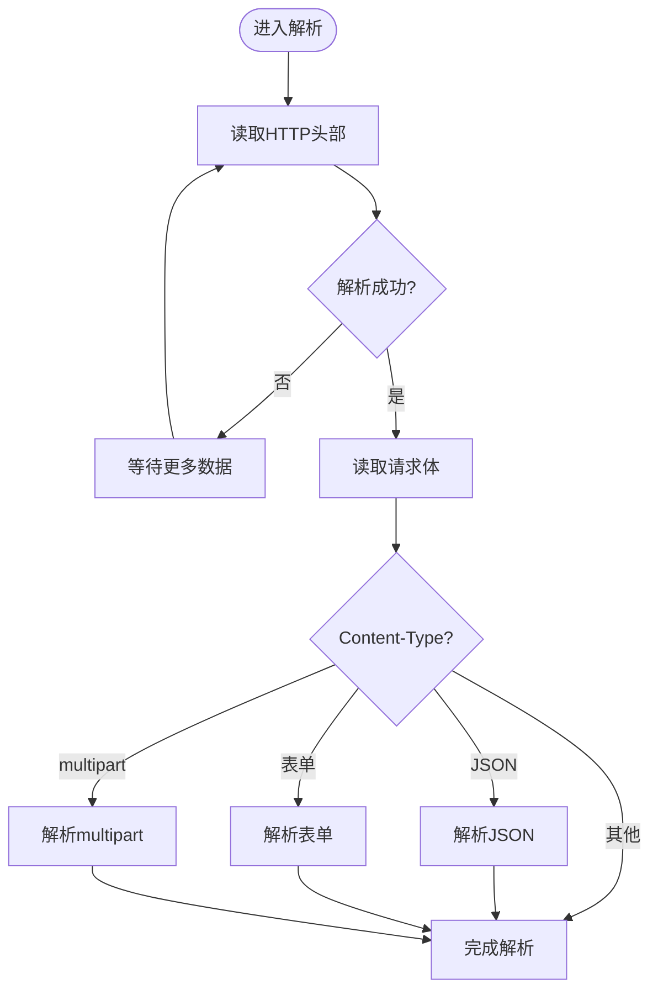
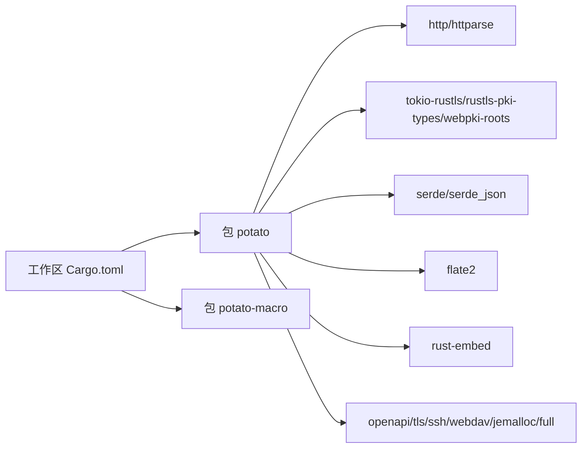

# 开发指南

<cite>
**本文引用的文件**
- [Cargo.toml](file://Cargo.toml)
- [README.md](file://README.md)
- [.github/workflows/rust.yml](file://.github/workflows/rust.yml)
- [LICENSE](file://LICENSE)
- [docs/README.md](file://docs/README.md)
- [docs/guide/00_introduction.md](file://docs/guide/00_introduction.md)
- [potato/Cargo.toml](file://potato/Cargo.toml)
- [potato-macro/Cargo.toml](file://potato-macro/Cargo.toml)
- [potato/src/lib.rs](file://potato/src/lib.rs)
- [potato/src/server.rs](file://potato/src/server.rs)
- [potato/src/client.rs](file://potato/src/client.rs)
- [examples/server/00_http_server.rs](file://examples/server/00_http_server.rs)
- [examples/client/00_client.rs](file://examples/client/00_client.rs)
</cite>

## 目录
1. [简介](#简介)
2. [项目结构](#项目结构)
3. [核心组件](#核心组件)
4. [架构总览](#架构总览)
5. [详细组件分析](#详细组件分析)
6. [依赖关系分析](#依赖关系分析)
7. [性能考量](#性能考量)
8. [故障排查指南](#故障排查指南)
9. [结论](#结论)
10. [附录](#附录)

## 简介
本指南面向 Potato 框架贡献者，提供从开发环境搭建、项目结构与代码组织、提交规范、测试与覆盖率、CI/CD 自动化、发布与版本管理、许可证与法律、到社区参与与行为准则的完整开发指引。内容基于仓库现有文件进行提炼与整合，确保非技术背景读者也能顺畅上手。

## 项目结构
仓库采用多包工作区（workspace）组织，核心模块与宏包分离，示例与文档独立存放，便于维护与扩展。

- 工作区定义：根目录通过工作区配置声明成员包，统一版本与构建策略。
- 包结构：
  - potato：核心库，包含服务端、客户端、通用工具与导出入口。
  - potato-macro：过程宏包，提供注解与代码生成能力。
- 示例与文档：
  - examples：服务端与客户端示例，覆盖 HTTP、HTTPS、OpenAPI、WebSocket、WebDAV、反向代理等场景。
  - docs：文档站点配置与指南文章，包含特性说明与使用建议。
- CI：GitHub Actions 定义了基础的构建与测试流水线。

图表来源
- [Cargo.toml](file://Cargo.toml#L1-L4)
- [potato/Cargo.toml](file://potato/Cargo.toml#L1-L76)
- [.github/workflows/rust.yml](file://.github/workflows/rust.yml#L1-L23)

章节来源
- [Cargo.toml](file://Cargo.toml#L1-L4)
- [README.md](file://README.md#L1-L57)
- [docs/README.md](file://docs/README.md#L1-L34)

## 核心组件
- 导出入口与公共类型
  - 库导出聚合了客户端、服务端、全局配置、宏与工具模块，并在条件特性下暴露 jemalloc 辅助。
  - 关键公共类型包括方法枚举、压缩模式、WebSocket 帧类型、请求与响应结构体等。
- 服务端管线与路由
  - 通过 inventory 收集注解注册的处理器，形成路径-方法到处理器的映射。
  - 管线上下文支持多种中间件：内置处理器、位置路由、嵌入式资源路由、自定义回调、反向代理、可选的 jemalloc 路由、WebDAV 路由等。
- 客户端会话与请求
  - Session 封装连接与 TLS，支持多方法请求与 JSON 请求体便捷构造。
  - 提供与 Session 对应的顶层函数式 API，简化一次性请求。

章节来源
- [potato/src/lib.rs](file://potato/src/lib.rs#L1-L1220)
- [potato/src/server.rs](file://potato/src/server.rs#L1-L933)
- [potato/src/client.rs](file://potato/src/client.rs#L1-L615)

## 架构总览
下图展示了从请求进入服务端到响应返回的关键路径，以及客户端发起请求的流程。

图表来源
- [potato/src/server.rs](file://potato/src/server.rs#L28-L38)
- [potato/src/server.rs](file://potato/src/server.rs#L133-L200)
- [potato/src/lib.rs](file://potato/src/lib.rs#L124-L175)

## 详细组件分析

### 服务端组件分析
- 处理器注册与发现
  - 使用 inventory 在编译期收集 RequestHandlerFlag，按路径与方法建立映射，运行时直接查找调用。
- 管线上下文
  - 支持多阶段处理：内置处理器、位置路由、嵌入式资源、自定义回调、反向代理、可选 jemalloc 与 WebDAV。
- OpenAPI 文档生成
  - 在启用 openapi 特性时，遍历已注册处理器，生成索引与路径描述，用于文档展示。

图表来源
- [potato/src/lib.rs](file://potato/src/lib.rs#L126-L175)
- [potato/src/server.rs](file://potato/src/server.rs#L40-L132)

章节来源
- [potato/src/lib.rs](file://potato/src/lib.rs#L124-L175)
- [potato/src/server.rs](file://potato/src/server.rs#L28-L132)

### 客户端组件分析
- 会话与连接
  - Session 维护唯一主机连接，按需建立 TCP 或 TLS 连接；支持多方法请求与 JSON 请求体。
- 方法式 API
  - 提供 get/post/put/delete/head/options/connect/patch/trace 等顶层函数，内部委托 Session 实现。

图表来源
- [potato/src/client.rs](file://potato/src/client.rs#L105-L157)
- [potato/src/client.rs](file://potato/src/client.rs#L159-L200)

章节来源
- [potato/src/client.rs](file://potato/src/client.rs#L1-L615)

### 复杂逻辑组件：请求解析与预检
- 请求解析
  - 从字节流解析头部与请求体，支持多种 Content-Type 的解析（JSON、表单、multipart）。
- 条件预检
  - 处理 If-Modified-Since、If-None-Match、If-Match、If-Unmodified-Since 等条件头，决定是否返回 304 或 412。

图表来源
- [potato/src/lib.rs](file://potato/src/lib.rs#L588-L760)

章节来源
- [potato/src/lib.rs](file://potato/src/lib.rs#L588-L800)

## 依赖关系分析
- 工作区与包
  - 根工作区声明成员 potato 与 potato-macro，统一版本与构建策略。
  - potato 包含大量第三方依赖，涵盖 HTTP 解析、序列化、TLS、压缩、嵌入资源、SSH、WebDAV 等。
  - 特性开关控制可选功能，如 openapi、tls、ssh、webdav、jemalloc、full 等。
- 依赖耦合
  - 服务端与客户端共享公共类型与工具模块；宏包为注解提供编译期支持。
  - 特性开启会影响编译产物与运行时能力，需在 PR 中明确说明影响范围。

图表来源
- [Cargo.toml](file://Cargo.toml#L1-L4)
- [potato/Cargo.toml](file://potato/Cargo.toml#L16-L72)
- [potato-macro/Cargo.toml](file://potato-macro/Cargo.toml#L14-L24)

章节来源
- [Cargo.toml](file://Cargo.toml#L1-L4)
- [potato/Cargo.toml](file://potato/Cargo.toml#L16-L72)
- [potato-macro/Cargo.toml](file://potato-macro/Cargo.toml#L14-L24)

## 性能考量
- 字符串与字节优化
  - 使用高效字符串与字节数组封装，减少拷贝与分配，提升解析与传输效率。
- 压缩与传输
  - 支持 gzip 压缩模式，结合 Accept-Encoding 选择性压缩响应体。
- 内存与泄漏排查
  - 可选 jemalloc 特性提供统计与剖析能力，辅助定位内存问题。
- 并发与异步
  - 基于 Tokio 异步运行时，充分利用并发能力；注意在高并发场景下的连接池与超时设置。

章节来源
- [potato/src/lib.rs](file://potato/src/lib.rs#L198-L201)
- [potato/Cargo.toml](file://potato/Cargo.toml#L43-L56)

## 故障排查指南
- 常见问题
  - TLS 功能在未启用 tls 特性时不可用，需确认构建特性与运行环境。
  - WebSocket 升级失败通常由握手头不满足规范导致，检查 Upgrade、Connection、Sec-WebSocket-* 头。
  - multipart 表单解析失败可能由于边界字符串不匹配或编码问题，建议打印原始字节进行诊断。
- 调试建议
  - 启用 jemalloc 特性以获取内存统计与剖析输出。
  - 使用示例程序最小复现问题，逐步排除外部因素。
- 日志与可观测性
  - 在 PR 中补充必要的日志点与错误信息，便于定位问题。

章节来源
- [potato/src/client.rs](file://potato/src/client.rs#L67-L99)
- [potato/src/lib.rs](file://potato/src/lib.rs#L532-L579)

## 结论
本指南基于仓库现有文件，系统梳理了 Potato 框架的开发环境、项目结构、核心组件、依赖关系与性能要点，并提供了 CI/CD、发布与社区参与的实践建议。建议贡献者在提交变更前，对照示例与特性开关验证功能正确性，并在 PR 描述中说明变更动机、影响范围与测试策略。

## 附录

### 开发环境搭建
- Rust 工具链
  - 使用 rustup 安装与管理工具链，确保最低版本满足包元数据要求。
- IDE 配置
  - 推荐使用 VS Code + Rust Analyzer，启用 proc-macro 支持与工作区感知。
- 调试设置
  - 在 VS Code 中为示例程序创建 launch.json，设置断点与日志输出。
- 依赖安装
  - 通过 cargo build 与 cargo test 验证本地环境与特性组合。

章节来源
- [potato/Cargo.toml](file://potato/Cargo.toml#L4-L5)
- [README.md](file://README.md#L1-L57)

### 代码组织与命名约定
- 模块划分
  - 服务端、客户端、工具模块与导出入口清晰分离；宏包独立，避免循环依赖。
- 命名约定
  - 类型名使用大驼峰，方法与字段使用小驼峰；常量使用全大写加下划线。
- 注释与文档
  - 为公共 API 添加简洁明了的注释，必要时提供使用示例链接。

章节来源
- [potato/src/lib.rs](file://potato/src/lib.rs#L1-L16)
- [docs/guide/00_introduction.md](file://docs/guide/00_introduction.md#L1-L76)

### 代码提交规范
- 提交信息格式
  - 类型: 简要描述（不超过 50 字）
  - 类型取值：feat、fix、docs、style、refactor、perf、test、chore、revert
  - 说明变更动机、影响范围与风险提示。
- 分支管理
  - 主分支仅接受通过 CI 的 PR 合并；特性分支以 feature/ 前缀命名。
- PR 流程
  - PR 必须包含测试用例与变更说明；至少一名维护者审核通过后合并。

章节来源
- [.github/workflows/rust.yml](file://.github/workflows/rust.yml#L1-L23)

### 测试策略与覆盖率
- 测试策略
  - 单元测试：针对解析、序列化、管线中间件等关键模块。
  - 集成测试：覆盖典型服务端与客户端场景，包括 HTTPS、WebSocket、WebDAV。
  - 示例驱动：以 examples 为基础编写端到端测试脚本。
- 覆盖率要求
  - 建议核心模块覆盖率不低于 80%，关键路径不低于 90%。
- CI/CD 自动化
  - GitHub Actions 已配置基础构建与测试步骤，建议扩展为多平台矩阵与覆盖率上报。

章节来源
- [.github/workflows/rust.yml](file://.github/workflows/rust.yml#L12-L23)

### 发布流程与版本管理
- 版本号
  - 遵循语义化版本：主版本号.次版本号.修订号；破坏性变更提升主版本号。
- 发布步骤
  - 更新包版本与变更日志；在 CI 中执行构建与测试；通过 cargo publish 发布至 crates.io。
- 特性与兼容性
  - 新增可选特性需在文档中标注，并在 PR 中说明对默认特性的潜在影响。

章节来源
- [potato/Cargo.toml](file://potato/Cargo.toml#L1-L14)
- [LICENSE](file://LICENSE#L1-L22)

### 许可证与法律
- 许可证
  - 项目采用 MIT 许可证，允许商用与修改，需保留版权与许可声明。
- 法律考虑
  - 第三方依赖均需遵循其各自许可证；在发布前进行许可证合规检查。

章节来源
- [LICENSE](file://LICENSE#L1-L22)
- [potato/Cargo.toml](file://potato/Cargo.toml#L6-L6)

### 社区参与与行为准则
- 问题报告
  - 提供最小可复现示例、环境信息与期望/实际行为对比。
- 功能请求
  - 说明使用场景、收益与可能的兼容性影响；建议提供设计方案草稿。
- 文档贡献
  - 文档采用中文与英文双语，遵循 docs 目录结构与 VuePress 配置。
- 沟通渠道
  - 通过 GitHub Issues/PR 与讨论区进行沟通；遵守社区行为准则，保持尊重与专业。

章节来源
- [docs/README.md](file://docs/README.md#L1-L34)
- [docs/guide/00_introduction.md](file://docs/guide/00_introduction.md#L1-L76)

### 示例与快速开始
- 服务端示例
  - 最小 HTTP 服务与路由注册示例，演示注解与启动流程。
- 客户端示例
  - 顶层函数式 API 调用示例，展示基本请求与响应处理。

章节来源
- [examples/server/00_http_server.rs](file://examples/server/00_http_server.rs#L1-L12)
- [examples/client/00_client.rs](file://examples/client/00_client.rs#L1-L7)