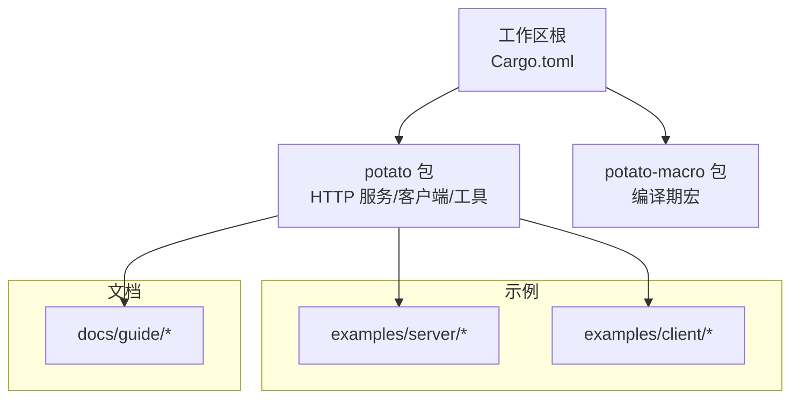
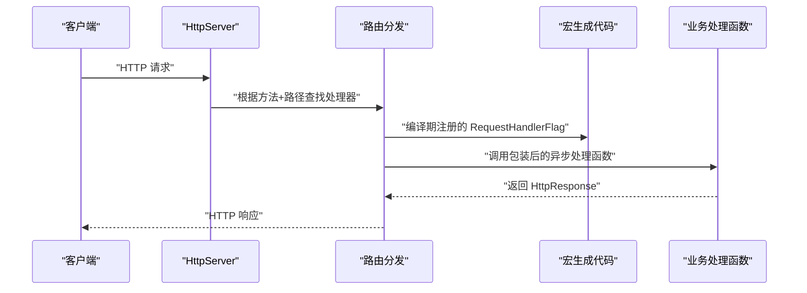
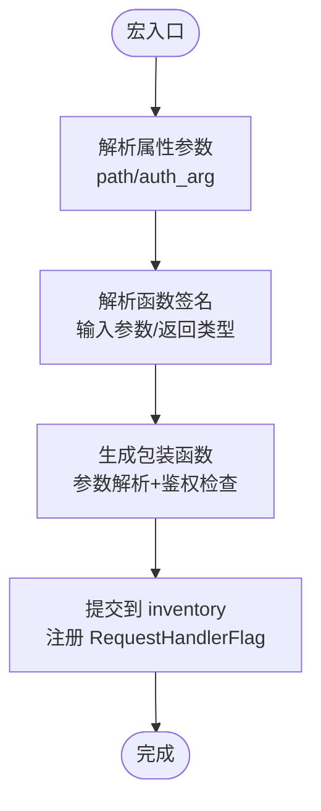
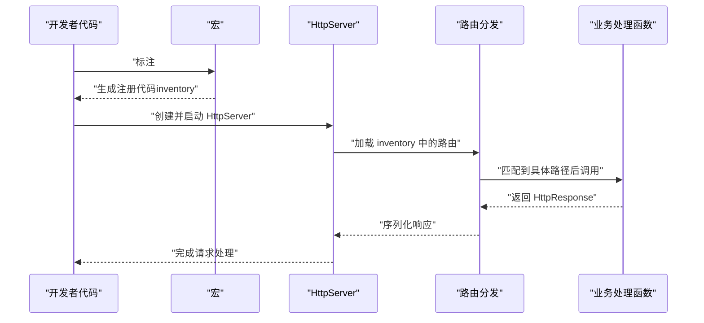

# 快速开始

<cite>
**本文引用的文件**
- [README.md](file://README.md)
- [Cargo.toml](file://Cargo.toml)
- [potato/Cargo.toml](file://potato/Cargo.toml)
- [potato/src/lib.rs](file://potato/src/lib.rs)
- [potato-macro/src/lib.rs](file://potato-macro/src/lib.rs)
- [examples/server/00_http_server.rs](file://examples/server/00_http_server.rs)
- [examples/client/00_client.rs](file://examples/client/00_client.rs)
- [examples/server/01_https_server.rs](file://examples/server/01_https_server.rs)
- [examples/server/02_openapi_server.rs](file://examples/server/02_openapi_server.rs)
- [examples/server/03_handler_args_server.rs](file://examples/server/03_handler_args_server.rs)
- [examples/server/04_http_method_server.rs](file://examples/server/04_http_method_server.rs)
- [examples/server/08_websocket_server.rs](file://examples/server/08_websocket_server.rs)
- [docs/guide/00_introduction.md](file://docs/guide/00_introduction.md)
- [docs/guide/01_hello_world.md](file://docs/guide/01_hello_world.md)
- [docs/guide/02_method_annotation.md](file://docs/guide/02_method_annotation.md)
- [docs/guide/03_method_declare.md](file://docs/guide/03_method_declare.md)
- [docs/guide/06_client.md](file://docs/guide/06_client.md)
</cite>

## 目录
1. [简介](#简介)
2. [项目结构](#项目结构)
3. [核心组件](#核心组件)
4. [架构总览](#架构总览)
5. [详细组件解析](#详细组件解析)
6. [依赖关系分析](#依赖关系分析)
7. [性能注意事项](#性能注意事项)
8. [故障排查指南](#故障排查指南)
9. [结论](#结论)
10. [附录](#附录)

## 简介
本指南面向首次接触 Potato 框架的开发者，帮助你在约 30 分钟内完成环境准备、安装依赖、编写并运行第一个 Hello World 服务器与客户端，掌握宏系统的基本用法（如 #[http_get] 属性），并了解常见初始化错误与解决方案。同时提供多种部署与开发环境配置建议。

## 项目结构
仓库采用多包工作区组织，核心模块包括：
- 工作区根 Cargo.toml：定义成员包为 potato 与 potato-macro
- potato 包：HTTP 服务端、客户端、宏导出、工具模块等
- potato-macro 包：编译期宏，负责将 #[http_get]/#[http_post] 等属性转换为路由注册与参数解析逻辑
- examples：官方示例，覆盖 HTTP、HTTPS、OpenAPI、WebSocket、客户端等场景
- docs/guide：中文文档，涵盖入门、注解、声明、客户端等主题

图表来源
- [Cargo.toml](file://Cargo.toml#L1-L4)
- [potato/Cargo.toml](file://potato/Cargo.toml#L1-L76)

章节来源
- [Cargo.toml](file://Cargo.toml#L1-L4)
- [README.md](file://README.md#L1-L57)

## 核心组件
- 宏系统（potato-macro）：提供 #[http_get]/#[http_post]/#[http_put]/#[http_delete]/#[http_head]/#[http_options] 等属性，将函数标注转换为路由注册与参数解析逻辑
- 服务端（potato）：提供 HttpServer、HttpRequest、HttpResponse、WebSocket 等能力；通过 inventory 收集路由表
- 客户端（potato）：提供 get/post 等便捷方法与 Session/Websocket 连接能力
- 工具与特性：Tokio 全特性、TLS、OpenAPI、jemalloc 等可选特性

章节来源
- [potato/src/lib.rs](file://potato/src/lib.rs#L1-L1220)
- [potato-macro/src/lib.rs](file://potato-macro/src/lib.rs#L1-L399)
- [potato/Cargo.toml](file://potato/Cargo.toml#L16-L76)

## 架构总览
下图展示了从请求进入、路由匹配、参数解析、业务处理到响应返回的整体流程，以及宏如何在编译期生成路由注册与包装函数。

图表来源
- [potato/src/lib.rs](file://potato/src/lib.rs#L124-L175)
- [potato-macro/src/lib.rs](file://potato-macro/src/lib.rs#L26-L300)

## 详细组件解析

### 安装与环境准备
- 添加依赖
  - 在你的应用中添加 potato 依赖
  - 为 Tokio 指定 full 特性以启用全部运行时能力
- Rust 版本与特性
  - 项目最低 Rust 版本为 1.85
  - 默认启用 openapi 与 tls 特性；如需 HTTPS 或 OpenAPI 文档，保持默认即可

章节来源
- [README.md](file://README.md#L14-L19)
- [potato/Cargo.toml](file://potato/Cargo.toml#L1-L14)
- [potato/Cargo.toml](file://potato/Cargo.toml#L65-L72)

### Hello World：最简 HTTP 服务器
- 路由定义：使用 #[http_get] 属性标注处理函数，并指定路径
- 服务器启动：创建 HttpServer 实例并调用 serve_http
- 访问验证：浏览器访问 http://127.0.0.1:8080/hello

章节来源
- [examples/server/00_http_server.rs](file://examples/server/00_http_server.rs#L1-L12)
- [docs/guide/01_hello_world.md](file://docs/guide/01_hello_world.md#L15-L27)

### Hello World：最简 HTTP 客户端
- 客户端请求：使用 potato::get 发起 GET 请求
- 附加头部：通过 Headers 列表传入请求头
- 会话复用：使用 Session 可复用连接

章节来源
- [examples/client/00_client.rs](file://examples/client/00_client.rs#L1-L7)
- [docs/guide/06_client.md](file://docs/guide/06_client.md#L3-L23)

### 宏系统基础：#[http_get] 的用法
- 基本语法：#[http_get("/path")] 将函数注册为 GET 路由
- 鉴权参数：支持通过 auth_arg 指定鉴权参数，自动校验 Authorization 头并解析负载
- 参数解析：支持从 URL 查询参数与表单/JSON 请求体中解析基本类型参数
- 返回类型：支持 ()、Result<()>、HttpResponse、Result<HttpResponse>

章节来源
- [docs/guide/02_method_annotation.md](file://docs/guide/02_method_annotation.md#L1-L39)
- [docs/guide/03_method_declare.md](file://docs/guide/03_method_declare.md#L1-L53)
- [potato-macro/src/lib.rs](file://potato-macro/src/lib.rs#L26-L300)

### 宏内部工作流（编译期）

图表来源
- [potato-macro/src/lib.rs](file://potato-macro/src/lib.rs#L26-L300)

### 服务器启动到路由处理的完整流程

图表来源
- [potato/src/lib.rs](file://potato/src/lib.rs#L124-L175)
- [potato-macro/src/lib.rs](file://potato-macro/src/lib.rs#L26-L300)

### 多种部署方式与开发环境建议
- 开发环境
  - 使用 Tokio full 特性，确保异步运行时完整可用
  - 如需 HTTPS，启用默认 tls 特性；证书文件可按示例传入
- 生产部署
  - 可通过 Docker 打包二进制；注意暴露端口与健康检查
  - 如需 OpenAPI 文档，启用默认 openapi 特性并配置文档路由
  - 内存优化：可启用 jemalloc 特性进行内存分析与优化

章节来源
- [README.md](file://README.md#L14-L19)
- [examples/server/01_https_server.rs](file://examples/server/01_https_server.rs#L1-L12)
- [examples/server/02_openapi_server.rs](file://examples/server/02_openapi_server.rs#L1-L16)
- [potato/Cargo.toml](file://potato/Cargo.toml#L65-L72)

### 常见初始化错误与解决方案
- 缺少 Tokio 特性
  - 现象：编译报错或运行时无法启动
  - 解决：为 tokio 指定 features = ["full"]
- 路由路径非法
  - 现象：宏在编译期抛出“必须以 / 开头”等错误
  - 解决：确保 path 以斜杠开头
- 鉴权参数类型不符
  - 现象：宏提示 auth_arg 必须为 String 类型
  - 解决：将 auth_arg 对应参数声明为 String
- 未找到鉴权参数
  - 现象：宏提示 auth_arg 未指向任何参数
  - 解决：确保 auth_arg 指向函数签名中的某个参数名
- 返回类型不支持
  - 现象：宏提示不支持的返回类型
  - 解决：使用 ()、Result<()>、HttpResponse、Result<HttpResponse> 四种之一

章节来源
- [potato-macro/src/lib.rs](file://potato-macro/src/lib.rs#L57-L65)
- [potato-macro/src/lib.rs](file://potato-macro/src/lib.rs#L136-L155)
- [potato-macro/src/lib.rs](file://potato-macro/src/lib.rs#L189-L191)
- [potato-macro/src/lib.rs](file://potato-macro/src/lib.rs#L299-L300)

### 更多示例与进阶用法
- HTTPS 服务器：启用 TLS 并加载证书与私钥
- OpenAPI 文档：启用 openapi 特性并配置文档路由
- 多方法路由：使用 http_get/http_post/http_put/http_delete/http_head/http_options
- 处理函数参数：支持 HttpRequest 引用、基本类型参数、PostFile 文件上传
- WebSocket：通过请求升级为 WebSocket 并收发消息

章节来源
- [examples/server/01_https_server.rs](file://examples/server/01_https_server.rs#L1-L12)
- [examples/server/02_openapi_server.rs](file://examples/server/02_openapi_server.rs#L1-L16)
- [examples/server/03_handler_args_server.rs](file://examples/server/03_handler_args_server.rs#L1-L32)
- [examples/server/04_http_method_server.rs](file://examples/server/04_http_method_server.rs#L1-L42)
- [examples/server/08_websocket_server.rs](file://examples/server/08_websocket_server.rs#L1-L43)
- [docs/guide/03_method_declare.md](file://docs/guide/03_method_declare.md#L1-L53)
- [docs/guide/06_client.md](file://docs/guide/06_client.md#L1-L72)

## 依赖关系分析
- 工作区成员
  - potato 与 potato-macro 作为独立包被工作区统一管理
- 依赖与特性
  - potato 依赖 tokio（full）、http、serde、jsonwebtoken、inventory 等
  - 特性开关控制 TLS、OpenAPI、SSH、WebDAV、jemalloc 等能力
- 宏与运行时协作
  - 宏在编译期生成注册代码，运行时通过 inventory 收集路由表

图表来源
- [Cargo.toml](file://Cargo.toml#L1-L4)
- [potato/Cargo.toml](file://potato/Cargo.toml#L16-L76)

章节来源
- [Cargo.toml](file://Cargo.toml#L1-L4)
- [potato/Cargo.toml](file://potato/Cargo.toml#L16-L76)

## 性能注意事项
- 使用 Tokio full 特性以获得完整的异步运行时能力
- 如需内存分析，可启用 jemalloc 特性并在入口初始化后按需导出分析数据
- 合理使用压缩与缓存策略（框架内置条件预检与压缩模式）

章节来源
- [README.md](file://README.md#L14-L19)
- [docs/guide/06_client.md](file://docs/guide/06_client.md#L34-L46)
- [potato/src/lib.rs](file://potato/src/lib.rs#L197-L201)

## 故障排查指南
- 宏编译期错误
  - 路由 path 缺失或格式不合法：确保以 / 开头
  - auth_arg 指向不存在的参数或类型不为 String：修正参数名与类型
  - 返回类型不受支持：改为允许的四种类型之一
- 运行时错误
  - 未找到路由：确认宏是否正确生成并被运行时收集
  - 请求头缺失：鉴权场景下确保 Authorization 头存在且格式正确
  - WebSocket 升级失败：确认请求满足 WebSocket 协议要求

章节来源
- [potato-macro/src/lib.rs](file://potato-macro/src/lib.rs#L57-L65)
- [potato-macro/src/lib.rs](file://potato-macro/src/lib.rs#L136-L155)
- [potato-macro/src/lib.rs](file://potato-macro/src/lib.rs#L189-L191)
- [potato/src/lib.rs](file://potato/src/lib.rs#L532-L579)

## 结论
通过本指南，你已掌握 Potato 框架的安装、宏系统基础用法、服务器与客户端的最小实现，以及常见问题的排查方法。建议在完成 Hello World 后，逐步探索 HTTPS、OpenAPI、WebSocket、文件上传等高级示例，以加深对框架的理解与应用。

## 附录
- 更多示例与文档请参考：
  - 示例目录：examples/server、examples/client
  - 中文文档：docs/guide 下各主题

章节来源
- [README.md](file://README.md#L48-L50)
- [docs/guide/00_introduction.md](file://docs/guide/00_introduction.md#L1-L76)