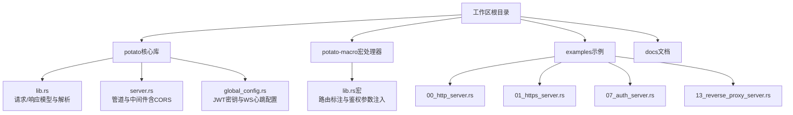
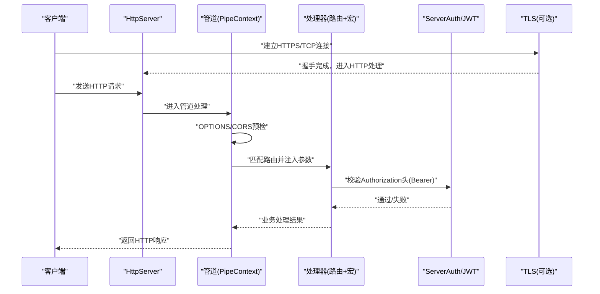
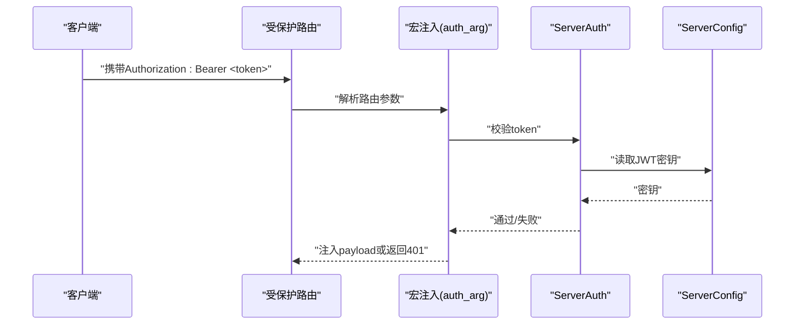
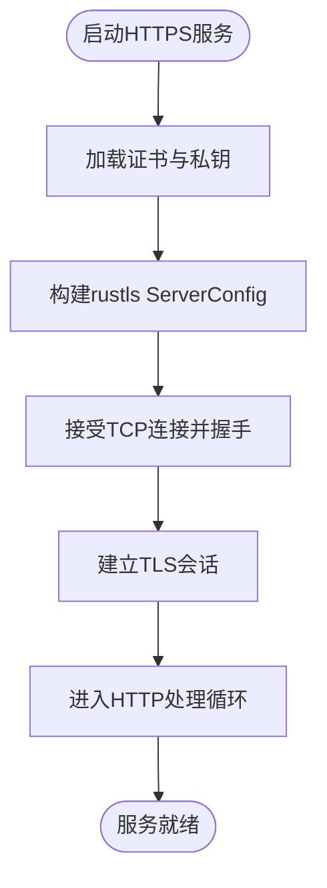
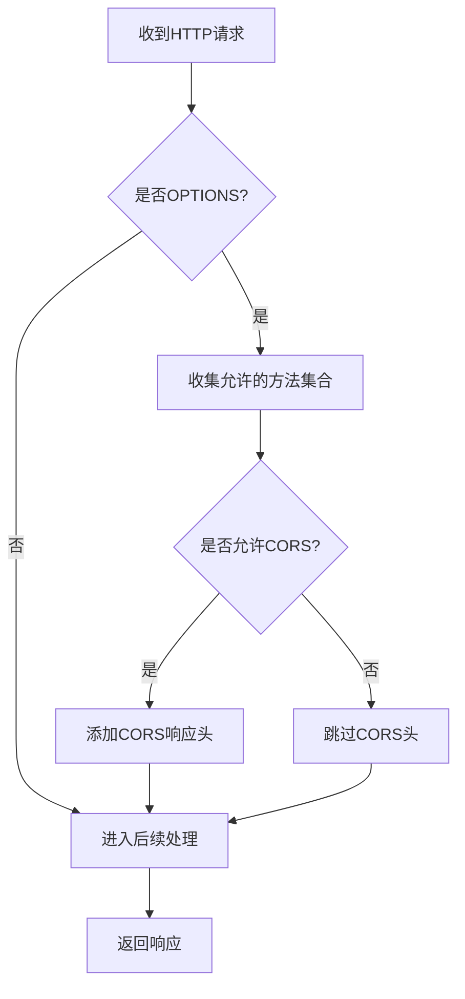
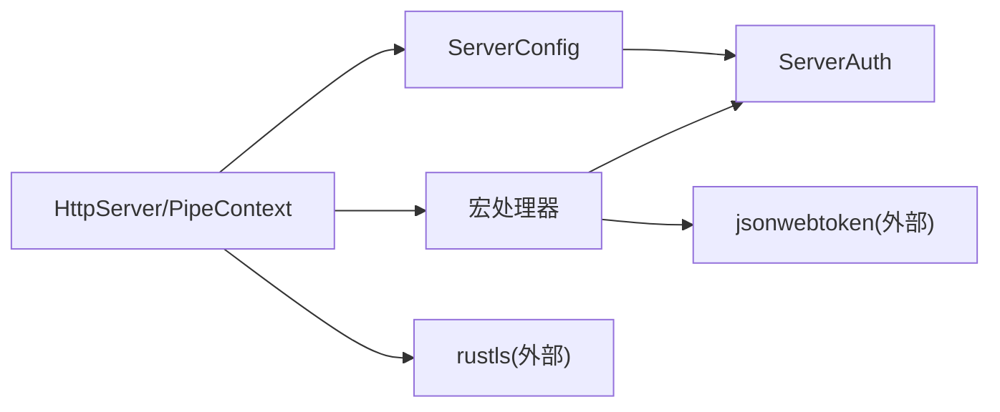

# 安全考虑

<cite>
**本文引用的文件**
- [Cargo.toml](file://Cargo.toml)
- [README.md](file://README.md)
- [lib.rs](file://potato/src/lib.rs)
- [server.rs](file://potato/src/server.rs)
- [global_config.rs](file://potato/src/global_config.rs)
- [lib.rs（宏）](file://potato-macro/src/lib.rs)
- [string.rs](file://potato/src/utils/string.rs)
- [07_auth_server.rs](file://examples/server/07_auth_server.rs)
- [01_https_server.rs](file://examples/server/01_https_server.rs)
- [00_http_server.rs](file://examples/server/00_http_server.rs)
- [13_reverse_proxy_server.rs](file://examples/server/13_reverse_proxy_server.rs)
- [oauth2-redirect.html](file://potato/swagger_res/oauth2-redirect.html)
- [02_method_annotation.md](file://docs/guide/02_method_annotation.md)
- [02_method_annotation.md（英文）](file://docs/en/guide/02_method_annotation.md)
</cite>

## 目录
1. [简介](#简介)
2. [项目结构](#项目结构)
3. [核心组件](#核心组件)
4. [架构总览](#架构总览)
5. [详细组件分析](#详细组件分析)
6. [依赖关系分析](#依赖关系分析)
7. [性能与安全权衡](#性能与安全权衡)
8. [故障排查指南](#故障排查指南)
9. [结论](#结论)
10. [附录](#附录)

## 简介
本指南面向使用 Potato 框架进行服务端开发的团队，聚焦于安全开发生命周期中的关键实践，包括输入验证与过滤、认证与授权（JWT/OAuth2）、传输安全（TLS）、网络安全（CORS/CSRF）、敏感数据保护（哈希/加密/日志脱敏）、安全审计与漏洞扫描以及安全事件响应与应急处理流程。文档以仓库现有实现为依据，结合示例与源码路径，给出可操作的安全建议与最佳实践。

## 项目结构
- 工作区采用 Rust 多包结构，核心库位于 potato，宏处理器位于 potato-macro。
- 示例服务器展示了 HTTP/HTTPS、OpenAPI 文档、反向代理等场景，便于在真实环境中验证安全策略。
- 文档中关于“方法标注”的章节说明了如何声明路由与鉴权参数，为后续安全控制点提供入口。

**图表来源**
- [Cargo.toml](file://Cargo.toml#L1-L4)
- [lib.rs](file://potato/src/lib.rs#L1-L1220)
- [server.rs](file://potato/src/server.rs#L1-L933)
- [global_config.rs](file://potato/src/global_config.rs#L1-L64)
- [lib.rs（宏）](file://potato-macro/src/lib.rs#L1-L399)
- [00_http_server.rs](file://examples/server/00_http_server.rs#L1-L12)
- [01_https_server.rs](file://examples/server/01_https_server.rs#L1-L12)
- [07_auth_server.rs](file://examples/server/07_auth_server.rs#L1-L24)
- [13_reverse_proxy_server.rs](file://examples/server/13_reverse_proxy_server.rs#L1-L10)

**章节来源**
- [Cargo.toml](file://Cargo.toml#L1-L4)
- [README.md](file://README.md#L1-L57)

## 核心组件
- 请求/响应与输入解析：负责从网络流解析 HTTP 请求头、查询参数、表单与 JSON，并按 Content-Type 进行结构化拆分；同时提供条件预检（ETag/If-*）能力，有助于缓存与资源校验。
- 服务器管道：统一处理路由匹配、CORS 响应、静态资源与嵌入资源、反向代理等，是安全控制点集中区域。
- 认证与授权：内置 JWT 颁发与校验，宏系统支持在路由层声明 auth_arg 参数，自动从 Authorization 头提取并校验 Bearer Token。
- TLS 与客户端连接：支持 HTTPS 服务端与客户端 TLS 连接，便于在传输层保障机密性与完整性。
- 工具与通用能力：字符串工具提供 URL 解码等基础能力，为输入清洗与解析提供支撑。

**章节来源**
- [lib.rs](file://potato/src/lib.rs#L385-L799)
- [server.rs](file://potato/src/server.rs#L362-L767)
- [global_config.rs](file://potato/src/global_config.rs#L18-L63)
- [lib.rs（宏）](file://potato-macro/src/lib.rs#L120-L190)
- [string.rs](file://potato/src/utils/string.rs#L28-L47)

## 架构总览
下图展示从客户端到处理器的典型请求路径，以及安全控制点（CORS、鉴权、TLS）的位置。

**图表来源**
- [server.rs](file://potato/src/server.rs#L362-L406)
- [lib.rs（宏）](file://potato-macro/src/lib.rs#L140-L155)
- [global_config.rs](file://potato/src/global_config.rs#L37-L63)
- [01_https_server.rs](file://examples/server/01_https_server.rs#L6-L11)

## 详细组件分析

### 输入验证与过滤
- 查询参数与表单解析：框架将查询串与表单键值对解析为内存结构，便于后续类型转换与校验。
- JSON 解析：对 application/json 的请求体进行解析，若失败或格式异常，应在业务层捕获并拒绝。
- Content-Type 分发：根据 Content-Type 将请求体分发到不同解析分支，避免误判导致的数据解析错误。
- URL 解码：提供 URL 解码工具，可用于清洗路径参数，防止编码绕过。
- 条件预检：利用 If-None-Match/If-Match/If-Modified-Since 等头进行缓存一致性校验，减少不必要的计算与泄露。

建议实践
- 对所有外部输入执行白名单/长度/范围/正则约束。
- 对路径参数与查询参数进行严格类型转换与边界检查。
- 对上传文件大小、类型与内容进行限制与二次校验。
- 使用最小权限原则，仅暴露必要字段与接口。

**章节来源**
- [lib.rs](file://potato/src/lib.rs#L615-L699)
- [string.rs](file://potato/src/utils/string.rs#L28-L47)
- [lib.rs](file://potato/src/lib.rs#L777-L800)

### SQL 注入防护
- 框架未内建 ORM 或数据库访问层，SQL 注入风险主要来自应用侧拼接 SQL 字符串。
- 建议使用参数化查询/ORM，避免动态拼接 SQL；对用户输入进行严格的白名单与长度限制。

最佳实践
- 使用参数化语句或 ORM 映射，禁止拼接用户输入。
- 对枚举/布尔等类型进行显式转换与校验。
- 对日志输出进行脱敏，避免将原始 SQL 与参数写入日志。

[本节为通用安全建议，不直接分析具体文件]

### XSS 攻击防范
- 框架未内置模板引擎或自动转义，XSS 风险来自应用侧直接输出用户输入。
- 建议在渲染 HTML 时对输出进行上下文相关的转义，或使用具备自动转义的模板引擎。

最佳实践
- 对所有用户可控输出进行 HTML 转义。
- 设置严格的 Content-Security-Policy 头，限制脚本执行来源。
- 对富文本输入进行白名单过滤与标签剥离。

**章节来源**
- [lib.rs](file://potato/src/lib.rs#L385-L463)

### 命令注入防护
- 框架未提供系统命令执行能力，命令注入风险来自应用侧调用系统命令。
- 建议避免直接拼接命令行参数，使用参数数组形式调用；并对输入进行严格白名单与长度限制。

最佳实践
- 使用参数化调用，避免 shell 注入。
- 限定运行用户权限，最小化命令集。
- 对日志记录进行脱敏，避免泄露命令与参数。

[本节为通用安全建议，不直接分析具体文件]

### 身份认证与授权（JWT/OAuth2）
- JWT 颁发与校验：提供统一的密钥存储与生命周期管理，支持在路由层通过 auth_arg 自动校验 Bearer Token。
- OAuth2 集成：OpenAPI 文档中定义了 bearerAuth 安全方案，示例页面包含 OAuth2 重定向页面，便于前端授权流程对接。
- 会话管理：框架未内置会话存储，建议采用无状态 JWT 或在应用层引入安全的会话存储（如 Redis），并配合 HttpOnly/SameSite Cookie 策略。

**图表来源**
- [lib.rs（宏）](file://potato-macro/src/lib.rs#L140-L155)
- [global_config.rs](file://potato/src/global_config.rs#L37-L63)
- [07_auth_server.rs](file://examples/server/07_auth_server.rs#L2-L11)

**章节来源**
- [global_config.rs](file://potato/src/global_config.rs#L18-L63)
- [lib.rs（宏）](file://potato-macro/src/lib.rs#L120-L190)
- [07_auth_server.rs](file://examples/server/07_auth_server.rs#L1-L24)
- [02_method_annotation.md](file://docs/guide/02_method_annotation.md#L23-L36)
- [02_method_annotation.md（英文）](file://docs/en/guide/02_method_annotation.md#L23-L36)
- [oauth2-redirect.html](file://potato/swagger_res/oauth2-redirect.html#L1-L43)

### 传输安全配置（TLS/加密）
- HTTPS 服务端：支持加载证书与私钥，启用 TLS 握手，确保传输层机密性与完整性。
- 客户端 TLS：支持通过标准根证书信任链建立 TLS 连接，适用于对外部服务的 HTTPS 调用。
- 加密算法：使用 rustls 提供的现代加密套件，建议在生产环境遵循最新的 TLS 版本与套件策略。

**图表来源**
- [server.rs](file://potato/src/server.rs#L873-L887)
- [01_https_server.rs](file://examples/server/01_https_server.rs#L6-L11)

**章节来源**
- [server.rs](file://potato/src/server.rs#L873-L887)
- [01_https_server.rs](file://examples/server/01_https_server.rs#L1-L12)

### 网络安全（CORS/CSRF/跨域）
- CORS 配置：管道在处理 OPTIONS 时可按需返回 Access-Control-Allow-* 头，实现跨域资源共享控制。
- CSRF 防护：框架未内置 CSRF Token 机制，建议在应用层引入 SameSite Cookie、CSRF Token 与 Origin/Referer 校验。
- 跨域请求处理：通过管道的 Handlers 项与 allow_cors 参数控制是否开启 CORS 响应头。

**图表来源**
- [server.rs](file://potato/src/server.rs#L380-L406)

**章节来源**
- [server.rs](file://potato/src/server.rs#L362-L406)

### 敏感数据保护（密码哈希、数据加密、日志脱敏）
- 密码哈希：建议使用 bcrypt/scrypt/argon2 等现代密码哈希算法，不在数据库中存储明文或可逆密码。
- 数据加密：对静态敏感数据（如密钥、证书）采用强加密与密钥管理（KMS/硬件安全模块）。
- 日志脱敏：避免在日志中输出完整请求体、查询串、Cookie、Token 等敏感信息；对日志进行分级与脱敏。

[本节为通用安全建议，不直接分析具体文件]

### 安全审计与漏洞扫描
- 依赖项安全检查：定期更新依赖版本，使用工具扫描已知漏洞（如 cargo-audit）。
- 代码安全审查：对输入解析、鉴权逻辑、TLS 配置与 CORS 控制进行重点审查。
- OpenAPI 文档：利用内置 OpenAPI 生成与 swagger-ui，辅助识别未授权暴露的路由与参数。

**章节来源**
- [server.rs](file://potato/src/server.rs#L133-L273)
- [00_http_server.rs](file://examples/server/00_http_server.rs#L1-L12)

### 反向代理与上游安全
- 反向代理：支持将请求转发至上游服务，并可选择是否修改内容。建议在代理层设置超时、限流与上游鉴权。
- 上游信任：对上游服务启用 TLS 并校验证书，避免中间人攻击。

**章节来源**
- [server.rs](file://potato/src/server.rs#L615-L627)
- [13_reverse_proxy_server.rs](file://examples/server/13_reverse_proxy_server.rs#L1-L10)

## 依赖关系分析
- 组件耦合：宏处理器负责在编译期注入鉴权参数解析逻辑，运行时由全局配置提供密钥与 WS 心跳时长；服务器管道统一调度路由与 CORS。
- 外部依赖：jsonwebtoken 用于 JWT 编解码，rustls 用于 TLS，regex 用于日期解析与模式匹配。

**图表来源**
- [lib.rs（宏）](file://potato-macro/src/lib.rs#L120-L190)
- [global_config.rs](file://potato/src/global_config.rs#L18-L63)
- [server.rs](file://potato/src/server.rs#L362-L406)

**章节来源**
- [lib.rs（宏）](file://potato-macro/src/lib.rs#L1-L399)
- [global_config.rs](file://potato/src/global_config.rs#L1-L64)
- [server.rs](file://potato/src/server.rs#L1-L933)

## 性能与安全权衡
- CORS 预检：在高并发场景下，OPTIONS 预检可能带来额外开销，建议合理缓存 Allow 列表与精简允许头。
- JWT 校验：频繁校验会增加 CPU 开销，建议使用短周期 Token 与缓存热点用户信息。
- TLS 握手：在高吞吐场景下，复用连接与会话恢复可降低握手成本。
- 输入解析：对大体积请求体进行大小限制与流式处理，避免内存压力。

[本节为通用指导，不直接分析具体文件]

## 故障排查指南
- 鉴权失败
  - 确认 Authorization 头格式为 Bearer Token。
  - 检查 JWT 密钥是否正确设置与持久化。
  - 核对 token 是否过期。
- CORS 无效
  - 确认管道中已启用 allow_cors。
  - 检查浏览器开发者工具中的响应头是否包含 Access-Control-Allow-*。
- TLS 握手失败
  - 检查证书与私钥路径与权限。
  - 确认证书链完整与域名匹配。
- 反向代理异常
  - 检查上游地址与路径前缀是否正确。
  - 关注代理超时与内容修改选项。

**章节来源**
- [lib.rs（宏）](file://potato-macro/src/lib.rs#L140-L155)
- [global_config.rs](file://potato/src/global_config.rs#L20-L26)
- [server.rs](file://potato/src/server.rs#L397-L401)
- [01_https_server.rs](file://examples/server/01_https_server.rs#L6-L11)
- [13_reverse_proxy_server.rs](file://examples/server/13_reverse_proxy_server.rs#L1-L10)

## 结论
Potato 框架提供了清晰的请求解析、管道处理与 TLS 能力，结合宏系统的 auth_arg 与内置 JWT 校验，能够快速构建具备基本安全控制点的服务端应用。实际部署中，仍需在输入验证、CORS/CSRF、传输安全、敏感数据保护与安全审计等方面落实工程化规范与最佳实践，以形成完整的安全纵深防御体系。

## 附录
- 示例参考
  - HTTP/HTTPS 服务：[00_http_server.rs](file://examples/server/00_http_server.rs#L1-L12)、[01_https_server.rs](file://examples/server/01_https_server.rs#L1-L12)
  - JWT 鉴权：[07_auth_server.rs](file://examples/server/07_auth_server.rs#L1-L24)
  - 反向代理：[13_reverse_proxy_server.rs](file://examples/server/13_reverse_proxy_server.rs#L1-L10)
- 文档参考
  - 方法标注与鉴权参数：[02_method_annotation.md](file://docs/guide/02_method_annotation.md#L23-L36)、[02_method_annotation.md（英文）](file://docs/en/guide/02_method_annotation.md#L23-L36)