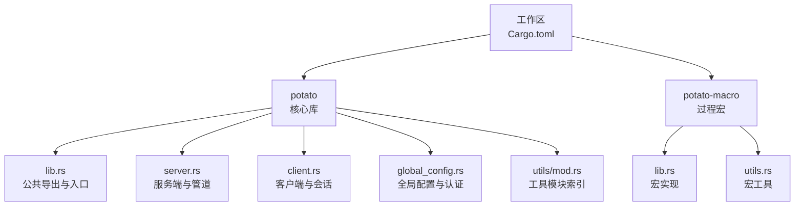
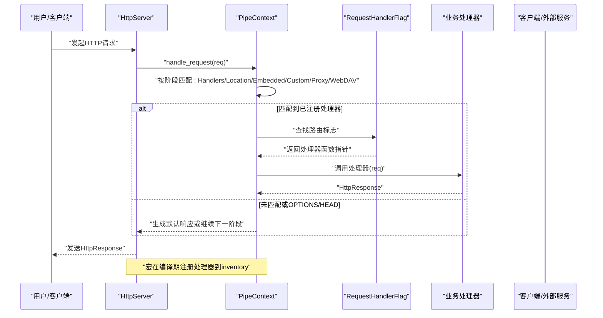
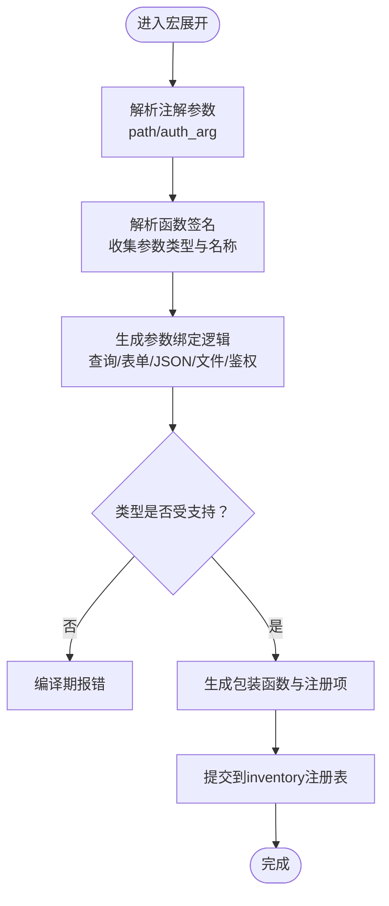
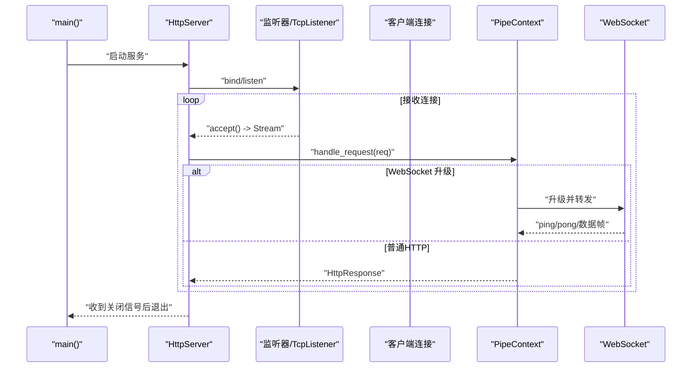
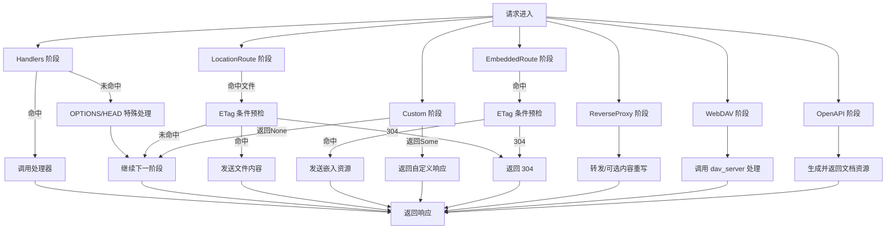
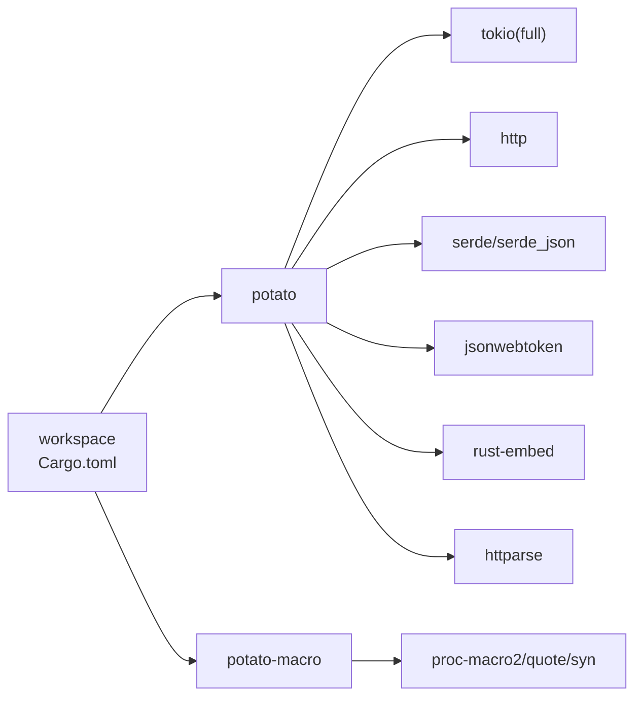

# 开发实践

<cite>
**本文档引用的文件**
- [Cargo.toml](file://Cargo.toml)
- [Cargo.toml（potato）](file://potato/Cargo.toml)
- [Cargo.toml（potato-macro）](file://potato-macro/Cargo.toml)
- [README.md](file://README.md)
- [README.zh.md](file://README.zh.md)
- [lib.rs（入口与公共导出）](file://potato/src/lib.rs)
- [main.rs（最小示例）](file://potato/src/main.rs)
- [server.rs（服务端与管道）](file://potato/src/server.rs)
- [client.rs（客户端与会话）](file://potato/src/client.rs)
- [global_config.rs（全局配置与认证）](file://potato/src/global_config.rs)
- [lib.rs（宏系统）](file://potato-macro/src/lib.rs)
- [utils.rs（宏工具）](file://potato-macro/src/utils.rs)
- [mod.rs（工具模块索引）](file://potato/src/utils/mod.rs)
- [00_http_server.rs（示例：HTTP 服务器）](file://examples/server/00_http_server.rs)
- [00_client.rs（示例：HTTP 客户端）](file://examples/client/00_client.rs)
</cite>

## 目录
1. [简介](#简介)
2. [项目结构](#项目结构)
3. [核心组件](#核心组件)
4. [架构总览](#架构总览)
5. [组件详解](#组件详解)
6. [依赖关系分析](#依赖关系分析)
7. [性能考量](#性能考量)
8. [故障排查指南](#故障排查指南)
9. [结论](#结论)
10. [附录](#附录)

## 简介
本指南面向使用 Potato 框架进行开发的工程师，围绕代码组织、模块划分、宏系统、异步编程、中间件管道、类型安全与内存管理、以及代码复用与抽象等方面，提供可操作的最佳实践与可视化说明。目标是帮助你在保持高性能的同时，写出清晰、可维护、可扩展的 Rust HTTP 应用。

## 项目结构
仓库采用工作区（workspace）组织，核心由两部分组成：
- potato：HTTP 服务端、客户端、工具集与宏导出
- potato-macro：过程宏（proc-macro），提供路由注解与派生能力

图表来源
- [Cargo.toml](file://Cargo.toml#L1-L4)
- [Cargo.toml（potato）](file://potato/Cargo.toml#L1-L76)
- [Cargo.toml（potato-macro）](file://potato-macro/Cargo.toml#L1-L24)

章节来源
- [Cargo.toml](file://Cargo.toml#L1-L4)
- [Cargo.toml（potato）](file://potato/Cargo.toml#L1-L76)
- [Cargo.toml（potato-macro）](file://potato-macro/Cargo.toml#L1-L24)

## 核心组件
- 请求/响应模型：统一的 HttpRequest/HttpResponse 抽象，支持多种内容类型解析与条件预检（ETag/If-* 头）。
- 服务端管道：通过 PipeContext 将“处理器”“静态资源嵌入”“反向代理”“WebDAV”“OpenAPI 文档”等阶段串联，按顺序匹配并执行。
- 客户端与会话：Session/TransferSession 提供连接池、TLS、反向代理、SSH 跳板、WebSocket 转发等能力。
- 宏系统：http_get/http_post 等注解自动解析参数、校验类型、生成路由注册项，并支持 OpenAPI 文档元数据。
- 全局配置：JWT 密钥、WebSocket 心跳周期等通过全局配置模块集中管理。

章节来源
- [lib.rs（入口与公共导出）](file://potato/src/lib.rs#L124-L175)
- [server.rs（服务端与管道）](file://potato/src/server.rs#L28-L767)
- [client.rs（客户端与会话）](file://potato/src/client.rs#L101-L157)
- [lib.rs（宏系统）](file://potato-macro/src/lib.rs#L26-L299)
- [global_config.rs（全局配置与认证）](file://potato/src/global_config.rs#L7-L35)

## 架构总览
下图展示了从请求进入、路由匹配、到响应返回的全链路流程，以及宏在编译期如何注入处理器注册项。

图表来源
- [server.rs（服务端与管道）](file://potato/src/server.rs#L362-L767)
- [lib.rs（入口与公共导出）](file://potato/src/lib.rs#L175-L175)
- [lib.rs（宏系统）](file://potato-macro/src/lib.rs#L290-L295)

## 组件详解

### 宏系统与参数绑定、验证与错误处理
- 注解支持
  - http_get/http_post/http_put/http_delete/http_options/http_head 等属性宏
  - 支持 path 参数与 auth_arg 标记用于鉴权参数校验
- 参数绑定规则
  - 支持基本类型（整数、浮点、布尔、字符串）与 PostFile 文件上传
  - 查询参数与表单键值对自动解析；JSON 对象键值映射为 body_pairs
  - 非字符串类型会在解析失败时直接返回错误响应
- 鉴权机制
  - 若标注 auth_arg，则要求 Authorization 头且为 Bearer，通过 ServerAuth 校验 JWT
  - 缺失头或校验失败时返回错误响应
- 错误处理
  - 缺少必要参数、类型不匹配、鉴权失败均以 HttpResponse 形式返回错误信息
- 文档元数据
  - 自动生成 OpenAPI 文档所需的 summary、auth 标记、参数类型列表

图表来源
- [lib.rs（宏系统）](file://potato-macro/src/lib.rs#L26-L299)
- [utils.rs（宏工具）](file://potato-macro/src/utils.rs#L5-L18)

章节来源
- [lib.rs（宏系统）](file://potato-macro/src/lib.rs#L26-L299)
- [utils.rs（宏工具）](file://potato-macro/src/utils.rs#L5-L18)
- [lib.rs（入口与公共导出）](file://potato/src/lib.rs#L175-L175)

### 异步编程最佳实践（Tokio 运行时、任务与资源清理）
- 运行时
  - 使用 tokio::main 启动异步主程序，确保所有网络 I/O 在异步上下文中执行
- 任务管理
  - 使用 select! 并发处理双向 WebSocket 转发
  - 使用超时控制（如 WebSocket ping 周期）避免阻塞
- 资源清理
  - 通过 oneshot 通道接收优雅停机信号，避免资源泄漏
  - 连接池（Session/TransferSession）按目标主机/协议/端口缓存连接，减少重复握手
- 可观测性
  - 通过全局配置模块设置 WebSocket 心跳周期，便于监控长连接健康

图表来源
- [server.rs（服务端与管道）](file://potato/src/server.rs#L799-L860)
- [client.rs（客户端与会话）](file://potato/src/client.rs#L569-L591)
- [global_config.rs（全局配置与认证）](file://potato/src/global_config.rs#L28-L34)

章节来源
- [server.rs（服务端与管道）](file://potato/src/server.rs#L799-L860)
- [client.rs（客户端与会话）](file://potato/src/client.rs#L569-L591)
- [global_config.rs（全局配置与认证）](file://potato/src/global_config.rs#L28-L34)

### 中间件设计模式（管道系统、错误传播与性能优化）
- 管道阶段
  - Handlers：按路径+方法匹配注册处理器
  - LocationRoute：将 URL 映射到本地文件系统路径，支持 ETag 条件预检
  - EmbeddedRoute：将静态资源嵌入二进制，支持 ETag 与条件返回
  - Custom：自定义回调，可返回响应或继续后续阶段
  - ReverseProxy：反向代理，支持路径前缀替换与内容重写
  - Webdav：WebDAV 本地/内存文件系统
  - OpenAPI：自动生成 OpenAPI JSON 与文档页面
- 错误传播
  - 自定义回调若返回错误，转换为 HttpResponse 错误响应
  - 未命中任何阶段返回 404
- 性能优化
  - 预检头（If-None-Match/If-Modified-Since）命中返回 304，减少带宽
  - 连接池复用 TCP/TLS 连接
  - 内容压缩与条件返回结合，降低无效传输

图表来源
- [server.rs（服务端与管道）](file://potato/src/server.rs#L362-L767)

章节来源
- [server.rs（服务端与管道）](file://potato/src/server.rs#L28-L767)

### 类型安全与内存管理（生命周期与借用检查）
- 类型安全
  - 宏在编译期严格校验参数类型与 auth_arg 指向，不合法直接报错
  - 请求体解析根据 Content-Type 分派，避免运行时类型错误
- 内存管理
  - 使用 LocalHipStr/LocalHipByt 等零拷贝/轻量字符串/字节容器，减少分配
  - 借助 HashMap/Option/RefCell 等标准库类型，配合生命周期约束避免悬垂引用
  - WebSocket 帧解析与掩码处理在栈上进行，避免不必要的堆分配

章节来源
- [lib.rs（宏系统）](file://potato-macro/src/lib.rs#L110-L191)
- [lib.rs（入口与公共导出）](file://potato/src/lib.rs#L384-L599)

### 代码复用与抽象（trait 的使用与泛型编程）
- 泛型与动态分发
  - 处理器函数类型 HttpHandler 使用动态分发（Pin<Box<dyn Future + Send>>），便于 inventory 收集与统一调度
- 抽象与组合
  - PipeContext 将多种处理阶段抽象为统一的 PipeContextItem，通过 push/clone 实现灵活组合
  - Headers/StandardHeader 派生宏将头部枚举标准化，简化应用层设置
- 可测试性
  - 将业务逻辑与 HTTP 绑定解耦（宏生成的包装函数），便于单元测试

章节来源
- [lib.rs（入口与公共导出）](file://potato/src/lib.rs#L124-L175)
- [server.rs（服务端与管道）](file://potato/src/server.rs#L40-L113)
- [lib.rs（宏系统）](file://potato-macro/src/lib.rs#L345-L398)

## 依赖关系分析
- 工作区与成员包
  - workspace 成员包含 potato 与 potato-macro，分别负责运行时与编译期能力
- 运行时依赖
  - tokio、http、serde、jsonwebtoken、rust-embed、httparse 等
- 特性开关
  - tls/openapi/webdav/jemalloc/ssh 等特性按需启用，避免不必要依赖

图表来源
- [Cargo.toml](file://Cargo.toml#L1-L4)
- [Cargo.toml（potato）](file://potato/Cargo.toml#L16-L76)
- [Cargo.toml（potato-macro）](file://potato-macro/Cargo.toml#L14-L24)

章节来源
- [Cargo.toml](file://Cargo.toml#L1-L4)
- [Cargo.toml（potato）](file://potato/Cargo.toml#L16-L76)
- [Cargo.toml（potato-macro）](file://potato-macro/Cargo.toml#L14-L24)

## 性能考量
- I/O 与并发
  - 使用 Tokio 的异步 I/O 与 select! 并发处理，避免阻塞
- 连接复用
  - Session/TransferSession 按主机/协议/端口缓存连接，减少 TLS 握手开销
- 压缩与条件返回
  - 根据 Accept-Encoding 选择压缩策略；利用 ETag/If-* 头返回 304，显著降低带宽
- 静态资源
  - EmbeddedRoute 将资源内嵌二进制，减少磁盘 IO；同时支持条件返回
- 日志与可观测性
  - 通过全局配置调整 WebSocket 心跳周期，便于监控长连接状态

## 故障排查指南
- 宏相关
  - 缺少 path 或 auth_arg 不合法：编译期直接报错，检查注解参数
  - 参数类型不受支持：仅支持基本类型与 PostFile，其他类型需自定义解析
- 路由与处理器
  - 404：确认路由 path 是否与请求一致，方法是否在 Handlers 中注册
  - OPTIONS/HEAD：由管道阶段特殊处理，检查是否需要 CORS
- 客户端与代理
  - TLS：非 tls 构建下访问 HTTPS 会报错；启用 tls 特性
  - 反向代理：确认路径前缀替换与内容重写逻辑是否符合预期
- WebSocket
  - 心跳超时：调整全局配置中的 ping 周期；检查对端是否正确响应 Ping/Pong
- 认证
  - JWT 校验失败：确认 Authorization 头格式与密钥配置一致

章节来源
- [lib.rs（宏系统）](file://potato-macro/src/lib.rs#L57-L65)
- [client.rs（客户端与会话）](file://potato/src/client.rs#L68-L98)
- [server.rs（服务端与管道）](file://potato/src/server.rs#L378-L406)
- [global_config.rs（全局配置与认证）](file://potato/src/global_config.rs#L28-L34)

## 结论
通过宏系统与管道化中间件，Potato 在保证高性能的同时提供了简洁的开发体验。遵循本文的代码组织、异步实践、类型安全与复用抽象建议，可在大型项目中保持一致性与可维护性。建议在生产环境中开启必要的特性（如 tls/openapi），并结合条件预检与连接池策略进一步优化性能。

## 附录
- 示例参考
  - 服务器示例：[00_http_server.rs](file://examples/server/00_http_server.rs#L1-L12)
  - 客户端示例：[00_client.rs](file://examples/client/00_client.rs#L1-L7)
- 在线文档与安装
  - 参考根目录文档与安装说明：[README.md](file://README.md#L10-L19)、[README.zh.md](file://README.zh.md#L10-L19)