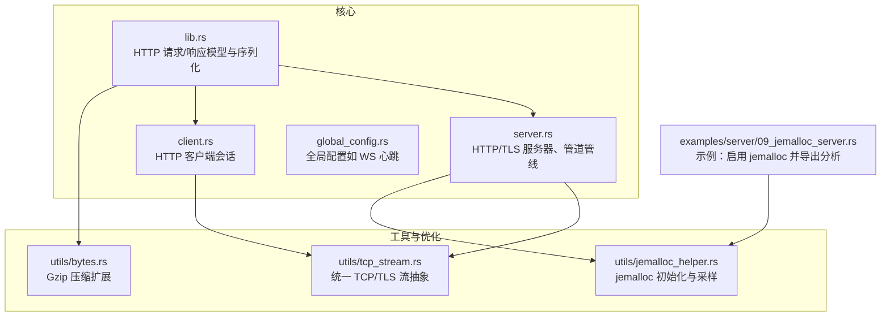
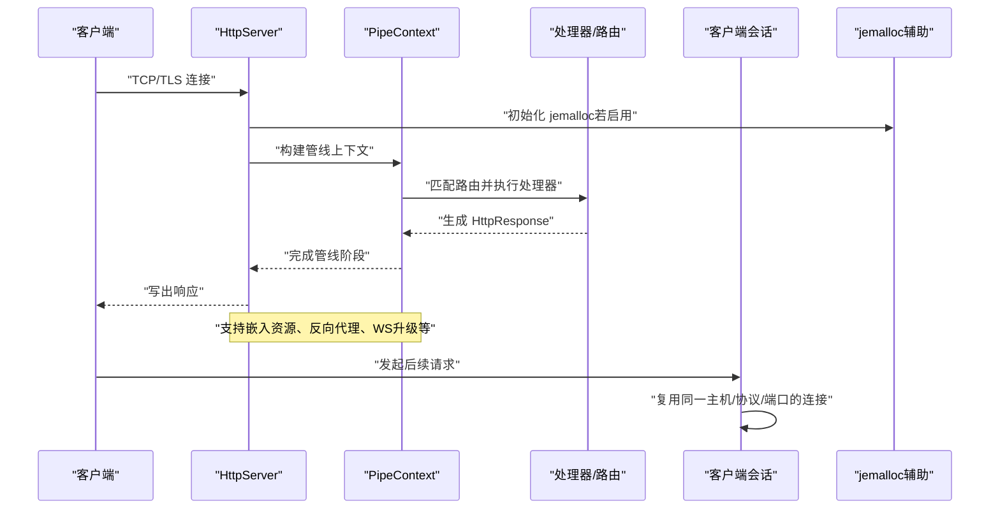
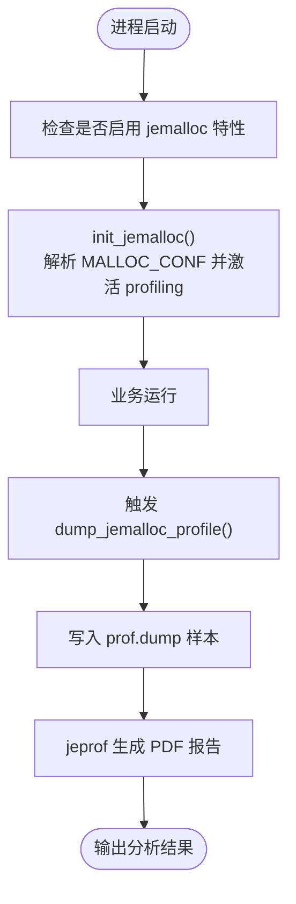
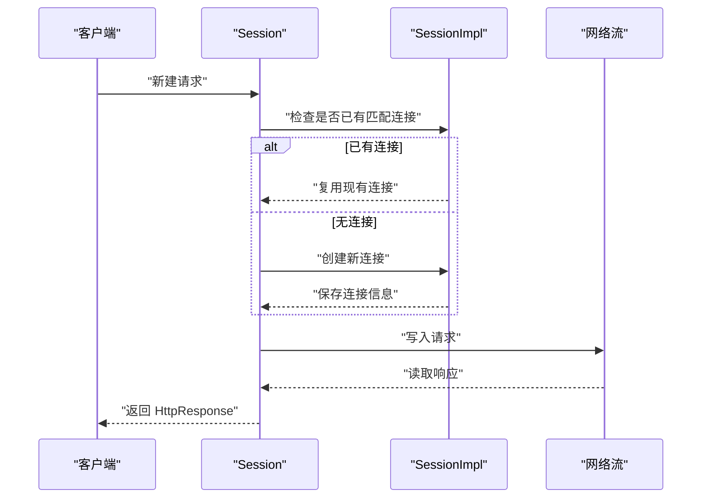
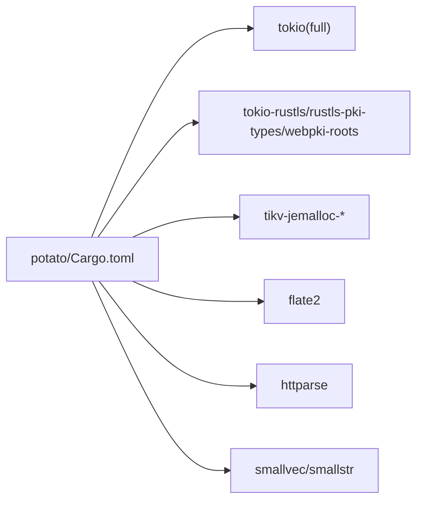

# 性能优化

<cite>
**本文引用的文件**
- [Cargo.toml](file://potato/Cargo.toml)
- [lib.rs](file://potato/src/lib.rs)
- [server.rs](file://potato/src/server.rs)
- [client.rs](file://potato/src/client.rs)
- [global_config.rs](file://potato/src/global_config.rs)
- [tcp_stream.rs](file://potato/src/utils/tcp_stream.rs)
- [bytes.rs](file://potato/src/utils/bytes.rs)
- [jemalloc_helper.rs](file://potato/src/utils/jemalloc_helper.rs)
- [09_jemalloc_server.rs](file://examples/server/09_jemalloc_server.rs)
- [README.md](file://README.md)
</cite>

## 目录
1. [简介](#简介)
2. [项目结构](#项目结构)
3. [核心组件](#核心组件)
4. [架构总览](#架构总览)
5. [详细组件分析](#详细组件分析)
6. [依赖关系分析](#依赖关系分析)
7. [性能考虑](#性能考虑)
8. [故障排查指南](#故障排查指南)
9. [结论](#结论)
10. [附录](#附录)

## 简介
本指南面向使用 Potato 框架的开发者，系统性地总结与落地性能优化实践，覆盖内存优化（jemalloc 使用、内存池管理、垃圾回收优化）、并发性能（Tokio 运行时配置、线程池调优、异步任务调度）、网络性能（连接复用、缓冲区管理、带宽优化）、CPU 性能（算法与数据结构选择、编译器优化选项）、缓存策略（HTTP 缓存、静态资源缓存、应用层缓存）、性能监控与分析（pprof、火焰图、指标采集）以及基准测试与回归检测方法。

## 项目结构
Potato 采用模块化组织：核心 HTTP 协议解析与响应生成在 lib.rs 中；服务端与客户端分别在 server.rs 与 client.rs；网络 I/O 抽象在 utils/tcp_stream.rs；压缩能力在 utils/bytes.rs；jemalloc 集成在 utils/jemalloc_helper.rs，并通过 Cargo.toml 的特性开关启用。

图表来源
- [lib.rs](file://potato/src/lib.rs#L1065-L1111)
- [server.rs](file://potato/src/server.rs#L826-L887)
- [client.rs](file://potato/src/client.rs#L131-L140)
- [global_config.rs](file://potato/src/global_config.rs#L28-L34)
- [tcp_stream.rs](file://potato/src/utils/tcp_stream.rs#L11-L73)
- [bytes.rs](file://potato/src/utils/bytes.rs#L4-L32)
- [jemalloc_helper.rs](file://potato/src/utils/jemalloc_helper.rs#L14-L34)
- [09_jemalloc_server.rs](file://examples/server/09_jemalloc_server.rs#L7-L15)

章节来源
- [Cargo.toml](file://potato/Cargo.toml#L16-L76)
- [README.md](file://README.md#L1-L57)

## 核心组件
- HTTP 请求/响应模型与序列化：在 lib.rs 中定义了 HttpRequest、HttpResponse 及其序列化逻辑，支持条件预检（304/412）与按需压缩（Gzip）。
- 服务器与管线：server.rs 提供 HttpServer、PipeContext 与管线项（处理器、路由、嵌入资源、反向代理、jemalloc 路由等），支持优雅关闭与 TLS。
- 客户端会话：client.rs 实现基于会话的连接复用与请求发送，自动复用同一主机/协议/端口的连接。
- 网络流抽象：utils/tcp_stream.rs 统一 TcpStream、ClientTlsStream、ServerTlsStream 与 DuplexStream 的读写接口。
- 压缩工具：utils/bytes.rs 提供 Gzip 压缩/解压扩展，用于响应体压缩。
- jemalloc 集成：utils/jemalloc_helper.rs 提供全局分配器、初始化与分析导出；examples/server/09_jemalloc_server.rs 展示如何启用并导出分析结果。
- 全局配置：global_config.rs 提供 WebSocket 心跳周期等可调参数。

章节来源
- [lib.rs](file://potato/src/lib.rs#L385-L599)
- [server.rs](file://potato/src/server.rs#L40-L131)
- [client.rs](file://potato/src/client.rs#L101-L147)
- [tcp_stream.rs](file://potato/src/utils/tcp_stream.rs#L11-L73)
- [bytes.rs](file://potato/src/utils/bytes.rs#L4-L32)
- [jemalloc_helper.rs](file://potato/src/utils/jemalloc_helper.rs#L8-L34)
- [global_config.rs](file://potato/src/global_config.rs#L18-L35)

## 架构总览
下图展示从请求进入、管线处理到响应返回的关键路径，以及 jemalloc 在服务启动时的介入点。

图表来源
- [server.rs](file://potato/src/server.rs#L826-L887)
- [lib.rs](file://potato/src/lib.rs#L1065-L1111)
- [client.rs](file://potato/src/client.rs#L110-L147)
- [jemalloc_helper.rs](file://potato/src/utils/jemalloc_helper.rs#L14-L34)

## 详细组件分析

### 内存优化：jemalloc 使用与分析
- 全局分配器：当启用 jemalloc 特性时，全局分配器被设置为 jemalloc，有助于降低碎片与提升多线程下的分配吞吐。
- 初始化与开关：通过环境变量 MALLOC_CONF 控制是否开启 profiling；init_jemalloc 会在首次调用时根据配置激活 profiling。
- 分析导出：dump_jemalloc_profile 触发 prof.dump，生成二进制样本并通过 jeprof 导出 PDF 火焰图，便于定位热点。
- 示例：examples/server/09_jemalloc_server.rs 展示如何在服务中启用 jemalloc 并暴露分析路由。

图表来源
- [jemalloc_helper.rs](file://potato/src/utils/jemalloc_helper.rs#L14-L34)
- [jemalloc_helper.rs](file://potato/src/utils/jemalloc_helper.rs#L36-L70)
- [09_jemalloc_server.rs](file://examples/server/09_jemalloc_server.rs#L7-L15)

章节来源
- [jemalloc_helper.rs](file://potato/src/utils/jemalloc_helper.rs#L8-L34)
- [jemalloc_helper.rs](file://potato/src/utils/jemalloc_helper.rs#L36-L70)
- [09_jemalloc_server.rs](file://examples/server/09_jemalloc_server.rs#L1-L16)
- [Cargo.toml](file://potato/Cargo.toml#L43-L56)

### 并发性能：Tokio 运行时与线程池调优
- 运行时依赖：Tokio 以 full 特性引入，提供异步 I/O、任务调度与通道等能力。
- 服务器主循环：server.rs 的 serve_http_impl/serve_https_impl 使用 TcpListener 接入连接，结合 select 支持优雅关闭。
- 客户端连接复用：client.rs 的 SessionImpl 与 Session 将同一主机/协议/端口的连接缓存于会话中，减少握手与连接建立开销。
- 建议
  - 合理设置 RUST_LOG 与 tokio::runtime::Builder 的 worker_threads、enable_all 等参数，平衡延迟与吞吐。
  - 对 CPU 密集型任务拆分到独立任务或阻塞线程池，避免阻塞主线程。
  - 使用 tokio::task::JoinSet 管理大量短生命周期任务，降低调度开销。

章节来源
- [Cargo.toml](file://potato/Cargo.toml#L39-L39)
- [server.rs](file://potato/src/server.rs#L826-L887)
- [client.rs](file://potato/src/client.rs#L62-L99)

### 网络性能：连接复用、缓冲区与带宽优化
- 连接复用：client.rs 的 Session 会缓存最近一次使用的 SessionImpl，若目标主机/协议/端口一致则复用连接，显著降低 TLS 握手与连接建立成本。
- 缓冲区管理：utils/tcp_stream.rs 的 VecU8Ext::extend_by_streams 使用固定大小缓冲（1024 字节）增量读取，避免一次性大块分配；lib.rs 的响应序列化使用 smallstr::SmallString 预分配头部空间，减少额外分配。
- 带宽优化：utils/bytes.rs 提供 Gzip 压缩扩展；lib.rs 的 as_bytes 在满足条件时对响应体进行 Gzip 压缩并设置 Content-Encoding 头，显著降低传输体积。
- TLS 与握手：server.rs 在 TLS 场景下使用 TlsAcceptor，建议复用证书加载与配置以减少启动时开销。

图表来源
- [client.rs](file://potato/src/client.rs#L110-L147)
- [tcp_stream.rs](file://potato/src/utils/tcp_stream.rs#L118-L129)
- [bytes.rs](file://potato/src/utils/bytes.rs#L4-L32)
- [lib.rs](file://potato/src/lib.rs#L1065-L1111)

章节来源
- [client.rs](file://potato/src/client.rs#L110-L147)
- [tcp_stream.rs](file://potato/src/utils/tcp_stream.rs#L118-L129)
- [bytes.rs](file://potato/src/utils/bytes.rs#L4-L32)
- [lib.rs](file://potato/src/lib.rs#L1065-L1111)

### CPU 性能：算法与数据结构选择、编译器优化
- 数据结构选择
  - 小字符串与小向量：lib.rs 使用 smallstr::SmallString 与 smallvec 等，减少小对象的堆分配与拷贝。
  - 高频哈希表容量：HttpRequest/HttpResponse 的 HashMap 初始容量设置合理，降低扩容次数。
- 解析与序列化
  - httparse 用于高效解析请求头，避免正则带来的额外开销。
  - 条件预检：check_precondition_headers 支持快速返回 304/412，减少不必要的计算与传输。
- 编译器优化
  - Cargo.toml 指定 edition 2021 与最低 Rust 版本，配合默认的 release 构建优化（如 -O、LTO）可获得更佳性能。
  - 建议在生产环境使用 cargo build --release，并结合目标平台优化选项（如 -C target-cpu=native）。

章节来源
- [lib.rs](file://potato/src/lib.rs#L385-L599)
- [lib.rs](file://potato/src/lib.rs#L1065-L1111)
- [Cargo.toml](file://potato/Cargo.toml#L1-L14)

### 缓存策略
- HTTP 条件请求：lib.rs 的 check_precondition_headers 支持 If-Modified-Since、If-None-Match、If-Match、If-Unmodified-Since，可直接返回 304/412，避免重复传输。
- 嵌入式资源：server.rs 的 PipeContext 支持 use_embedded_route，将静态资源映射到内存中的字节缓存，减少磁盘 IO。
- 应用层缓存：可结合外部缓存（如 Redis/Memcached）实现高频数据缓存；在处理器中对热点数据进行本地缓存（注意并发安全与失效策略）。

章节来源
- [lib.rs](file://potato/src/lib.rs#L777-L800)
- [server.rs](file://potato/src/server.rs#L83-L100)

### 性能监控与分析
- jemalloc 分析：通过 MALLOC_CONF=prof:true 启用 profiling，调用 dump_jemalloc_profile 导出样本并生成 PDF 火焰图，定位内存与 CPU 热点。
- 日志与指标：建议结合 RUST_LOG 设置关键模块日志级别；在处理器中埋点统计耗时与 QPS，结合外部监控系统（如 Prometheus）采集。
- 火焰图：使用 jeprof 生成的 PDF 可直观查看调用栈占比，优先优化占比高的路径。

章节来源
- [jemalloc_helper.rs](file://potato/src/utils/jemalloc_helper.rs#L14-L34)
- [jemalloc_helper.rs](file://potato/src/utils/jemalloc_helper.rs#L36-L70)
- [09_jemalloc_server.rs](file://examples/server/09_jemalloc_server.rs#L7-L15)

### 基准测试与回归检测
- 基准测试
  - 使用 criterion 或自定义基准脚本，覆盖关键路径（解析、序列化、压缩、I/O）。
  - 对比不同配置（jemalloc 开关、TLS、压缩开关、线程数）下的吞吐与延迟。
- 回归检测
  - 将基准测试纳入 CI，设定阈值告警，防止性能回退。
  - 结合火焰图与内存分析报告，追踪回归根因。

[本节为通用指导，不直接分析具体文件]

## 依赖关系分析
- 依赖与特性
  - Tokio（full）：提供异步运行时与 I/O。
  - rustls（可选）：TLS 支持，可选特性。
  - jemalloc（可选）：内存分配器与分析工具链。
  - flate2：Gzip 压缩。
  - httparse：HTTP 请求头解析。
- 特性开关
  - jemalloc：启用全局分配器、profiling 与 stats。
  - tls：启用 rustls 与相关依赖。
  - openapi/webdav/ssh：其他功能特性。

图表来源
- [Cargo.toml](file://potato/Cargo.toml#L16-L76)

章节来源
- [Cargo.toml](file://potato/Cargo.toml#L16-L76)

## 性能考虑
- 内存
  - 启用 jemalloc 并在生产环境设置 MALLOC_CONF=prof:true，定期导出分析报告。
  - 避免频繁的大对象分配，优先使用固定大小缓冲与小对象容器。
- 并发
  - 合理设置 Tokio 线程数与任务调度策略，区分 I/O 与 CPU 密集型任务。
  - 使用连接池与会话复用，减少握手与连接建立开销。
- 网络
  - 启用 Gzip 压缩（as_bytes 自动判断并设置 Content-Encoding），降低带宽占用。
  - 使用条件请求（304/412）减少无效传输。
- CPU
  - 选择合适的数据结构（smallvec、smallstr），减少分配与拷贝。
  - 使用高效的解析库（httparse），避免正则等高开销操作。
- 缓存
  - 静态资源嵌入缓存，应用层热点数据缓存，注意一致性与失效策略。
- 监控
  - 结合 jemalloc、日志与指标系统，持续观测内存与 CPU 使用趋势。

[本节为通用指导，不直接分析具体文件]

## 故障排查指南
- jemalloc 未生效
  - 确认已启用 jemalloc 特性且设置了 MALLOC_CONF=prof:true。
  - 检查 init_jemalloc 是否被调用，以及环境变量是否正确传递。
- 分析导出失败
  - 确保 jeprof 可用，样本文件存在且可读。
  - 检查 dump_jemalloc_profile 返回的错误信息与 PDF 输出。
- 连接复用异常
  - 检查 SessionImpl 的唯一标识（主机、协议、端口）是否正确。
  - 确认 TLS 握手后仍能复用连接。
- WebSocket 心跳
  - 通过 ServerConfig::set_ws_ping_duration 调整心跳周期，避免过短导致额外开销或过长导致连接断开。

章节来源
- [jemalloc_helper.rs](file://potato/src/utils/jemalloc_helper.rs#L14-L34)
- [jemalloc_helper.rs](file://potato/src/utils/jemalloc_helper.rs#L36-L70)
- [client.rs](file://potato/src/client.rs#L110-L147)
- [global_config.rs](file://potato/src/global_config.rs#L28-L34)

## 结论
通过启用 jemalloc、优化数据结构与解析流程、合理利用连接复用与压缩、调优 Tokio 运行时与线程池、以及建立完善的监控与基准测试体系，Potato 框架可在高并发场景下实现更低的延迟与更高的吞吐。建议在生产环境中结合本文提供的实践逐步落地，并持续以指标与火焰图为依据进行迭代优化。

[本节为总结，不直接分析具体文件]

## 附录
- 快速开始
  - 添加依赖与 Tokio full 特性，参考 README 的示例。
  - 启用 jemalloc 特性并在运行时设置 MALLOC_CONF=prof:true，参考 examples/server/09_jemalloc_server.rs。

章节来源
- [README.md](file://README.md#L14-L19)
- [09_jemalloc_server.rs](file://examples/server/09_jemalloc_server.rs#L1-L16)