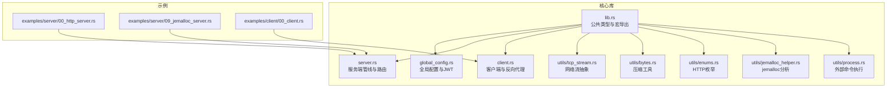
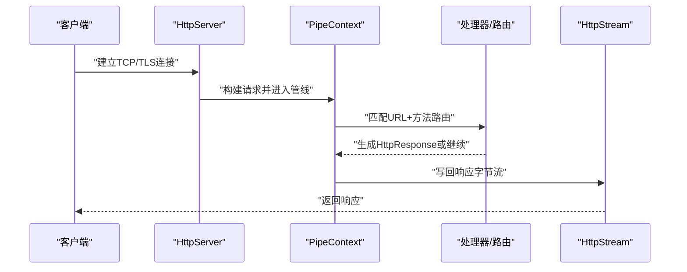
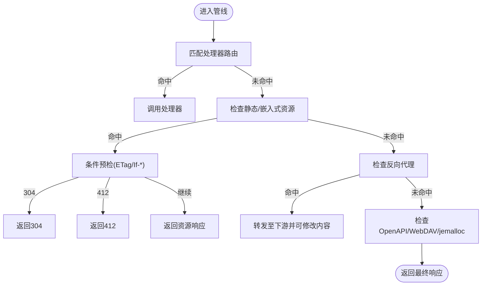
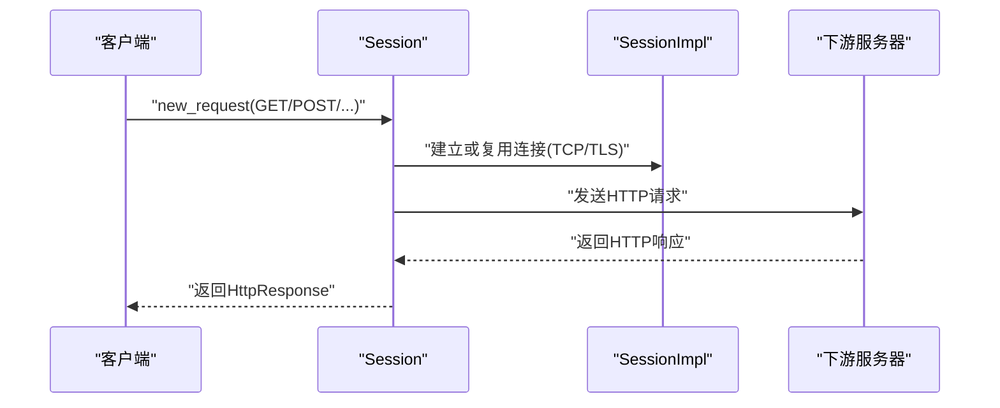
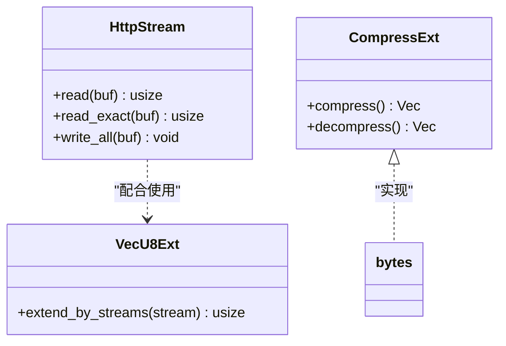
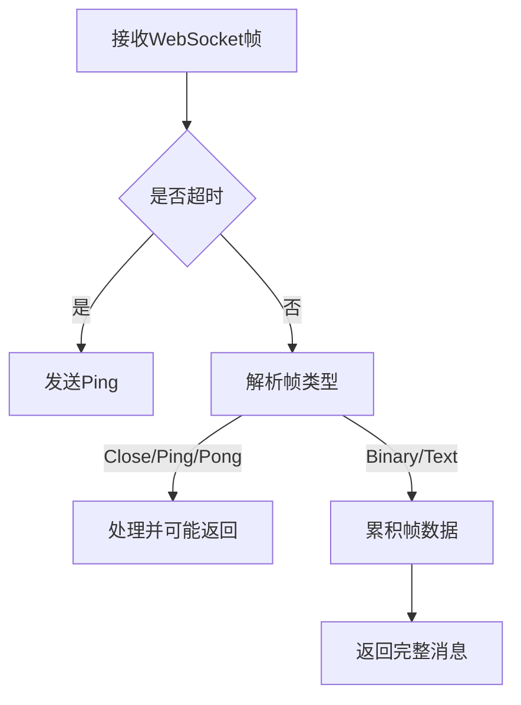
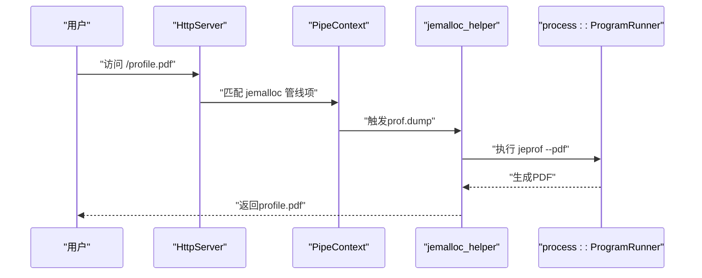
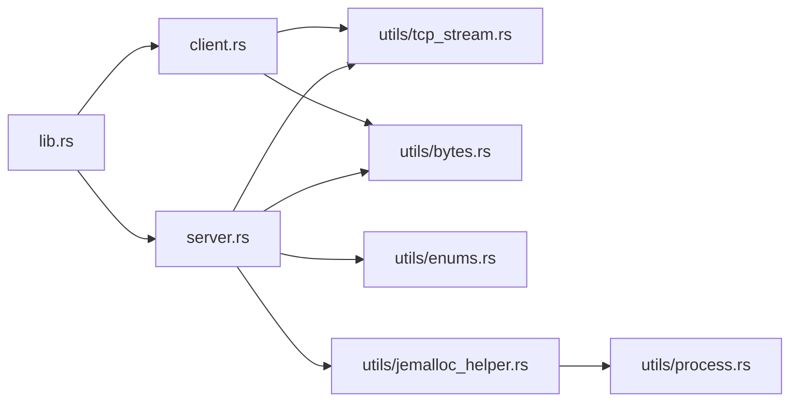

# 故障排查与调试

<cite>
**本文引用的文件**   
- [lib.rs](file://potato/src/lib.rs)
- [main.rs](file://potato/src/main.rs)
- [global_config.rs](file://potato/src/global_config.rs)
- [client.rs](file://potato/src/client.rs)
- [server.rs](file://potato/src/server.rs)
- [tcp_stream.rs](file://potato/src/utils/tcp_stream.rs)
- [bytes.rs](file://potato/src/utils/bytes.rs)
- [enums.rs](file://potato/src/utils/enums.rs)
- [jemalloc_helper.rs](file://potato/src/utils/jemalloc_helper.rs)
- [process.rs](file://potato/src/utils/process.rs)
- [Cargo.toml](file://Cargo.toml)
- [00_http_server.rs](file://examples/server/00_http_server.rs)
- [09_jemalloc_server.rs](file://examples/server/09_jemalloc_server.rs)
- [00_client.rs](file://examples/client/00_client.rs)
</cite>

## 目录
1. [简介](#简介)
2. [项目结构](#项目结构)
3. [核心组件](#核心组件)
4. [架构总览](#架构总览)
5. [详细组件分析](#详细组件分析)
6. [依赖关系分析](#依赖关系分析)
7. [性能考量](#性能考量)
8. [故障排查指南](#故障排查指南)
9. [结论](#结论)
10. [附录：常见错误与快速参考](#附录常见错误与快速参考)

## 简介
本指南面向使用 Potato 框架进行开发与运维的工程师，聚焦于常见问题的诊断与修复流程，覆盖连接超时、内存泄漏、性能瓶颈、网络问题、调试工具与最佳实践等主题。文档同时给出开发与生产环境的调试差异建议，并提供可直接定位到源码位置的参考路径，便于快速定位问题根因。

## 项目结构
Potato 采用模块化设计，核心由“HTTP 请求/响应模型”“客户端会话与转发”“服务端路由管线”“网络流抽象”“压缩与枚举工具”以及“可选内存分析辅助”组成。示例工程展示了最小服务启动、反向代理与 jemalloc 性能分析入口。

图表来源
- [lib.rs](file://potato/src/lib.rs#L1-L50)
- [server.rs](file://potato/src/server.rs#L1-L60)
- [client.rs](file://potato/src/client.rs#L1-L60)
- [tcp_stream.rs](file://potato/src/utils/tcp_stream.rs#L1-L40)
- [bytes.rs](file://potato/src/utils/bytes.rs#L1-L33)
- [enums.rs](file://potato/src/utils/enums.rs#L1-L41)
- [jemalloc_helper.rs](file://potato/src/utils/jemalloc_helper.rs#L1-L40)
- [process.rs](file://potato/src/utils/process.rs#L1-L27)
- [00_http_server.rs](file://examples/server/00_http_server.rs#L1-L12)
- [09_jemalloc_server.rs](file://examples/server/09_jemalloc_server.rs#L1-L16)
- [00_client.rs](file://examples/client/00_client.rs#L1-L7)

章节来源
- [Cargo.toml](file://Cargo.toml#L1-L4)
- [lib.rs](file://potato/src/lib.rs#L1-L50)

## 核心组件
- 请求/响应与方法枚举：定义了 HTTP 方法、内容类型、连接控制等基础能力，支撑服务端路由与客户端请求构造。
- 客户端与会话：支持直连与 TLS 连接，具备 JSON/表单/二进制请求体与头部管理；支持反向代理与 WebSocket 转发。
- 服务端管线：通过管道项组合实现“处理器路由、静态资源、嵌入式资源、反向代理、OpenAPI 文档、WebDAV、jemalloc 分析”等功能。
- 网络流抽象：统一封装 TCP/TLS/Duplex 流，屏蔽底层差异，提供读写与扩展接口。
- 压缩工具：提供 gzip 压缩/解压能力，用于代理场景的内容修改与传输优化。
- 全局配置：提供 JWT 密钥与 WebSocket 心跳周期等运行期可调参数。
- jemalloc 辅助：在启用特性时，提供内存分配器初始化与性能剖析导出能力。

章节来源
- [lib.rs](file://potato/src/lib.rs#L175-L196)
- [client.rs](file://potato/src/client.rs#L101-L157)
- [server.rs](file://potato/src/server.rs#L40-L132)
- [tcp_stream.rs](file://potato/src/utils/tcp_stream.rs#L11-L73)
- [bytes.rs](file://potato/src/utils/bytes.rs#L4-L32)
- [global_config.rs](file://potato/src/global_config.rs#L18-L35)
- [jemalloc_helper.rs](file://potato/src/utils/jemalloc_helper.rs#L14-L34)

## 架构总览
下图展示从客户端发起请求到服务端处理与响应返回的关键路径，以及可选的反向代理与 jemalloc 分析节点。

图表来源
- [server.rs](file://potato/src/server.rs#L362-L407)
- [tcp_stream.rs](file://potato/src/utils/tcp_stream.rs#L62-L72)

## 详细组件分析

### 组件A：服务端管线与路由
- 管线项类型涵盖处理器路由、静态文件/嵌入式资源、自定义回调、反向代理、OpenAPI 文档、WebDAV、jemalloc 分析等。
- 处理器未命中时，自动返回 OPTIONS 的 Allow 列表与可选 CORS 头；HEAD 请求直接返回空体。
- 静态文件与嵌入式资源支持条件预检（ETag/If-*）以减少带宽与提升缓存命中。
- 反向代理支持路径前缀裁剪、目标 Host 注入、TLS 透传与可选内容替换与长度修正。

图表来源
- [server.rs](file://potato/src/server.rs#L362-L766)

章节来源
- [server.rs](file://potato/src/server.rs#L40-L132)
- [server.rs](file://potato/src/server.rs#L362-L766)

### 组件B：客户端与反向代理
- 会话复用同一主机/协议/端口的连接，减少握手开销。
- 支持 TLS 与非 TLS 连接，TLS 下使用系统根证书信任链。
- 反向代理支持 WebSocket 转发，自动注入 Host 并处理 Content-Length。
- 代理可按需对响应内容进行 gzip 解压、替换目标 URL 为本地前缀并重新压缩。

图表来源
- [client.rs](file://potato/src/client.rs#L110-L140)
- [client.rs](file://potato/src/client.rs#L327-L473)

章节来源
- [client.rs](file://potato/src/client.rs#L101-L157)
- [client.rs](file://potato/src/client.rs#L224-L592)

### 组件C：网络流与压缩
- HttpStream 封装 TCP/TLS/Duplex 三种流，统一读写接口，便于上层无感切换。
- VecU8Ext 扩展提供基于流的动态扩展读取，便于按帧/分块读取。
- 压缩工具提供 gzip 编解码，用于代理场景的内容修改与传输优化。

图表来源
- [tcp_stream.rs](file://potato/src/utils/tcp_stream.rs#L11-L73)
- [tcp_stream.rs](file://potato/src/utils/tcp_stream.rs#L113-L129)
- [bytes.rs](file://potato/src/utils/bytes.rs#L4-L32)

章节来源
- [tcp_stream.rs](file://potato/src/utils/tcp_stream.rs#L1-L130)
- [bytes.rs](file://potato/src/utils/bytes.rs#L1-L33)

### 组件D：全局配置与WebSocket心跳
- 提供 JWT 密钥与 WebSocket 心跳周期的运行时配置接口，便于在不同环境调整安全与稳定性参数。
- WebSocket 接收侧在心跳间隔内未收到数据则触发 Ping，确保长连接健康。

图表来源
- [lib.rs](file://potato/src/lib.rs#L285-L308)
- [global_config.rs](file://potato/src/global_config.rs#L28-L34)

章节来源
- [global_config.rs](file://potato/src/global_config.rs#L18-L35)
- [lib.rs](file://potato/src/lib.rs#L207-L359)

### 组件E：jemalloc 内存分析
- 在启用 jemalloc 特性且满足条件时，初始化内存分配器并可在特定路径触发剖析导出。
- 通过外部命令执行 jeprof 生成 PDF 报告，便于定位热点与泄漏点。

图表来源
- [server.rs](file://potato/src/server.rs#L629-L667)
- [jemalloc_helper.rs](file://potato/src/utils/jemalloc_helper.rs#L36-L70)
- [process.rs](file://potato/src/utils/process.rs#L7-L25)

章节来源
- [jemalloc_helper.rs](file://potato/src/utils/jemalloc_helper.rs#L14-L70)
- [09_jemalloc_server.rs](file://examples/server/09_jemalloc_server.rs#L1-L16)

## 依赖关系分析
- 库级导出与宏：lib.rs 汇聚客户端、服务端、工具模块与宏，形成统一入口。
- 服务端管线依赖：处理器注册、HTTP 枚举、TCP 流、压缩工具与可选特性（OpenAPI/WebDAV/jemalloc）。
- 客户端依赖：会话与流抽象、TLS（可选）、压缩工具与反向代理逻辑。
- 工具模块：网络流、压缩、枚举、进程执行与 jemalloc 辅助。

图表来源
- [lib.rs](file://potato/src/lib.rs#L1-L18)
- [server.rs](file://potato/src/server.rs#L1-L26)
- [client.rs](file://potato/src/client.rs#L1-L9)
- [tcp_stream.rs](file://potato/src/utils/tcp_stream.rs#L1-L18)
- [bytes.rs](file://potato/src/utils/bytes.rs#L1-L3)
- [enums.rs](file://potato/src/utils/enums.rs#L1-L4)
- [jemalloc_helper.rs](file://potato/src/utils/jemalloc_helper.rs#L1-L6)
- [process.rs](file://potato/src/utils/process.rs#L1-L6)

章节来源
- [lib.rs](file://potato/src/lib.rs#L1-L50)
- [server.rs](file://potato/src/server.rs#L1-L26)
- [client.rs](file://potato/src/client.rs#L1-L9)

## 性能考量
- CPU 使用率分析
  - 使用系统性能分析工具（如 perf/top/htop）观察进程 CPU 占用峰值与上下文切换频率。
  - 关注服务端管线中处理器函数的耗时，必要时拆分复杂处理逻辑或引入异步任务池。
  - 参考路径：处理器注册与调用链位于服务端管线中。
  
  章节来源
  - [server.rs](file://potato/src/server.rs#L362-L407)

- 内存占用监控
  - 开启 jemalloc 特性并设置 MALLOC_CONF=prof:true，通过 /profile.pdf 路径导出剖析报告。
  - 生产环境建议仅在需要时开启，避免长期 profiling 对吞吐造成影响。
  
  章节来源
  - [jemalloc_helper.rs](file://potato/src/utils/jemalloc_helper.rs#L20-L34)
  - [09_jemalloc_server.rs](file://examples/server/09_jemalloc_server.rs#L1-L16)

- 网络延迟检测
  - 使用 ping/traceroute/iperf3 等工具测量端到端往返时间与丢包率。
  - 在客户端侧记录请求发送与响应到达的时间戳，结合服务端日志定位慢请求。
  - 参考路径：客户端连接建立与 TLS 握手逻辑。
  
  章节来源
  - [client.rs](file://potato/src/client.rs#L68-L98)

- 压缩与传输优化
  - 启用 gzip 压缩可降低带宽但增加 CPU；根据业务特征权衡。
  - 反向代理场景可对响应内容进行解压、替换与重压缩，注意 Content-Length 修正。
  
  章节来源
  - [bytes.rs](file://potato/src/utils/bytes.rs#L4-L32)
  - [client.rs](file://potato/src/client.rs#L424-L470)

## 故障排查指南

### 连接超时
- 现象
  - 客户端在指定时间内未收到响应，或服务端在监听端口后无法接受新连接。
- 诊断步骤
  - 检查服务端监听地址与端口是否正确，确认防火墙放行。
  - 使用 netstat/ss 查看端口状态；使用 telnet/nc 验证连通性。
  - 客户端侧确认 DNS 解析与代理设置；TLS 场景检查证书链与主机名匹配。
- 参考路径
  - 服务端监听与关闭信号：[server.rs](file://potato/src/server.rs#L799-L800)
  - 客户端连接建立与 TLS：[client.rs](file://potato/src/client.rs#L68-L98)

章节来源
- [server.rs](file://potato/src/server.rs#L799-L800)
- [client.rs](file://potato/src/client.rs#L68-L98)

### 内存泄漏与内存增长
- 现象
  - 进程常驻内存持续增长，GC/分配器回收不及时。
- 诊断步骤
  - 启用 jemalloc 并设置 MALLOC_CONF=prof:true，访问 /profile.pdf 导出剖析。
  - 对比不同时间段的 profile，关注增长显著的调用栈。
  - 结合业务逻辑检查长生命周期对象、缓存与连接池是否正确释放。
- 参考路径
  - jemalloc 初始化与导出：[jemalloc_helper.rs](file://potato/src/utils/jemalloc_helper.rs#L14-L70)
  - 示例服务启用 jemalloc：[09_jemalloc_server.rs](file://examples/server/09_jemalloc_server.rs#L1-L16)

章节来源
- [jemalloc_helper.rs](file://potato/src/utils/jemalloc_helper.rs#L14-L70)
- [09_jemalloc_server.rs](file://examples/server/09_jemalloc_server.rs#L1-L16)

### 性能瓶颈
- 现象
  - CPU 使用率偏高、QPS 下降、延迟升高。
- 诊断步骤
  - 使用 top/htop/perf 观察热点函数与阻塞点。
  - 检查服务端管线中是否存在大量同步阻塞操作，优先改为异步。
  - 评估压缩/解压与代理内容改写带来的额外 CPU 开销。
- 参考路径
  - 服务端管线处理与处理器调用：[server.rs](file://potato/src/server.rs#L362-L407)
  - 压缩工具实现：[bytes.rs](file://potato/src/utils/bytes.rs#L4-L32)

章节来源
- [server.rs](file://potato/src/server.rs#L362-L407)
- [bytes.rs](file://potato/src/utils/bytes.rs#L4-L32)

### 网络问题
- DNS 解析失败
  - 检查 /etc/resolv.conf 与系统 DNS 设置；使用 nslookup/dig 验证。
  - 客户端 TLS 场景需确保 SNI 与主机名一致。
- 防火墙与代理
  - 确认出站端口开放；代理需正确传递 Host 与必要的头。
  - 反向代理场景检查路径前缀裁剪与目标 Host 注入逻辑。
- 参考路径
  - 客户端 TLS 与连接：[client.rs](file://potato/src/client.rs#L68-L98)
  - 反向代理与头部处理：[client.rs](file://potato/src/client.rs#L284-L325)

章节来源
- [client.rs](file://potato/src/client.rs#L68-L98)
- [client.rs](file://potato/src/client.rs#L284-L325)

### 错误处理与异常捕获
- 错误日志记录
  - 使用 anyhow 的错误传播机制，保留上下文并在上层统一格式化输出。
  - 服务端自定义回调返回错误时，统一转换为 HttpResponse.error。
- 堆栈跟踪
  - 在开发环境启用 RUST_BACKTRACE 或使用 cargo run -- --backtrace 获取详细堆栈。
- 用户友好错误信息
  - 对外返回的错误应避免泄露内部实现细节，仅返回通用提示。
- 参考路径
  - 自定义回调错误处理：[server.rs](file://potato/src/server.rs#L613-L614)

章节来源
- [server.rs](file://potato/src/server.rs#L613-L614)

### 开发与生产调试差异
- 开发环境
  - 可开启更详细的日志与断点；允许使用非 TLS 环境验证功能。
  - 示例最小服务启动：[00_http_server.rs](file://examples/server/00_http_server.rs#L1-L12)
- 生产环境
  - 严格限制日志级别，避免敏感信息泄露；TLS 必须启用并校验证书链。
  - jemalloc 仅在问题复现时临时开启，避免长期 profiling 影响性能。

章节来源
- [00_http_server.rs](file://examples/server/00_http_server.rs#L1-L12)
- [client.rs](file://potato/src/client.rs#L68-L98)

## 结论
通过明确的服务端管线、统一的网络流抽象与可选的 jemalloc 分析能力，Potato 框架为故障排查提供了清晰的路径。建议在开发阶段充分验证路由与代理行为，在生产阶段严格控制日志与 TLS 配置，并在定位内存问题时谨慎启用 jemalloc 分析，以获得准确的性能画像。

## 附录：常见错误与快速参考
- 连接被拒绝/超时
  - 检查监听地址与端口、防火墙策略与代理链路。
  - 参考：[server.rs](file://potato/src/server.rs#L799-L800)、[client.rs](file://potato/src/client.rs#L68-L98)
- TLS 握手失败
  - 确认证书链与主机名匹配；检查编译特性是否启用 TLS。
  - 参考：[client.rs](file://potato/src/client.rs#L68-L98)
- 404 未找到
  - 检查 URL 路径与方法是否匹配处理器注册；确认静态/嵌入式资源路径前缀。
  - 参考：[server.rs](file://potato/src/server.rs#L362-L407)
- 304/412 条件预检
  - 检查 If-Modified-Since/If-None-Match/If-Match 等头是否正确生成与匹配。
  - 参考：[lib.rs](file://potato/src/lib.rs#L777-L800)
- 反向代理内容异常
  - 检查路径前缀裁剪、Host 注入与 Content-Length 修正。
  - 参考：[client.rs](file://potato/src/client.rs#L284-L325)
- jemalloc 未启用或导出失败
  - 确认特性启用与 MALLOC_CONF 设置；检查 jeprof 可用性。
  - 参考：[jemalloc_helper.rs](file://potato/src/utils/jemalloc_helper.rs#L20-L34)、[09_jemalloc_server.rs](file://examples/server/09_jemalloc_server.rs#L1-L16)