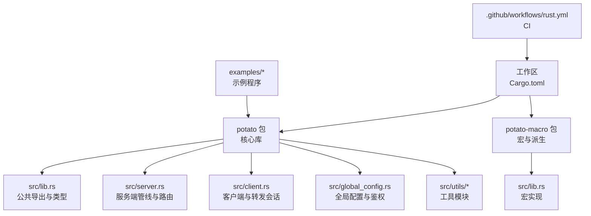
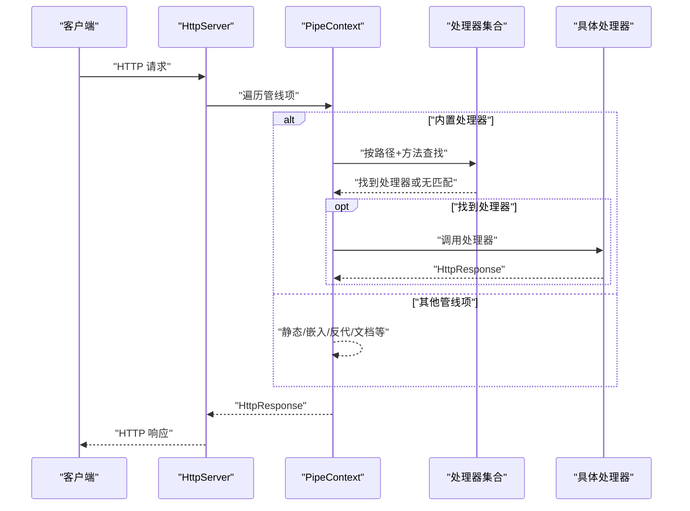
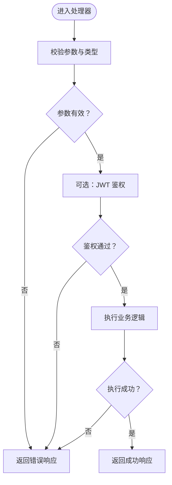
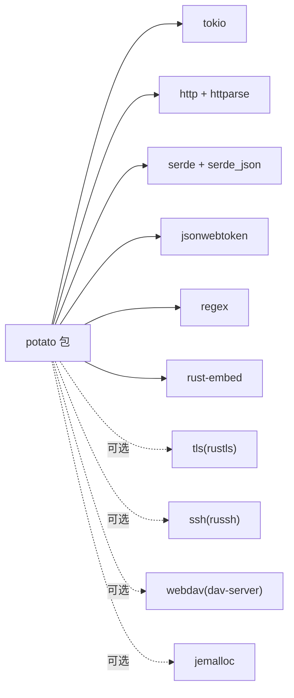

# 最佳实践

<cite>
**本文引用的文件**
- [Cargo.toml](file://Cargo.toml)
- [Cargo.toml（包）](file://potato/Cargo.toml)
- [lib.rs](file://potato/src/lib.rs)
- [main.rs](file://potato/src/main.rs)
- [server.rs](file://potato/src/server.rs)
- [client.rs](file://potato/src/client.rs)
- [global_config.rs](file://potato/src/global_config.rs)
- [lib.rs（宏）](file://potato-macro/src/lib.rs)
- [utils/mod.rs](file://potato/src/utils/mod.rs)
- [README.md](file://README.md)
- [00_http_server.rs](file://examples/server/00_http_server.rs)
- [07_auth_server.rs](file://examples/server/07_auth_server.rs)
- [08_websocket_server.rs](file://examples/server/08_websocket_server.rs)
- [10_shutdown_server.rs](file://examples/server/10_shutdown_server.rs)
- [rust.yml](file://.github/workflows/rust.yml)
</cite>

## 目录
1. [引言](#引言)
2. [项目结构](#项目结构)
3. [核心组件](#核心组件)
4. [架构总览](#架构总览)
5. [组件详解与最佳实践](#组件详解与最佳实践)
6. [依赖关系分析](#依赖关系分析)
7. [性能考量](#性能考量)
8. [故障排查指南](#故障排查指南)
9. [结论](#结论)
10. [附录：示例与参考路径](#附录示例与参考路径)

## 引言
本指南面向使用 Potato 框架进行高性能 HTTP/WebSocket/反向代理等开发的工程师，系统总结代码组织、错误处理与异常管理、性能优化、安全策略、测试与部署运维的最佳实践，并提供常见陷阱与调试技巧。

## 项目结构
仓库采用多包工作区布局，核心库位于 potato 包，宏处理器位于 potato-macro 包；examples 提供典型用法示例；根目录包含构建与 CI 配置。

图表来源
- [Cargo.toml](file://Cargo.toml#L1-L4)
- [Cargo.toml（包）](file://potato/Cargo.toml#L1-L76)
- [lib.rs](file://potato/src/lib.rs#L1-L44)
- [server.rs](file://potato/src/server.rs#L1-L50)
- [client.rs](file://potato/src/client.rs#L1-L20)
- [global_config.rs](file://potato/src/global_config.rs#L1-L20)
- [lib.rs（宏）](file://potato-macro/src/lib.rs#L1-L30)

章节来源
- [Cargo.toml](file://Cargo.toml#L1-L4)
- [Cargo.toml（包）](file://potato/Cargo.toml#L1-L76)

## 核心组件
- 请求/响应模型与解析
  - 请求对象封装方法、路径、查询参数、头、主体及扩展数据，支持多种内容类型解析与条件预检。
  - 响应对象支持从文件、内存、压缩等多源生成。
- 服务器管线与路由
  - 管线项支持内置处理器、静态资源嵌入、本地文件映射、反向代理、OpenAPI 文档、WebDAV、Jemalloc 报告等。
  - 使用 inventory 收集注解注册的处理器，按路径+方法分发。
- 客户端与转发
  - Session/TransferSession 支持正向/反向代理、TLS、SSH 跳板、WebSocket 转发。
- 宏与派生
  - 注解式路由宏自动注入参数解析、鉴权校验、返回包装与 OpenAPI 文档元数据收集。
- 全局配置与鉴权
  - JWT 秘钥、WebSocket 心跳周期等通过异步全局配置管理。

章节来源
- [lib.rs](file://potato/src/lib.rs#L384-L799)
- [server.rs](file://potato/src/server.rs#L28-L767)
- [client.rs](file://potato/src/client.rs#L101-L615)
- [lib.rs（宏）](file://potato-macro/src/lib.rs#L26-L299)
- [global_config.rs](file://potato/src/global_config.rs#L7-L63)

## 架构总览
下图展示从请求进入、管线匹配、处理器执行到响应返回的整体流程，以及宏如何在编译期注册处理器。

图表来源
- [server.rs](file://potato/src/server.rs#L362-L767)
- [lib.rs（宏）](file://potato-macro/src/lib.rs#L290-L296)

## 组件详解与最佳实践

### 代码组织与模块划分
- 包结构
  - 工作区统一管理版本与成员，核心库与宏分离，便于独立发布与复用。
- 模块职责
  - server.rs：服务端管线、路由、中间件式管线项（静态、嵌入、反代、OpenAPI、WebDAV、Jemalloc）。
  - client.rs：客户端会话、请求构造、TLS/SSH 连接、反向代理、WebSocket 转发。
  - lib.rs：公共类型、请求/响应模型、WebSocket 协议、HTTP 条件预检、日期解析等。
  - global_config.rs：全局配置（JWT 秘钥、WS 心跳）、鉴权工具。
  - utils/*：字节压缩、枚举、数值扩展、字符串、TCP 流封装等。
  - 宏包：注解式路由、标准头派生、目录嵌入。
- 文件命名规范建议
  - 按功能域拆分：server.rs、client.rs、global_config.rs、lib.rs。
  - 工具模块以小而专命名：如 bytes.rs、refstr.rs、tcp_stream.rs。
  - 宏实现集中于 potato-macro/src/lib.rs，派生宏与属性宏清晰区分。
  - 示例文件以序号+主题命名：00_http_server.rs、07_auth_server.rs、08_websocket_server.rs、10_shutdown_server.rs。

章节来源
- [Cargo.toml](file://Cargo.toml#L1-L4)
- [Cargo.toml（包）](file://potato/Cargo.toml#L16-L76)
- [utils/mod.rs](file://potato/src/utils/mod.rs#L1-L12)
- [lib.rs（宏）](file://potato-macro/src/lib.rs#L332-L343)

### 错误处理与异常管理
- 统一错误类型
  - 使用 anyhow::Result 在框架内外传递错误，便于链路传播与上下文拼接。
- 处理器层错误
  - 宏自动生成的处理器在缺失参数、类型不匹配、鉴权失败时返回错误响应。
- 管线层错误
  - 自定义管线处理器返回 Ok(None) 则继续下一个管线项；返回 Err(...) 将转换为错误响应。
- 日志记录
  - 当前未见显式日志库依赖；建议在业务层引入 tracing/log 记录请求生命周期与错误堆栈。
- 用户友好错误
  - 返回 HttpResponse::error(...) 时，建议对敏感信息脱敏，仅暴露必要提示。

图表来源
- [lib.rs（宏）](file://potato-macro/src/lib.rs#L120-L180)
- [server.rs](file://potato/src/server.rs#L610-L614)

章节来源
- [lib.rs（宏）](file://potato-macro/src/lib.rs#L120-L180)
- [server.rs](file://potato/src/server.rs#L610-L614)

### 性能优化
- 内存与序列化
  - 使用 hipstr 的 LocalHipStr/LocalHipByt 减少分配与拷贝，提升高频路径性能。
  - 压缩传输：根据 Accept-Encoding 选择 gzip，响应体支持压缩与解压。
- 并发与 I/O
  - 基于 Tokio 的异步 I/O；WebSocket 双向转发使用 select 并发收发。
  - 管线项中对连接池与会话复用（如 TransferSession 的 conns）减少握手开销。
- 网络与 TLS
  - 可选 feature=tls 启用 rustls；客户端/服务端均支持 TLS。
  - 反向代理支持修改内容（如替换 URL），注意在大流量场景下的 CPU 与内存占用。
- 分析与剖析
  - 可选 feature=jemalloc 启用 jemalloc 并提供 profile 导出接口，用于内存剖析。

章节来源
- [lib.rs](file://potato/src/lib.rs#L38-L43)
- [client.rs](file://potato/src/client.rs#L274-L473)
- [server.rs](file://potato/src/server.rs#L629-L667)
- [Cargo.toml（包）](file://potato/Cargo.toml#L43-L56)

### 安全考虑
- 输入验证
  - 宏处理器对参数类型进行严格解析与缺失检查；建议在业务层补充范围/长度/格式校验。
- XSS 防护
  - 框架未内置模板引擎或自动转义；建议在渲染 HTML 时对用户输入进行输出编码或使用安全模板。
- CSRF 保护
  - 框架未内置 CSRF 中间件；建议在业务层引入基于令牌的校验或 SameSite Cookie。
- JWT 与认证
  - 提供 JWT 签发与校验工具；建议：
    - 使用强随机秘钥并安全存储；
    - 控制过期时间；
    - 对 auth_arg 参数进行严格类型约束；
    - 在网关层限制速率与来源。

章节来源
- [lib.rs（宏）](file://potato-macro/src/lib.rs#L130-L155)
- [global_config.rs](file://potato/src/global_config.rs#L37-L63)

### 测试策略
- 单元测试
  - 对工具模块（如 bytes、string、refstr、enums、number）编写针对性测试。
- 集成测试
  - 使用示例中的服务端与客户端组合，覆盖路由、鉴权、WebSocket、反向代理等场景。
- 性能测试
  - 使用 cargo bench 或外部压测工具，关注 QPS、延迟分布、内存峰值与 GC 压力。
- CI
  - GitHub Actions 已配置构建与测试步骤，建议扩展覆盖率与基准测试。

章节来源
- [.github/workflows/rust.yml](file://.github/workflows/rust.yml#L12-L22)

### 部署与运维
- 容器化
  - 建议基于精简镜像（如 alpine）构建，启用 release 构建与 strip 符号。
- 监控与日志
  - 引入 tracing/log 结合日志采集（如 Loki）与指标（如 Prometheus）。
- 健康检查与优雅停机
  - 使用 oneshot 信号触发关闭，示例展示了优雅停机机制。

章节来源
- [10_shutdown_server.rs](file://examples/server/10_shutdown_server.rs#L1-L22)
- [server.rs](file://potato/src/server.rs#L790-L800)

### 常见陷阱与避免方法
- 未设置鉴权密钥导致 JWT 校验失败或随机密钥引发会话中断。
- 反向代理修改内容时未正确处理 Content-Length 与 Transfer-Encoding。
- WebSocket 转发未处理 Ping/Pong 导致连接超时。
- 静态资源路径穿越：确保路径规范化与根目录限制。
- TLS 版本与证书：非 TLS 构建禁用 TLS 功能，避免运行时错误。

章节来源
- [client.rs](file://potato/src/client.rs#L384-L411)
- [server.rs](file://potato/src/server.rs#L408-L423)
- [08_websocket_server.rs](file://examples/server/08_websocket_server.rs#L25-L35)

### 调试技巧与工具推荐
- 使用 feature=jemalloc 生成内存剖析报告，定位泄漏与热点。
- 在业务层增加 tracing span，标记关键阶段耗时。
- 使用浏览器开发者工具与抓包工具（如 Wireshark/Charles）观察 WebSocket 握手与帧。
- 通过示例程序快速复现问题，逐步缩小范围。

章节来源
- [Cargo.toml（包）](file://potato/Cargo.toml#L43-L56)
- [08_websocket_server.rs](file://examples/server/08_websocket_server.rs#L10-L20)

## 依赖关系分析
- 工作区与包
  - 工作区声明成员 potato 与 potato-macro，统一版本与特性开关。
- 包依赖
  - 核心依赖：tokio、http、httparse、serde、jsonwebtoken、regex、rust-embed、flate2 等。
  - 可选依赖：tls、ssh、webdav、jemalloc 等，通过 feature 开启。
- 特性矩阵
  - 默认开启 openapi 与 tls；full 包含所有可选特性。

图表来源
- [Cargo.toml（包）](file://potato/Cargo.toml#L16-L76)

章节来源
- [Cargo.toml（包）](file://potato/Cargo.toml#L16-L76)

## 性能考量
- I/O 与并发
  - 使用异步 TCP/TLS 流，合理设置缓冲区大小，避免阻塞。
- 压缩与编码
  - 对大响应启用 gzip，注意压缩比与 CPU 占用平衡。
- 缓存与条件请求
  - 利用 ETag 与 304/412 响应减少带宽与计算。
- 内存管理
  - 优先使用零拷贝与就地解析，减少中间结构创建。

章节来源
- [lib.rs](file://potato/src/lib.rs#L777-L800)
- [server.rs](file://potato/src/server.rs#L440-L461)

## 故障排查指南
- 无法解析请求
  - 检查请求头是否完整，确认 httparse 解析状态。
- WebSocket 握手失败
  - 核对 Upgrade/Connection/Sec-WebSocket-* 头部字段。
- 反向代理异常
  - 检查目标主机、端口、TLS 标识与路径前缀替换逻辑。
- 鉴权失败
  - 确认 Authorization 头格式与 JWT 有效性，检查全局秘钥配置。

章节来源
- [lib.rs](file://potato/src/lib.rs#L532-L579)
- [client.rs](file://potato/src/client.rs#L475-L591)
- [global_config.rs](file://potato/src/global_config.rs#L37-L63)

## 结论
通过模块化设计、宏驱动的声明式路由、完善的管线与可选特性，Potato 在保证简洁的同时提供了高性能与可扩展性。遵循本文的组织、错误处理、性能、安全与运维建议，可在生产环境中稳定落地。

## 附录：示例与参考路径
- 基础 HTTP 服务
  - [00_http_server.rs](file://examples/server/00_http_server.rs#L1-L12)
- 鉴权与 OpenAPI
  - [07_auth_server.rs](file://examples/server/07_auth_server.rs#L1-L24)
- WebSocket
  - [08_websocket_server.rs](file://examples/server/08_websocket_server.rs#L1-L43)
- 优雅停机
  - [10_shutdown_server.rs](file://examples/server/10_shutdown_server.rs#L1-L22)
- 快速开始与示例索引
  - [README.md](file://README.md#L21-L50)