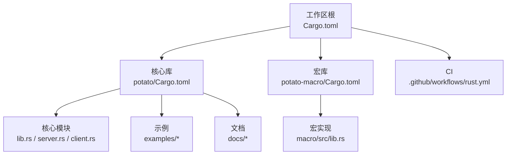
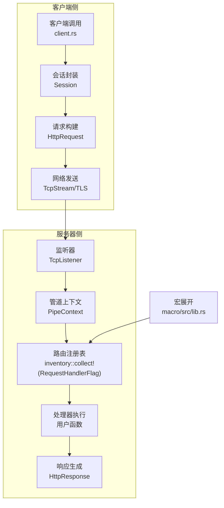
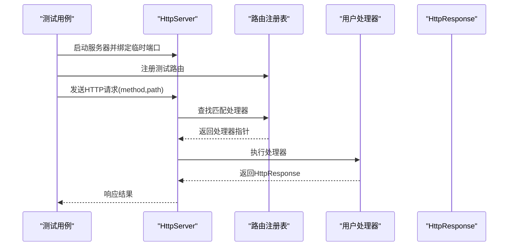
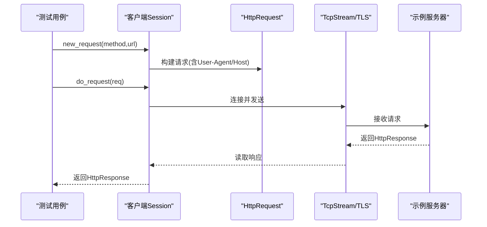
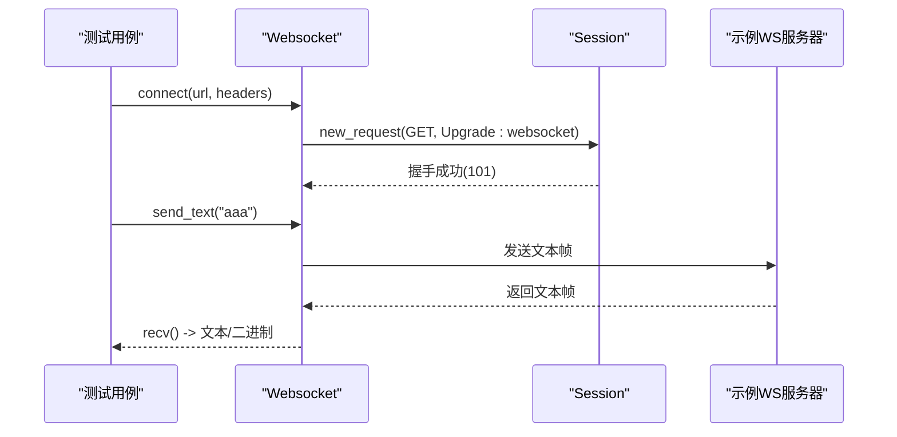
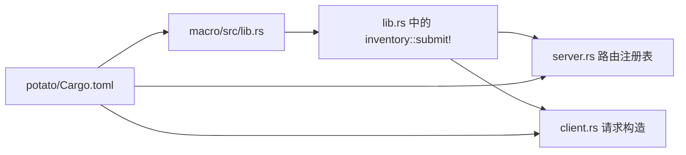
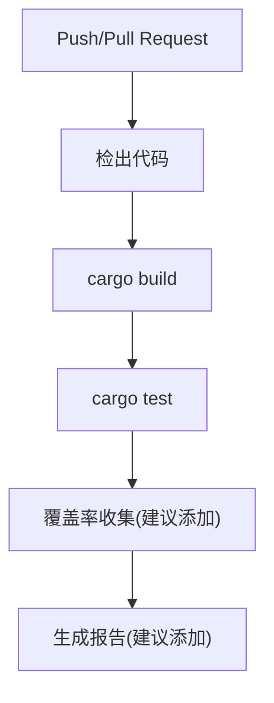

# 测试策略

<cite>
**本文档引用的文件**
- [Cargo.toml](file://Cargo.toml)
- [.github/workflows/rust.yml](file://.github/workflows/rust.yml)
- [README.md](file://README.md)
- [README.zh.md](file://README.zh.md)
- [potato/Cargo.toml](file://potato/Cargo.toml)
- [potato-macro/Cargo.toml](file://potato-macro/Cargo.toml)
- [potato/src/lib.rs](file://potato/src/lib.rs)
- [potato/src/main.rs](file://potato/src/main.rs)
- [potato/src/server.rs](file://potato/src/server.rs)
- [potato/src/client.rs](file://potato/src/client.rs)
- [potato-macro/src/lib.rs](file://potato-macro/src/lib.rs)
- [examples/server/00_http_server.rs](file://examples/server/00_http_server.rs)
- [examples/client/00_client.rs](file://examples/client/00_client.rs)
- [examples/client/03_websocket_client.rs](file://examples/client/03_websocket_client.rs)
</cite>

## 目录
1. [引言](#引言)
2. [项目结构](#项目结构)
3. [核心组件](#核心组件)
4. [架构总览](#架构总览)
5. [详细组件分析](#详细组件分析)
6. [依赖关系分析](#依赖关系分析)
7. [性能考量](#性能考量)
8. [故障排查指南](#故障排查指南)
9. [结论](#结论)
10. [附录](#附录)

## 引言
本测试策略面向 Potato 框架，目标是建立覆盖单元测试、集成测试、性能测试与持续集成的完整测试体系。重点涵盖：
- 单元测试：HTTP 服务器路由测试、客户端请求模拟、宏展开验证
- 集成测试：端到端测试、WebSocket 连接测试、TLS 加密测试
- 性能测试：压力测试、并发测试、内存泄漏检测
- Mock 与 Stub：依赖注入与外部服务模拟
- 测试数据：fixtures 与数据库种子数据管理
- CI：GitHub Actions 工作流与自动化测试流程
- 覆盖率：度量与改进方法

## 项目结构
仓库采用工作区组织，包含核心库与宏库，以及示例与文档。关键目录与文件如下：
- 工作区根：定义成员包与版本
- 宏包：提供 HTTP 路由宏与派生宏
- 核心库：HTTP 客户端、服务器、WebSocket、工具模块
- 示例：HTTP/HTTPS/WebSocket/反向代理等示例
- 文档：中英文指南与示例
- CI：GitHub Actions 工作流



图表来源
- [Cargo.toml](file://Cargo.toml#L1-L4)
- [potato/Cargo.toml](file://potato/Cargo.toml#L1-L76)
- [potato-macro/Cargo.toml](file://potato-macro/Cargo.toml#L1-L24)

章节来源
- [Cargo.toml](file://Cargo.toml#L1-L4)
- [README.md](file://README.md#L1-L57)
- [README.zh.md](file://README.zh.md#L1-L58)

## 核心组件
- 宏系统：通过属性宏为函数生成路由注册与参数解析逻辑，支持 GET/POST/PUT/DELETE/OPTIONS/HEAD 等方法，支持鉴权参数与文档元数据收集。
- 服务器：基于 TCP/TLS 监听，按路由表分发请求，支持管道化中间件（处理器、静态资源、反向代理、OpenAPI 索引等）。
- 客户端：会话式请求封装，支持 JSON/二进制/表单等负载类型，支持 TLS 连接。
- WebSocket：握手升级与帧编解码，支持文本/二进制/控制帧。
- 工具模块：HTTP 解析、压缩、TCP 流封装、枚举与字符串扩展等。

章节来源
- [potato/src/lib.rs](file://potato/src/lib.rs#L124-L175)
- [potato/src/server.rs](file://potato/src/server.rs#L28-L38)
- [potato/src/client.rs](file://potato/src/client.rs#L100-L157)
- [potato-macro/src/lib.rs](file://potato-macro/src/lib.rs#L26-L300)

## 架构总览
下图展示从客户端到服务器的典型请求路径，以及宏在编译期生成的路由注册与运行时调度的关系。



图表来源
- [potato/src/client.rs](file://potato/src/client.rs#L110-L140)
- [potato/src/server.rs](file://potato/src/server.rs#L28-L38)
- [potato/src/lib.rs](file://potato/src/lib.rs#L175-L175)
- [potato-macro/src/lib.rs](file://potato-macro/src/lib.rs#L26-L300)

## 详细组件分析

### 宏展开与路由注册测试
目标：
- 验证宏对不同 HTTP 方法的正确展开
- 验证路由路径、鉴权参数、文档元数据收集
- 验证参数解析与类型转换逻辑

建议测试点：
- 属性宏输入校验（路径必须以“/”开头）
- 参数类型支持与错误提示（仅支持有限基本类型）
- 鉴权参数存在性与类型约束（必须为 String）
- 返回类型分支（Result<HttpResponse>/HttpResponse/()）
- 文档元数据序列化与 JSON 结构

```mermaid
flowchart TD
Start(["开始：宏输入"]) --> ParseAttr["解析属性<br/>path/auth_arg"]
ParseAttr --> ValidatePath{"路径合法？"}
ValidatePath --> |否| Panic["抛出错误"]
ValidatePath --> |是| CollectArgs["收集函数参数"]
CollectArgs --> ArgType{"参数类型有效？"}
ArgType --> |否| Panic
ArgType --> |是| BuildBody["生成调用体<br/>参数解析/类型转换"]
BuildBody --> RetType{"返回类型分支？"}
RetType --> |Result<HttpResponse>| WrapOk["包装成功响应"]
RetType --> |HttpResponse| ReturnResp["直接返回"]
RetType --> |()| WrapText["返回文本响应"]
RetType --> |其他| Panic
WrapOk --> Submit["提交注册项<br/>inventory::submit!"]
ReturnResp --> Submit
WrapText --> Submit
Submit --> End(["结束"])
```

图表来源
- [potato-macro/src/lib.rs](file://potato-macro/src/lib.rs#L26-L300)

章节来源
- [potato-macro/src/lib.rs](file://potato-macro/src/lib.rs#L26-L300)

### HTTP 服务器路由测试
目标：
- 验证路由注册表是否按方法与路径正确映射
- 验证请求解析与处理器分发
- 验证条件预检头（304/412）处理
- 验证 OpenAPI 文档生成（如启用）

建议测试点：
- 使用最小化示例函数与宏标注，启动服务器监听临时端口
- 发送不同方法与路径的请求，断言处理器被调用且返回码符合预期
- 断言条件预检头触发后返回 304 或 412
- 如启用 openapi 特性，断言索引 JSON 的结构与字段



图表来源
- [potato/src/server.rs](file://potato/src/server.rs#L28-L38)
- [examples/server/00_http_server.rs](file://examples/server/00_http_server.rs#L1-L12)

章节来源
- [potato/src/server.rs](file://potato/src/server.rs#L28-L38)
- [examples/server/00_http_server.rs](file://examples/server/00_http_server.rs#L1-L12)

### 客户端请求模拟与 TLS 测试
目标：
- 验证客户端会话复用与请求构造
- 验证不同方法与负载类型的请求发送
- 验证 TLS 连接（当启用 tls 特性时）
- 验证响应解析与头部处理

建议测试点：
- 无 TLS：直接连接本地回环地址，断言响应状态与主体
- 启用 TLS：使用受信根证书，断言握手成功与响应
- 复用会话：同一主机/协议/端口复用连接，断言会话缓存命中
- 负载类型：JSON、字符串、二进制、表单，断言 Content-Type 与解析



图表来源
- [potato/src/client.rs](file://potato/src/client.rs#L110-L140)
- [examples/client/00_client.rs](file://examples/client/00_client.rs#L1-L7)

章节来源
- [potato/src/client.rs](file://potato/src/client.rs#L110-L140)
- [examples/client/00_client.rs](file://examples/client/00_client.rs#L1-L7)

### WebSocket 连接测试
目标：
- 验证 WebSocket 握手与升级
- 验证帧编解码（文本/二进制/控制帧）
- 验证心跳（Ping/Pong）与超时处理
- 验证分片帧拼接与消息完整性

建议测试点：
- 握手：构造符合规范的请求头，断言返回 101 Switching Protocols
- 收发：发送文本/二进制帧，断言接收对应帧类型与内容
- 心跳：发送 Ping，断言收到 Pong；超时断言 Ping 自动重发
- 错误：断言不支持的 opcode 与关闭帧行为



图表来源
- [potato/src/lib.rs](file://potato/src/lib.rs#L208-L359)
- [examples/client/03_websocket_client.rs](file://examples/client/03_websocket_client.rs#L1-L11)

章节来源
- [potato/src/lib.rs](file://potato/src/lib.rs#L208-L359)
- [examples/client/03_websocket_client.rs](file://examples/client/03_websocket_client.rs#L1-L11)

### TLS 加密测试
目标：
- 验证 TLS 特性开关下的客户端/服务器行为
- 验证证书链与根证书加载
- 验证非 TLS 构建下对 TLS 的错误提示

建议测试点：
- 构建特性：启用 tls 与禁用 tls 的差异
- 客户端：TLS 连接成功与失败场景（域名/证书）
- 服务器：TLS 监听与握手日志（可选）

章节来源
- [potato/Cargo.toml](file://potato/Cargo.toml#L65-L72)
- [potato/src/client.rs](file://potato/src/client.rs#L68-L98)

### 性能测试
目标：
- 压力测试：高 QPS 下的吞吐与延迟
- 并发测试：多任务并发请求与连接复用
- 内存泄漏检测：长时间运行与大流量下的内存增长

建议方法：
- 使用基准测试（如 criterion）或压测工具（如 wrk/h2load）
- 关注关键路径：请求解析、处理器执行、响应写回
- 对比启用/禁用特性（如 TLS、OpenAPI、Jemalloc）对性能的影响
- 使用内存分析工具（如 Valgrind/memray）进行泄漏检测

[本节为通用指导，无需特定文件引用]

### Mock 与 Stub
目标：
- 通过依赖注入替换外部服务（如认证、存储）
- 使用 Mock/Stub 模拟网络与文件系统行为
- 在单元测试中隔离业务逻辑

建议实践：
- 将外部依赖抽象为 trait，通过构造函数注入
- 使用第三方 Mock 库（如 mockall）或手动实现
- 对网络层使用本地回环与临时端口，避免真实网络依赖

[本节为通用指导，无需特定文件引用]

### 测试数据与 fixtures
目标：
- 统一管理测试数据与环境
- 提供可重复的数据库种子与静态资源 fixtures

建议实践：
- 使用临时目录存放 fixtures，并在测试结束后清理
- 对 OpenAPI 文档生成，提供稳定的路由集合
- 对 WebSocket 测试，准备固定的消息模板与期望输出

[本节为通用指导，无需特定文件引用]

## 依赖关系分析
- 工作区成员：potato 与 potato-macro
- 核心依赖：tokio、http、httparse、serde_json、inventory、jsonwebtoken、rustls 等
- 特性开关：tls、openapi、ssh、webdav、jemalloc 影响功能与依赖



图表来源
- [potato-macro/src/lib.rs](file://potato-macro/src/lib.rs#L290-L295)
- [potato/src/lib.rs](file://potato/src/lib.rs#L175-L175)
- [potato/src/server.rs](file://potato/src/server.rs#L28-L38)
- [potato/Cargo.toml](file://potato/Cargo.toml#L65-L72)

章节来源
- [Cargo.toml](file://Cargo.toml#L1-L4)
- [potato/Cargo.toml](file://potato/Cargo.toml#L16-L72)
- [potato-macro/Cargo.toml](file://potato-macro/Cargo.toml#L14-L24)

## 性能考量
- 编译期优化：宏展开减少运行时开销
- 运行时优化：零拷贝字符串与字节容器、连接复用、压缩传输
- 特性权衡：TLS 与 OpenAPI 会增加额外处理成本，按需启用
- 压测建议：关注解析、路由查找、处理器执行、I/O 写回等瓶颈

[本节为通用指导，无需特定文件引用]

## 故障排查指南
常见问题与定位思路：
- 路由未生效：检查宏是否正确展开、注册表是否收集到处理器
- 握手失败：确认请求头字段齐全（Upgrade/Connection/Sec-WebSocket-*），服务器端是否支持
- TLS 失败：确认证书链与根证书可用，域名匹配
- 条件请求异常：核对 If-Modified-Since/If-None-Match/If-Match 等头的格式与时序

章节来源
- [potato/src/lib.rs](file://potato/src/lib.rs#L532-L579)
- [potato/src/client.rs](file://potato/src/client.rs#L68-L98)

## 结论
通过将宏展开验证、路由注册、客户端请求与 WebSocket/TLS 场景纳入统一测试矩阵，并结合性能与覆盖率度量，可显著提升 Potato 框架的稳定性与可维护性。建议优先完善单元测试与宏展开验证，再逐步扩展到集成与性能测试。

[本节为总结，无需特定文件引用]

## 附录

### 持续集成配置
当前工作流包含构建与测试步骤，建议扩展：
- 覆盖率收集与报告
- 多特性组合测试（如 tls/openapi/webdav/jemalloc）
- 并行化测试作业
- 性能回归基线对比



图表来源
- [.github/workflows/rust.yml](file://.github/workflows/rust.yml#L1-L23)

章节来源
- [.github/workflows/rust.yml](file://.github/workflows/rust.yml#L1-L23)

### 测试覆盖率度量与改进
- 使用 cargo-tarpaulin 或 similar 工具生成覆盖率报告
- 识别低覆盖率模块（如宏展开、特性分支），补充针对性用例
- 将覆盖率阈值纳入 CI，逐步提升整体覆盖率

[本节为通用指导，无需特定文件引用]