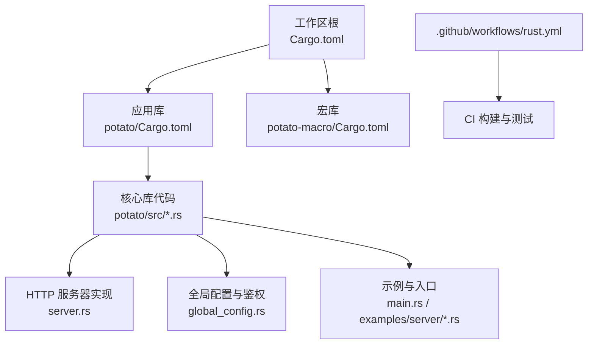
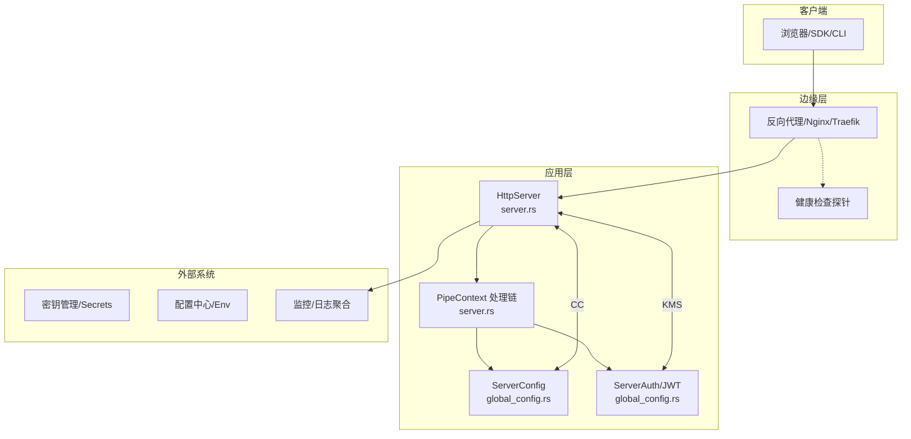
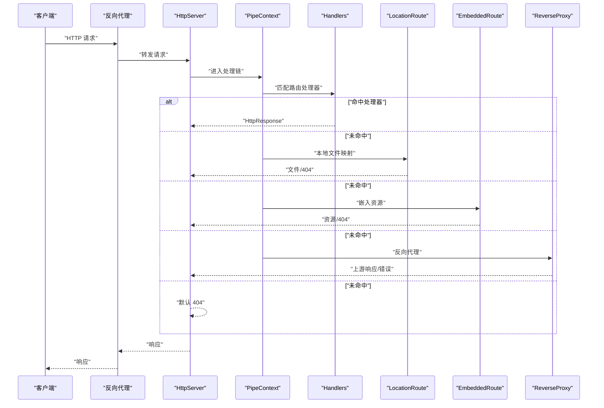
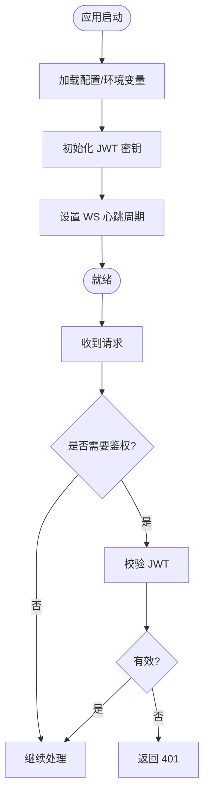
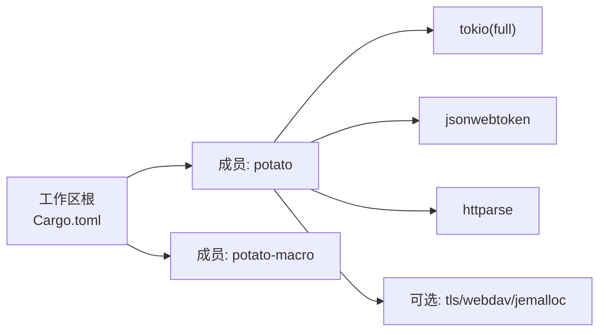

# 部署运维

<cite>
**本文引用的文件**
- [Cargo.toml](file://Cargo.toml)
- [README.md](file://README.md)
- [.github/workflows/rust.yml](file://.github/workflows/rust.yml)
- [potato/Cargo.toml](file://potato/Cargo.toml)
- [potato/src/lib.rs](file://potato/src/lib.rs)
- [potato/src/server.rs](file://potato/src/server.rs)
- [potato/src/global_config.rs](file://potato/src/global_config.rs)
- [potato/src/main.rs](file://potato/src/main.rs)
- [examples/server/00_http_server.rs](file://examples/server/00_http_server.rs)
- [examples/server/10_shutdown_server.rs](file://examples/server/10_shutdown_server.rs)
- [examples/server/13_reverse_proxy_server.rs](file://examples/server/13_reverse_proxy_server.rs)
</cite>

## 目录
1. [简介](#简介)
2. [项目结构](#项目结构)
3. [核心组件](#核心组件)
4. [架构总览](#架构总览)
5. [详细组件分析](#详细组件分析)
6. [依赖关系分析](#依赖关系分析)
7. [性能考量](#性能考量)
8. [故障排查指南](#故障排查指南)
9. [结论](#结论)
10. [附录](#附录)

## 简介
本指南面向使用 Potato 框架进行生产级部署与运维的工程团队，围绕容器化部署（Docker/Kubernetes）、生产环境配置（环境变量、配置分离、密钥管理）、高可用与负载均衡（反向代理、健康检查、故障转移）、监控与日志、备份与恢复、以及自动化运维（CI/CD、滚动更新）等方面，提供系统化的落地建议与最佳实践。由于仓库中未包含容器编排或监控告警等具体配置文件，本文在这些部分以通用工程实践为主，并结合框架能力给出可操作的步骤与注意事项。

## 项目结构
仓库采用工作区组织方式，核心库位于 potato 子目录，宏包位于 potato-macro 子目录；示例位于 examples/server 目录；CI 流水线定义于 .github/workflows/rust.yml；根 Cargo.toml 定义了工作区成员。

图表来源
- [Cargo.toml](file://Cargo.toml#L1-L4)
- [potato/Cargo.toml](file://potato/Cargo.toml#L1-L76)
- [.github/workflows/rust.yml](file://.github/workflows/rust.yml#L1-L23)

章节来源
- [Cargo.toml](file://Cargo.toml#L1-L4)
- [README.md](file://README.md#L1-L57)
- [.github/workflows/rust.yml](file://.github/workflows/rust.yml#L1-L23)

## 核心组件
- HTTP 服务器与路由管线：通过 HttpServer 和 PipeContext 提供中间件式路由处理、静态资源嵌入、反向代理、OpenAPI 文档、WebDAV、Jemalloc 分析等能力。
- 全局配置与鉴权：提供运行时可修改的 JWT 密钥、WebSocket 心跳周期等配置项，支持基于 jsonwebtoken 的签发与校验。
- 示例与入口：示例展示了基本 HTTP 服务、优雅停机、反向代理等典型场景，便于快速验证部署与集成。

章节来源
- [potato/src/server.rs](file://potato/src/server.rs#L769-L800)
- [potato/src/global_config.rs](file://potato/src/global_config.rs#L18-L63)
- [examples/server/00_http_server.rs](file://examples/server/00_http_server.rs#L1-L12)
- [examples/server/10_shutdown_server.rs](file://examples/server/10_shutdown_server.rs#L1-L22)
- [examples/server/13_reverse_proxy_server.rs](file://examples/server/13_reverse_proxy_server.rs#L1-L10)

## 架构总览
下图展示 Potato 服务器从请求进入、路由匹配、处理链路到响应返回的整体流程，以及与外部组件（反向代理、健康检查、配置中心、密钥管理）的交互关系。

图表来源
- [potato/src/server.rs](file://potato/src/server.rs#L362-L767)
- [potato/src/global_config.rs](file://potato/src/global_config.rs#L18-L63)

## 详细组件分析

### 组件一：HTTP 服务器与路由管线
- 能力概览
  - 支持注册式路由（基于注解与运行时收集），自动处理 OPTIONS/HEAD 等预置方法。
  - 中间件式处理链：支持自定义处理器、本地文件映射、嵌入资源、反向代理、WebDAV、Jemalloc 分析等。
  - TLS 可选开启，支持 OpenAPI 文档嵌入。
- 关键流程（请求处理）
  - 请求解析后进入 PipeContext 处理链，按顺序尝试 Handlers、LocationRoute、EmbeddedRoute、Custom、ReverseProxy、WebDAV 等分支。
  - 对静态资源与嵌入资源支持条件请求（ETag/304）与预检逻辑。
- 配置与扩展
  - 通过 configure 回调注入处理项，适合在启动阶段完成路由与中间件装配。
  - 可选功能通过特性开关启用（如 tls、openapi、webdav、jemalloc）。

图表来源
- [potato/src/server.rs](file://potato/src/server.rs#L362-L767)

章节来源
- [potato/src/server.rs](file://potato/src/server.rs#L28-L767)

### 组件二：全局配置与鉴权
- 运行时配置
  - JWT 密钥：支持运行时设置与读取，用于签发与校验令牌。
  - WebSocket 心跳周期：支持动态调整心跳间隔，保障长连接稳定性。
- 鉴权能力
  - 提供签发与校验 JWT 的接口，基于 jsonwebtoken 实现，支持过期时间控制。

图表来源
- [potato/src/global_config.rs](file://potato/src/global_config.rs#L18-L63)

章节来源
- [potato/src/global_config.rs](file://potato/src/global_config.rs#L1-L64)

### 组件三：示例与入口
- 基础 HTTP 服务：演示如何创建服务器并绑定端口。
- 优雅停机：通过 shutdown_signal 获取退出信号，实现平滑关闭。
- 反向代理：演示如何将全部请求转发至外部站点。

章节来源
- [examples/server/00_http_server.rs](file://examples/server/00_http_server.rs#L1-L12)
- [examples/server/10_shutdown_server.rs](file://examples/server/10_shutdown_server.rs#L1-L22)
- [examples/server/13_reverse_proxy_server.rs](file://examples/server/13_reverse_proxy_server.rs#L1-L10)
- [potato/src/main.rs](file://potato/src/main.rs#L1-L10)

## 依赖关系分析
- 工作区与成员
  - 工作区定义了 potato 与 potato-macro 两个成员，便于统一版本与发布。
- 应用库依赖
  - 使用 tokio 全特性运行时、httparse 解析、jsonwebtoken 进行鉴权、可选 TLS 与 WebDAV、jemalloc 相关特性等。
- 特性开关
  - 默认启用 openapi 与 tls；full 包含 jemalloc、openapi、ssh、tls、webdav。
- CI 任务
  - 在 ubuntu-latest 上执行构建与测试，确保主干质量。

图表来源
- [Cargo.toml](file://Cargo.toml#L1-L4)
- [potato/Cargo.toml](file://potato/Cargo.toml#L16-L76)
- [.github/workflows/rust.yml](file://.github/workflows/rust.yml#L1-L23)

章节来源
- [Cargo.toml](file://Cargo.toml#L1-L4)
- [potato/Cargo.toml](file://potato/Cargo.toml#L16-L76)
- [.github/workflows/rust.yml](file://.github/workflows/rust.yml#L1-L23)

## 性能考量
- 内存分配与分析
  - 可选启用 jemalloc 相关特性，用于内存剖析与统计；可通过内置端点导出分析结果（需配合特性启用）。
- 并发模型
  - 基于 tokio 异步运行时，建议在容器中合理设置 CPU 资源配额与亲和性，避免过度竞争。
- 网络栈
  - 启用 TLS 时注意证书与会话复用策略；反向代理侧建议开启 HTTP/2/3 与连接池优化。
- 路由与静态资源
  - 利用条件请求（ETag/304）减少带宽消耗；对大文件建议交由反向代理或 CDN 处理。

章节来源
- [potato/Cargo.toml](file://potato/Cargo.toml#L43-L76)
- [potato/src/server.rs](file://potato/src/server.rs#L569-L667)

## 故障排查指南
- 常见问题
  - 404/路由不生效：确认路由注解与路径是否匹配；检查 PipeContext 中各处理项的顺序与前缀。
  - 502/上游异常：反向代理场景下检查上游地址可达性与超时设置。
  - 401/鉴权失败：核对 JWT 密钥一致性与过期时间；确认请求头携带方式。
  - 优雅停机无效：确认 shutdown_signal 是否正确传递到处理逻辑。
- 排查步骤
  - 查看应用日志与错误码；启用健康检查端点定位存活与就绪状态。
  - 使用 curl 或浏览器开发者工具验证响应头与状态码。
  - 在反向代理侧开启访问日志，定位请求转发与超时原因。

章节来源
- [examples/server/10_shutdown_server.rs](file://examples/server/10_shutdown_server.rs#L1-L22)
- [potato/src/server.rs](file://potato/src/server.rs#L362-L767)

## 结论
本指南基于 Potato 框架的能力边界，给出了生产部署与运维的系统化建议。对于未在仓库中出现的具体配置（如 Dockerfile、K8s 清单、监控采集脚本等），读者可依据本文提供的架构视图与最佳实践，结合自身基础设施与合规要求，逐步完善落地方案。

## 附录

### A. 容器化部署方案（建议）
- Docker 镜像构建
  - 使用多阶段构建，先在构建阶段安装依赖并编译，再将产物复制到精简基础镜像。
  - 将配置文件与密钥通过只读挂载或环境变量注入，避免硬编码。
  - 暴露容器端口并与反向代理对接，禁用特权模式。
- Kubernetes 配置
  - Deployment：设置副本数、资源限制与探针；使用 PodDisruptionBudget 控制滚动更新影响。
  - Service：ClusterIP 暴露内部服务；若需对外，使用 Ingress/LoadBalancer。
  - ConfigMap：存放非敏感配置；Secret：存放密钥与证书。
  - HPA：根据 CPU/内存或自定义指标弹性扩缩容。
- 容器编排
  - 使用命名空间隔离不同环境；通过 Helm/ArgoCD 管理清单与版本。

[本节为通用工程实践，不直接分析具体源文件]

### B. 生产环境配置（建议）
- 环境变量管理
  - 使用环境变量驱动端口、日志级别、TLS 开关、上游地址等；敏感信息放入 Secret。
- 配置文件分离
  - 将业务配置与运行时配置分离；通过 ConfigMap 注入静态配置，Secret 注入密钥。
- 密钥管理
  - 使用平台密钥管理服务（如 AWS Secrets Manager、Azure Key Vault、HashiCorp Vault）；定期轮换密钥并清理历史版本。

[本节为通用工程实践，不直接分析具体源文件]

### C. 负载均衡与高可用（建议）
- 反向代理
  - Nginx/Traefik/Envoy：启用健康检查、超时与重试；开启压缩与缓存策略。
- 健康检查
  - LivenessProbe/ReadinessProbe：前者检测进程存活，后者检测服务可用。
- 故障转移
  - 多副本部署与就近调度；跨可用区部署；使用 Ingress 控制器实现灰度与蓝绿发布。

[本节为通用工程实践，不直接分析具体源文件]

### D. 监控与日志管理（建议）
- 应用监控
  - 指标采集：CPU、内存、Goroutines、请求速率、错误率、P95/P99 延迟。
  - 日志：结构化输出，区分级别；集中采集与检索。
- 性能指标收集
  - Prometheus/Grafana：暴露指标端点并可视化；结合告警规则。
- 日志聚合
  - 使用 Fluent Bit/Fluentd/Vector 收集日志，存储于 Elasticsearch/S3；通过 Kibana/QuickSight 可视化。

[本节为通用工程实践，不直接分析具体源文件]

### E. 备份与恢复策略（建议）
- 数据备份
  - 对持久化存储（数据库/对象存储）制定备份计划与恢复演练。
- 配置备份
  - 将 ConfigMap/Secret 纳入 GitOps 管理，确保可追溯与可回滚。
- 灾难恢复
  - 制定 RTO/RPO 指标；跨区域冗余与多活部署；定期进行故障演练。

[本节为通用工程实践，不直接分析具体源文件]

### F. 自动化运维（建议）
- CI/CD 流水线
  - 触发条件：主干推送与 Pull Request；步骤包括构建、测试、打包镜像、推送仓库。
  - 发布策略：GitOps（Helm/ArgoCD）或原生 K8s 部署；支持蓝绿/金丝雀发布。
- 自动化部署与滚动更新
  - 使用 Deployment 的滚动更新策略；结合探针与 PDB 控制风险。
- 滚动更新
  - 设置最大不可用与最大额外副本；在低峰时段执行，观察指标与日志。

[本节为通用工程实践，不直接分析具体源文件]