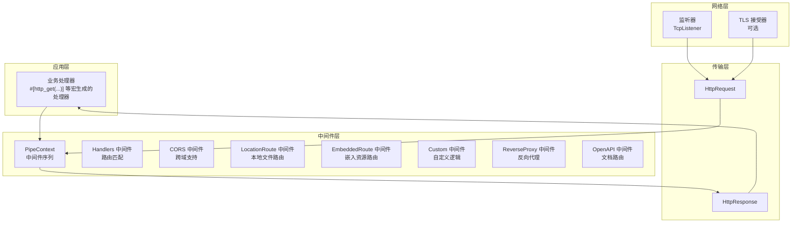
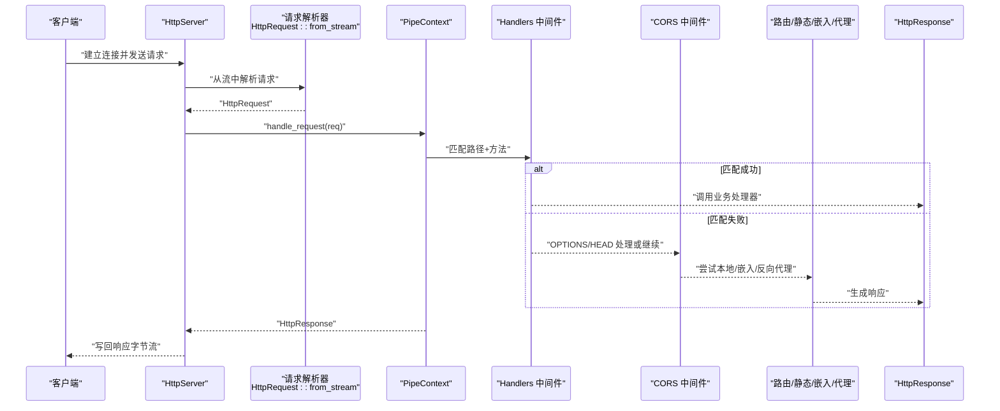
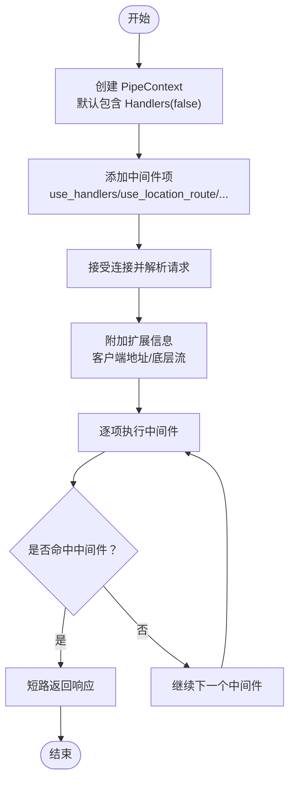
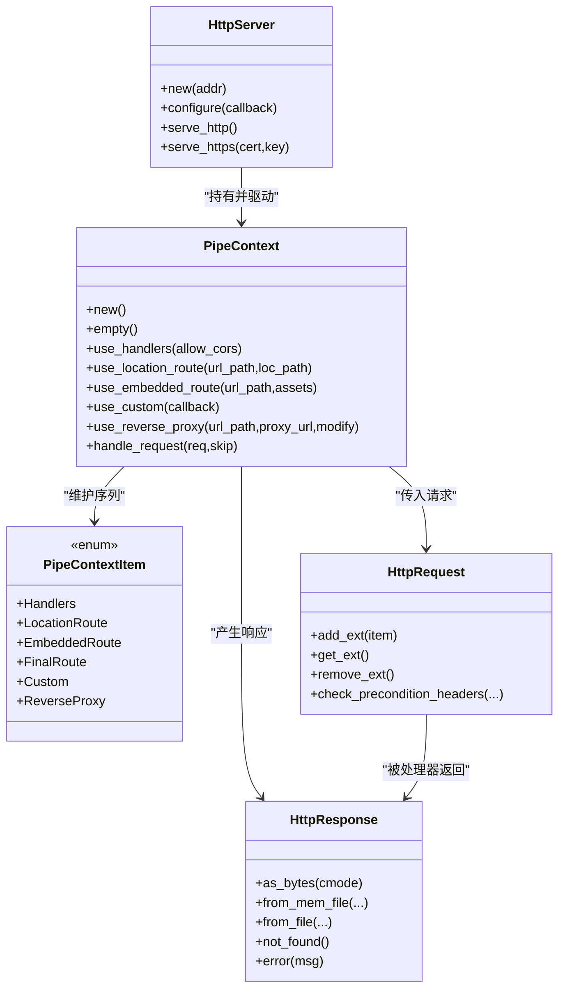

# 中间件系统

<cite>
**本文档引用的文件**
- [lib.rs](file://potato/src/lib.rs)
- [server.rs](file://potato/src/server.rs)
- [07_auth_server.rs](file://examples/server/07_auth_server.rs)
- [13_reverse_proxy_server.rs](file://examples/server/13_reverse_proxy_server.rs)
- [00_http_server.rs](file://examples/server/00_http_server.rs)
- [01_https_server.rs](file://examples/server/01_https_server.rs)
- [04_server_route.md](file://docs/en/guide/04_server_route.md)
</cite>

## 目录
1. [引言](#引言)
2. [项目结构](#项目结构)
3. [核心组件](#核心组件)
4. [架构总览](#架构总览)
5. [详细组件分析](#详细组件分析)
6. [依赖关系分析](#依赖关系分析)
7. [性能考虑](#性能考虑)
8. [故障排查指南](#故障排查指南)
9. [结论](#结论)
10. [附录](#附录)

## 引言
本文件系统性阐述 Potato 框架的中间件系统设计与实现机制，重点围绕“管道模式”展开：中间件以链式组合的方式串联执行，通过 PipeContext 维护中间件序列，实现请求从进入服务器到最终响应返回的全链路控制。文档将深入解析：
- 管道模式的实现原理（中间件链式调用、执行顺序、上下文传递）
- PipeContext 的作用与数据流转过程，以及如何在中间件中修改请求和响应
- 内置中间件的功能（日志记录、错误处理、CORS 支持、认证检查等）
- 自定义中间件的开发方法（接口定义、参数传递、异常处理）
- 性能优化策略（短路机制、缓存利用、异步处理）
- 扩展性设计与最佳实践

## 项目结构
Potato 的中间件系统主要由以下模块构成：
- 请求/响应模型：HttpRequest、HttpResponse 提供统一的数据载体与序列化能力
- 管道上下文：PipeContext 负责维护中间件序列与执行流程
- 服务器：HttpServer 接收连接、解析请求、驱动 PipeContext 执行
- 示例与文档：演示内置中间件与自定义中间件的使用方式

图表来源
- [server.rs](file://potato/src/server.rs#L362-L767)
- [lib.rs](file://potato/src/lib.rs#L385-L877)

章节来源
- [server.rs](file://potato/src/server.rs#L1-L120)
- [lib.rs](file://potato/src/lib.rs#L1-L120)

## 核心组件
- PipeContextItem：中间件项的枚举，包含多种内置中间件类型（处理器、CORS、本地路由、嵌入资源、自定义、反向代理、OpenAPI 等）
- PipeContext：持有中间件序列，提供构建与执行入口；支持 use_handlers/use_location_route/use_embedded_route/use_custom/use_reverse_proxy 等配置方法
- HttpServer：接收连接、解析请求、注入扩展信息（客户端地址、底层流），并调用 PipeContext::handle_request 驱动中间件链
- HttpRequest/HttpResponse：请求与响应的数据结构，支持头部、正文、条件预检（ETag/If-*）等

章节来源
- [server.rs](file://potato/src/server.rs#L40-L131)
- [server.rs](file://potato/src/server.rs#L362-L767)
- [lib.rs](file://potato/src/lib.rs#L385-L877)
- [lib.rs](file://potato/src/lib.rs#L889-L1202)

## 架构总览
下图展示一次请求从进入服务器到返回响应的完整链路，以及中间件在其中的职责与交互。

图表来源
- [server.rs](file://potato/src/server.rs#L826-L933)
- [server.rs](file://potato/src/server.rs#L362-L767)
- [lib.rs](file://potato/src/lib.rs#L385-L877)

## 详细组件分析

### 管道模式与中间件链
- 中间件以顺序列表的形式组织，每个中间件项根据请求路径与类型进行匹配，命中后执行相应逻辑，可能直接返回响应（短路），也可能继续下一个中间件
- 执行顺序由 PipeContext 的 items 列表决定，先添加的中间件先执行
- 关键点：
  - Handlers 中间件负责将请求分发到业务处理器
  - CORS 中间件在 OPTIONS/HEAD 等场景下快速返回
  - LocationRoute/EmbeddedRoute/ReverseProxy/OpenAPI 等中间件按 URL 前缀匹配
  - Custom 中间件可选择短路或继续后续链

章节来源
- [server.rs](file://potato/src/server.rs#L362-L767)

### PipeContext 的作用与数据流转
- PipeContext::new 默认包含 Handlers(false)，表示启用处理器匹配
- 在服务端启动时，HttpServer 将客户端地址与底层流作为扩展信息附加到 HttpRequest 上，便于后续中间件使用
- PipeContext::handle_request 逐项遍历中间件项，遇到短路返回则立即结束；否则继续

图表来源
- [server.rs](file://potato/src/server.rs#L58-L131)
- [server.rs](file://potato/src/server.rs#L826-L933)
- [server.rs](file://potato/src/server.rs#L362-L767)

章节来源
- [server.rs](file://potato/src/server.rs#L58-L131)
- [server.rs](file://potato/src/server.rs#L826-L933)

### 请求与响应的修改与传递
- 请求修改：中间件可在 req 上设置/读取头部、查询参数、正文等；HttpRequest 提供 add_ext/get_ext/remove_ext 用于在请求生命周期内携带上下文（如客户端地址、底层流）
- 响应生成：HttpResponse 提供多种便捷构造函数（html/json/text 等），并支持条件预检（ETag/If-*）与压缩输出
- 条件预检：HttpRequest::check_precondition_headers 支持 If-None-Match/If-Modified-Since/If-Match/If-Unmodified-Since，返回 304 或 412，从而实现短路与缓存控制

章节来源
- [lib.rs](file://potato/src/lib.rs#L427-L442)
- [lib.rs](file://potato/src/lib.rs#L889-L1202)
- [lib.rs](file://potato/src/lib.rs#L777-L857)

### 内置中间件功能
- Handlers 中间件：基于路径与方法查找注册的业务处理器，若未找到则处理 HEAD/OPTIONS 或继续链
- CORS 中间件：当允许 CORS 时，在 OPTIONS 请求中返回 Allow 与 Access-Control-* 头
- LocationRoute 中间件：将请求映射到本地文件系统路径，支持目录索引与条件预检
- EmbeddedRoute 中间件：将嵌入资源（如 Swagger UI）映射为内存文件响应
- Custom 中间件：用户自定义逻辑，可选择短路或继续
- ReverseProxy 中间件：将匹配前缀的请求转发至目标地址，并可选择修改内容
- OpenAPI 中间件：生成并提供 OpenAPI 文档与 UI 资源

章节来源
- [server.rs](file://potato/src/server.rs#L362-L767)

### 自定义中间件开发
- 接口定义：通过 PipeContext::use_custom 注册异步回调，签名要求接收可变 HttpRequest 并返回 Result<Option<HttpResponse>, Error>
- 参数传递：回调可读取/修改 HttpRequest，也可通过扩展机制携带额外上下文
- 异常处理：返回 Err 时，中间件会转换为错误响应；返回 Ok(None) 表示继续链；Ok(Some(res)) 表示短路返回
- 使用示例：文档提供了 use_custom 的典型用法与行为说明

章节来源
- [server.rs](file://potato/src/server.rs#L102-L113)
- [04_server_route.md](file://docs/en/guide/04_server_route.md#L84-L96)

### 认证检查与 OpenAPI 集成
- 认证：示例中展示了 JWT 签发与鉴权参数的使用，配合处理器宏的 auth_arg 属性实现认证检查
- OpenAPI：通过 use_openapi 注入文档路由与资源，自动聚合处理器元信息

章节来源
- [07_auth_server.rs](file://examples/server/07_auth_server.rs#L1-L24)
- [server.rs](file://potato/src/server.rs#L276-L331)

### 反向代理中间件
- 通过 use_reverse_proxy 注册反向代理规则，匹配前缀后将请求转发至目标地址
- 可选修改内容（如替换重定向目标路径），并在必要时更新 Content-Length

章节来源
- [13_reverse_proxy_server.rs](file://examples/server/13_reverse_proxy_server.rs#L1-L10)
- [server.rs](file://potato/src/server.rs#L115-L126)
- [server.rs](file://potato/src/server.rs#L615-L627)
- [client.rs](file://potato/src/client.rs#L414-L470)

## 依赖关系分析
- HttpServer 依赖 PipeContext 进行请求处理，依赖 HttpRequest/HttpResponse 进行编解码
- PipeContext 依赖 RequestHandlerFlag 注册的处理器集合进行路由分发
- 中间件之间通过 PipeContextItem 枚举解耦，新增中间件仅需扩展该枚举与 handle_request 分支

图表来源
- [server.rs](file://potato/src/server.rs#L769-L933)
- [server.rs](file://potato/src/server.rs#L54-L131)
- [server.rs](file://potato/src/server.rs#L362-L767)
- [lib.rs](file://potato/src/lib.rs#L385-L877)
- [lib.rs](file://potato/src/lib.rs#L889-L1202)

章节来源
- [server.rs](file://potato/src/server.rs#L769-L933)
- [server.rs](file://potato/src/server.rs#L54-L131)
- [lib.rs](file://potato/src/lib.rs#L385-L877)
- [lib.rs](file://potato/src/lib.rs#L889-L1202)

## 性能考虑
- 短路机制：在 OPTIONS/HEAD 或自定义中间件命中时直接返回，避免后续昂贵操作
- 缓存利用：条件预检（ETag/If-*）可返回 304/412，减少带宽与计算开销
- 压缩输出：HttpResponse::as_bytes 在满足条件时对响应体进行 gzip 压缩，并设置 Content-Encoding
- 异步处理：所有中间件与服务器均采用异步模型，结合 Tokio 事件循环提升并发吞吐
- Keep-Alive：根据请求头 Connection 控制连接复用，降低握手成本

章节来源
- [lib.rs](file://potato/src/lib.rs#L1068-L1108)
- [server.rs](file://potato/src/server.rs#L826-L933)
- [lib.rs](file://potato/src/lib.rs#L777-L857)

## 故障排查指南
- CORS 问题：确认是否启用 use_handlers(true) 以允许 CORS；检查 OPTIONS 响应头 Allow 与 Access-Control-* 是否正确
- 路由不生效：核对 URL 前缀匹配（LocationRoute/EmbeddedRoute/ReverseProxy），确保路径前缀一致
- 自定义中间件无响应：检查 use_custom 回调返回 Ok(None) 导致继续链；或 Err 被转换为错误响应
- 反向代理异常：确认目标地址与前缀匹配；若修改内容开启，注意 Content-Length 与 Transfer-Encoding 的一致性
- 条件预检：若期望 304/412，确认客户端发送了正确的 If-* 头部与 ETag

章节来源
- [server.rs](file://potato/src/server.rs#L362-L767)
- [lib.rs](file://potato/src/lib.rs#L777-L857)
- [client.rs](file://potato/src/client.rs#L414-L470)

## 结论
Potato 的中间件系统以 PipeContext 为核心，采用管道模式将多种中间件有序串联，既保证了灵活性（可通过 use_custom 插入任意逻辑），又提供了高性能（短路、条件预检、压缩、异步）。内置中间件覆盖了常见需求（路由、静态资源、CORS、反向代理、OpenAPI），并通过扩展机制支持认证与监控等高级特性。遵循本文的最佳实践，可构建高可维护、高性能的 HTTP 服务。

## 附录
- 快速上手示例
  - HTTP 服务器：[00_http_server.rs](file://examples/server/00_http_server.rs#L1-L12)
  - HTTPS 服务器：[01_https_server.rs](file://examples/server/01_https_server.rs#L1-L12)
  - 认证示例：[07_auth_server.rs](file://examples/server/07_auth_server.rs#L1-L24)
  - 反向代理示例：[13_reverse_proxy_server.rs](file://examples/server/13_reverse_proxy_server.rs#L1-L10)
- 文档参考
  - 自定义中间件与内存泄漏调试：[04_server_route.md](file://docs/en/guide/04_server_route.md#L84-L96)