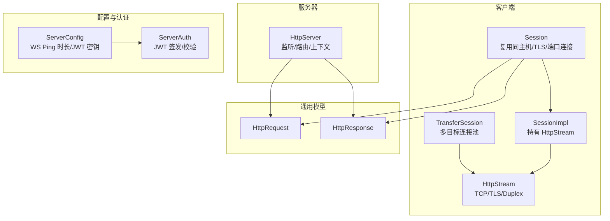
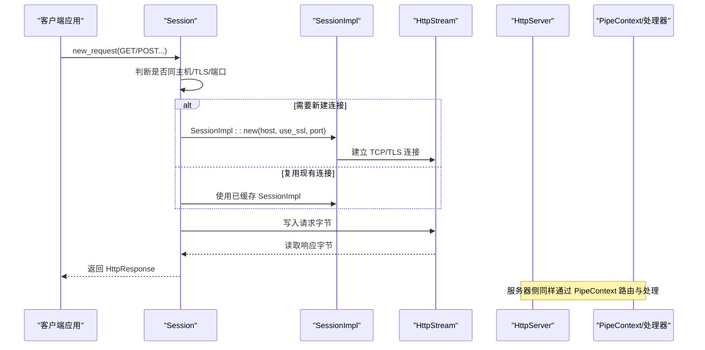
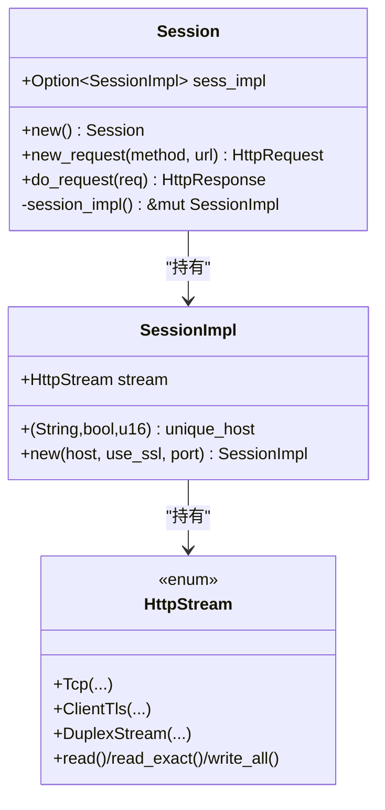
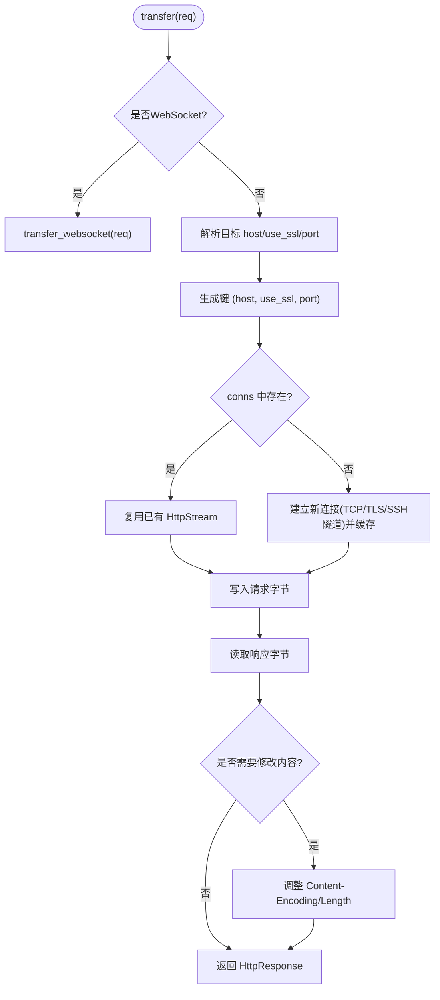
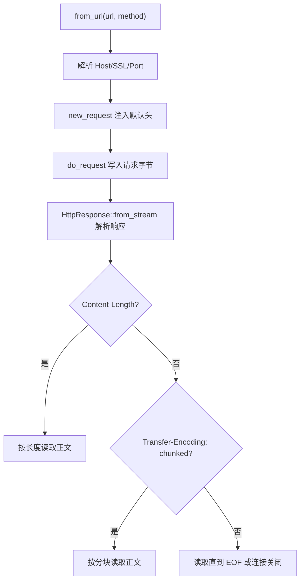
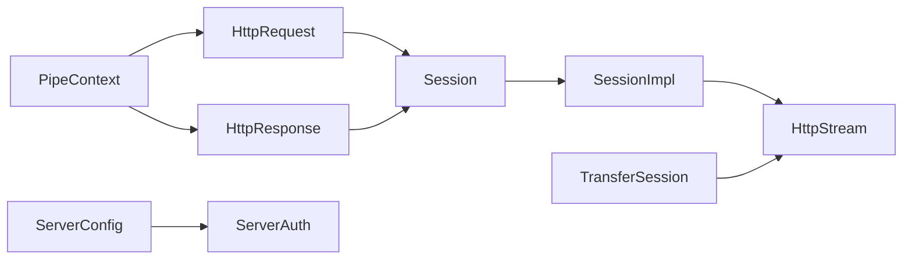

# 会话管理

<cite>
**本文引用的文件列表**
- [lib.rs](file://potato/src/lib.rs)
- [client.rs](file://potato/src/client.rs)
- [tcp_stream.rs](file://potato/src/utils/tcp_stream.rs)
- [server.rs](file://potato/src/server.rs)
- [global_config.rs](file://potato/src/global_config.rs)
- [02_client_session.rs](file://examples/client/02_client_session.rs)
- [07_auth_server.rs](file://examples/server/07_auth_server.rs)
</cite>

## 目录
1. [简介](#简介)
2. [项目结构](#项目结构)
3. [核心组件](#核心组件)
4. [架构总览](#架构总览)
5. [组件详解](#组件详解)
6. [依赖关系分析](#依赖关系分析)
7. [性能与容量控制](#性能与容量控制)
8. [故障排查指南](#故障排查指南)
9. [结论](#结论)

## 简介
本文件系统性解析 Potato 框架的会话管理系统与连接管理机制，重点覆盖：
- Session 结构设计：连接池实现、重用策略与生命周期管理
- HTTP 连接建立流程：TCP 握手、TLS 协商与 Keep-Alive 行为
- 连接池容量控制、超时设置与错误恢复策略
- 会话状态维护：Cookie 处理、认证信息传递与会话持久化
- 多线程环境下的会话安全：Arc 与 Mutex 的使用模式
- 最佳实践：资源清理、性能优化与故障处理

## 项目结构
围绕会话与连接管理的关键模块如下：
- 客户端会话与连接：client.rs 中的 Session/SessionImpl/TransferSession 以及 HttpStream 抽象
- 请求/响应模型：lib.rs 中的 HttpRequest/HttpResponse 及其解析与组装
- 服务器侧处理：server.rs 中的监听、路由与上下文传递
- TLS/网络抽象：utils/tcp_stream.rs 中的 HttpStream 枚举与读写封装
- 全局配置与认证：global_config.rs 中的 ServerConfig/ServerAuth 与 JWT

图表来源
- [client.rs](file://potato/src/client.rs#L101-L157)
- [tcp_stream.rs](file://potato/src/utils/tcp_stream.rs#L11-L73)
- [lib.rs](file://potato/src/lib.rs#L384-L586)
- [server.rs](file://potato/src/server.rs#L889-L916)
- [global_config.rs](file://potato/src/global_config.rs#L18-L63)

章节来源
- [client.rs](file://potato/src/client.rs#L101-L157)
- [tcp_stream.rs](file://potato/src/utils/tcp_stream.rs#L11-L73)
- [lib.rs](file://potato/src/lib.rs#L384-L586)
- [server.rs](file://potato/src/server.rs#L889-L916)
- [global_config.rs](file://potato/src/global_config.rs#L18-L63)

## 核心组件
- Session：面向单主机/TLS/端口的连接复用器，内部持有 SessionImpl
- SessionImpl：实际的 TCP/TLS 连接封装，包含唯一标识 (host, use_ssl, port)
- TransferSession：面向多目标的连接池，按 (host, use_ssl, port) 建立并缓存连接
- HttpStream：统一的 TCP/TLS/Duplex 流抽象，提供异步读写
- HttpRequest/HttpResponse：HTTP 请求/响应的构建与解析
- ServerConfig/ServerAuth：全局配置（如 WS Ping 间隔）与 JWT 认证工具

章节来源
- [client.rs](file://potato/src/client.rs#L62-L157)
- [tcp_stream.rs](file://potato/src/utils/tcp_stream.rs#L11-L73)
- [lib.rs](file://potato/src/lib.rs#L384-L586)
- [global_config.rs](file://potato/src/global_config.rs#L18-L63)

## 架构总览
下图展示客户端会话到服务器处理的整体调用链路，以及连接复用与 TLS 协商的关键节点。

图表来源
- [client.rs](file://potato/src/client.rs#L110-L140)
- [tcp_stream.rs](file://potato/src/utils/tcp_stream.rs#L40-L73)
- [server.rs](file://potato/src/server.rs#L889-L916)

## 组件详解

### Session 与 SessionImpl：连接复用与生命周期
- 复用策略
  - 通过比较 (host, use_ssl, port) 判断是否可复用
  - 若不可复用则创建新的 SessionImpl 并替换缓存
- 生命周期
  - Session 持有 Option<SessionImpl>
  - do_request 期间直接使用当前连接；未显式关闭连接
- 关键行为
  - new_request 自动注入 User-Agent
  - do_request 将请求写入流并从同一流读取响应

图表来源
- [client.rs](file://potato/src/client.rs#L101-L157)
- [tcp_stream.rs](file://potato/src/utils/tcp_stream.rs#L11-L73)

章节来源
- [client.rs](file://potato/src/client.rs#L101-L157)

### TransferSession：多目标连接池与转发
- 设计要点
  - 以 (host, use_ssl, port) 为键缓存 HttpStream
  - 支持通过 SSH Jumpbox 建立隧道
  - 支持正向/反向代理场景，自动处理 Host、Content-Length、Transfer-Encoding 等
- 连接建立
  - 首次访问某目标时创建连接（TCP 或 TLS），并缓存
  - 后续请求直接复用缓存连接
- 错误处理
  - 代理失败返回错误，WebSocket 场景中选择任一方向断开即结束

图表来源
- [client.rs](file://potato/src/client.rs#L224-L592)

章节来源
- [client.rs](file://potato/src/client.rs#L224-L592)

### HttpStream：统一的网络抽象
- 提供统一的异步读写接口，屏蔽底层 TCP/TLS/Duplex 差异
- 用于客户端与服务器侧的流操作
- 服务器侧在监听循环中将每个连接包装为 Arc<Mutex<HttpStream>>，确保并发安全

章节来源
- [tcp_stream.rs](file://potato/src/utils/tcp_stream.rs#L11-L73)
- [server.rs](file://potato/src/server.rs#L889-L916)

### 请求/响应模型：构建与解析
- HttpRequest
  - 支持从 URL 解析方法、路径、查询参数与 Host
  - 支持多种 Content-Type 的请求体解析（JSON、表单、multipart）
  - 支持 WebSocket 升级检测与握手
- HttpResponse
  - 支持从流中解析头部与正文（支持 Content-Length 与分块传输）
  - 提供便捷的头部访问与压缩处理

图表来源
- [lib.rs](file://potato/src/lib.rs#L465-L586)
- [lib.rs](file://potato/src/lib.rs#L1110-L1171)

章节来源
- [lib.rs](file://potato/src/lib.rs#L465-L586)
- [lib.rs](file://potato/src/lib.rs#L1110-L1171)

### 服务器侧会话上下文与并发
- 服务器在监听循环中为每个连接创建 Arc<Mutex<HttpStream>>，并在请求处理前将 SocketAddr 与流本身作为扩展附加到 HttpRequest
- PipeContext 负责路由与处理器链的执行，支持 CORS、嵌入资源、反向代理等中间件

章节来源
- [server.rs](file://potato/src/server.rs#L889-L916)
- [lib.rs](file://potato/src/lib.rs#L581-L586)

### 认证与会话持久化
- ServerConfig 提供全局配置项：JWT 密钥与 WebSocket Ping 间隔
- ServerAuth 提供 JWT 签发与校验，配合示例服务演示认证流程
- 示例中通过设置 JWT 密钥并提供签发与校验接口，便于在路由中进行鉴权

章节来源
- [global_config.rs](file://potato/src/global_config.rs#L18-L63)
- [07_auth_server.rs](file://examples/server/07_auth_server.rs#L1-L24)

## 依赖关系分析
- Session 依赖 HttpRequest/HttpResponse 与 HttpStream
- TransferSession 独立于 Session，但共享 HttpStream 抽象
- 服务器侧通过 PipeContext 串联路由与处理器，并将 SocketAddr/HttpStream 作为扩展注入请求
- 全局配置模块为认证与 WebSocket 行为提供运行时参数

图表来源
- [client.rs](file://potato/src/client.rs#L101-L157)
- [client.rs](file://potato/src/client.rs#L224-L592)
- [lib.rs](file://potato/src/lib.rs#L384-L586)
- [server.rs](file://potato/src/server.rs#L889-L916)
- [global_config.rs](file://potato/src/global_config.rs#L18-L63)

章节来源
- [client.rs](file://potato/src/client.rs#L101-L157)
- [client.rs](file://potato/src/client.rs#L224-L592)
- [lib.rs](file://potato/src/lib.rs#L384-L586)
- [server.rs](file://potato/src/server.rs#L889-L916)
- [global_config.rs](file://potato/src/global_config.rs#L18-L63)

## 性能与容量控制
- 连接复用
  - Session 与 TransferSession 均通过“主机+协议+端口”键进行连接复用，减少重复握手成本
- 连接池容量
  - 当前实现为每键一个连接；未见显式的最大连接数限制
  - 建议：在高并发场景下，可根据业务需求引入连接池上限与回收策略
- 超时与保活
  - 代码未显式设置 TCP/TLS 超时或 Keep-Alive 参数
  - WebSocket Ping 间隔可通过 ServerConfig 设置，默认约 60 秒
- 压缩与解析
  - 请求体解析支持 JSON、表单与 multipart，响应体支持 gzip 解压与压缩
- 并发安全
  - 服务器侧使用 Arc<Mutex<HttpStream>> 包装连接，避免并发读写冲突
  - 客户端侧 SessionImpl 的 HttpStream 未加锁，需确保单线程使用或外部同步

章节来源
- [client.rs](file://potato/src/client.rs#L110-L140)
- [client.rs](file://potato/src/client.rs#L327-L473)
- [global_config.rs](file://potato/src/global_config.rs#L28-L34)
- [server.rs](file://potato/src/server.rs#L889-L916)

## 故障排查指南
- 连接失败
  - TLS 非启用构建下访问 HTTPS 会报错；请启用相应特性或改用 HTTP
  - SSH 隧道失败：检查 Jumpbox 凭据与网络可达性
- 响应解析异常
  - Content-Length 与分块传输混合或不一致会导致解析错误
  - 建议：确保上游服务器正确设置 Content-Length 或使用分块传输
- WebSocket 异常
  - Ping 超时导致连接被主动关闭；可通过 ServerConfig 调整 Ping 间隔
  - 任一侧发送/接收错误即终止双向转发
- 并发问题
  - 服务器侧对每个连接使用互斥锁保护；客户端侧若跨任务共享 SessionImpl，需自行保证串行化

章节来源
- [client.rs](file://potato/src/client.rs#L87-L89)
- [client.rs](file://potato/src/client.rs#L336-L381)
- [lib.rs](file://potato/src/lib.rs#L1110-L1171)
- [global_config.rs](file://potato/src/global_config.rs#L28-L34)
- [server.rs](file://potato/src/server.rs#L889-L916)

## 结论
- Potato 的会话管理以“按目标键复用连接”为核心，Session 与 TransferSession 分别覆盖单目标与多目标场景
- HttpStream 抽象统一了 TCP/TLS/Duplex 的读写，简化了上层逻辑
- 服务器侧通过 PipeContext 与扩展机制实现灵活的路由与中间件组合
- 认证方面提供 JWT 工具与配置入口，WebSocket Ping 间隔可调
- 建议在生产环境中补充连接池上限、超时与健康检查机制，并在客户端侧对共享连接进行串行化或使用独立 Session 实例